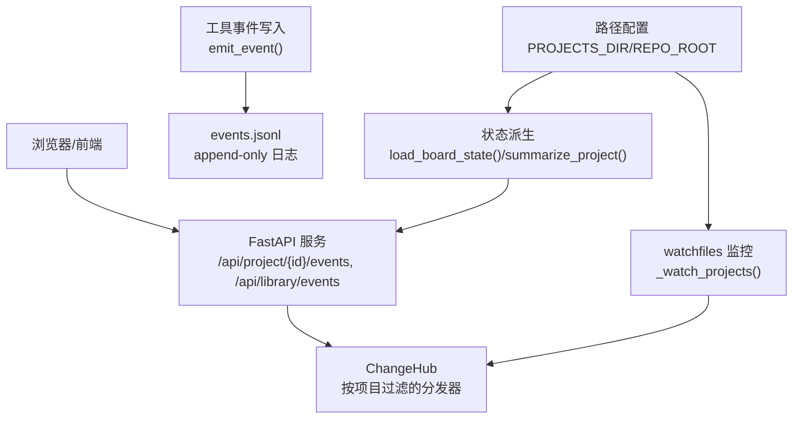
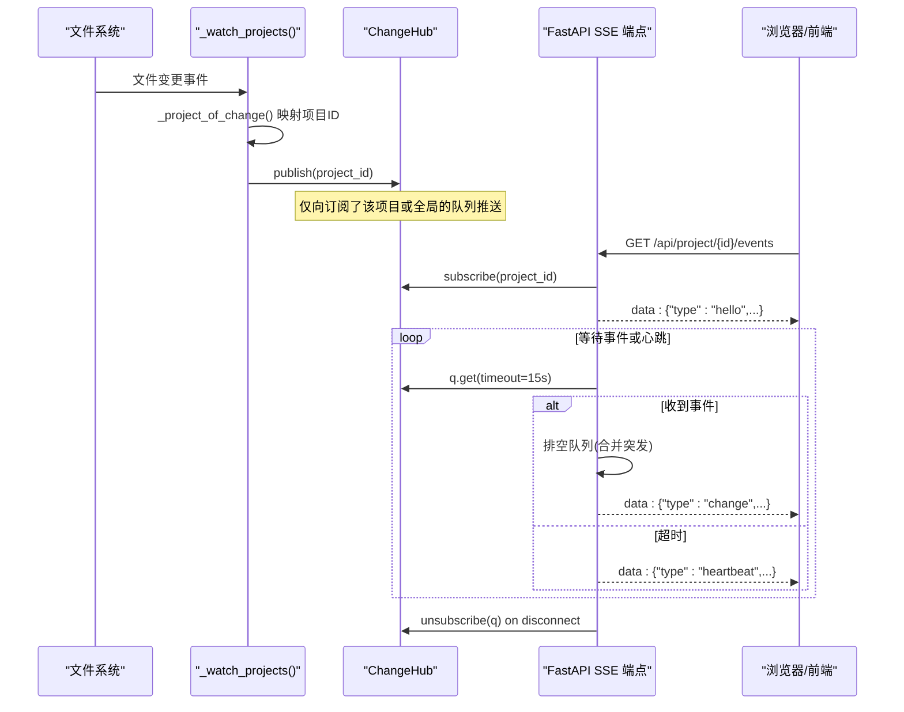
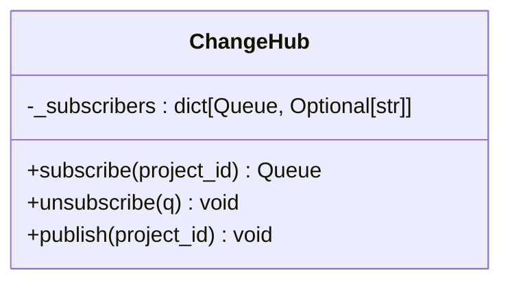
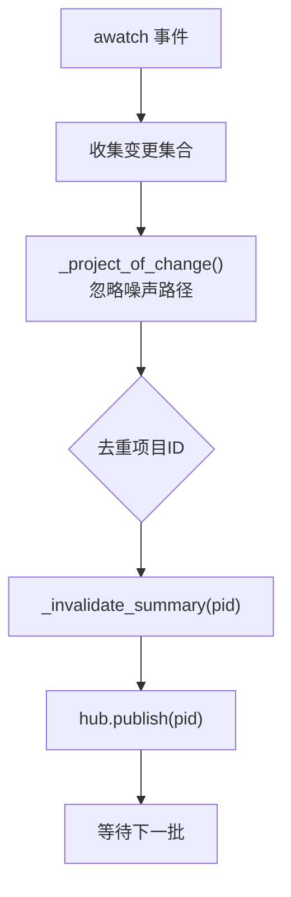
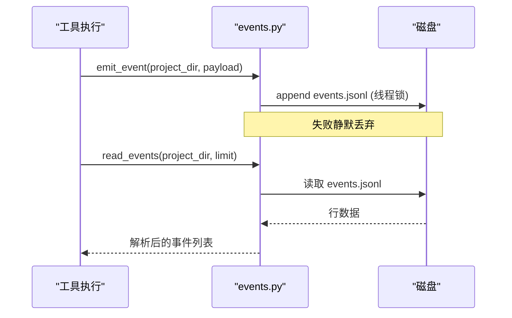
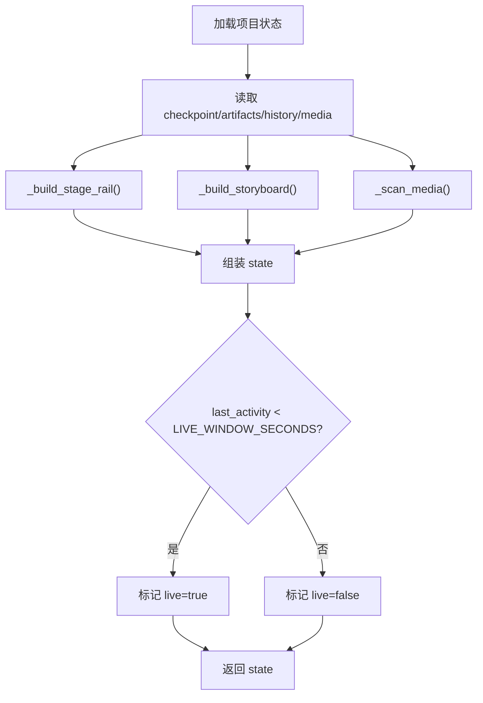
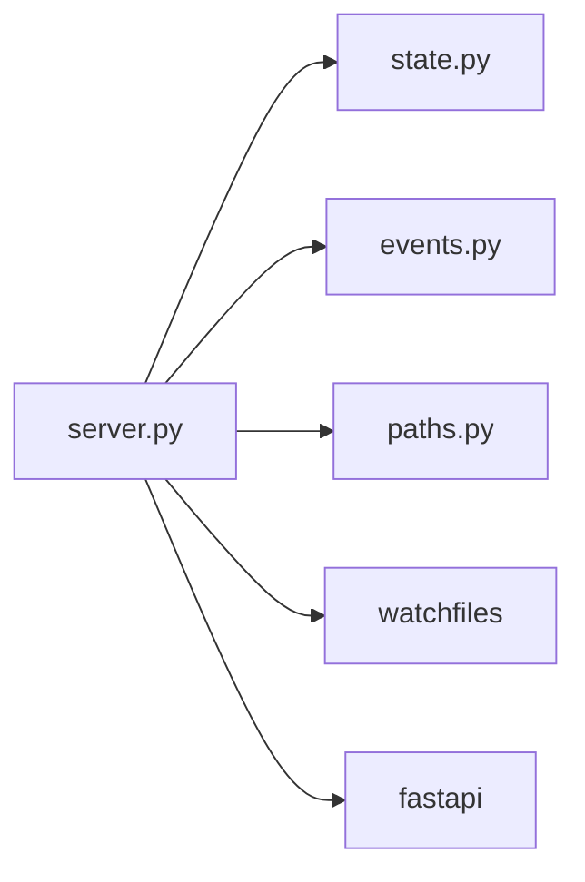

# 事件系统

<cite>
**本文引用的文件**
- [server.py](file://backlot/server.py)
- [state.py](file://backlot/state.py)
- [events.py](file://lib/events.py)
- [paths.py](file://lib/paths.py)
- [__main__.py](file://backlot/__main__.py)
- [__init__.py](file://backlot/__init__.py)
</cite>

## 目录
1. [简介](#简介)
2. [项目结构](#项目结构)
3. [核心组件](#核心组件)
4. [架构总览](#架构总览)
5. [详细组件分析](#详细组件分析)
6. [依赖关系分析](#依赖关系分析)
7. [性能考量](#性能考量)
8. [故障排查指南](#故障排查指南)
9. [结论](#结论)
10. [附录：扩展指南](#附录：扩展指南)

## 简介
本技术文档聚焦 Backlot 的事件系统，该系统基于 Server-Sent Events（SSE）实现生产看板与后端之间的实时通信。核心能力包括：
- 文件系统变更监听与去重聚合
- 事件发布/订阅（ChangeHub）
- SSE 连接管理、心跳保活与批量合并
- 项目状态派生与缓存
- 工具事件日志的追加式记录与读取

该设计遵循“只读观察、永不阻塞、永不崩溃”的原则，确保在管线运行期间提供低开销、高可用的实时反馈。

## 项目结构
Backlot 事件系统主要分布在以下模块：
- backlot/server.py：FastAPI 应用、SSE 端点、ChangeHub 实现、文件监控任务
- backlot/state.py：项目状态派生、摘要计算、媒体扫描、故事板组装
- lib/events.py：工具事件追加与读取（append-only 日志）
- lib/paths.py：仓库根与项目根路径的统一来源
- backlot/__main__.py：CLI 启动与服务进程管理
- backlot/__init__.py：默认端口等常量



图表来源
- [server.py:43-74](file://backlot/server.py#L43-L74)
- [server.py:132-149](file://backlot/server.py#L132-L149)
- [events.py:77-119](file://lib/events.py#L77-L119)
- [state.py:588-658](file://backlot/state.py#L588-L658)
- [paths.py:13-18](file://lib/paths.py#L13-L18)

章节来源
- [server.py:1-369](file://backlot/server.py#L1-L369)
- [state.py:1-716](file://backlot/state.py#L1-L716)
- [events.py:1-119](file://lib/events.py#L1-L119)
- [paths.py:1-18](file://lib/paths.py#L1-L18)
- [__main__.py:1-110](file://backlot/__main__.py#L1-L110)
- [__init__.py:1-17](file://backlot/__init__.py#L1-L17)

## 核心组件
- ChangeHub：项目级事件分发中心，维护每个订阅者的队列，支持按项目过滤广播，避免无关项目风暴影响特定订阅者。
- SSE 流处理器：为项目或库级别提供 hello/heartbeat/change 三类消息；具备超时心跳、队列排空合并、断连清理。
- 文件监控器：使用 watchfiles 异步监听 projects 目录，将变更映射到项目并去重后通知 ChangeHub。
- 事件日志：append-only 的 events.jsonl，线程安全追加，容错读取。
- 状态派生：从 checkpoint、artifacts、history、media 等文件派生出完整的 BoardState，并提供轻量摘要用于列表页。

章节来源
- [server.py:43-74](file://backlot/server.py#L43-L74)
- [server.py:183-240](file://backlot/server.py#L183-L240)
- [server.py:132-149](file://backlot/server.py#L132-L149)
- [events.py:77-119](file://lib/events.py#L77-L119)
- [state.py:588-658](file://backlot/state.py#L588-L658)

## 架构总览
下图展示了从文件系统变更到前端更新的端到端流程：



图表来源
- [server.py:132-149](file://backlot/server.py#L132-L149)
- [server.py:183-240](file://backlot/server.py#L183-L240)
- [server.py:43-74](file://backlot/server.py#L43-L74)

## 详细组件分析

### ChangeHub：事件分发与队列管理
- 订阅模型：每个 SSE 连接创建独立 asyncio.Queue（容量上限），可选绑定 project_id 进行过滤。
- 发布策略：遍历所有订阅者，若订阅者指定了项目且与当前项目不一致则跳过；否则尝试入队，满队时丢弃（已保证至少一次唤醒）。
- 并发控制：队列本身是线程安全的，配合 FastAPI 的异步请求处理，避免阻塞。



图表来源
- [server.py:43-74](file://backlot/server.py#L43-L74)

章节来源
- [server.py:43-74](file://backlot/server.py#L43-L74)

### SSE 连接管理与消息格式
- 端点：
  - /api/project/{project_id}/events：项目级事件流
  - /api/library/events：全局事件流（用于库视图）
- 消息类型：
  - hello：连接建立时的握手，携带 project_id（项目流）
  - heartbeat：心跳，防止代理/浏览器超时，携带时间戳
  - change：变更通知，携带 project_id
- 批处理：收到事件后循环排空队列，将突发合并为单次 change，降低前端刷新频率。
- 连接生命周期：is_disconnected 检测断开，finally 中取消订阅释放资源。

```mermaid
flowchart TD
Start(["SSE 连接建立"]) --> Hello["发送 hello"]
Hello --> Loop{"等待事件或心跳"}
Loop --> |q.get(timeout)| GotEvent{"有事件?"}
GotEvent --> |是| Drain["排空队列(合并突发)"]
Drain --> SendChange["发送 change"]
SendChange --> Loop
GotEvent --> |否| Heartbeat["发送 heartbeat"]
Heartbeat --> Loop
Loop --> |断开| End(["关闭连接并取消订阅"])
```

图表来源
- [server.py:183-240](file://backlot/server.py#L183-L240)

章节来源
- [server.py:183-240](file://backlot/server.py#L183-L240)

### 文件系统监控与变更聚合
- 监控器：_watch_projects() 使用 watchfiles 异步监听 projects 目录，step 批量读取变更。
- 路径映射：_project_of_change() 将变更路径归一化并排除噪声目录（node_modules、.git、__pycache__、.cache），返回项目 ID。
- 去重与失效：对同一批次内重复项目去重，调用 _invalidate_summary(pid) 清除摘要缓存，再 hub.publish(pid)。



图表来源
- [server.py:111-149](file://backlot/server.py#L111-L149)

章节来源
- [server.py:111-149](file://backlot/server.py#L111-L149)

### 工具事件日志（events.jsonl）
- 写入：emit_event() 以 append 模式写入 events.jsonl，线程锁保护单行写入，异常吞掉不中断业务。
- 读取：read_events() 逐行解析 JSON，跳过损坏行，支持 limit 限制读取条数。
- 项目归属：infer_project_dir() 根据输入参数推断项目目录，仅允许位于 PROJECTS_DIR 下的路径被识别。



图表来源
- [events.py:46-119](file://lib/events.py#L46-L119)

章节来源
- [events.py:1-119](file://lib/events.py#L1-L119)

### 项目状态派生与缓存
- load_board_state()：读取 marker/meta/checkpoints/history/artifacts/media，构建 stages、storyboard、cost、live 等字段。
- summarize_project()：轻量摘要，用于库列表，包含 active_stage、awaiting_human、stage_states、completed_count 等。
- 缓存策略：_cached_summaries() 对每个项目缓存摘要，变更时通过 _invalidate_summary() 失效。



图表来源
- [state.py:588-658](file://backlot/state.py#L588-L658)
- [state.py:661-683](file://backlot/state.py#L661-L683)

章节来源
- [state.py:588-683](file://backlot/state.py#L588-L683)

## 依赖关系分析
- server.py 依赖：
  - backlot.state：项目状态与摘要
  - lib.events：事件日志读写
  - lib.paths：统一路径源
  - watchfiles：文件系统监控
  - fastapi：HTTP/SSE 服务
- 关键耦合点：
  - ChangeHub 作为中央扇出器，连接监控器与 SSE 端点
  - 监控器与状态缓存通过项目 ID 解耦
  - 事件日志与状态派生通过文件约定解耦



图表来源
- [server.py:1-369](file://backlot/server.py#L1-L369)
- [state.py:1-716](file://backlot/state.py#L1-L716)
- [events.py:1-119](file://lib/events.py#L1-L119)
- [paths.py:1-18](file://lib/paths.py#L1-L18)

章节来源
- [server.py:1-369](file://backlot/server.py#L1-L369)
- [state.py:1-716](file://backlot/state.py#L1-L716)
- [events.py:1-119](file://lib/events.py#L1-L119)
- [paths.py:1-18](file://lib/paths.py#L1-L18)

## 性能考量
- 事件批处理：SSE 端点在收到事件后循环排空队列，将突发合并为单次 change，减少前端刷新次数。
- 连接池管理：每个连接持有独立队列，容量有限（maxsize=64），满队丢弃多余通知，避免内存膨胀。
- 内存泄漏防护：连接断开时立即取消订阅，移除队列引用；监控任务在 lifespan 中统一启停，避免僵尸协程。
- 文件系统监控优化：
  - 使用 step 批量读取变更，减少 I/O 抖动
  - 路径归一化与忽略目录集合，避免无效触发
  - 摘要缓存与失效机制，避免频繁全量解析
- 事件日志：
  - append-only 写入，线程锁保护单行，避免竞争
  - 读取时容忍损坏行，保障鲁棒性
- 建议：
  - 在高吞吐场景下可考虑增加队列容量或引入背压策略
  - 对超大项目可进一步缩小监控范围或采用增量索引
  - 定期清理缩略图缓存与历史事件，防止磁盘增长

## 故障排查指南
- 无事件推送：
  - 检查 watchfiles 是否可用（导入失败会直接 return）
  - 确认 PROJECTS_DIR 存在且包含有效项目目录
  - 验证 _project_of_change() 是否正确映射项目 ID（忽略噪声目录）
- 前端长时间无响应：
  - 检查 SSE 心跳是否正常（timeout=15s）
  - 确认浏览器未缓存 text/event-stream（服务端已设置 no-cache）
- 状态不更新：
  - 检查摘要缓存是否被正确失效（_invalidate_summary）
  - 查看 load_board_state() 是否抛出异常并被吞掉（设计如此，需检查日志）
- 事件丢失：
  - events.jsonl 可能因并发写入出现撕裂行，read_events() 会跳过损坏行
  - 关注 emit_event() 的异常吞掉逻辑，必要时增加外部监控

章节来源
- [server.py:132-149](file://backlot/server.py#L132-L149)
- [server.py:183-240](file://backlot/server.py#L183-L240)
- [events.py:77-119](file://lib/events.py#L77-L119)
- [state.py:588-658](file://backlot/state.py#L588-L658)

## 结论
Backlot 事件系统以 ChangeHub 为核心，结合文件系统监控与 SSE 流，实现了高效、可靠的项目变更通知。其设计强调：
- 低侵入：只读观察，不修改项目状态
- 高鲁棒：异常吞掉、降级显示、永不阻塞
- 可扩展：事件类型与处理器易于扩展，支持自定义事件与处理器

## 附录：扩展指南

### 添加自定义事件类型
- 在 events.py 中定义新的事件结构（例如新增 type 字段），并在 emit_event() 中附加必要上下文。
- 在 state.py 的 _build_storyboard() 或相关逻辑中消费新事件，更新 UI 所需的状态。
- 如需在前端展示，可在 SSE 流中透传新事件类型，或在 change 消息中附带额外字段。

章节来源
- [events.py:77-119](file://lib/events.py#L77-L119)
- [state.py:403-495](file://backlot/state.py#L403-L495)

### 开发事件处理器
- 在 server.py 中扩展 ChangeHub.publish() 的逻辑，或新增专用分发器，针对特定事件类型路由到不同处理器。
- 在 SSE 端点中按需注入新事件类型，保持 hello/heartbeat/change 的稳定契约。
- 对于耗时处理，建议使用后台任务或消息队列，避免阻塞 SSE 流。

章节来源
- [server.py:43-74](file://backlot/server.py#L43-L74)
- [server.py:183-240](file://backlot/server.py#L183-L240)

### 错误处理机制
- 事件写入失败静默丢弃，不影响主流程；读取时跳过损坏行。
- 状态派生过程中任何异常均被捕获，返回降级状态，确保看板可用。
- 建议在关键路径增加指标采集（如事件写入失败计数、SSE 连接数、队列长度分布）。

章节来源
- [events.py:77-119](file://lib/events.py#L77-L119)
- [state.py:588-658](file://backlot/state.py#L588-L658)

### 性能优化最佳实践
- 事件批处理：已在 SSE 端点实现队列排空合并，可根据负载调整 timeout 与队列大小。
- 连接池管理：每个连接独立队列，注意监控连接数与内存占用；必要时引入连接上限与空闲回收。
- 内存泄漏防护：确保 finally 中取消订阅；监控任务随 lifespan 停止；定期清理缩略图缓存。
- 文件系统监控：合理设置 watchfiles 的 step 与 ignore_patterns；对超大项目考虑分片监控。
- 日志轮转：对 events.jsonl 实施轮转策略，避免无限增长。

章节来源
- [server.py:183-240](file://backlot/server.py#L183-L240)
- [server.py:325-365](file://backlot/server.py#L325-L365)
- [events.py:77-119](file://lib/events.py#L77-L119)