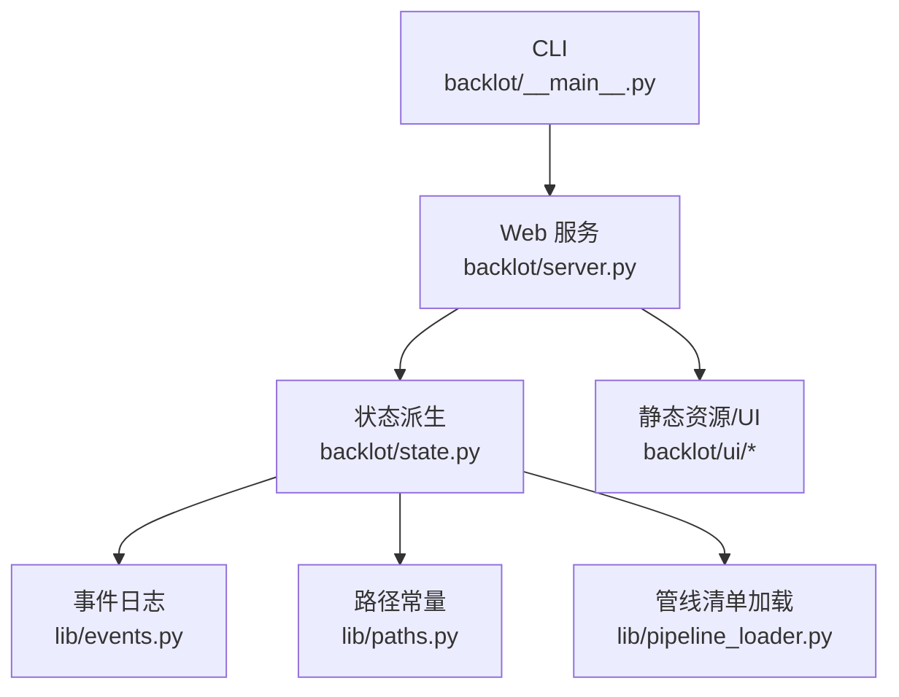
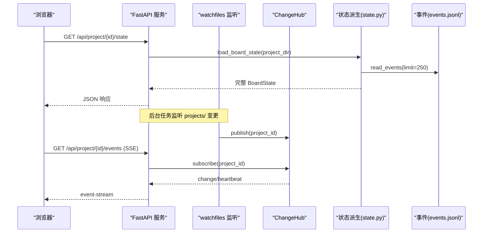
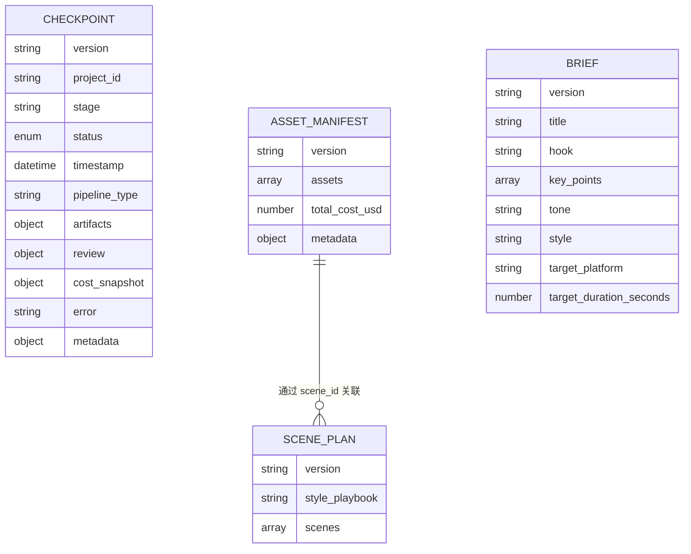
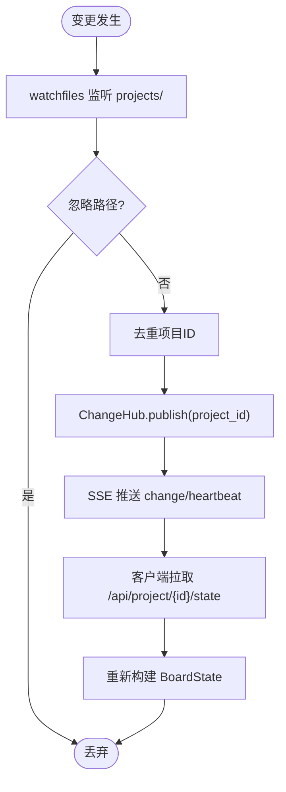
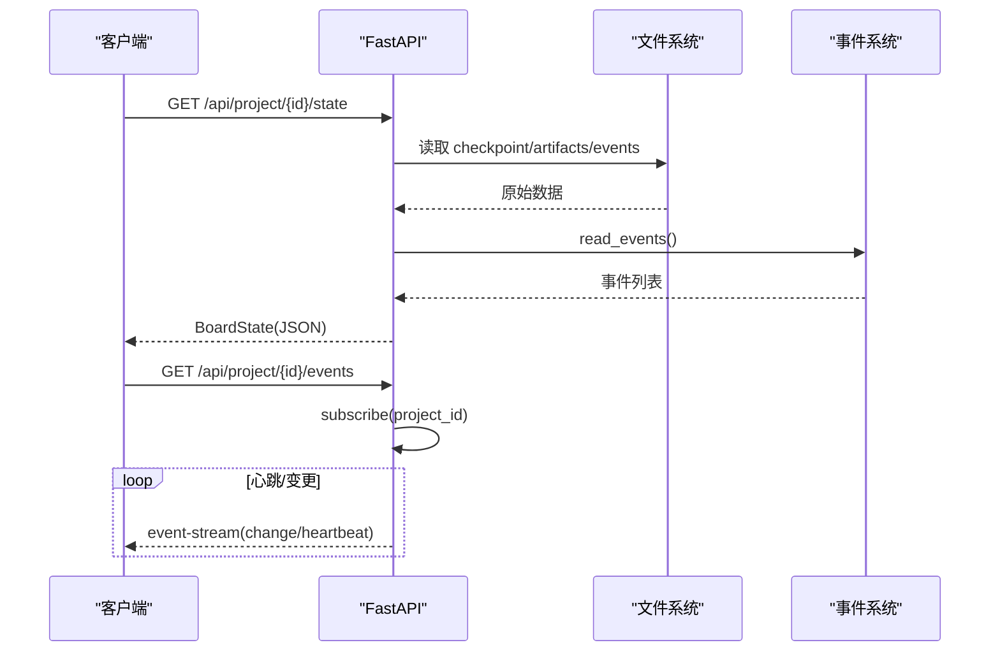
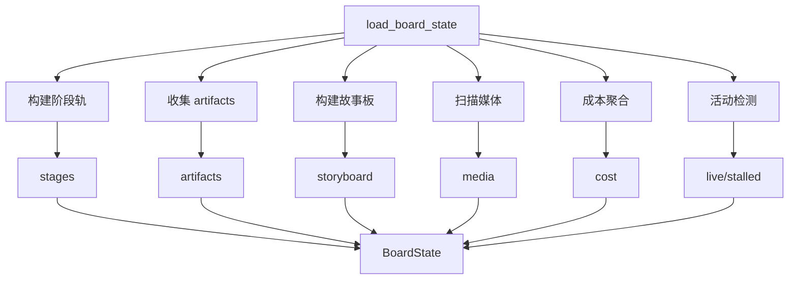
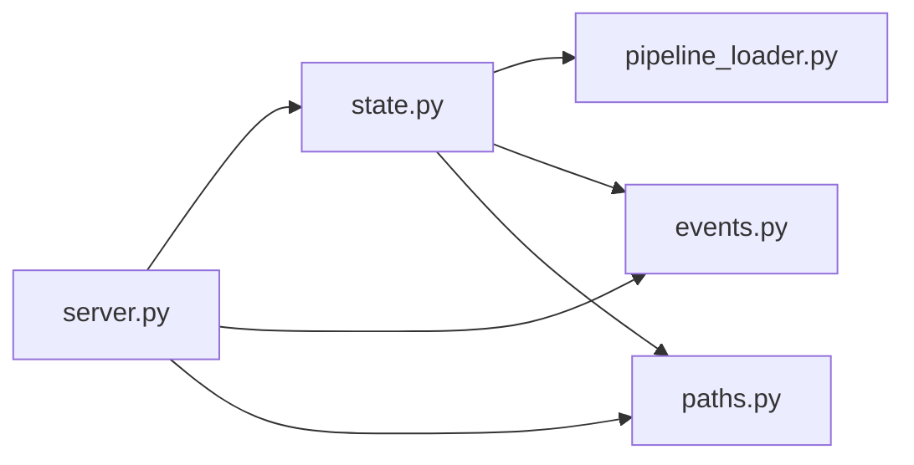

# 状态管理系统

<cite>
**本文引用的文件**
- [backlot/state.py](file://backlot/state.py)
- [backlot/server.py](file://backlot/server.py)
- [backlot/__main__.py](file://backlot/__main__.py)
- [backlot/README.md](file://backlot/README.md)
- [lib/events.py](file://lib/events.py)
- [lib/paths.py](file://lib/paths.py)
- [lib/pipeline_loader.py](file://lib/pipeline_loader.py)
- [schemas/checkpoints/checkpoint.schema.json](file://schemas/checkpoints/checkpoint.schema.json)
- [schemas/artifacts/asset_manifest.schema.json](file://schemas/artifacts/asset_manifest.schema.json)
- [schemas/artifacts/scene_plan.schema.json](file://schemas/artifacts/scene_plan.schema.json)
- [schemas/artifacts/brief.schema.json](file://schemas/artifacts/brief.schema.json)
</cite>

## 目录
1. [简介](#简介)
2. [项目结构](#项目结构)
3. [核心组件](#核心组件)
4. [架构总览](#架构总览)
5. [详细组件分析](#详细组件分析)
6. [依赖关系分析](#依赖关系分析)
7. [性能考虑](#性能考虑)
8. [故障排查指南](#故障排查指南)
9. [结论](#结论)
10. [附录](#附录)

## 简介
本技术文档面向 Backlot 状态管理系统，聚焦以下目标：
- 项目状态的数据结构设计：项目元数据、管道执行状态（阶段轨）、资产清单、故事板等。
- 状态持久化机制：文件系统存储、变更监听与同步、版本控制（checkpoint/history）。
- 状态查询与更新接口：RESTful API、SSE 实时事件、并发访问控制与一致性保证。
- 项目摘要生成算法：状态聚合、性能统计、质量指标计算等数据处理流程。
- 扩展指南：自定义状态字段、验证规则配置、数据迁移工具开发。
- 数据安全：权限控制、备份与恢复策略建议。

Backlot 是一个只读看板系统，通过观察 projects/<id>/ 下的 checkpoint、artifacts、events.jsonl 等文件，将生产管线运行过程可视化，并提供实时刷新能力。

**章节来源**
- [backlot/README.md:1-43](file://backlot/README.md#L1-L43)

## 项目结构
Backlot 由三部分组成：
- 状态派生层：从磁盘读取并组装 BoardState（项目状态），包括阶段轨、故事板、媒体索引、成本快照等。
- Web 服务层：FastAPI 提供 REST API、SSE 事件流、缩略图与媒体访问、UI 页面。
- CLI 入口：启动或打开看板，支持后台进程管理。

**图表来源**
- [backlot/__main__.py:1-110](file://backlot/__main__.py#L1-L110)
- [backlot/server.py:1-369](file://backlot/server.py#L1-L369)
- [backlot/state.py:1-716](file://backlot/state.py#L1-L716)
- [lib/events.py:1-119](file://lib/events.py#L1-L119)
- [lib/paths.py:1-18](file://lib/paths.py#L1-L18)
- [lib/pipeline_loader.py:1-241](file://lib/pipeline_loader.py#L1-L241)

**章节来源**
- [backlot/__main__.py:1-110](file://backlot/__main__.py#L1-L110)
- [backlot/server.py:1-369](file://backlot/server.py#L1-L369)
- [backlot/state.py:1-716](file://backlot/state.py#L1-L716)

## 核心组件
- 状态派生器（BoardState）：负责从项目目录中收集 checkpoint、history、artifacts、events，结合管线清单构建“阶段轨”和“故事板”，并输出统一的状态对象。
- 事件系统（Event Stream）：追加式事件日志 events.jsonl，用于驱动“正在生成”的闪烁状态和活动指示。
- Web 服务（FastAPI）：暴露 /api/projects、/api/project/{id}/state、/api/project/{id}/events、/thumb、/media 等端点；内置 watchfiles 监听 projects/ 变更并通过 SSE 推送。
- 管线清单加载器：加载 pipeline_defs/*.yaml，校验 schema，提供阶段顺序、是否人工审批等信息。
- 路径常量：集中定义 REPO_ROOT 与 PROJECTS_DIR，确保所有读写遵循同一根目录。

关键职责边界：
- 服务端不写入项目目录，仅读取；写入由管线工具完成。
- 状态派生对异常健壮：缺失文件或畸形 JSON 降级显示，不崩溃。

**章节来源**
- [backlot/state.py:1-716](file://backlot/state.py#L1-L716)
- [lib/events.py:1-119](file://lib/events.py#L1-L119)
- [backlot/server.py:1-369](file://backlot/server.py#L1-L369)
- [lib/pipeline_loader.py:1-241](file://lib/pipeline_loader.py#L1-L241)
- [lib/paths.py:1-18](file://lib/paths.py#L1-L18)

## 架构总览
下图展示从请求到状态返回的主流程，以及变更监听与 SSE 推送路径。

**图表来源**
- [backlot/server.py:165-240](file://backlot/server.py#L165-L240)
- [backlot/state.py:588-658](file://backlot/state.py#L588-L658)
- [lib/events.py:98-119](file://lib/events.py#L98-L119)

**章节来源**
- [backlot/server.py:165-240](file://backlot/server.py#L165-L240)
- [backlot/state.py:588-658](file://backlot/state.py#L588-L658)

## 详细组件分析

### 数据结构设计
- 项目元数据
  - project.json/meta.json：标题、创建时间、风格剧本等。
  - 管线类型：来自 marker 或 checkpoint 推断，用于加载对应 manifest。
- 管道执行状态（阶段轨）
  - 每个阶段包含：名称、是否人工门控、产出物、状态、时间戳、错误、人类审批标记、部分进度、版本数、历史轨迹。
  - 未声明阶段的兼容处理：按回退阶段顺序插入。
- 资产清单
  - asset_manifest.json：资产条目含 id、type、path、source_tool、scene_id、cost_usd、quality_score、duration_seconds、resolution 等。
  - 解析时进行路径归一化与存在性检查，区分可渲染媒体与不可渲染项。
- 故事板
  - 基于 scene_plan × script × asset_manifest 关联，生成场景卡片，包含视觉、音频、时长、是否生成中等信息。
- 成本与活动
  - cost_snapshot 取自最新 checkpoint；若无则回退到资产清单总计。
  - last_activity/live/stalled 基于 events.jsonl 与 checkpoint 修改时间判定。

**图表来源**
- [schemas/checkpoints/checkpoint.schema.json:1-47](file://schemas/checkpoints/checkpoint.schema.json#L1-L47)
- [schemas/artifacts/asset_manifest.schema.json:1-63](file://schemas/artifacts/asset_manifest.schema.json#L1-L63)
- [schemas/artifacts/scene_plan.schema.json:1-118](file://schemas/artifacts/scene_plan.schema.json#L1-L118)
- [schemas/artifacts/brief.schema.json:1-49](file://schemas/artifacts/brief.schema.json#L1-L49)

**章节来源**
- [backlot/state.py:118-224](file://backlot/state.py#L118-L224)
- [backlot/state.py:231-266](file://backlot/state.py#L231-L266)
- [backlot/state.py:403-495](file://backlot/state.py#L403-L495)
- [backlot/state.py:588-658](file://backlot/state.py#L588-L658)
- [schemas/checkpoints/checkpoint.schema.json:1-47](file://schemas/checkpoints/checkpoint.schema.json#L1-L47)
- [schemas/artifacts/asset_manifest.schema.json:1-63](file://schemas/artifacts/asset_manifest.schema.json#L1-L63)
- [schemas/artifacts/scene_plan.schema.json:1-118](file://schemas/artifacts/scene_plan.schema.json#L1-L118)
- [schemas/artifacts/brief.schema.json:1-49](file://schemas/artifacts/brief.schema.json#L1-L49)

### 状态持久化机制
- 存储位置
  - 项目根：project.json、meta.json、events.jsonl。
  - 阶段状态：checkpoint_<stage>.json 与 history/checkpoint_<stage>_N.json。
  - 产物：artifacts/*.json（如 script.json、asset_manifest.json、scene_plan.json 等）。
  - 媒体：renders/*、snapshots/*、verify/*、assets/music/*。
- 变更监听与同步
  - watchfiles 监听 projects/ 递归变化，过滤无关路径，去重后通过 ChangeHub 广播项目级变更。
  - SSE 订阅者收到 change 或 heartbeat，前端按需拉取 /api/project/{id}/state。
- 版本控制
  - 每个阶段的历史以 history/ 下带序号的文件保存；当前活跃状态在 checkpoint_*.json。
  - 阶段轨会合并历史与当前状态，形成时间线用于回放。

**图表来源**
- [backlot/server.py:132-149](file://backlot/server.py#L132-L149)
- [backlot/server.py:183-240](file://backlot/server.py#L183-L240)
- [backlot/state.py:588-658](file://backlot/state.py#L588-L658)

**章节来源**
- [backlot/server.py:132-149](file://backlot/server.py#L132-L149)
- [backlot/server.py:183-240](file://backlot/server.py#L183-L240)
- [backlot/state.py:118-142](file://backlot/state.py#L118-L142)
- [backlot/state.py:502-534](file://backlot/state.py#L502-L534)

### 状态查询与更新接口
- RESTful API
  - GET /api/health：健康检查。
  - GET /api/projects：库视图，返回各项目的轻量摘要（缓存+失效）。
  - GET /api/project/{project_id}/state：返回完整 BoardState。
  - GET /api/project/{project_id}/events：SSE 事件流（项目级）。
  - GET /api/library/events：SSE 事件流（全局）。
  - GET /thumb/{project_id}/{file_path}：缩略图（视频提取帧或图片缩放，带缓存）。
  - GET /media/{project_id}/{file_path}：媒体直出（支持 Range）。
  - GET /p/{project_id}：看板页面。
  - GET /：库页面。
- 并发与一致性
  - 状态派生为纯读操作，无写锁；事件写入使用线程锁，跨进程追加容忍损坏行。
  - SSE 心跳保活，队列满时丢弃重复通知，避免阻塞。
  - 路径安全校验：禁止越界访问项目目录外文件。
- 更新方式
  - 服务端不直接更新项目状态；由管线工具写入 checkpoint/artifacts/events。
  - 看板通过 SSE 感知变更并刷新。

**图表来源**
- [backlot/server.py:165-240](file://backlot/server.py#L165-L240)
- [backlot/server.py:310-318](file://backlot/server.py#L310-L318)
- [lib/events.py:77-119](file://lib/events.py#L77-L119)

**章节来源**
- [backlot/server.py:165-240](file://backlot/server.py#L165-L240)
- [backlot/server.py:310-318](file://backlot/server.py#L310-L318)
- [lib/events.py:77-119](file://lib/events.py#L77-L119)

### 项目摘要生成算法
- 输入
  - 项目目录、checkpoint、history、artifacts、events。
- 处理步骤
  - 加载管线清单，构建阶段轨（含门控、产出、状态、历史轨迹）。
  - 收集 artifacts，并回填 checkpoint 内嵌 artifact。
  - 构建故事板：场景×脚本×资产清单关联，计算时长、选择可视素材、标注生成中状态。
  - 扫描媒体：renders/snapshots/music，排序与筛选。
  - 成本聚合：优先采用最新 checkpoint 的 cost_snapshot，否则使用资产清单总计。
  - 活动检测：基于最后活动时间判断 live；若 in_progress 且长时间无活动，标记 stalled。
- 输出
  - summarize_project：轻量摘要（项目ID、标题、管线类型、海报、活动状态、阶段状态、完成数量、渲染数量、场景数量）。

**图表来源**
- [backlot/state.py:145-224](file://backlot/state.py#L145-L224)
- [backlot/state.py:246-266](file://backlot/state.py#L246-L266)
- [backlot/state.py:403-495](file://backlot/state.py#L403-L495)
- [backlot/state.py:502-534](file://backlot/state.py#L502-L534)
- [backlot/state.py:588-658](file://backlot/state.py#L588-L658)

**章节来源**
- [backlot/state.py:588-658](file://backlot/state.py#L588-L658)
- [backlot/state.py:661-683](file://backlot/state.py#L661-L683)

### 扩展指南
- 自定义状态字段
  - 在 checkpoint.artifacts 中添加新键值，或在 artifacts/*.json 中新增字段；BoardState 会透传未识别字段。
  - 如需在阶段轨中展示，需在 _build_stage_rail 中增加映射逻辑。
- 状态验证规则配置
  - 使用 schemas/checkpoints/checkpoint.schema.json 约束 checkpoint 结构。
  - 使用 schemas/artifacts/*.schema.json 约束产物结构；可在管线清单中启用扩展能力（custom_scripts/custom_tools 等）。
- 数据迁移工具开发
  - 参考现有读取逻辑（_read_json、_collect_checkpoints、_collect_artifacts），编写批量转换脚本，将旧格式迁移到新 schema。
  - 注意保持向后兼容：未知阶段按回退顺序插入，未知字段保留。

**章节来源**
- [backlot/state.py:118-224](file://backlot/state.py#L118-L224)
- [backlot/state.py:246-266](file://backlot/state.py#L246-L266)
- [lib/pipeline_loader.py:197-241](file://lib/pipeline_loader.py#L197-L241)
- [schemas/checkpoints/checkpoint.schema.json:1-47](file://schemas/checkpoints/checkpoint.schema.json#L1-L47)
- [schemas/artifacts/asset_manifest.schema.json:1-63](file://schemas/artifacts/asset_manifest.schema.json#L1-L63)

### 数据安全考虑
- 权限控制
  - 路径白名单：/safe_project_dir 拒绝包含 / \ : 及 . .. 的项目ID。
  - 媒体与缩略图：严格限制在项目目录内，越界返回 403。
- 数据备份
  - 建议定期归档 projects/ 目录（含 checkpoint、history、artifacts、events.jsonl、renders、snapshots）。
  - 利用 history/ 中的有序版本实现细粒度回溯。
- 恢复机制
  - 从最近 checkpoint + history 重建阶段轨；从 artifacts 恢复故事板与资产清单。
  - 事件回放：基于 events.jsonl 的时间戳与场景上下文，可重放“正在生成”状态。

**章节来源**
- [backlot/server.py:310-318](file://backlot/server.py#L310-L318)
- [backlot/server.py:244-276](file://backlot/server.py#L244-L276)
- [backlot/state.py:118-142](file://backlot/state.py#L118-L142)
- [backlot/state.py:588-658](file://backlot/state.py#L588-L658)

## 依赖关系分析
- 模块耦合
  - server.py 依赖 state.py 进行状态派生，依赖 events.py 进行事件读取，依赖 paths.py 获取根路径。
  - state.py 依赖 pipeline_loader.py 获取阶段定义与门控标志。
- 外部依赖
  - FastAPI、uvicorn、watchfiles、PIL、ffmpeg（缩略图生成）。
- 潜在循环依赖
  - 当前无循环导入；state.py 仅在请求时调用，server.py 作为入口。

**图表来源**
- [backlot/server.py:1-369](file://backlot/server.py#L1-L369)
- [backlot/state.py:1-716](file://backlot/state.py#L1-L716)
- [lib/events.py:1-119](file://lib/events.py#L1-L119)
- [lib/paths.py:1-18](file://lib/paths.py#L1-L18)
- [lib/pipeline_loader.py:1-241](file://lib/pipeline_loader.py#L1-L241)

**章节来源**
- [backlot/server.py:1-369](file://backlot/server.py#L1-L369)
- [backlot/state.py:1-716](file://backlot/state.py#L1-L716)
- [lib/events.py:1-119](file://lib/events.py#L1-L119)
- [lib/paths.py:1-18](file://lib/paths.py#L1-L18)
- [lib/pipeline_loader.py:1-241](file://lib/pipeline_loader.py#L1-L241)

## 性能考虑
- 只读与降级
  - 状态派生对缺失/畸形数据做降级处理，避免阻塞 UI。
- 缓存策略
  - 管线清单加载使用 lru_cache；库视图摘要使用内存缓存并在变更时失效。
  - 缩略图缓存至 .backlot/thumbs，减少重复转码。
- 事件批处理
  - SSE 队列合并突发通知，心跳保活，避免频繁刷新。
- 文件系统优化
  - 监听时忽略 node_modules/.git 等噪声目录；变更映射为项目ID去重。

[本节为通用性能指导，无需特定文件引用]

## 故障排查指南
- 常见问题
  - 项目不存在：/api/project/{id}/state 返回 404；检查项目ID与 PROJECTS_DIR。
  - 媒体不可用：/thumb 返回 404（无可用帧或文件不存在）；确认文件在项目目录内且可被 ffmpeg/PIL 处理。
  - SSE 无消息：确认 watchfiles 已安装且 PROJECTS_DIR 存在；检查事件写入是否成功。
  - 阶段停滞：in_progress 超过阈值会被标记 stalled；检查 events.jsonl 与 checkpoint 更新时间。
- 调试建议
  - 查看 events.jsonl 末尾记录，确认工具是否正常上报。
  - 检查 checkpoint_*.json 与 history/ 是否按预期生成。
  - 临时关闭 SSE，手动刷新 /api/project/{id}/state 定位问题。

**章节来源**
- [backlot/server.py:183-240](file://backlot/server.py#L183-L240)
- [backlot/server.py:244-276](file://backlot/server.py#L244-L276)
- [backlot/state.py:565-581](file://backlot/state.py#L565-L581)
- [lib/events.py:77-119](file://lib/events.py#L77-L119)

## 结论
Backlot 状态管理系统以“只读看板 + 实时事件”为核心，通过文件系统契约（checkpoint/artifacts/events）解耦生产管线与可视化层。其设计强调健壮性、可扩展性与安全性，适合多管线、多项目的制作环境。通过规范化的 schema 与清晰的 API/SSE 接口，团队可快速集成、扩展与维护。

[本节为总结性内容，无需特定文件引用]

## 附录
- 快速开始
  - python -m backlot open <project-id>：启动服务并打开浏览器。
  - python -m backlot serve --port 4750：前台运行服务。
- 模拟运行
  - python scripts/backlot_simulate_run.py：生成演示项目与事件。
  - python -m backlot open backlot-demo-run：查看看板。

**章节来源**
- [backlot/README.md:8-40](file://backlot/README.md#L8-L40)
- [backlot/__main__.py:55-86](file://backlot/__main__.py#L55-L86)