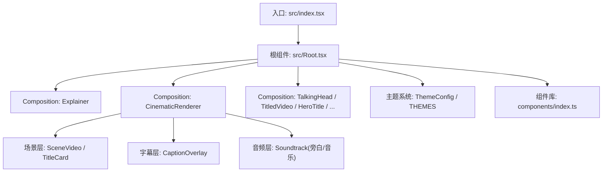
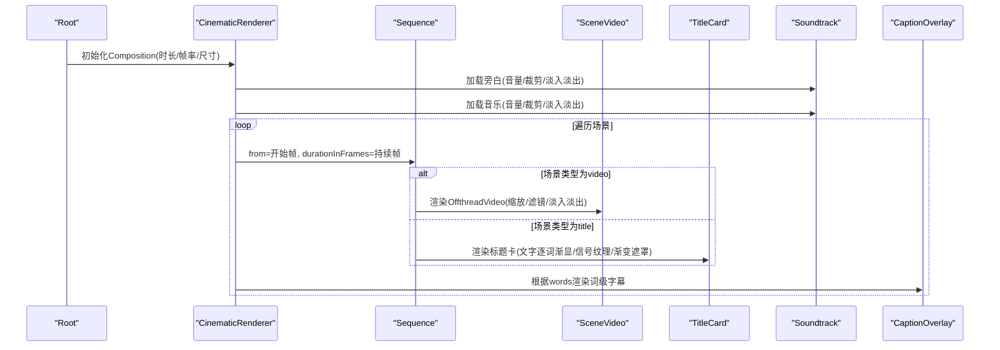
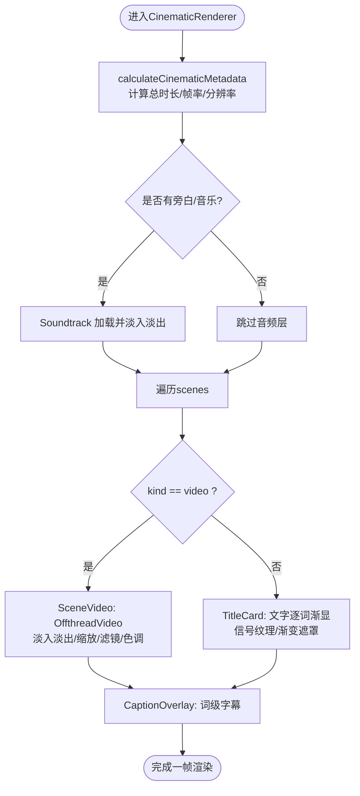
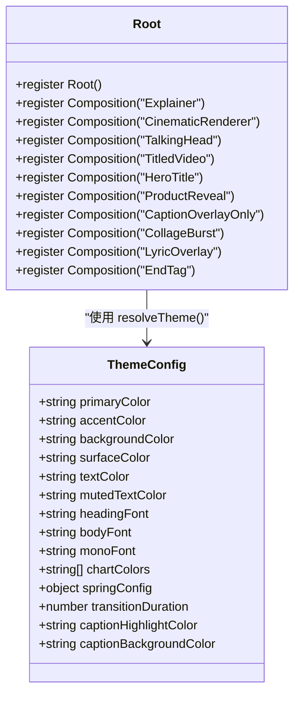
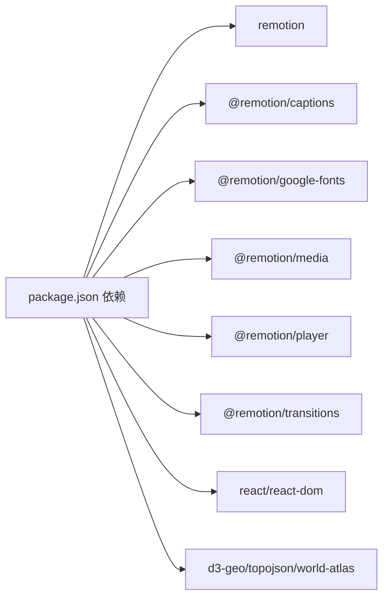

# Remotion视频合成器

<cite>
**本文引用的文件**
- [CinematicRenderer.tsx](file://remotion-composer/src/CinematicRenderer.tsx)
- [index.tsx](file://remotion-composer/src/index.tsx)
- [Root.tsx](file://remotion-composer/src/Root.tsx)
- [package.json](file://remotion-composer/package.json)
- [SCENE_TYPES.md](file://remotion-composer/SCENE_TYPES.md)
- [types.ts](file://remotion-composer/src/cinematic/types.ts)
- [components/index.ts](file://remotion-composer/src/components/index.ts)
- [HeroTitle.tsx](file://remotion-composer/src/components/HeroTitle.tsx)
- [StatCard.tsx](file://remotion-composer/src/components/StatCard.tsx)
- [TextCard.tsx](file://remotion-composer/src/components/TextCard.tsx)
</cite>

## 目录
1. [简介](#简介)
2. [项目结构](#项目结构)
3. [核心组件](#核心组件)
4. [架构总览](#架构总览)
5. [详细组件分析](#详细组件分析)
6. [依赖关系分析](#依赖关系分析)
7. [性能考虑](#性能考虑)
8. [故障排查指南](#故障排查指南)
9. [结论](#结论)
10. [附录](#附录)

## 简介
本技术文档面向OpenMontage的Remotion视频合成器，聚焦基于React的视频渲染引擎与CinematicRenderer。内容涵盖：
- 组件架构与渲染管线（场景、字幕、音频、转场）
- 动画系统（spring、interpolate、Sequence编排）
- 内置UI组件库（标题卡片、统计卡片、图表、英雄标题等）
- CinematicRenderer工作原理（场景管理、过渡效果、音频同步）
- 自定义组件开发指南（接口规范、样式定制、动画实现）
- 与Remotion框架集成方式与最佳实践
- 性能优化技巧与调试方法
- 示例与模板指引

## 项目结构
Remotion Composer位于 remotion-composer 目录，采用“入口注册 + 多Composition + 可复用组件”的组织方式：
- 入口注册：src/index.tsx 通过 registerRoot 挂载根组件
- 根组件：src/Root.tsx 集中声明多个 Composition（Explainer、CinematicRenderer、TalkingHead、TitledVideo、HeroTitle、ProductReveal、CaptionOverlayOnly、CollageBurst、LyricOverlay、EndTag 等），并配置默认属性与元数据计算
- 主题系统：Root.tsx 内定义 ThemeConfig 与 THEMES，提供统一色彩、字体、动效参数
- 电影级渲染：src/CinematicRenderer.tsx 提供按时间线编排的场景、字幕与双轨音频（旁白+背景音乐）
- 类型定义：src/cinematic/types.ts 定义场景、字幕、音轨等数据结构
- 组件库：src/components/* 提供标题、统计、图表、粒子、终端、截图等可视化组件，并通过 index.ts 统一导出

图示来源
- [index.tsx:1-5](file://remotion-composer/src/index.tsx#L1-L5)
- [Root.tsx:135-333](file://remotion-composer/src/Root.tsx#L135-L333)
- [CinematicRenderer.tsx:458-529](file://remotion-composer/src/CinematicRenderer.tsx#L458-L529)

章节来源
- [index.tsx:1-5](file://remotion-composer/src/index.tsx#L1-L5)
- [Root.tsx:135-333](file://remotion-composer/src/Root.tsx#L135-L333)
- [package.json:1-33](file://remotion-composer/package.json#L1-L33)

## 核心组件
- CinematicRenderer：电影级场景编排器，支持视频片段、标题卡、淡入淡出、缩放、滤镜、叠加渐变、信号纹理、词级字幕、双轨音频（旁白+音乐）
- Root：Remotion Composition注册中心，集中管理时长、帧率、分辨率、默认属性与元数据计算
- 主题系统：ThemeConfig/THMES 提供多套视觉风格，统一颜色、字体、弹簧动效、过渡时长、字幕高亮与背景
- 组件库：TextCard、StatCard、HeroTitle、图表系列（BarChart/LineChart/PieChart/KPIGrid）、CaptionOverlay、TerminalScene、ScreenshotScene、ProviderChip等

章节来源
- [CinematicRenderer.tsx:40-115](file://remotion-composer/src/CinematicRenderer.tsx#L40-L115)
- [CinematicRenderer.tsx:162-386](file://remotion-composer/src/CinematicRenderer.tsx#L162-L386)
- [CinematicRenderer.tsx:388-439](file://remotion-composer/src/CinematicRenderer.tsx#L388-L439)
- [CinematicRenderer.tsx:441-529](file://remotion-composer/src/CinematicRenderer.tsx#L441-L529)
- [Root.tsx:24-121](file://remotion-composer/src/Root.tsx#L24-L121)
- [components/index.ts:1-20](file://remotion-composer/src/components/index.ts#L1-L20)

## 架构总览
Remotion Composer以Composition为基本单元，每个Composition负责一段可独立渲染的视频片段。CinematicRenderer内部使用Sequence按时间轴拼接场景，配合interpolate/spring实现入场/出场动画；Audio用于旁白与背景音乐的双轨混音；CaptionOverlay提供词级字幕显示。

图示来源
- [Root.tsx:153-177](file://remotion-composer/src/Root.tsx#L153-L177)
- [CinematicRenderer.tsx:458-529](file://remotion-composer/src/CinematicRenderer.tsx#L458-L529)
- [CinematicRenderer.tsx:40-115](file://remotion-composer/src/CinematicRenderer.tsx#L40-L115)
- [CinematicRenderer.tsx:162-386](file://remotion-composer/src/CinematicRenderer.tsx#L162-L386)
- [CinematicRenderer.tsx:388-439](file://remotion-composer/src/CinematicRenderer.tsx#L388-L439)

## 详细组件分析

### CinematicRenderer 工作流
- 场景管理：通过 scenes 数组描述每个片段的起止时间与类型（video/title），使用 Sequence 按时间顺序播放
- 过渡效果：视频片段支持 fadeInFrames/fadeOutFrames，配合 interpolate 控制透明度；同时有Ken Burns式缩放
- 视觉增强：toneGradient 提供不同色调叠加；径向暗角与扫描线增加质感；SignalTexture 生成动态信号线条
- 音频同步：Soundtrack 组件封装 Audio，支持 trimBeforeSeconds/trimAfterSeconds 与 fade 曲线，分别承载旁白与背景音乐
- 字幕系统：CaptionOverlay 接收 words 列表，按页展示词级字幕，支持字号、高亮色、背景色

图示来源
- [CinematicRenderer.tsx:441-456](file://remotion-composer/src/CinematicRenderer.tsx#L441-L456)
- [CinematicRenderer.tsx:458-529](file://remotion-composer/src/CinematicRenderer.tsx#L458-L529)
- [CinematicRenderer.tsx:40-115](file://remotion-composer/src/CinematicRenderer.tsx#L40-L115)
- [CinematicRenderer.tsx:162-386](file://remotion-composer/src/CinematicRenderer.tsx#L162-L386)
- [CinematicRenderer.tsx:388-439](file://remotion-composer/src/CinematicRenderer.tsx#L388-L439)

章节来源
- [CinematicRenderer.tsx:40-115](file://remotion-composer/src/CinematicRenderer.tsx#L40-L115)
- [CinematicRenderer.tsx:162-386](file://remotion-composer/src/CinematicRenderer.tsx#L162-L386)
- [CinematicRenderer.tsx:388-439](file://remotion-composer/src/CinematicRenderer.tsx#L388-L439)
- [CinematicRenderer.tsx:441-529](file://remotion-composer/src/CinematicRenderer.tsx#L441-L529)

### 主题系统与Root编排
- 主题配置：ThemeConfig 包含主色、强调色、背景、表面色、文本色、字体、图表色、弹簧参数、过渡时长、字幕高亮与背景
- 主题解析：resolveTheme 支持通过 props.theme 或 props.playbook 选择预设主题，也允许传入完整 themeConfig 覆盖默认值
- Composition注册：Root 中集中注册多个Composition，设置默认props与calculateMetadata，便于CLI渲染与Studio预览

图示来源
- [Root.tsx:24-121](file://remotion-composer/src/Root.tsx#L24-L121)
- [Root.tsx:135-333](file://remotion-composer/src/Root.tsx#L135-L333)

章节来源
- [Root.tsx:24-121](file://remotion-composer/src/Root.tsx#L24-L121)
- [Root.tsx:135-333](file://remotion-composer/src/Root.tsx#L135-L333)

### 内置组件库概览
- 标题类：TextCard、HeroTitle、SectionTitle
- 数据类：StatCard、KPIGrid、ProgressBar
- 图表类：BarChart、LineChart、PieChart
- 交互/特效：ParticleOverlay、AnimeScene、TerminalScene、ScreenshotScene、ProviderChip
- 字幕：CaptionOverlay

使用建议：
- 通过 SCENE_TYPES.md 了解 cut.type 与 overlay.type 的映射关系，新增组件需遵循“创建组件→导出→扩展Cut接口→添加dispatch→文档化”的流程
- 组件内部优先使用 useCurrentFrame/useVideoConfig 与 interpolate/spring 实现时序动画

章节来源
- [SCENE_TYPES.md:9-66](file://remotion-composer/SCENE_TYPES.md#L9-L66)
- [components/index.ts:1-20](file://remotion-composer/src/components/index.ts#L1-L20)

### 英雄标题组件（HeroTitle）
- 功能：逐字符弹簧动画、首词强调色、副标题延迟出现、底部下划线动画
- 参数：title、subtitle、accentColor、textColor、subtitleColor、scrimBackground
- 适用：片头/章节标题，搭配主题系统的字体与颜色

章节来源
- [HeroTitle.tsx:1-135](file://remotion-composer/src/components/HeroTitle.tsx#L1-L135)

### 统计卡片组件（StatCard）
- 功能：大数字缩放弹入、副标题渐显
- 参数：stat、subtitle、statFontSize、subtitleFontSize、color、accentColor、backgroundColor
- 适用：关键指标展示，配合数据可视化场景

章节来源
- [StatCard.tsx:1-78](file://remotion-composer/src/components/StatCard.tsx#L1-L78)

### 文本卡片组件（TextCard）
- 功能：整体淡入与缩放弹入，居中排版
- 参数：text、fontSize、color、backgroundColor
- 适用：短文案强调、信息提示

章节来源
- [TextCard.tsx:1-54](file://remotion-composer/src/components/TextCard.tsx#L1-L54)

## 依赖关系分析
- 运行时依赖：remotion、@remotion/captions、@remotion/google-fonts、@remotion/media、@remotion/player、@remotion/transitions、react/react-dom
- 构建脚本：start/build/upgrade 通过 npx remotion studio/render/upgrade
- 资源与工具：d3-geo、topojson-client、world-atlas 用于地理可视化（在图表场景中可能使用）

图示来源
- [package.json:10-24](file://remotion-composer/package.json#L10-L24)

章节来源
- [package.json:1-33](file://remotion-composer/package.json#L1-L33)

## 性能考虑
- 使用 OffthreadVideo 播放媒体，减少重绘开销；合理设置 trimBefore/trimAfter 避免多余解码
- 控制滤镜强度与层级数量，避免过度 blur/filter 导致GPU压力
- 使用 interpolate/spring 进行轻量动画，避免复杂DOM操作
- 字幕分页（wordsPerPage）降低每帧渲染节点数
- 音频淡入淡出使用 volume 回调函数，避免额外重采样
- 主题切换时复用字体与颜色，减少重复样式计算

[本节为通用指导，不直接分析具体文件]

## 故障排查指南
- 渲染时长异常：检查 calculateCinematicMetadata 对 scenes 的 startSeconds/durationSeconds 求和逻辑，确保最后一帧留足缓冲
- 字幕错位：确认 words 的 startMs/endMs 与视频帧率换算一致，调整 wordsPerPage 与 fontSize
- 音频不同步：核对 Soundtrack 的 trimBeforeSeconds/trimAfterSeconds 与场景起止时间对齐
- 主题不生效：确认 props.theme 或 props.playbook 名称匹配 THEMES 中的键，或传入 themeConfig 覆盖
- 组件未显示：检查 SCENE_TYPES.md 中 cut.type/overlay.type 是否已添加到 dispatch 分支，并确保组件已导出

章节来源
- [CinematicRenderer.tsx:441-456](file://remotion-composer/src/CinematicRenderer.tsx#L441-L456)
- [CinematicRenderer.tsx:458-529](file://remotion-composer/src/CinematicRenderer.tsx#L458-L529)
- [Root.tsx:111-121](file://remotion-composer/src/Root.tsx#L111-L121)
- [SCENE_TYPES.md:42-53](file://remotion-composer/SCENE_TYPES.md#L42-L53)

## 结论
OpenMontage Remotion视频合成器以Composition为核心，结合CinematicRenderer实现了电影级场景编排、字幕与双轨音频同步，并提供丰富的UI组件与主题系统。通过统一的类型定义与组件导出机制，开发者可以快速扩展新场景与视觉效果。遵循本文档的最佳实践，可在保证画质的前提下提升渲染性能与可维护性。

[本节为总结，不直接分析具体文件]

## 附录
- 快速上手
  - 启动本地预览：参考 package.json 的 scripts.start
  - 渲染输出：参考 package.json 的 scripts.build
  - 使用示例Composition：在 Root.tsx 中查看各Composition的默认props
- 自定义组件开发流程
  - 新建组件文件于 src/components/
  - 在 src/components/index.ts 中导出
  - 在 SCENE_TYPES.md 中登记 cut.type/overlay.type 与字段说明
  - 在 Explainer 或对应编排处添加dispatch分支
- 常用API参考
  - useCurrentFrame/useVideoConfig：获取当前帧与视频配置
  - interpolate/spring：线性插值与弹性动画
  - Sequence/AbsoluteFill/OffthreadVideo/Audio：Remotion基础组件

[本节为补充信息，不直接分析具体文件]