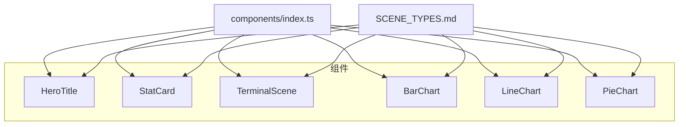
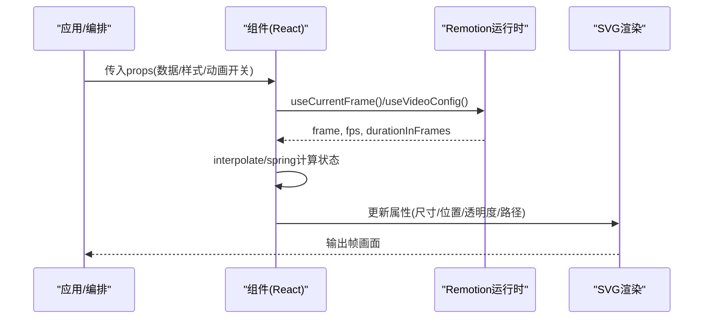
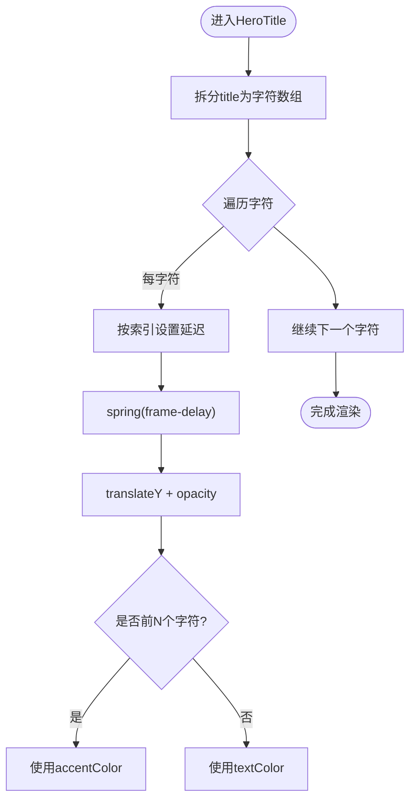
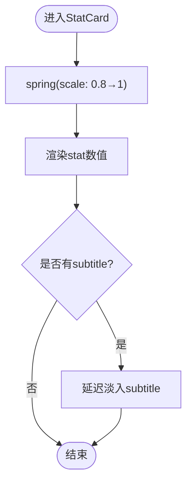
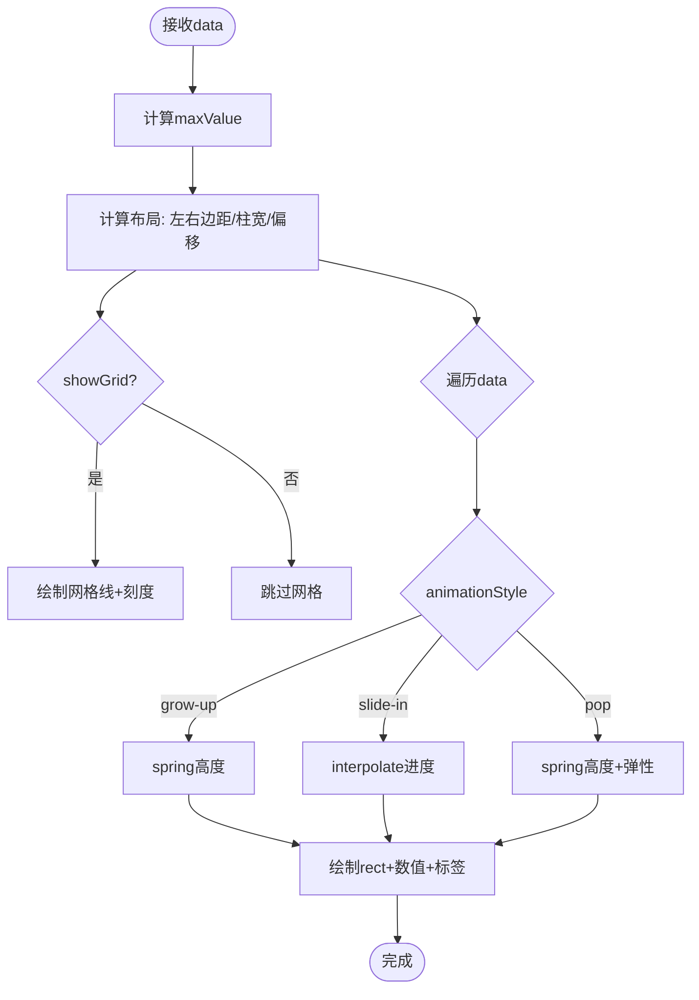
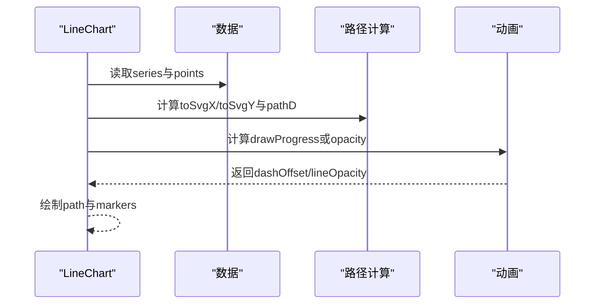
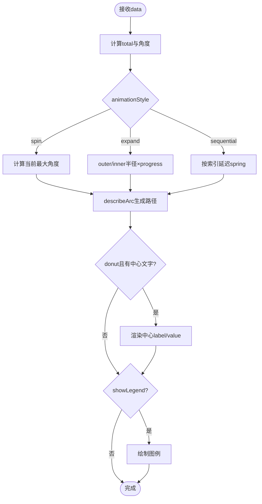
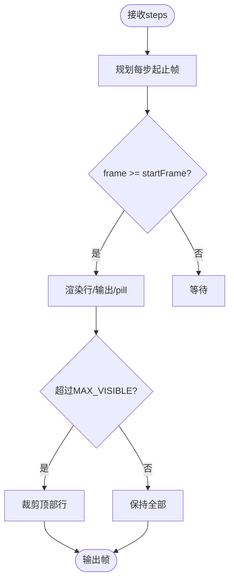
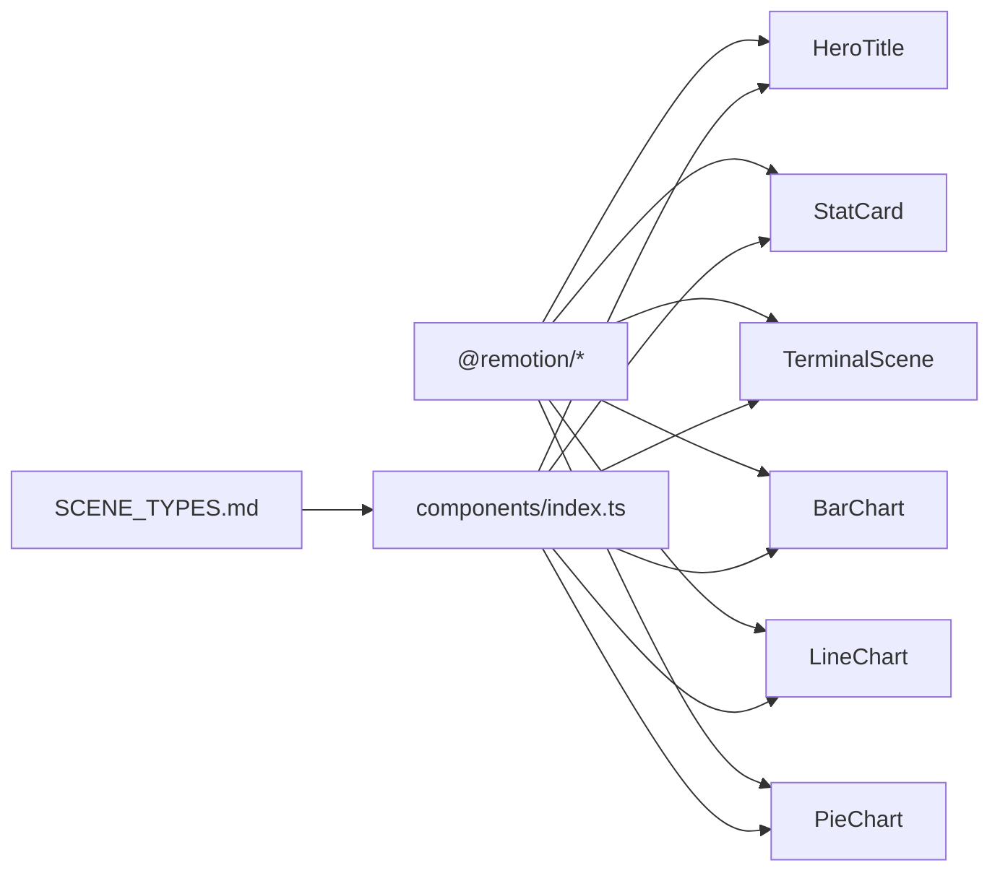

# 内置组件库

<cite>
**本文引用的文件**
- [HeroTitle.tsx](file://remotion-composer/src/components/HeroTitle.tsx)
- [StatCard.tsx](file://remotion-composer/src/components/StatCard.tsx)
- [TerminalScene.tsx](file://remotion-composer/src/components/TerminalScene.tsx)
- [BarChart.tsx](file://remotion-composer/src/components/charts/BarChart.tsx)
- [LineChart.tsx](file://remotion-composer/src/components/charts/LineChart.tsx)
- [PieChart.tsx](file://remotion-composer/src/components/charts/PieChart.tsx)
- [index.ts](file://remotion-composer/src/components/index.ts)
- [SCENE_TYPES.md](file://remotion-composer/SCENE_TYPES.md)
- [package.json](file://remotion-composer/package.json)
</cite>

## 目录
1. [简介](#简介)
2. [项目结构](#项目结构)
3. [核心组件](#核心组件)
4. [架构总览](#架构总览)
5. [详细组件分析](#详细组件分析)
6. [依赖关系分析](#依赖关系分析)
7. [性能考虑](#性能考虑)
8. [故障排查指南](#故障排查指南)
9. [结论](#结论)
10. [附录](#附录)

## 简介
本文件为 OpenMontage Remotion 视频合成器内置组件库的全面使用文档。重点覆盖以下能力：
- HeroTitle 英雄标题：样式定制、逐字弹簧动画、下划线动效与文本格式化建议
- StatCard 统计卡片：数据绑定、缩放入场、副标题淡入与主题色配置
- 图表组件（BarChart、LineChart、PieChart）：数据格式、样式选项、动画风格与图例/网格控制
- TerminalScene 终端场景：命令打字机效果、输出淡入、自动滚动、浮动标签（pill）与主题切换

所有组件均基于 Remotion 的帧驱动 API（useCurrentFrame、interpolate、spring），通过 props 暴露可配置项，便于在 Explainer 编排中复用。

## 项目结构
Remotion 组件位于 remotion-composer/src/components 目录，统一通过 index.ts 导出；图表子模块位于 charts 子目录。SCENE_TYPES.md 提供了 cut.type 与 overlay.type 的权威映射，便于在编排层选择对应组件。

**图示来源**
- [index.ts:1-20](file://remotion-composer/src/components/index.ts#L1-L20)
- [SCENE_TYPES.md:9-39](file://remotion-composer/SCENE_TYPES.md#L9-L39)

**章节来源**
- [index.ts:1-20](file://remotion-composer/src/components/index.ts#L1-L20)
- [SCENE_TYPES.md:9-39](file://remotion-composer/SCENE_TYPES.md#L9-L39)

## 核心组件
- HeroTitle：用于封面/转场标题，支持首词强调色、逐字弹跳、下划线宽度动画与背景遮罩
- StatCard：展示单个关键数值，带缩放入场与副标题延迟淡入
- BarChart：柱状图，支持 grow-up/slide-in/pop 三种动画风格，网格与数值标签可选
- LineChart：折线图，支持 draw/fade-in 两种绘制动画，多系列、轴标签、图例与标记点
- PieChart：饼图/环形图，支持 spin/expand/sequential 动画，中心文字与图例
- TerminalScene：终端窗口，命令逐字输入、输出淡入、自动滚动、非阻塞 pill 浮标

**章节来源**
- [HeroTitle.tsx:9-24](file://remotion-composer/src/components/HeroTitle.tsx#L9-L24)
- [StatCard.tsx:3-11](file://remotion-composer/src/components/StatCard.tsx#L3-L11)
- [BarChart.tsx:9-28](file://remotion-composer/src/components/charts/BarChart.tsx#L9-L28)
- [LineChart.tsx:9-37](file://remotion-composer/src/components/charts/LineChart.tsx#L9-L37)
- [PieChart.tsx:9-29](file://remotion-composer/src/components/charts/PieChart.tsx#L9-L29)
- [TerminalScene.tsx:16-28](file://remotion-composer/src/components/TerminalScene.tsx#L16-L28)

## 架构总览
组件以 React 函数式组件形式实现，统一消费 Remotion 运行时能力（帧、fps、插值、弹簧）。图表类组件采用内联 SVG 渲染，保证在 Remotion 渲染管线中的稳定表现。

**图示来源**
- [HeroTitle.tsx:1-7](file://remotion-composer/src/components/HeroTitle.tsx#L1-L7)
- [BarChart.tsx:1-7](file://remotion-composer/src/components/charts/BarChart.tsx#L1-L7)
- [LineChart.tsx:1-7](file://remotion-composer/src/components/charts/LineChart.tsx#L1-L7)
- [PieChart.tsx:1-7](file://remotion-composer/src/components/charts/PieChart.tsx#L1-L7)
- [TerminalScene.tsx:1-1](file://remotion-composer/src/components/TerminalScene.tsx#L1-L1)

## 详细组件分析

### HeroTitle 英雄标题
- 功能特性
  - 逐字符弹簧动画：每个字符按索引延迟，依次从下方弹入并渐显
  - 首词强调：前若干字符使用 accentColor，其余使用 textColor
  - 下划线动画：根据时间推进宽度增长
  - 背景遮罩：scrimBackground 默认深色径向渐变，适配浅色主题需替换为浅色遮罩
  - 副标题：延迟出现，大小写转换与字间距可调
- API 要点
  - title: string（必填）
  - subtitle?: string
  - accentColor?: string（默认青色）
  - textColor?: string（默认亮白）
  - subtitleColor?: string（默认紫色）
  - scrimBackground?: string（默认深色径向渐变）
- 使用建议
  - 短标题配合大字号与高对比度背景
  - 长标题建议拆分为多行或缩短文案
  - 浅色主题务必提供浅色 scrimBackground，避免文字不可见

**图示来源**
- [HeroTitle.tsx:40-88](file://remotion-composer/src/components/HeroTitle.tsx#L40-L88)

**章节来源**
- [HeroTitle.tsx:9-24](file://remotion-composer/src/components/HeroTitle.tsx#L9-L24)
- [HeroTitle.tsx:40-131](file://remotion-composer/src/components/HeroTitle.tsx#L40-L131)

### StatCard 统计卡片
- 功能特性
  - 主数值缩放入场：scale 从 0.8 到 1
  - 副标题延迟淡入：与主数值错开几帧出现
  - 主题色：accentColor 控制数值颜色，color 控制副标题颜色，backgroundColor 控制背景
- API 要点
  - stat: string（必填）
  - subtitle?: string
  - statFontSize?: number（默认128）
  - subtitleFontSize?: number（默认36）
  - color?: string（默认白色）
  - accentColor?: string（默认橙色）
  - backgroundColor?: string（默认深灰）
- 使用建议
  - 将 stat 作为纯数字字符串，单位放在 subtitle 中更灵活
  - 在大屏上适当增大 statFontSize，确保可读性

**图示来源**
- [StatCard.tsx:22-37](file://remotion-composer/src/components/StatCard.tsx#L22-L37)
- [StatCard.tsx:47-73](file://remotion-composer/src/components/StatCard.tsx#L47-L73)

**章节来源**
- [StatCard.tsx:3-21](file://remotion-composer/src/components/StatCard.tsx#L3-L21)
- [StatCard.tsx:22-73](file://remotion-composer/src/components/StatCard.tsx#L22-L73)

### BarChart 柱状图
- 数据格式
  - data: Array<{ label: string; value: number }>
- 样式与交互
  - colors: string[]（循环使用）
  - showGrid: boolean（显示网格线与刻度）
  - showValues: boolean（柱顶数值标签）
  - animationStyle: "grow-up" | "slide-in" | "pop"
  - barGap: number（柱间距）
  - fontFamily/textColor/backgroundColor/gridColor/title 等
- 动画机制
  - 每根柱子按索引延迟，分别计算 spring/interpolate 进度
  - 结尾处整体淡出，便于衔接下一镜头

**图示来源**
- [BarChart.tsx:46-71](file://remotion-composer/src/components/charts/BarChart.tsx#L46-L71)
- [BarChart.tsx:162-273](file://remotion-composer/src/components/charts/BarChart.tsx#L162-L273)

**章节来源**
- [BarChart.tsx:9-28](file://remotion-composer/src/components/charts/BarChart.tsx#L9-L28)
- [BarChart.tsx:30-277](file://remotion-composer/src/components/charts/BarChart.tsx#L30-L277)

### LineChart 折线图
- 数据格式
  - series: Array<{ label: string; data: Array<{ x: number; y: number }>; color?: string }>
- 样式与交互
  - showGrid/showMarkers/showLegend/xLabel/yLabel/strokeWidth
  - animationStyle: "draw" | "fade-in"
  - colors/fontFamily/textColor/backgroundColor/title
- 动画机制
  - draw：通过 strokeDasharray/dashoffset 模拟描边绘制
  - fade-in：整条线透明度渐显
  - 标记点随绘制进度逐个出现

**图示来源**
- [LineChart.tsx:66-76](file://remotion-composer/src/components/charts/LineChart.tsx#L66-L76)
- [LineChart.tsx:249-338](file://remotion-composer/src/components/charts/LineChart.tsx#L249-L338)

**章节来源**
- [LineChart.tsx:9-37](file://remotion-composer/src/components/charts/LineChart.tsx#L9-L37)
- [LineChart.tsx:39-380](file://remotion-composer/src/components/charts/LineChart.tsx#L39-L380)

### PieChart 饼图/环形图
- 数据格式
  - data: Array<{ label: string; value: number; color?: string }>
- 样式与交互
  - donut: boolean（环形图）
  - centerLabel/centerValue（环形中心文字）
  - showLegend（图例）
  - animationStyle: "spin" | "expand" | "sequential"
  - colors/fontFamily/textColor/backgroundColor/title
- 动画机制
  - spin：整体扫过角度，逐步揭示扇区
  - expand：半径从中心向外扩展
  - sequential：扇区依次出现

**图示来源**
- [PieChart.tsx:47-74](file://remotion-composer/src/components/charts/PieChart.tsx#L47-L74)
- [PieChart.tsx:120-205](file://remotion-composer/src/components/charts/PieChart.tsx#L120-L205)
- [PieChart.tsx:207-247](file://remotion-composer/src/components/charts/PieChart.tsx#L207-L247)
- [PieChart.tsx:250-298](file://remotion-composer/src/components/charts/PieChart.tsx#L250-L298)

**章节来源**
- [PieChart.tsx:9-29](file://remotion-composer/src/components/charts/PieChart.tsx#L9-L29)
- [PieChart.tsx:31-302](file://remotion-composer/src/components/charts/PieChart.tsx#L31-L302)

### TerminalScene 终端场景
- 功能特性
  - 步骤类型：cmd（命令）、out（输出）、pause（停顿）、pill（浮动标签）
  - 打字机效果：命令逐字输入，速度可配
  - 自动滚动：保持最近 N 行可见
  - 光标闪烁：最新命令末尾闪烁
  - 窗口淡入：整体 scale + opacity 过渡
  - 主题切换：prompt/accentColor/backgroundColor 控制外观
- API 要点
  - steps: TerminalStep[]（必填）
  - title?: string（默认 "Terminal"）
  - prompt?: string（默认 "$"）
  - accentColor?: string（默认青色）
  - backgroundColor?: string（默认深蓝黑）
- 使用建议
  - 合理设置 typeSpeed 与 holdSeconds，控制节奏
  - 大量输出时利用自动滚动，避免溢出
  - 使用 pill 标注关键信息，不阻塞主流程

**图示来源**
- [TerminalScene.tsx:54-93](file://remotion-composer/src/components/TerminalScene.tsx#L54-L93)
- [TerminalScene.tsx:95-108](file://remotion-composer/src/components/TerminalScene.tsx#L95-L108)
- [TerminalScene.tsx:171-218](file://remotion-composer/src/components/TerminalScene.tsx#L171-L218)
- [TerminalScene.tsx:221-262](file://remotion-composer/src/components/TerminalScene.tsx#L221-L262)

**章节来源**
- [TerminalScene.tsx:16-28](file://remotion-composer/src/components/TerminalScene.tsx#L16-L28)
- [TerminalScene.tsx:44-108](file://remotion-composer/src/components/TerminalScene.tsx#L44-L108)
- [TerminalScene.tsx:109-267](file://remotion-composer/src/components/TerminalScene.tsx#L109-L267)

## 依赖关系分析
- 运行时依赖：Remotion（@remotion/* 包），提供 AbsoluteFill、useCurrentFrame、interpolate、spring 等
- 组件导出：components/index.ts 统一导出各场景与图表组件，供上层编排使用
- 编排契约：SCENE_TYPES.md 定义了 cut.type 与 overlay.type 到组件的映射

**图示来源**
- [package.json:10-23](file://remotion-composer/package.json#L10-L23)
- [index.ts:1-20](file://remotion-composer/src/components/index.ts#L1-L20)
- [SCENE_TYPES.md:9-39](file://remotion-composer/SCENE_TYPES.md#L9-L39)

**章节来源**
- [package.json:10-23](file://remotion-composer/package.json#L10-L23)
- [index.ts:1-20](file://remotion-composer/src/components/index.ts#L1-L20)
- [SCENE_TYPES.md:9-39](file://remotion-composer/SCENE_TYPES.md#L9-L39)

## 性能考虑
- 使用 spring/interpolate 进行轻量级动画，避免复杂重排
- 图表组件在结尾阶段统一淡出，减少后续渲染压力
- 柱状图/折线图/饼图的动画按索引或系列延迟，降低峰值计算
- TerminalScene 自动滚动限制可见行数，避免 DOM 节点过多
- 字体与颜色尽量复用，减少样式抖动

[本节为通用指导，无需特定文件引用]

## 故障排查指南
- 标题文字被遮挡
  - 检查 HeroTitle 的 scrimBackground 是否与背景匹配，浅色主题请传入浅色遮罩
  - 参考：[HeroTitle.tsx:18-27](file://remotion-composer/src/components/HeroTitle.tsx#L18-L27)
- 数值未显示或过小
  - 调整 StatCard 的 statFontSize，并确保背景对比度足够
  - 参考：[StatCard.tsx:13-21](file://remotion-composer/src/components/StatCard.tsx#L13-L21)
- 图表无动画或异常
  - 确认数据格式正确（BarChart 的 value 为数字；LineChart 的 data 为 {x,y}；PieChart 的 value 为非负数）
  - 检查 animationStyle 与数据量是否匹配
  - 参考：
    - [BarChart.tsx:9-28](file://remotion-composer/src/components/charts/BarChart.tsx#L9-L28)
    - [LineChart.tsx:9-37](file://remotion-composer/src/components/charts/LineChart.tsx#L9-L37)
    - [PieChart.tsx:9-29](file://remotion-composer/src/components/charts/PieChart.tsx#L9-L29)
- 终端输出错位或卡顿
  - 调整 steps 的 typeSpeed 与 holdSeconds，避免过快输入
  - 增加 MAX_VISIBLE 或减少单行长度
  - 参考：[TerminalScene.tsx:54-93](file://remotion-composer/src/components/TerminalScene.tsx#L54-L93)

**章节来源**
- [HeroTitle.tsx:18-27](file://remotion-composer/src/components/HeroTitle.tsx#L18-L27)
- [StatCard.tsx:13-21](file://remotion-composer/src/components/StatCard.tsx#L13-L21)
- [BarChart.tsx:9-28](file://remotion-composer/src/components/charts/BarChart.tsx#L9-L28)
- [LineChart.tsx:9-37](file://remotion-composer/src/components/charts/LineChart.tsx#L9-L37)
- [PieChart.tsx:9-29](file://remotion-composer/src/components/charts/PieChart.tsx#L9-L29)
- [TerminalScene.tsx:54-93](file://remotion-composer/src/components/TerminalScene.tsx#L54-L93)

## 结论
本组件库围绕 Remotion 的帧驱动能力，提供了开箱即用的标题、统计、图表与终端场景组件。通过统一的 props 接口与丰富的动画风格，可在不同主题与节奏下快速构建高质量的视频片段。建议在编排时结合 SCENE_TYPES.md 的类型约定，按需组合与复用这些组件，以获得一致的视觉体验与高效的开发效率。

[本节为总结，无需特定文件引用]

## 附录
- 组件导出清单
  - 参见 components/index.ts 导出的所有场景与图表组件
  - 参考：[index.ts:1-20](file://remotion-composer/src/components/index.ts#L1-L20)
- 编排类型参考
  - 参见 SCENE_TYPES.md 对 cut.type 与 overlay.type 的说明
  - 参考：[SCENE_TYPES.md:9-39](file://remotion-composer/SCENE_TYPES.md#L9-L39)
- 运行环境
  - 依赖 @remotion/* 系列包，版本由 package.json 管理
  - 参考：[package.json:10-23](file://remotion-composer/package.json#L10-L23)

**章节来源**
- [index.ts:1-20](file://remotion-composer/src/components/index.ts#L1-L20)
- [SCENE_TYPES.md:9-39](file://remotion-composer/SCENE_TYPES.md#L9-L39)
- [package.json:10-23](file://remotion-composer/package.json#L10-L23)