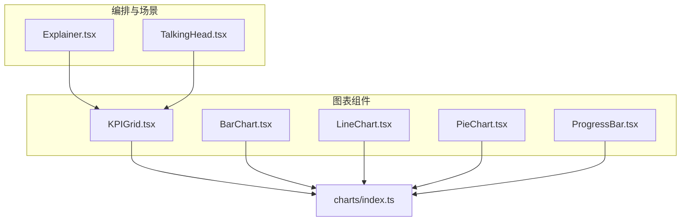
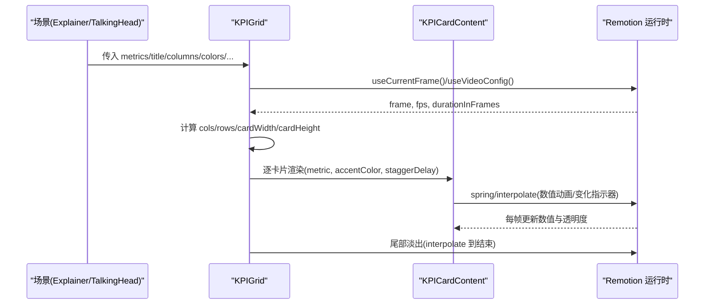
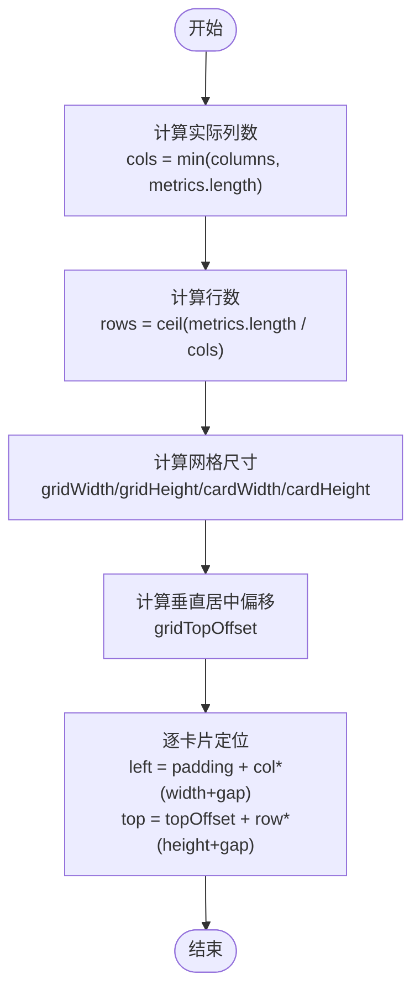
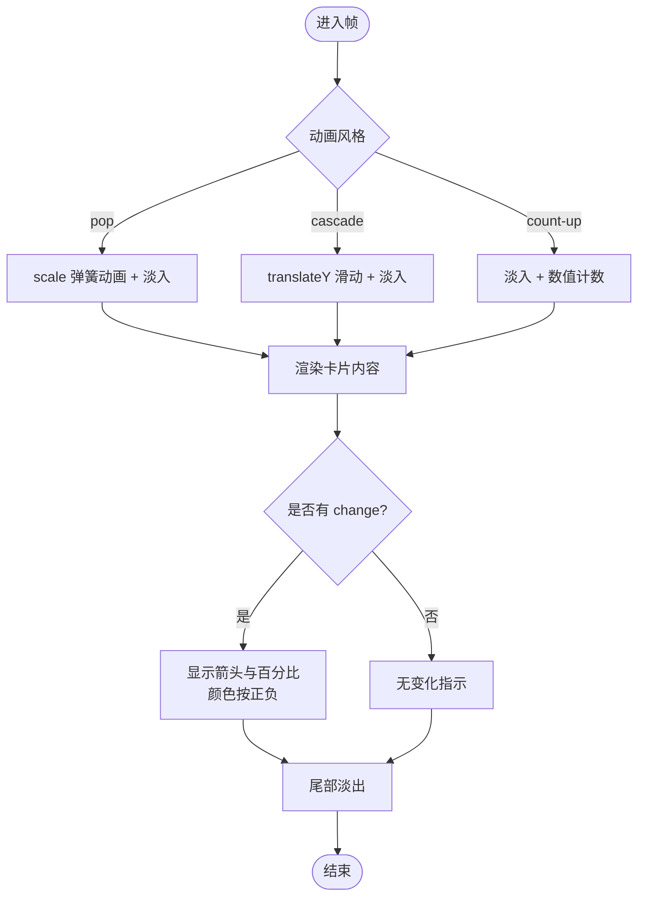
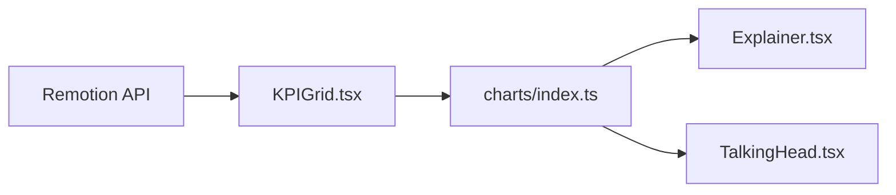

# 关键指标网格

<cite>
**本文引用的文件**
- [KPIGrid.tsx](file://remotion-composer/src/components/charts/KPIGrid.tsx)
- [index.ts（图表导出）](file://remotion-composer/src/components/charts/index.ts)
- [Explainer.tsx](file://remotion-composer/src/Explainer.tsx)
- [TalkingHead.tsx](file://remotion-composer/src/TalkingHead.tsx)
- [ProgressBar.tsx](file://remotion-composer/src/components/ProgressBar.tsx)
- [timing.md（Remotion 动画与插值参考）](file://agents/skills/remotion-best-practices/rules/timing.md)
</cite>

## 目录
1. [简介](#简介)
2. [项目结构](#项目结构)
3. [核心组件](#核心组件)
4. [架构总览](#架构总览)
5. [详细组件分析](#详细组件分析)
6. [依赖关系分析](#依赖关系分析)
7. [性能考量](#性能考量)
8. [故障排查指南](#故障排查指南)
9. [结论](#结论)
10. [附录：使用示例与配置清单](#附录使用示例与配置清单)

## 简介
本文档面向需要在视频或动态画面中展示“关键指标网格”的开发者与内容创作者，系统性说明 KPIGrid 组件的数据结构、布局算法、视觉样式、动画与交互反馈，并提供完整的使用示例与性能优化建议。该组件基于 Remotion 构建，适用于在时间轴上以帧驱动的方式渲染多指标卡片，支持数值动画、趋势指示、主题配色与入场动效。

## 项目结构
- 组件实现位于 remotion-composer 的 charts 模块中，统一通过 index.ts 导出。
- 在 Explainer 与 TalkingHead 两个场景文件中，KPIGrid 作为覆盖层或片段被调用。
- ProgressBar 提供进度条能力，可作为 KPI 卡片的补充可视化元素。

**图示来源**
- [KPIGrid.tsx:1-369](file://remotion-composer/src/components/charts/KPIGrid.tsx#L1-L369)
- [index.ts:1-4](file://remotion-composer/src/components/charts/index.ts#L1-L4)
- [Explainer.tsx:690-700](file://remotion-composer/src/Explainer.tsx#L690-L700)
- [TalkingHead.tsx:208-220](file://remotion-composer/src/TalkingHead.tsx#L208-L220)

**章节来源**
- [KPIGrid.tsx:1-369](file://remotion-composer/src/components/charts/KPIGrid.tsx#L1-L369)
- [index.ts:1-4](file://remotion-composer/src/components/charts/index.ts#L1-L4)
- [Explainer.tsx:690-700](file://remotion-composer/src/Explainer.tsx#L690-L700)
- [TalkingHead.tsx:208-220](file://remotion-composer/src/TalkingHead.tsx#L208-L220)

## 核心组件
- KPIGrid：负责将一组指标数据渲染为网格卡片，包含标题、列数、颜色主题、字体、正负色、动画风格等配置。
- KPICardContent：每个指标卡片的内部内容，包括图标、数值、标签、变化指示器以及数值动画。
- formatDisplayValue：根据目标数值量级自动格式化显示（如 K/M）。

关键数据结构
- Metric：包含 label、value、可选 prefix/suffix、change（百分比变化）、icon（文本或 emoji）。
- KPIAnimationStyle：枚举类型，支持 count-up、pop、cascade 三种动画风格。
- KPIGridProps：组件对外暴露的配置项，包括 metrics、title、columns、colors、fontFamily、textColor、backgroundColor、cardBackgroundColor、positiveColor、negativeColor、animationStyle。

**章节来源**
- [KPIGrid.tsx:9-32](file://remotion-composer/src/components/charts/KPIGrid.tsx#L9-L32)
- [KPIGrid.tsx:239-250](file://remotion-composer/src/components/charts/KPIGrid.tsx#L239-L250)
- [KPIGrid.tsx:357-368](file://remotion-composer/src/components/charts/KPIGrid.tsx#L357-L368)

## 架构总览
KPIGrid 在 Remotion 的时间轴中以帧为单位进行渲染，利用 useCurrentFrame 与 useVideoConfig 获取当前帧与视频配置（fps、durationInFrames），结合 interpolate 与 spring 完成入场、数值计数、淡入淡出等动画。网格布局基于固定画布尺寸（1920x1080）计算行列、间距与卡片尺寸，并在末尾阶段执行整体淡出。

**图示来源**
- [KPIGrid.tsx:47-76](file://remotion-composer/src/components/charts/KPIGrid.tsx#L47-L76)
- [KPIGrid.tsx:109-234](file://remotion-composer/src/components/charts/KPIGrid.tsx#L109-L234)
- [KPIGrid.tsx:252-355](file://remotion-composer/src/components/charts/KPIGrid.tsx#L252-L355)

## 详细组件分析

### 网格布局算法
- 行列计算：列数 columns 限制为 2|3|4，实际列数为 Math.min(columns, metrics.length)；行数 rows = ceil(metrics.length / cols)。
- 间距与尺寸：固定网格内边距 gridPadding=100，卡片间距 cardGap=28；标题高度 titleHeight 影响顶部留白；gridWidth/gridHeight 由画布尺寸减去上下边距得到；cardWidth/cardHeight 按列/行均分并限制最大高度。
- 垂直居中：根据 rows*cardHeight + (rows-1)*cardGap 计算总高，再计算 gridTopOffset 使网格在可视区域垂直居中。
- 定位：每张卡片的 left/top 基于 col/row 与 cardGap 累加得出。

**图示来源**
- [KPIGrid.tsx:50-68](file://remotion-composer/src/components/charts/KPIGrid.tsx#L50-L68)
- [KPIGrid.tsx:109-114](file://remotion-composer/src/components/charts/KPIGrid.tsx#L109-L114)

**章节来源**
- [KPIGrid.tsx:50-68](file://remotion-composer/src/components/charts/KPIGrid.tsx#L50-L68)
- [KPIGrid.tsx:109-114](file://remotion-composer/src/components/charts/KPIGrid.tsx#L109-L114)

### 动画与交互
- 入场动画：
  - pop：卡片缩放从 0.7 到 1，配合淡入，逐张延迟。
  - cascade：卡片从下方滑入并淡入，按索引设置 staggerDelay。
  - count-up：默认模式，卡片淡入，数值计数动画。
- 数值动画：使用 spring 驱动 countProgress，最终 displayValue = round(value * countProgress)，再通过 formatDisplayValue 格式化显示。
- 变化指示器：当 metric.change 存在且非零时，显示箭头与百分比，颜色依据正负色，透明度随时间渐显。
- 结尾淡出：在 durationInFrames 附近使用 interpolate 将整体不透明度降至 0。

**图示来源**
- [KPIGrid.tsx:116-196](file://remotion-composer/src/components/charts/KPIGrid.tsx#L116-L196)
- [KPIGrid.tsx:264-287](file://remotion-composer/src/components/charts/KPIGrid.tsx#L264-L287)
- [KPIGrid.tsx:332-352](file://remotion-composer/src/components/charts/KPIGrid.tsx#L332-L352)
- [KPIGrid.tsx:70-76](file://remotion-composer/src/components/charts/KPIGrid.tsx#L70-L76)

**章节来源**
- [KPIGrid.tsx:116-196](file://remotion-composer/src/components/charts/KPIGrid.tsx#L116-L196)
- [KPIGrid.tsx:264-287](file://remotion-composer/src/components/charts/KPIGrid.tsx#L264-L287)
- [KPIGrid.tsx:332-352](file://remotion-composer/src/components/charts/KPIGrid.tsx#L332-L352)
- [KPIGrid.tsx:70-76](file://remotion-composer/src/components/charts/KPIGrid.tsx#L70-L76)

### 视觉设计与样式
- 卡片外观：圆角、左侧强调色边框、阴影、背景色与文字色可配置。
- 数值显示：大字号、粗体、强调色，支持前缀/后缀（如货币符号、单位）。
- 趋势指示：正增长用正向箭头与正色，负增长用反向箭头与负色。
- 主题定制：支持全局背景、卡片背景、文字颜色、正负色、字体族与强调色数组循环分配。

**章节来源**
- [KPIGrid.tsx:200-234](file://remotion-composer/src/components/charts/KPIGrid.tsx#L200-L234)
- [KPIGrid.tsx:289-355](file://remotion-composer/src/components/charts/KPIGrid.tsx#L289-L355)

### 数据格式化
- 自动量级格式化：大于等于 1,000 显示为 K，大于等于 1,000,000 显示为 M，保留一位小数；否则直接显示整数。
- 计数动画与格式化的协同：countProgress 驱动 displayValue 逐步逼近目标值，formatDisplayValue 保证最终呈现符合量级习惯。

**章节来源**
- [KPIGrid.tsx:357-368](file://remotion-composer/src/components/charts/KPIGrid.tsx#L357-L368)
- [KPIGrid.tsx:278-279](file://remotion-composer/src/components/charts/KPIGrid.tsx#L278-L279)

### 与场景集成
- Explainer：在 cut.type === "kpi_grid" 时渲染 KPIGrid，支持传入 chartData、title、columns、chartColors、chartAnimation 等。
- TalkingHead：在 overlay.type === "kpi_grid" 时渲染 KPIGrid，支持传入 chartData、title、columns、chartColors、chartAnimation 等。

**章节来源**
- [Explainer.tsx:690-700](file://remotion-composer/src/Explainer.tsx#L690-L700)
- [TalkingHead.tsx:208-220](file://remotion-composer/src/TalkingHead.tsx#L208-L220)

## 依赖关系分析
- KPIGrid 依赖 Remotion 的 AbsoluteFill、interpolate、spring、useCurrentFrame、useVideoConfig。
- 通过 charts/index.ts 统一导出，便于上层场景按需引入。
- 在 Explainer 与 TalkingHead 中，KPIGrid 作为覆盖层或片段被条件渲染。

**图示来源**
- [KPIGrid.tsx:1-7](file://remotion-composer/src/components/charts/KPIGrid.tsx#L1-L7)
- [index.ts:1-4](file://remotion-composer/src/components/charts/index.ts#L1-L4)
- [Explainer.tsx:690-700](file://remotion-composer/src/Explainer.tsx#L690-L700)
- [TalkingHead.tsx:208-220](file://remotion-composer/src/TalkingHead.tsx#L208-L220)

**章节来源**
- [KPIGrid.tsx:1-7](file://remotion-composer/src/components/charts/KPIGrid.tsx#L1-L7)
- [index.ts:1-4](file://remotion-composer/src/components/charts/index.ts#L1-L4)
- [Explainer.tsx:690-700](file://remotion-composer/src/Explainer.tsx#L690-L700)
- [TalkingHead.tsx:208-220](file://remotion-composer/src/TalkingHead.tsx#L208-L220)

## 性能考量
- 动画性能：
  - 使用 spring 与 interpolate 进行轻量级数值与透明度动画，避免复杂重排。
  - 通过 staggerDelay 错开卡片入场，降低同时计算的峰值压力。
  - 结尾统一 fadeOut，减少大量 DOM 更新的开销。
- 布局性能：
  - 固定画布尺寸下预计算行列与尺寸，避免每帧重新计算布局。
  - 使用绝对定位与 transform 提升合成效率。
- 内存与资源：
  - 仅在当前帧渲染可见卡片，未使用虚拟滚动（因 Remotion 场景通常为短时长片段）。
  - 若需扩展至大数据集，可考虑分页加载或按需生成指标集合，避免一次性创建过多对象。
- 与进度条联动：
  - ProgressBar 支持 fill/pulse/step 多种动画，可与 KPIGrid 组合用于展示达成率或分段进度。

[本节为通用性能指导，不直接分析具体代码]

## 故障排查指南
- 指标数量少于列数：组件会取 Math.min(columns, metrics.length) 作为实际列数，确保不会溢出。
- 数值显示异常：检查 metric.value 是否为数字；formatDisplayValue 会根据目标值量级格式化，若出现意外格式，确认 value 范围。
- 动画不生效：确认传入的 animationStyle 为合法枚举；检查 frame/fps/durationInFrames 是否正确来自 useVideoConfig。
- 颜色主题不生效：确认 colors 数组长度与指标数量匹配，或通过 idx % colors.length 循环应用。
- 变化指示器不显示：确保 metric.change 存在且非零；正负色分别对应 positiveColor/negativeColor。

**章节来源**
- [KPIGrid.tsx:50-51](file://remotion-composer/src/components/charts/KPIGrid.tsx#L50-L51)
- [KPIGrid.tsx:357-368](file://remotion-composer/src/components/charts/KPIGrid.tsx#L357-L368)
- [KPIGrid.tsx:332-352](file://remotion-composer/src/components/charts/KPIGrid.tsx#L332-L352)

## 结论
KPIGrid 提供了开箱即用的关键指标网格能力，具备灵活的布局与动画、丰富的视觉定制选项以及与 Remotion 时间轴的深度集成。通过合理配置 metrics、columns、colors、animationStyle 等参数，可在不同场景中快速构建专业的数据可视化片段。结合 ProgressBar 可实现更完整的进度与指标表达。建议在大数据量场景下评估分页与懒加载策略，以保证渲染性能。

[本节为总结性内容，不直接分析具体代码]

## 附录：使用示例与配置清单

### 基本用法
- 在 Explainer 或 TalkingHead 中，当 cut/overlay 类型为 kpi_grid 时，传入 chartData（指标数组）、title、columns、chartColors、chartAnimation 等即可渲染。
- 示例路径：
  - [Explainer.tsx:690-700](file://remotion-composer/src/Explainer.tsx#L690-L700)
  - [TalkingHead.tsx:208-220](file://remotion-composer/src/TalkingHead.tsx#L208-L220)

### 配置清单
- 必需：metrics（指标数组）
- 可选：
  - title：网格标题
  - columns：2 | 3 | 4，控制列数
  - colors：强调色数组，循环应用到卡片
  - fontFamily：字体族
  - textColor：文字颜色
  - backgroundColor：背景色
  - cardBackgroundColor：卡片背景色
  - positiveColor：正增长颜色
  - negativeColor：负增长颜色
  - animationStyle：count-up | pop | cascade

### 指标数据结构
- label：指标名称
- value：数值（将被计数动画驱动）
- prefix/suffix：数值前后缀（如货币符号、单位）
- change：百分比变化（正/负）
- icon：图标（文本或 emoji）

**章节来源**
- [KPIGrid.tsx:9-32](file://remotion-composer/src/components/charts/KPIGrid.tsx#L9-L32)
- [KPIGrid.tsx:20-32](file://remotion-composer/src/components/charts/KPIGrid.tsx#L20-L32)

### 动画与时间控制
- 使用 spring 与 interpolate 实现自然动画与线性过渡。
- 可通过调整 staggerDelay 控制卡片入场顺序与节奏。
- 参考 Remotion 动画与插值最佳实践，理解 spring 物理属性与 easing 曲线。

**章节来源**
- [KPIGrid.tsx:116-196](file://remotion-composer/src/components/charts/KPIGrid.tsx#L116-L196)
- [timing.md:26-159](file://agents/skills/remotion-best-practices/rules/timing.md#L26-L159)

### 与进度条的组合
- 可使用 ProgressBar 展示达成率或分段进度，与 KPIGrid 共同构成完整的数据叙事。
- 支持 fill/pulse/step 动画风格与分段配置。

**章节来源**
- [ProgressBar.tsx:17-32](file://remotion-composer/src/components/ProgressBar.tsx#L17-L32)
- [ProgressBar.tsx:69-109](file://remotion-composer/src/components/ProgressBar.tsx#L69-L109)
- [ProgressBar.tsx:186-228](file://remotion-composer/src/components/ProgressBar.tsx#L186-L228)