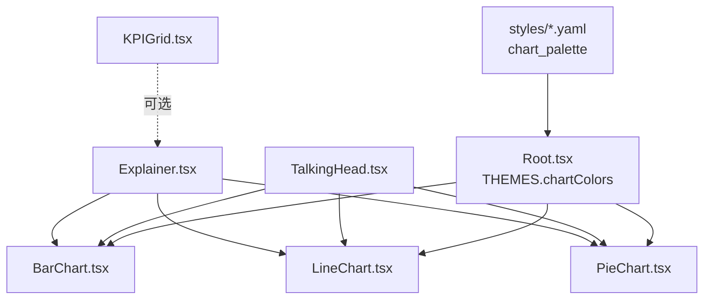
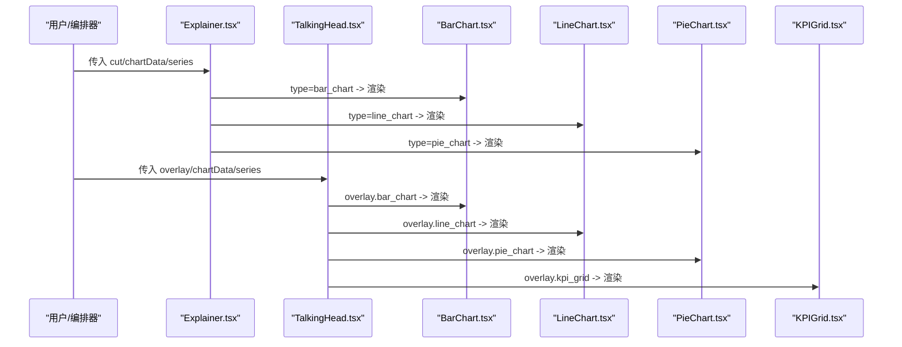
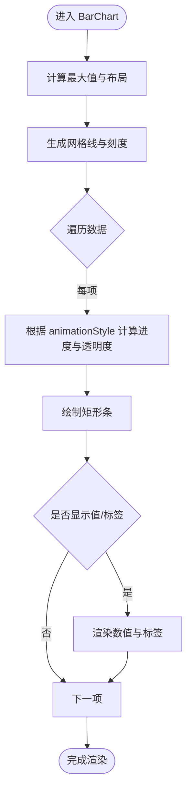
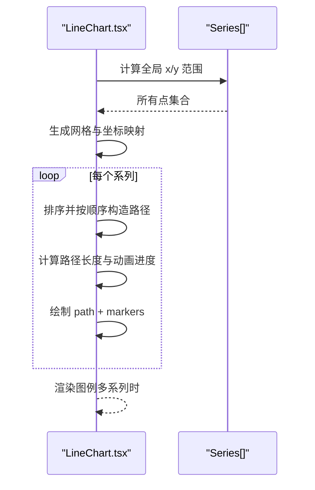
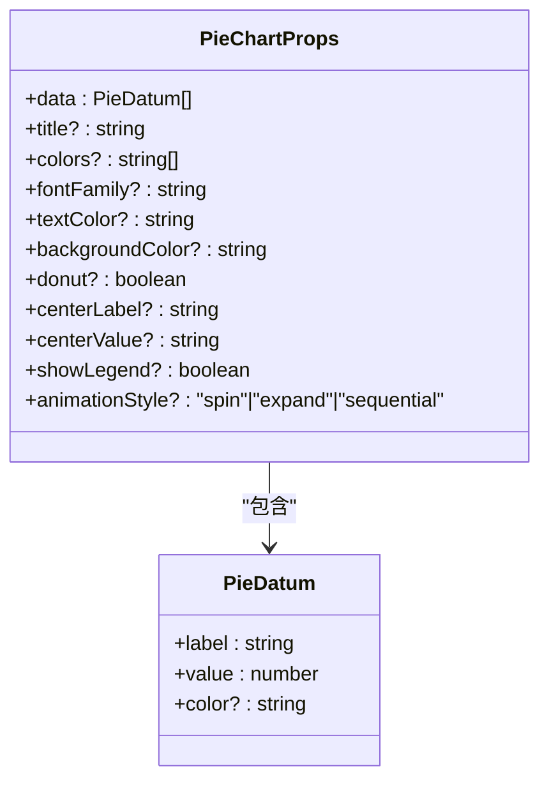
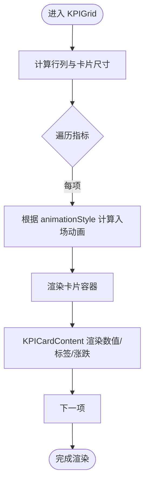
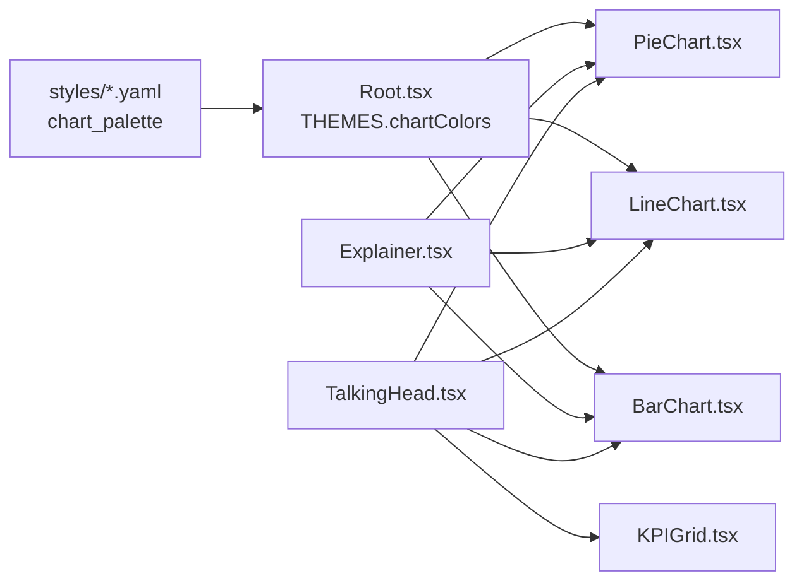

# 图表组件集合

<cite>
**本文引用的文件**
- [BarChart.tsx](file://remotion-composer/src/components/charts/BarChart.tsx)
- [LineChart.tsx](file://remotion-composer/src/components/charts/LineChart.tsx)
- [PieChart.tsx](file://remotion-composer/src/components/charts/PieChart.tsx)
- [KPIGrid.tsx](file://remotion-composer/src/components/charts/KPIGrid.tsx)
- [index.ts](file://remotion-composer/src/components/charts/index.ts)
- [Explainer.tsx](file://remotion-composer/src/Explainer.tsx)
- [TalkingHead.tsx](file://remotion-composer/src/TalkingHead.tsx)
- [Root.tsx](file://remotion-composer/src/Root.tsx)
- [clean-professional.yaml](file://styles/clean-professional.yaml)
- [minimalist-diagram.yaml](file://styles/minimalist-diagram.yaml)
</cite>

## 目录
1. [简介](#简介)
2. [项目结构](#项目结构)
3. [核心组件](#核心组件)
4. [架构总览](#架构总览)
5. [详细组件分析](#详细组件分析)
6. [依赖关系分析](#依赖关系分析)
7. [性能考量](#性能考量)
8. [故障排查指南](#故障排查指南)
9. [结论](#结论)
10. [附录](#附录)

## 简介
本文件为 OpenMontage 中图表组件集合的综合使用文档，覆盖 BarChart（柱状图）、LineChart（折线图）、PieChart（饼图）与 KPIGrid（关键指标网格）。内容包含：
- 数据格式要求与配置选项
- 适用场景与可视化最佳实践
- 颜色主题、坐标轴标签、图例与交互定制
- 动画效果配置（数据加载、悬停、过渡）
- 完整数据结构示例与渲染配置路径
- 性能优化建议（大数据集、内存管理、渲染优化）
- 响应式设计与移动端显示优化方案

## 项目结构
图表组件位于 remotion-composer 的 charts 子目录，统一通过 index.ts 导出，并在 Explainer 与 TalkingHead 等编排器中按 cut/overlay.type 进行条件渲染。主题色板来自 Root.tsx 的 THEMES 与各样式 YAML 中的 chart_palette。

图示来源
- [Explainer.tsx:658-690](file://remotion-composer/src/Explainer.tsx#L658-L690)
- [TalkingHead.tsx:165-212](file://remotion-composer/src/TalkingHead.tsx#L165-L212)
- [Root.tsx:41-106](file://remotion-composer/src/Root.tsx#L41-L106)
- [clean-professional.yaml:93-100](file://styles/clean-professional.yaml#L93-L100)
- [minimalist-diagram.yaml:94-99](file://styles/minimalist-diagram.yaml#L94-L99)

章节来源
- [index.ts:1-5](file://remotion-composer/src/components/charts/index.ts#L1-L5)
- [Explainer.tsx:658-690](file://remotion-composer/src/Explainer.tsx#L658-L690)
- [TalkingHead.tsx:165-212](file://remotion-composer/src/TalkingHead.tsx#L165-L212)
- [Root.tsx:41-106](file://remotion-composer/src/Root.tsx#L41-L106)
- [clean-professional.yaml:93-100](file://styles/clean-professional.yaml#L93-L100)
- [minimalist-diagram.yaml:94-99](file://styles/minimalist-diagram.yaml#L94-L99)

## 核心组件
- BarChart：用于类别对比与排序展示，支持多种入场动画、网格与数值标签。
- LineChart：用于趋势与多序列对比，支持绘制/淡入动画、标记点与图例。
- PieChart：用于占比与构成展示，支持环形图、中心文本与多种扇区动画。
- KPIGrid：用于关键指标卡片网格，支持计数动画、涨跌指示与级联入场。

章节来源
- [BarChart.tsx:9-42](file://remotion-composer/src/components/charts/BarChart.tsx#L9-L42)
- [LineChart.tsx:9-54](file://remotion-composer/src/components/charts/LineChart.tsx#L9-L54)
- [PieChart.tsx:9-43](file://remotion-composer/src/components/charts/PieChart.tsx#L9-L43)
- [KPIGrid.tsx:9-46](file://remotion-composer/src/components/charts/KPIGrid.tsx#L9-L46)

## 架构总览
图表组件基于 Remotion 的时间轴能力（useCurrentFrame、interpolate、spring），在固定视口 1920x1080 内完成布局与动画。各组件通过 props 暴露配置项，外部编排器根据 cut/overlay 类型选择对应组件并注入数据与主题色。

图示来源
- [Explainer.tsx:658-690](file://remotion-composer/src/Explainer.tsx#L658-L690)
- [TalkingHead.tsx:165-212](file://remotion-composer/src/TalkingHead.tsx#L165-L212)

## 详细组件分析

### BarChart（柱状图）
- 数据格式
  - 数组元素：label（字符串）、value（数字）
  - 参考类型定义位置：[BarChart.tsx:9-12](file://remotion-composer/src/components/charts/BarChart.tsx#L9-L12)
- 关键配置
  - title、colors、fontFamily、textColor、backgroundColor、gridColor、showGrid、showValues、animationStyle（grow-up/slide-in/pop）、barGap
  - 参考：[BarChart.tsx:16-42](file://remotion-composer/src/components/charts/BarChart.tsx#L16-L42)
- 适用场景
  - 类别对比、排名展示、时间切片对比（将时间作为类别）
- 最佳实践
  - 控制柱子数量与宽度，避免拥挤；开启 showGrid 提升可读性；大数值自动格式化
  - 参考数值格式化逻辑：[BarChart.tsx:279-284](file://remotion-composer/src/components/charts/BarChart.tsx#L279-L284)
- 动画
  - 入场：grow-up/slide-in/pop，带交错延迟；结束前淡出
  - 参考：[BarChart.tsx:163-223](file://remotion-composer/src/components/charts/BarChart.tsx#L163-L223)
- 渲染配置示例（路径）
  - 在编排器中按 cut.type 渲染：[Explainer.tsx:658-667](file://remotion-composer/src/Explainer.tsx#L658-L667)
  - 在叠加层中渲染：[TalkingHead.tsx:168-178](file://remotion-composer/src/TalkingHead.tsx#L168-L178)

图示来源
- [BarChart.tsx:46-71](file://remotion-composer/src/components/charts/BarChart.tsx#L46-L71)
- [BarChart.tsx:163-223](file://remotion-composer/src/components/charts/BarChart.tsx#L163-L223)

章节来源
- [BarChart.tsx:9-42](file://remotion-composer/src/components/charts/BarChart.tsx#L9-L42)
- [BarChart.tsx:163-223](file://remotion-composer/src/components/charts/BarChart.tsx#L163-L223)
- [BarChart.tsx:279-284](file://remotion-composer/src/components/charts/BarChart.tsx#L279-L284)
- [Explainer.tsx:658-667](file://remotion-composer/src/Explainer.tsx#L658-L667)
- [TalkingHead.tsx:168-178](file://remotion-composer/src/TalkingHead.tsx#L168-L178)

### LineChart（折线图）
- 数据格式
  - series 数组：每个系列含 label、data（{x, y} 点数组）、可选 color
  - 参考：[LineChart.tsx:9-18](file://remotion-composer/src/components/charts/LineChart.tsx#L9-L18)
- 关键配置
  - title、colors、fontFamily、textColor、backgroundColor、gridColor、showGrid、showMarkers、showLegend、xLabel、yLabel、animationStyle（draw/fade-in）、strokeWidth
  - 参考：[LineChart.tsx:22-54](file://remotion-composer/src/components/charts/LineChart.tsx#L22-L54)
- 适用场景
  - 时间序列趋势、多序列对比、连续变化展示
- 最佳实践
  - 对 x 轴做合理缩放与留白；启用 showMarkers 便于定位关键点；多系列时提供清晰图例
  - 参考坐标映射与网格：[LineChart.tsx:66-91](file://remotion-composer/src/components/charts/LineChart.tsx#L66-L91)
- 动画
  - draw：基于路径长度与 strokeDashoffset 的绘制动画；fade-in：整体淡入
  - 参考：[LineChart.tsx:249-313](file://remotion-composer/src/components/charts/LineChart.tsx#L249-L313)
- 渲染配置示例（路径）
  - 编排器：[Explainer.tsx:669-678](file://remotion-composer/src/Explainer.tsx#L669-L678)
  - 叠加层：[TalkingHead.tsx:180-192](file://remotion-composer/src/TalkingHead.tsx#L180-L192)

图示来源
- [LineChart.tsx:66-91](file://remotion-composer/src/components/charts/LineChart.tsx#L66-L91)
- [LineChart.tsx:249-313](file://remotion-composer/src/components/charts/LineChart.tsx#L249-L313)
- [LineChart.tsx:341-376](file://remotion-composer/src/components/charts/LineChart.tsx#L341-L376)

章节来源
- [LineChart.tsx:9-54](file://remotion-composer/src/components/charts/LineChart.tsx#L9-L54)
- [LineChart.tsx:66-91](file://remotion-composer/src/components/charts/LineChart.tsx#L66-L91)
- [LineChart.tsx:249-313](file://remotion-composer/src/components/charts/LineChart.tsx#L249-L313)
- [Explainer.tsx:669-678](file://remotion-composer/src/Explainer.tsx#L669-L678)
- [TalkingHead.tsx:180-192](file://remotion-composer/src/TalkingHead.tsx#L180-L192)

### PieChart（饼图/环形图）
- 数据格式
  - 数组元素：label、value、可选 color
  - 参考：[PieChart.tsx:9-13](file://remotion-composer/src/components/charts/PieChart.tsx#L9-L13)
- 关键配置
  - title、colors、fontFamily、textColor、backgroundColor、donut、centerLabel、centerValue、showLegend、animationStyle（spin/expand/sequential）
  - 参考：[PieChart.tsx:17-43](file://remotion-composer/src/components/charts/PieChart.tsx#L17-L43)
- 适用场景
  - 占比构成、分类比例、强调某一部分
- 最佳实践
  - 类别过多时考虑分组或改用堆叠条形；环形图适合放置中心指标
  - 参考扇区角度与半径计算：[PieChart.tsx:47-74](file://remotion-composer/src/components/charts/PieChart.tsx#L47-L74)
- 动画
  - spin：整体扫过；expand：径向扩展；sequential：逐个出现
  - 参考：[PieChart.tsx:120-184](file://remotion-composer/src/components/charts/PieChart.tsx#L120-L184)
- 渲染配置示例（路径）
  - 编排器：[Explainer.tsx:680-689](file://remotion-composer/src/Explainer.tsx#L680-L689)
  - 叠加层：[TalkingHead.tsx:194-207](file://remotion-composer/src/TalkingHead.tsx#L194-L207)

图示来源
- [PieChart.tsx:9-43](file://remotion-composer/src/components/charts/PieChart.tsx#L9-L43)

章节来源
- [PieChart.tsx:9-43](file://remotion-composer/src/components/charts/PieChart.tsx#L9-L43)
- [PieChart.tsx:120-184](file://remotion-composer/src/components/charts/PieChart.tsx#L120-L184)
- [Explainer.tsx:680-689](file://remotion-composer/src/Explainer.tsx#L680-L689)
- [TalkingHead.tsx:194-207](file://remotion-composer/src/TalkingHead.tsx#L194-L207)

### KPIGrid（关键指标网格）
- 数据格式
  - metrics 数组：每个指标含 label、value、可选 prefix/suffix/change/icon
  - 参考：[KPIGrid.tsx:9-16](file://remotion-composer/src/components/charts/KPIGrid.tsx#L9-L16)
- 关键配置
  - title、columns（2|3|4）、colors、fontFamily、textColor、backgroundColor、cardBackgroundColor、positiveColor、negativeColor、animationStyle（count-up/pop/cascade）
  - 参考：[KPIGrid.tsx:20-46](file://remotion-composer/src/components/charts/KPIGrid.tsx#L20-L46)
- 适用场景
  - 仪表盘式关键指标展示、同比/环比变化指示
- 最佳实践
  - 控制列数与卡片高度，确保在小屏可读；使用正负色区分涨跌
  - 参考网格布局计算：[KPIGrid.tsx:50-69](file://remotion-composer/src/components/charts/KPIGrid.tsx#L50-L69)
- 动画
  - count-up：数值递增；pop：弹性缩放；cascade：级联滑入
  - 参考：[KPIGrid.tsx:116-196](file://remotion-composer/src/components/charts/KPIGrid.tsx#L116-L196)
- 渲染配置示例（路径）
  - 叠加层：[TalkingHead.tsx:209-212](file://remotion-composer/src/TalkingHead.tsx#L209-L212)

图示来源
- [KPIGrid.tsx:50-69](file://remotion-composer/src/components/charts/KPIGrid.tsx#L50-L69)
- [KPIGrid.tsx:116-196](file://remotion-composer/src/components/charts/KPIGrid.tsx#L116-L196)
- [KPIGrid.tsx:252-355](file://remotion-composer/src/components/charts/KPIGrid.tsx#L252-L355)

章节来源
- [KPIGrid.tsx:9-46](file://remotion-composer/src/components/charts/KPIGrid.tsx#L9-L46)
- [KPIGrid.tsx:50-69](file://remotion-composer/src/components/charts/KPIGrid.tsx#L50-L69)
- [KPIGrid.tsx:116-196](file://remotion-composer/src/components/charts/KPIGrid.tsx#L116-L196)
- [KPIGrid.tsx:252-355](file://remotion-composer/src/components/charts/KPIGrid.tsx#L252-L355)
- [TalkingHead.tsx:209-212](file://remotion-composer/src/TalkingHead.tsx#L209-L212)

## 依赖关系分析
- 组件依赖 Remotion 运行时：AbsoluteFill、interpolate、spring、useCurrentFrame、useVideoConfig
- 编排器依赖：Explainer.tsx、TalkingHead.tsx 根据 cut/overlay 类型选择组件并注入数据与主题
- 主题与配色：Root.tsx 的 THEMES.chartColors 与各样式 YAML 的 chart_palette 共同决定默认色板

图示来源
- [Root.tsx:41-106](file://remotion-composer/src/Root.tsx#L41-L106)
- [clean-professional.yaml:93-100](file://styles/clean-professional.yaml#L93-L100)
- [minimalist-diagram.yaml:94-99](file://styles/minimalist-diagram.yaml#L94-L99)
- [Explainer.tsx:658-690](file://remotion-composer/src/Explainer.tsx#L658-L690)
- [TalkingHead.tsx:165-212](file://remotion-composer/src/TalkingHead.tsx#L165-L212)

章节来源
- [Root.tsx:41-106](file://remotion-composer/src/Root.tsx#L41-L106)
- [clean-professional.yaml:93-100](file://styles/clean-professional.yaml#L93-L100)
- [minimalist-diagram.yaml:94-99](file://styles/minimalist-diagram.yaml#L94-L99)
- [Explainer.tsx:658-690](file://remotion-composer/src/Explainer.tsx#L658-L690)
- [TalkingHead.tsx:165-212](file://remotion-composer/src/TalkingHead.tsx#L165-L212)

## 性能考量
- 大数据集处理
  - 折线图：对大量点先聚合/采样，减少路径节点；必要时关闭 showMarkers 以降低绘制开销
  - 柱状图：限制柱子数量或采用分组/堆叠；增大 barGap 降低重叠
  - 饼图：类别过多时合并小占比项，或切换为条形图
- 内存管理与渲染优化
  - 避免每帧重建大型对象；复用计算结果（如网格线、坐标映射）
  - 合理使用 spring/interpolate，避免过度复杂的嵌套动画
  - 在结束阶段统一 fadeOut，减少末尾帧重绘压力
- 移动端与响应式
  - 组件基于 1920x1080 viewBox，外层容器自适应缩放；建议在移动端减少列数（KPIGrid columns=2）与字体大小
  - 对于复杂图表，优先简化图例与网格，保证可读性

[本节为通用指导，不直接分析具体文件]

## 故障排查指南
- 图表未显示
  - 检查 cut/overlay.type 是否正确匹配组件类型
  - 确认数据字段齐全（如 BarChart 的 label/value，LineChart 的 series.data.x/y）
  - 参考渲染入口：[Explainer.tsx:658-690](file://remotion-composer/src/Explainer.tsx#L658-L690)、[TalkingHead.tsx:165-212](file://remotion-composer/src/TalkingHead.tsx#L165-L212)
- 动画异常或卡顿
  - 调整 spring 参数（stiffness/damping/mass）以平衡流畅度与性能
  - 减少同时动画的元素数量（如隐藏部分网格/图例）
  - 参考动画实现：[BarChart.tsx:163-223](file://remotion-composer/src/components/charts/BarChart.tsx#L163-L223)、[LineChart.tsx:273-296](file://remotion-composer/src/components/charts/LineChart.tsx#L273-L296)、[PieChart.tsx:120-184](file://remotion-composer/src/components/charts/PieChart.tsx#L120-L184)、[KPIGrid.tsx:116-196](file://remotion-composer/src/components/charts/KPIGrid.tsx#L116-L196)
- 颜色与主题不一致
  - 确认 colors 是否覆盖了 theme.chartColors；检查 styles 中的 chart_palette
  - 参考主题定义：[Root.tsx:41-106](file://remotion-composer/src/Root.tsx#L41-L106)、[clean-professional.yaml:93-100](file://styles/clean-professional.yaml#L93-L100)

章节来源
- [Explainer.tsx:658-690](file://remotion-composer/src/Explainer.tsx#L658-L690)
- [TalkingHead.tsx:165-212](file://remotion-composer/src/TalkingHead.tsx#L165-L212)
- [BarChart.tsx:163-223](file://remotion-composer/src/components/charts/BarChart.tsx#L163-L223)
- [LineChart.tsx:273-296](file://remotion-composer/src/components/charts/LineChart.tsx#L273-L296)
- [PieChart.tsx:120-184](file://remotion-composer/src/components/charts/PieChart.tsx#L120-L184)
- [KPIGrid.tsx:116-196](file://remotion-composer/src/components/charts/KPIGrid.tsx#L116-L196)
- [Root.tsx:41-106](file://remotion-composer/src/Root.tsx#L41-L106)
- [clean-professional.yaml:93-100](file://styles/clean-professional.yaml#L93-L100)

## 结论
本图表组件集合以 Remotion 为核心，提供统一的动画与渲染模型，并通过 props 暴露丰富的配置项，适配不同业务场景。结合主题系统与样式 YAML，可快速构建一致的视觉风格。遵循本文的数据格式、配置与性能建议，可在保证表现力的同时获得稳定的播放体验。

[本节为总结，不直接分析具体文件]

## 附录
- 常用数据结构示例（路径）
  - 时序/分类/散点/层级/网络/堆叠/地理/发散数据样例：[sample-data.json](file://.agents/skills/d3-viz/assets/sample-data.json)
  - 基础图表模板（D3 集成参考）：[chart-template.jsx](file://.agents/skills/d3-viz/assets/chart-template.jsx)
- 主题与配色
  - 内置主题与图表色板：[Root.tsx:41-106](file://remotion-composer/src/Root.tsx#L41-L106)
  - 样式 YAML 中的 chart_palette：[clean-professional.yaml:93-100](file://styles/clean-professional.yaml#L93-L100)、[minimalist-diagram.yaml:94-99](file://styles/minimalist-diagram.yaml#L94-L99)
- 渲染入口
  - 编排器渲染逻辑：[Explainer.tsx:658-690](file://remotion-composer/src/Explainer.tsx#L658-L690)
  - 叠加层渲染逻辑：[TalkingHead.tsx:165-212](file://remotion-composer/src/TalkingHead.tsx#L165-L212)

[本节为补充信息，不直接分析具体文件]