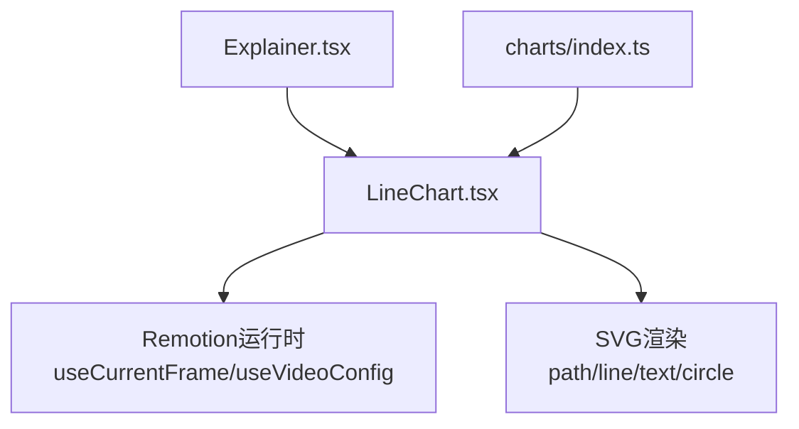
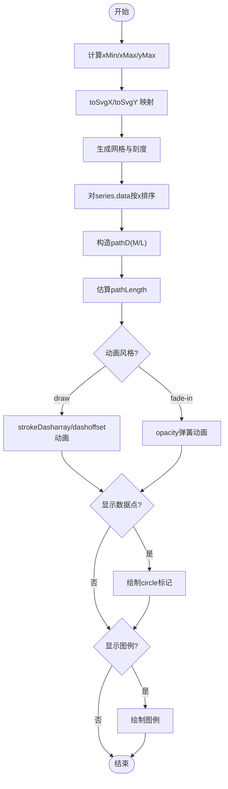
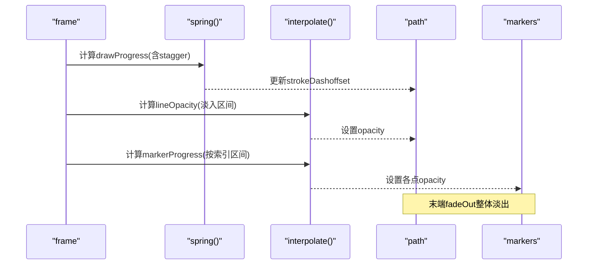
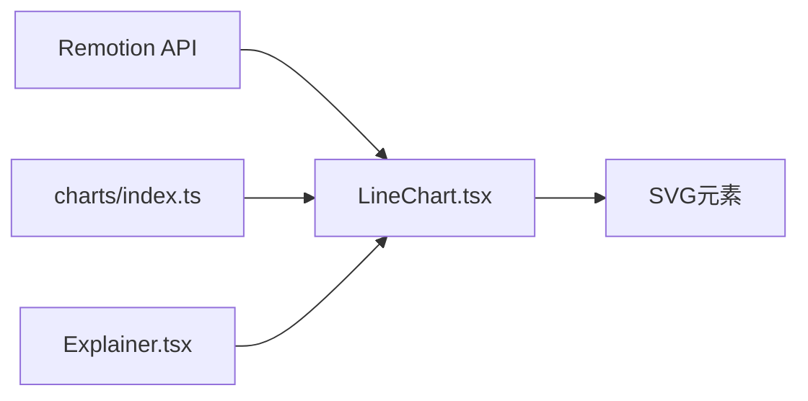

# 折线图组件

<cite>
**本文引用的文件**
- [LineChart.tsx](file://remotion-composer/src/components/charts/LineChart.tsx)
- [index.ts](file://remotion-composer/src/components/charts/index.ts)
- [Explainer.tsx](file://remotion-composer/src/Explainer.tsx)
- [charts.md（Remotion最佳实践）](file://.agents/skills/remotion-best-practices/rules/charts.md)
- [svg-path-draw.md（SVG路径绘制）](file://.agents/skills/hyperframes-animation/rules/svg-path-draw.md)
</cite>

## 目录
1. [简介](#简介)
2. [项目结构](#项目结构)
3. [核心组件](#核心组件)
4. [架构总览](#架构总览)
5. [详细组件分析](#详细组件分析)
6. [依赖关系分析](#依赖关系分析)
7. [性能考量](#性能考量)
8. [故障排查指南](#故障排查指南)
9. [结论](#结论)
10. [附录：使用示例与配置清单](#附录使用示例与配置清单)

## 简介
本文件面向需要集成与定制折线图（LineChart）的开发者，系统说明该组件的数据结构、配置参数、可视化选项、绘制算法、动画实现、插值与边界处理、异常值策略以及性能优化建议。该组件基于 Remotion 构建，使用 SVG 渲染折线、网格、坐标轴标签与图例，并通过 spring/interpolate 实现线条绘制动画与数据点出现效果。

## 项目结构
折线图位于 remotion-composer 的 charts 模块中，作为可复用组件被上层编排器（如 Explainer）按需调用。图表组件通过统一的导出入口暴露给外部使用。



**图示来源**
- [Explainer.tsx:669-678](file://remotion-composer/src/Explainer.tsx#L669-L678)
- [LineChart.tsx:1-7](file://remotion-composer/src/components/charts/LineChart.tsx#L1-L7)
- [index.ts:1-5](file://remotion-composer/src/components/charts/index.ts#L1-L5)

**章节来源**
- [LineChart.tsx:1-388](file://remotion-composer/src/components/charts/LineChart.tsx#L1-L388)
- [index.ts:1-5](file://remotion-composer/src/components/charts/index.ts#L1-L5)
- [Explainer.tsx:669-678](file://remotion-composer/src/Explainer.tsx#L669-L678)

## 核心组件
- LineChart：负责折线的计算、绘制与动画；支持多系列、网格、坐标轴标签、图例、主题色与字体等。
- 数据模型：
  - DataPoint：包含 x、y 两个数值字段。
  - Series：包含 label、data（DataPoint[]）、可选 color。
- 动画风格：draw（描边绘制）或 fade-in（淡入）。
- 布局与坐标系：固定 viewBox 1920x1080，内部定义 chartLeft/chartRight/chartTop/chartBottom，将数据坐标映射到 SVG 坐标。

**章节来源**
- [LineChart.tsx:9-37](file://remotion-composer/src/components/charts/LineChart.tsx#L9-L37)
- [LineChart.tsx:58-76](file://remotion-composer/src/components/charts/LineChart.tsx#L58-L76)

## 架构总览
从数据到渲染的关键流程如下：
- 输入 series 数组，聚合所有点计算 xMin/xMax/yMax（yMin 固定为 0），并预留顶部留白。
- 提供 toSvgX/toSvgY 将数据坐标映射到 SVG 坐标。
- 生成水平/垂直网格线与刻度标签。
- 对每个 series 排序后生成 SVG path（M/L 指令），估算路径长度用于 stroke-dasharray/dashoffset 动画。
- 根据 animationStyle 选择“描边绘制”或“淡入”，结合 spring/interpolate 控制进度与透明度。
- 可选显示数据点标记（circle）与图例（legend）。
- 在视频末尾进行整体淡出过渡。

```mermaid
sequenceDiagram
participant U as "调用方(Explainer)"
participant LC as "LineChart"
participant R as "Remotion运行时"
participant S as "SVG渲染"
U->>LC : 传入 series/title/colors/fontFamily/...
LC->>R : useCurrentFrame()/useVideoConfig()
LC->>LC : 计算xMin/xMax/yMax, toSvgX/toSvgY
LC->>LC : 生成网格/坐标轴/标签
LC->>LC : 排序series.data并构造pathD
LC->>LC : 估算pathLength
LC->>R : spring()/interpolate(frame,...)
LC->>S : 绘制path/line/text/circle
Note over LC,S : 动画 : draw或fade-in; 末端fadeOut
```

**图示来源**
- [LineChart.tsx:55-76](file://remotion-composer/src/components/charts/LineChart.tsx#L55-L76)
- [LineChart.tsx:78-99](file://remotion-composer/src/components/charts/LineChart.tsx#L78-L99)
- [LineChart.tsx:249-339](file://remotion-composer/src/components/charts/LineChart.tsx#L249-L339)
- [LineChart.tsx:93-99](file://remotion-composer/src/components/charts/LineChart.tsx#L93-L99)

## 详细组件分析

### 数据结构要求
- DataPoint
  - x: number（横轴数据）
  - y: number（纵轴数据）
- Series
  - label: string（系列名称）
  - data: DataPoint[]（按时间或类别顺序排列的点集）
  - color?: string（可选，覆盖全局 colors）
- 约束与建议
  - 每个 series 至少包含 2 个点才会绘制折线。
  - 数据应按 x 升序排列；组件内部会再次排序以保证正确路径。
  - y 轴最小值为 0，最大值取所有 series 的最大值并增加 10% 留白。

**章节来源**
- [LineChart.tsx:9-18](file://remotion-composer/src/components/charts/LineChart.tsx#L9-L18)
- [LineChart.tsx:66-76](file://remotion-composer/src/components/charts/LineChart.tsx#L66-L76)
- [LineChart.tsx:249-253](file://remotion-composer/src/components/charts/LineChart.tsx#L249-L253)

### 配置参数与可视化选项
- 必需
  - series: Series[]
- 可选
  - title: string（标题）
  - colors: string[]（默认调色板）
  - fontFamily: string（字体族）
  - textColor: string（文本颜色）
  - backgroundColor: string（背景色）
  - gridColor: string（网格与轴线颜色）
  - showGrid: boolean（是否显示网格）
  - showMarkers: boolean（是否显示数据点标记）
  - showLegend: boolean（是否显示图例）
  - xLabel: string（X轴标签）
  - yLabel: string（Y轴标签）
  - animationStyle: "draw" | "fade-in"（线条动画风格）
  - strokeWidth: number（线条粗细）

这些参数影响：
- 主题与排版：title、colors、fontFamily、textColor、backgroundColor、gridColor、strokeWidth。
- 可见性：showGrid、showMarkers、showLegend、xLabel、yLabel。
- 动效：animationStyle。

**章节来源**
- [LineChart.tsx:22-53](file://remotion-composer/src/components/charts/LineChart.tsx#L22-L53)
- [LineChart.tsx:114-128](file://remotion-composer/src/components/charts/LineChart.tsx#L114-L128)
- [LineChart.tsx:131-185](file://remotion-composer/src/components/charts/LineChart.tsx#L131-L185)
- [LineChart.tsx:212-247](file://remotion-composer/src/components/charts/LineChart.tsx#L212-L247)
- [LineChart.tsx:341-376](file://remotion-composer/src/components/charts/LineChart.tsx#L341-L376)

### 绘制算法与坐标映射
- 坐标范围
  - x 范围：[xMin, xMax]，由所有 series 的 x 值决定。
  - y 范围：[0, yMax*1.1]，yMin 固定为 0，yMax 取最大值并加 10% 留白。
- 坐标映射
  - toSvgX(x) = chartLeft + (x - xMin)/(xMax - xMin) * chartWidth
  - toSvgY(y) = chartBottom - (y - yMin)/(yMax - yMin) * chartHeight
- 路径生成
  - 对每个 series 的 data 按 x 升序排序。
  - 生成 SVG path d 字符串：首点 M sx sy，后续 L sx sy。
  - 估算路径长度：逐段累加欧氏距离，用于 stroke-dasharray/dashoffset 动画。
- 网格与刻度
  - 水平网格：固定 5 等分，计算对应 value 与 y 坐标，并渲染刻度数字。
  - 垂直网格：根据数据点数限制最大刻度数（最多 6 个），均匀分布。
- 坐标轴与标签
  - 绘制 X/Y 轴线，带入场透明度动画。
  - 可选 xLabel/yLabel，分别居中于底部与左侧旋转展示。



**图示来源**
- [LineChart.tsx:66-91](file://remotion-composer/src/components/charts/LineChart.tsx#L66-L91)
- [LineChart.tsx:249-269](file://remotion-composer/src/components/charts/LineChart.tsx#L249-L269)
- [LineChart.tsx:276-298](file://remotion-composer/src/components/charts/LineChart.tsx#L276-L298)
- [LineChart.tsx:315-336](file://remotion-composer/src/components/charts/LineChart.tsx#L315-L336)
- [LineChart.tsx:341-376](file://remotion-composer/src/components/charts/LineChart.tsx#L341-L376)

**章节来源**
- [LineChart.tsx:58-91](file://remotion-composer/src/components/charts/LineChart.tsx#L58-L91)
- [LineChart.tsx:249-269](file://remotion-composer/src/components/charts/LineChart.tsx#L249-L269)

### 曲线平滑处理
- 当前实现采用直线连接（L 指令），未启用贝塞尔曲线平滑。
- 若需平滑曲线，可在路径生成阶段引入样条插值（如 Catmull-Rom/Bezier），或使用库函数生成平滑路径后再应用相同的 dash 动画逻辑。

**章节来源**
- [LineChart.tsx:255-261](file://remotion-composer/src/components/charts/LineChart.tsx#L255-L261)

### 填充区域渲染
- 当前实现仅绘制线条与数据点，未包含面积填充。
- 如需面积图，可在路径闭合后添加 fill，并结合动画逐步显示填充区域。

**章节来源**
- [LineChart.tsx:300-313](file://remotion-composer/src/components/charts/LineChart.tsx#L300-L313)

### 动画效果与过渡
- 线条绘制动画（draw）
  - 通过 stroke-dasharray=全长、stroke-dashoffset=全长*(1-progress) 实现“笔触绘制”效果。
  - progress 由 spring(frame - staggerDelay - 8, fps, {damping:20, stiffness:40}) 驱动。
  - 线条透明度在延迟区间内线性淡入。
- 淡入动画（fade-in）
  - 直接设置 drawProgress=1，使用 spring 控制 opacity。
- 数据点出现
  - 每个点的透明度随 drawProgress 在其区间内从 0→1 渐变。
- 序列交错
  - 多 series 之间通过 staggerDelay = seriesIdx * 8 错开起始帧。
- 结尾淡出
  - 在 durationInFrames 最后 15 帧，整体不透明度从 1→0。



**图示来源**
- [LineChart.tsx:271-298](file://remotion-composer/src/components/charts/LineChart.tsx#L271-L298)
- [LineChart.tsx:315-336](file://remotion-composer/src/components/charts/LineChart.tsx#L315-L336)
- [LineChart.tsx:93-99](file://remotion-composer/src/components/charts/LineChart.tsx#L93-L99)

**章节来源**
- [LineChart.tsx:271-298](file://remotion-composer/src/components/charts/LineChart.tsx#L271-L298)
- [LineChart.tsx:315-336](file://remotion-composer/src/components/charts/LineChart.tsx#L315-L336)
- [LineChart.tsx:93-99](file://remotion-composer/src/components/charts/LineChart.tsx#L93-L99)

### 数据插值与边界处理
- 坐标插值
  - 使用线性映射 toSvgX/toSvgY，将数据域映射到 SVG 像素域。
- 边界处理
  - 当 xMax-xMin 为 0 时，使用 || 1 避免除零。
  - y 轴始终从 0 开始，最大值放大 10% 以留出顶部空间。
  - 垂直网格刻度数量受数据点数限制（最多 6 个），避免过度拥挤。
- 异常值处理
  - 未做显式过滤或裁剪；极端异常值会拉伸 y 轴导致视觉压缩。
  - 建议在数据预处理阶段进行离群点检测或截断，或在组件扩展中增加 yMax 上限与异常值提示。

**章节来源**
- [LineChart.tsx:66-76](file://remotion-composer/src/components/charts/LineChart.tsx#L66-L76)
- [LineChart.tsx:86-91](file://remotion-composer/src/components/charts/LineChart.tsx#L86-L91)

### 与上层编排器的集成
- Explainer 根据 cut.type === "line_chart" 将 chartSeries、title、colors、animationStyle、showGrid/showMarkers/showLegend、xLabel/yLabel、backgroundColor/textColor 等传递给 LineChart。
- 这体现了组件的可组合性与主题化能力。

**章节来源**
- [Explainer.tsx:669-678](file://remotion-composer/src/Explainer.tsx#L669-L678)

## 依赖关系分析
- 运行时依赖
  - Remotion：AbsoluteFill、interpolate、spring、useCurrentFrame、useVideoConfig。
- 渲染依赖
  - SVG：path、line、text、circle、g、rect 等元素。
- 导出与引用
  - charts/index.ts 统一导出 LineChart，便于上层导入。
  - Explainer 直接消费 LineChart。



**图示来源**
- [LineChart.tsx:1-7](file://remotion-composer/src/components/charts/LineChart.tsx#L1-L7)
- [index.ts:1-5](file://remotion-composer/src/components/charts/index.ts#L1-L5)
- [Explainer.tsx:669-678](file://remotion-composer/src/Explainer.tsx#L669-L678)

**章节来源**
- [LineChart.tsx:1-7](file://remotion-composer/src/components/charts/LineChart.tsx#L1-L7)
- [index.ts:1-5](file://remotion-composer/src/components/charts/index.ts#L1-L5)
- [Explainer.tsx:669-678](file://remotion-composer/src/Explainer.tsx#L669-L678)

## 性能考量
- 大数据量渲染优化
  - 减少不必要的重绘：仅在数据变化时重新计算路径与网格。
  - 采样降点：对超大数据集进行等间隔采样，保持趋势可视性。
  - 限制网格刻度：已内置垂直网格最大刻度数限制，避免过多 DOM 节点。
- 动画性能
  - 使用 spring/interpolate 基于帧驱动，避免每帧复杂计算。
  - 多 series 交错启动，降低峰值渲染压力。
- 内存管理
  - 避免在 render 中创建大对象；路径字符串与网格数组已在组件内局部计算，生命周期短。
  - 对于极长序列，考虑分页或虚拟滚动思路（例如分段渲染）。
- 参考实践
  - 路径绘制动画可通过 stroke-dasharray/dashoffset 高效实现，无需额外库。
  - 可结合 @remotion/paths 工具进行更复杂的 path 操作（如测长、切分、跟随标记）。

**章节来源**
- [LineChart.tsx:255-269](file://remotion-composer/src/components/charts/LineChart.tsx#L255-L269)
- [LineChart.tsx:271-298](file://remotion-composer/src/components/charts/LineChart.tsx#L271-L298)
- [charts.md（Remotion最佳实践）:74-121](file://.agents/skills/remotion-best-practices/rules/charts.md#L74-L121)
- [svg-path-draw.md:1-78](file://.agents/skills/hyperframes-animation/rules/svg-path-draw.md#L1-L78)

## 故障排查指南
- 折线不显示
  - 检查每个 series 的 data 是否至少有 2 个点。
  - 确认 x 值有差异（xMax-xMin≠0），否则 toSvgX 无法正确映射。
- 动画异常
  - 确认 fps 与 durationInFrames 合理；过短的时长可能导致动画不可见。
  - 若使用 fade-in，确保 lineOpacity 的 spring 延迟与帧率匹配。
- 网格/标签错位
  - 检查 chartLeft/chartRight/chartTop/chartBottom 是否被外部样式覆盖。
  - 调整 xLabel/yLabel 的位置偏移以适应不同字体大小。
- 主题与字体
  - 确保 fontFamily 可用；某些环境可能缺少指定字体，回退到 sans-serif。
  - 对比 textColor/gridColor/backgroundColor 的对比度，保证可读性。

**章节来源**
- [LineChart.tsx:249-253](file://remotion-composer/src/components/charts/LineChart.tsx#L249-L253)
- [LineChart.tsx:58-76](file://remotion-composer/src/components/charts/LineChart.tsx#L58-L76)
- [LineChart.tsx:212-247](file://remotion-composer/src/components/charts/LineChart.tsx#L212-L247)

## 结论
LineChart 提供了开箱即用的折线可视化能力，涵盖数据映射、网格、坐标轴、图例与多种动画风格。其实现简洁、可扩展性强，适合嵌入到 Remotion 视频编排系统中。针对大数据量与复杂场景，可通过数据采样、路径平滑与面积填充等扩展进一步提升表现力与性能。

## 附录：使用示例与配置清单
- 基本用法
  - 在编排器中传入 series、title、colors、animationStyle、showGrid/showMarkers/showLegend、xLabel/yLabel、backgroundColor/textColor 等参数。
  - 参考集成位置：Explainer 中对 line_chart 类型的处理。
- 主题与字体
  - 通过 colors、fontFamily、textColor、backgroundColor、gridColor 自定义外观。
- 坐标轴与网格
  - 开启 showGrid 显示网格；通过 xLabel/yLabel 标注坐标轴含义。
- 动画配置
  - animationStyle="draw"：线条描边绘制；"fade-in"：整体淡入。
  - 可使用 spring/interpolate 进一步定制时序与缓动（参考 Remotion 最佳实践）。
- 完整示例路径
  - 集成示例：[Explainer.tsx:669-678](file://remotion-composer/src/Explainer.tsx#L669-L678)
  - 组件实现：[LineChart.tsx:22-53](file://remotion-composer/src/components/charts/LineChart.tsx#L22-L53)

**章节来源**
- [Explainer.tsx:669-678](file://remotion-composer/src/Explainer.tsx#L669-L678)
- [LineChart.tsx:22-53](file://remotion-composer/src/components/charts/LineChart.tsx#L22-L53)