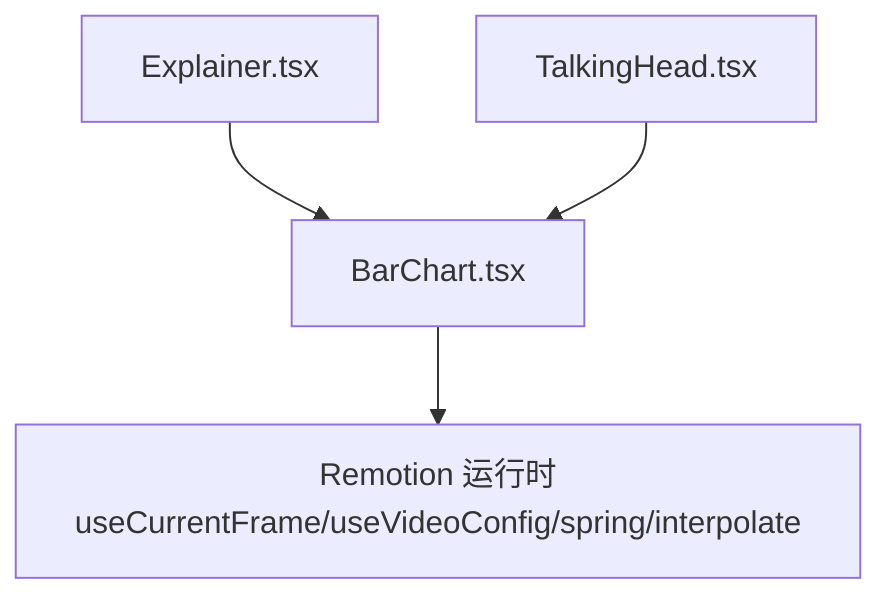
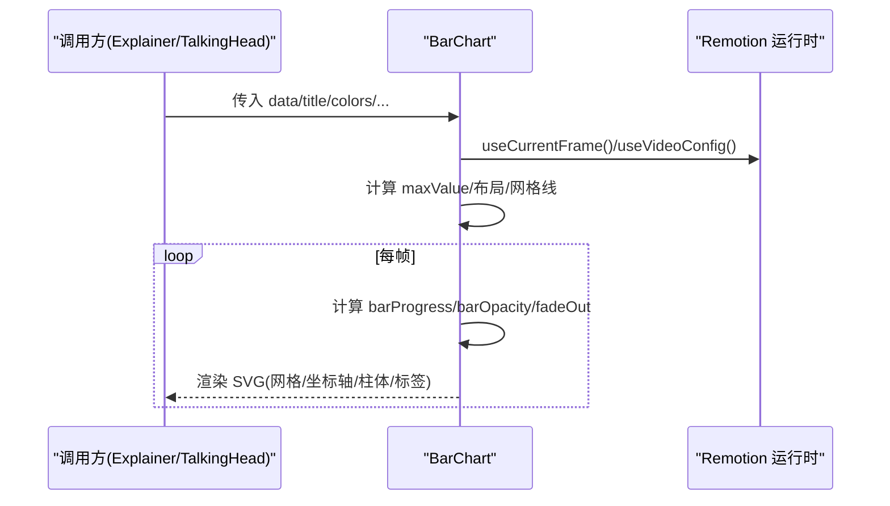
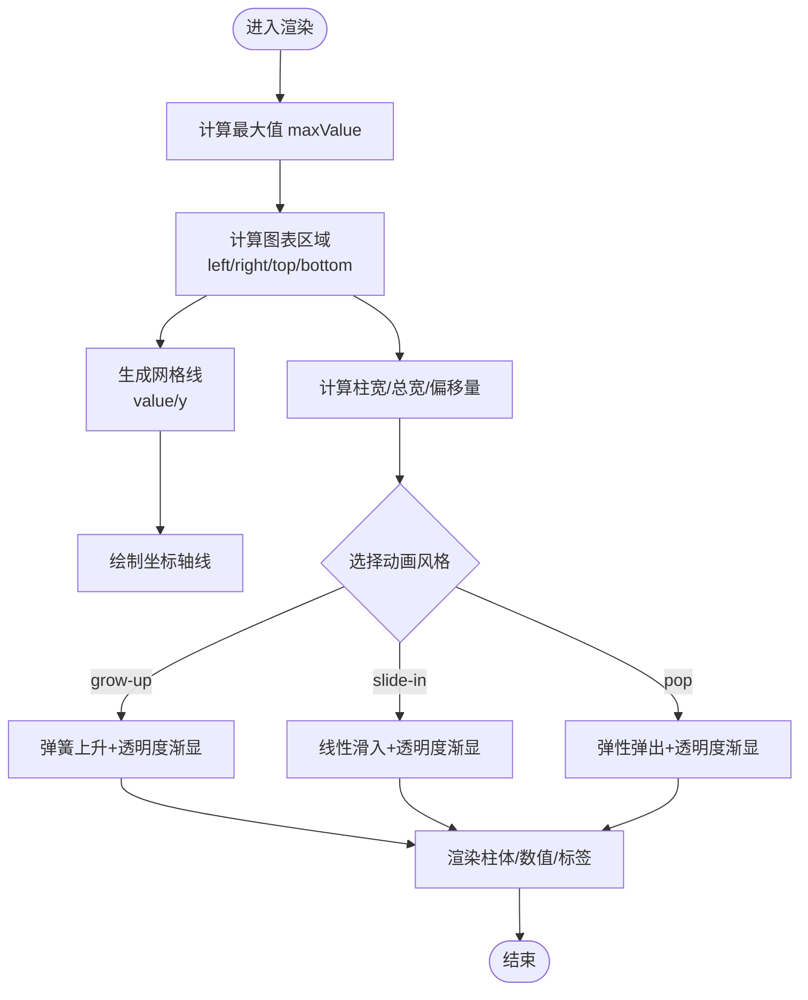
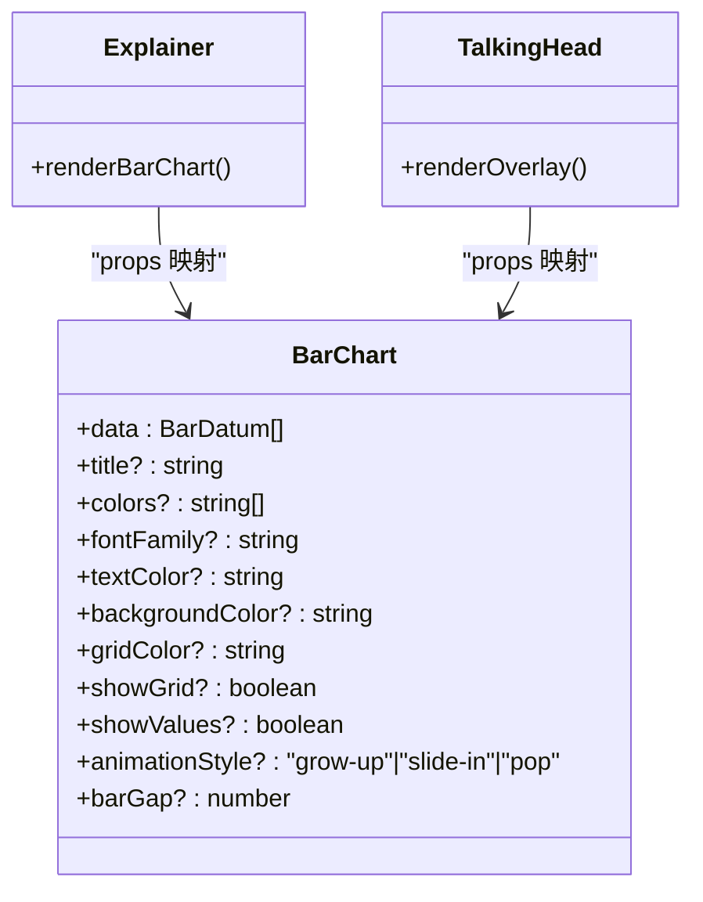

# 柱状图组件

<cite>
**本文引用的文件**
- [BarChart.tsx](file://remotion-composer/src/components/charts/BarChart.tsx)
- [Explainer.tsx](file://remotion-composer/src/Explainer.tsx)
- [TalkingHead.tsx](file://remotion-composer/src/TalkingHead.tsx)
</cite>

## 目录
1. [简介](#简介)
2. [项目结构](#项目结构)
3. [核心组件](#核心组件)
4. [架构总览](#架构总览)
5. [详细组件分析](#详细组件分析)
6. [依赖关系分析](#依赖关系分析)
7. [性能考虑](#性能考虑)
8. [故障排查指南](#故障排查指南)
9. [结论](#结论)
10. [附录：使用示例与最佳实践](#附录使用示例与最佳实践)

## 简介
本文件为 Remotion Composer 中的 BarChart（柱状图）组件提供完整的使用文档。内容涵盖数据格式、配置选项、动画类型、布局计算逻辑、数值格式化、响应式适配机制，以及性能优化建议与大数据集处理技巧。该组件基于 SVG 渲染，内置三种入场动画风格，支持主题化配色与网格开关等常用可视化能力。

## 项目结构
- 组件实现位于 remotion-composer/src/components/charts/BarChart.tsx。
- 在 Explainer 与 TalkingHead 两个场景中，通过条件渲染将外部传入的 chartData 与主题配置映射到 BarChart 的 props。
- 组件内部使用 Remotion 的 useCurrentFrame、useVideoConfig、spring、interpolate 完成逐帧动画与时间轴控制。

图表来源
- [Explainer.tsx:658-668](file://remotion-composer/src/Explainer.tsx#L658-L668)
- [TalkingHead.tsx:168-178](file://remotion-composer/src/TalkingHead.tsx#L168-L178)
- [BarChart.tsx:1-7](file://remotion-composer/src/components/charts/BarChart.tsx#L1-L7)

章节来源
- [BarChart.tsx:1-285](file://remotion-composer/src/components/charts/BarChart.tsx#L1-L285)
- [Explainer.tsx:658-668](file://remotion-composer/src/Explainer.tsx#L658-L668)
- [TalkingHead.tsx:168-178](file://remotion-composer/src/TalkingHead.tsx#L168-L178)

## 核心组件
- BarChart 是一个 React 函数式组件，接收 data、title、colors、fontFamily、textColor、backgroundColor、gridColor、showGrid、showValues、animationStyle、barGap 等属性。
- 数据项类型为 BarDatum，包含 label（字符串）与 value（数字）。
- 动画风格 animationStyle 支持 "grow-up"、"slide-in"、"pop"。
- 默认画布尺寸为 1920×1080，通过 SVG viewBox 自适应容器尺寸。

章节来源
- [BarChart.tsx:9-28](file://remotion-composer/src/components/charts/BarChart.tsx#L9-L28)
- [BarChart.tsx:30-42](file://remotion-composer/src/components/charts/BarChart.tsx#L30-L42)

## 架构总览
BarChart 在每帧中根据当前帧号与视频配置计算各柱体的进度与透明度，结合 spring 与 interpolate 实现平滑动画；同时依据数据最大值动态生成网格线与坐标轴刻度，并居中绘制柱体。

图表来源
- [BarChart.tsx:43-71](file://remotion-composer/src/components/charts/BarChart.tsx#L43-L71)
- [BarChart.tsx:162-223](file://remotion-composer/src/components/charts/BarChart.tsx#L162-L223)

## 详细组件分析

### 数据格式要求
- BarDatum：每个数据项必须包含 label（字符串）与 value（数字）。
- 数据数组 data 用于驱动柱体数量与高度。

章节来源
- [BarChart.tsx:9-12](file://remotion-composer/src/components/charts/BarChart.tsx#L9-L12)

### 配置选项说明
- colors：颜色数组，按索引循环分配给柱体。
- fontFamily：字体族，应用于标题、网格刻度、标签与数值。
- textColor：文本颜色。
- backgroundColor：背景色。
- gridColor：网格线与坐标轴线颜色。
- showGrid：是否显示网格线。
- showValues：是否在柱顶显示数值标签。
- animationStyle：动画风格，可选 "grow-up"、"slide-in"、"pop"。
- barGap：柱间距（像素），影响柱宽与整体宽度计算。

章节来源
- [BarChart.tsx:16-28](file://remotion-composer/src/components/charts/BarChart.tsx#L16-L28)
- [BarChart.tsx:30-42](file://remotion-composer/src/components/charts/BarChart.tsx#L30-L42)

### 动画效果类型
- grow-up：弹簧上升，带延迟交错，透明度渐显。
- slide-in：线性插值滑入，透明度渐显。
- pop：弹性弹出，带质量与阻尼参数，透明度快速渐显。

章节来源
- [BarChart.tsx:14](file://remotion-composer/src/components/charts/BarChart.tsx#L14)
- [BarChart.tsx:169-211](file://remotion-composer/src/components/charts/BarChart.tsx#L169-L211)

### 布局计算逻辑
- 图表区域定义：固定于 1920×1080 画布内，左侧、右侧、顶部、底部坐标常量决定绘图区。
- 网格线生成：根据最大值与固定网格数（5 段）计算 y 坐标与刻度值。
- 坐标轴绘制：左右与底部轴线以 gridColor 绘制，并在起始阶段淡入。
- 柱体宽度计算：根据数据长度、barGap 与图表宽度计算单根柱宽，限制最大宽度，保证视觉密度；计算实际总宽度后水平居中偏移。

图表来源
- [BarChart.tsx:46-71](file://remotion-composer/src/components/charts/BarChart.tsx#L46-L71)
- [BarChart.tsx:138-160](file://remotion-composer/src/components/charts/BarChart.tsx#L138-L160)
- [BarChart.tsx:162-223](file://remotion-composer/src/components/charts/BarChart.tsx#L162-L223)

章节来源
- [BarChart.tsx:46-71](file://remotion-composer/src/components/charts/BarChart.tsx#L46-L71)
- [BarChart.tsx:138-160](file://remotion-composer/src/components/charts/BarChart.tsx#L138-L160)
- [BarChart.tsx:162-223](file://remotion-composer/src/components/charts/BarChart.tsx#L162-L223)

### 数值格式化功能
- formatNumber 将数值转换为 K/M 单位：≥1,000 显示为 x.xK，≥1,000,000 显示为 x.xM；整数直接显示，小数保留一位。
- 该函数用于网格刻度与柱顶数值标签。

章节来源
- [BarChart.tsx:279-284](file://remotion-composer/src/components/charts/BarChart.tsx#L279-L284)

### 响应式适配机制
- 组件使用 SVG viewBox="0 0 1920 1080"，并通过 CSS width/height 100% 填充父容器，从而在不同容器尺寸下保持比例缩放。
- 所有坐标基于固定画布尺寸计算，因此缩放时相对位置保持不变。

章节来源
- [BarChart.tsx:73-85](file://remotion-composer/src/components/charts/BarChart.tsx#L73-L85)

### 使用示例与集成方式
- 在 Explainer 中，当 cut.type 为 "bar_chart" 且存在 chartData 时，将 chartData、title、colors、animationStyle、showGrid、showValues、backgroundColor、textColor 等传入 BarChart。
- 在 TalkingHead 中，当 overlay.type 为 "bar_chart" 且存在 chartData 时，将 overlay.chartData、title、colors、animationStyle、showValues、backgroundColor 等传入 BarChart。

章节来源
- [Explainer.tsx:658-668](file://remotion-composer/src/Explainer.tsx#L658-L668)
- [TalkingHead.tsx:168-178](file://remotion-composer/src/TalkingHead.tsx#L168-L178)

## 依赖关系分析
- 组件依赖 Remotion 提供的动画与时间 API：AbsoluteFill、interpolate、spring、useCurrentFrame、useVideoConfig。
- 在业务层，Explainer 与 TalkingHead 作为调用方，负责从场景数据中提取并映射到 BarChart 的 props。

图表来源
- [BarChart.tsx:16-28](file://remotion-composer/src/components/charts/BarChart.tsx#L16-L28)
- [Explainer.tsx:658-668](file://remotion-composer/src/Explainer.tsx#L658-L668)
- [TalkingHead.tsx:168-178](file://remotion-composer/src/TalkingHead.tsx#L168-L178)

章节来源
- [BarChart.tsx:1-7](file://remotion-composer/src/components/charts/BarChart.tsx#L1-L7)
- [Explainer.tsx:658-668](file://remotion-composer/src/Explainer.tsx#L658-L668)
- [TalkingHead.tsx:168-178](file://remotion-composer/src/TalkingHead.tsx#L168-L178)

## 性能考虑
- 动画开销：每帧对每个柱体执行 spring/interpolate 计算，数据量大时会增加 CPU 压力。建议：
  - 合理设置 barGap，避免过多柱体导致过度密集与重绘。
  - 在大数据集场景下，减少 showValues 或关闭 showGrid，降低文本节点数量。
  - 使用更短的 durationInFrames 或在结尾 fadeOut 提前结束渲染，减少尾部计算。
- 布局计算：maxValue 与网格线计算为 O(n)，通常可忽略；但大量数据仍建议在上游做采样或聚合。
- 颜色与样式：colors 数组按需提供，避免过长列表造成不必要的索引运算。
- 响应式：SVG viewBox 缩放不会改变计算复杂度，但 DOM 节点数量会随数据规模增长，需关注内存与渲染性能。

[本节为通用性能指导，不直接分析具体代码行]

## 故障排查指南
- 数据为空或无效：
  - 若 data 为空，maxValue 计算可能异常；确保传入至少一条有效数据。
  - 若 value 非数字，可能导致高度计算错误；应在上游校验数据类型。
- 动画不生效：
  - 检查 animationStyle 是否为合法枚举值。
  - 确认 useCurrentFrame 与 fps 可用，确保处于 Remotion Composition 上下文中。
- 网格与坐标轴不可见：
  - 检查 showGrid 与 gridColor 是否被设置为透明或与背景同色。
- 数值标签错位：
  - 调整 barGap 与字体大小，避免标签重叠；必要时关闭 showValues。

章节来源
- [BarChart.tsx:46-71](file://remotion-composer/src/components/charts/BarChart.tsx#L46-L71)
- [BarChart.tsx:169-211](file://remotion-composer/src/components/charts/BarChart.tsx#L169-L211)
- [BarChart.tsx:237-256](file://remotion-composer/src/components/charts/BarChart.tsx#L237-L256)

## 结论
BarChart 提供了开箱即用的柱状图能力，具备灵活的配色、网格与动画配置，适用于 Remotion 视频合成场景。通过合理的布局计算与数值格式化，能够在不同数据规模下保持可读性与美观性。在生产环境中，建议结合数据预处理与性能调优策略，以获得更稳定的渲染表现。

[本节为总结性内容，不直接分析具体代码行]

## 附录：使用示例与最佳实践

### 数据格式示例
- 基本数据数组：
  - 字段：label（字符串）、value（数字）
  - 示例结构参考路径：[BarChart.tsx:9-12](file://remotion-composer/src/components/charts/BarChart.tsx#L9-L12)

### 配置选项示例
- 自定义颜色主题：
  - 通过 colors 传入品牌色系数组，如 ["#2563EB", "#F59E0B", "#10B981", "#EC4899", "#06B6D4", "#8B5CF6"]
  - 参考路径：[BarChart.tsx:33](file://remotion-composer/src/components/charts/BarChart.tsx#L33)
- 动画样式：
  - 支持 "grow-up"、"slide-in"、"pop"
  - 参考路径：[BarChart.tsx:14](file://remotion-composer/src/components/charts/BarChart.tsx#L14)
- 显示选项：
  - showGrid：控制网格线可见性
  - showValues：控制柱顶数值标签可见性
  - 参考路径：[BarChart.tsx:24-25](file://remotion-composer/src/components/charts/BarChart.tsx#L24-L25)

### 集成调用示例
- 在 Explainer 中渲染柱状图：
  - 将 cut.chartData、cut.title、cut.chartColors、cut.chartAnimation、cut.showGrid、cut.showValues、bgColor、textColor 映射到 BarChart props
  - 参考路径：[Explainer.tsx:658-668](file://remotion-composer/src/Explainer.tsx#L658-L668)
- 在 TalkingHead 中渲染柱状图：
  - 将 overlay.chartData、overlay.title、overlay.chartColors、overlay.chartAnimation、overlay.showValues、bgColor 映射到 BarChart props
  - 参考路径：[TalkingHead.tsx:168-178](file://remotion-composer/src/TalkingHead.tsx#L168-L178)

### 数值格式化与单位转换
- K/M 单位自动转换：
  - ≥1,000 → x.xK；≥1,000,000 → x.xM；整数直接显示；小数保留一位
  - 参考路径：[BarChart.tsx:279-284](file://remotion-composer/src/components/charts/BarChart.tsx#L279-L284)

### 响应式适配机制
- SVG viewBox 固定 1920×1080，CSS 宽高 100% 自适应容器尺寸，确保在不同屏幕下比例一致
- 参考路径：[BarChart.tsx:73-85](file://remotion-composer/src/components/charts/BarChart.tsx#L73-L85)

### 性能优化建议与大数据集处理技巧
- 数据层面：
  - 对超大数据集进行采样或聚合，减少柱体数量
  - 预先计算 maxValue 与网格刻度，避免重复计算
- 渲染层面：
  - 关闭不必要的 showValues 或 showGrid 以降低文本节点数量
  - 合理设置 barGap，避免过密导致的重绘压力
- 动画层面：
  - 缩短动画时长或使用更轻量的动画风格（如 slide-in）
  - 利用结尾 fadeOut 提前结束渲染，减少尾部计算

[本节为通用指导，不直接分析具体代码行]