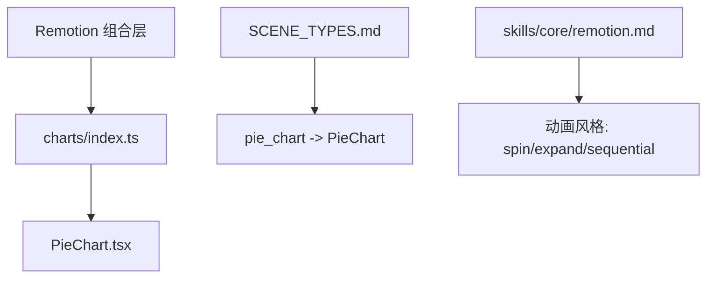
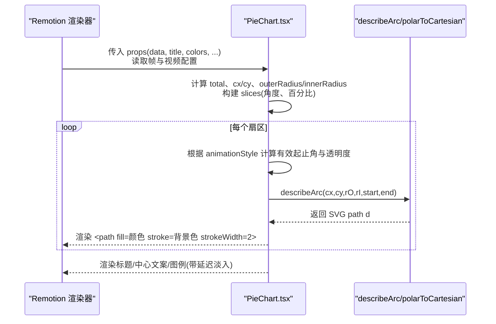
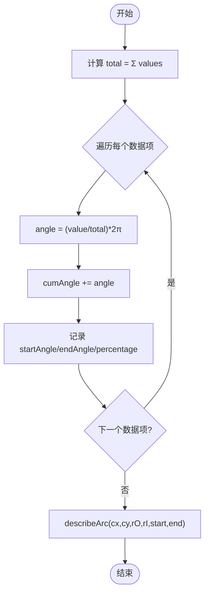
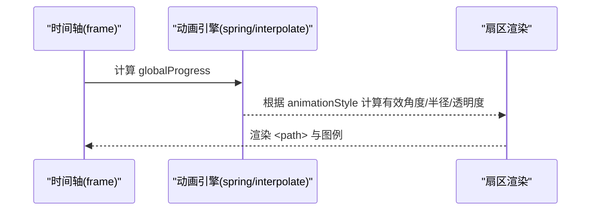
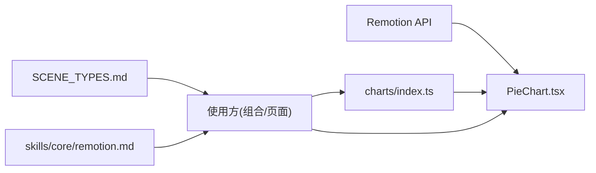

# 饼图组件

<cite>
**本文引用的文件**
- [PieChart.tsx](file://remotion-composer/src/components/charts/PieChart.tsx)
- [index.ts](file://remotion-composer/src/components/charts/index.ts)
- [SCENE_TYPES.md](file://remotion-composer/SCENE_TYPES.md)
- [remotion.md](file://skills/core/remotion.md)
</cite>

## 目录
1. [简介](#简介)
2. [项目结构](#项目结构)
3. [核心组件](#核心组件)
4. [架构总览](#架构总览)
5. [详细组件分析](#详细组件分析)
6. [依赖关系分析](#依赖关系分析)
7. [性能考量](#性能考量)
8. [故障排查指南](#故障排查指南)
9. [结论](#结论)
10. [附录](#附录)

## 简介
本文件为 Remotion 环境下的 PieChart 饼图组件使用文档。内容涵盖：数据格式、配置选项与视觉定制；数学计算原理（角度、扇形路径、中心定位、比例分配）；动画效果（展开、旋转、顺序出现、淡入淡出）；完整使用示例（颜色方案、标签位置、百分比显示、边框样式）；数据验证与边界处理（零值、负值）；可访问性支持与键盘导航建议。

## 项目结构
- 饼图组件位于 remotion-composer 的 charts 子目录，通过 index.ts 统一导出。
- 场景类型清单 SCENE_TYPES.md 将 pie_chart 映射到 PieChart 组件，并列出常用字段。
- skills/core/remotion.md 提供支持的图表类型与动画风格说明。

**图示来源**
- [index.ts:1-5](file://remotion-composer/src/components/charts/index.ts#L1-L5)
- [SCENE_TYPES.md:20-23](file://remotion-composer/SCENE_TYPES.md#L20-L23)
- [remotion.md:57-64](file://skills/core/remotion.md#L57-L64)

**章节来源**
- [index.ts:1-5](file://remotion-composer/src/components/charts/index.ts#L1-L5)
- [SCENE_TYPES.md:20-23](file://remotion-composer/SCENE_TYPES.md#L20-L23)
- [remotion.md:57-64](file://skills/core/remotion.md#L57-L64)

## 核心组件
- 组件名：PieChart
- 输入数据：数组，每项包含类别标签 label、数值 value、可选颜色 color
- 关键属性：
  - data: 数据源
  - title: 标题文本
  - colors: 颜色数组（默认多色）
  - fontFamily/textColor/backgroundColor: 字体与配色
  - donut: 是否环形图
  - centerLabel/centerValue: 环形图中心文案
  - showLegend: 是否显示图例
  - animationStyle: "spin" | "expand" | "sequential"

**章节来源**
- [PieChart.tsx:9-43](file://remotion-composer/src/components/charts/PieChart.tsx#L9-L43)

## 架构总览
PieChart 基于 Remotion 的时间轴能力，使用 spring/interpolate 驱动动画，SVG 绘制扇形与文字。布局根据是否显示图例和标题动态调整中心坐标与半径，内部通过 describeArc 生成 SVG path。

**图示来源**
- [PieChart.tsx:44-89](file://remotion-composer/src/components/charts/PieChart.tsx#L44-L89)
- [PieChart.tsx:120-205](file://remotion-composer/src/components/charts/PieChart.tsx#L120-L205)
- [PieChart.tsx:207-247](file://remotion-composer/src/components/charts/PieChart.tsx#L207-L247)
- [PieChart.tsx:250-298](file://remotion-composer/src/components/charts/PieChart.tsx#L250-L298)
- [PieChart.tsx:307-352](file://remotion-composer/src/components/charts/PieChart.tsx#L307-L352)

## 详细组件分析

### 数据格式要求
- 基本结构：{ label: string; value: number; color?: string }[]
- 类别与数值对：label 表示类别名称，value 表示该类别的数值大小
- 颜色覆盖：若 datum.color 未设置，则按索引从 colors 中循环取色

**章节来源**
- [PieChart.tsx:9-13](file://remotion-composer/src/components/charts/PieChart.tsx#L9-L13)
- [PieChart.tsx:31-43](file://remotion-composer/src/components/charts/PieChart.tsx#L31-L43)
- [PieChart.tsx:64-74](file://remotion-composer/src/components/charts/PieChart.tsx#L64-L74)

### 配置选项与视觉定制
- 标题与主题：title、fontFamily、textColor、backgroundColor
- 环形图：donut=true 时启用内圆，配合 centerLabel/centerValue 显示中心信息
- 图例：showLegend=true 时在右侧或外侧显示类别与百分比
- 颜色方案：colors 数组决定扇区填充色，支持自定义
- 边框样式：stroke 使用 backgroundColor，strokeWidth=2，形成扇区间分隔线

**章节来源**
- [PieChart.tsx:17-43](file://remotion-composer/src/components/charts/PieChart.tsx#L17-L43)
- [PieChart.tsx:100-118](file://remotion-composer/src/components/charts/PieChart.tsx#L100-L118)
- [PieChart.tsx:195-204](file://remotion-composer/src/components/charts/PieChart.tsx#L195-L204)
- [PieChart.tsx:250-298](file://remotion-composer/src/components/charts/PieChart.tsx#L250-L298)

### 数学计算原理
- 比例分配：total = sum(values)，每类占比 = value / total
- 角度计算：angle = (value / total) * 2π，起始角从 -π/2（顶部）开始累积
- 中心定位：cx 根据是否显示图例调整，cy 根据是否有标题调整
- 扇形路径生成：
  - 全圆扇形：M 中心 L 外弧起点 A 外弧终点 Z
  - 环形扇形：外弧 A → 内弧连线 → 内弧反向 A → Z
  - largeArc 标志由角度跨度是否大于 π 决定
- 极坐标转笛卡尔：x = cx + r·cos(angle), y = cy + r·sin(angle)

**图示来源**
- [PieChart.tsx:47-74](file://remotion-composer/src/components/charts/PieChart.tsx#L47-L74)
- [PieChart.tsx:307-352](file://remotion-composer/src/components/charts/PieChart.tsx#L307-L352)

**章节来源**
- [PieChart.tsx:47-74](file://remotion-composer/src/components/charts/PieChart.tsx#L47-L74)
- [PieChart.tsx:307-352](file://remotion-composer/src/components/charts/PieChart.tsx#L307-L352)

### 动画效果实现
- 全局进度：spring(frame, fps, config) 控制整体进入动画
- 结尾淡出：interpolate(frame, [duration-15, duration], [1,0])
- 三种动画风格：
  - spin：整体扫过整圆，逐步揭示扇区（clip endAngle）
  - expand：从中心径向放大半径（rO/rI 随 globalProgress 变化）
  - sequential：逐个扇区依次出现（staggerDelay 递增），各自独立 spring
- 透明度控制：不同风格下分别控制 sliceOpacity 与路径可见性
- 图例淡入：逐行延迟 spring，增强节奏感

**图示来源**
- [PieChart.tsx:76-89](file://remotion-composer/src/components/charts/PieChart.tsx#L76-L89)
- [PieChart.tsx:120-184](file://remotion-composer/src/components/charts/PieChart.tsx#L120-L184)
- [PieChart.tsx:250-298](file://remotion-composer/src/components/charts/PieChart.tsx#L250-L298)

**章节来源**
- [PieChart.tsx:76-89](file://remotion-composer/src/components/charts/PieChart.tsx#L76-L89)
- [PieChart.tsx:120-184](file://remotion-composer/src/components/charts/PieChart.tsx#L120-L184)
- [PieChart.tsx:250-298](file://remotion-composer/src/components/charts/PieChart.tsx#L250-L298)

### 完整使用示例
- 基础饼图：传入 data，自动计算比例与角度，显示图例与百分比
- 环形图：设置 donut=true，并提供 centerLabel/centerValue
- 颜色方案：自定义 colors 数组以匹配品牌色
- 标签位置：通过 showLegend 控制图例位置（右侧或外侧）
- 百分比显示：图例中显示 percentage.toFixed(1)%
- 边框样式：stroke 使用 backgroundColor，strokeWidth=2，形成清晰分割

提示：在 Remotion 组合中使用 pie_chart 场景类型，参考 SCENE_TYPES.md 字段映射。

**章节来源**
- [PieChart.tsx:17-43](file://remotion-composer/src/components/charts/PieChart.tsx#L17-L43)
- [PieChart.tsx:207-247](file://remotion-composer/src/components/charts/PieChart.tsx#L207-L247)
- [PieChart.tsx:250-298](file://remotion-composer/src/components/charts/PieChart.tsx#L250-L298)
- [SCENE_TYPES.md:20-23](file://remotion-composer/SCENE_TYPES.md#L20-L23)

### 数据验证机制、零值与负值处理
- 零值处理：当 total 为 0 时，代码使用 || 1 避免除零错误，确保不崩溃
- 负值处理：当前实现未显式过滤负值，负值会参与角度计算，可能导致异常扇形；建议在调用方保证 value ≥ 0
- 空数据：data 为空时 total=0，后续逻辑不会报错，但无扇形渲染

建议：在业务层增加校验，确保 value 为非负数，并在必要时提供空状态占位。

**章节来源**
- [PieChart.tsx:47-47](file://remotion-composer/src/components/charts/PieChart.tsx#L47-L47)

### 可访问性支持与键盘导航
- 当前实现未内置 aria-* 属性或键盘事件监听
- 建议扩展：
  - 为图例与扇区添加 role="list"/role="listitem" 及 aria-label
  - 为交互元素（如未来扩展的悬停/点击）提供 tabindex 与键盘事件
  - 为屏幕阅读器提供语义化描述（如“XX 类别占比 YY%”）
- 在 Remotion 视频中，可结合字幕或旁白补充可访问性信息

**章节来源**
- [PieChart.tsx:100-298](file://remotion-composer/src/components/charts/PieChart.tsx#L100-L298)

## 依赖关系分析
- 运行时依赖：Remotion 提供的 AbsoluteFill、interpolate、spring、useCurrentFrame、useVideoConfig
- 组件导出：charts/index.ts 统一导出 PieChart
- 场景集成：SCENE_TYPES.md 将 pie_chart 映射到 PieChart，并声明常用字段
- 动画风格：skills/core/remotion.md 列举了 pie 的动画风格（spin/expand/sequential）

**图示来源**
- [index.ts:1-5](file://remotion-composer/src/components/charts/index.ts#L1-L5)
- [SCENE_TYPES.md:20-23](file://remotion-composer/SCENE_TYPES.md#L20-L23)
- [remotion.md:57-64](file://skills/core/remotion.md#L57-L64)
- [PieChart.tsx:1-7](file://remotion-composer/src/components/charts/PieChart.tsx#L1-L7)

**章节来源**
- [index.ts:1-5](file://remotion-composer/src/components/charts/index.ts#L1-L5)
- [SCENE_TYPES.md:20-23](file://remotion-composer/SCENE_TYPES.md#L20-L23)
- [remotion.md:57-64](file://skills/core/remotion.md#L57-L64)
- [PieChart.tsx:1-7](file://remotion-composer/src/components/charts/PieChart.tsx#L1-L7)

## 性能考量
- 动画使用 spring/interpolate，避免频繁重排，适合 Remotion 帧驱动
- 扇形路径计算在每帧进行，数据量大时可考虑缓存 slices
- 图例逐条延迟淡入，注意条目数量对渲染开销的影响
- 结尾淡出使用 interpolate，开销较低

[本节为通用指导，无需特定文件引用]

## 故障排查指南
- 数据为空：total=0，不会渲染扇形；请检查数据源
- 除零风险：已用 || 1 保护，但若所有值为 0，仍无扇形；建议业务层校验
- 负值导致异常：当前未拦截负值，可能产生不可预期扇形；请在调用前过滤
- 颜色不足：colors 长度小于数据量时会循环复用；如需唯一色，请提供足够颜色
- 图例遮挡：当 showLegend=true 时，cx 左移以避免重叠；可根据布局调整

**章节来源**
- [PieChart.tsx:47-51](file://remotion-composer/src/components/charts/PieChart.tsx#L47-L51)
- [PieChart.tsx:64-74](file://remotion-composer/src/components/charts/PieChart.tsx#L64-L74)

## 结论
PieChart 提供了简洁而强大的饼图/环形图能力，支持多种动画风格与丰富的视觉定制。其数学计算清晰、路径生成稳定，适合在 Remotion 视频场景中展示比例数据。建议在业务层完善数据校验与可访问性增强，以获得更健壮的体验。

[本节为总结，无需特定文件引用]

## 附录
- 场景类型与字段映射：参见 SCENE_TYPES.md 中 pie_chart 行
- 动画风格列表：参见 skills/core/remotion.md 中的 chart animations

**章节来源**
- [SCENE_TYPES.md:20-23](file://remotion-composer/SCENE_TYPES.md#L20-L23)
- [remotion.md:57-64](file://skills/core/remotion.md#L57-L64)