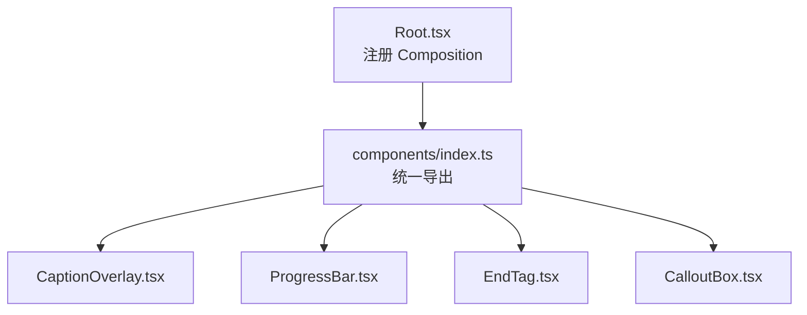
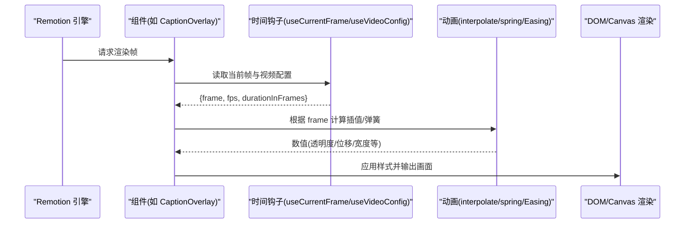
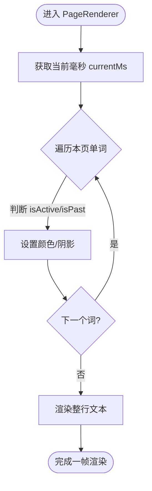
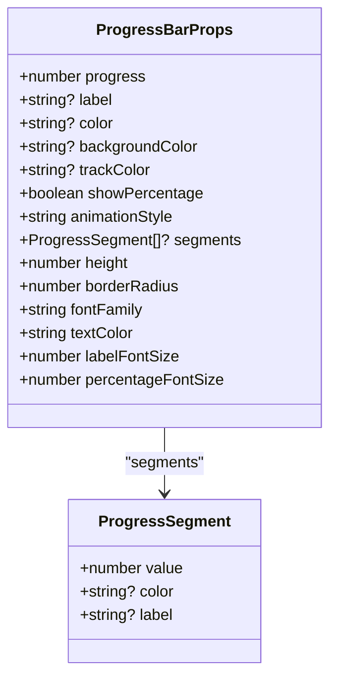
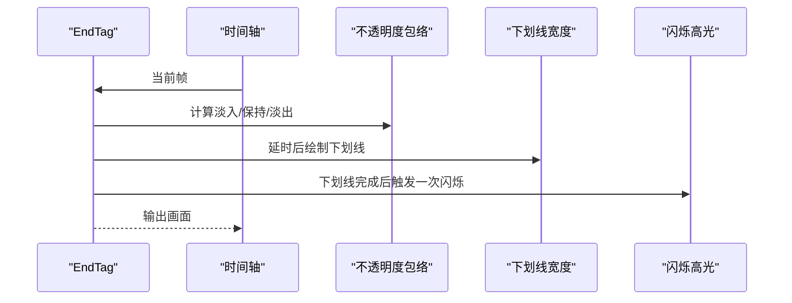
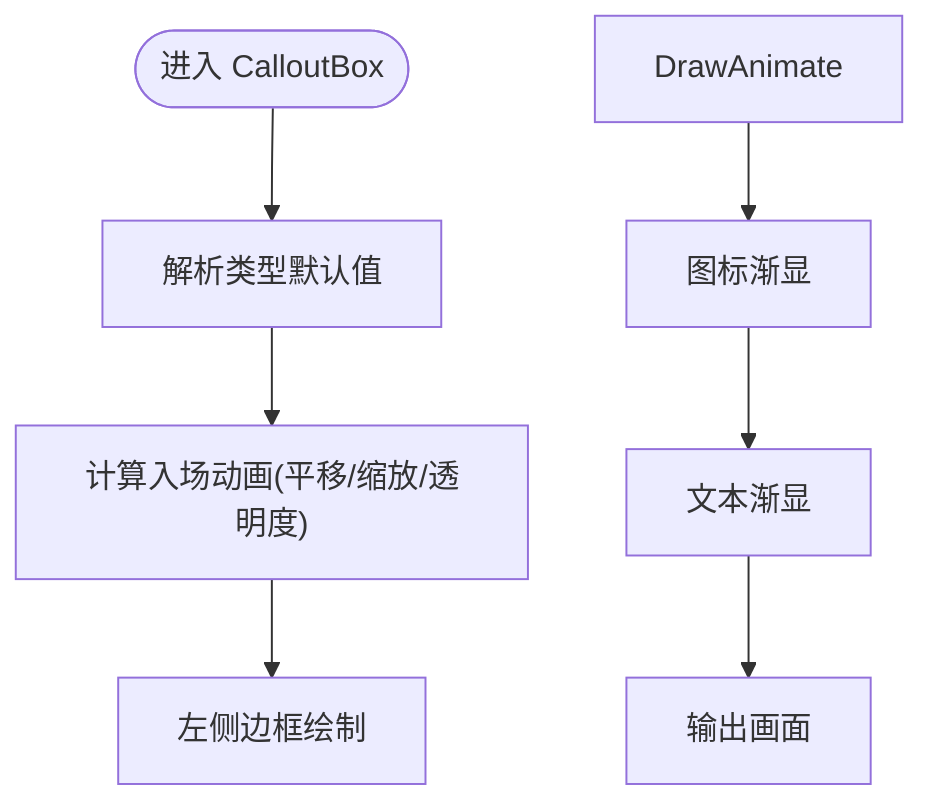
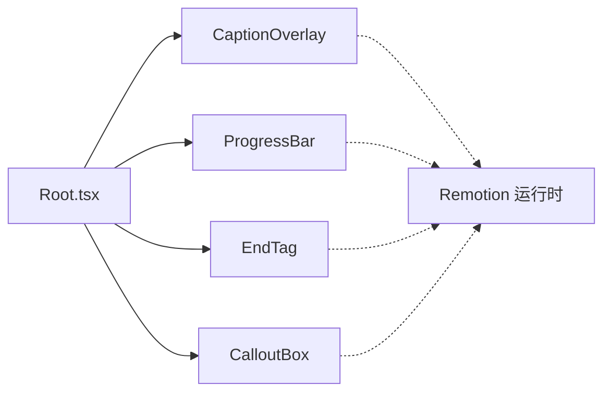

# 实用工具组件

<cite>
**本文引用的文件**
- [CaptionOverlay.tsx](file://remotion-composer/src/components/CaptionOverlay.tsx)
- [ProgressBar.tsx](file://remotion-composer/src/components/ProgressBar.tsx)
- [EndTag.tsx](file://remotion-composer/src/components/EndTag.tsx)
- [CalloutBox.tsx](file://remotion-composer/src/components/CalloutBox.tsx)
- [index.ts](file://remotion-composer/src/components/index.ts)
- [Root.tsx](file://remotion-composer/src/Root.tsx)
</cite>

## 目录
1. [简介](#简介)
2. [项目结构](#项目结构)
3. [核心组件](#核心组件)
4. [架构总览](#架构总览)
5. [详细组件分析](#详细组件分析)
6. [依赖关系分析](#依赖关系分析)
7. [性能考量](#性能考量)
8. [故障排查指南](#故障排查指南)
9. [结论](#结论)
10. [附录：API参考与配置选项](#附录api参考与配置选项)

## 简介
本文件面向在 Remotion 项目中集成“实用工具组件”的开发者，系统性说明以下四个组件的能力、配置项与最佳实践：
- CaptionOverlay：字幕覆盖层，支持逐词高亮、分页显示、位置控制与入场动画。
- ProgressBar：进度条，支持状态管理（填充/脉冲/步进）、样式定制与百分比反馈。
- EndTag：结束标签，提供品牌化收尾卡片、淡入淡出时序与可选叠加模式。
- CalloutBox：强调框，用于信息提示、警告、技巧与引用，支持图标、标题与视觉层次。

文档同时给出 API 参考、使用示例路径、可访问性与国际化适配建议，帮助你在实际项目中高效复用这些组件。

## 项目结构
这些组件位于 remotion-composer 的 components 目录中，并通过统一的 index.ts 导出；根入口 Root.tsx 注册了多个 Composition，其中包含 CaptionOverlay、EndTag 等组件的默认演示配置。

图表来源
- [Root.tsx:13-18](file://remotion-composer/src/Root.tsx#L13-L18)
- [index.ts:1-20](file://remotion-composer/src/components/index.ts#L1-L20)

章节来源
- [Root.tsx:135-336](file://remotion-composer/src/Root.tsx#L135-L336)
- [index.ts:1-20](file://remotion-composer/src/components/index.ts#L1-L20)

## 核心组件
- CaptionOverlay：基于帧时间计算当前词，按页展示并做弹簧入场动画；支持自定义字体、颜色、背景、分隔符与每页词数。
- ProgressBar：支持 fill/pulse/step 三种动画风格，支持分段进度与标签，提供容器入场动画与百分比显示。
- EndTag：黑底白字的品牌式结尾卡，带下划线绘制与一次从左到右的闪烁高光；支持淡入/保持/淡出时长与透明叠加模式。
- CalloutBox：四种类型（info/warning/tip/quote）的强调框，左侧边框绘制动画、图标与文本分层呈现，支持标题与正文字号。

章节来源
- [CaptionOverlay.tsx:10-38](file://remotion-composer/src/components/CaptionOverlay.tsx#L10-L38)
- [ProgressBar.tsx:9-32](file://remotion-composer/src/components/ProgressBar.tsx#L9-L32)
- [EndTag.tsx:9-22](file://remotion-composer/src/components/EndTag.tsx#L9-L22)
- [CalloutBox.tsx:9-23](file://remotion-composer/src/components/CalloutBox.tsx#L9-L23)

## 架构总览
所有组件均基于 Remotion 的 AbsoluteFill、Sequence、useCurrentFrame、useVideoConfig、interpolate、spring、Easing 等能力构建，遵循“数据驱动 + 时间轴驱动”的模式：通过 props 传入内容与时序参数，组件内部根据当前帧计算动画与渲染结果。

图表来源
- [CaptionOverlay.tsx:60-136](file://remotion-composer/src/components/CaptionOverlay.tsx#L60-L136)
- [ProgressBar.tsx:50-120](file://remotion-composer/src/components/ProgressBar.tsx#L50-L120)
- [EndTag.tsx:60-119](file://remotion-composer/src/components/EndTag.tsx#L60-L119)
- [CalloutBox.tsx:48-107](file://remotion-composer/src/components/CalloutBox.tsx#L48-L107)

## 详细组件分析

### CaptionOverlay 字幕覆盖层
- 文本格式化
  - 输入为逐词时间戳数组，支持每页词数 wordsPerPage 与强制分页标记 pageBreakAfter。
  - 支持字体 family、字号 fontSize、词间分隔 wordSeparator（空格语言用空格，CJK 语言可用空串）。
  - 当前词高亮 highlightColor，历史词半透明 color，背景 backgroundColor。
- 位置控制
  - 底部居中布局，可通过外层容器样式调整；当前实现固定底部内边距与最大宽度。
- 动画效果
  - 页面级弹簧入场（translateY + opacity），词级高亮切换无 CSS transition（Remotion 限制）。
  - 使用 Sequence 将每页映射到独立时间段，自动计算 from/durationInFrames。

图表来源
- [CaptionOverlay.tsx:68-136](file://remotion-composer/src/components/CaptionOverlay.tsx#L68-L136)

使用示例与最佳实践
- 在 Root.tsx 中已注册 CaptionOverlay 的 Composition，可直接查看默认 props 与演示用法。
- 建议：
  - 对 CJK 语言设置 wordSeparator="" 以避免多余空格。
  - 合理设置 wordsPerPage，保证单屏可读性。
  - 使用主题色或品牌色作为 highlightColor，提升对比度。

章节来源
- [CaptionOverlay.tsx:10-178](file://remotion-composer/src/components/CaptionOverlay.tsx#L10-L178)
- [Root.tsx:256-270](file://remotion-composer/src/Root.tsx#L256-L270)

### ProgressBar 进度条
- 状态管理
  - progress 取值 0-100，内部会 clamp。
  - 三段式动画：fill（平滑填充）、pulse（完成后微脉冲）、step（离散步进，步数可由 segments 决定）。
- 样式定制
  - 主色 color、轨道色 trackColor、背景色 backgroundColor、圆角 borderRadius、高度 height。
  - 文本 fontFamily、textColor、labelFontSize、percentageFontSize。
  - 支持分段 segments（value/color/label），并在轨道下方显示对应标签。
- 交互反馈
  - 容器入场动画（opacity + scale），百分比延迟出现，分段条目依次渐显。
  - step 模式下 width 变化附带短暂过渡，增强节奏感。

图表来源
- [ProgressBar.tsx:9-32](file://remotion-composer/src/components/ProgressBar.tsx#L9-L32)

使用示例与最佳实践
- 推荐在数据更新时同步 progress，确保动画与业务状态一致。
- 分段场景建议使用 segments 以表达多阶段进度，并为每段提供语义化 label。
- 若需与品牌强绑定，优先通过 color/trackColor/background 组合实现。

章节来源
- [ProgressBar.tsx:9-285](file://remotion-composer/src/components/ProgressBar.tsx#L9-L285)

### EndTag 结束标签
- 设计模式
  - 黑底白字的品牌式收尾卡，带下划线绘制与一次从左到右的闪烁高光。
  - 支持两种调色板 palette（冷/暖），以及 overlay 模式用于后期合成。
- 时序控制
  - fadeInSeconds / holdSeconds / fadeOutSeconds 精确控制淡入、保持、淡出时长。
  - 下划线绘制与闪烁高光有固定相对延迟，形成“先字后线再闪”的节奏。
- 品牌元素集成
  - 通过 palette 快速切换品牌配色；overlay=true 时可叠加于主体画面上方，适合与 FFmpeg 主体拼接或后期合成。

图表来源
- [EndTag.tsx:60-119](file://remotion-composer/src/components/EndTag.tsx#L60-L119)

使用示例与最佳实践
- Root.tsx 提供了 EndTag 与 EndTagOverlay 两个 Composition，可直接参考其默认 props。
- 建议在纪录片/品牌片中作为收尾卡，配合音频淡出以获得更好的情绪收束。
- 如需与主体画面合成，开启 overlay 并使用支持 Alpha 的编码格式。

章节来源
- [EndTag.tsx:9-204](file://remotion-composer/src/components/EndTag.tsx#L9-L204)
- [Root.tsx:299-332](file://remotion-composer/src/Root.tsx#L299-L332)

### CalloutBox 强调框
- 内容组织
  - 支持 title 与 text 两段内容，title 使用强调色，text 使用正文色。
  - 四种类型 info/warning/tip/quote，分别自带 icon、border、bg 默认值。
- 图标使用
  - 内置 emoji 图标，也可通过 icon 自定义；quote 类型使用衬线体与大号引号。
- 视觉层次
  - 左侧边框从顶部向下绘制，整体滑入+缩放弹跳，图标与文本依次渐显，营造层次感。
  - 容器背景 containerBackgroundColor 可覆盖默认白色背景。

图表来源
- [CalloutBox.tsx:48-107](file://remotion-composer/src/components/CalloutBox.tsx#L48-L107)

使用示例与最佳实践
- 在教程/产品视频中用于突出关键信息或引用，注意保持文字长度与字号平衡。
- quote 类型适合长引用，配合衬线体提升阅读体验。
- 通过 borderColor/backgroundColor/textColor 进行品牌化微调。

章节来源
- [CalloutBox.tsx:9-214](file://remotion-composer/src/components/CalloutBox.tsx#L9-L214)

## 依赖关系分析
- 组件均依赖 Remotion 运行时能力（AbsoluteFill、Sequence、useCurrentFrame、useVideoConfig、interpolate、spring、Easing）。
- 组件之间无直接耦合，通过 props 解耦，便于在任意 Composition 中复用。
- Root.tsx 集中注册各组件的 Composition，便于统一管理与演示。

图表来源
- [Root.tsx:135-336](file://remotion-composer/src/Root.tsx#L135-L336)
- [CaptionOverlay.tsx:1-8](file://remotion-composer/src/components/CaptionOverlay.tsx#L1-L8)
- [ProgressBar.tsx:1-7](file://remotion-composer/src/components/ProgressBar.tsx#L1-L7)
- [EndTag.tsx:1-7](file://remotion-composer/src/components/EndTag.tsx#L1-L7)
- [CalloutBox.tsx:1-7](file://remotion-composer/src/components/CalloutBox.tsx#L1-L7)

章节来源
- [Root.tsx:135-336](file://remotion-composer/src/Root.tsx#L135-L336)

## 性能考量
- 避免在 Remotion 中使用 CSS transition，改用 interpolate/spring（已在 CaptionOverlay 中体现）。
- 合理使用 Sequence 分页（CaptionOverlay）减少单帧复杂计算。
- ProgressBar 的分段动画通过 spring 与 delay 错开，避免同时大量重绘。
- EndTag 的闪烁高光仅在可见窗口内渲染，降低开销。
- CalloutBox 的动画参数（damping/stiffness）经过调优，兼顾流畅与性能。

[本节为通用指导，无需特定文件来源]

## 故障排查指南
- 字幕错位或换行异常
  - 检查 wordSeparator 是否为空（CJK 语言建议为空），确认 wordsPerPage 是否过大导致换行异常。
  - 参考：[CaptionOverlay.tsx:20-32](file://remotion-composer/src/components/CaptionOverlay.tsx#L20-L32)
- 进度条动画不同步
  - 确认 progress 始终在 0-100 范围内；若使用 step 模式，检查 segments 数量与 value 总和。
  - 参考：[ProgressBar.tsx:53-109](file://remotion-composer/src/components/ProgressBar.tsx#L53-L109)
- EndTag 叠加模式黑屏
  - overlay=true 时需使用支持 Alpha 的编码格式（VP9/WebM 或 ProRes 4444），并确保上层合成正确。
  - 参考：[EndTag.tsx:16-21](file://remotion-composer/src/components/EndTag.tsx#L16-L21)
- CalloutBox 文本不可见
  - 检查 textColor 与 backgroundColor 对比度；quote 类型使用衬线体，必要时调整字号。
  - 参考：[CalloutBox.tsx:108-110](file://remotion-composer/src/components/CalloutBox.tsx#L108-L110)

章节来源
- [CaptionOverlay.tsx:20-32](file://remotion-composer/src/components/CaptionOverlay.tsx#L20-L32)
- [ProgressBar.tsx:53-109](file://remotion-composer/src/components/ProgressBar.tsx#L53-L109)
- [EndTag.tsx:16-21](file://remotion-composer/src/components/EndTag.tsx#L16-L21)
- [CalloutBox.tsx:108-110](file://remotion-composer/src/components/CalloutBox.tsx#L108-L110)

## 结论
这四个实用工具组件覆盖了视频中的常见 UI 需求：字幕、进度、收尾与强调信息。它们以 Remotion 的时间驱动为核心，提供丰富的样式与动画能力，易于集成到各类 Composition 中。结合本文档的 API 参考与最佳实践，你可以在项目中快速搭建一致且高性能的视频界面。

[本节为总结，无需特定文件来源]

## 附录：API参考与配置选项

### CaptionOverlay
- 属性
  - words: WordCaption[]（必填）
  - wordsPerPage?: number（默认 6）
  - fontSize?: number（默认 42）
  - color?: string（默认 #F8FAFC）
  - highlightColor?: string（默认 #22D3EE）
  - backgroundColor?: string（默认 rgba(15,23,42,0.75)）
  - fontFamily?: string（默认 Space Grotesk, Inter, system-ui, sans-serif）
  - wordSeparator?: string（默认 " "）
- 数据结构
  - WordCaption.word: string
  - WordCaption.startMs: number
  - WordCaption.endMs: number
  - WordCaption.pageBreakAfter?: boolean
- 使用示例路径
  - [Root.tsx:256-270](file://remotion-composer/src/Root.tsx#L256-L270)

章节来源
- [CaptionOverlay.tsx:10-38](file://remotion-composer/src/components/CaptionOverlay.tsx#L10-L38)
- [CaptionOverlay.tsx:138-178](file://remotion-composer/src/components/CaptionOverlay.tsx#L138-L178)
- [Root.tsx:256-270](file://remotion-composer/src/Root.tsx#L256-L270)

### ProgressBar
- 属性
  - progress: number（必填，0-100）
  - label?: string
  - color?: string（默认 #2563EB）
  - backgroundColor?: string（默认 #FFFFFF）
  - trackColor?: string（默认 #E5E7EB）
  - showPercentage?: boolean（默认 true）
  - animationStyle?: "fill" | "pulse" | "step"（默认 "fill"）
  - segments?: ProgressSegment[]
  - height?: number（默认 32）
  - borderRadius?: number（默认 8）
  - fontFamily?: string（默认 Inter, system-ui, sans-serif）
  - textColor?: string（默认 #1F2937）
  - labelFontSize?: number（默认 36）
  - percentageFontSize?: number（默认 28）
- 数据结构
  - ProgressSegment.value: number
  - ProgressSegment.color?: string
  - ProgressSegment.label?: string
- 使用示例路径
  - 可在任意 Composition 中引入并传入上述 props；具体演示可参考同目录其他场景。

章节来源
- [ProgressBar.tsx:9-32](file://remotion-composer/src/components/ProgressBar.tsx#L9-L32)
- [ProgressBar.tsx:34-49](file://remotion-composer/src/components/ProgressBar.tsx#L34-L49)

### EndTag
- 属性
  - text: string（必填）
  - palette?: "cool_offwhite_on_black" | "warm_ivory_on_black"（默认 cool_offwhite_on_black）
  - fadeInSeconds?: number（默认 0.6）
  - holdSeconds?: number（默认 4.3）
  - fadeOutSeconds?: number（默认 0.6）
  - overlay?: boolean（默认 false）
- 使用示例路径
  - [Root.tsx:299-332](file://remotion-composer/src/Root.tsx#L299-L332)

章节来源
- [EndTag.tsx:9-22](file://remotion-composer/src/components/EndTag.tsx#L9-L22)
- [EndTag.tsx:52-59](file://remotion-composer/src/components/EndTag.tsx#L52-L59)
- [Root.tsx:299-332](file://remotion-composer/src/Root.tsx#L299-L332)

### CalloutBox
- 属性
  - text: string（必填）
  - type?: "info" | "warning" | "tip" | "quote"（默认 "info"）
  - icon?: string
  - title?: string
  - borderColor?: string
  - backgroundColor?: string
  - textColor?: string（默认 #1F2937）
  - fontFamily?: string（默认 Inter, system-ui, sans-serif）
  - fontSize?: number（默认 32）
  - titleFontSize?: number（默认 38）
  - containerBackgroundColor?: string（默认 #FFFFFF）
- 使用示例路径
  - 可在任意 Composition 中引入并传入上述 props；具体演示可参考同目录其他场景。

章节来源
- [CalloutBox.tsx:9-23](file://remotion-composer/src/components/CalloutBox.tsx#L9-L23)
- [CalloutBox.tsx:35-47](file://remotion-composer/src/components/CalloutBox.tsx#L35-L47)

## 可访问性与国际化适配

- 可访问性
  - 字幕与强调框文本应具备良好的对比度；CaptionOverlay 与 CalloutBox 均支持自定义颜色，建议在高对比度背景下测试可读性。
  - 进度条的百分比文本与标签清晰可读，必要时增大 percentageFontSize/labelFontSize。
  - EndTag 使用大字号与高对比度配色，确保远距离可读。
- 国际化
  - CaptionOverlay 的 wordSeparator 可用于适配不同语言的空格习惯（CJK 语言建议为空）。
  - 文本内容通过 props 传入，便于接入 i18n 资源；字体族可替换为多语言友好字体。
  - CalloutBox 的 icon 可替换为本地化图标或文案；quote 类型使用衬线体更适合多语言排版。

[本节为通用指导，无需特定文件来源]