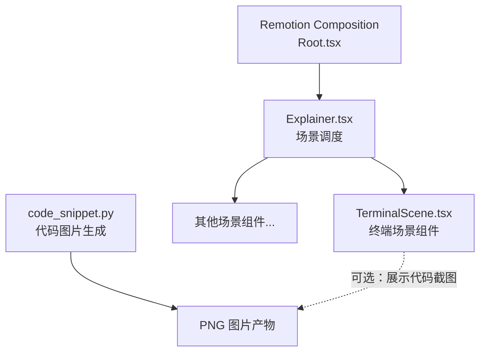
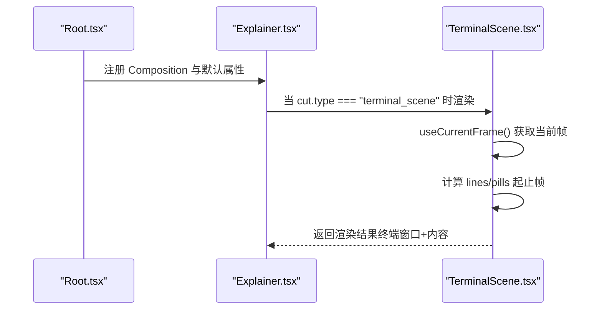
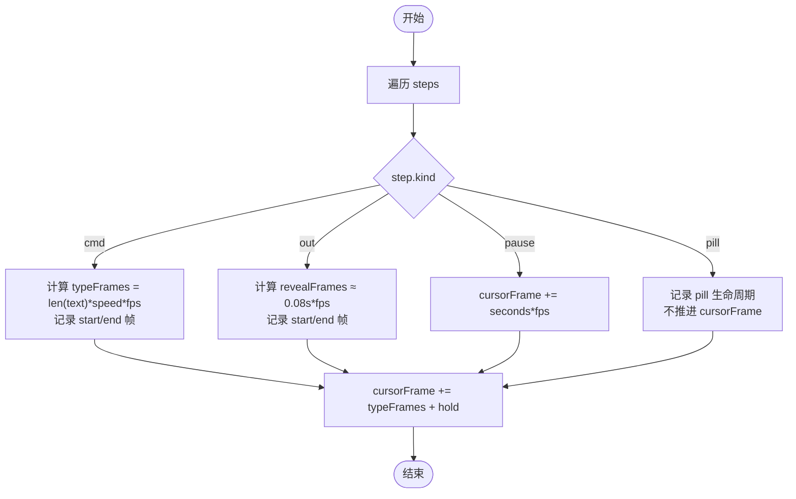
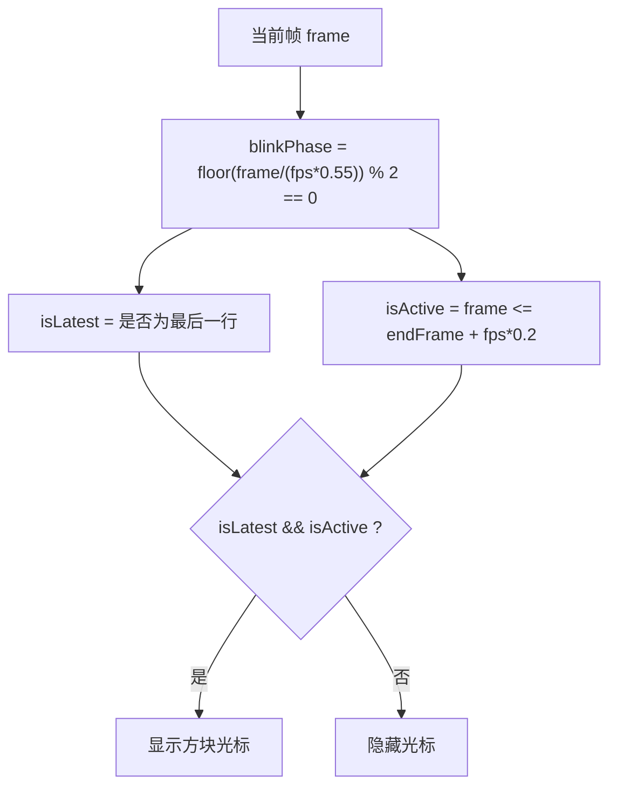
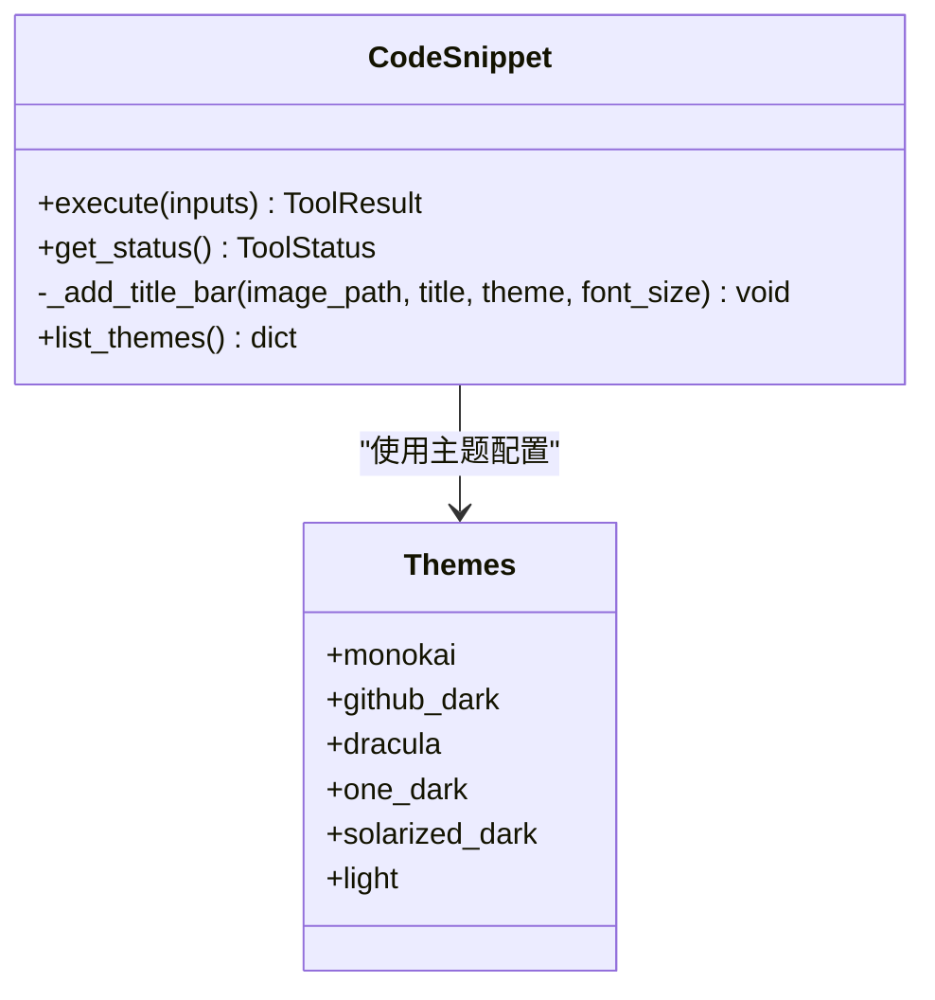
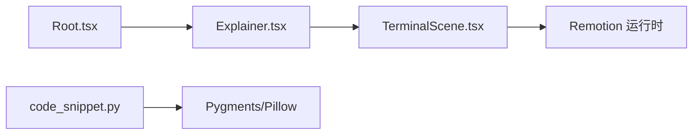

# 终端场景组件

<cite>
**本文引用的文件**
- [TerminalScene.tsx](file://remotion-composer/src/components/TerminalScene.tsx)
- [Explainer.tsx](file://remotion-composer/src/Explainer.tsx)
- [Root.tsx](file://remotion-composer/src/Root.tsx)
- [code_snippet.py](file://tools/graphics/code_snippet.py)
- [context-sensitive-cursor.md](file://.agents/skills/hyperframes-animation/rules/context-sensitive-cursor.md)
- [text-animations-typewriter.tsx](file://.claude/skills/remotion-best-practices/rules/assets/text-animations-typewriter.tsx)
</cite>

## 目录
1. [简介](#简介)
2. [项目结构](#项目结构)
3. [核心组件](#核心组件)
4. [架构总览](#架构总览)
5. [详细组件分析](#详细组件分析)
6. [依赖关系分析](#依赖关系分析)
7. [性能考虑](#性能考虑)
8. [故障排查指南](#故障排查指南)
9. [结论](#结论)
10. [附录](#附录)

## 简介
本文件为 TerminalScene 终端场景组件的使用与实现文档。该组件用于在 Remotion 时间线中呈现“终端窗口”风格的动画：逐字输入命令、输出行淡入、自动滚动、浮动提示胶囊等。它通过步骤序列驱动时序，结合 Remotion 的帧级插值与弹簧动画，提供可复现、可编排的终端演示效果。

同时，仓库提供了独立的代码片段渲染工具（基于 Pygments + Pillow），可用于生成带语法高亮、主题、行号、标题栏的代码图片，便于在视频或画中画中使用。

## 项目结构
- 终端场景组件位于 remotion-composer/src/components/TerminalScene.tsx，作为纯 React 组件暴露给上层编排器使用。
- 编排入口在 remotion-composer/src/Explainer.tsx，负责将不同 cut 类型（包括 terminal_scene）分发到对应组件。
- 主题系统集中在 remotion-composer/src/Root.tsx，提供内置主题与自定义主题注入方式。
- 代码高亮图片生成在 tools/graphics/code_snippet.py，支持多语言、多主题、行号、标题栏等。

图表来源
- [Root.tsx:135-152](file://remotion-composer/src/Root.tsx#L135-L152)
- [Explainer.tsx:235-271](file://remotion-composer/src/Explainer.tsx#L235-L271)
- [TerminalScene.tsx:1-267](file://remotion-composer/src/components/TerminalScene.tsx#L1-L267)
- [code_snippet.py:1-233](file://tools/graphics/code_snippet.py#L1-L233)

章节来源
- [Root.tsx:135-152](file://remotion-composer/src/Root.tsx#L135-L152)
- [Explainer.tsx:235-271](file://remotion-composer/src/Explainer.tsx#L235-L271)
- [TerminalScene.tsx:1-267](file://remotion-composer/src/components/TerminalScene.tsx#L1-L267)
- [code_snippet.py:1-233](file://tools/graphics/code_snippet.py#L1-L233)

## 核心组件
TerminalScene 是一个无状态、纯函数式驱动的终端动画组件，核心能力如下：
- 步骤驱动的时间轴：cmd（逐字输入）、out（输出行淡入）、pause（停顿）、pill（浮动提示）。
- 基于帧的打字速度控制：typeSpeed（秒/字符）与 holdSeconds（停留帧数）。
- 自动滚动：保持最近 N 行可见，超出则滚动。
- 光标闪烁：对最新命令行启用方块光标闪烁。
- 窗口入场动画：整体淡入并轻微缩放。
- 主题色：accentColor 控制提示符与强调色；backgroundColor 控制背景。

关键接口
- props：title、steps、prompt、accentColor、backgroundColor
- steps 类型：
  - cmd：{ kind: "cmd", text, typeSpeed?, holdSeconds? }
  - out：{ kind: "out", text, holdSeconds? }
  - pause：{ kind: "pause", seconds }
  - pill：{ kind: "pill", text, color?, durationSeconds? }

章节来源
- [TerminalScene.tsx:16-28](file://remotion-composer/src/components/TerminalScene.tsx#L16-L28)
- [TerminalScene.tsx:44-107](file://remotion-composer/src/components/TerminalScene.tsx#L44-L107)

## 架构总览
TerminalScene 在 Remotion 时间线中的集成流程：
- Root 注册 Composition 并提供默认配置。
- Explainer 根据 cut.type 选择具体组件，terminal_scene 会传入 steps 等参数。
- TerminalScene 内部以 useCurrentFrame 读取当前帧，计算每行的起止帧，按帧推进打字进度与淡入。
- 通过 interpolate/spring 实现平滑过渡与光标闪烁。

图表来源
- [Root.tsx:135-152](file://remotion-composer/src/Root.tsx#L135-L152)
- [Explainer.tsx:235-271](file://remotion-composer/src/Explainer.tsx#L235-L271)
- [TerminalScene.tsx:51-107](file://remotion-composer/src/components/TerminalScene.tsx#L51-L107)

## 详细组件分析

### 打字机效果与时间轴
- 打字速度：typeSpeed 单位为秒/字符，最终转换为“字符数 × speed × fps”得到打字持续帧数。
- 停留时间：holdSeconds 控制命令完成后停留的帧数，避免立即切换下一行。
- 输出行：out 类型以固定短时长淡入显示，同样支持 holdSeconds。
- 暂停：pause 类型不渲染任何内容，仅推进时间轴。
- 浮动提示：pill 类型非阻塞，不影响主时间轴推进，独立生命周期。

图表来源
- [TerminalScene.tsx:54-93](file://remotion-composer/src/components/TerminalScene.tsx#L54-L93)

章节来源
- [TerminalScene.tsx:54-93](file://remotion-composer/src/components/TerminalScene.tsx#L54-L93)

### 光标闪烁与行尾提示符样式
- 光标闪烁：基于当前帧与 fps 计算相位，仅在最新命令行且处于活跃期内显示。
- 提示符样式：prompt 文本颜色由 accentColor 控制，字体加粗，与命令文本分离。
- 行为细节：命令完成后短暂保持光标活跃，随后隐藏，避免视觉干扰。

图表来源
- [TerminalScene.tsx:103-105](file://remotion-composer/src/components/TerminalScene.tsx#L103-L105)
- [TerminalScene.tsx:171-199](file://remotion-composer/src/components/TerminalScene.tsx#L171-L199)

章节来源
- [TerminalScene.tsx:103-105](file://remotion-composer/src/components/TerminalScene.tsx#L103-L105)
- [TerminalScene.tsx:171-199](file://remotion-composer/src/components/TerminalScene.tsx#L171-L199)

### 自动滚动与可视区域
- 最大可见行数：MAX_VISIBLE = 18，超过后从末尾向前切片，保证最新内容可见。
- 滚动策略：仅过滤已开始的行 visibleLines，再取最后 N 行 renderedLines。

章节来源
- [TerminalScene.tsx:95-101](file://remotion-composer/src/components/TerminalScene.tsx#L95-L101)

### 主题与配色
- 组件级主题：accentColor（提示符与强调）、backgroundColor（背景）。
- 全局主题：Root.tsx 提供 THEMES 与 resolveTheme，可在 composition 级别注入 theme/themeConfig。
- 自定义主题：通过 props.themeConfig 覆盖默认主题字段，如 primaryColor/accentColor/backgroundColor 等。

章节来源
- [TerminalScene.tsx:44-50](file://remotion-composer/src/components/TerminalScene.tsx#L44-L50)
- [Root.tsx:24-121](file://remotion-composer/src/Root.tsx#L24-L121)

### 代码高亮与语法支持
TerminalScene 本身不直接进行语法着色，而是以纯文本形式逐字输入命令与输出。若需展示带语法高亮的代码块，可使用仓库提供的 code_snippet 工具生成图片，再在视频中嵌入。

- 高亮引擎：Pygments（lexer 解析语言，ImageFormatter 渲染图片）。
- 语言支持：通过 get_lexer_by_name(language) 指定语言，失败时 fallback 到 guess_lexer(code)。
- 主题支持：内置 monokai、github_dark、dracula、one_dark、solarized_dark、light 等。
- 格式化选项：font_size、padding、line_numbers、border_radius、title、width、output_path。

图表来源
- [code_snippet.py:25-63](file://tools/graphics/code_snippet.py#L25-L63)
- [code_snippet.py:66-187](file://tools/graphics/code_snippet.py#L66-L187)

章节来源
- [code_snippet.py:122-187](file://tools/graphics/code_snippet.py#L122-L187)

### 与 Remotion 时间线的集成
- 在 Explainer 中，当 cut.type === "terminal_scene" 时，将 steps、terminalTitle、prompt 等属性传递给 TerminalScene。
- 可通过 composition 的 calculateMetadata 控制总时长，确保足够容纳所有 steps 的持续时间。
- 推荐做法：将 steps 的总时长与旁白/音乐节拍对齐，使用 pause 精确控制节奏。

章节来源
- [Explainer.tsx:235-271](file://remotion-composer/src/Explainer.tsx#L235-L271)
- [Root.tsx:123-133](file://remotion-composer/src/Root.tsx#L123-L133)

### 动画控制技巧
- 使用 interpolate 将帧映射为进度（如打字进度、淡入透明度）。
- 使用 spring 实现自然弹跳的进入/退出动画（窗口淡入、pill 浮入）。
- 光标闪烁采用确定性 sin/模运算，避免 CSS @keyframes 在 seek 模式下失步。

章节来源
- [TerminalScene.tsx:107-108](file://remotion-composer/src/components/TerminalScene.tsx#L107-L108)
- [TerminalScene.tsx:221-262](file://remotion-composer/src/components/TerminalScene.tsx#L221-L262)
- [text-animations-typewriter.tsx:52-62](file://.claude/skills/remotion-best-practices/rules/assets/text-animations-typewriter.tsx#L52-L62)

## 依赖关系分析
- TerminalScene 依赖 Remotion API：useCurrentFrame、useVideoConfig、interpolate、spring、AbsoluteFill。
- 编排层依赖 Explainer 的分发逻辑与 Root 的主题系统。
- 代码高亮图片生成依赖 Python 库：pygments、Pillow。

图表来源
- [TerminalScene.tsx:1-2](file://remotion-composer/src/components/TerminalScene.tsx#L1-L2)
- [Explainer.tsx:235-271](file://remotion-composer/src/Explainer.tsx#L235-L271)
- [Root.tsx:135-152](file://remotion-composer/src/Root.tsx#L135-L152)
- [code_snippet.py:122-132](file://tools/graphics/code_snippet.py#L122-L132)

章节来源
- [TerminalScene.tsx:1-2](file://remotion-composer/src/components/TerminalScene.tsx#L1-L2)
- [Explainer.tsx:235-271](file://remotion-composer/src/Explainer.tsx#L235-L271)
- [Root.tsx:135-152](file://remotion-composer/src/Root.tsx#L135-L152)
- [code_snippet.py:122-132](file://tools/graphics/code_snippet.py#L122-L132)

## 性能考虑
- 大文件处理：TerminalScene 以帧为单位计算可见行，建议限制 steps 数量与单行长度，避免过多 DOM 节点。
- 内存管理：避免在 render 中创建大量闭包或对象；当前实现已在每帧内局部计算，注意不要引入外部重计算。
- 渲染性能调优：
  - 合理设置 MAX_VISIBLE，减少不必要的绘制。
  - 使用 spring 时调整 damping/stiffness，避免过度抖动导致频繁重排。
  - 对于长命令，适当增大 typeSpeed 或减少 holdSeconds，缩短总时长。
- 代码图片生成：
  - 使用 line_numbers=false 可减少渲染开销。
  - 复用相同 code/language/theme/font_size 的结果（工具具备幂等性键）。
  - 批量生成时控制并发与磁盘写入频率。

[本节为通用指导，不直接分析具体文件]

## 故障排查指南
- 依赖缺失：code_snippet 需要安装 pygments 与 Pillow，否则会返回不可用状态。
- 语言识别失败：若 lexer 名称错误，将回退到 guess_lexer；仍失败时需检查代码是否可被识别。
- 光标闪烁异常：确认使用确定性方法（帧模运算）而非 CSS 动画，避免 seek 模式下的不同步。
- 滚动异常：检查 steps 是否产生过多行，必要时降低 MAX_VISIBLE 或拆分步骤。
- 主题不生效：确认在 Root 层正确传递 theme 或 themeConfig，并确保 key 名匹配 ThemeConfig。

章节来源
- [code_snippet.py:114-132](file://tools/graphics/code_snippet.py#L114-L132)
- [TerminalScene.tsx:103-105](file://remotion-composer/src/components/TerminalScene.tsx#L103-L105)
- [context-sensitive-cursor.md:153-192](file://.agents/skills/hyperframes-animation/rules/context-sensitive-cursor.md#L153-L192)

## 结论
TerminalScene 提供了轻量、可控、可复现的终端演示能力，适合教程、安装引导、CLI 演示等场景。配合 code_snippet 工具可实现高质量代码图片的高亮展示。通过 Remotion 的帧级控制与主题系统，可以在统一风格下灵活编排时间与视觉表现。

[本节为总结性内容，不直接分析具体文件]

## 附录

### 使用示例（步骤设计）
以下为常见步骤组合思路（不直接粘贴代码，仅提供路径参考）：
- 命令输入 + 输出 + 浮动提示：
  - 参考：[TerminalScene.tsx:54-93](file://remotion-composer/src/components/TerminalScene.tsx#L54-L93)
- 长时间停顿与节奏控制：
  - 参考：[TerminalScene.tsx:81-83](file://remotion-composer/src/components/TerminalScene.tsx#L81-L83)
- 光标闪烁与活跃期：
  - 参考：[TerminalScene.tsx:171-199](file://remotion-composer/src/components/TerminalScene.tsx#L171-L199)

章节来源
- [TerminalScene.tsx:54-93](file://remotion-composer/src/components/TerminalScene.tsx#L54-L93)
- [TerminalScene.tsx:81-83](file://remotion-composer/src/components/TerminalScene.tsx#L81-L83)
- [TerminalScene.tsx:171-199](file://remotion-composer/src/components/TerminalScene.tsx#L171-L199)

### 代码高亮示例（多语言/多主题）
- 语言与主题选择：
  - 参考：[code_snippet.py:136-150](file://tools/graphics/code_snippet.py#L136-L150)
- 行号与标题栏：
  - 参考：[code_snippet.py:152-170](file://tools/graphics/code_snippet.py#L152-L170)
- 内置主题列表：
  - 参考：[code_snippet.py:25-63](file://tools/graphics/code_snippet.py#L25-L63)

章节来源
- [code_snippet.py:136-170](file://tools/graphics/code_snippet.py#L136-L170)
- [code_snippet.py:25-63](file://tools/graphics/code_snippet.py#L25-L63)

### 与 Remotion 时间线的集成要点
- 在 Explainer 中接入 terminal_scene：
  - 参考：[Explainer.tsx:235-271](file://remotion-composer/src/Explainer.tsx#L235-L271)
- 计算总时长与默认 Composition：
  - 参考：[Root.tsx:123-152](file://remotion-composer/src/Root.tsx#L123-L152)

章节来源
- [Explainer.tsx:235-271](file://remotion-composer/src/Explainer.tsx#L235-L271)
- [Root.tsx:123-152](file://remotion-composer/src/Root.tsx#L123-L152)