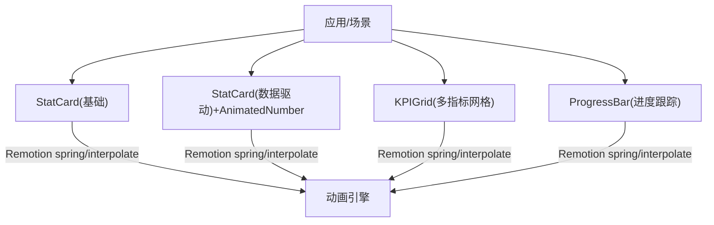
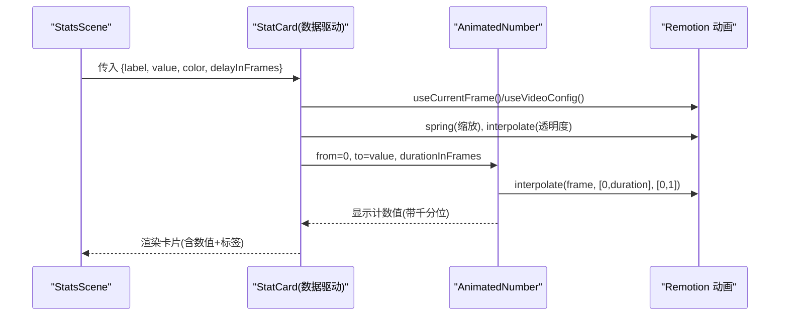
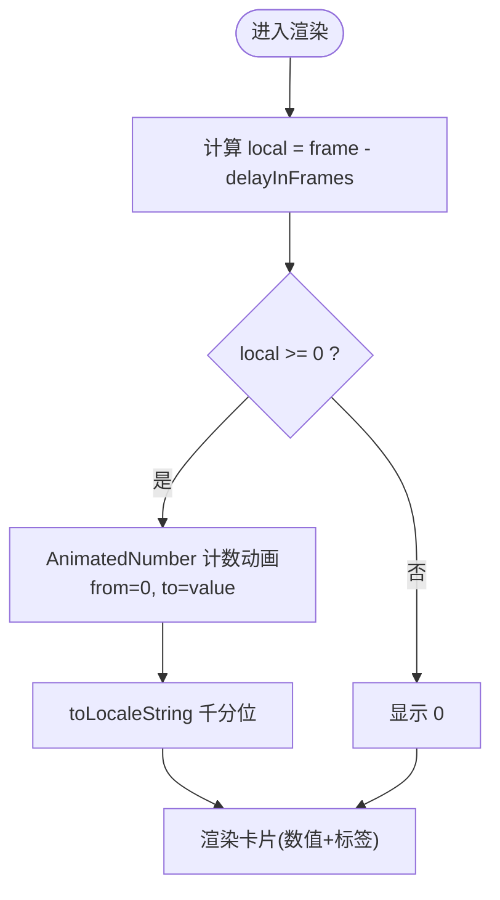
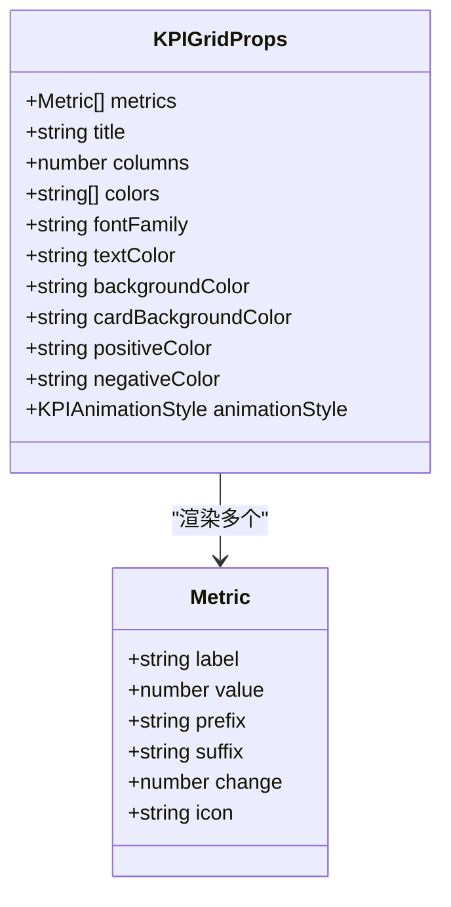
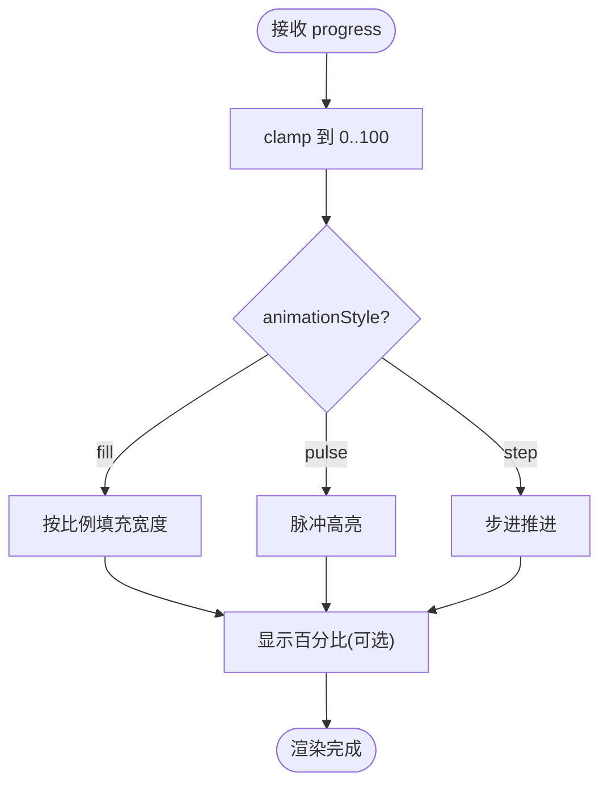
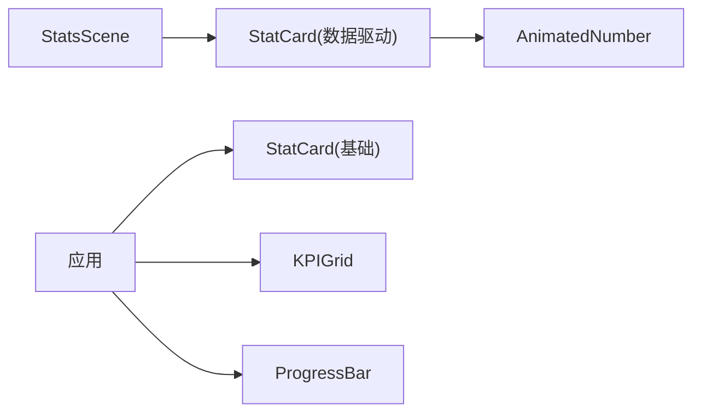

# 统计卡片组件

<cite>
**本文引用的文件**
- [remotion-composer/src/components/StatCard.tsx](file://remotion-composer/src/components/StatCard.tsx)
- [.agents/skills/remotion-to-hyperframes/assets/test-corpus/tier-3-data-driven/remotion-src/src/components/StatCard.tsx](file://.agents/skills/remotion-to-hyperframes/assets/test-corpus/tier-3-data-driven/remotion-src/src/components/StatCard.tsx)
- [.agents/skills/remotion-to-hyperframes/assets/test-corpus/tier-3-data-driven/remotion-src/src/components/AnimatedNumber.tsx](file://.agents/skills/remotion-to-hyperframes/assets/test-corpus/tier-3-data-driven/remotion-src/src/components/AnimatedNumber.tsx)
- [remotion-composer/src/components/charts/KPIGrid.tsx](file://remotion-composer/src/components/charts/KPIGrid.tsx)
- [remotion-composer/src/components/ProgressBar.tsx](file://remotion-composer/src/components/ProgressBar.tsx)
- [.agents/skills/remotion-to-hyperframes/assets/test-corpus/tier-3-data-driven/remotion-src/src/scenes/StatsScene.tsx](file://.agents/skills/remotion-to-hyperframes/assets/test-corpus/tier-3-data-driven/remotion-src/src/scenes/StatsScene.tsx)
</cite>

## 目录
1. [简介](#简介)
2. [项目结构](#项目结构)
3. [核心组件](#核心组件)
4. [架构总览](#架构总览)
5. [详细组件分析](#详细组件分析)
6. [依赖关系分析](#依赖关系分析)
7. [性能考量](#性能考量)
8. [故障排查指南](#故障排查指南)
9. [结论](#结论)
10. [附录](#附录)

## 简介
本文件面向 StatCard 统计卡片组件的使用与集成，覆盖数据绑定、数值动画（计数、进度条、百分比）、样式配置（尺寸、边框、阴影、主题色）、数据格式化（千分位、小数精度、货币符号）以及多场景示例（KPI展示、数据统计、进度跟踪）。同时提供数据校验、错误处理与性能优化的最佳实践建议。

## 项目结构
仓库中提供了多种形态的“统计卡片”能力：
- 基础统计卡片：用于快速展示单个关键指标，支持入场缩放与副标题渐显。
- 数据驱动卡片：结合 AnimatedNumber 实现从 0 到目标值的计数动画，并支持延迟入场。
- KPI 网格：批量展示多个指标，支持多种动画风格（count-up、pop、cascade），并提供变化指示器（百分比涨跌）。
- 进度条：用于进度跟踪，支持填充、脉冲、步进三种动画，可显示百分比或分段标签。

图表来源
- [remotion-composer/src/components/StatCard.tsx:1-78](file://remotion-composer/src/components/StatCard.tsx#L1-L78)
- [.agents/skills/remotion-to-hyperframes/assets/test-corpus/tier-3-data-driven/remotion-src/src/components/StatCard.tsx:1-60](file://.agents/skills/remotion-to-hyperframes/assets/test-corpus/tier-3-data-driven/remotion-src/src/components/StatCard.tsx#L1-L60)
- [.agents/skills/remotion-to-hyperframes/assets/test-corpus/tier-3-data-driven/remotion-src/src/components/AnimatedNumber.tsx:1-24](file://.agents/skills/remotion-to-hyperframes/assets/test-corpus/tier-3-data-driven/remotion-src/src/components/AnimatedNumber.tsx#L1-L24)
- [remotion-composer/src/components/charts/KPIGrid.tsx:1-368](file://remotion-composer/src/components/charts/KPIGrid.tsx#L1-L368)
- [remotion-composer/src/components/ProgressBar.tsx:1-284](file://remotion-composer/src/components/ProgressBar.tsx#L1-L284)

章节来源
- [remotion-composer/src/components/StatCard.tsx:1-78](file://remotion-composer/src/components/StatCard.tsx#L1-L78)
- [.agents/skills/remotion-to-hyperframes/assets/test-corpus/tier-3-data-driven/remotion-src/src/components/StatCard.tsx:1-60](file://.agents/skills/remotion-to-hyperframes/assets/test-corpus/tier-3-data-driven/remotion-src/src/components/StatCard.tsx#L1-L60)
- [.agents/skills/remotion-to-hyperframes/assets/test-corpus/tier-3-data-driven/remotion-src/src/components/AnimatedNumber.tsx:1-24](file://.agents/skills/remotion-to-hyperframes/assets/test-corpus/tier-3-data-driven/remotion-src/src/components/AnimatedNumber.tsx#L1-L24)
- [remotion-composer/src/components/charts/KPIGrid.tsx:1-368](file://remotion-composer/src/components/charts/KPIGrid.tsx#L1-L368)
- [remotion-composer/src/components/ProgressBar.tsx:1-284](file://remotion-composer/src/components/ProgressBar.tsx#L1-L284)

## 核心组件
- 基础 StatCard：适合单值强调展示，支持主数值、副标题、字号、颜色与背景定制，具备弹性缩放入场与副标题延迟渐显。
- 数据驱动 StatCard + AnimatedNumber：以数值为驱动，自动从 0 计数到目标值，支持延迟入场与卡片缩放淡入。
- KPIGrid：多指标网格，支持 count-up/pop/cascade 动画，提供前缀/后缀、变化百分比指示器、图标等。
- ProgressBar：进度条组件，支持 fill/pulse/step 动画，可显示百分比或分段标签，支持圆角、高度、字体等样式。

章节来源
- [remotion-composer/src/components/StatCard.tsx:1-78](file://remotion-composer/src/components/StatCard.tsx#L1-L78)
- [.agents/skills/remotion-to-hyperframes/assets/test-corpus/tier-3-data-driven/remotion-src/src/components/StatCard.tsx:1-60](file://.agents/skills/remotion-to-hyperframes/assets/test-corpus/tier-3-data-driven/remotion-src/src/components/StatCard.tsx#L1-L60)
- [.agents/skills/remotion-to-hyperframes/assets/test-corpus/tier-3-data-driven/remotion-src/src/components/AnimatedNumber.tsx:1-24](file://.agents/skills/remotion-to-hyperframes/assets/test-corpus/tier-3-data-driven/remotion-src/src/components/AnimatedNumber.tsx#L1-L24)
- [remotion-composer/src/components/charts/KPIGrid.tsx:1-368](file://remotion-composer/src/components/charts/KPIGrid.tsx#L1-L368)
- [remotion-composer/src/components/ProgressBar.tsx:1-284](file://remotion-composer/src/components/ProgressBar.tsx#L1-L284)

## 架构总览
以下序列图展示了“数据驱动 StatCard”的渲染流程：父场景传入 label/value/color/delayInFrames，子组件基于当前帧计算本地时间，使用 spring/interpolate 控制缩放与透明度，并通过 AnimatedNumber 完成计数动画。

图表来源
- [.agents/skills/remotion-to-hyperframes/assets/test-corpus/tier-3-data-driven/remotion-src/src/scenes/StatsScene.tsx:1-35](file://.agents/skills/remotion-to-hyperframes/assets/test-corpus/tier-3-data-driven/remotion-src/src/scenes/StatsScene.tsx#L1-L35)
- [.agents/skills/remotion-to-hyperframes/assets/test-corpus/tier-3-data-driven/remotion-src/src/components/StatCard.tsx:1-60](file://.agents/skills/remotion-to-hyperframes/assets/test-corpus/tier-3-data-driven/remotion-src/src/components/StatCard.tsx#L1-L60)
- [.agents/skills/remotion-to-hyperframes/assets/test-corpus/tier-3-data-driven/remotion-src/src/components/AnimatedNumber.tsx:1-24](file://.agents/skills/remotion-to-hyperframes/assets/test-corpus/tier-3-data-driven/remotion-src/src/components/AnimatedNumber.tsx#L1-L24)

## 详细组件分析

### 基础 StatCard（单值强调）
- 数据绑定
  - 输入：stat（字符串）、subtitle（可选）、statFontSize、subtitleFontSize、color、accentColor、backgroundColor。
  - 行为：主数值通过 transform: scale(spring) 入场；副标题在延迟后渐显。
- 数值动画
  - 无内置计数动画，适合静态数值或外部驱动更新。
- 样式配置
  - 支持背景、主色、强调色、字号等；布局居中，适配全屏容器。
- 适用场景
  - 封面式 KPI 强调、大数字强调展示。

章节来源
- [remotion-composer/src/components/StatCard.tsx:1-78](file://remotion-composer/src/components/StatCard.tsx#L1-L78)

### 数据驱动 StatCard + AnimatedNumber（计数动画）
- 数据绑定
  - 输入：label、value（数值）、color、delayInFrames。
  - 行为：根据 delayInFrames 计算 local = frame - delayInFrames，控制卡片缩放与淡入；当 local >= 0 时启动计数。
- 数值动画
  - 使用 AnimatedNumber 从 0 计数到 value，持续 durationInFrames，采用 easeOut 曲线，并使用 toLocaleString 输出千分位格式。
- 样式配置
  - 固定宽高、深色背景、圆角、彩色边框；数值与标签分别设置字号与字重。
- 适用场景
  - 排行榜、GitHub 指标（Stars/Forks/Issues）等需要动态计数的场景。

图表来源
- [.agents/skills/remotion-to-hyperframes/assets/test-corpus/tier-3-data-driven/remotion-src/src/components/StatCard.tsx:1-60](file://.agents/skills/remotion-to-hyperframes/assets/test-corpus/tier-3-data-driven/remotion-src/src/components/StatCard.tsx#L1-L60)
- [.agents/skills/remotion-to-hyperframes/assets/test-corpus/tier-3-data-driven/remotion-src/src/components/AnimatedNumber.tsx:1-24](file://.agents/skills/remotion-to-hyperframes/assets/test-corpus/tier-3-data-driven/remotion-src/src/components/AnimatedNumber.tsx#L1-L24)

章节来源
- [.agents/skills/remotion-to-hyperframes/assets/test-corpus/tier-3-data-driven/remotion-src/src/components/StatCard.tsx:1-60](file://.agents/skills/remotion-to-hyperframes/assets/test-corpus/tier-3-data-driven/remotion-src/src/components/StatCard.tsx#L1-L60)
- [.agents/skills/remotion-to-hyperframes/assets/test-corpus/tier-3-data-driven/remotion-src/src/components/AnimatedNumber.tsx:1-24](file://.agents/skills/remotion-to-hyperframes/assets/test-corpus/tier-3-data-driven/remotion-src/src/components/AnimatedNumber.tsx#L1-L24)

### KPIGrid（多指标网格）
- 数据模型
  - Metric：包含 label、value、prefix/suffix、change（百分比变化）、icon。
- 动画风格
  - count-up：数值按弹簧曲线增长；pop：卡片弹入；cascade：卡片依次滑入。
- 数值与格式化
  - 内部对 displayValue 进行 scale 化显示（K/M），并在末尾拼接 prefix/suffix。
  - change 指示器显示涨跌箭头与百分比，带延迟渐显。
- 样式配置
  - 支持列数、颜色主题、正负色、卡片背景、文本色、字体等。
- 适用场景
  - 仪表盘、运营数据看板、多指标对比。

图表来源
- [remotion-composer/src/components/charts/KPIGrid.tsx:1-368](file://remotion-composer/src/components/charts/KPIGrid.tsx#L1-L368)

章节来源
- [remotion-composer/src/components/charts/KPIGrid.tsx:1-368](file://remotion-composer/src/components/charts/KPIGrid.tsx#L1-L368)

### ProgressBar（进度跟踪）
- 数据绑定
  - progress（0-100）、label、segments（分段）、showPercentage、动画风格等。
- 动画效果
  - fill：按比例填充；pulse：脉冲高亮；step：步进式推进。
  - 容器入场缩放与透明度动画；百分比文字渐显。
- 样式配置
  - 高度、圆角、轨道色、填充色、字体、文本色、百分比字号等。
- 适用场景
  - 任务完成度、加载进度、目标达成率可视化。

图表来源
- [remotion-composer/src/components/ProgressBar.tsx:1-284](file://remotion-composer/src/components/ProgressBar.tsx#L1-L284)

章节来源
- [remotion-composer/src/components/ProgressBar.tsx:1-284](file://remotion-composer/src/components/ProgressBar.tsx#L1-L284)

## 依赖关系分析
- 动画依赖
  - 所有组件均基于 Remotion 的 useCurrentFrame/useVideoConfig/spring/interpolate 实现确定性动画。
- 组件耦合
  - 数据驱动 StatCard 依赖 AnimatedNumber；KPIGrid 内部封装 KPICardContent；ProgressBar 独立。
- 外部依赖
  - 无额外第三方库，仅依赖 Remotion 运行时。

图表来源
- [.agents/skills/remotion-to-hyperframes/assets/test-corpus/tier-3-data-driven/remotion-src/src/scenes/StatsScene.tsx:1-35](file://.agents/skills/remotion-to-hyperframes/assets/test-corpus/tier-3-data-driven/remotion-src/src/scenes/StatsScene.tsx#L1-L35)
- [.agents/skills/remotion-to-hyperframes/assets/test-corpus/tier-3-data-driven/remotion-src/src/components/StatCard.tsx:1-60](file://.agents/skills/remotion-to-hyperframes/assets/test-corpus/tier-3-data-driven/remotion-src/src/components/StatCard.tsx#L1-L60)
- [.agents/skills/remotion-to-hyperframes/assets/test-corpus/tier-3-data-driven/remotion-src/src/components/AnimatedNumber.tsx:1-24](file://.agents/skills/remotion-to-hyperframes/assets/test-corpus/tier-3-data-driven/remotion-src/src/components/AnimatedNumber.tsx#L1-L24)
- [remotion-composer/src/components/charts/KPIGrid.tsx:1-368](file://remotion-composer/src/components/charts/KPIGrid.tsx#L1-L368)
- [remotion-composer/src/components/ProgressBar.tsx:1-284](file://remotion-composer/src/components/ProgressBar.tsx#L1-L284)

章节来源
- [remotion-composer/src/components/charts/KPIGrid.tsx:1-368](file://remotion-composer/src/components/charts/KPIGrid.tsx#L1-L368)
- [remotion-composer/src/components/ProgressBar.tsx:1-284](file://remotion-composer/src/components/ProgressBar.tsx#L1-L284)

## 性能考量
- 动画性能
  - 使用 spring/interpolate 基于帧驱动，避免 JS 定时器开销；合理设置 damping/stiffness 减少抖动。
- 渲染优化
  - 数据驱动 StatCard 仅在 local >= 0 时启动计数，避免无效计算。
  - KPIGrid 通过 staggerDelay 错开动画起始帧，降低峰值渲染压力。
- 数值格式化
  - 使用 toLocaleString 输出千分位；KPIGrid 对大数进行 K/M 缩放，减少视觉拥挤。
- 建议
  - 大量卡片时优先使用 KPIGrid 的 cascade 模式，提升可读性与性能平衡。
  - 将频繁更新的数值变更合并到下一帧，避免过度重绘。

[本节为通用指导，不直接分析具体文件]

## 故障排查指南
- 数值未显示或为 0
  - 检查 delayInFrames 是否过大导致尚未进入计数区间；确认 local >= 0 条件。
  - 参考路径：[StatCard(数据驱动):11-24](file://.agents/skills/remotion-to-hyperframes/assets/test-corpus/tier-3-data-driven/remotion-src/src/components/StatCard.tsx#L11-L24)
- 动画卡顿或不自然
  - 调整 spring 参数（damping/stiffness/mass）以获得更平滑的过渡。
  - 参考路径：[StatCard(基础):25-31](file://remotion-composer/src/components/StatCard.tsx#L25-L31)、[StatCard(数据驱动):16-20](file://.agents/skills/remotion-to-hyperframes/assets/test-corpus/tier-3-data-driven/remotion-src/src/components/StatCard.tsx#L16-L20)
- 百分比显示异常
  - 确保 progress 已 clamp 到 0-100；检查 showPercentage 与 segments 互斥逻辑。
  - 参考路径：[ProgressBar:53-54](file://remotion-composer/src/components/ProgressBar.tsx#L53-L54)、[ProgressBar:267-280](file://remotion-composer/src/components/ProgressBar.tsx#L267-L280)
- 大数值显示过长
  - 使用 KPIGrid 的 formatDisplayValue 自动缩放到 K/M；或在外部预处理单位。
  - 参考路径：[KPIGrid:360-368](file://remotion-composer/src/components/charts/KPIGrid.tsx#L360-L368)

章节来源
- [.agents/skills/remotion-to-hyperframes/assets/test-corpus/tier-3-data-driven/remotion-src/src/components/StatCard.tsx:11-24](file://.agents/skills/remotion-to-hyperframes/assets/test-corpus/tier-3-data-driven/remotion-src/src/components/StatCard.tsx#L11-L24)
- [remotion-composer/src/components/StatCard.tsx:25-31](file://remotion-composer/src/components/StatCard.tsx#L25-L31)
- [remotion-composer/src/components/ProgressBar.tsx:53-54](file://remotion-composer/src/components/ProgressBar.tsx#L53-L54)
- [remotion-composer/src/components/ProgressBar.tsx:267-280](file://remotion-composer/src/components/ProgressBar.tsx#L267-L280)
- [remotion-composer/src/components/charts/KPIGrid.tsx:360-368](file://remotion-composer/src/components/charts/KPIGrid.tsx#L360-L368)

## 结论
本仓库提供了从单值强调到多指标网格、再到进度跟踪的完整统计可视化能力。通过统一的 Remotion 动画体系，StatCard 及其相关组件实现了高性能、可配置的数值展示方案。结合数据驱动与动画风格选择，可灵活适配 KPI 展示、数据统计与进度跟踪等多种业务场景。

[本节为总结性内容，不直接分析具体文件]

## 附录

### 数据绑定机制与格式要求
- 基础 StatCard
  - stat：字符串类型，直接渲染；适合外部预格式化后的数值。
  - subtitle：可选字符串，延迟渐显。
  - 参考路径：[StatCard(基础):3-21](file://remotion-composer/src/components/StatCard.tsx#L3-L21)
- 数据驱动 StatCard
  - value：数值类型，作为计数目标；delayInFrames：控制入场时机。
  - 参考路径：[StatCard(数据驱动):4-9](file://.agents/skills/remotion-to-hyperframes/assets/test-corpus/tier-3-data-driven/remotion-src/src/components/StatCard.tsx#L4-L9)
- KPIGrid
  - Metric.value：数值；Metric.change：百分比变化；Metric.prefix/suffix：前后缀（如货币符号、单位）。
  - 参考路径：[KPIGrid:9-16](file://remotion-composer/src/components/charts/KPIGrid.tsx#L9-L16)
- ProgressBar
  - progress：0-100 数值；segments：分段数组（value/label/color）。
  - 参考路径：[ProgressBar:11-32](file://remotion-composer/src/components/ProgressBar.tsx#L11-L32)

章节来源
- [remotion-composer/src/components/StatCard.tsx:3-21](file://remotion-composer/src/components/StatCard.tsx#L3-L21)
- [.agents/skills/remotion-to-hyperframes/assets/test-corpus/tier-3-data-driven/remotion-src/src/components/StatCard.tsx:4-9](file://.agents/skills/remotion-to-hyperframes/assets/test-corpus/tier-3-data-driven/remotion-src/src/components/StatCard.tsx#L4-L9)
- [remotion-composer/src/components/charts/KPIGrid.tsx:9-16](file://remotion-composer/src/components/charts/KPIGrid.tsx#L9-L16)
- [remotion-composer/src/components/ProgressBar.tsx:11-32](file://remotion-composer/src/components/ProgressBar.tsx#L11-L32)

### 数值动画实现要点
- 计数动画
  - AnimatedNumber：基于 interpolate 与 easeOut 曲线，从 from 到 to，使用 toLocaleString 输出千分位。
  - 参考路径：[AnimatedNumber:13-22](file://.agents/skills/remotion-to-hyperframes/assets/test-corpus/tier-3-data-driven/remotion-src/src/components/AnimatedNumber.tsx#L13-L22)
- 进度条动画
  - fill/pulse/step 三种模式；百分比文字渐显；容器入场缩放。
  - 参考路径：[ProgressBar:53-120](file://remotion-composer/src/components/ProgressBar.tsx#L53-L120)、[ProgressBar:267-280](file://remotion-composer/src/components/ProgressBar.tsx#L267-L280)
- 百分比显示
  - KPIGrid 对大数进行 K/M 缩放；change 指示器显示百分比涨跌。
  - 参考路径：[KPIGrid:278-351](file://remotion-composer/src/components/charts/KPIGrid.tsx#L278-L351)、[KPIGrid:360-368](file://remotion-composer/src/components/charts/KPIGrid.tsx#L360-L368)

章节来源
- [.agents/skills/remotion-to-hyperframes/assets/test-corpus/tier-3-data-driven/remotion-src/src/components/AnimatedNumber.tsx:13-22](file://.agents/skills/remotion-to-hyperframes/assets/test-corpus/tier-3-data-driven/remotion-src/src/components/AnimatedNumber.tsx#L13-L22)
- [remotion-composer/src/components/ProgressBar.tsx:53-120](file://remotion-composer/src/components/ProgressBar.tsx#L53-L120)
- [remotion-composer/src/components/ProgressBar.tsx:267-280](file://remotion-composer/src/components/ProgressBar.tsx#L267-L280)
- [remotion-composer/src/components/charts/KPIGrid.tsx:278-351](file://remotion-composer/src/components/charts/KPIGrid.tsx#L278-L351)
- [remotion-composer/src/components/charts/KPIGrid.tsx:360-368](file://remotion-composer/src/components/charts/KPIGrid.tsx#L360-L368)

### 样式配置选项
- 卡片尺寸与布局
  - 基础 StatCard：全屏居中；数据驱动 StatCard：固定宽高与圆角。
  - 参考路径：[StatCard(基础):39-75](file://remotion-composer/src/components/StatCard.tsx#L39-L75)、[StatCard(数据驱动):27-40](file://.agents/skills/remotion-to-hyperframes/assets/test-corpus/tier-3-data-driven/remotion-src/src/components/StatCard.tsx#L27-L40)
- 边框与阴影
  - 数据驱动 StatCard：彩色边框；KPIGrid：左侧强调边框与阴影。
  - 参考路径：[StatCard(数据驱动):33](file://.agents/skills/remotion-to-hyperframes/assets/test-corpus/tier-3-data-driven/remotion-src/src/components/StatCard.tsx#L33)、[KPIGrid:207-218](file://remotion-composer/src/components/charts/KPIGrid.tsx#L207-L218)
- 颜色主题
  - 支持 accentColor、textColor、positiveColor、negativeColor、backgroundColor 等。
  - 参考路径：[KPIGrid:20-45](file://remotion-composer/src/components/charts/KPIGrid.tsx#L20-L45)、[ProgressBar:17-32](file://remotion-composer/src/components/ProgressBar.tsx#L17-L32)

章节来源
- [remotion-composer/src/components/StatCard.tsx:39-75](file://remotion-composer/src/components/StatCard.tsx#L39-L75)
- [.agents/skills/remotion-to-hyperframes/assets/test-corpus/tier-3-data-driven/remotion-src/src/components/StatCard.tsx:27-40](file://.agents/skills/remotion-to-hyperframes/assets/test-corpus/tier-3-data-driven/remotion-src/src/components/StatCard.tsx#L27-L40)
- [remotion-composer/src/components/charts/KPIGrid.tsx:20-45](file://remotion-composer/src/components/charts/KPIGrid.tsx#L20-L45)
- [remotion-composer/src/components/charts/KPIGrid.tsx:207-218](file://remotion-composer/src/components/charts/KPIGrid.tsx#L207-L218)
- [remotion-composer/src/components/ProgressBar.tsx:17-32](file://remotion-composer/src/components/ProgressBar.tsx#L17-L32)

### 数据格式化功能
- 千分位分隔符
  - 使用 toLocaleString 输出本地化千分位。
  - 参考路径：[AnimatedNumber:22](file://.agents/skills/remotion-to-hyperframes/assets/test-corpus/tier-3-data-driven/remotion-src/src/components/AnimatedNumber.tsx#L22)
- 小数点精度与大数缩放
  - KPIGrid 对大数进行 K/M 缩放，保留一位小数。
  - 参考路径：[KPIGrid:360-368](file://remotion-composer/src/components/charts/KPIGrid.tsx#L360-L368)
- 货币符号显示
  - 通过 Metric.prefix/suffix 或 ProgressBar.label 添加货币符号或单位。
  - 参考路径：[KPIGrid:9-16](file://remotion-composer/src/components/charts/KPIGrid.tsx#L9-L16)、[ProgressBar:17-32](file://remotion-composer/src/components/ProgressBar.tsx#L17-L32)

章节来源
- [.agents/skills/remotion-to-hyperframes/assets/test-corpus/tier-3-data-driven/remotion-src/src/components/AnimatedNumber.tsx:22](file://.agents/skills/remotion-to-hyperframes/assets/test-corpus/tier-3-data-driven/remotion-src/src/components/AnimatedNumber.tsx#L22)
- [remotion-composer/src/components/charts/KPIGrid.tsx:360-368](file://remotion-composer/src/components/charts/KPIGrid.tsx#L360-L368)
- [remotion-composer/src/components/charts/KPIGrid.tsx:9-16](file://remotion-composer/src/components/charts/KPIGrid.tsx#L9-L16)
- [remotion-composer/src/components/ProgressBar.tsx:17-32](file://remotion-composer/src/components/ProgressBar.tsx#L17-L32)

### 使用场景与示例指引
- KPI 展示
  - 使用基础 StatCard 或 KPIGrid 的 count-up/pop/cascade 风格。
  - 参考路径：[KPIGrid:34-46](file://remotion-composer/src/components/charts/KPIGrid.tsx#L34-L46)
- 数据统计
  - 使用数据驱动 StatCard + AnimatedNumber，配合 delayInFrames 实现交错入场。
  - 参考路径：[StatsScene:14-33](file://.agents/skills/remotion-to-hyperframes/assets/test-corpus/tier-3-data-driven/remotion-src/src/scenes/StatsScene.tsx#L14-L33)
- 进度跟踪
  - 使用 ProgressBar 的 fill/pulse/step 模式，显示百分比或分段标签。
  - 参考路径：[ProgressBar:34-49](file://remotion-composer/src/components/ProgressBar.tsx#L34-L49)

章节来源
- [remotion-composer/src/components/charts/KPIGrid.tsx:34-46](file://remotion-composer/src/components/charts/KPIGrid.tsx#L34-L46)
- [.agents/skills/remotion-to-hyperframes/assets/test-corpus/tier-3-data-driven/remotion-src/src/scenes/StatsScene.tsx:14-33](file://.agents/skills/remotion-to-hyperframes/assets/test-corpus/tier-3-data-driven/remotion-src/src/scenes/StatsScene.tsx#L14-L33)
- [remotion-composer/src/components/ProgressBar.tsx:34-49](file://remotion-composer/src/components/ProgressBar.tsx#L34-L49)

### 数据验证、错误处理与最佳实践
- 数据验证
  - 确保 progress 在 0-100 范围内（已内置 clamp）。
  - 参考路径：[ProgressBar:53-54](file://remotion-composer/src/components/ProgressBar.tsx#L53-L54)
- 错误处理
  - 对于外部传入的数值，建议在调用层做类型与范围校验，避免 NaN/越界。
- 最佳实践
  - 使用 staggerDelay 错开动画，降低首帧压力。
  - 对大数进行单位缩放（K/M），提升可读性。
  - 合理使用 spring 参数，避免过冲或拖尾。

章节来源
- [remotion-composer/src/components/ProgressBar.tsx:53-54](file://remotion-composer/src/components/ProgressBar.tsx#L53-L54)