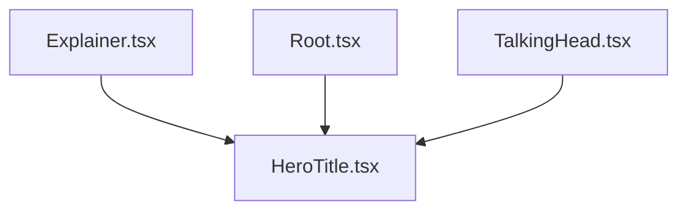
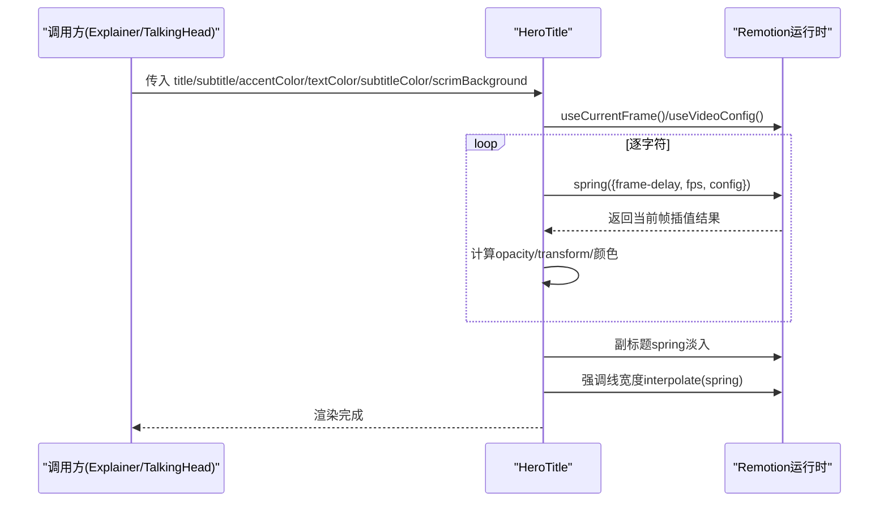
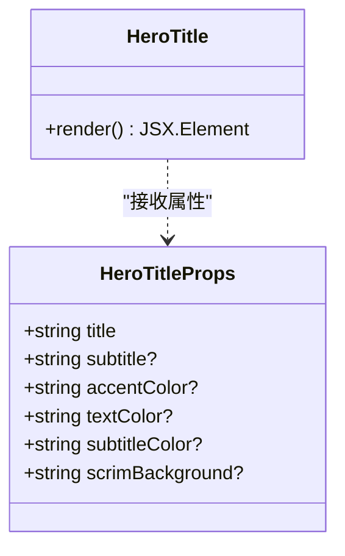
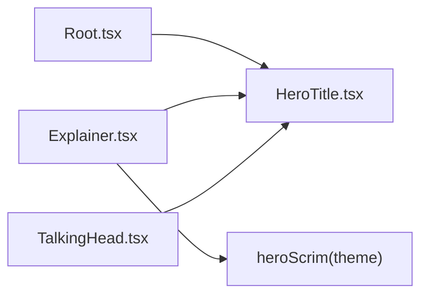

# 英雄标题组件

<cite>
**本文引用的文件**
- [HeroTitle.tsx](file://remotion-composer/src/components/HeroTitle.tsx)
- [Explainer.tsx](file://remotion-composer/src/Explainer.tsx)
- [Root.tsx](file://remotion-composer/src/Root.tsx)
- [TalkingHead.tsx](file://remotion-composer/src/TalkingHead.tsx)
</cite>

## 目录
1. [简介](#简介)
2. [项目结构](#项目结构)
3. [核心组件](#核心组件)
4. [架构总览](#架构总览)
5. [详细组件分析](#详细组件分析)
6. [依赖关系分析](#依赖关系分析)
7. [性能考虑](#性能考虑)
8. [故障排查指南](#故障排查指南)
9. [结论](#结论)
10. [附录：使用示例与最佳实践](#附录使用示例与最佳实践)

## 简介
本文件为 HeroTitle 英雄标题组件的使用文档。该组件用于在视频画面中呈现具有逐字符弹簧动画的标题、副标题以及底部强调线，并支持背景遮罩（scrim）以增强可读性。文档涵盖 API 属性说明、动画原理、自定义参数、主题适配、响应式布局、性能优化与常见问题解决方案。

## 项目结构
HeroTitle 位于 Remotion 组合项目中，作为独立可复用组件被多处场景引用。其关键位置如下：
- 组件实现：remotion-composer/src/components/HeroTitle.tsx
- 场景集成：remotion-composer/src/Explainer.tsx（主渲染器）
- 注册与默认配置：remotion-composer/src/Root.tsx（Composition 注册）
- 对话头场景集成：remotion-composer/src/TalkingHead.tsx

图表来源
- [HeroTitle.tsx:29-135](file://remotion-composer/src/components/HeroTitle.tsx#L29-L135)
- [Explainer.tsx:623-633](file://remotion-composer/src/Explainer.tsx#L623-L633)
- [Root.tsx:213-223](file://remotion-composer/src/Root.tsx#L213-L223)
- [TalkingHead.tsx:221-222](file://remotion-composer/src/TalkingHead.tsx#L221-L222)

章节来源
- [HeroTitle.tsx:1-135](file://remotion-composer/src/components/HeroTitle.tsx#L1-L135)
- [Explainer.tsx:620-633](file://remotion-composer/src/Explainer.tsx#L620-L633)
- [Root.tsx:210-223](file://remotion-composer/src/Root.tsx#L210-L223)
- [TalkingHead.tsx:221-222](file://remotion-composer/src/TalkingHead.tsx#L221-L222)

## 核心组件
HeroTitle 是一个基于 Remotion 的 React 组件，提供以下能力：
- 逐字符入场动画：每个字符按顺序延迟并以弹簧效果出现，同时伴随垂直位移与透明度变化
- 副标题淡入：在主标题动画完成后渐显
- 强调线与强调色：前若干字符与底部强调线使用强调色，其余字符使用文本色
- 背景遮罩：支持径向渐变遮罩，提升文字对比度与可读性

章节来源
- [HeroTitle.tsx:9-24](file://remotion-composer/src/components/HeroTitle.tsx#L9-L24)
- [HeroTitle.tsx:40-131](file://remotion-composer/src/components/HeroTitle.tsx#L40-L131)

## 架构总览
HeroTitle 通过 Remotion 的时间轴与插值函数驱动动画，结合 CSS 样式完成视觉呈现。调用方（如 Explainer、TalkingHead）将主题色与遮罩传入，确保在不同主题下保持一致的可读性与风格。

图表来源
- [HeroTitle.tsx:37-131](file://remotion-composer/src/components/HeroTitle.tsx#L37-L131)
- [Explainer.tsx:623-633](file://remotion-composer/src/Explainer.tsx#L623-L633)
- [TalkingHead.tsx:221-222](file://remotion-composer/src/TalkingHead.tsx#L221-L222)

## 详细组件分析

### API 接口与属性说明
- title: 必填，字符串。主标题内容。
- subtitle: 可选，字符串。副标题内容。
- accentColor: 可选，字符串。强调色，用于前若干字符与底部强调线。
- textColor: 可选，字符串。正文文本色，用于非强调字符。
- subtitleColor: 可选，字符串。副标题颜色。
- scrimBackground: 可选，字符串。背景遮罩，默认为深色径向渐变；浅色主题应传入浅色遮罩以避免对比度问题。

章节来源
- [HeroTitle.tsx:9-24](file://remotion-composer/src/components/HeroTitle.tsx#L9-L24)
- [HeroTitle.tsx:26-35](file://remotion-composer/src/components/HeroTitle.tsx#L26-L35)

### 逐字符弹簧动画原理与参数调整
- 字符拆分与延迟：将标题拆分为字符数组，每个字符设置固定时间步长的延迟，形成“依次出现”的节奏。
- 弹簧动画：对每个字符应用 spring，传入 frame - delay、fps 与阻尼/刚度配置，得到 0→1 的过渡值。
- 视觉映射：
  - 透明度：直接使用 spring 返回值控制不透明度
  - 位移：使用 interpolate 将 spring 的 0→1 映射到 Y 轴位移区间，产生从下方滑入的效果
  - 颜色：前若干字符使用 accentColor，其余使用 textColor
- 可调参数建议：
  - 延迟步长：增大可使节奏更舒缓，减小则更紧凑
  - damping（阻尼）：越大越“软”，越小越“硬弹”
  - stiffness（刚度）：越大回弹越快，越小越迟缓
  - 位移区间：根据字号与视觉密度调整起始偏移量
  - 强调字符数量：可根据语义或品牌规范调整前 N 个字符高亮

章节来源
- [HeroTitle.tsx:40-88](file://remotion-composer/src/components/HeroTitle.tsx#L40-L88)

### 副标题与强调线的动画
- 副标题：在主标题全部字符动画结束后延迟出现，采用 spring 淡入，配合字体大小、字重、字间距与大写变换，营造层次。
- 强调线：在标题之后稍晚开始，使用 spring 驱动宽度从 0 到目标值的过渡，颜色同 accentColor。

章节来源
- [HeroTitle.tsx:91-131](file://remotion-composer/src/components/HeroTitle.tsx#L91-L131)

### 背景遮罩（Scrim）与渐变定制
- 默认遮罩：组件内置深色径向渐变，适用于暗色背景或需要突出前景的场景。
- 主题适配：在浅色主题下，建议使用浅色遮罩，避免降低文字对比度。调用方可通过 heroScrim 函数根据主题背景色生成合适的径向渐变。
- 渐变定制：scrimBackground 接受任意 CSS 渐变表达式，可替换为线性渐变、多色渐变或带模糊的混合模式，以满足不同视觉风格。

章节来源
- [HeroTitle.tsx:18-27](file://remotion-composer/src/components/HeroTitle.tsx#L18-L27)
- [Explainer.tsx:62-73](file://remotion-composer/src/Explainer.tsx#L62-L73)
- [Explainer.tsx:623-633](file://remotion-composer/src/Explainer.tsx#L623-L633)
- [Explainer.tsx:807-816](file://remotion-composer/src/Explainer.tsx#L807-L816)

### 字体设置与排版
- 字体栈：优先使用 Space Grotesk，回退至 Inter、system-ui 等无衬线字体，保证跨平台一致性。
- 字号与行高：标题使用较大字号与较紧密的行高，副标题使用较小字号与宽松的字间距，形成层级。
- 换行与对齐：容器最大宽度限制，文本居中，flex 布局自动换行，空格保留空白宽度。

章节来源
- [HeroTitle.tsx:51-63](file://remotion-composer/src/components/HeroTitle.tsx#L51-L63)
- [HeroTitle.tsx:91-110](file://remotion-composer/src/components/HeroTitle.tsx#L91-L110)

### 响应式布局与尺寸适配
- 容器宽度：通过最大宽度百分比与 flex 布局适应不同分辨率。
- 字号与间距：建议在外部根据视口或画布尺寸进行缩放（例如在调用层根据 width/height 动态调整 fontSize），组件内部保持相对比例。
- 多行标题：利用 flexWrap 与 gap 控制字符间距，避免拥挤。

章节来源
- [HeroTitle.tsx:51-63](file://remotion-composer/src/components/HeroTitle.tsx#L51-L63)

### 使用场景与集成方式
- 主场景集成：Explainer 在检测到 hero_title 类型片段时，将主题色与遮罩传入 HeroTitle。
- 覆盖层集成：OverlayRenderer 同样支持 hero_title 类型的覆盖层，统一使用主题配色。
- 对话头场景：TalkingHead 在特定覆盖层条件下直接渲染 HeroTitle，简化流程。

章节来源
- [Explainer.tsx:623-633](file://remotion-composer/src/Explainer.tsx#L623-L633)
- [Explainer.tsx:807-816](file://remotion-composer/src/Explainer.tsx#L807-L816)
- [TalkingHead.tsx:221-222](file://remotion-composer/src/TalkingHead.tsx#L221-L222)

### 组件类图（代码级）

图表来源
- [HeroTitle.tsx:9-24](file://remotion-composer/src/components/HeroTitle.tsx#L9-L24)
- [HeroTitle.tsx:29-135](file://remotion-composer/src/components/HeroTitle.tsx#L29-L135)

## 依赖关系分析
- 运行时依赖：Remotion 提供的 AbsoluteFill、interpolate、spring、useCurrentFrame、useVideoConfig
- 调用方依赖：Explainer、Root、TalkingHead 通过 Composition 或条件渲染引入 HeroTitle
- 主题依赖：Explainer 提供 heroScrim 函数，根据主题背景色生成合适的遮罩

图表来源
- [Root.tsx:213-223](file://remotion-composer/src/Root.tsx#L213-L223)
- [Explainer.tsx:62-73](file://remotion-composer/src/Explainer.tsx#L62-L73)
- [Explainer.tsx:623-633](file://remotion-composer/src/Explainer.tsx#L623-L633)
- [TalkingHead.tsx:221-222](file://remotion-composer/src/TalkingHead.tsx#L221-L222)

章节来源
- [HeroTitle.tsx:1-7](file://remotion-composer/src/components/HeroTitle.tsx#L1-L7)
- [Explainer.tsx:62-73](file://remotion-composer/src/Explainer.tsx#L62-L73)
- [Root.tsx:213-223](file://remotion-composer/src/Root.tsx#L213-L223)
- [TalkingHead.tsx:221-222](file://remotion-composer/src/TalkingHead.tsx#L221-L222)

## 性能考虑
- 字符数量与动画开销：标题过长会显著增加每帧计算的字符节点数，建议控制标题长度或在调用层进行分片展示。
- 弹簧参数调优：过高的刚度或过低的阻尼会导致频繁重绘与抖动，建议根据设备性能微调 damping/stiffness。
- 动画时机：副标题与强调线延迟启动，避免首帧过载；必要时可增加初始延迟。
- 背景遮罩复杂度：复杂渐变可能影响合成性能，尽量使用简单径向/线性渐变，避免过多叠加。
- 字体加载：Space Grotesk 需在项目内正确加载，避免闪烁或回退导致的重排。

[本节为通用指导，不直接分析具体文件]

## 故障排查指南
- 文字对比度不足：检查 scrimBackground 是否与主题背景匹配；浅色主题需传入浅色遮罩。
- 动画卡顿：减少标题字符数或降低弹簧刚度；检查 FPS 与帧率是否稳定。
- 副标题未显示：确认 subtitle 已传入且不为空；检查延迟是否过大导致超出可见时长。
- 强调线未出现：确认强调线动画起始帧延迟合理；检查 accentColor 是否有效。
- 字体异常：确认 Space Grotesk 已正确加载；必要时添加备用字体。

章节来源
- [HeroTitle.tsx:18-27](file://remotion-composer/src/components/HeroTitle.tsx#L18-L27)
- [HeroTitle.tsx:91-131](file://remotion-composer/src/components/HeroTitle.tsx#L91-L131)
- [Explainer.tsx:62-73](file://remotion-composer/src/Explainer.tsx#L62-L73)

## 结论
HeroTitle 提供了开箱即用的英雄标题动画与主题化能力，通过简洁的 API 即可实现高质量的逐字符弹簧动画与背景遮罩。结合 Explainer 的主题系统，可在不同背景下保持良好可读性与视觉一致性。合理调整弹簧参数与遮罩样式，可获得既流畅又富有表现力的标题呈现。

[本节为总结，不直接分析具体文件]

## 附录：使用示例与最佳实践

### 基本用法
- 在场景中渲染 HeroTitle，传入标题与副标题，使用默认强调色与文本色。
- 在 Root 中注册 Composition，设置默认 props 以便预览与测试。

章节来源
- [Explainer.tsx:623-633](file://remotion-composer/src/Explainer.tsx#L623-L633)
- [Root.tsx:213-223](file://remotion-composer/src/Root.tsx#L213-L223)

### 主题适配与遮罩定制
- 使用 heroScrim 根据主题背景色生成遮罩，确保明暗对比符合无障碍标准。
- 在浅色主题下传入浅色遮罩，避免降低文本可读性。

章节来源
- [Explainer.tsx:62-73](file://remotion-composer/src/Explainer.tsx#L62-L73)
- [Explainer.tsx:623-633](file://remotion-composer/src/Explainer.tsx#L623-L633)
- [Explainer.tsx:807-816](file://remotion-composer/src/Explainer.tsx#L807-L816)

### 动画参数调优
- 调整字符延迟步长以获得更自然的节奏。
- 调节 damping/stiffness 平衡弹性与稳定性。
- 调整位移区间与强调字符数量，匹配品牌风格与信息重点。

章节来源
- [HeroTitle.tsx:40-88](file://remotion-composer/src/components/HeroTitle.tsx#L40-L88)
- [HeroTitle.tsx:91-131](file://remotion-composer/src/components/HeroTitle.tsx#L91-L131)

### 响应式与排版最佳实践
- 控制标题长度，避免单行过长导致拥挤。
- 使用最大宽度与居中对齐，确保在不同分辨率下的可读性。
- 选择合适的字体栈与字号层级，强化信息层次。

章节来源
- [HeroTitle.tsx:51-63](file://remotion-composer/src/components/HeroTitle.tsx#L51-L63)
- [HeroTitle.tsx:91-110](file://remotion-composer/src/components/HeroTitle.tsx#L91-L110)