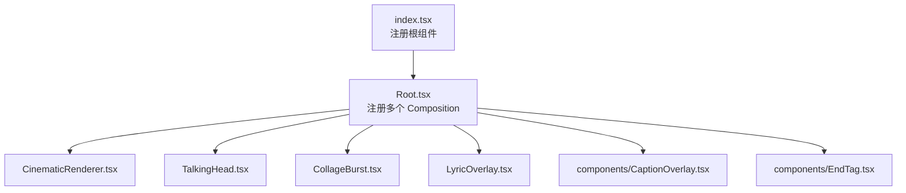
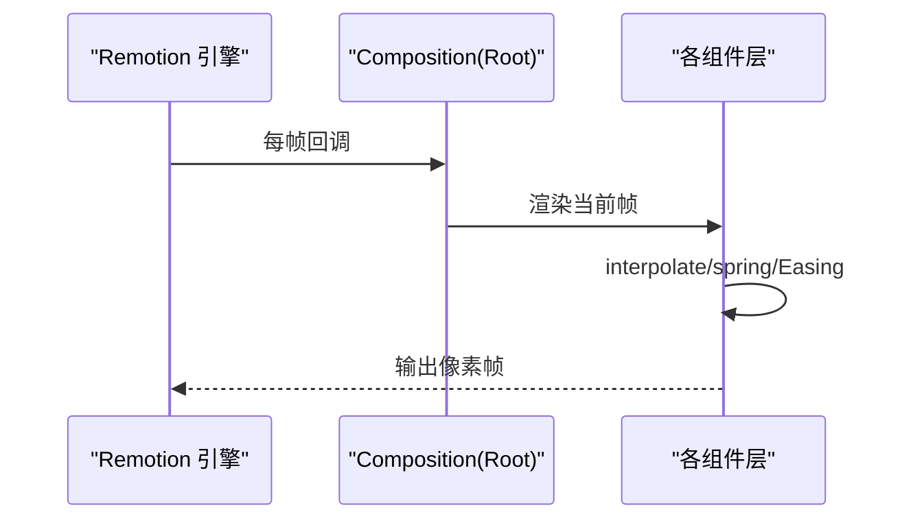
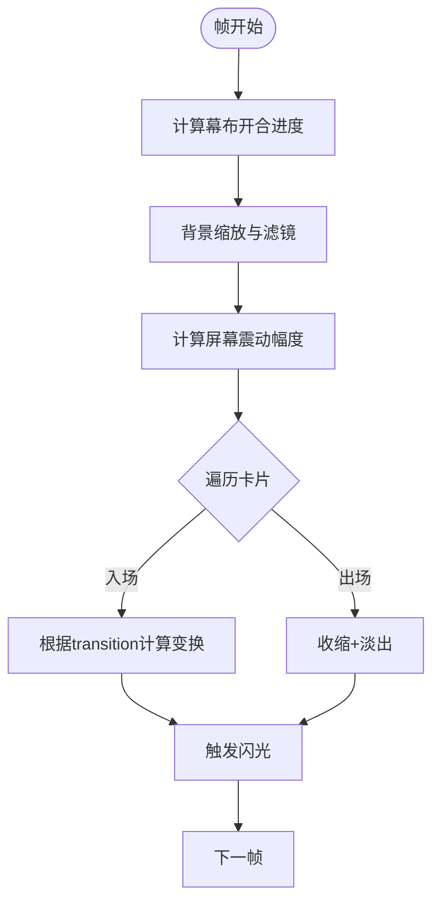
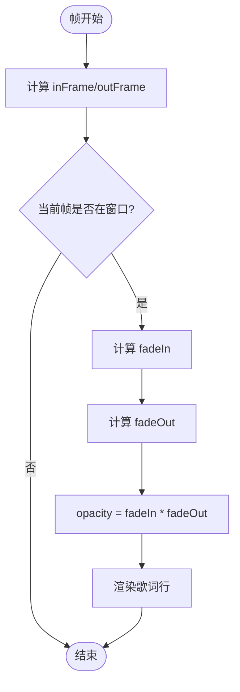
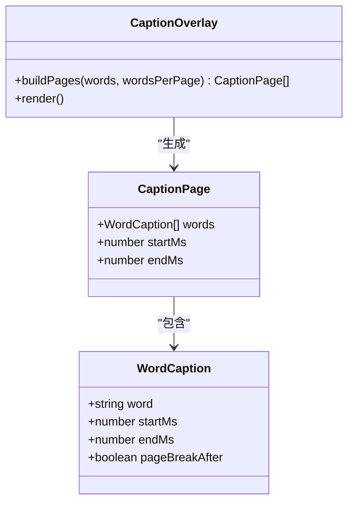
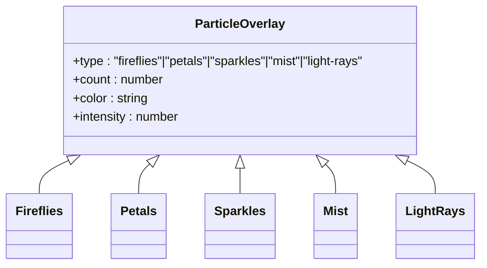
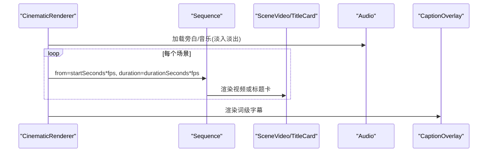
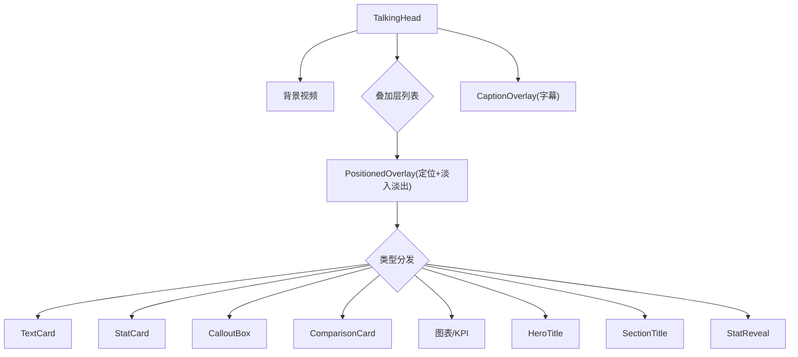
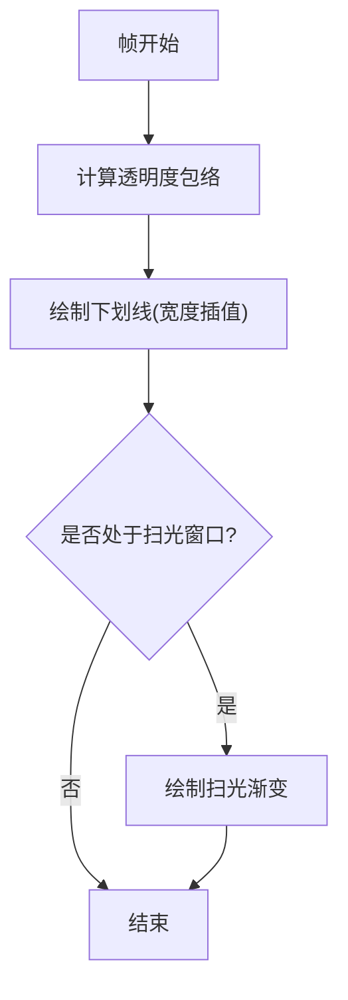
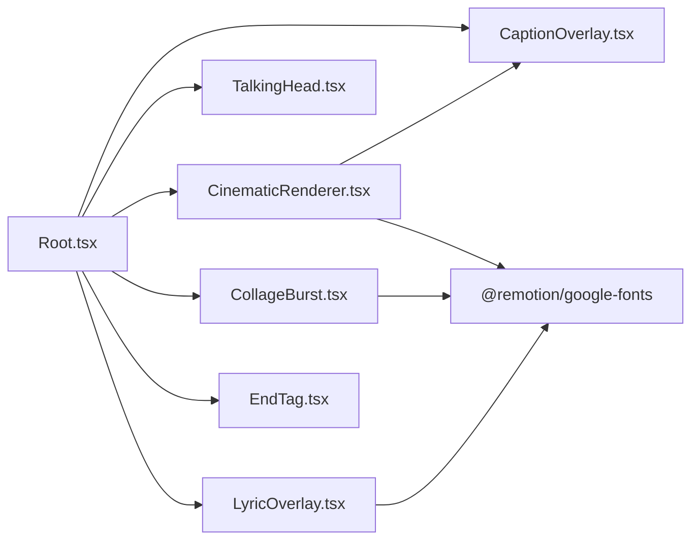

# 动画系统

<cite>
**本文引用的文件**
- [index.tsx](file://remotion-composer/src/index.tsx)
- [Root.tsx](file://remotion-composer/src/Root.tsx)
- [package.json](file://remotion-composer/package.json)
- [CollageBurst.tsx](file://remotion-composer/src/CollageBurst.tsx)
- [LyricOverlay.tsx](file://remotion-composer/src/LyricOverlay.tsx)
- [ParticleOverlay.tsx](file://remotion-composer/src/components/ParticleOverlay.tsx)
- [CaptionOverlay.tsx](file://remotion-composer/src/components/CaptionOverlay.tsx)
- [EndTag.tsx](file://remotion-composer/src/components/EndTag.tsx)
- [CinematicRenderer.tsx](file://remotion-composer/src/CinematicRenderer.tsx)
- [TalkingHead.tsx](file://remotion-composer/src/TalkingHead.tsx)
</cite>

## 目录
1. [简介](#简介)
2. [项目结构](#项目结构)
3. [核心组件](#核心组件)
4. [架构总览](#架构总览)
5. [详细组件分析](#详细组件分析)
6. [依赖关系分析](#依赖关系分析)
7. [性能考量](#性能考量)
8. [故障排查指南](#故障排查指南)
9. [结论](#结论)
10. [附录](#附录)

## 简介
本技术文档围绕 Remotion 视频合成器中的动画系统展开，重点覆盖以下方面：
- Remotion 动画框架的核心概念：时间线、插值、缓动与弹簧动画。
- 粒子系统实现：ParticleOverlay 的多种粒子类型（萤火虫、花瓣、闪光、薄雾、光柱）及其运动轨迹与可见性控制。
- 拼贴爆炸效果：CollageBurst 的幕布开合、卡片入场过渡、屏幕震动、闪光叠加等。
- 歌词叠加层同步：LyricOverlay 的时间戳映射与文本淡入淡出。
- 字幕高亮：CaptionOverlay 的词级高亮与分页显示。
- 自定义动画开发指南：组件设计模式、性能优化技巧与调试方法。

## 项目结构
Remotion 工程以“组合（Composition）”为基本单元，通过 Root 注册多个 Composition，每个 Composition 对应一个可独立渲染的视频片段或模板。关键入口与组织方式如下：
- 入口注册：index.tsx 仅负责将 Root 注册为根组件。
- 组合注册：Root.tsx 集中声明所有 Composition（如 Explainer、CinematicRenderer、TalkingHead、TitledVideo、HeroTitle、ProductReveal、CaptionOverlayOnly、CollageBurst、LyricOverlay、EndTag 等），并设置分辨率、帧率、默认参数与元数据计算函数。
- 业务组件：各 Composition 对应的具体渲染逻辑位于同目录或 components 子目录中。
- 包配置：package.json 提供脚本与依赖，便于本地开发与构建。

图表来源
- [index.tsx:1-5](file://remotion-composer/src/index.tsx#L1-L5)
- [Root.tsx:135-333](file://remotion-composer/src/Root.tsx#L135-L333)

章节来源
- [index.tsx:1-5](file://remotion-composer/src/index.tsx#L1-L5)
- [Root.tsx:135-333](file://remotion-composer/src/Root.tsx#L135-L333)
- [package.json:1-36](file://remotion-composer/package.json#L1-L36)

## 核心组件
- CinematicRenderer：场景化叙事渲染器，支持多段视频/标题卡、旁白与背景音乐、字幕高亮。
- TalkingHead：竖屏口播模板，叠加多种信息卡片与图表，底部字幕高亮。
- CollageBurst：拼贴爆炸式蒙太奇，幕布开合 + 卡片入场过渡 + 屏幕震动 + 闪光。
- LyricOverlay：歌词叠加层，基于时间戳逐行淡入淡出。
- CaptionOverlay：词级字幕高亮，支持分页与语言分隔符定制。
- EndTag：片尾标语卡，支持透明背景叠加模式。
- ParticleOverlay：通用粒子叠加层，提供多种粒子类型与强度控制。

章节来源
- [CinematicRenderer.tsx:458-529](file://remotion-composer/src/CinematicRenderer.tsx#L458-L529)
- [TalkingHead.tsx:313-365](file://remotion-composer/src/TalkingHead.tsx#L313-L365)
- [CollageBurst.tsx:424-599](file://remotion-composer/src/CollageBurst.tsx#L424-L599)
- [LyricOverlay.tsx:150-164](file://remotion-composer/src/LyricOverlay.tsx#L150-L164)
- [CaptionOverlay.tsx:138-177](file://remotion-composer/src/components/CaptionOverlay.tsx#L138-L177)
- [EndTag.tsx:52-203](file://remotion-composer/src/components/EndTag.tsx#L52-L203)
- [ParticleOverlay.tsx:329-349](file://remotion-composer/src/components/ParticleOverlay.tsx#L329-L349)

## 架构总览
Remotion 动画系统的运行时由“时间驱动 + 插值 + 组件树”构成：
- 时间驱动：useCurrentFrame 获取当前帧，配合 fps 换算秒/毫秒。
- 插值与缓动：interpolate 在指定区间映射数值；spring 提供物理弹簧动画；Easing 提供缓动曲线。
- 组件树：AbsoluteFill/Sequence/OffthreadVideo/Audio 等基础组件按层级叠加，形成最终画面。

图表来源
- [Root.tsx:135-333](file://remotion-composer/src/Root.tsx#L135-L333)
- [CinematicRenderer.tsx:40-115](file://remotion-composer/src/CinematicRenderer.tsx#L40-L115)
- [CollageBurst.tsx:219-422](file://remotion-composer/src/CollageBurst.tsx#L219-L422)
- [LyricOverlay.tsx:30-148](file://remotion-composer/src/LyricOverlay.tsx#L30-L148)

## 详细组件分析

### 拼贴爆炸效果（CollageBurst）
- 幕布开合：左右两块遮罩根据时间插值平移，中间接缝发光随时间变化。
- 背景处理：背景视频慢速缩放 + 去色/模糊/暗角叠加，营造电影感氛围。
- 卡片入场：每张卡片根据 transition 类型（pop/slide-zoom/spin/shutter/glitch/swoop）计算 scale/rotate/offX/offY/opacity/clipPath，并使用 spring 做弹性进入与退出。
- 屏幕震动：遍历 clips，在卡片入场附近几帧内叠加随机抖动。
- 闪光叠加：每张卡片入场时触发短暂白色闪光（mixBlendMode: screen）。
- 呼吸感：卡片稳定期加入微小正弦扰动，提升自然感。

图表来源
- [CollageBurst.tsx:424-599](file://remotion-composer/src/CollageBurst.tsx#L424-L599)
- [CollageBurst.tsx:219-422](file://remotion-composer/src/CollageBurst.tsx#L219-L422)

章节来源
- [CollageBurst.tsx:219-422](file://remotion-composer/src/CollageBurst.tsx#L219-L422)
- [CollageBurst.tsx:424-599](file://remotion-composer/src/CollageBurst.tsx#L424-L599)

### 歌词叠加层（LyricOverlay）
- 时间戳映射：每条歌词包含 inSeconds/outSeconds，转换为帧后判断当前帧是否处于显示窗口。
- 淡入淡出：使用 interpolate 在入场/出场区间分别计算 fadeIn/fadeOut，相乘得到最终透明度。
- 视觉样式：底部渐变遮罩保证可读性；文字带阴影与金色下划线装饰。
- 位置控制：bottomY 控制字幕带垂直位置。

图表来源
- [LyricOverlay.tsx:30-148](file://remotion-composer/src/LyricOverlay.tsx#L30-L148)
- [LyricOverlay.tsx:150-164](file://remotion-composer/src/LyricOverlay.tsx#L150-L164)

章节来源
- [LyricOverlay.tsx:30-148](file://remotion-composer/src/LyricOverlay.tsx#L30-L148)
- [LyricOverlay.tsx:150-164](file://remotion-composer/src/LyricOverlay.tsx#L150-L164)

### 字幕高亮（CaptionOverlay）
- 词级高亮：根据 startMs/endMs 判断当前词是否激活，应用 highlightColor 与发光阴影。
- 分页显示：buildPages 将词列表按 wordsPerPage 或 pageBreakAfter 切分为页，使用 Sequence 控制每页出现时长。
- 语言适配：wordSeparator 支持空格分隔语言与无空格的 CJK 语言。
- 入场动画：spring 实现弹跳式淡入与上移。

图表来源
- [CaptionOverlay.tsx:10-58](file://remotion-composer/src/components/CaptionOverlay.tsx#L10-L58)
- [CaptionOverlay.tsx:60-177](file://remotion-composer/src/components/CaptionOverlay.tsx#L60-L177)

章节来源
- [CaptionOverlay.tsx:10-58](file://remotion-composer/src/components/CaptionOverlay.tsx#L10-L58)
- [CaptionOverlay.tsx:60-177](file://remotion-composer/src/components/CaptionOverlay.tsx#L60-L177)

### 粒子系统（ParticleOverlay）
- 确定性随机：seededRandom 基于索引生成稳定随机数，确保跨帧一致。
- 粒子类型：
  - Fireflies：正弦路径移动 + 脉冲透明度 + 发光阴影。
  - Petals：椭圆形状对角飘落 + 旋转 + 延迟入场。
  - Sparkles：十字形闪烁，周期长度与偏移随机化。
  - Mist：半透明径向渐变层水平漂移。
  - LightRays：倾斜渐变光束，轻微脉动。
- 统一接口：type/count/color/intensity 控制整体表现。

图表来源
- [ParticleOverlay.tsx:1-349](file://remotion-composer/src/components/ParticleOverlay.tsx#L1-L349)

章节来源
- [ParticleOverlay.tsx:1-349](file://remotion-composer/src/components/ParticleOverlay.tsx#L1-L349)

### 电影化渲染器（CinematicRenderer）
- 场景编排：Sequence 按 startSeconds/durationSeconds 顺序播放视频或标题卡。
- 标题卡：Split lines -> 单词交错淡入（stagger）、模糊到清晰、位移；顶部/底部强调线生长；信号纹理与光晕。
- 音频：Soundtrack 支持旁白与音乐轨道，音量淡入淡出，支持 trimBefore/trimAfter。
- 字幕：复用 CaptionOverlay 进行词级高亮。
- 元数据：calculateCinematicMetadata 根据场景计算总时长。

图表来源
- [CinematicRenderer.tsx:40-115](file://remotion-composer/src/CinematicRenderer.tsx#L40-L115)
- [CinematicRenderer.tsx:162-386](file://remotion-composer/src/CinematicRenderer.tsx#L162-L386)
- [CinematicRenderer.tsx:388-439](file://remotion-composer/src/CinematicRenderer.tsx#L388-L439)
- [CinematicRenderer.tsx:441-529](file://remotion-composer/src/CinematicRenderer.tsx#L441-L529)

章节来源
- [CinematicRenderer.tsx:40-115](file://remotion-composer/src/CinematicRenderer.tsx#L40-L115)
- [CinematicRenderer.tsx:162-386](file://remotion-composer/src/CinematicRenderer.tsx#L162-L386)
- [CinematicRenderer.tsx:388-439](file://remotion-composer/src/CinematicRenderer.tsx#L388-L439)
- [CinematicRenderer.tsx:441-529](file://remotion-composer/src/CinematicRenderer.tsx#L441-L529)

### 口播模板（TalkingHead）
- 背景视频：全屏铺满。
- 叠加层：PositionedOverlay 根据 position 预设定位，内部 OverlayContent 分发至 TextCard/StatCard/CalloutBox/ComparisonCard/图表/KPIGrid/HeroTitle/SectionTitle/StatReveal。
- 字幕：底部 CaptionOverlay 始终置顶显示。
- 时间控制：每个 overlay 通过 Sequence 控制 from/duration。

图表来源
- [TalkingHead.tsx:71-107](file://remotion-composer/src/TalkingHead.tsx#L71-L107)
- [TalkingHead.tsx:113-245](file://remotion-composer/src/TalkingHead.tsx#L113-L245)
- [TalkingHead.tsx:251-292](file://remotion-composer/src/TalkingHead.tsx#L251-L292)
- [TalkingHead.tsx:313-365](file://remotion-composer/src/TalkingHead.tsx#L313-L365)

章节来源
- [TalkingHead.tsx:71-107](file://remotion-composer/src/TalkingHead.tsx#L71-L107)
- [TalkingHead.tsx:113-245](file://remotion-composer/src/TalkingHead.tsx#L113-L245)
- [TalkingHead.tsx:251-292](file://remotion-composer/src/TalkingHead.tsx#L251-L292)
- [TalkingHead.tsx:313-365](file://remotion-composer/src/TalkingHead.tsx#L313-L365)

### 片尾标语（EndTag）
- 时间轴：fadeIn -> hold -> fadeOut 三段式透明度包络。
- 下划线绘制：延迟于文字完全显示后开始绘制，随后一次从左到右的 shimmer 扫光。
- 叠加模式：overlay=true 时背景透明，便于后期合成。

图表来源
- [EndTag.tsx:52-203](file://remotion-composer/src/components/EndTag.tsx#L52-L203)

章节来源
- [EndTag.tsx:52-203](file://remotion-composer/src/components/EndTag.tsx#L52-L203)

## 依赖关系分析
- 组件耦合：
  - Root.tsx 作为 Composition 注册中心，低耦合地聚合各组件。
  - CinematicRenderer 依赖 CaptionOverlay 与字体资源。
  - CollageBurst 依赖基础 Remotion 组件与字体资源。
  - ParticleOverlay 为纯展示型组件，无外部状态依赖。
- 外部依赖：
  - remotion 提供时间驱动、插值、音频、视频与布局能力。
  - @remotion/google-fonts 提供字体加载。
  - d3-geo/topojson/world-atlas 用于地理可视化（在其他组件中使用）。

图表来源
- [Root.tsx:135-333](file://remotion-composer/src/Root.tsx#L135-L333)
- [CinematicRenderer.tsx:1-18](file://remotion-composer/src/CinematicRenderer.tsx#L1-L18)
- [CollageBurst.tsx:1-19](file://remotion-composer/src/CollageBurst.tsx#L1-L19)
- [LyricOverlay.tsx:1-16](file://remotion-composer/src/LyricOverlay.tsx#L1-L16)

章节来源
- [Root.tsx:135-333](file://remotion-composer/src/Root.tsx#L135-L333)
- [package.json:10-24](file://remotion-composer/package.json#L10-L24)

## 性能考量
- 避免不必要的重绘：
  - 使用 willChange: transform 提示浏览器优化（见 CollageBurst 卡片容器）。
  - 合理使用 Sequence 控制组件生命周期，减少不可见节点的计算。
- 插值与缓动：
  - 优先使用 interpolate/spring，避免在 render 中进行复杂循环。
  - 对高频抖动（glitch）限制持续时间，降低 CPU/GPU 压力。
- 媒体处理：
  - OffthreadVideo 使用 muted 与合适的 playbackRate/trimBefore/trimAfter，减少解码开销。
  - 背景图/视频添加适度 blur/saturate/brightness，避免过度滤镜链。
- 粒子系统：
  - count 控制粒子数量，建议根据目标设备调整。
  - 使用 seededRandom 保证确定性，避免每帧重新计算导致的抖动。
- 字幕与文本：
  - 合理设置 wordsPerPage，避免单页过多 DOM 节点。
  - 对于 CJK 语言，使用空分隔符减少布局抖动。

[本节为通用指导，不直接分析具体文件]

## 故障排查指南
- 时间不同步：
  - 检查 inSeconds/outSeconds 与 fps 转换是否正确（秒→帧）。
  - 确认 Sequence 的 from/durationInFrames 与预期一致。
- 动画卡顿：
  - 减少每帧复杂计算（如大量 random 调用），改用 seededRandom。
  - 降低粒子 count 或关闭不必要的滤镜（blur/box-shadow）。
- 字幕错位：
  - 核对 startMs/endMs 是否与音频对齐。
  - 检查 wordSeparator 是否为空字符串（CJK 场景）。
- 音频问题：
  - 确认 Audio 的 trimBefore/trimAfter 与淡入淡出时间设置合理。
  - 检查音量函数返回值范围（0~1）。
- 渲染异常：
  - 检查 Root 中 Composition 的 width/height/fps 是否与素材匹配。
  - 确认 resolveAsset 路径正确且资源已加载。

章节来源
- [LyricOverlay.tsx:30-148](file://remotion-composer/src/LyricOverlay.tsx#L30-L148)
- [CaptionOverlay.tsx:40-58](file://remotion-composer/src/components/CaptionOverlay.tsx#L40-L58)
- [CinematicRenderer.tsx:388-439](file://remotion-composer/src/CinematicRenderer.tsx#L388-L439)
- [Root.tsx:135-333](file://remotion-composer/src/Root.tsx#L135-L333)

## 结论
本动画系统以 Remotion 为核心，通过 Composition 组织、时间驱动与插值/弹簧动画，实现了丰富的视觉效果：
- 拼贴爆炸效果通过幕布、卡片过渡、震动与闪光营造电影感。
- 歌词叠加层基于精确时间戳映射，确保文本与节奏同步。
- 字幕高亮支持词级控制与分页，适配多语言场景。
- 粒子系统提供多样化氛围增强，易于扩展。
- 电影化渲染器与口播模板展示了模块化组合与可配置性。

在实际项目中，建议遵循上述性能与调试最佳实践，持续优化渲染效率与视觉一致性。

[本节为总结性内容，不直接分析具体文件]

## 附录
- 常用 API 参考：
  - useCurrentFrame/useVideoConfig：获取当前帧与视频配置。
  - interpolate：在时间区间内进行线性/非线性映射。
  - spring：基于物理参数的弹性动画。
  - Easing：缓动函数集合。
  - Sequence/AbsoluteFill/OffthreadVideo/Audio：布局与媒体组件。
- 开发建议：
  - 将可复用动画封装为独立组件，通过 props 暴露可控参数。
  - 使用主题与调色板统一管理视觉风格。
  - 在 Root 中集中管理 Composition，便于维护与扩展。

[本节为补充说明，不直接分析具体文件]