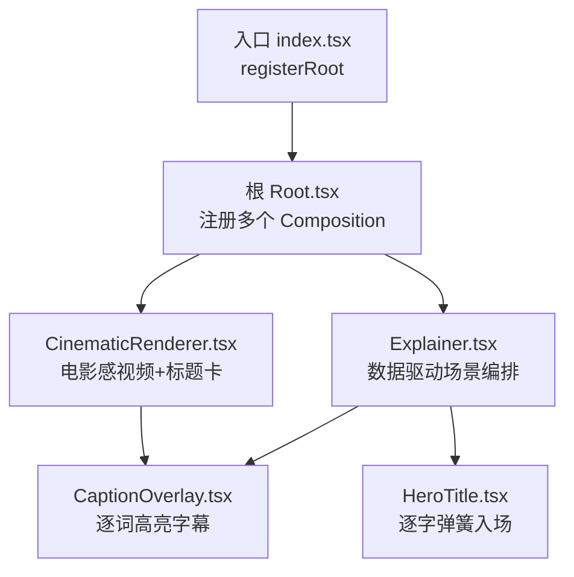
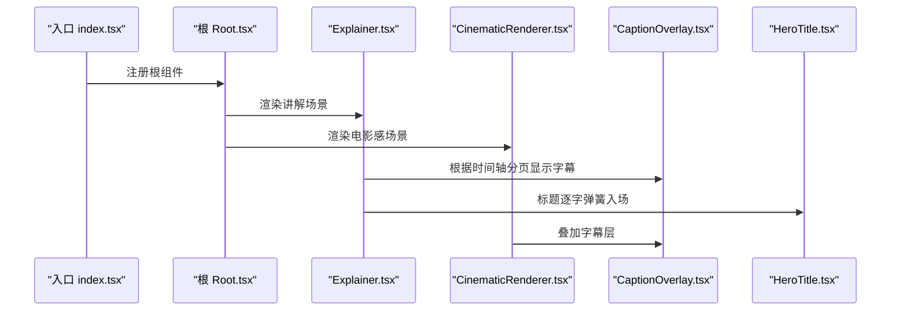
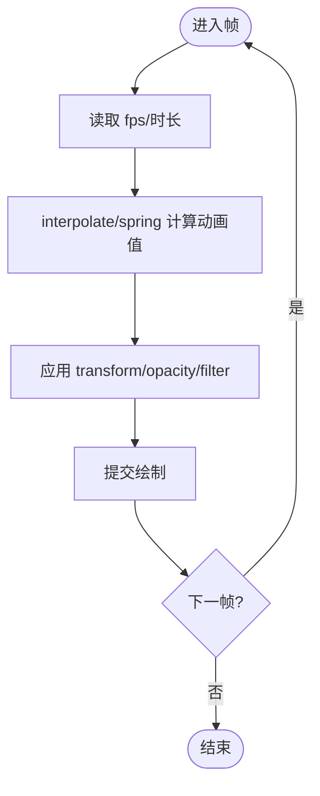
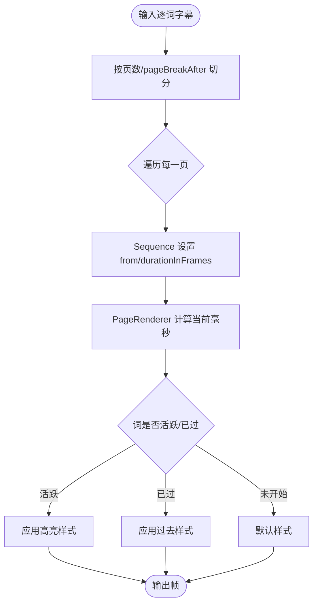
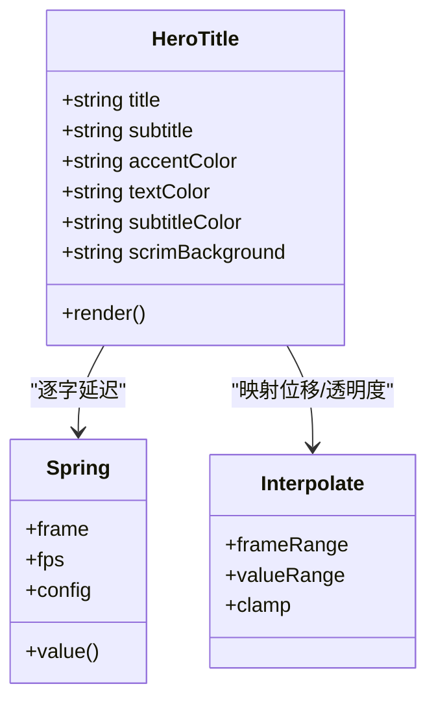
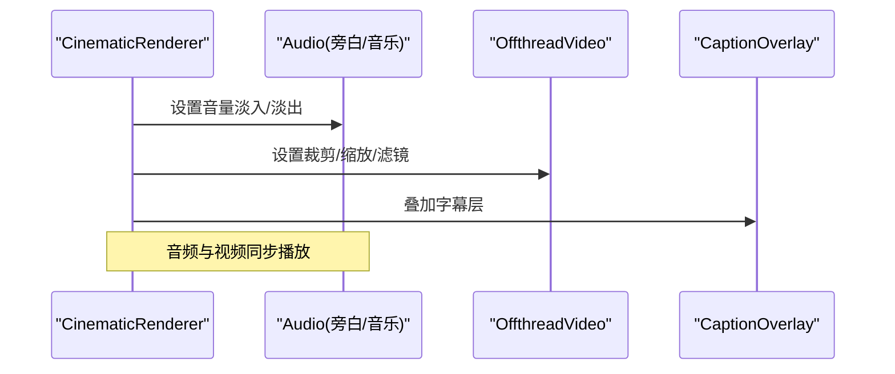
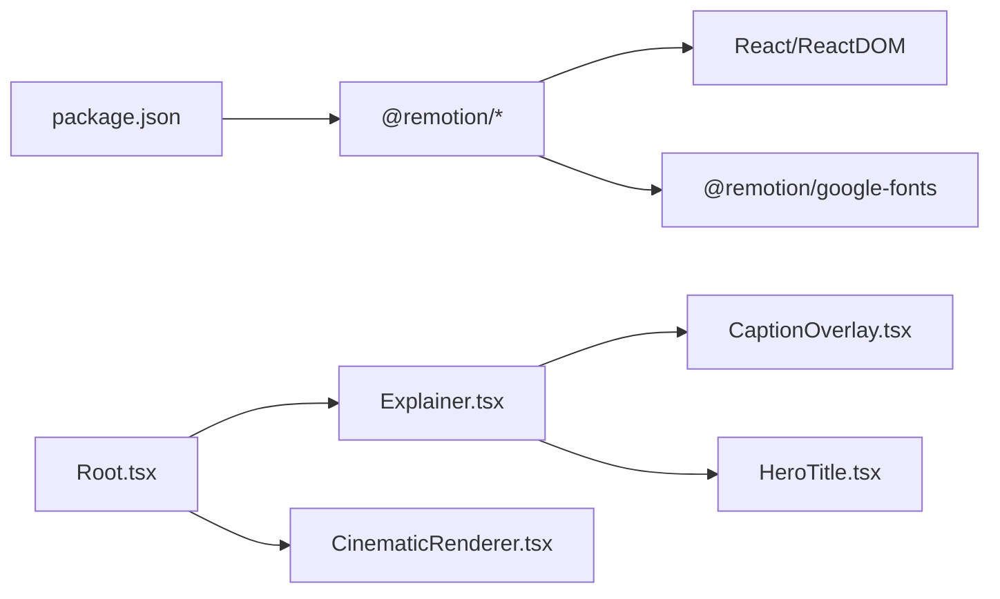

# 性能优化

<cite>
**本文引用的文件**
- [package.json](file://remotion-composer/package.json)
- [index.tsx](file://remotion-composer/src/index.tsx)
- [Root.tsx](file://remotion-composer/src/Root.tsx)
- [Explainer.tsx](file://remotion-composer/src/Explainer.tsx)
- [CinematicRenderer.tsx](file://remotion-composer/src/CinematicRenderer.tsx)
- [CaptionOverlay.tsx](file://remotion-composer/src/components/CaptionOverlay.tsx)
- [HeroTitle.tsx](file://remotion-composer/src/components/HeroTitle.tsx)
</cite>

## 目录
1. [简介](#简介)
2. [项目结构](#项目结构)
3. [核心组件](#核心组件)
4. [架构总览](#架构总览)
5. [详细组件分析](#详细组件分析)
6. [依赖关系分析](#依赖关系分析)
7. [性能考量](#性能考量)
8. [故障排查指南](#故障排查指南)
9. [结论](#结论)
10. [附录](#附录)

## 简介
本指南面向使用 Remotion 进行视频合成的工程团队，聚焦渲染性能优化、资源优化、动画调优、内存泄漏检测与修复、以及性能监控与分析。内容基于仓库中 Remotion 合成器实现（根入口、Composition 注册、场景与字幕组件等）提炼出可落地的策略与实践，帮助在长时渲染、复杂动效与大量媒体素材的场景下获得稳定且高效的渲染表现。

## 项目结构
Remotion 合成器位于 remotion-composer 子目录，采用“根注册 + 多 Composition”的组织方式：
- 入口通过 registerRoot 注册根组件，便于统一挂载与配置。
- 根组件集中声明多个 Composition，每个 Composition 对应一个可独立渲染的片段或模板，支持不同的分辨率、帧率与时长计算。
- 业务场景由 Explainer、CinematicRenderer 等组件承担，配合 CaptionOverlay、HeroTitle 等 UI 组件完成字幕与标题动画。

图表来源
- [index.tsx:1-5](file://remotion-composer/src/index.tsx#L1-L5)
- [Root.tsx:135-333](file://remotion-composer/src/Root.tsx#L135-L333)
- [Explainer.tsx:1-120](file://remotion-composer/src/Explainer.tsx#L1-L120)
- [CinematicRenderer.tsx:458-529](file://remotion-composer/src/CinematicRenderer.tsx#L458-L529)
- [CaptionOverlay.tsx:138-178](file://remotion-composer/src/components/CaptionOverlay.tsx#L138-L178)
- [HeroTitle.tsx:29-135](file://remotion-composer/src/components/HeroTitle.tsx#L29-L135)

章节来源
- [index.tsx:1-5](file://remotion-composer/src/index.tsx#L1-L5)
- [Root.tsx:135-333](file://remotion-composer/src/Root.tsx#L135-L333)

## 核心组件
- 根注册与 Composition 管理：通过 registerRoot 与多个 Composition 定义，将不同模板解耦为可独立渲染单元，便于按需构建与并行渲染。
- Explainer：数据驱动的讲解型视频，按 cuts 数组动态选择场景类型（文本卡片、图表、图片/视频、终端/截图场景等），并支持背景图/视频叠加与主题系统。
- CinematicRenderer：电影感视频渲染器，提供场景淡入淡出、缩放、滤镜、音频淡入淡出、字幕叠加等能力。
- CaptionOverlay：逐词高亮字幕，按时间轴分页显示，减少每帧重绘范围。
- HeroTitle：逐字弹簧动画标题，利用 spring 与 interpolate 实现流畅入场。

章节来源
- [Root.tsx:135-333](file://remotion-composer/src/Root.tsx#L135-L333)
- [Explainer.tsx:186-775](file://remotion-composer/src/Explainer.tsx#L186-L775)
- [CinematicRenderer.tsx:40-115](file://remotion-composer/src/CinematicRenderer.tsx#L40-L115)
- [CaptionOverlay.tsx:40-178](file://remotion-composer/src/components/CaptionOverlay.tsx#L40-L178)
- [HeroTitle.tsx:29-135](file://remotion-composer/src/components/HeroTitle.tsx#L29-L135)

## 架构总览
下图展示了从入口到具体渲染层的调用链与数据流，体现 Remotion 的 Composition 编排与组件复用模式。

图表来源
- [index.tsx:1-5](file://remotion-composer/src/index.tsx#L1-L5)
- [Root.tsx:135-333](file://remotion-composer/src/Root.tsx#L135-L333)
- [Explainer.tsx:558-775](file://remotion-composer/src/Explainer.tsx#L558-L775)
- [CinematicRenderer.tsx:458-529](file://remotion-composer/src/CinematicRenderer.tsx#L458-L529)
- [CaptionOverlay.tsx:138-178](file://remotion-composer/src/components/CaptionOverlay.tsx#L138-L178)
- [HeroTitle.tsx:29-135](file://remotion-composer/src/components/HeroTitle.tsx#L29-L135)

## 详细组件分析

### 渲染管线与帧级动画
- 帧驱动：大量组件通过 useCurrentFrame 与 useVideoConfig 获取当前帧与 fps，结合 interpolate/spring 计算透明度、位移、缩放等属性，确保动画与帧率同步。
- 序列控制：Sequence 用于按时间段激活特定子树，避免无关节点参与每帧计算，降低重绘开销。
- 过渡控制：淡入淡出通过 interpolate 在固定帧区间内线性变化，避免频繁状态切换导致的抖动。

图表来源
- [Explainer.tsx:88-183](file://remotion-composer/src/Explainer.tsx#L88-L183)
- [CinematicRenderer.tsx:40-115](file://remotion-composer/src/CinematicRenderer.tsx#L40-L115)
- [CaptionOverlay.tsx:60-136](file://remotion-composer/src/components/CaptionOverlay.tsx#L60-L136)
- [HeroTitle.tsx:29-135](file://remotion-composer/src/components/HeroTitle.tsx#L29-L135)

章节来源
- [Explainer.tsx:88-183](file://remotion-composer/src/Explainer.tsx#L88-L183)
- [CinematicRenderer.tsx:40-115](file://remotion-composer/src/CinematicRenderer.tsx#L40-L115)
- [CaptionOverlay.tsx:60-136](file://remotion-composer/src/components/CaptionOverlay.tsx#L60-L136)
- [HeroTitle.tsx:29-135](file://remotion-composer/src/components/HeroTitle.tsx#L29-L135)

### 字幕分页与高亮
- 分页策略：buildPages 将逐词字幕按 wordsPerPage 或 pageBreakAfter 切分为页，减少单帧 DOM 数量。
- 高亮逻辑：依据当前毫秒时间与 startMs/endMs 判断活跃词，仅对活跃词应用高亮样式，避免全量重绘。
- 时序控制：Sequence 按页起止帧激活对应 PageRenderer，进一步缩小渲染范围。

图表来源
- [CaptionOverlay.tsx:40-178](file://remotion-composer/src/components/CaptionOverlay.tsx#L40-L178)

章节来源
- [CaptionOverlay.tsx:40-178](file://remotion-composer/src/components/CaptionOverlay.tsx#L40-L178)

### 标题逐字弹簧动画
- 字符拆分：将标题拆分为字符数组，逐个应用 spring 延迟，形成逐字入场效果。
- 插值与变换：使用 interpolate 将弹簧值映射为 translateY，配合 opacity 实现平滑出现。
- 性能要点：避免在每帧创建新函数或对象；样式计算尽量简单，减少布局抖动。

图表来源
- [HeroTitle.tsx:29-135](file://remotion-composer/src/components/HeroTitle.tsx#L29-L135)

章节来源
- [HeroTitle.tsx:29-135](file://remotion-composer/src/components/HeroTitle.tsx#L29-L135)

### 电影感视频场景与音频淡入淡出
- 视频场景：OffthreadVideo 负责解码与播放，配合 trimBefore/trimAfter 精确裁剪，scale 与 filter 增强视觉层次。
- 淡入淡出：Audio 组件通过 volume 回调在首尾帧区间内调整音量，避免硬切带来的听觉突兀。
- 层级组织：Narration/Music/Scenes/Captions 分层组合，保证各层独立可控。

图表来源
- [CinematicRenderer.tsx:388-439](file://remotion-composer/src/CinematicRenderer.tsx#L388-L439)
- [CinematicRenderer.tsx:40-115](file://remotion-composer/src/CinematicRenderer.tsx#L40-L115)
- [CinematicRenderer.tsx:458-529](file://remotion-composer/src/CinematicRenderer.tsx#L458-L529)

章节来源
- [CinematicRenderer.tsx:388-439](file://remotion-composer/src/CinematicRenderer.tsx#L388-L439)
- [CinematicRenderer.tsx:40-115](file://remotion-composer/src/CinematicRenderer.tsx#L40-L115)
- [CinematicRenderer.tsx:458-529](file://remotion-composer/src/CinematicRenderer.tsx#L458-L529)

## 依赖关系分析
- 包依赖：Remotion 生态（cli、captions、media、player、transitions）、Google Fonts、React 等。
- 模块耦合：Root 聚合多个 Composition；Explainer 依赖多种场景组件；CinematicRenderer 依赖字幕与字体加载。
- 外部集成：字体通过 @remotion/google-fonts 加载，媒体通过 resolveAsset 解析路径。

图表来源
- [package.json:1-36](file://remotion-composer/package.json#L1-L36)
- [Root.tsx:135-333](file://remotion-composer/src/Root.tsx#L135-L333)
- [Explainer.tsx:1-120](file://remotion-composer/src/Explainer.tsx#L1-L120)
- [CinematicRenderer.tsx:1-25](file://remotion-composer/src/CinematicRenderer.tsx#L1-L25)
- [CaptionOverlay.tsx:1-33](file://remotion-composer/src/components/CaptionOverlay.tsx#L1-L33)
- [HeroTitle.tsx:1-28](file://remotion-composer/src/components/HeroTitle.tsx#L1-L28)

章节来源
- [package.json:1-36](file://remotion-composer/package.json#L1-L36)
- [Root.tsx:135-333](file://remotion-composer/src/Root.tsx#L135-L333)

## 性能考量
以下为针对该代码库的可落地优化建议，结合现有实现给出方向性指导：

- 组件懒加载与按需渲染
  - 使用 Sequence 仅在需要的时间段激活子树，避免无关节点参与每帧计算。
  - 将重型场景（如复杂图表、粒子效果）拆分为独立组件，并通过条件渲染或占位符延迟初始化。
  - 参考：Explainer 的场景路由与背景图层包裹模式，可按需启用背景视频/图片层。

- 内存管理与清理
  - 避免在高频更新的组件中创建大对象或闭包引用外部大对象，防止垃圾回收压力。
  - 对于定时器、事件监听、第三方实例，应在组件卸载或离开时间段时清理，防止残留引用导致内存泄漏。
  - 注意：Remotion 渲染环境以帧为单位推进，尽量减少每帧分配，优先复用计算结果。

- GPU 加速与样式优化
  - 优先使用 transform 与 opacity 进行动画，减少布局与绘制代价。
  - 谨慎使用 filter、blur、shadow 等高代价样式，必要时降低强度或仅在关键帧使用。
  - willChange 应谨慎添加，仅在确认能触发合成层提升时使用，避免过度提升导致内存占用上升。

- 资源优化
  - 图片：优先使用 WebP/AVIF，合理压缩尺寸与质量；大图按需加载与缓存。
  - 视频：使用 H.264/H.265 编码，控制码率与分辨率；利用 trimBefore/trimAfter 裁剪冗余片段。
  - 字体：按需加载子集与字重，减少首次加载体积；避免重复加载相同字体。

- 动画性能调优
  - 帧率优化：保持稳定的 fps，避免在动画中引入阻塞操作；长时渲染时考虑分段导出。
  - 重绘减少：合并样式更新，避免频繁改变 layout 属性；使用 interpolate/spring 替代手动 setState。
  - 计算卸载：将复杂计算前置或离线处理，渲染阶段仅消费结果；对大数据集进行采样或降采样。

- 常见性能问题定位
  - 卡顿：检查是否存在每帧的大对象分配、过多 DOM 节点、昂贵样式（filter/blur）。
  - 内存增长：检查是否有未清理的定时器/事件监听/第三方实例；避免循环引用。
  - 启动慢：检查字体与媒体加载路径，确保资源可缓存与预加载。

[本节为通用性能指导，不直接分析具体文件]

## 故障排查指南
- 渲染卡顿
  - 现象：预览或导出时帧率下降、掉帧明显。
  - 排查：检查是否使用了高代价样式（filter、blur、shadow）；确认是否每帧创建新对象；评估 Sequence 覆盖范围是否过大。
  - 改进：简化样式、减少 DOM 节点、按需激活子树。

- 内存泄漏
  - 现象：长时间渲染后内存持续增长，最终崩溃或变慢。
  - 排查：检查是否在组件中注册了全局事件或定时器但未清理；确认第三方库实例是否正确释放。
  - 改进：在合适生命周期清理资源；避免闭包捕获大对象。

- 字幕错位或闪烁
  - 现象：字幕高亮异常、翻页跳变。
  - 排查：检查 buildPages 的分页逻辑与 Sequence 的 from/durationInFrames 设置；确认时间单位换算（帧与毫秒）。
  - 改进：统一时间基准，校验页边界；减少不必要的重绘。

- 音频淡入淡出不自然
  - 现象：声音突变、开头结尾有爆音。
  - 排查：检查 fade 帧数是否过短；确认 volume 回调返回值范围。
  - 改进：适当增加淡入淡出时长；确保音量曲线平滑。

[本节为通用故障排查指导，不直接分析具体文件]

## 结论
通过对根注册与 Composition 的管理、场景与字幕组件的帧级动画设计、以及资源与样式的优化策略，可以在 Remotion 视频合成中获得更稳定的渲染性能与更低的内存占用。建议在生产环境中持续使用浏览器开发者工具与 Remotion 诊断能力进行度量与回归测试，确保性能基线不被破坏。

[本节为总结性内容，不直接分析具体文件]

## 附录
- 快速检查清单
  - 是否使用 Sequence 限制渲染范围？
  - 是否避免每帧创建大对象与闭包？
  - 是否优先使用 transform/opacity 动画？
  - 是否按需加载字体与媒体资源？
  - 是否对音频进行合理的淡入淡出？
  - 是否定期清理定时器与事件监听？

[本节为补充信息，不直接分析具体文件]