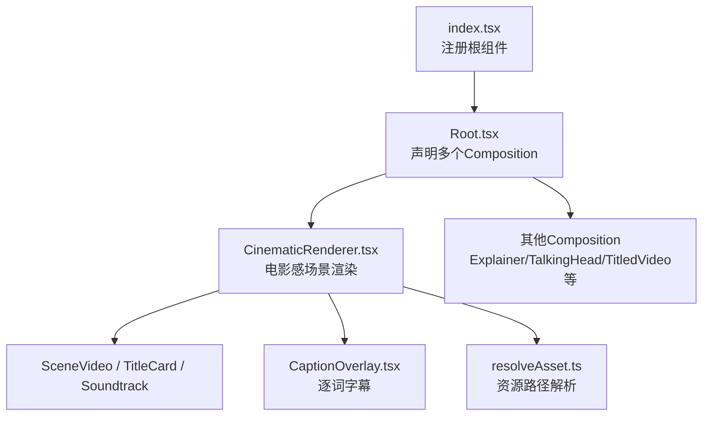
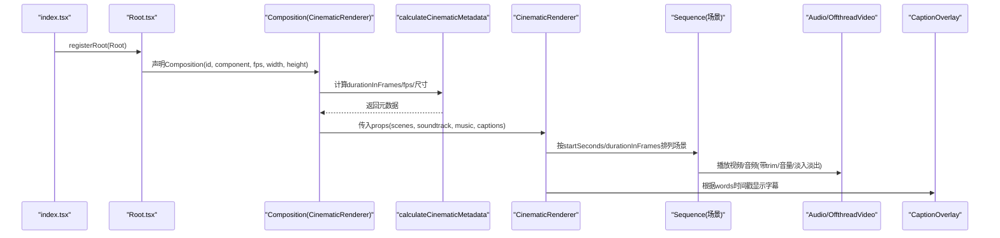
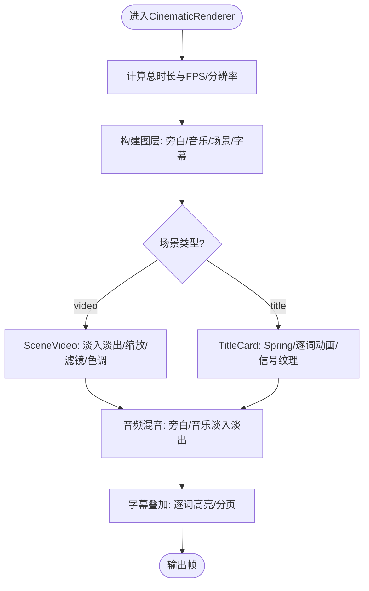
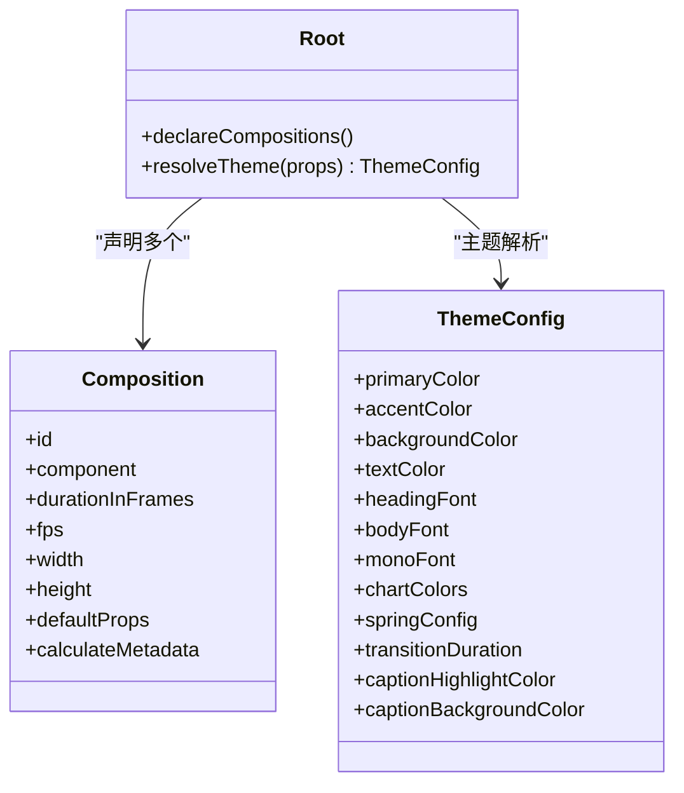
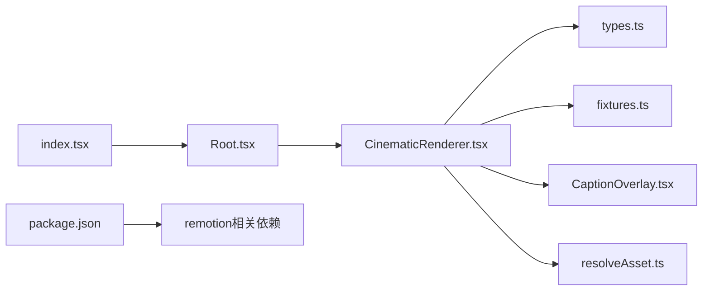

# 核心渲染引擎

<cite>
**本文引用的文件**
- [CinematicRenderer.tsx](file://remotion-composer/src/CinematicRenderer.tsx)
- [Root.tsx](file://remotion-composer/src/Root.tsx)
- [index.tsx](file://remotion-composer/src/index.tsx)
- [types.ts](file://remotion-composer/src/cinematic/types.ts)
- [fixtures.ts](file://remotion-composer/src/cinematic/fixtures.ts)
- [CaptionOverlay.tsx](file://remotion-composer/src/components/CaptionOverlay.tsx)
- [resolveAsset.ts](file://remotion-composer/src/lib/resolveAsset.ts)
- [package.json](file://remotion-composer/package.json)
</cite>

## 目录
1. [简介](#简介)
2. [项目结构](#项目结构)
3. [核心组件](#核心组件)
4. [架构总览](#架构总览)
5. [详细组件分析](#详细组件分析)
6. [依赖关系分析](#依赖关系分析)
7. [性能考量](#性能考量)
8. [故障排查指南](#故障排查指南)
9. [结论](#结论)
10. [附录](#附录)

## 简介
本技术文档聚焦于 OpenMontage 的 Remotion 视频合成器核心渲染引擎，重点解析 CinematicRenderer 的工作原理与 Root 组件初始化流程。内容涵盖场景管理、时间轴控制、渲染管线、Remotion 框架集成（注册根组件、配置渲染参数、生命周期）、以及渲染性能优化策略（内存管理、GPU 加速、缓存机制）和错误处理与调试技巧，帮助开发者快速定位问题并提升渲染质量与效率。

## 项目结构
OpenMontage 的 Remotion 渲染部分位于 remotion-composer 子工程，采用 React + Remotion 的组合式渲染模式：
- 入口注册：index.tsx 通过 registerRoot 挂载 Root 组件。
- 根容器：Root.tsx 声明多个 Composition，包括 CinematicRenderer、Explainer、TalkingHead、TitledVideo 等，并提供主题系统与默认属性。
- 渲染器：CinematicRenderer.tsx 实现电影感场景编排、标题卡、字幕叠加、音频轨道与淡入淡出。
- 类型与示例：cinematic/types.ts 定义场景与配置类型；cinematic/fixtures.ts 提供演示数据。
- 辅助能力：components/CaptionOverlay.tsx 实现逐词高亮字幕；lib/resolveAsset.ts 统一资源路径解析。

图表来源
- [index.tsx:1-5](file://remotion-composer/src/index.tsx#L1-L5)
- [Root.tsx:135-336](file://remotion-composer/src/Root.tsx#L135-L336)
- [CinematicRenderer.tsx:458-529](file://remotion-composer/src/CinematicRenderer.tsx#L458-L529)
- [CaptionOverlay.tsx:138-178](file://remotion-composer/src/components/CaptionOverlay.tsx#L138-L178)
- [resolveAsset.ts:1-29](file://remotion-composer/src/lib/resolveAsset.ts#L1-L29)

章节来源
- [index.tsx:1-5](file://remotion-composer/src/index.tsx#L1-L5)
- [Root.tsx:135-336](file://remotion-composer/src/Root.tsx#L135-L336)
- [CinematicRenderer.tsx:458-529](file://remotion-composer/src/CinematicRenderer.tsx#L458-L529)

## 核心组件
- CinematicRenderer：负责电影感场景的时间线编排，支持视频片段与标题卡两种场景类型，内置淡入淡出、缩放、滤镜、色调渐变、信号纹理、标题卡动画、字幕叠加与双轨音频（旁白+背景音乐）。
- Root：集中注册所有 Remotion Composition，为 CinematicRenderer 提供默认 props 与动态时长计算函数 calculateCinematicMetadata，同时维护主题系统以统一视觉风格。
- CaptionOverlay：基于帧时间与逐词时间戳，按页显示字幕并高亮当前词，支持多语言分隔符与自定义样式。
- resolveAsset：统一处理远程 URL、data URI、绝对路径与静态资源，确保在 Remotion 环境中正确加载媒体。

章节来源
- [CinematicRenderer.tsx:458-529](file://remotion-composer/src/CinematicRenderer.tsx#L458-L529)
- [Root.tsx:135-336](file://remotion-composer/src/Root.tsx#L135-L336)
- [CaptionOverlay.tsx:138-178](file://remotion-composer/src/components/CaptionOverlay.tsx#L138-L178)
- [resolveAsset.ts:1-29](file://remotion-composer/src/lib/resolveAsset.ts#L1-L29)

## 架构总览
Remotion 渲染管线由“注册根 → 声明 Composition → 计算元数据 → 按帧渲染”构成。CinematicRenderer 作为核心渲染器，通过 Sequence 将不同场景按 startSeconds 与 durationSeconds 串联，使用 useCurrentFrame/useVideoConfig 驱动动画与过渡，并通过 Audio/OffthreadVideo 进行音视频播放。Root 通过 defaultProps 与 calculateMetadata 注入默认值与动态时长，保证可配置性与可扩展性。

图表来源
- [index.tsx:1-5](file://remotion-composer/src/index.tsx#L1-L5)
- [Root.tsx:153-177](file://remotion-composer/src/Root.tsx#L153-L177)
- [CinematicRenderer.tsx:441-456](file://remotion-composer/src/CinematicRenderer.tsx#L441-L456)
- [CinematicRenderer.tsx:458-529](file://remotion-composer/src/CinematicRenderer.tsx#L458-L529)
- [CaptionOverlay.tsx:138-178](file://remotion-composer/src/components/CaptionOverlay.tsx#L138-L178)

## 详细组件分析

### CinematicRenderer 工作原理
- 场景管理：
  - 支持两类场景：video（视频片段）与 title（标题卡），通过 CinematicScene 联合类型区分。
  - 每个场景包含 id、startSeconds、durationSeconds，用于精确时间轴定位。
  - 视频场景支持 trimBeforeSeconds/trimAfterSeconds、playbackRate、filter、fadeInFrames/fadeOutFrames、tone（冷/钢/虚/中性）等。
  - 标题卡支持 text、accent、intensity、backgroundSrc、variant（plate/overlay）等。
- 时间轴控制：
  - 使用 Sequence 将场景按 from=round(startSeconds*fps)、durationInFrames=round(durationSeconds*fps) 拼接。
  - 全局 FPS=30，分辨率固定 1920x1080。
  - 动态时长计算：calculateCinematicMetadata 根据 scenes 的最大 endSeconds 计算总帧数。
- 渲染管线：
  - 图层顺序：旁白音频 → 背景音乐 → 视频/标题卡 → 字幕叠加。
  - 视频层：OffthreadVideo 配合 AbsoluteFill，应用 scale、滤镜、色调渐变、径向暗角、水平光晕等效果。
  - 标题卡层：Spring 动画、逐词渐显、模糊到清晰、位移、退出淡出、背景视频模糊与遮罩、信号纹理线条闪烁。
  - 音频层：Soundtrack 组件对旁白与音乐分别做 fade-in/out、音量曲线、trim 控制。
  - 字幕层：CaptionOverlay 按 wordsPerPage 分页，依据 startMs/endMs 高亮当前词。

图表来源
- [CinematicRenderer.tsx:441-456](file://remotion-composer/src/CinematicRenderer.tsx#L441-L456)
- [CinematicRenderer.tsx:40-115](file://remotion-composer/src/CinematicRenderer.tsx#L40-L115)
- [CinematicRenderer.tsx:117-386](file://remotion-composer/src/CinematicRenderer.tsx#L117-L386)
- [CinematicRenderer.tsx:388-439](file://remotion-composer/src/CinematicRenderer.tsx#L388-L439)
- [CaptionOverlay.tsx:40-58](file://remotion-composer/src/components/CaptionOverlay.tsx#L40-L58)

章节来源
- [CinematicRenderer.tsx:40-115](file://remotion-composer/src/CinematicRenderer.tsx#L40-L115)
- [CinematicRenderer.tsx:117-386](file://remotion-composer/src/CinematicRenderer.tsx#L117-L386)
- [CinematicRenderer.tsx:388-439](file://remotion-composer/src/CinematicRenderer.tsx#L388-L439)
- [CinematicRenderer.tsx:441-456](file://remotion-composer/src/CinematicRenderer.tsx#L441-L456)
- [CinematicRenderer.tsx:458-529](file://remotion-composer/src/CinematicRenderer.tsx#L458-L529)
- [types.ts:1-68](file://remotion-composer/src/cinematic/types.ts#L1-L68)

### Root 组件初始化过程
- 配置加载：
  - 主题系统 THEMES 与 DEFAULT_THEME 提供统一的色彩、字体、动效参数与字幕样式。
  - resolveTheme 根据 props.theme/playbook/themeConfig 选择或合并主题。
- 资源预加载：
  - 通过 staticFile 与 resolveAsset 统一处理静态资源与本地/远程路径，避免跨平台路径问题。
- 事件绑定与生命周期：
  - 使用 Remotion 的 Composition 声明各渲染目标，设置 fps、宽高、defaultProps。
  - 通过 calculateMetadata 动态计算时长，适配不同场景长度。
  - 注册多个 Composition 以便 Studio/CLI 渲染不同片段。

图表来源
- [Root.tsx:24-121](file://remotion-composer/src/Root.tsx#L24-L121)
- [Root.tsx:135-336](file://remotion-composer/src/Root.tsx#L135-L336)

章节来源
- [Root.tsx:24-121](file://remotion-composer/src/Root.tsx#L24-L121)
- [Root.tsx:135-336](file://remotion-composer/src/Root.tsx#L135-L336)

### Remotion 框架集成方式
- 注册根组件：index.tsx 调用 registerRoot(Root)，使 Remotion 识别并启动渲染。
- 配置渲染参数：Root.tsx 中每个 Composition 指定 fps、width、height、defaultProps，并通过 calculateMetadata 动态调整 durationInFrames。
- 处理生命周期：利用 useCurrentFrame/useVideoConfig/spring/interpolate 实现逐帧动画；Sequence 管理场景时序；Audio/OffthreadVideo 管理媒体播放；CaptionOverlay 基于时间戳驱动字幕。

章节来源
- [index.tsx:1-5](file://remotion-composer/src/index.tsx#L1-L5)
- [Root.tsx:135-336](file://remotion-composer/src/Root.tsx#L135-L336)
- [CinematicRenderer.tsx:441-456](file://remotion-composer/src/CinematicRenderer.tsx#L441-L456)

## 依赖关系分析
- 内部依赖：
  - CinematicRenderer 依赖 types.ts 的场景类型与 fixtures.ts 的示例数据。
  - CaptionOverlay 被 CinematicRenderer 复用，提供字幕能力。
  - resolveAsset 统一资源路径，供 OffthreadVideo/Audio 引用。
- 外部依赖：
  - Remotion 核心库（Composition、Sequence、Audio、OffthreadVideo、useCurrentFrame、useVideoConfig、interpolate、spring）。
  - Google Fonts（SpaceGrotesk）用于标题字体。
  - 包管理：package.json 声明 remotion、@remotion/cli、@remotion/player 等依赖。

图表来源
- [CinematicRenderer.tsx:1-18](file://remotion-composer/src/CinematicRenderer.tsx#L1-L18)
- [types.ts:1-68](file://remotion-composer/src/cinematic/types.ts#L1-L68)
- [fixtures.ts:1-84](file://remotion-composer/src/cinematic/fixtures.ts#L1-L84)
- [CaptionOverlay.tsx:1-178](file://remotion-composer/src/components/CaptionOverlay.tsx#L1-L178)
- [resolveAsset.ts:1-29](file://remotion-composer/src/lib/resolveAsset.ts#L1-L29)
- [Root.tsx:135-336](file://remotion-composer/src/Root.tsx#L135-L336)
- [index.tsx:1-5](file://remotion-composer/src/index.tsx#L1-L5)
- [package.json:1-36](file://remotion-composer/package.json#L1-L36)

章节来源
- [package.json:1-36](file://remotion-composer/package.json#L1-L36)

## 性能考量
- 内存管理：
  - 使用 Sequence 仅渲染当前时间段内的场景，减少 DOM/Canvas 节点数量。
  - 标题卡与字幕组件按需分页与显示，避免一次性渲染大量文本节点。
  - 资源路径解析 resolveAsset 避免重复加载与路径错误导致的内存泄漏。
- GPU 加速：
  - 优先使用 CSS transform/filter 与 Remotion 的 interpolate/spring 驱动动画，交由浏览器合成层优化。
  - 对于复杂图形或粒子效果，可在后续扩展中引入 WebGPU/WebGL 层（参考 TypeGPU 实践），但当前引擎主要依赖 CPU/GPU 混合渲染。
- 缓存机制：
  - 静态资源通过 staticFile 打包与缓存，减少网络请求。
  - 标题卡与字幕的动画参数（如 staggerFrames、wordFadeFrames）可调，平衡流畅度与性能。
- 音频优化：
  - 双轨音频（旁白/音乐）独立控制音量与淡入淡出，避免主轨过载。
  - trimBefore/trimAfter 精确裁剪，减少无效解码与渲染。

[本节为通用性能建议，不直接分析具体文件]

## 故障排查指南
- 常见错误与定位：
  - 资源路径错误：检查 resolveAsset 是否正确处理 file://、Windows 绝对路径与相对路径；确认 staticFile 指向的资源存在。
  - 时长计算异常：核对 calculateCinematicMetadata 是否正确取最大 endSeconds；确认 scenes 的 startSeconds/durationSeconds 无重叠或负值。
  - 字幕错位：验证 CaptionOverlay 的 words 时间戳（startMs/endMs）是否与音频对齐；调整 wordsPerPage 与 fontSize 避免换行异常。
  - 动画卡顿：降低 signalLineCount、减少 filter 复杂度；检查 spring 配置阻尼与刚度是否过高。
- 调试技巧：
  - 使用 Remotion Studio 预览 Composition，逐步调整 props 与动画参数。
  - 通过控制台日志打印 useCurrentFrame 与关键插值结果，定位帧级问题。
  - 针对长视频，分段渲染并对比输出，缩小问题范围。

章节来源
- [resolveAsset.ts:1-29](file://remotion-composer/src/lib/resolveAsset.ts#L1-L29)
- [CinematicRenderer.tsx:441-456](file://remotion-composer/src/CinematicRenderer.tsx#L441-L456)
- [CaptionOverlay.tsx:40-58](file://remotion-composer/src/components/CaptionOverlay.tsx#L40-L58)

## 结论
CinematicRenderer 提供了电影感视频合成的核心能力，结合 Root 的主题系统与 Composition 注册机制，实现了可配置、可扩展的 Remotion 渲染管线。通过 Sequence 管理场景时间轴、Audio/OffthreadVideo 处理媒体、CaptionOverlay 实现字幕叠加，整体架构清晰且易于维护。性能方面，借助浏览器合成层与资源缓存策略，能够在大多数场景下保持流畅渲染。未来可考虑引入 WebGPU/WebGL 进一步释放 GPU 潜力，并完善错误诊断与性能监控工具链。

[本节为总结性内容，不直接分析具体文件]

## 附录
- 类型定义：CinematicScene、CinematicSoundtrack、CinematicCaptionConfig 等详见 types.ts。
- 示例数据：signalFromTomorrowWithMusicFixture 提供完整场景与音频配置，便于快速测试。
- 包依赖：package.json 列出 Remotion 及相关工具版本，确保环境一致性。

章节来源
- [types.ts:1-68](file://remotion-composer/src/cinematic/types.ts#L1-L68)
- [fixtures.ts:1-84](file://remotion-composer/src/cinematic/fixtures.ts#L1-L84)
- [package.json:1-36](file://remotion-composer/package.json#L1-L36)