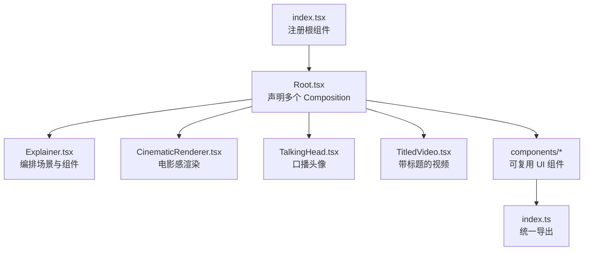
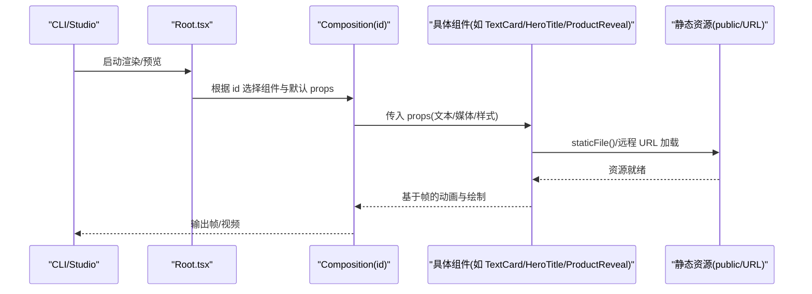
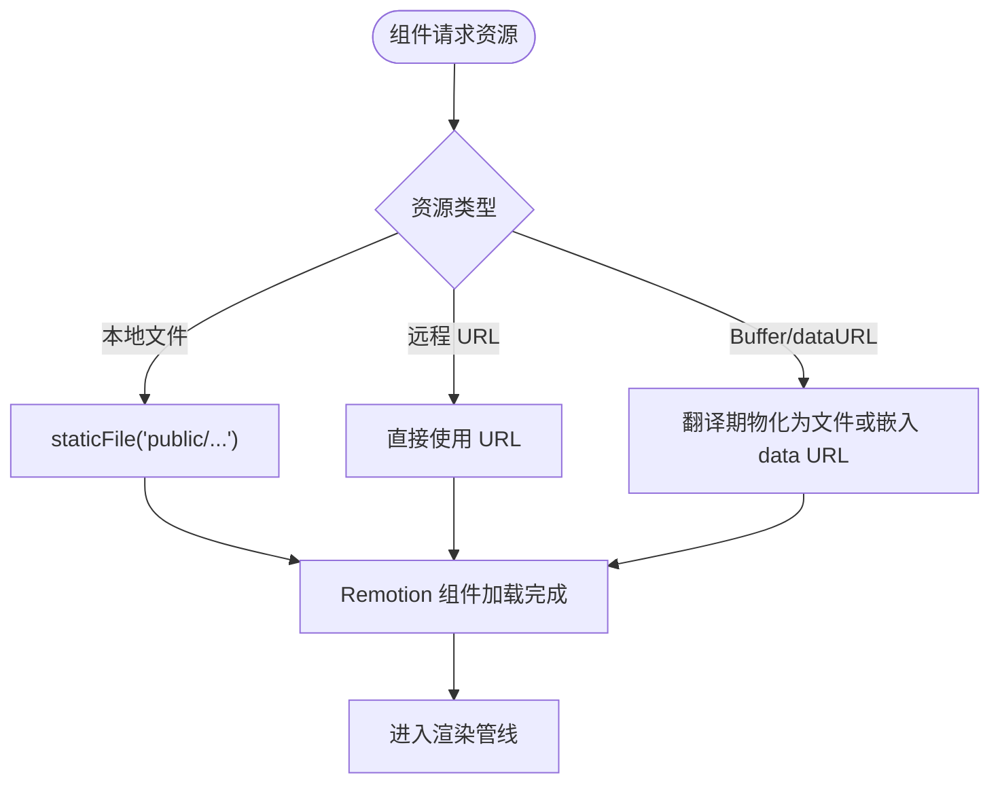
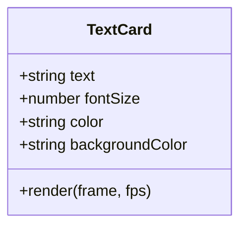
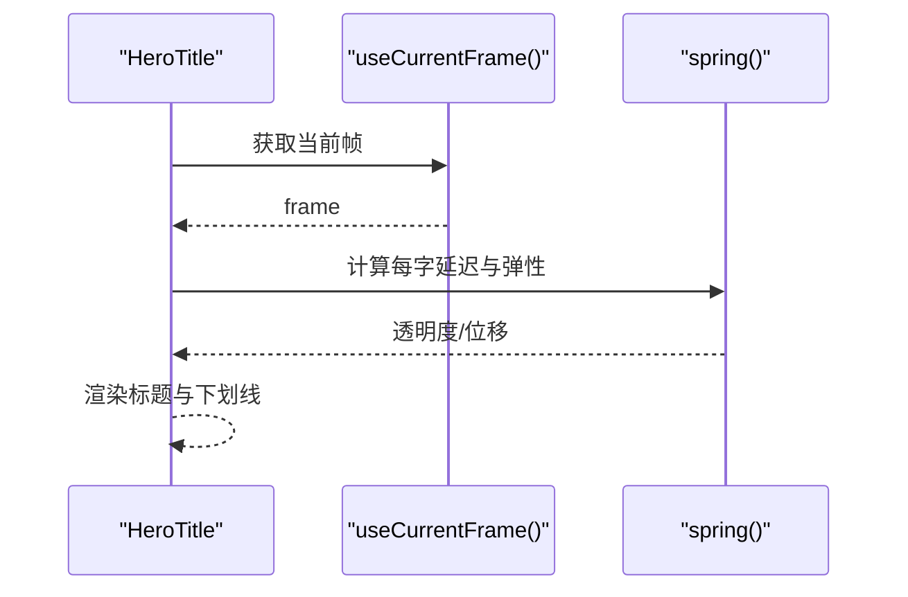
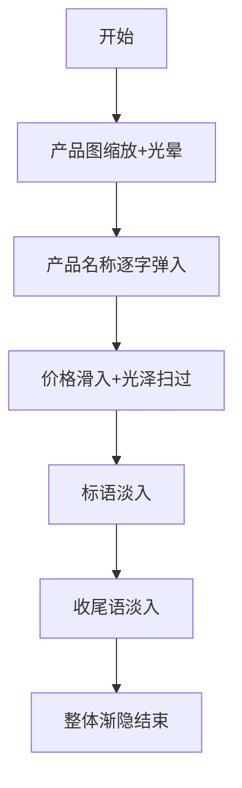
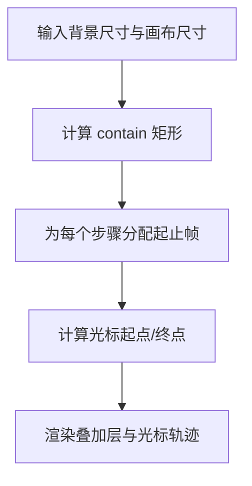
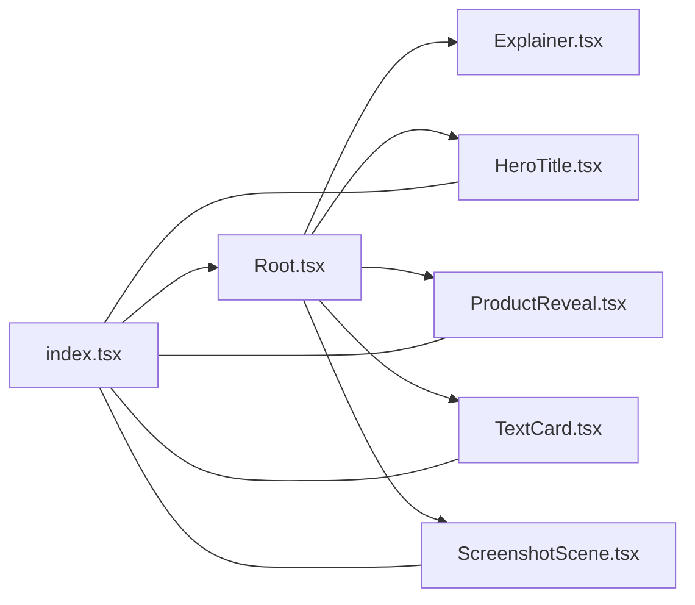

# 自定义组件开发

<cite>
**本文引用的文件**
- [remotion-composer/src/index.tsx](file://remotion-composer/src/index.tsx)
- [remotion-composer/package.json](file://remotion-composer/package.json)
- [remotion-composer/src/Root.tsx](file://remotion-composer/src/Root.tsx)
- [remotion-composer/src/Explainer.tsx](file://remotion-composer/src/Explainer.tsx)
- [remotion-composer/src/components/index.ts](file://remotion-composer/src/components/index.ts)
- [remotion-composer/src/components/TextCard.tsx](file://remotion-composer/src/components/TextCard.tsx)
- [remotion-composer/src/components/HeroTitle.tsx](file://remotion-composer/src/components/HeroTitle.tsx)
- [remotion-composer/src/components/ProductReveal.tsx](file://remotion-composer/src/components/ProductReveal.tsx)
- [remotion-composer/src/components/ScreenshotScene.tsx](file://remotion-composer/src/components/ScreenshotScene.tsx)
- [.agents/skills/remotion-best-practices/rules/assets.md](file://.agents/skills/remotion-best-practices/rules/assets.md)
- [.agents/skills/remotion-to-hyperframes/references/media.md](file://.agents/skills/remotion-to-hyperframes/references/media.md)
- [tools/video/video_compose.py](file://tools/video/video_compose.py)
</cite>

## 目录
1. [简介](#简介)
2. [项目结构](#项目结构)
3. [核心组件](#核心组件)
4. [架构总览](#架构总览)
5. [详细组件分析](#详细组件分析)
6. [依赖关系分析](#依赖关系分析)
7. [性能考量](#性能考量)
8. [故障排查指南](#故障排查指南)
9. [结论](#结论)
10. [附录](#附录)

## 简介
本指南面向在 OpenMontage Remotion 视频合成器中开发“自定义组件”的工程师与创作者。内容覆盖：
- 组件接口定义、属性类型、事件处理（以 props 驱动为主）的标准规范
- 组件注册机制：导出规范、命名约定、依赖管理
- 资产解析系统：图片、视频、音频等资源的加载与处理
- 从简单文本到复杂动画的完整示例路径
- 测试策略：单元、集成、视觉回归
- 发布与版本管理的最佳实践

## 项目结构
Remotion 工程位于 remotion-composer，入口通过 registerRoot 注册根组件；根组件集中声明多个 Composition，并统一主题与默认参数；组件库集中在 src/components，并通过 index.ts 统一再导出。

图表来源
- [remotion-composer/src/index.tsx:1-5](file://remotion-composer/src/index.tsx#L1-L5)
- [remotion-composer/src/Root.tsx:135-333](file://remotion-composer/src/Root.tsx#L135-L333)

章节来源
- [remotion-composer/src/index.tsx:1-5](file://remotion-composer/src/index.tsx#L1-L5)
- [remotion-composer/package.json:1-36](file://remotion-composer/package.json#L1-L36)
- [remotion-composer/src/Root.tsx:135-333](file://remotion-composer/src/Root.tsx#L135-L333)

## 核心组件
- 根注册与 Composition 声明：通过 registerRoot 挂载根组件，并在根内使用 Composition 声明多个可独立渲染的片段（如 Explainer、ProductReveal、HeroTitle、EndTag 等），每个 Composition 指定 id、组件、时长、帧率、分辨率与默认 props。
- 主题系统：Root 提供 ThemeConfig 与 THEMES 字典，支持按 theme/playbook/themeConfig 选择或覆盖主题，确保组件外观一致且可配置。
- 场景编排：Explainer 作为主编排器，组合多种子组件（文本卡片、统计卡片、图表、字幕、截图演示、终端演示等），并提供统一的背景与过渡风格。

章节来源
- [remotion-composer/src/Root.tsx:24-121](file://remotion-composer/src/Root.tsx#L24-L121)
- [remotion-composer/src/Root.tsx:135-333](file://remotion-composer/src/Root.tsx#L135-L333)
- [remotion-composer/src/Explainer.tsx:1-35](file://remotion-composer/src/Explainer.tsx#L1-L35)

## 架构总览
Remotion 渲染管线由“根注册 → Composition 声明 → 组件树 → 资源加载 → 渲染输出”构成。组件通过 props 接收数据与样式，内部使用 Remotion 提供的动画原语（spring、interpolate、useCurrentFrame 等）实现时间轴驱动的动效。

图表来源
- [remotion-composer/src/index.tsx:1-5](file://remotion-composer/src/index.tsx#L1-L5)
- [remotion-composer/src/Root.tsx:135-333](file://remotion-composer/src/Root.tsx#L135-L333)
- [remotion-composer/src/components/TextCard.tsx:1-54](file://remotion-composer/src/components/TextCard.tsx#L1-L54)
- [remotion-composer/src/components/HeroTitle.tsx:1-135](file://remotion-composer/src/components/HeroTitle.tsx#L1-L135)
- [remotion-composer/src/components/ProductReveal.tsx:1-319](file://remotion-composer/src/components/ProductReveal.tsx#L1-L319)

## 详细组件分析

### 组件接口与属性类型规范
- 使用 TypeScript 接口定义 Props，明确必填与可选字段，并为数值、颜色、尺寸等设置合理默认值。
- 推荐将“展示型”与“行为型”属性分离，例如文本、颜色、尺寸属于展示型；是否自动播放、循环等属于行为型。
- 对媒体类属性（图片/视频/音频路径）建议统一为字符串类型，并在组件内部进行合法性校验与回退处理。

示例参考
- 文本卡片：[TextCard.tsx:3-8](file://remotion-composer/src/components/TextCard.tsx#L3-L8)
- 英雄标题：[HeroTitle.tsx:9-24](file://remotion-composer/src/components/HeroTitle.tsx#L9-L24)
- 产品揭示：[ProductReveal.tsx:12-19](file://remotion-composer/src/components/ProductReveal.tsx#L12-L19)

章节来源
- [remotion-composer/src/components/TextCard.tsx:1-54](file://remotion-composer/src/components/TextCard.tsx#L1-L54)
- [remotion-composer/src/components/HeroTitle.tsx:1-135](file://remotion-composer/src/components/HeroTitle.tsx#L1-L135)
- [remotion-composer/src/components/ProductReveal.tsx:1-319](file://remotion-composer/src/components/ProductReveal.tsx#L1-L319)

### 组件注册与导出规范
- 组件文件放在 src/components，并通过 components/index.ts 统一再导出，便于上层按需引入与 Tree-shaking。
- 在 Root.tsx 中通过 Composition 声明组件的 id、默认 props、时长、分辨率等，形成“可被外部调用的渲染单元”。
- 命名约定：组件名采用 PascalCase；Composition id 使用英文短横线或驼峰，保持语义化与唯一性。

示例参考
- 统一导出：[components/index.ts:1-20](file://remotion-composer/src/components/index.ts#L1-L20)
- Composition 注册：[Root.tsx:135-333](file://remotion-composer/src/Root.tsx#L135-L333)

章节来源
- [remotion-composer/src/components/index.ts:1-20](file://remotion-composer/src/components/index.ts#L1-L20)
- [remotion-composer/src/Root.tsx:135-333](file://remotion-composer/src/Root.tsx#L135-L333)

### 依赖管理与包管理
- 使用 package.json 声明运行时依赖（remotion、@remotion/*、react 等）与开发依赖（typescript）。
- 通过 scripts 暴露 start/build/upgrade 命令，便于本地预览与构建。
- 对第三方依赖冲突可通过 overrides 进行锁定。

示例参考
- 依赖与脚本：[package.json:1-36](file://remotion-composer/package.json#L1-L36)

章节来源
- [remotion-composer/package.json:1-36](file://remotion-composer/package.json#L1-L36)

### 资产解析系统（图片、视频、音频）
- 本地资源：放置于 public 目录，使用 staticFile() 引用，确保部署到子目录时路径正确。
- 远程资源：直接传入 http(s) URL，无需 staticFile。
- Buffer/dataURL 等特殊来源：若不在磁盘上，需先物化为文件或使用 data URL 嵌入（小体积）。
- 管道侧适配：video_compose 会将 file:// 等不可用源改写为相对 staticFile 路径，保证跨平台一致性。

图表来源
- [.agents/skills/remotion-best-practices/rules/assets.md:1-79](file://.agents/skills/remotion-best-practices/rules/assets.md#L1-L79)
- [.agents/skills/remotion-to-hyperframes/references/media.md:137-150](file://.agents/skills/remotion-to-hyperframes/references/media.md#L137-L150)
- [tools/video/video_compose.py:893-913](file://tools/video/video_compose.py#L893-L913)

章节来源
- [.agents/skills/remotion-best-practices/rules/assets.md:1-79](file://.agents/skills/remotion-best-practices/rules/assets.md#L1-L79)
- [.agents/skills/remotion-to-hyperframes/references/media.md:137-150](file://.agents/skills/remotion-to-hyperframes/references/media.md#L137-L150)
- [tools/video/video_compose.py:893-913](file://tools/video/video_compose.py#L893-L913)

### 事件处理与交互模式
- Remotion 视频渲染环境以“时间驱动”为主，通常不依赖用户交互事件。
- 如需触发状态变化，建议使用 props 驱动（父级根据时间或外部信号更新 props），或在组件内部基于 useCurrentFrame 计算状态。
- 对于需要“点击/悬停”的交互式预览，可在 Studio 环境下结合 React 事件，但正式渲染应回到无交互的时间线模型。

章节来源
- [remotion-composer/src/components/TextCard.tsx:16-26](file://remotion-composer/src/components/TextCard.tsx#L16-L26)
- [remotion-composer/src/components/HeroTitle.tsx:40-88](file://remotion-composer/src/components/HeroTitle.tsx#L40-L88)

### 完整示例：从简单到复杂

#### 示例一：简单文本组件（TextCard）
- 目标：显示居中文字，带淡入与缩放动画。
- 关键点：Props 定义、spring 动画、AbsoluteFill 布局。
- 参考路径：[TextCard.tsx:1-54](file://remotion-composer/src/components/TextCard.tsx#L1-L54)

图表来源
- [remotion-composer/src/components/TextCard.tsx:1-54](file://remotion-composer/src/components/TextCard.tsx#L1-L54)

章节来源
- [remotion-composer/src/components/TextCard.tsx:1-54](file://remotion-composer/src/components/TextCard.tsx#L1-L54)

#### 示例二：英雄标题（HeroTitle）
- 目标：逐字弹跳入场、下划线展开、副标题渐显。
- 关键点：字符拆分、逐字延迟 spring、interpolate 位移映射、主题色与遮罩。
- 参考路径：[HeroTitle.tsx:1-135](file://remotion-composer/src/components/HeroTitle.tsx#L1-L135)

图表来源
- [remotion-composer/src/components/HeroTitle.tsx:40-130](file://remotion-composer/src/components/HeroTitle.tsx#L40-L130)

章节来源
- [remotion-composer/src/components/HeroTitle.tsx:1-135](file://remotion-composer/src/components/HeroTitle.tsx#L1-L135)

#### 示例三：产品揭示（ProductReveal）
- 目标：多阶段动画（产品图缩放+光晕、名称逐字、价格滑入、标语淡入、结尾渐隐）。
- 关键点：分阶段时序控制、静态图片引用、阴影与反射效果、整体淡出。
- 参考路径：[ProductReveal.tsx:1-319](file://remotion-composer/src/components/ProductReveal.tsx#L1-L319)

图表来源
- [remotion-composer/src/components/ProductReveal.tsx:32-103](file://remotion-composer/src/components/ProductReveal.tsx#L32-L103)
- [remotion-composer/src/components/ProductReveal.tsx:199-314](file://remotion-composer/src/components/ProductReveal.tsx#L199-L314)

章节来源
- [remotion-composer/src/components/ProductReveal.tsx:1-319](file://remotion-composer/src/components/ProductReveal.tsx#L1-L319)

#### 示例四：截图演示（ScreenshotScene）
- 目标：在背景图中定位叠加层，计算 contain 矩形，分配步骤时间窗口与光标轨迹。
- 关键点：containRect 计算、步骤时序划分、光标插值。
- 参考路径：[ScreenshotScene.tsx:74-120](file://remotion-composer/src/components/ScreenshotScene.tsx#L74-L120)

图表来源
- [remotion-composer/src/components/ScreenshotScene.tsx:87-120](file://remotion-composer/src/components/ScreenshotScene.tsx#L87-L120)

章节来源
- [remotion-composer/src/components/ScreenshotScene.tsx:74-120](file://remotion-composer/src/components/ScreenshotScene.tsx#L74-L120)

## 依赖关系分析
- 根入口 index.tsx 仅负责注册 Root，避免耦合业务逻辑。
- Root.tsx 聚合多个 Composition，承担“元信息（时长/分辨率/默认 props）”与“主题解析”的职责。
- Explainer.tsx 作为编排器，导入并组合各子组件，统一管理字体与背景。
- components/index.ts 提供统一导出，降低上层耦合度。

图表来源
- [remotion-composer/src/index.tsx:1-5](file://remotion-composer/src/index.tsx#L1-L5)
- [remotion-composer/src/Root.tsx:135-333](file://remotion-composer/src/Root.tsx#L135-L333)
- [remotion-composer/src/Explainer.tsx:1-35](file://remotion-composer/src/Explainer.tsx#L1-L35)
- [remotion-composer/src/components/index.ts:1-20](file://remotion-composer/src/components/index.ts#L1-L20)

章节来源
- [remotion-composer/src/index.tsx:1-5](file://remotion-composer/src/index.tsx#L1-L5)
- [remotion-composer/src/Root.tsx:135-333](file://remotion-composer/src/Root.tsx#L135-L333)
- [remotion-composer/src/Explainer.tsx:1-35](file://remotion-composer/src/Explainer.tsx#L1-L35)
- [remotion-composer/src/components/index.ts:1-20](file://remotion-composer/src/components/index.ts#L1-L20)

## 性能考量
- 动画优化：优先使用 spring/interpolate 等 GPU 友好的属性（transform、opacity），避免频繁重排。
- 资源加载：大体积媒体尽量走 OffthreadVideo/Video/Audio 组件，确保预加载与缓冲；本地资源使用 staticFile，避免动态拼接导致缓存失效。
- 帧率与时长：在 Composition 中合理设置 fps 与 durationInFrames，减少不必要的长序列渲染。
- 主题与样式：通过主题对象集中管理颜色与字体，减少重复计算。

[本节为通用指导，不直接分析具体文件]

## 故障排查指南
- 资源无法加载
  - 检查是否使用 staticFile 引用 public 下的资源；远程 URL 可直接使用。
  - Buffer/dataURL 需在翻译期物化为文件或嵌入 HTML（小体积）。
  - 管道侧可能已将 file:// 改写为相对 staticFile 路径，确认最终渲染路径有效。
- 渲染异常或黑屏
  - 确认 Composition 的宽高、fps、durationInFrames 与组件预期一致。
  - 检查默认 props 是否缺失关键媒体字段。
- 字体未生效
  - 使用 @remotion/google-fonts 加载字体，并确保权重与子集正确。
- 性能抖动
  - 减少每帧大量 DOM 节点创建；合并动画；避免过度滤镜与模糊。

章节来源
- [.agents/skills/remotion-best-practices/rules/assets.md:1-79](file://.agents/skills/remotion-best-practices/rules/assets.md#L1-L79)
- [.agents/skills/remotion-to-hyperframes/references/media.md:137-150](file://.agents/skills/remotion-to-hyperframes/references/media.md#L137-L150)
- [tools/video/video_compose.py:893-913](file://tools/video/video_compose.py#L893-L913)

## 结论
通过在 Root 中集中声明 Composition、在 components 中封装可复用的 UI 组件、遵循统一的 Props 与导出规范，并结合 Remotion 的动画原语与资源加载机制，可以快速构建高质量的视频组件。配合完善的测试与发布流程，能够保障组件的可维护性与稳定性。

[本节为总结性内容，不直接分析具体文件]

## 附录

### 组件开发与注册清单
- 组件文件：src/components/*.tsx
- 统一导出：src/components/index.ts
- 注册方式：在 Root.tsx 中使用 Composition 声明 id、组件、默认 props、时长、分辨率
- 资源路径：public 目录 + staticFile；远程 URL 直接传入

章节来源
- [remotion-composer/src/components/index.ts:1-20](file://remotion-composer/src/components/index.ts#L1-L20)
- [remotion-composer/src/Root.tsx:135-333](file://remotion-composer/src/Root.tsx#L135-L333)
- [.agents/skills/remotion-best-practices/rules/assets.md:1-79](file://.agents/skills/remotion-best-practices/rules/assets.md#L1-L79)

### 测试策略
- 单元测试：针对组件的纯函数逻辑（如颜色转换、contain 矩形计算）编写用例。
- 集成测试：验证 Composition 的默认 props、时长计算与资源加载链路。
- 视觉回归：对关键帧进行截图对比，确保动画与排版稳定。
- 管道测试：验证 video_compose 的资源改写与渲染生命周期。

[本节为通用指导，不直接分析具体文件]

### 发布与版本管理
- 版本号：在 package.json 中维护版本，配合语义化版本管理。
- 脚本：通过 scripts 暴露 start/build/upgrade，便于本地与 CI 使用。
- 依赖锁定：必要时使用 overrides 锁定冲突依赖版本。
- 文档：为每个组件提供 Props 说明与使用示例，便于团队复用。

章节来源
- [remotion-composer/package.json:1-36](file://remotion-composer/package.json#L1-L36)