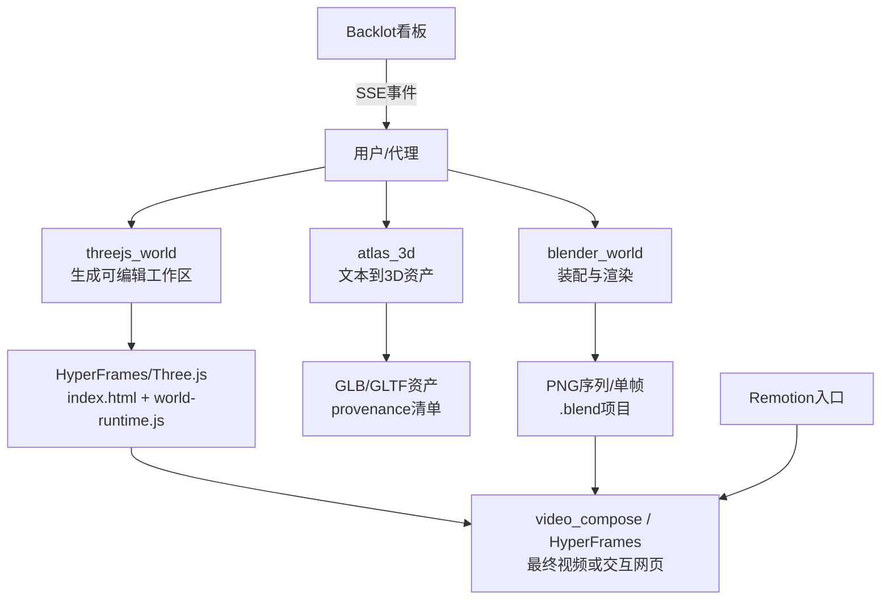
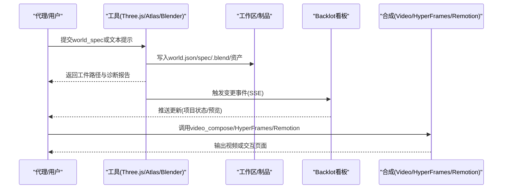
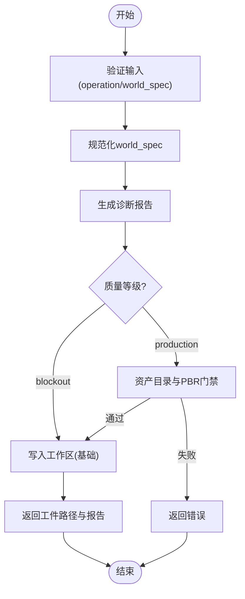
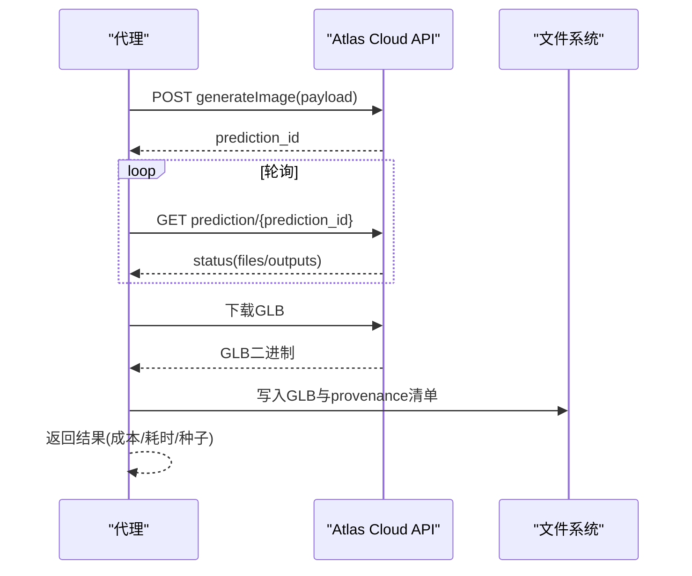
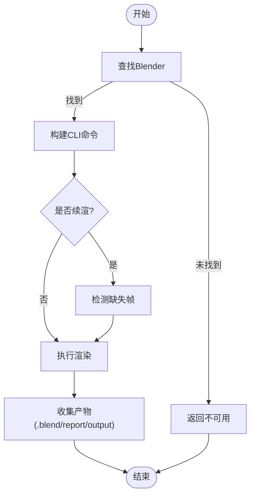
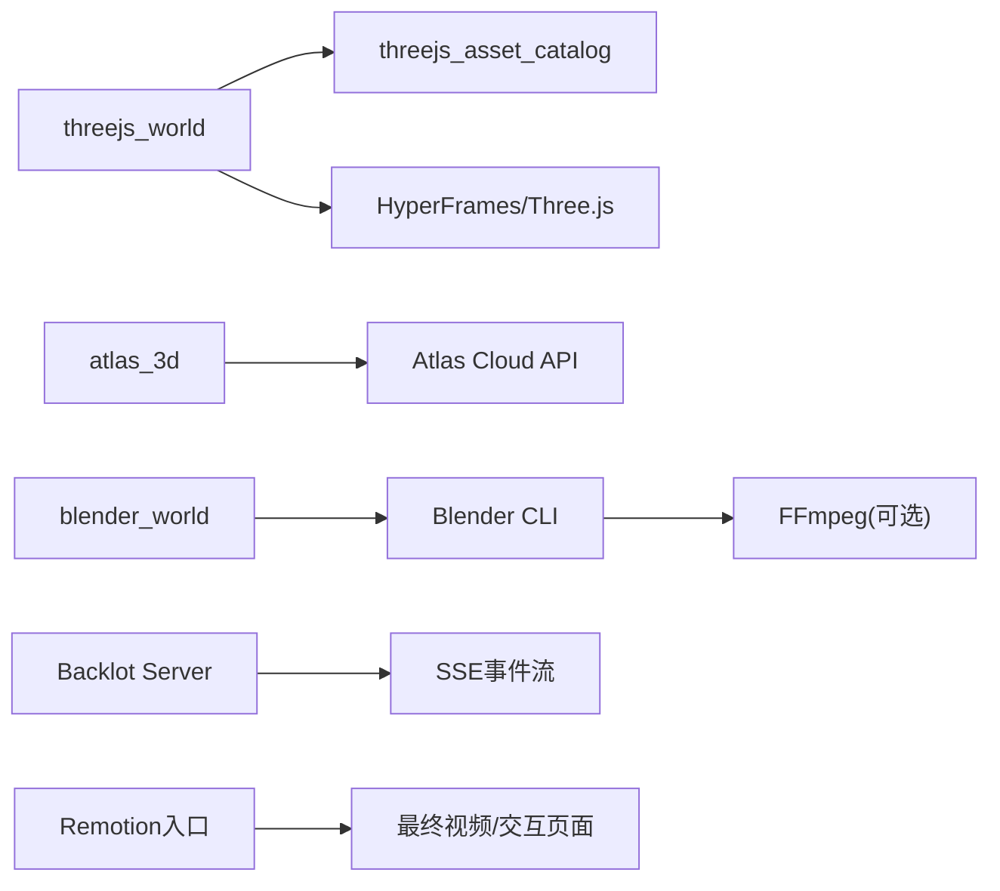

# 3D世界生成

<cite>
**本文引用的文件**
- [tools/graphics/threejs_world.py](file://tools/graphics/threejs_world.py)
- [tools/graphics/blender_world.py](file://tools/graphics/blender_world.py)
- [tools/graphics/atlas_3d.py](file://tools/graphics/atlas_3d.py)
- [tools/graphics/threejs_asset_catalog.py](file://tools/graphics/threejs_asset_catalog.py)
- [skills/creative/3d-world-generation.md](file://skills/creative/3d-world-generation.md)
- [schemas/tools/threejs_world.schema.json](file://schemas/tools/threejs_world.schema.json)
- [schemas/tools/atlas_3d.schema.json](file://schemas/tools/atlas_3d.schema.json)
- [schemas/tools/blender_world.schema.json](file://schemas/tools/blender_world.schema.json)
- [.agents/skills/threejs-materials/SKILL.md](file://.agents/skills/threejs-materials/SKILL.md)
- [.agents/skills/threejs-textures/SKILL.md](file://.agents/skills/threejs-textures/SKILL.md)
- [backlot/server.py](file://backlot/server.py)
- [remotion-composer/src/index.tsx](file://remotion-composer/src/index.tsx)
</cite>

## 目录
1. [简介](#简介)
2. [项目结构](#项目结构)
3. [核心组件](#核心组件)
4. [架构总览](#架构总览)
5. [详细组件分析](#详细组件分析)
6. [依赖关系分析](#依赖关系分析)
7. [性能与优化](#性能与优化)
8. [故障排查指南](#故障排查指南)
9. [结论](#结论)
10. [附录：开发示例与提示词工程](#附录开发示例与提示词工程)

## 简介
本技术文档面向OpenMontage的3D世界生成系统，聚焦以下目标：
- Three.js集成、Atlas 3D服务与Blender工作流的实现架构
- 3D场景构建、材质系统、光照设置与动画效果的编程接口
- 从文本描述到3D场景的转换流程与提示词工程技巧
- 完整项目结构说明（HTML模板、JavaScript运行时、CSS样式）
- 3D资产管理与优化策略
- 交互式3D场景创建与渲染结果导出的实际开发示例

该系统通过“工具+技能+规范”的分层设计，将“可编辑的Three.js世界”和“生产级Blender渲染”两条路径统一纳入OpenMontage的生产管线，并以Backlot作为可视化看板与事件总线，Remotion/HyperFrames作为最终合成与交付引擎。

## 项目结构
围绕3D世界生成的关键目录与职责：
- tools/graphics：提供三大核心工具
  - threejs_world：基于结构化world_spec生成可编辑的HyperFrames/Three.js工作区
  - atlas_3d：调用Atlas Cloud进行文本到3D资产生成
  - blender_world：以Blender进行场景装配与渲染（含序列帧输出与断点续渲）
  - threejs_asset_catalog：安装并管理CC0授权的GLTF/PBR资产目录
- schemas/tools：定义工具的输入契约（JSON Schema），确保AI代理与人类审核的一致性
- skills/creative/3d-world-generation.md：Layer 2技能，指导如何选择能力、质量等级、交付路径与审查要点
- backlot/server.py：本地看板服务，提供SSE事件流、项目状态API与媒体访问
- remotion-composer/src/index.tsx：Remotion入口，用于React驱动的合成与导出

图表来源
- [tools/graphics/threejs_world.py:159-238](file://tools/graphics/threejs_world.py#L159-L238)
- [tools/graphics/atlas_3d.py:132-227](file://tools/graphics/atlas_3d.py#L132-L227)
- [tools/graphics/blender_world.py:131-241](file://tools/graphics/blender_world.py#L131-L241)
- [backlot/server.py:165-307](file://backlot/server.py#L165-L307)
- [remotion-composer/src/index.tsx:1-5](file://remotion-composer/src/index.tsx#L1-L5)

章节来源
- [tools/graphics/threejs_world.py:1-238](file://tools/graphics/threejs_world.py#L1-L238)
- [tools/graphics/atlas_3d.py:1-227](file://tools/graphics/atlas_3d.py#L1-L227)
- [tools/graphics/blender_world.py:1-241](file://tools/graphics/blender_world.py#L1-L241)
- [tools/graphics/threejs_asset_catalog.py:1-172](file://tools/graphics/threejs_asset_catalog.py#L1-L172)
- [skills/creative/3d-world-generation.md:1-49](file://skills/creative/3d-world-generation.md#L1-L49)
- [backlot/server.py:165-307](file://backlot/server.py#L165-L307)
- [remotion-composer/src/index.tsx:1-5](file://remotion-composer/src/index.tsx#L1-L5)

## 核心组件
- Three.js世界生成器（threejs_world）
  - 作用：规范化world_spec，校验语义区域、地标、相机路径；写入可编辑的HyperFrames/Three.js工作区（HTML/CSS/JS/JSON）
  - 关键特性：确定性种子、多渲染模式（电影/语义/线框）、质量等级（blockout/production）、PBR地形材质契约、资产目录集成
- Atlas 3D服务（atlas_3d）
  - 作用：通过Atlas Cloud API提交文本到3D任务，轮询完成并下载GLB模型，生成provenance清单
  - 关键特性：纹理/PBR开关、几何质量、面数限制、种子控制、重试策略
- Blender工作流（blender_world）
  - 作用：调用Blender CLI执行build/still/animation操作，支持断点续渲、帧范围控制、报告输出
  - 关键特性：EEVEE Next渲染、相机飞行路径、可见性窗口、标题安全保持
- 资产目录（threejs_asset_catalog）
  - 作用：下载并解压CC0授权资产包，生成catalog-manifest.json，记录模型与纹理清单及哈希
- 技能与规范
  - 3D世界生成技能：指导选择render_runtime、composition_mode、质量等级与审查重点
  - 材质与纹理技能：Three.js材质类型、PBR贴图、环境贴图、性能建议
- Backlot看板
  - 作用：FastAPI服务，提供项目状态API、SSE事件流、缩略图与媒体访问，驱动本地可视化看板
- Remotion入口
  - 作用：注册根组件，作为React驱动的合成与导出入口

章节来源
- [tools/graphics/threejs_world.py:75-238](file://tools/graphics/threejs_world.py#L75-L238)
- [tools/graphics/atlas_3d.py:51-227](file://tools/graphics/atlas_3d.py#L51-L227)
- [tools/graphics/blender_world.py:53-241](file://tools/graphics/blender_world.py#L53-L241)
- [tools/graphics/threejs_asset_catalog.py:71-172](file://tools/graphics/threejs_asset_catalog.py#L71-L172)
- [skills/creative/3d-world-generation.md:1-49](file://skills/creative/3d-world-generation.md#L1-L49)
- [.agents/skills/threejs-materials/SKILL.md:38-499](file://.agents/skills/threejs-materials/SKILL.md#L38-L499)
- [.agents/skills/threejs-textures/SKILL.md:437-511](file://.agents/skills/threejs-textures/SKILL.md#L437-L511)
- [backlot/server.py:165-307](file://backlot/server.py#L165-L307)
- [remotion-composer/src/index.tsx:1-5](file://remotion-composer/src/index.tsx#L1-L5)

## 架构总览
OpenMontage的3D世界生成采用“工具+技能+规范”三层知识架构：
- 工具层：threejs_world、atlas_3d、blender_world、threejs_asset_catalog
- 技能层：3D世界生成技能、Three.js材质/纹理/加载器/光照/后处理等技能
- 规范层：JSON Schema约束输入输出，保证一致性

图表来源
- [tools/graphics/threejs_world.py:159-238](file://tools/graphics/threejs_world.py#L159-L238)
- [tools/graphics/atlas_3d.py:132-227](file://tools/graphics/atlas_3d.py#L132-L227)
- [tools/graphics/blender_world.py:131-241](file://tools/graphics/blender_world.py#L131-L241)
- [backlot/server.py:165-307](file://backlot/server.py#L165-L307)

## 详细组件分析

### Three.js世界生成器（threejs_world）
- 输入契约：operation（build/validate）、world_spec（regions/camera_path等）、渲染参数（duration_seconds/width/height/render_mode/quality_tier）、资产目录路径
- 处理流程：
  - 规范化world_spec（区域、地标、相机路径、大气、地形材质、资产调色板）
  - 生成诊断报告（有效性、警告、统计信息、覆盖采样、相机间隙检查）
  - 写入工作区（index.html、world.css、world-runtime.js、world.json、world-spec.js、report、asset-catalog-index、hyperframes.json）
- 质量保证：
  - blockout仅用于布局迭代；production需满足资产目录、PBR材质、类别多样性等要求
  - 相机路径必须严格递增时间，首尾时间匹配时长，避免地形穿透
- 输出：可编辑的HyperFrames/Three.js工作区，供浏览器预览或进一步合成

图表来源
- [tools/graphics/threejs_world.py:159-238](file://tools/graphics/threejs_world.py#L159-L238)
- [tools/graphics/threejs_world.py:240-287](file://tools/graphics/threejs_world.py#L240-L287)
- [tools/graphics/threejs_world.py:289-453](file://tools/graphics/threejs_world.py#L289-L453)
- [tools/graphics/threejs_world.py:455-552](file://tools/graphics/threejs_world.py#L455-L552)
- [tools/graphics/threejs_world.py:628-733](file://tools/graphics/threejs_world.py#L628-L733)

章节来源
- [tools/graphics/threejs_world.py:75-238](file://tools/graphics/threejs_world.py#L75-L238)
- [schemas/tools/threejs_world.schema.json:1-38](file://schemas/tools/threejs_world.schema.json#L1-L38)

### Atlas 3D服务（atlas_3d）
- 输入契约：prompt、negative_prompt、output_path、texture/pbr、质量选项、面数限制、种子、超时
- 处理流程：
  - 构造请求负载并提交至Atlas Cloud
  - 轮询预测状态直至完成或失败
  - 解析GLB输出并下载到指定路径
  - 生成provenance清单（provider/model/prompt/parameters/source_url/output）
- 成本估算：根据纹理质量、几何质量、quad选项计算预估费用
- 错误处理：网络异常、超时、无GLB输出时抛出明确错误

图表来源
- [tools/graphics/atlas_3d.py:132-227](file://tools/graphics/atlas_3d.py#L132-L227)
- [schemas/tools/atlas_3d.schema.json:1-25](file://schemas/tools/atlas_3d.schema.json#L1-L25)

章节来源
- [tools/graphics/atlas_3d.py:51-227](file://tools/graphics/atlas_3d.py#L51-L227)
- [schemas/tools/atlas_3d.schema.json:1-25](file://schemas/tools/atlas_3d.schema.json#L1-L25)

### Blender工作流（blender_world）
- 输入契约：operation（doctor/build/render_still/render_animation）、world_spec、输出路径、分辨率、采样、FPS、时长、帧范围、resume
- 处理流程：
  - 查找Blender可执行文件（环境变量/便携路径/系统PATH）
  - 写入.spec文件，组装CLI命令（背景模式、Python脚本、参数）
  - 支持断点续渲：检测缺失帧，从首个缺失帧继续
  - 执行渲染并收集产物（.blend、.report.json、输出路径）
- 质量与可用性：
  - 提供doctor自检，返回版本信息
  - 估计运行时间与超时保护
  - 支持透明背景、标题安全保持、可见性窗口等高级特性

图表来源
- [tools/graphics/blender_world.py:33-40](file://tools/graphics/blender_world.py#L33-L40)
- [tools/graphics/blender_world.py:123-147](file://tools/graphics/blender_world.py#L123-L147)
- [tools/graphics/blender_world.py:151-241](file://tools/graphics/blender_world.py#L151-L241)

章节来源
- [tools/graphics/blender_world.py:53-241](file://tools/graphics/blender_world.py#L53-L241)
- [schemas/tools/blender_world.schema.json:1-24](file://schemas/tools/blender_world.schema.json#L1-L24)

### 资产目录（threejs_asset_catalog）
- 功能：列出、安装、检查CC0授权资产目录
- 安装流程：
  - 下载ZIP压缩包
  - 解压至source目录
  - 扫描GLTF/GLB与纹理文件
  - 生成catalog-manifest.json（包含模型清单、纹理数量、归档哈希）
- 用途：为production质量等级提供重复资产的合法来源与可审计清单

章节来源
- [tools/graphics/threejs_asset_catalog.py:29-54](file://tools/graphics/threejs_asset_catalog.py#L29-L54)
- [tools/graphics/threejs_asset_catalog.py:112-172](file://tools/graphics/threejs_asset_catalog.py#L112-L172)

### 技能与规范
- 3D世界生成技能：指导选择render_runtime（hyperframes/ffmpeg）、composition_mode（atelier）、质量等级（blockout/production），以及资产元数据记录与审查重点
- Three.js材质与纹理技能：提供MeshBasic/Lambert/Phong/Standard/Physical材质用法、PBR贴图集、环境贴图、程序化纹理与性能建议

章节来源
- [skills/creative/3d-world-generation.md:1-49](file://skills/creative/3d-world-generation.md#L1-L49)
- [.agents/skills/threejs-materials/SKILL.md:38-499](file://.agents/skills/threejs-materials/SKILL.md#L38-L499)
- [.agents/skills/threejs-textures/SKILL.md:437-511](file://.agents/skills/threejs-textures/SKILL.md#L437-L511)

## 依赖关系分析
- 工具间依赖
  - threejs_world依赖资产目录（production质量）与HyperFrames运行时
  - atlas_3d依赖网络与API密钥
  - blender_world依赖Blender可执行文件与Python脚本
- 外部依赖
  - Atlas Cloud API（文本到3D）
  - FFmpeg（视频封装与缩略图生成）
  - Node.js（HyperFrames/Remotion）
- 看板与事件
  - Backlot使用watchfiles监听项目变更，通过SSE推送事件
  - 前端订阅事件刷新状态与预览

图表来源
- [tools/graphics/threejs_world.py:628-733](file://tools/graphics/threejs_world.py#L628-L733)
- [tools/graphics/atlas_3d.py:156-203](file://tools/graphics/atlas_3d.py#L156-L203)
- [tools/graphics/blender_world.py:164-211](file://tools/graphics/blender_world.py#L164-L211)
- [backlot/server.py:132-212](file://backlot/server.py#L132-L212)
- [remotion-composer/src/index.tsx:1-5](file://remotion-composer/src/index.tsx#L1-L5)

章节来源
- [tools/graphics/threejs_world.py:628-733](file://tools/graphics/threejs_world.py#L628-L733)
- [tools/graphics/atlas_3d.py:156-203](file://tools/graphics/atlas_3d.py#L156-L203)
- [tools/graphics/blender_world.py:164-211](file://tools/graphics/blender_world.py#L164-L211)
- [backlot/server.py:132-212](file://backlot/server.py#L132-L212)
- [remotion-composer/src/index.tsx:1-5](file://remotion-composer/src/index.tsx#L1-L5)

## 性能与优化
- Three.js侧
  - 复用材质减少绘制调用
  - 避免透明排序开销，必要时使用alphaTest
  - 选择更简单的材质类型（Basic > Lambert > Phong > Standard > Physical）
  - 限制活动光源数量以降低着色器复杂度
  - 使用PBR贴图集（法线、粗糙度、金属度、AO、自发光）提升真实感
- Blender侧
  - 合理设置采样数与分辨率平衡质量与速度
  - 使用断点续渲避免重复渲染
  - 利用可见性窗口与标题安全保持优化构图
- 资产目录
  - 优先使用CC0授权资产，降低版权风险与许可成本
  - 记录归档哈希与模型清单，便于审计与回滚
- 看板与事件
  - SSE心跳与去抖合并，避免频繁刷新
  - 缩略图缓存减少重复处理

章节来源
- [.agents/skills/threejs-materials/SKILL.md:493-499](file://.agents/skills/threejs-materials/SKILL.md#L493-L499)
- [.agents/skills/threejs-textures/SKILL.md:437-511](file://.agents/skills/threejs-textures/SKILL.md#L437-L511)
- [tools/graphics/blender_world.py:175-197](file://tools/graphics/blender_world.py#L175-L197)
- [backlot/server.py:183-212](file://backlot/server.py#L183-L212)
- [backlot/server.py:325-365](file://backlot/server.py#L325-L365)

## 故障排查指南
- Three.js世界生成
  - 未知render_mode或quality_tier：检查输入枚举值
  - 缺少必需字段（regions/camera_path）：依据Schema补充
  - 相机路径时间不合法：确保首时间为0、末时间为duration且严格递增
  - 地标超出世界边界：调整位置或增大世界尺寸
- Atlas 3D服务
  - API密钥未设置：配置ATLASCLOUD_API_KEY
  - 轮询超时：增加poll_timeout_seconds或检查网络
  - 无GLB输出：确认模型输出类型或回退到URL后缀判断
- Blender工作流
  - Blender未找到：设置BLENDER_PATH或放置便携版
  - 渲染失败：查看stderr前3000字符定位问题
  - 续渲不完整：检查start_frame/end_frame与缺失帧检测
- 看板服务
  - 无法连接SSE：确认后端运行与防火墙设置
  - 缩略图生成失败：检查FFmpeg与PIL依赖

章节来源
- [tools/graphics/threejs_world.py:159-200](file://tools/graphics/threejs_world.py#L159-L200)
- [tools/graphics/atlas_3d.py:132-181](file://tools/graphics/atlas_3d.py#L132-L181)
- [tools/graphics/blender_world.py:131-216](file://tools/graphics/blender_world.py#L131-L216)
- [backlot/server.py:244-276](file://backlot/server.py#L244-L276)

## 结论
OpenMontage的3D世界生成系统通过清晰的工具分层、严格的输入契约与可审计的资产来源，实现了从文本到可编辑3D世界再到生产级渲染的完整闭环。Three.js路径适合快速迭代与交互展示，Blender路径适合高质量静态与动画输出。结合Backlot看板与Remotion/HyperFrames合成，开发者可在同一套治理框架下灵活选择交付形态。

## 附录：开发示例与提示词工程

### 从文本到3D场景的转换流程
- 步骤
  - 使用atlas_3d生成独特资产（如英雄道具、环境构件），设置纹理/PBR与种子
  - 使用threejs_asset_catalog安装重复资产（树木、岩石、建筑）
  - 使用threejs_world编写world_spec（区域、地标、相机路径、大气、地形材质）
  - 使用blender_world进行装配与渲染（still/animation，支持续渲）
  - 使用video_compose/HyperFrames/Remotion合成最终视频或交互页面
- 提示词工程技巧
  - 明确风格与材质（如PBR、金属度、粗糙度、法线贴图）
  - 指定地理与地貌（平原、山脊、沙丘、台地、盆地、峡谷）
  - 限定地标类型与数量（方尖碑、拱门、塔楼、废墟、水晶、定居点、环）
  - 设定相机路径关键点（时间、位置、目标、视场角）
  - 强调语义一致性（区域颜色、坡度限制、接触约束）

章节来源
- [tools/graphics/atlas_3d.py:85-104](file://tools/graphics/atlas_3d.py#L85-L104)
- [tools/graphics/threejs_asset_catalog.py:29-54](file://tools/graphics/threejs_asset_catalog.py#L29-L54)
- [tools/graphics/threejs_world.py:289-453](file://tools/graphics/threejs_world.py#L289-L453)
- [tools/graphics/blender_world.py:93-111](file://tools/graphics/blender_world.py#L93-L111)

### 交互式3D场景创建
- 使用threejs_world生成index.html与world-runtime.js
- 在浏览器中打开index.html预览相机路径与区域分布
- 调整world_spec中的区域中心、半径、散射密度与地标位置
- 使用semantic/wireframe模式进行布局审查
- 导出为HyperFrames作品或直接嵌入网页

章节来源
- [tools/graphics/threejs_world.py:628-733](file://tools/graphics/threejs_world.py#L628-L733)

### 渲染结果导出
- 使用blender_world渲染PNG序列（支持续渲）
- 使用video_compose/FFmpeg将序列与音频合成为MP4
- 或使用Remotion进行React驱动的合成与导出
- 通过Backlot看板查看进度与预览

章节来源
- [tools/graphics/blender_world.py:164-211](file://tools/graphics/blender_world.py#L164-L211)
- [backlot/server.py:165-307](file://backlot/server.py#L165-L307)
- [remotion-composer/src/index.tsx:1-5](file://remotion-composer/src/index.tsx#L1-L5)