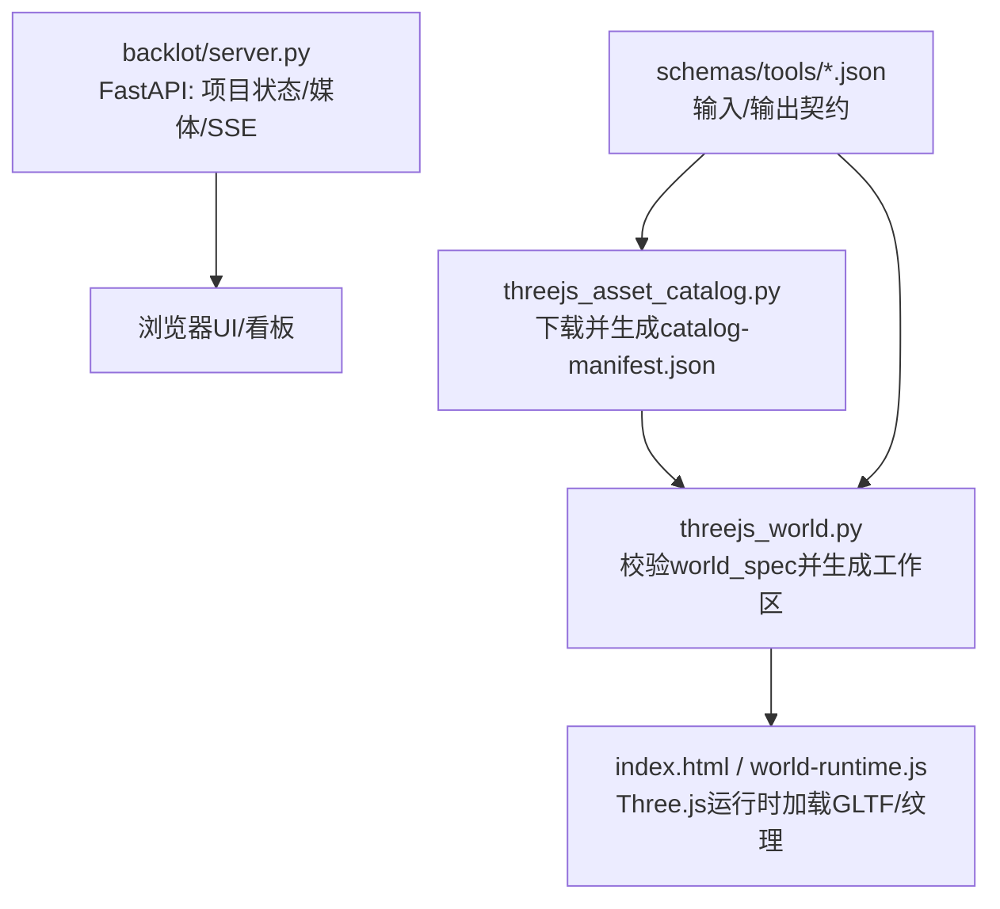
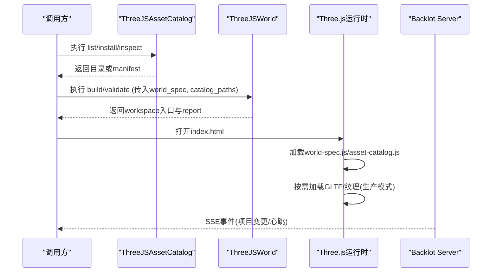
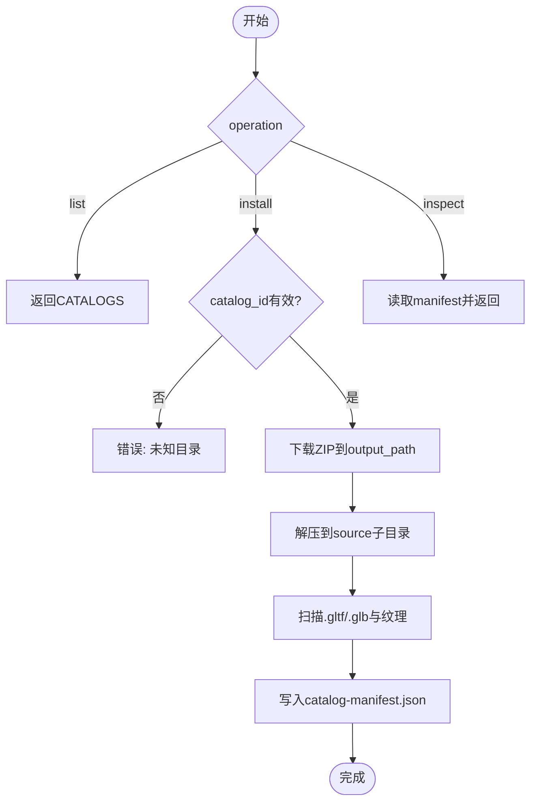
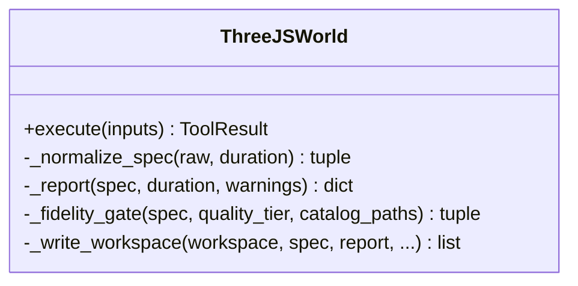
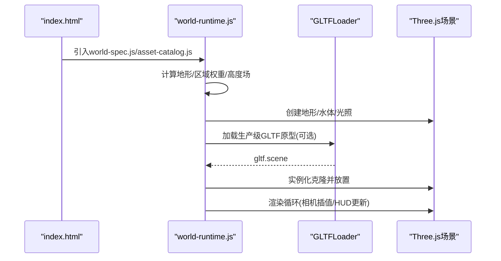
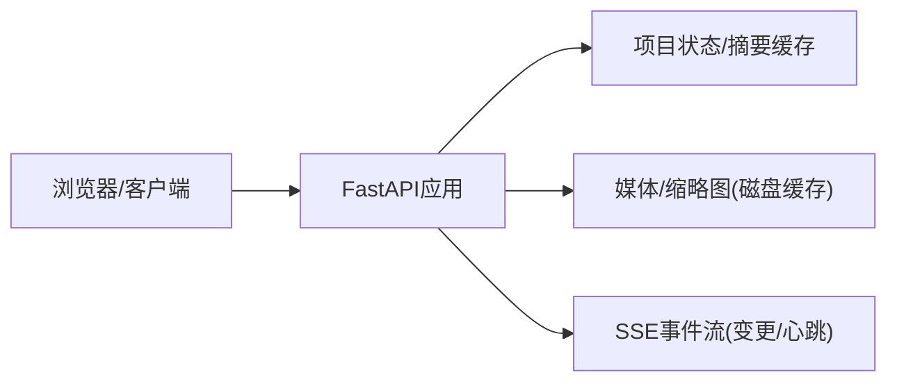
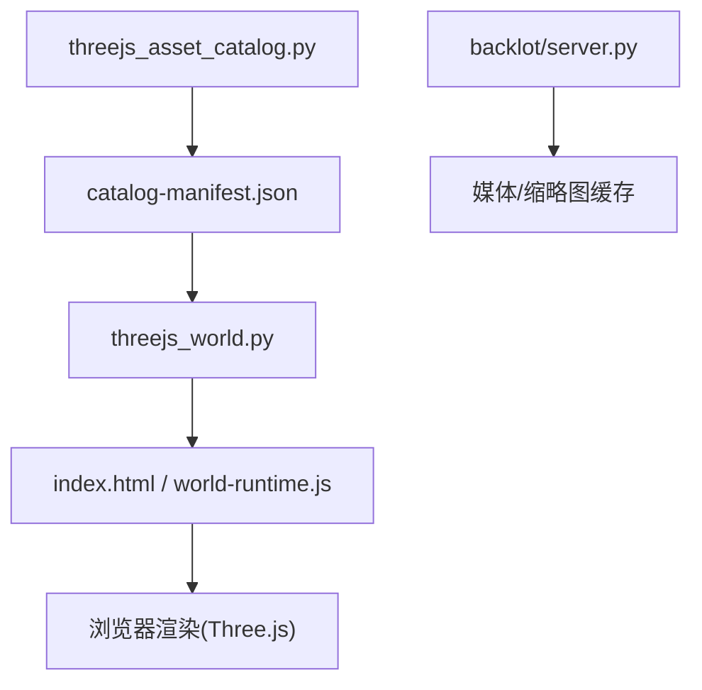

# 3D资产管理

<cite>
**本文引用的文件**
- [tools/graphics/threejs_asset_catalog.py](file://tools/graphics/threejs_asset_catalog.py)
- [tools/graphics/threejs_world.py](file://tools/graphics/threejs_world.py)
- [schemas/tools/threejs_asset_catalog.schema.json](file://schemas/tools/threejs_asset_catalog.schema.json)
- [schemas/tools/threejs_world.schema.json](file://schemas/tools/threejs_world.schema.json)
- [schemas/tools/atlas_3d.schema.json](file://schemas/tools/atlas_3d.schema.json)
- [backlot/server.py](file://backlot/server.py)
- [tests/tools/test_threejs_asset_catalog.py](file://tests/tools/test_threejs_asset_catalog.py)
- [tools/graphics/templates/threejs_world/index.html](file://tools/graphics/templates/threejs_world/index.html)
- [tools/graphics/templates/threejs_world/world-runtime.js](file://tools/graphics/templates/threejs_world/world-runtime.js)
</cite>

## 目录
1. [简介](#简介)
2. [项目结构](#项目结构)
3. [核心组件](#核心组件)
4. [架构总览](#架构总览)
5. [详细组件分析](#详细组件分析)
6. [依赖关系分析](#依赖关系分析)
7. [性能与缓存](#性能与缓存)
8. [故障排查](#故障排查)
9. [结论](#结论)
10. [附录：API参考与示例](#附录api参考与示例)

## 简介
本技术文档面向OpenMontage的3D资产管理系统，聚焦以下目标：
- 资产目录结构与元数据定义（含版本控制）
- GLTF/GLB模型导入、纹理映射与材质转换流程
- 资产发现、缓存策略与性能优化
- 完整的API参考（查询、更新、删除）
- 实际开发示例：构建自定义资产库与管理大型3D项目

系统通过“工具+模板+运行时”的方式，将本地可复用的CC0授权GLTF/PBR资产编入Three.js世界工作区，并在浏览器端以Three.js进行渲染。后端提供项目管理与媒体服务接口，便于集成到更上层的生产管线中。

## 项目结构
围绕3D资产管理的核心代码分布在如下位置：
- 资产目录获取与清单生成：tools/graphics/threejs_asset_catalog.py
- 世界规格校验与工作区生成：tools/graphics/threejs_world.py
- 前端模板与运行时：tools/graphics/templates/threejs_world/*
- 输入输出Schema定义：schemas/tools/*.json
- 后端服务（项目状态、媒体、缩略图、SSE事件）：backlot/server.py
- 测试用例：tests/tools/test_threejs_asset_catalog.py

图表来源
- [tools/graphics/threejs_asset_catalog.py:29-171](file://tools/graphics/threejs_asset_catalog.py#L29-L171)
- [tools/graphics/threejs_world.py:159-238](file://tools/graphics/threejs_world.py#L159-L238)
- [tools/graphics/templates/threejs_world/index.html:1-67](file://tools/graphics/templates/threejs_world/index.html#L1-L67)
- [tools/graphics/templates/threejs_world/world-runtime.js:1-479](file://tools/graphics/templates/threejs_world/world-runtime.js#L1-L479)
- [backlot/server.py:165-307](file://backlot/server.py#L165-L307)

章节来源
- [tools/graphics/threejs_asset_catalog.py:29-171](file://tools/graphics/threejs_asset_catalog.py#L29-L171)
- [tools/graphics/threejs_world.py:159-238](file://tools/graphics/threejs_world.py#L159-L238)
- [backlot/server.py:165-307](file://backlot/server.py#L165-L307)

## 核心组件
- ThreeJSAssetCatalog：负责列出、安装、检查本地授权的GLTF/PBR资产目录，生成包含模型清单与哈希的manifest。
- ThreeJSWorld：接收world_spec，执行规范化、保真度门禁、诊断报告，并写出可编辑的Three.js工作区（HTML/CSS/JS/JSON）。
- Backlot Server：提供项目状态、媒体访问、缩略图缓存与SSE事件流，支撑前端看板与实时刷新。
- 前端运行时：基于Three.js加载GLTF/GLB、纹理与环境贴图，按world_spec生成地形、区域、地标与实例化场景对象。

章节来源
- [tools/graphics/threejs_asset_catalog.py:71-171](file://tools/graphics/threejs_asset_catalog.py#L71-L171)
- [tools/graphics/threejs_world.py:75-238](file://tools/graphics/threejs_world.py#L75-L238)
- [backlot/server.py:165-307](file://backlot/server.py#L165-L307)
- [tools/graphics/templates/threejs_world/world-runtime.js:244-287](file://tools/graphics/templates/threejs_world/world-runtime.js#L244-L287)

## 架构总览
整体流程分为“资产获取→世界构建→前端渲染→后端服务”四段：
- 资产获取：从受信任源下载ZIP包，解压后扫描GLTF/GLB与纹理，生成catalog-manifest.json（含sha256、计数、模型列表）。
- 世界构建：校验world_spec（区域、地标、相机路径等），根据质量等级（blockout/production）执行门禁；输出可编辑工作区。
- 前端渲染：读取world-spec.js与asset-catalog.js，按需加载生产级资产（GLTF），使用InstancedMesh批量实例化，生成地形与水体。
- 后端服务：提供项目状态、媒体与缩略图缓存，以及SSE事件推送，驱动看板实时更新。

图表来源
- [tools/graphics/threejs_asset_catalog.py:112-171](file://tools/graphics/threejs_asset_catalog.py#L112-L171)
- [tools/graphics/threejs_world.py:159-238](file://tools/graphics/threejs_world.py#L159-L238)
- [tools/graphics/templates/threejs_world/world-runtime.js:244-287](file://tools/graphics/templates/threejs_world/world-runtime.js#L244-L287)
- [backlot/server.py:183-240](file://backlot/server.py#L183-L240)

## 详细组件分析

### 资产目录与清单（ThreeJSAssetCatalog）
- 能力：列出可用目录、下载安装、检查已安装目录。
- 清单字段：version、catalog_id、title、source_url、download_url、license、license_url、tags、archive_sha256、model_count、texture_count、models[]（id、path、format）。
- 版本控制：通过archive_sha256标识压缩包完整性；manifest.version用于清单自身版本演进。
- 权限与合规：内置目录均为CC0授权；生产模式要求至少一个已安装目录且许可证为CC0/CC0-1.0。

图表来源
- [tools/graphics/threejs_asset_catalog.py:112-171](file://tools/graphics/threejs_asset_catalog.py#L112-L171)

章节来源
- [tools/graphics/threejs_asset_catalog.py:29-171](file://tools/graphics/threejs_asset_catalog.py#L29-L171)
- [schemas/tools/threejs_asset_catalog.schema.json:1-16](file://schemas/tools/threejs_asset_catalog.schema.json#L1-L16)
- [tests/tools/test_threejs_asset_catalog.py:8-45](file://tests/tools/test_threejs_asset_catalog.py#L8-L45)

### 世界构建与规范（ThreeJSWorld）
- 输入：operation（build/validate）、world_spec（regions、camera_path等）、quality_tier（blockout/production）、asset_catalog_paths等。
- 规范化：对world/atmosphere/regions/landmarks/camera_path进行边界约束与默认值填充。
- 保真度门禁：生产模式下强制要求已安装目录、足够多的资产调色板条目、地形材质层数、类别多样性等。
- 输出：workspace目录，包含index.html、world.css、world-runtime.js、world.json、world-spec.js、world-report.json、asset-catalog-index.json、asset-catalog.js、hyperframes.json。

图表来源
- [tools/graphics/threejs_world.py:75-238](file://tools/graphics/threejs_world.py#L75-L238)
- [tools/graphics/threejs_world.py:240-733](file://tools/graphics/threejs_world.py#L240-L733)

章节来源
- [tools/graphics/threejs_world.py:75-238](file://tools/graphics/threejs_world.py#L75-L238)
- [schemas/tools/threejs_world.schema.json:1-38](file://schemas/tools/threejs_world.schema.json#L1-L38)

### 前端运行时与GLTF/纹理处理（world-runtime.js）
- 资源加载：通过GLTFLoader异步加载生产级资产原型，设置阴影与envMap强度。
- 实例化：使用InstancedMesh批量放置树木、岩石、水晶等，减少draw call。
- 地形与水体：根据world_spec计算高度场与颜色混合，生成平面网格；水体使用物理材质半透明。
- 相机动画：按camera_path插值计算相机位置与目标，驱动渲染循环。

图表来源
- [tools/graphics/templates/threejs_world/index.html:1-67](file://tools/graphics/templates/threejs_world/index.html#L1-L67)
- [tools/graphics/templates/threejs_world/world-runtime.js:94-479](file://tools/graphics/templates/threejs_world/world-runtime.js#L94-L479)

章节来源
- [tools/graphics/templates/threejs_world/world-runtime.js:244-287](file://tools/graphics/templates/threejs_world/world-runtime.js#L244-L287)
- [tools/graphics/templates/threejs_world/world-runtime.js:414-479](file://tools/graphics/templates/threejs_world/world-runtime.js#L414-L479)

### 后端服务（Backlot Server）
- 健康检查：/api/health
- 项目列表：/api/projects（带摘要缓存）
- 项目状态：/api/project/{project_id}/state
- 事件流：/api/project/{project_id}/events 与 /api/library/events（SSE，心跳与变更合并）
- 媒体与缩略图：/media/{project_id}/{file_path}、/thumb/{project_id}/{file_path}（磁盘缓存JPEG）
- UI路由：/p/{project_id}、/、/ui静态资源

图表来源
- [backlot/server.py:165-307](file://backlot/server.py#L165-L307)
- [backlot/server.py:325-365](file://backlot/server.py#L325-L365)

章节来源
- [backlot/server.py:165-307](file://backlot/server.py#L165-L307)

## 依赖关系分析
- threejs_asset_catalog.py 依赖标准库（hashlib、zipfile、urllib）与BaseTool框架，无外部Python库。
- threejs_world.py 依赖BaseTool框架与模板文件；最终渲染由Node/浏览器侧完成。
- backlot/server.py 依赖FastAPI、watchfiles（可选）、PIL/FFmpeg（缩略图）。
- 前端运行时依赖Three.js与GLTFLoader（CDN引入）。

图表来源
- [tools/graphics/threejs_asset_catalog.py:112-171](file://tools/graphics/threejs_asset_catalog.py#L112-L171)
- [tools/graphics/threejs_world.py:628-733](file://tools/graphics/threejs_world.py#L628-L733)
- [backlot/server.py:242-276](file://backlot/server.py#L242-L276)

章节来源
- [tools/graphics/threejs_asset_catalog.py:112-171](file://tools/graphics/threejs_asset_catalog.py#L112-L171)
- [tools/graphics/threejs_world.py:628-733](file://tools/graphics/threejs_world.py#L628-L733)
- [backlot/server.py:242-276](file://backlot/server.py#L242-L276)

## 性能与缓存
- 资产清单缓存：catalog-manifest.json包含archive_sha256，避免重复下载与重复解析。
- 缩略图缓存：后端将图片/视频帧缩略为JPEG并缓存于磁盘，键基于源文件mtime/size与目标宽度。
- 前端实例化：使用InstancedMesh批量绘制，降低GPU开销。
- 渲染模式：wireframe/semantic/cinematic三种模式，分别调整阴影、雾效、曝光与材质属性。
- 网络与I/O：下载ZIP时采用分块拷贝；解压仅一次；生产模式按需加载GLTF原型。

章节来源
- [tools/graphics/threejs_asset_catalog.py:57-68](file://tools/graphics/threejs_asset_catalog.py#L57-L68)
- [backlot/server.py:325-365](file://backlot/server.py#L325-L365)
- [tools/graphics/templates/threejs_world/world-runtime.js:228-242](file://tools/graphics/templates/threejs_world/world-runtime.js#L228-L242)

## 故障排查
- 目录不存在或无效：install操作需指定有效的catalog_id与output_path；否则返回错误。
- 生产模式门禁失败：缺少已安装目录、资产调色板不足、地形材质不足、类别不够多样等会报错。
- 模板缺失：构建工作区需要index.html、world.css、world-runtime.js模板文件，缺失将抛出异常。
- 媒体不可用：缩略图无法生成时，视频将返回404；非图像类型直接返回原始文件。
- 网络问题：下载ZIP超时或失败会导致install失败；建议重试或更换镜像源。

章节来源
- [tools/graphics/threejs_asset_catalog.py:117-133](file://tools/graphics/threejs_asset_catalog.py#L117-L133)
- [tools/graphics/threejs_world.py:240-287](file://tools/graphics/threejs_world.py#L240-L287)
- [tools/graphics/threejs_world.py:641-649](file://tools/graphics/threejs_world.py#L641-L649)
- [backlot/server.py:244-276](file://backlot/server.py#L244-L276)

## 结论
OpenMontage的3D资产管理通过“可验证的本地资产目录+结构化世界规格+浏览器端Three.js渲染”的组合，实现了：
- 明确的资产来源与版权合规（CC0）
- 可重复、可审计的工作区生成（manifest与report）
- 高性能的前端渲染（实例化、多模式、按需加载）
- 易集成的后端服务（项目状态、媒体、SSE）

该体系适合管理大型3D项目，支持在CI/CD中自动化构建与审查，同时为前端提供灵活的可视化与交互能力。

## 附录：API参考与示例

### 资产目录API（ThreeJSAssetCatalog）
- 输入Schema：参见 schemas/tools/threejs_asset_catalog.schema.json
- 操作
  - list：返回内置目录信息（标题、来源、许可、标签）
  - install：下载并解压目录，生成catalog-manifest.json
  - inspect：读取已安装的manifest并返回
- 关键输出字段：version、catalog_id、archive_sha256、model_count、texture_count、models[]

章节来源
- [schemas/tools/threejs_asset_catalog.schema.json:1-16](file://schemas/tools/threejs_asset_catalog.schema.json#L1-L16)
- [tools/graphics/threejs_asset_catalog.py:112-171](file://tools/graphics/threejs_asset_catalog.py#L112-L171)

### 世界构建API（ThreeJSWorld）
- 输入Schema：参见 schemas/tools/threejs_world.schema.json
- 操作
  - validate：校验world_spec并返回report（errors/warnings/stats）
  - build：生成可编辑工作区（workspace/entry/report/artifacts）
- 关键参数：duration_seconds、width、height、render_mode、quality_tier、asset_catalog_paths、world_spec

章节来源
- [schemas/tools/threejs_world.schema.json:1-38](file://schemas/tools/threejs_world.schema.json#L1-L38)
- [tools/graphics/threejs_world.py:159-238](file://tools/graphics/threejs_world.py#L159-L238)

### 后端服务API（Backlot Server）
- 健康检查：GET /api/health
- 项目列表：GET /api/projects
- 项目状态：GET /api/project/{project_id}/state
- 事件流：
  - GET /api/project/{project_id}/events（SSE）
  - GET /api/library/events（SSE）
- 媒体与缩略图：
  - GET /media/{project_id}/{file_path}
  - GET /thumb/{project_id}/{file_path}?w=...

章节来源
- [backlot/server.py:165-307](file://backlot/server.py#L165-L307)

### 实际开发示例
- 构建自定义资产库
  - 准备CC0授权的GLTF/GLB与纹理，打包为ZIP
  - 在CATALOGS中添加条目（title、source_url、download_url、license、license_url、tags）
  - 执行install，确认catalog-manifest.json生成正确
  - 在生产模式中引用该目录（asset_catalog_paths）
- 管理大型3D项目
  - 使用validate预检world_spec，确保区域、地标、相机路径合法
  - 使用build生成工作区，打开index.html预览
  - 结合Backlot的SSE事件实现看板实时更新
  - 利用缩略图缓存提升媒体浏览性能

章节来源
- [tools/graphics/threejs_asset_catalog.py:29-54](file://tools/graphics/threejs_asset_catalog.py#L29-L54)
- [tools/graphics/threejs_world.py:240-287](file://tools/graphics/threejs_world.py#L240-L287)
- [backlot/server.py:183-240](file://backlot/server.py#L183-L240)