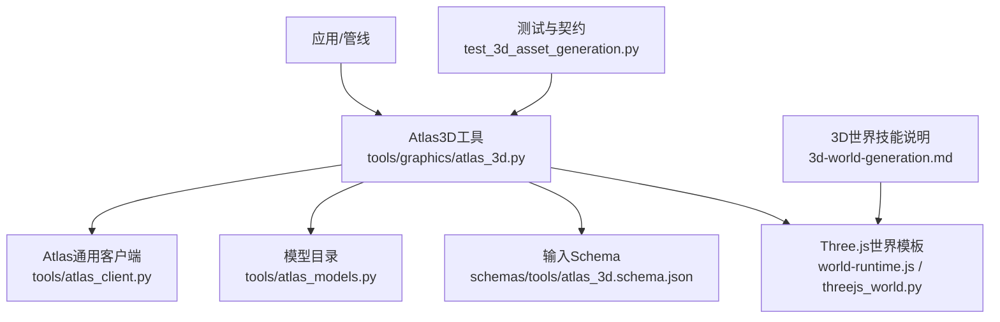
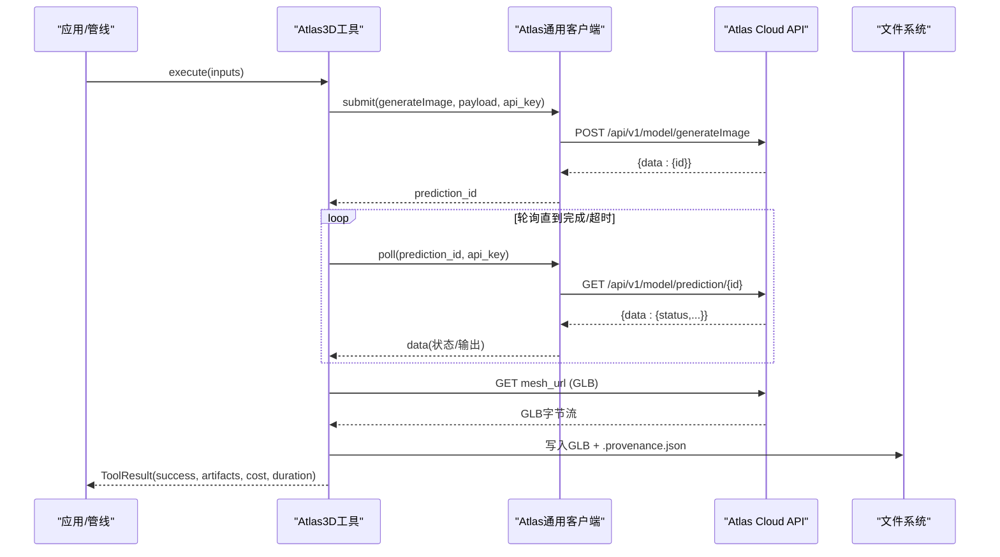
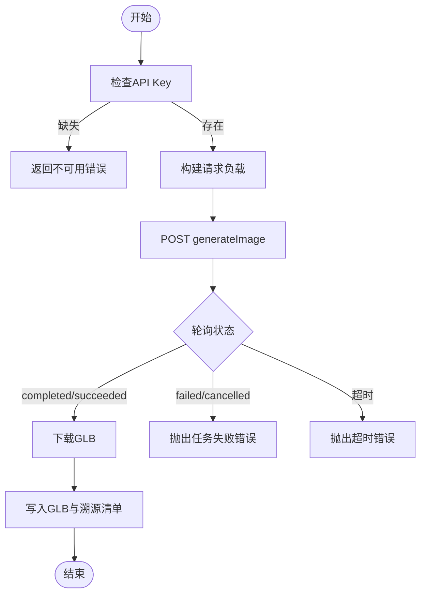
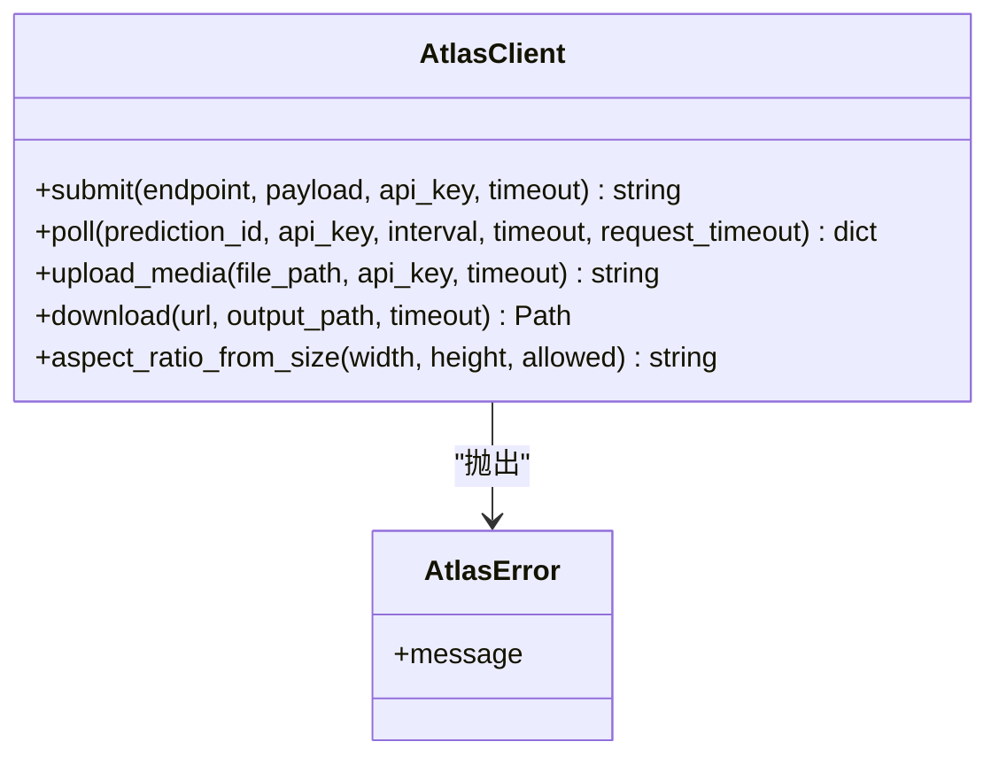
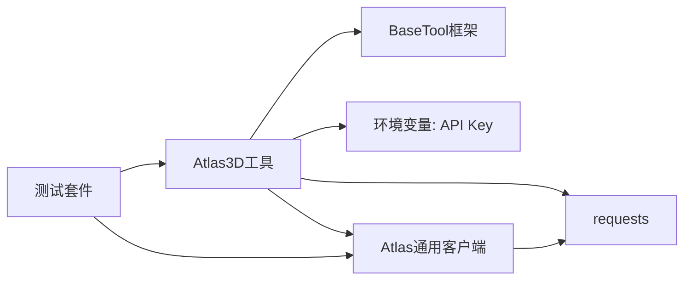

# Atlas 3D服务集成

<cite>
**本文引用的文件**
- [tools/atlas_client.py](file://tools/atlas_client.py)
- [tools/atlas_models.py](file://tools/atlas_models.py)
- [tools/graphics/atlas_3d.py](file://tools/graphics/atlas_3d.py)
- [schemas/tools/atlas_3d.schema.json](file://schemas/tools/atlas_3d.schema.json)
- [tests/tools/test_3d_asset_generation.py](file://tests/tools/test_3d_asset_generation.py)
- [skills/creative/3d-world-generation.md](file://skills/creative/3d-world-generation.md)
- [tools/graphics/templates/threejs_world/world-runtime.js](file://tools/graphics/templates/threejs_world/world-runtime.js)
- [tools/graphics/threejs_world.py](file://tools/graphics/threejs_world.py)
</cite>

## 目录
1. [简介](#简介)
2. [项目结构](#项目结构)
3. [核心组件](#核心组件)
4. [架构总览](#架构总览)
5. [详细组件分析](#详细组件分析)
6. [依赖关系分析](#依赖关系分析)
7. [性能与可靠性](#性能与可靠性)
8. [故障排查指南](#故障排查指南)
9. [结论](#结论)
10. [附录：SDK使用与示例](#附录sdk使用与示例)

## 简介
本技术文档面向需要在OpenMontage中集成Atlas Cloud 3D服务的开发者，系统阐述以下要点：
- Atlas Cloud API调用、认证机制与数据传输协议
- 3D资产获取（文本到网格）、场景配置与渲染参数接口
- 与后端Atlas客户端的通信模式与错误处理策略
- SDK初始化、请求构造、响应解析与异步任务轮询
- 从文本描述生成3D场景并处理的完整开发示例

## 项目结构
OpenMontage中与Atlas 3D相关的代码主要分布在以下位置：
- 通用Atlas HTTP客户端与模型目录：tools/atlas_client.py、tools/atlas_models.py
- 3D资产生成工具：tools/graphics/atlas_3d.py
- 输入Schema定义：schemas/tools/atlas_3d.schema.json
- 测试用例与契约验证：tests/tools/test_3d_asset_generation.py
- 3D世界生成技能说明：skills/creative/3d-world-generation.md
- Three.js运行时模板与Three.js世界构建：tools/graphics/templates/threejs_world/world-runtime.js、tools/graphics/threejs_world.py

图表来源
- [tools/graphics/atlas_3d.py:51-117](file://tools/graphics/atlas_3d.py#L51-L117)
- [tools/atlas_client.py:24-37](file://tools/atlas_client.py#L24-L37)
- [tools/atlas_models.py:57-221](file://tools/atlas_models.py#L57-L221)
- [schemas/tools/atlas_3d.schema.json:1-25](file://schemas/tools/atlas_3d.schema.json#L1-L25)
- [tools/graphics/templates/threejs_world/world-runtime.js:94-138](file://tools/graphics/templates/threejs_world/world-runtime.js#L94-L138)
- [tools/graphics/threejs_world.py:302-328](file://tools/graphics/threejs_world.py#L302-L328)

章节来源
- [tools/graphics/atlas_3d.py:1-228](file://tools/graphics/atlas_3d.py#L1-L228)
- [tools/atlas_client.py:1-265](file://tools/atlas_client.py#L1-L265)
- [tools/atlas_models.py:1-221](file://tools/atlas_models.py#L1-L221)
- [schemas/tools/atlas_3d.schema.json:1-25](file://schemas/tools/atlas_3d.schema.json#L1-L25)
- [tests/tools/test_3d_asset_generation.py:1-159](file://tests/tools/test_3d_asset_generation.py#L1-L159)
- [skills/creative/3d-world-generation.md:1-49](file://skills/creative/3d-world-generation.md#L1-L49)
- [tools/graphics/templates/threejs_world/world-runtime.js:1-204](file://tools/graphics/templates/threejs_world/world-runtime.js#L1-L204)
- [tools/graphics/threejs_world.py:302-328](file://tools/graphics/threejs_world.py#L302-L328)

## 核心组件
- Atlas3D工具：封装文本到3D网格的调用流程，包括提交任务、轮询状态、下载GLB、写入溯源清单。
- Atlas通用客户端：统一HTTP封装、鉴权头、错误解析、上传/下载、预测轮询等。
- 模型目录：维护各模型族、操作、分辨率、比例等元数据，便于上层选择与校验。
- Schema：约束Atlas 3D工具的输入参数，确保管道阶段可验证。
- Three.js世界模板：提供浏览器端加载GLB、设置光照/雾/阴影、材质与相机等渲染参数。

章节来源
- [tools/graphics/atlas_3d.py:51-117](file://tools/graphics/atlas_3d.py#L51-L117)
- [tools/atlas_client.py:45-184](file://tools/atlas_client.py#L45-L184)
- [tools/atlas_models.py:57-221](file://tools/atlas_models.py#L57-L221)
- [schemas/tools/atlas_3d.schema.json:1-25](file://schemas/tools/atlas_3d.schema.json#L1-L25)
- [tools/graphics/templates/threejs_world/world-runtime.js:94-138](file://tools/graphics/templates/threejs_world/world-runtime.js#L94-L138)

## 架构总览
Atlas 3D服务在OpenMontage中的整体交互如下：
- 上层管线或Agent通过Atlas3D工具发起“文本到3D”任务
- 工具将请求发送至Atlas Cloud的图像生成端点（历史命名），返回预测ID
- 客户端周期性轮询预测状态，直至成功或失败
- 成功后下载GLB网格文件，并生成溯源清单（包含模型、提示词、参数、预测ID）
- 生成的GLB可由Three.js世界模板加载，用于浏览器内渲染或进一步合成

图表来源
- [tools/graphics/atlas_3d.py:132-227](file://tools/graphics/atlas_3d.py#L132-L227)
- [tools/atlas_client.py:105-184](file://tools/atlas_client.py#L105-L184)

## 详细组件分析

### Atlas3D工具（文本到3D）
- 能力声明：支持text_to_3d、纹理、PBR、面数限制、种子、GLB输出等
- 输入Schema：prompt、negative_prompt、output_path、texture、pbr、texture_quality、geometry_quality、face_limit、model_seed、image_seed、texture_seed、auto_size、quad、poll_timeout_seconds
- 执行流程：
  - 读取API Key（环境变量）
  - 构造payload（模型、提示词、纹理/PBR、质量、自动尺寸、四边形拓扑等）
  - 提交至Atlas Cloud generateImage端点
  - 轮询prediction状态，支持completed/succeeded为成功，failed/cancelled为失败
  - 从files或outputs中定位GLB资源，下载并保存
  - 生成.provenance.json记录溯源信息
- 成本估算：根据纹理开关、纹理质量、几何质量、是否四边形拓扑计算USD成本
- 重试策略：对rate_limit和timeout进行有限重试

图表来源
- [tools/graphics/atlas_3d.py:132-227](file://tools/graphics/atlas_3d.py#L132-L227)
- [schemas/tools/atlas_3d.schema.json:1-25](file://schemas/tools/atlas_3d.schema.json#L1-L25)

章节来源
- [tools/graphics/atlas_3d.py:51-227](file://tools/graphics/atlas_3d.py#L51-L227)
- [schemas/tools/atlas_3d.schema.json:1-25](file://schemas/tools/atlas_3d.schema.json#L1-L25)
- [tests/tools/test_3d_asset_generation.py:109-129](file://tests/tools/test_3d_asset_generation.py#L109-L129)

### Atlas通用客户端（HTTP与轮询）
- 鉴权：Authorization: Bearer <API_KEY>
- 端点：
  - 提交：POST /api/v1/model/generateImage
  - 轮询：GET /api/v1/model/prediction/{id}
  - 上传媒体：POST /api/v1/model/uploadMedia
  - 下载：GET <url>
- 响应信封：{code: 200, data: {...}}，非200 code视为错误
- 轮询策略：
  - 支持连续传输错误计数，达到阈值后快速失败
  - 成功态：completed/succeeded；失败态：failed/canceled/cancelled
  - 未知状态视为进行中，避免误判
- 错误处理：
  - HTTP非2xx：包装为AtlasError并附带上下文
  - JSON解析失败：返回原始文本片段
  - 缺少prediction id：明确报错

图表来源
- [tools/atlas_client.py:45-184](file://tools/atlas_client.py#L45-L184)
- [tools/atlas_client.py:187-265](file://tools/atlas_client.py#L187-L265)

章节来源
- [tools/atlas_client.py:1-265](file://tools/atlas_client.py#L1-L265)

### 模型目录（视频/图像模型注册表）
- 维护多模型族（如Seedance、Gemini Omni、H3等）的操作、分辨率、比例、默认值、可选字段、媒体限制
- 提供operation_routes映射，便于上层按family+operation查找具体模型ID
- 虽然3D工具直接指定tripo-h3.1/text-to-3d，但目录为其他媒体工具提供统一抽象

章节来源
- [tools/atlas_models.py:1-221](file://tools/atlas_models.py#L1-L221)

### Three.js世界模板（渲染参数与加载）
- 渲染器：WebGLRenderer，开启抗锯齿、sRGB色彩空间、ACES色调映射、阴影
- 场景：背景色、雾密度、环境光、方向光（太阳）
- 地形与水面：语义地形、水体平面（透明/折射）
- 实例化：树木、岩石、水晶等实例统计与放置
- 相机：透视相机，视场角与近远裁剪面基于世界尺寸
- 这些参数可通过world-spec与运行时变量控制，适配不同质量等级与渲染模式

章节来源
- [tools/graphics/templates/threejs_world/world-runtime.js:94-138](file://tools/graphics/templates/threejs_world/world-runtime.js#L94-L138)
- [tools/graphics/threejs_world.py:302-328](file://tools/graphics/threejs_world.py#L302-L328)

## 依赖关系分析
- Atlas3D工具依赖：
  - 环境变量：ATLASCLOUD_API_KEY（也接受ATLAS_CLOUD_API_KEY、ATLAS_API_KEY）
  - requests库（延迟导入以保持注册发现速度）
  - BaseTool框架（工具生命周期、重试、资源画像、结果封装）
- 通用客户端依赖：
  - requests（延迟导入）
  - 统一的错误类型AtlasError
- 测试依赖：
  - 模拟requests响应，验证成功路径与错误路径
  - 验证溯源清单内容与模型标识

图表来源
- [tools/graphics/atlas_3d.py:20-31](file://tools/graphics/atlas_3d.py#L20-L31)
- [tools/atlas_client.py:13-14](file://tools/atlas_client.py#L13-L14)
- [tests/tools/test_3d_asset_generation.py:1-159](file://tests/tools/test_3d_asset_generation.py#L1-159)

章节来源
- [tools/graphics/atlas_3d.py:20-31](file://tools/graphics/atlas_3d.py#L20-L31)
- [tools/atlas_client.py:13-14](file://tools/atlas_client.py#L13-L14)
- [tests/tools/test_3d_asset_generation.py:1-159](file://tests/tools/test_3d_asset_generation.py#L1-159)

## 性能与可靠性
- 网络与超时：
  - 提交请求默认超时45秒，轮询请求30秒，下载默认300秒
  - 轮询间隔默认3秒，最大等待时间可配置（默认900秒）
- 错误恢复：
  - 连续传输错误超过阈值立即失败，避免无限重试
  - 对rate_limit与timeout进行有限次重试
- 资源与成本：
  - 成本估算考虑纹理质量、几何质量、四边形拓扑等选项
  - 建议在高保真模式下谨慎使用detailed纹理与几何质量
- 前端渲染：
  - Three.js模板支持不同渲染模式（cinematic/wireframe/semantic）
  - 阴影、雾、色调映射等参数可按质量等级调整

章节来源
- [tools/graphics/atlas_3d.py:102-130](file://tools/graphics/atlas_3d.py#L102-L130)
- [tools/atlas_client.py:127-184](file://tools/atlas_client.py#L127-L184)
- [tools/graphics/templates/threejs_world/world-runtime.js:94-138](file://tools/graphics/templates/threejs_world/world-runtime.js#L94-L138)

## 故障排查指南
- 常见错误与定位：
  - API Key未设置：工具状态不可用，返回错误提示安装说明
  - 非JSON响应：解析失败时附带原始文本片段
  - HTTP非2xx：包装为错误并包含状态码与响应体片段
  - 预测无outputs：即使状态为成功，也需有输出列表
  - 缺少prediction id：提交响应必须包含data.id
- 调试建议：
  - 启用日志记录请求URL与响应体（注意脱敏）
  - 检查网络连通性与速率限制
  - 确认输入参数符合Schema（如面数范围、提示词长度）
  - 使用测试用例中的模拟响应验证本地流程

章节来源
- [tools/atlas_client.py:69-103](file://tools/atlas_client.py#L69-L103)
- [tools/atlas_client.py:105-184](file://tools/atlas_client.py#L105-L184)
- [tests/tools/test_3d_asset_generation.py:43-54](file://tests/tools/test_3d_asset_generation.py#L43-L54)
- [tests/tools/test_3d_asset_generation.py:272-306](file://tests/tools/test_3d_asset_generation.py#L272-L306)

## 结论
OpenMontage对Atlas Cloud 3D服务的集成提供了稳定、可扩展的工具链：
- 统一的HTTP客户端与错误处理，简化了跨模型的调用差异
- 清晰的输入Schema与成本估算，便于管道治理与审计
- 完善的测试覆盖，保障关键路径与异常路径的正确性
- 与Three.js世界模板无缝衔接，支持从文本到可交互3D场景的快速交付

## 附录：SDK使用与示例

### 初始化配置
- 设置环境变量：ATLASCLOUD_API_KEY（或ATLAS_CLOUD_API_KEY、ATLAS_API_KEY）
- 工具可用性检查：get_status()返回可用或不可用
- 资源画像：CPU、内存、磁盘、网络需求已在工具中声明

章节来源
- [tools/graphics/atlas_3d.py:38-65](file://tools/graphics/atlas_3d.py#L38-L65)
- [tools/graphics/atlas_3d.py:119-119](file://tools/graphics/atlas_3d.py#L119-L119)

### 请求构造
- 必填字段：prompt、output_path
- 可选字段：negative_prompt、texture、pbr、texture_quality、geometry_quality、face_limit、model_seed、image_seed、texture_seed、auto_size、quad、poll_timeout_seconds
- 参数校验：遵循Schema约束（如面数范围、提示词长度）

章节来源
- [schemas/tools/atlas_3d.schema.json:1-25](file://schemas/tools/atlas_3d.schema.json#L1-L25)
- [tools/graphics/atlas_3d.py:85-104](file://tools/graphics/atlas_3d.py#L85-L104)

### 响应解析
- 成功：ToolResult包含provider、model、output、prediction_id、artifacts、cost_usd、duration_seconds、seed
- 失败：ToolResult.success=False，error包含错误详情
- 溯源清单：.provenance.json记录模型、提示词、参数、预测ID与源URL

章节来源
- [tools/graphics/atlas_3d.py:219-227](file://tools/graphics/atlas_3d.py#L219-L227)
- [tests/tools/test_3d_asset_generation.py:109-129](file://tests/tools/test_3d_asset_generation.py#L109-L129)

### 异步任务处理
- 提交后立即获得prediction_id
- 轮询直到completed/succeeded或失败/取消
- 超时保护：超过poll_timeout_seconds抛出超时错误
- 连续传输错误保护：达到阈值快速失败

章节来源
- [tools/graphics/atlas_3d.py:165-181](file://tools/graphics/atlas_3d.py#L165-L181)
- [tools/atlas_client.py:127-184](file://tools/atlas_client.py#L127-L184)

### 实际开发示例（从文本到3D场景）
- 步骤概览：
  - 准备提示词与输出路径
  - 调用Atlas3D.execute(inputs)
  - 处理ToolResult，提取GLB与溯源清单
  - 使用Three.js世界模板加载GLB，配置光照、雾、阴影等渲染参数
  - 在浏览器中预览或导出序列帧用于后续合成
- 参考技能：3D世界生成技能描述了从提案到脚本、场景规划、资产采集、审查、编辑、合成的完整流程

章节来源
- [skills/creative/3d-world-generation.md:1-49](file://skills/creative/3d-world-generation.md#L1-L49)
- [tools/graphics/templates/threejs_world/world-runtime.js:94-138](file://tools/graphics/templates/threejs_world/world-runtime.js#L94-L138)