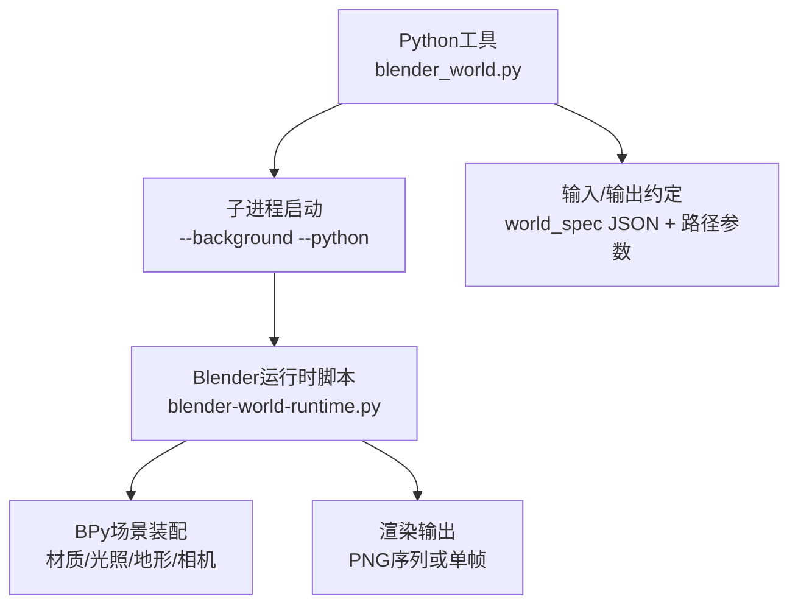
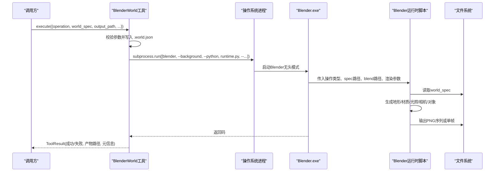
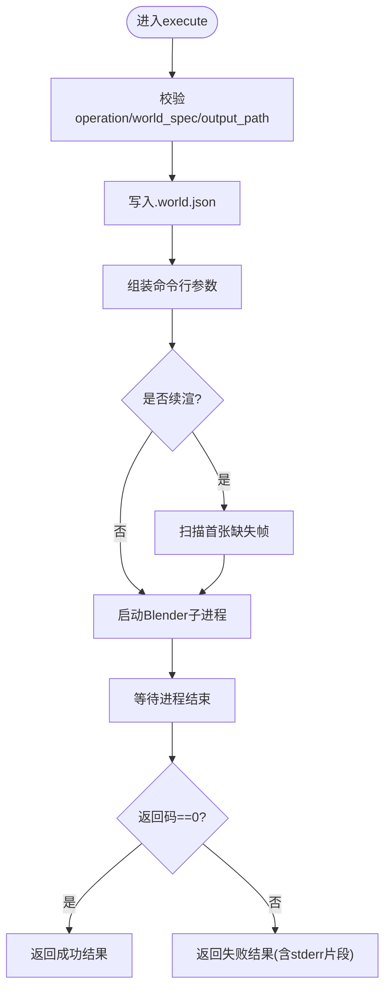
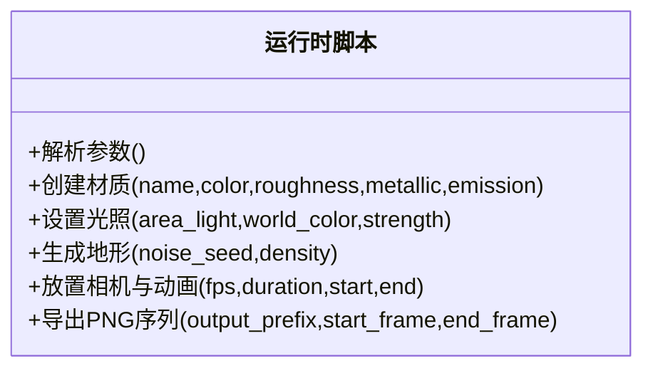
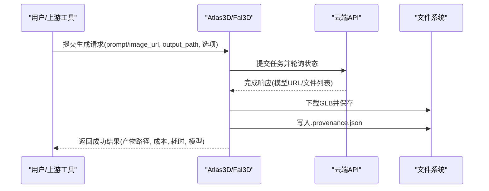
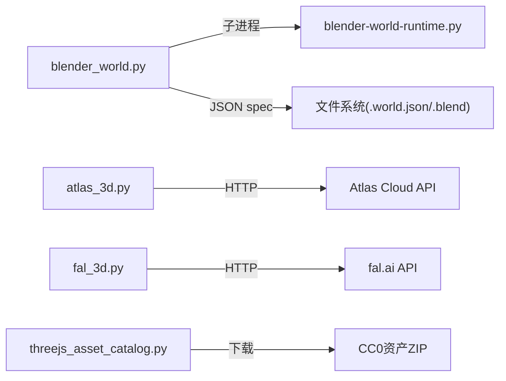

# Blender工作流

<cite>
**本文引用的文件**
- [tools/graphics/blender_world.py](file://tools/graphics/blender_world.py)
- [tools/graphics/templates/blender-world-runtime.py](file://tools/graphics/templates/blender-world-runtime.py)
- [schemas/tools/blender_world.schema.json](file://schemas/tools/blender_world.schema.json)
- [tools/graphics/atlas_3d.py](file://tools/graphics/atlas_3d.py)
- [tools/graphics/fal_3d.py](file://tools/graphics/fal_3d.py)
- [tools/graphics/threejs_asset_catalog.py](file://tools/graphics/threejs_asset_catalog.py)
- [tests/tools/test_3d_asset_generation.py](file://tests/tools/test_3d_asset_generation.py)
- [pipeline_defs/animation.yaml](file://pipeline_defs/animation.yaml)
</cite>

## 目录
1. [简介](#简介)
2. [项目结构](#项目结构)
3. [核心组件](#核心组件)
4. [架构总览](#架构总览)
5. [详细组件分析](#详细组件分析)
6. [依赖关系分析](#依赖关系分析)
7. [性能与渲染优化](#性能与渲染优化)
8. [故障排查指南](#故障排查指南)
9. [结论](#结论)
10. [附录：开发示例与最佳实践](#附录：开发示例与最佳实践)

## 简介
本技术文档聚焦于OpenMontage中的Blender工作流，系统性说明如何通过Python后端调用Blender进行确定性世界构建、材质与光照配置、相机飞行与序列帧渲染，以及与Three.js生态的资产获取和集成。文档覆盖以下关键点：
- Blender Python API集成方式与脚本执行环境
- 数据交换格式（world_spec JSON）与文件管理机制
- 3D建模流程、材质设置与光照配置的自动化方法
- 与Python后端的通信协议（命令行参数与JSON规范）
- 环境搭建、脚本编写与调试技巧
- 批量处理3D资产与优化渲染性能的实践

## 项目结构
OpenMontage将Blender相关能力拆分为“工具层”和“运行时脚本”两层：
- 工具层：以BaseTool为基类封装对外接口，负责参数校验、子进程调用、结果包装与成本估算等。
- 运行时脚本：独立的Blender侧Python脚本，通过bpy在后台模式下执行场景装配、材质与光照设置、相机动画与图像序列输出。

**图示来源**
- [tools/graphics/blender_world.py:149-216](file://tools/graphics/blender_world.py#L149-L216)
- [tools/graphics/templates/blender-world-runtime.py:21-35](file://tools/graphics/templates/blender-world-runtime.py#L21-L35)

**章节来源**
- [tools/graphics/blender_world.py:1-216](file://tools/graphics/blender_world.py#L1-L216)
- [tools/graphics/templates/blender-world-runtime.py:1-35](file://tools/graphics/templates/blender-world-runtime.py#L1-L35)

## 核心组件
- BlenderWorld工具：提供build、render_still、render_animation等操作；支持断点续渲、帧范围控制、分辨率与采样数配置。
- Blender运行时脚本：解析world_spec，生成地形、材质、光照、相机与导出目标；保证确定性（随机种子）。
- 3D资产生成工具：Atlas3D与Fal3D用于文本/图像到GLB/PBR网格生成，配合ThreeJS资产目录完成本地化资源管理。
- 管道集成：在动画管线中声明可用工具，确保从资产到合成的端到端可编排性。

**章节来源**
- [tools/graphics/blender_world.py:53-86](file://tools/graphics/blender_world.py#L53-L86)
- [tools/graphics/atlas_3d.py:51-117](file://tools/graphics/atlas_3d.py#L51-L117)
- [tools/graphics/fal_3d.py:52-103](file://tools/graphics/fal_3d.py#L52-L103)
- [tools/graphics/threejs_asset_catalog.py:71-110](file://tools/graphics/threejs_asset_catalog.py#L71-L110)
- [pipeline_defs/animation.yaml:169-205](file://pipeline_defs/animation.yaml#L169-L205)

## 架构总览
下图展示了从Python工具到Blender运行时的完整调用链，以及数据流转与产物落盘位置。

**图示来源**
- [tools/graphics/blender_world.py:149-216](file://tools/graphics/blender_world.py#L149-L216)
- [tools/graphics/templates/blender-world-runtime.py:21-35](file://tools/graphics/templates/blender-world-runtime.py#L21-L35)

## 详细组件分析

### BlenderWorld工具（Python侧）
- 功能职责
  - 接收world_spec与渲染参数，持久化world_spec为JSON。
  - 根据operation选择构建或渲染，计算帧范围，支持resume续渲。
  - 通过subprocess调用Blender无头模式，传递参数至运行时脚本。
  - 统一返回ToolResult，包含产物路径、模型标识、耗时与错误信息。
- 关键行为
  - 自动定位Blender可执行文件（环境变量优先，其次便携包，最后系统PATH）。
  - 检测缺失帧实现断点续渲。
  - 超时保护与错误截断输出便于诊断。

**图示来源**
- [tools/graphics/blender_world.py:149-216](file://tools/graphics/blender_world.py#L149-L216)
- [tools/graphics/blender_world.py:33-50](file://tools/graphics/blender_world.py#L33-L50)

**章节来源**
- [tools/graphics/blender_world.py:33-50](file://tools/graphics/blender_world.py#L33-L50)
- [tools/graphics/blender_world.py:149-216](file://tools/graphics/blender_world.py#L149-L216)

### Blender运行时脚本（Blender侧）
- 功能职责
  - 解析命令行参数（操作类型、spec路径、blend路径、输出路径、分辨率、采样、FPS、时长、帧范围）。
  - 基于world_spec创建材质、光照、地形、相机与对象实例，应用PBR属性。
  - 设置背景世界颜色与强度，输出PNG序列或单帧。
- 确定性保障
  - 使用随机种子初始化噪声函数，确保地形与散布可复现。
  - 所有创意决策由world_spec驱动，脚本仅做执行。

**图示来源**
- [tools/graphics/templates/blender-world-runtime.py:21-35](file://tools/graphics/templates/blender-world-runtime.py#L21-L35)
- [tools/graphics/templates/blender-world-runtime.py:38-49](file://tools/graphics/templates/blender-world-runtime.py#L38-L49)
- [tools/graphics/templates/blender-world-runtime.py:332-346](file://tools/graphics/templates/blender-world-runtime.py#L332-L346)

**章节来源**
- [tools/graphics/templates/blender-world-runtime.py:21-35](file://tools/graphics/templates/blender-world-runtime.py#L21-L35)
- [tools/graphics/templates/blender-world-runtime.py:38-49](file://tools/graphics/templates/blender-world-runtime.py#L38-L49)
- [tools/graphics/templates/blender-world-runtime.py:332-346](file://tools/graphics/templates/blender-world-runtime.py#L332-L346)

### 3D资产生成工具（Atlas3D / Fal3D）
- Atlas3D
  - 文本到3D网格生成，支持纹理与PBR质量调节、面数限制、多粒度的种子控制。
  - 异步轮询任务状态，下载GLB并写入.provenance.json记录溯源。
- Fal3D
  - 支持文本到3D、图像到3D、多对象重建；可导出带纹理的GLB。
  - 同样维护.provenance.json，记录请求ID、模型与输出清单。

**图示来源**
- [tools/graphics/atlas_3d.py:132-227](file://tools/graphics/atlas_3d.py#L132-L227)
- [tools/graphics/fal_3d.py:113-213](file://tools/graphics/fal_3d.py#L113-L213)

**章节来源**
- [tools/graphics/atlas_3d.py:51-117](file://tools/graphics/atlas_3d.py#L51-L117)
- [tools/graphics/fal_3d.py:52-103](file://tools/graphics/fal_3d.py#L52-L103)
- [tools/graphics/atlas_3d.py:132-227](file://tools/graphics/atlas_3d.py#L132-L227)
- [tools/graphics/fal_3d.py:113-213](file://tools/graphics/fal_3d.py#L113-L213)

### ThreeJS资产目录（本地化资源管理）
- 提供CC0授权资产的清单与安装能力，下载ZIP并解压，生成catalog-manifest.json记录模型与纹理清单、归档哈希。
- 适合Three.js世界构建前的合规资源准备与审计。

**章节来源**
- [tools/graphics/threejs_asset_catalog.py:29-54](file://tools/graphics/threejs_asset_catalog.py#L29-L54)
- [tools/graphics/threejs_asset_catalog.py:112-172](file://tools/graphics/threejs_asset_catalog.py#L112-L172)

### 管道集成与可用性
- 在动画管线中，BlenderWorld被声明为可用工具之一，参与资产阶段的生产与合成阶段的渲染。
- 测试用例验证了工具注册表对3D资产生成与世界渲染能力的发现。

**章节来源**
- [pipeline_defs/animation.yaml:169-205](file://pipeline_defs/animation.yaml#L169-L205)
- [tests/tools/test_3d_asset_generation.py:32-40](file://tests/tools/test_3d_asset_generation.py#L32-L40)

## 依赖关系分析
- 外部依赖
  - Blender可执行文件：通过环境变量BLENDER_PATH或便携包路径定位。
  - 网络访问：Atlas3D/Fal3D需要联网调用云端API。
  - 磁盘空间：GLB与PNG序列占用较大，需预留足够空间。
- 内部耦合
  - blender_world.py与blender-world-runtime.py通过JSON spec与命令行参数解耦。
  - 工具层不直接操作bpy，避免在Python进程中加载Blender带来的不稳定因素。

**图示来源**
- [tools/graphics/blender_world.py:149-216](file://tools/graphics/blender_world.py#L149-L216)
- [tools/graphics/atlas_3d.py:132-227](file://tools/graphics/atlas_3d.py#L132-L227)
- [tools/graphics/fal_3d.py:113-213](file://tools/graphics/fal_3d.py#L113-L213)
- [tools/graphics/threejs_asset_catalog.py:112-172](file://tools/graphics/threejs_asset_catalog.py#L112-L172)

**章节来源**
- [tools/graphics/blender_world.py:33-50](file://tools/graphics/blender_world.py#L33-L50)
- [tools/graphics/atlas_3d.py:119-120](file://tools/graphics/atlas_3d.py#L119-L120)
- [tools/graphics/fal_3d.py:105-106](file://tools/graphics/fal_3d.py#L105-L106)

## 性能与渲染优化
- 渲染参数调优
  - 降低samples可减少渲染时间但可能引入噪点；建议先以低采样快速预览，再提升采样出片。
  - 合理设置width/height与fps/duration，避免不必要的超高分辨率与超长动画。
- 断点续渲
  - 使用resume与start_frame/end_frame组合，跳过已生成的帧，减少重复计算。
- 资产复用
  - 通过ThreeJS资产目录与本地GLB库减少重复生成；结合linked_instances在Blender中高效散布。
- 批处理策略
  - 并行多个Blender进程（不同output_path），注意GPU显存与CPU负载；必要时串行队列。
- 材质与光照
  - 使用Principled BSDF基础材质，控制roughness/metallic/emission平衡；区域光面积与能量影响渲染速度与质量。

[本节为通用指导，无需特定文件引用]

## 故障排查指南
- 常见错误
  - Blender未找到：检查BLENDER_PATH或便携包路径是否正确。
  - 渲染失败：查看子进程stderr末尾片段，定位Blender报错原因。
  - 缺少帧导致续渲无效：确认output_path与帧命名规则一致。
  - 云端API不可用：检查ATLASCLOUD_API_KEY或FAL_KEY环境变量。
- 诊断步骤
  - 使用最小world_spec复现问题。
  - 单独运行Blender命令，观察控制台输出。
  - 检查.world.json内容是否符合schema约束。

**章节来源**
- [tools/graphics/blender_world.py:33-50](file://tools/graphics/blender_world.py#L33-L50)
- [tools/graphics/blender_world.py:207-216](file://tools/graphics/blender_world.py#L207-L216)
- [tools/graphics/atlas_3d.py:119-120](file://tools/graphics/atlas_3d.py#L119-L120)
- [tools/graphics/fal_3d.py:105-106](file://tools/graphics/fal_3d.py#L105-L106)

## 结论
OpenMontage的Blender工作流通过清晰的工具-脚本分层、严格的JSON契约与子进程隔离，实现了可编排、可复现、可扩展的3D世界构建与渲染能力。结合Atlas3D/Fal3D与ThreeJS资产目录，可在生产环境中批量生成与集成高质量3D资产，并通过合理的参数与批处理策略优化渲染性能。

[本节为总结性内容，无需特定文件引用]

## 附录：开发示例与最佳实践

### 环境搭建
- 安装Blender 4.5 LTS，或通过BLENDER_PATH指定可执行文件；也可放置便携包到指定路径。
- 配置云端API密钥：
  - Atlas3D：设置ATLASCLOUD_API_KEY（或兼容键名）。
  - Fal3D：设置FAL_KEY（或FAL_AI_API_KEY）。
- 确保磁盘空间充足，尤其是PNG序列与GLB输出。

**章节来源**
- [tools/graphics/blender_world.py:64-67](file://tools/graphics/blender_world.py#L64-L67)
- [tools/graphics/atlas_3d.py:61-65](file://tools/graphics/atlas_3d.py#L61-L65)
- [tools/graphics/fal_3d.py:62-64](file://tools/graphics/fal_3d.py#L62-L64)

### 脚本编写要点
- 定义world_spec时遵循schema约束，明确operation、world_spec、output_path、blend_path、分辨率、采样、FPS、时长与帧范围。
- 材质与光照通过world_spec驱动，避免在运行时脚本中硬编码创意参数。
- 使用seed_set固定随机源，确保地形与散布的可复现性。

**章节来源**
- [schemas/tools/blender_world.schema.json:1-24](file://schemas/tools/blender_world.schema.json#L1-L24)
- [tools/graphics/templates/blender-world-runtime.py:21-35](file://tools/graphics/templates/blender-world-runtime.py#L21-L35)

### 调试技巧
- 先在本地手动运行Blender命令，观察控制台输出与错误堆栈。
- 逐步缩小world_spec范围，定位问题字段。
- 使用first_missing_frame辅助判断续渲起点。

**章节来源**
- [tools/graphics/blender_world.py:43-50](file://tools/graphics/blender_world.py#L43-L50)
- [tools/graphics/blender_world.py:207-216](file://tools/graphics/blender_world.py#L207-L216)

### 批量处理与性能优化示例
- 批量生成GLB资产
  - 使用Atlas3D/Fal3D并发提交任务，按output_path区分产物，记录.provenance.json。
  - 对大场景使用ThreeJS资产目录预装模型，减少重复生成。
- 批量渲染动画
  - 拆分长动画为多段，分别设置start_frame/end_frame，利用resume续渲。
  - 调整samples与分辨率，先低质量快速迭代，再高质量出片。

**章节来源**
- [tools/graphics/atlas_3d.py:132-227](file://tools/graphics/atlas_3d.py#L132-L227)
- [tools/graphics/fal_3d.py:113-213](file://tools/graphics/fal_3d.py#L113-L213)
- [tools/graphics/blender_world.py:175-205](file://tools/graphics/blender_world.py#L175-L205)