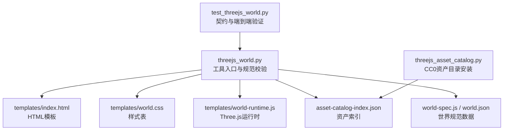
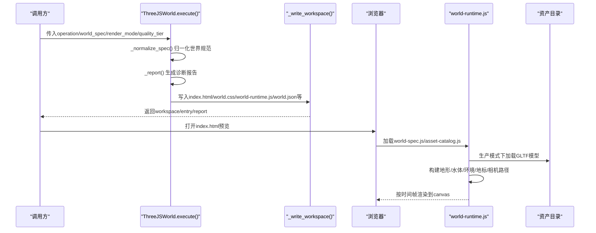
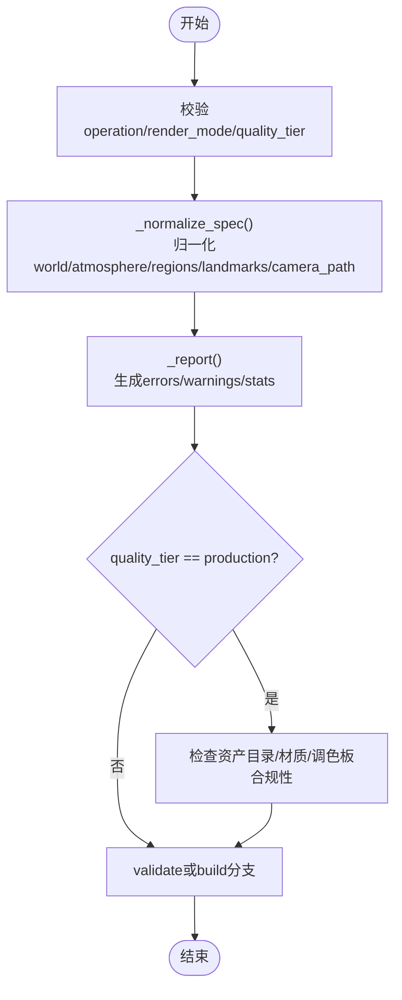
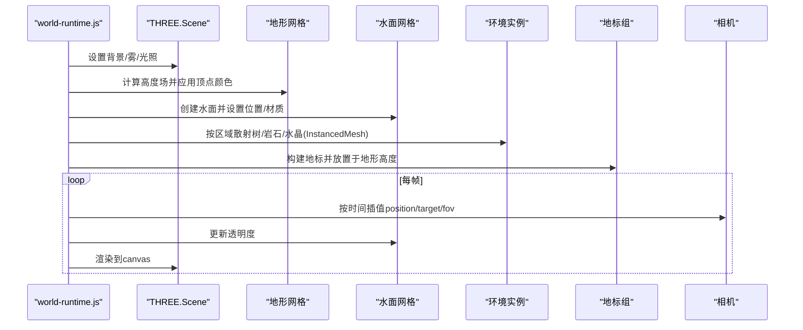
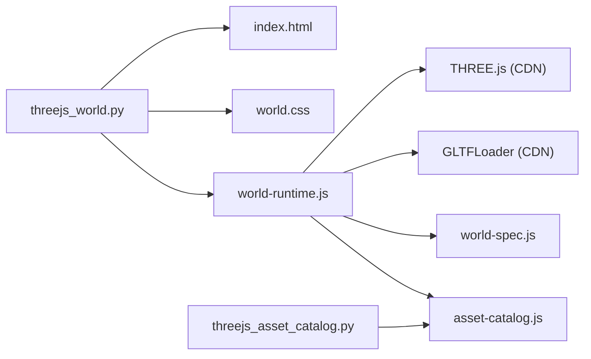

# Three.js集成架构

<cite>
**本文引用的文件**
- [tools/graphics/threejs_world.py](file://tools/graphics/threejs_world.py)
- [schemas/tools/threejs_world.schema.json](file://schemas/tools/threejs_world.schema.json)
- [tests/tools/test_threejs_world.py](file://tests/tools/test_threejs_world.py)
- [tools/graphics/templates/threejs_world/index.html](file://tools/graphics/templates/threejs_world/index.html)
- [tools/graphics/templates/threejs_world/world.css](file://tools/graphics/templates/threejs_world/world.css)
- [tools/graphics/templates/threejs_world/world-runtime.js](file://tools/graphics/templates/threejs_world/world-runtime.js)
- [tools/graphics/threejs_asset_catalog.py](file://tools/graphics/threejs_asset_catalog.py)
</cite>

## 目录
1. [简介](#简介)
2. [项目结构](#项目结构)
3. [核心组件](#核心组件)
4. [架构总览](#架构总览)
5. [详细组件分析](#详细组件分析)
6. [依赖关系分析](#依赖关系分析)
7. [性能考量](#性能考量)
8. [故障排查指南](#故障排查指南)
9. [结论](#结论)
10. [附录：API与示例](#附录api与示例)

## 简介
本技术文档围绕OpenMontage中的Three.js集成架构，重点解析ThreeJSWorld工具如何基于结构化世界规范生成可编辑的Three.js工作空间，并驱动场景构建、程序化地形、地标放置与渲染管线。同时说明HTML模板系统、JavaScript运行时与CSS样式文件的组织方式，给出完整的API接口说明（输入参数、输出格式、错误处理），并提供实际开发示例，展示如何创建可编辑的3D工作空间并导出渲染结果。

## 项目结构
Three.js集成相关代码主要分布在以下位置：
- 工具实现：tools/graphics/threejs_world.py
- 资产目录管理：tools/graphics/threejs_asset_catalog.py
- 模板资源：tools/graphics/templates/threejs_world/{index.html, world.css, world-runtime.js}
- 输入Schema：schemas/tools/threejs_world.schema.json
- 测试用例：tests/tools/test_threejs_world.py

图表来源
- [tools/graphics/threejs_world.py:628-733](file://tools/graphics/threejs_world.py#L628-L733)
- [tools/graphics/templates/threejs_world/index.html:1-67](file://tools/graphics/templates/threejs_world/index.html#L1-L67)
- [tools/graphics/templates/threejs_world/world.css:1-80](file://tools/graphics/templates/threejs_world/world.css#L1-L80)
- [tools/graphics/templates/threejs_world/world-runtime.js:1-479](file://tools/graphics/templates/threejs_world/world-runtime.js#L1-L479)
- [tools/graphics/threejs_asset_catalog.py:112-172](file://tools/graphics/threejs_asset_catalog.py#L112-L172)
- [tests/tools/test_threejs_world.py:103-138](file://tests/tools/test_threejs_world.py#L103-L138)

章节来源
- [tools/graphics/threejs_world.py:1-158](file://tools/graphics/threejs_world.py#L1-L158)
- [tools/graphics/templates/threejs_world/index.html:1-67](file://tools/graphics/templates/threejs_world/index.html#L1-L67)
- [tools/graphics/templates/threejs_world/world.css:1-80](file://tools/graphics/templates/threejs_world/world.css#L1-L80)
- [tools/graphics/templates/threejs_world/world-runtime.js:1-479](file://tools/graphics/templates/threejs_world/world-runtime.js#L1-L479)
- [tools/graphics/threejs_asset_catalog.py:1-172](file://tools/graphics/threejs_asset_catalog.py#L1-L172)
- [tests/tools/test_threejs_world.py:1-244](file://tests/tools/test_threejs_world.py#L1-L244)

## 核心组件
- ThreeJSWorld工具：负责世界规范归一化、质量门控、诊断报告生成，以及将模板与数据写入可编辑工作空间。
- HTML模板系统：通过占位符注入标题、时长、分辨率、渲染模式与质量等级，提供HUD与标题卡片等UI元素。
- JavaScript运行时：基于Three.js构建场景、地形、水体、环境实例、地标与相机路径动画；支持生产级GLTF/PBR资产加载与散布。
- CSS样式：定义暗色主题、视口适配、HUD布局、晕影与胶片颗粒效果，并根据渲染模式切换显示。
- 资产目录工具：下载、解压并生成CC0许可的GLTF/PBR资产清单，供生产质量级别使用。

章节来源
- [tools/graphics/threejs_world.py:75-158](file://tools/graphics/threejs_world.py#L75-L158)
- [tools/graphics/templates/threejs_world/index.html:1-67](file://tools/graphics/templates/threejs_world/index.html#L1-L67)
- [tools/graphics/templates/threejs_world/world.css:1-80](file://tools/graphics/templates/threejs_world/world.css#L1-L80)
- [tools/graphics/templates/threejs_world/world-runtime.js:94-197](file://tools/graphics/templates/threejs_world/world-runtime.js#L94-L197)
- [tools/graphics/threejs_asset_catalog.py:71-172](file://tools/graphics/threejs_asset_catalog.py#L71-L172)

## 架构总览
整体流程从“世界规范”出发，经过Python侧的校验与归一化，再写出HTML/CSS/JS模板与数据文件；浏览器端由Three.js运行时读取世界规范，构建场景、地形、环境与地标，并按相机路径进行渲染。生产模式下，还会从本地资产目录加载GLTF模型并进行实例化散布。

图表来源
- [tools/graphics/threejs_world.py:159-238](file://tools/graphics/threejs_world.py#L159-L238)
- [tools/graphics/threejs_world.py:628-733](file://tools/graphics/threejs_world.py#L628-L733)
- [tools/graphics/templates/threejs_world/world-runtime.js:244-287](file://tools/graphics/templates/threejs_world/world-runtime.js#L244-L287)
- [tools/graphics/templates/threejs_world/world-runtime.js:444-479](file://tools/graphics/templates/threejs_world/world-runtime.js#L444-L479)

## 详细组件分析

### 世界规范验证与归一化
- 输入参数校验：操作类型、渲染模式、质量等级、分辨率范围、时长范围等。
- 世界参数归一化：尺寸、分辨率、高程缩放、水位、大气颜色、雾密度、太阳光强度与位置等。
- 语义区域规划：最多12个区域，包含中心、半径、地形形态、散射配置、坡度限制、颜色与强调色。
- 地标放置：最多80个地标，类型限定为单柱、拱门、塔楼、废墟、水晶、聚落、环等，绑定到区域ID。
- 相机路径：至少两个关键帧，时间严格递增，首尾时间与duration对齐。
- 诊断报告：统计区域数量、地标数量、三角面数、环境实例数、语义覆盖采样、最小相机离地间隙等。

图表来源
- [tools/graphics/threejs_world.py:159-238](file://tools/graphics/threejs_world.py#L159-L238)
- [tools/graphics/threejs_world.py:289-453](file://tools/graphics/threejs_world.py#L289-L453)
- [tools/graphics/threejs_world.py:456-552](file://tools/graphics/threejs_world.py#L456-L552)

章节来源
- [tools/graphics/threejs_world.py:116-158](file://tools/graphics/threejs_world.py#L116-L158)
- [tools/graphics/threejs_world.py:289-453](file://tools/graphics/threejs_world.py#L289-L453)
- [tools/graphics/threejs_world.py:456-552](file://tools/graphics/threejs_world.py#L456-L552)

### 场景构建流程与渲染管线
- 场景初始化：WebGLRenderer、Scene、Camera、光照（半球光+方向光）、阴影与色调映射。
- 地形生成：平面几何按高度函数变形，顶点着色混合区域颜色；支持线框模式。
- 水体：非线框模式下添加透明水面，随时间微调透明度。
- 环境实例：树、岩石、水晶通过InstancedMesh散布，考虑坡度限制与区域权重。
- 地标构建：根据类型组合基础几何体，放置在对应地形高度上。
- 相机路径插值：在关键帧之间平滑插值位置、目标与FOV，驱动每帧渲染。
- 生产模式资产加载：GLTFLoader异步加载模型，克隆并随机尺度旋转后散布到区域。

图表来源
- [tools/graphics/templates/threejs_world/world-runtime.js:94-197](file://tools/graphics/templates/threejs_world/world-runtime.js#L94-L197)
- [tools/graphics/templates/threejs_world/world-runtime.js:206-242](file://tools/graphics/templates/threejs_world/world-runtime.js#L206-L242)
- [tools/graphics/templates/threejs_world/world-runtime.js:289-403](file://tools/graphics/templates/threejs_world/world-runtime.js#L289-L403)
- [tools/graphics/templates/threejs_world/world-runtime.js:414-460](file://tools/graphics/templates/threejs_world/world-runtime.js#L414-L460)

章节来源
- [tools/graphics/templates/threejs_world/world-runtime.js:94-197](file://tools/graphics/templates/threejs_world/world-runtime.js#L94-L197)
- [tools/graphics/templates/threejs_world/world-runtime.js:206-403](file://tools/graphics/templates/threejs_world/world-runtime.js#L206-L403)
- [tools/graphics/templates/threejs_world/world-runtime.js:414-479](file://tools/graphics/templates/threejs_world/world-runtime.js#L414-L479)

### HTML模板系统、JavaScript运行时与CSS样式
- HTML模板：通过占位符注入标题、时长、宽高、渲染模式与质量等级；包含舞台、画布、晕影、颗粒、标题卡与HUD。
- CSS样式：暗色主题、响应式布局、HUD边框与渐变、标题卡排版、渲染模式下的视觉开关。
- JavaScript运行时：导入Three.js与GLTFLoader，读取世界规范与资产目录，构建场景与对象，监听seek事件以同步播放进度。

章节来源
- [tools/graphics/templates/threejs_world/index.html:1-67](file://tools/graphics/templates/threejs_world/index.html#L1-L67)
- [tools/graphics/templates/threejs_world/world.css:1-80](file://tools/graphics/templates/threejs_world/world.css#L1-L80)
- [tools/graphics/templates/threejs_world/world-runtime.js:1-16](file://tools/graphics/templates/threejs_world/world-runtime.js#L1-L16)

### 语义区域规划、程序化地形生成与地标放置
- 语义区域：每个区域有中心、半径、地形形态、散射配置、颜色与强调色；区域权重用于混合地形颜色与选择散布点。
- 程序化地形：高度函数结合噪声与地形形态算子，按区域权重叠加，最终乘以高程缩放得到世界高度。
- 地标放置：根据类型组合几何体，放置在地形高度之上，支持旋转与缩放；块出模式下直接构建，生产模式下可由资产替换。

章节来源
- [tools/graphics/threejs_world.py:554-608](file://tools/graphics/threejs_world.py#L554-L608)
- [tools/graphics/templates/threejs_world/world-runtime.js:40-84](file://tools/graphics/templates/threejs_world/world-runtime.js#L40-L84)
- [tools/graphics/templates/threejs_world/world-runtime.js:335-403](file://tools/graphics/templates/threejs_world/world-runtime.js#L335-L403)

### 资产目录与生产质量门控
- 资产目录：支持列出、安装与检查CC0许可的GLTF/PBR资产包，生成清单与模型索引。
- 生产质量门控：要求至少一个已安装资产目录、至少8条资产调色板条目、至少3层地形材质、每条调色板需catalog_id与model_id、地形材质需base_color/normal/roughness贴图、至少4个语义类别。
- 运行时加载：生产模式下异步加载GLTF模型，启用阴影与环境贴图强度，按区域散布并随机缩放与旋转。

章节来源
- [tools/graphics/threejs_asset_catalog.py:29-54](file://tools/graphics/threejs_asset_catalog.py#L29-L54)
- [tools/graphics/threejs_asset_catalog.py:112-172](file://tools/graphics/threejs_asset_catalog.py#L112-L172)
- [tools/graphics/threejs_world.py:240-287](file://tools/graphics/threejs_world.py#L240-L287)
- [tools/graphics/templates/threejs_world/world-runtime.js:244-287](file://tools/graphics/templates/threejs_world/world-runtime.js#L244-L287)

## 依赖关系分析
- Python侧：ThreeJSWorld依赖BaseTool抽象与工具注册机制；不依赖外部库，仅使用标准库。
- 前端侧：Three.js与GLTFLoader通过CDN引入；GSAP用于标题与HUD动画。
- 数据流：world-spec.js与asset-catalog.js作为模块被运行时导入；world.json与world-report.json作为可编辑产物。

图表来源
- [tools/graphics/threejs_world.py:628-733](file://tools/graphics/threejs_world.py#L628-L733)
- [tools/graphics/templates/threejs_world/world-runtime.js:1-4](file://tools/graphics/templates/threejs_world/world-runtime.js#L1-L4)
- [tools/graphics/threejs_asset_catalog.py:112-172](file://tools/graphics/threejs_asset_catalog.py#L112-L172)

章节来源
- [tools/graphics/threejs_world.py:1-31](file://tools/graphics/threejs_world.py#L1-L31)
- [tools/graphics/templates/threejs_world/world-runtime.js:1-4](file://tools/graphics/templates/threejs_world/world-runtime.js#L1-L4)
- [tools/graphics/threejs_asset_catalog.py:1-27](file://tools/graphics/threejs_asset_catalog.py#L1-L27)

## 性能考量
- 地形分辨率：resolution越大三角面越多，影响渲染与内存占用；建议根据目标设备调整。
- 实例化渲染：使用InstancedMesh批量绘制树、岩石、水晶，减少draw call。
- 阴影与色调映射：cinematic模式开启阴影与ACES色调映射，提升视觉效果但增加开销。
- 水体透明度动画：每帧更新透明度，注意避免过度重绘。
- 资产加载：生产模式下异步加载GLTF模型，注意网络延迟与缓存策略。

[本节提供通用指导，无需特定文件引用]

## 故障排查指南
- 未知render_mode或quality_tier：执行时返回错误信息，需修正为枚举值之一。
- 相机路径不完整：首帧必须从时间0开始，末帧必须等于duration，且时间严格递增。
- 地标越界：地标位置超出世界边界会发出警告，需调整位置。
- 资产目录缺失：生产质量级别需要至少一个已安装目录与合规清单，否则报错。
- 模板缺失：构建工作空间时若缺少index.html/world.css/world-runtime.js模板，抛出文件未找到异常。
- 资产加载失败：运行时捕获错误并设置__worldReady=false，状态文本提示失败原因。

章节来源
- [tools/graphics/threejs_world.py:159-238](file://tools/graphics/threejs_world.py#L159-L238)
- [tools/graphics/threejs_world.py:456-552](file://tools/graphics/threejs_world.py#L456-L552)
- [tools/graphics/templates/threejs_world/world-runtime.js:462-479](file://tools/graphics/templates/threejs_world/world-runtime.js#L462-L479)

## 结论
ThreeJSWorld通过结构化世界规范实现了可重复、可编辑的Three.js世界生成。其优势在于：
- 确定性：基于seed与算法生成地形与散布，保证一致性。
- 可编辑性：输出HTML/CSS/JS与JSON规范，便于人工审查与二次创作。
- 质量门控：区分blockout与production，强制生产级资产与材质约束。
- 渲染灵活：支持cinematic/semantic/wireframe三种模式，便于不同阶段的审查。
结合资产目录工具与HyperFrames渲染管线，可实现从规范到可编辑工作空间再到视频导出的完整流程。

[本节总结内容，无需特定文件引用]

## 附录：API与示例

### API接口说明
- 工具名称：threejs_world
- 操作：
  - validate：仅校验世界规范并返回报告。
  - build：生成工作空间并输出可编辑文件。
- 输入参数：
  - operation：字符串，枚举["build","validate"]
  - world_spec：对象，包含version/title/seed/world/atmosphere/terrain_materials/asset_palette/regions/landmarks/camera_path
  - output_path：字符串，构建时的输出目录
  - duration_seconds：数字，1-600
  - width：整数，320-7680
  - height：整数，240-4320
  - render_mode：字符串，枚举["cinematic","semantic","wireframe"]
  - quality_tier：字符串，枚举["blockout","production"]
  - asset_catalog_paths：数组，生产模式下的资产目录路径
- 输出数据：
  - workspace：工作空间路径
  - entry：入口HTML路径
  - world_spec：归一化的世界规范
  - report：诊断报告，含valid/errors/warnings/stats/diagnostic_passes/review_views
- 错误处理：
  - 未知操作或参数：返回success=false与error消息
  - 规范校验失败：返回错误列表
  - 模板缺失：抛出文件未找到异常
  - 资产加载失败：运行时设置错误状态并记录日志

章节来源
- [schemas/tools/threejs_world.schema.json:1-38](file://schemas/tools/threejs_world.schema.json#L1-L38)
- [tools/graphics/threejs_world.py:116-158](file://tools/graphics/threejs_world.py#L116-L158)
- [tools/graphics/threejs_world.py:159-238](file://tools/graphics/threejs_world.py#L159-L238)
- [tools/graphics/threejs_world.py:456-552](file://tools/graphics/threejs_world.py#L456-L552)

### 实际开发示例
- 创建可编辑工作空间：
  - 准备world_spec，包含至少一个区域与两条以上相机关键帧。
  - 调用execute(operation="build", world_spec=..., output_path=...)。
  - 打开输出的index.html预览，或使用HyperFrames渲染。
- 生产模式：
  - 先使用threejs_asset_catalog安装CC0资产目录。
  - 在world_spec中配置asset_palette与terrain_materials，满足生产门控要求。
  - 调用execute(quality_tier="production", asset_catalog_paths=[...])。
- 渲染导出：
  - 使用HyperFrames或VideoCompose将工作空间渲染为视频，保留authored_entry。

章节来源
- [tests/tools/test_threejs_world.py:103-138](file://tests/tools/test_threejs_world.py#L103-L138)
- [tests/tools/test_threejs_world.py:177-205](file://tests/tools/test_threejs_world.py#L177-L205)
- [tests/tools/test_threejs_world.py:208-244](file://tests/tools/test_threejs_world.py#L208-L244)