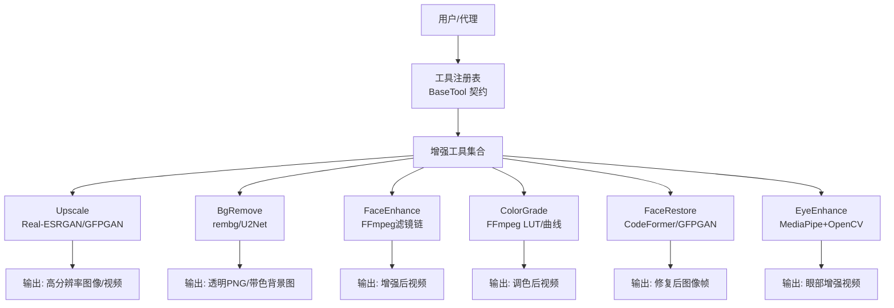
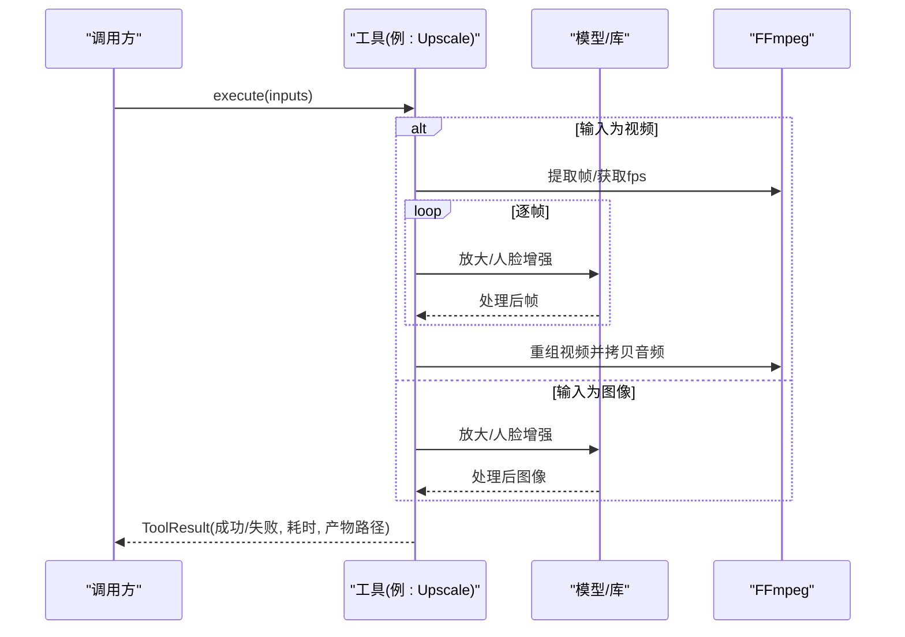
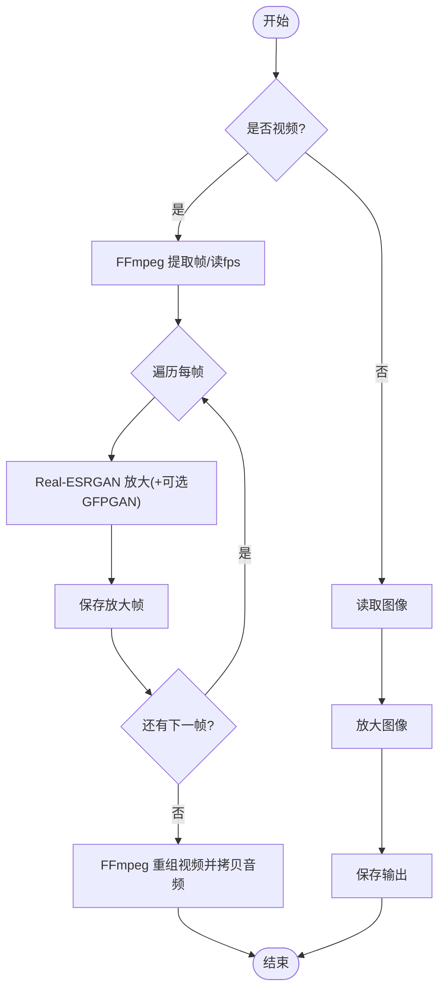
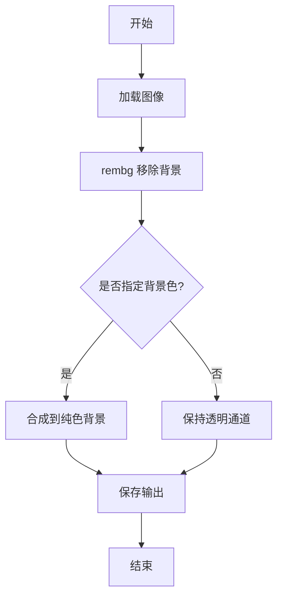
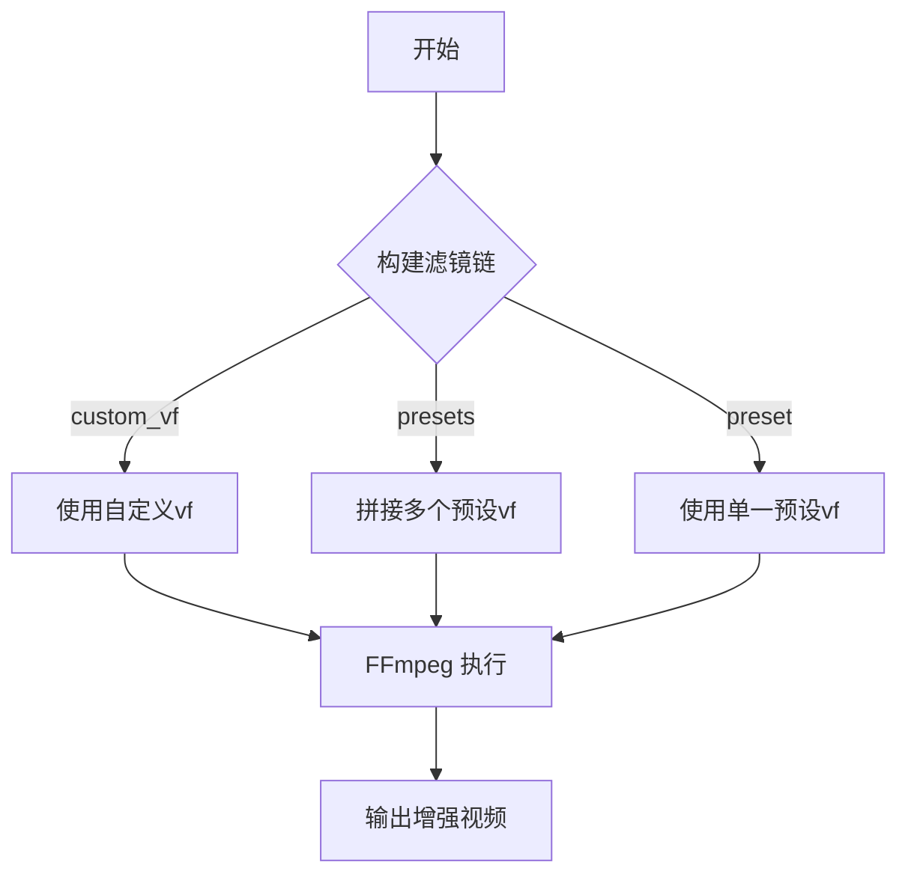
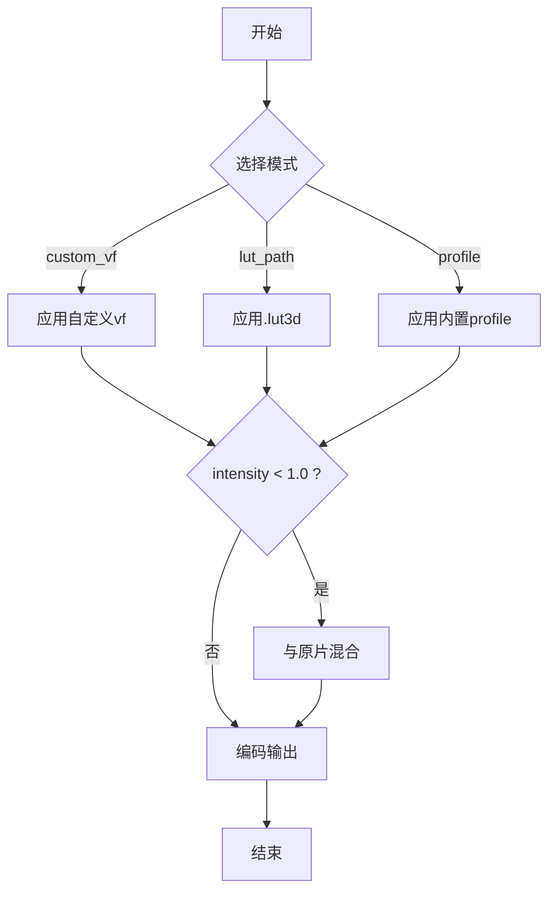

# 图像增强与编辑

<cite>
**本文引用的文件**
- [README.md](file://README.md)
- [tools/enhancement/upscale.py](file://tools/enhancement/upscale.py)
- [tools/enhancement/bg_remove.py](file://tools/enhancement/bg_remove.py)
- [tools/enhancement/face_enhance.py](file://tools/enhancement/face_enhance.py)
- [tools/enhancement/color_grade.py](file://tools/enhancement/color_grade.py)
- [tools/enhancement/face_restore.py](file://tools/enhancement/face_restore.py)
- [tools/enhancement/eye_enhance.py](file://tools/enhancement/eye_enhance.py)
- [skills/creative/upscale-usage.md](file://skills/creative/upscale-usage.md)
- [skills/creative/bg-remove-usage.md](file://skills/creative/bg-remove-usage.md)
- [skills/creative/face-restore-usage.md](file://skills/creative/face-restore-usage.md)
- [skills/core/color-grading.md](file://skills/core/color-grading.md)
</cite>

## 目录
1. [简介](#简介)
2. [项目结构](#项目结构)
3. [核心组件](#核心组件)
4. [架构总览](#架构总览)
5. [详细组件分析](#详细组件分析)
6. [依赖关系分析](#依赖关系分析)
7. [性能与资源](#性能与资源)
8. [质量评估与优化策略](#质量评估与优化策略)
9. [API参考](#api参考)
10. [使用示例与工作流](#使用示例与工作流)
11. [故障排查](#故障排查)
12. [结论](#结论)

## 简介
本技术文档聚焦 OpenMontage 的图像增强与编辑能力，覆盖超分辨率、背景移除、面部增强/修复、眼部增强与色彩分级等关键技术。文档从实现原理、数据流、处理选项、质量评估到性能调优进行系统化说明，并提供可直接落地的 API 参考与视频制作流程集成示例。

## 项目结构
OpenMontage 将“工具”与“技能”分层组织：
- 工具层（tools/enhancement）：提供可执行的增强能力（如 upscale、bg_remove、face_enhance、color_grade、face_restore、eye_enhance）。
- 技能层（skills）：提供使用方法、最佳实践与质量检查清单，指导如何在生产管线中正确调用工具。
- 顶层 README 提供系统概览、能力矩阵与运行方式。

图表来源
- [tools/enhancement/upscale.py:47-109](file://tools/enhancement/upscale.py#L47-L109)
- [tools/enhancement/bg_remove.py:27-86](file://tools/enhancement/bg_remove.py#L27-L86)
- [tools/enhancement/face_enhance.py:70-124](file://tools/enhancement/face_enhance.py#L70-L124)
- [tools/enhancement/color_grade.py:78-128](file://tools/enhancement/color_grade.py#L78-L128)
- [tools/enhancement/face_restore.py:27-99](file://tools/enhancement/face_restore.py#L27-L99)
- [tools/enhancement/eye_enhance.py:47-125](file://tools/enhancement/eye_enhance.py#L47-L125)

章节来源
- [README.md:450-475](file://README.md#L450-L475)

## 核心组件
本节概述六大增强工具的职责、输入输出与关键参数。

- 超分辨率 Upscale
  - 目标：对图像或视频进行 2x/4x 放大，支持人脸区域增强与降噪强度调节。
  - 关键点：视频路径会拆帧→逐帧放大→重新封装；可选 GFPGAN 人脸增强；CPU/MPS 自动分块推理降低内存风险。
  - 典型输出：更高分辨率的图像或视频文件。

- 背景移除 BgRemove
  - 目标：基于 U2Net/IS-Net 模型去除背景，输出透明 PNG 或替换为指定纯色背景。
  - 关键点：支持 alpha matting 精细边缘；适合产品、人物抠图与合成前置步骤。

- 面部增强 FaceEnhance
  - 目标：通过 FFmpeg 滤镜链对说话人画面进行皮肤柔化、锐化、光线校正、冷暖色调调整与降噪。
  - 关键点：内置多组预设并可组合；纯 CPU 执行，无需 GPU。

- 色彩分级 ColorGrade
  - 目标：应用电影级调色预设或外部 .cube LUT，支持强度混合以控制效果程度。
  - 关键点：内置多种风格（暖/冷/暗/明亮/复古/高对比/中性），遵循肤色保护与可访问性原则。

- 面部修复 FaceRestore
  - 目标：针对模糊/压缩/低清的人脸进行重建，保留身份特征；可选背景同步放大。
  - 关键点：CodeFormer 可控保真度；GFPGAN 快速基线；需 GPU 加速更佳。

- 眼部增强 EyeEnhance
  - 目标：针对说话人眼部区域进行黑眼圈减淡、眼球/虹膜提亮与局部锐化。
  - 关键点：优先 MediaPipe 面网格定位，回退至 OpenCV/Haar 或 FFmpeg 全局亮度对比度提升。

章节来源
- [tools/enhancement/upscale.py:47-109](file://tools/enhancement/upscale.py#L47-L109)
- [tools/enhancement/bg_remove.py:27-86](file://tools/enhancement/bg_remove.py#L27-L86)
- [tools/enhancement/face_enhance.py:70-124](file://tools/enhancement/face_enhance.py#L70-L124)
- [tools/enhancement/color_grade.py:78-128](file://tools/enhancement/color_grade.py#L78-L128)
- [tools/enhancement/face_restore.py:27-99](file://tools/enhancement/face_restore.py#L27-L99)
- [tools/enhancement/eye_enhance.py:47-125](file://tools/enhancement/eye_enhance.py#L47-L125)

## 架构总览
增强工具统一继承 BaseTool，声明能力、依赖、资源画像与幂等键，便于编排与缓存。执行时根据输入类型（图像/视频）选择分支，必要时调用外部命令（FFmpeg）或本地模型（Real-ESRGAN、GFPGAN、rembg、MediaPipe）。

图表来源
- [tools/enhancement/upscale.py:126-173](file://tools/enhancement/upscale.py#L126-L173)
- [tools/enhancement/upscale.py:206-259](file://tools/enhancement/upscale.py#L206-L259)
- [tools/enhancement/upscale.py:265-337](file://tools/enhancement/upscale.py#L265-L337)

## 详细组件分析

### 超分辨率 Upscale
- 实现要点
  - 模型选择：RealESRGAN_x4plus（通用）、RealESRGAN_x4plus_anime_6B（动漫/插画）、RealESRNet_x4plus（轻量更快）。
  - 缩放因子：2x/4x；视频路径下先拆帧再重编码，音频从原片复制。
  - 人脸增强：可选启用 GFPGAN，仅当含人脸时建议开启。
  - 设备适配：CUDA 使用半精度单路推理；CPU/MPS 采用 tile 分块避免进程终止。
- 复杂度与性能
  - 时间复杂度 O(N) 按帧数线性增长；4x 放大体积显著增大。
  - 推荐仅在低源分辨率或生成素材需要更高清晰度时使用。
- 错误处理
  - 输入不存在、读取失败、模型加载异常均返回失败结果并携带错误信息。

图表来源
- [tools/enhancement/upscale.py:126-173](file://tools/enhancement/upscale.py#L126-L173)
- [tools/enhancement/upscale.py:206-259](file://tools/enhancement/upscale.py#L206-L259)
- [tools/enhancement/upscale.py:265-337](file://tools/enhancement/upscale.py#L265-L337)

章节来源
- [tools/enhancement/upscale.py:47-109](file://tools/enhancement/upscale.py#L47-L109)
- [skills/creative/upscale-usage.md:16-63](file://skills/creative/upscale-usage.md#L16-L63)

### 背景移除 BgRemove
- 实现要点
  - 模型：u2net（通用）、u2net_human_seg（人像）、isnet-general-use（复杂边缘）。
  - Alpha Matting：用于发丝/毛发/树叶等精细边界，但耗时约翻倍。
  - 背景替换：可输出透明 PNG 或直接合成到指定颜色背景。
- 适用场景
  - 电商产品展示、演讲者抠像合成、缩略图准备、绿幕替代。
- 错误处理
  - 依赖缺失（rembg/PIL）时返回明确安装提示。

图表来源
- [tools/enhancement/bg_remove.py:99-161](file://tools/enhancement/bg_remove.py#L99-L161)

章节来源
- [tools/enhancement/bg_remove.py:27-86](file://tools/enhancement/bg_remove.py#L27-L86)
- [skills/creative/bg-remove-usage.md:17-47](file://skills/creative/bg-remove-usage.md#L17-L47)

### 面部增强 FaceEnhance
- 实现要点
  - 基于 FFmpeg 滤镜链：smartblur、unsharp、curves、colorbalance、hqdn3d 等。
  - 预设：soft_skin、sharpen、brighten、contrast_boost、warm/cool、denoise、talking_head_standard。
  - 支持多预设串联与自定义 vf 字符串。
- 适用场景
  - 说话人镜头的皮肤平滑、细节锐化、光线校正与降噪。
- 错误处理
  - 未提供任何预设或自定义 vf 时返回失败。

图表来源
- [tools/enhancement/face_enhance.py:126-188](file://tools/enhancement/face_enhance.py#L126-L188)

章节来源
- [tools/enhancement/face_enhance.py:25-67](file://tools/enhancement/face_enhance.py#L25-L67)
- [tools/enhancement/face_enhance.py:93-124](file://tools/enhancement/face_enhance.py#L93-L124)

### 色彩分级 ColorGrade
- 实现要点
  - 内置 profile：cinematic_warm、cinematic_cool、moody_dark、bright_clean、vintage_film、high_contrast、neutral。
  - 支持外部 .cube LUT 与 intensity 混合（split + overlay blend）。
  - 遵循肤色保护与 WCAG 对比度要求。
- 适用场景
  - 品牌一致性、不同内容类型的视觉风格统一、跨镜头匹配。
- 错误处理
  - 未提供 profile/lut/custom_vf 时返回失败。

图表来源
- [tools/enhancement/color_grade.py:134-207](file://tools/enhancement/color_grade.py#L134-L207)

章节来源
- [tools/enhancement/color_grade.py:24-75](file://tools/enhancement/color_grade.py#L24-L75)
- [skills/core/color-grading.md:47-100](file://skills/core/color-grading.md#L47-L100)

### 面部修复 FaceRestore
- 实现要点
  - 模型：CodeFormer（保真度可调）、GFPGAN（快速基线）。
  - 可选背景放大（Real-ESRGAN）；检测人脸数量并写入结果。
  - 顺序建议：先修复再增强（face_restore → face_enhance）。
- 适用场景
  - 老旧/压缩严重/低清人脸恢复；说话人素材预处理。
- 错误处理
  - 依赖缺失、模型加载失败、无输出等情况均有明确错误返回。

章节来源
- [tools/enhancement/face_restore.py:27-99](file://tools/enhancement/face_restore.py#L27-L99)
- [tools/enhancement/face_restore.py:108-246](file://tools/enhancement/face_restore.py#L108-L246)
- [skills/creative/face-restore-usage.md:16-41](file://skills/creative/face-restore-usage.md#L16-L41)

### 眼部增强 EyeEnhance
- 实现要点
  - 首选 MediaPipe Face Mesh 精确定位眼区与虹膜，进行黑眼圈减淡、提亮与锐化。
  - 回退路径：OpenCV Haar 级联或 FFmpeg 全局亮度/对比度提升。
  - 输出时通过 FFmpeg 重新封装音频。
- 适用场景
  - 说话人镜头的眼部细节优化，提升观感自然度。
- 错误处理
  - 依赖不足时降级执行；音频复用失败时返回错误。

章节来源
- [tools/enhancement/eye_enhance.py:47-125](file://tools/enhancement/eye_enhance.py#L47-L125)
- [tools/enhancement/eye_enhance.py:176-268](file://tools/enhancement/eye_enhance.py#L176-L268)
- [tools/enhancement/eye_enhance.py:425-579](file://tools/enhancement/eye_enhance.py#L425-L579)

## 依赖关系分析
- 运行时依赖
  - FFmpeg：所有视频相关操作（拆帧、重组、滤镜、LUT、编码）。
  - Python 库：realesrgan、torch、gfpgan、rembg、Pillow、opencv-python、numpy、mediapipe（可选）。
- 设备与平台
  - CUDA（NVIDIA）：GPU 加速（Real-ESRGAN、GFPGAN、CodeFormer）。
  - MPS（Apple Silicon）：部分库支持 MPS，CPU 回退。
  - CPU：可用但速度较慢，尤其逐帧处理视频。
- 耦合与内聚
  - 各工具独立封装，通过 BaseTool 统一接口；内部依赖尽量延迟导入以降低启动成本。
  - 工具间无强耦合，可在管线中自由组合（如 bg_remove → upscale → color_grade）。

章节来源
- [tools/enhancement/upscale.py:58-64](file://tools/enhancement/upscale.py#L58-L64)
- [tools/enhancement/bg_remove.py:38-43](file://tools/enhancement/bg_remove.py#L38-L43)
- [tools/enhancement/face_enhance.py:80-82](file://tools/enhancement/face_enhance.py#L80-L82)
- [tools/enhancement/color_grade.py:88-90](file://tools/enhancement/color_grade.py#L88-L90)
- [tools/enhancement/face_restore.py:38-43](file://tools/enhancement/face_restore.py#L38-L43)
- [tools/enhancement/eye_enhance.py:57-63](file://tools/enhancement/eye_enhance.py#L57-L63)

## 性能与资源
- 超分辨率
  - 视频放大为逐帧处理，时间约为实时 5–10x（GPU）；4x 放大导致文件体积显著增加。
  - 建议在资产准备阶段进行，而非最终合成阶段。
- 背景移除
  - CPU 约 1–3 秒/图；GPU（onnxruntime-gpu）<0.5 秒/图；alpha matting 耗时约翻倍。
- 面部增强/色彩分级
  - 纯 FFmpeg 滤镜链，CPU 友好；CRF 控制码率与体积。
- 面部修复
  - 依赖模型加载与推理，GPU 显著提升速度；建议先采样关键帧测试参数。
- 眼部增强
  - MediaPipe 路径较精确但逐帧开销大；无 MediaPipe 时回退到更快的全局调整。

优化建议
- 批量处理：对图像批量去背/放大；对视频仅对关键片段做放大。
- 参数预热：在短片段上试跑，确认参数后再全量执行。
- 设备选择：有 GPU 优先 CUDA；否则合理设置 tile 与 CRF。
- 存储与IO：临时目录放在高速盘，减少磁盘瓶颈。

[本节为通用性能讨论，不直接分析具体文件]

## 质量评估与优化策略
- 超分辨率
  - 评估：细节锐利度、伪影/过锐、人脸自然度、文本可读性、文件大小。
  - 优化：选择合适的模型与 scale；人脸素材启用 face_enhance；旧素材提高 denoise_strength。
- 背景移除
  - 评估：边缘干净度、细边保留（发丝/毛发）、透明度完整、主体完整性。
  - 优化：人像用 u2net_human_seg；复杂边缘开 alpha_matting；合成前全尺寸检查。
- 面部增强
  - 评估：皮肤质感自然、细节不过度锐化、光线均衡、无明显色偏。
  - 优化：组合 preset（如 talking_head_standard），必要时叠加 custom_vf。
- 色彩分级
  - 评估：肤色落在“肤色线”附近、整体对比/饱和度适中、字幕/图形对比度达标。
  - 优化：按内容类型选 profile；LUT 强度 0.6–0.8；统一全片风格。
- 面部修复
  - 评估：身份一致、纹理自然、无幻觉特征、跨帧稳定。
  - 优化：CodeFormer fidelity 从 0.5 起步微调；必要时结合 face_enhance。
- 眼部增强
  - 评估：黑眼圈减淡自然、眼球提亮不过曝、锐化不引入光晕。
  - 优化：优先 MediaPipe；强度控制在 0.3–0.4；避免过度。

章节来源
- [skills/creative/upscale-usage.md:112-131](file://skills/creative/upscale-usage.md#L112-L131)
- [skills/creative/bg-remove-usage.md:94-114](file://skills/creative/bg-remove-usage.md#L94-L114)
- [skills/core/color-grading.md:108-148](file://skills/core/color-grading.md#L108-L148)
- [skills/creative/face-restore-usage.md:76-97](file://skills/creative/face-restore-usage.md#L76-L97)

## API参考
以下列出各工具的输入参数、输出格式与处理选项。所有工具均返回 ToolResult，包含 success、data、artifacts、duration_seconds 等字段。

- Upscale
  - 输入
    - input_path: 必填，图像或视频路径
    - output_path: 可选，默认 {stem}_upscaled
    - scale: 2 或 4，默认 4
    - model: RealESRGAN_x4plus / RealESRGAN_x4plus_anime_6B / RealESRNet_x4plus，默认 x4plus
    - face_enhance: 布尔，默认 False
    - denoise_strength: 0.0–1.0，默认 0.5
  - 输出
    - data 包含 input/output/scale/model/face_enhance/type(图像/视频)/output_width/output_height 或 total_frames/fps
    - artifacts: 输出文件路径列表
- BgRemove
  - 输入
    - input_path: 必填
    - output_path: 可选，默认 {stem}_nobg.png
    - model: u2net / u2net_human_seg / isnet-general-use，默认 u2net
    - bg_color: 可选，十六进制颜色，透明则不填
    - alpha_matting: 布尔，默认 False
  - 输出
    - data 包含 input/output/model/alpha_matting/bg_color
    - artifacts: 输出文件路径
- FaceEnhance
  - 输入
    - input_path: 必填
    - output_path: 可选，默认 {stem}_enhanced
    - preset: 枚举（见预设表），默认 talking_head_standard
    - presets: 数组，可顺序应用多个预设
    - custom_vf: 自定义 FFmpeg 滤镜字符串
    - codec/crf: 编码器与质量
  - 输出
    - data 包含 input/output/filter/preset
    - artifacts: 输出文件路径
- ColorGrade
  - 输入
    - input_path: 必填
    - output_path: 可选，默认 {stem}_graded
    - profile: 内置调色预设（见 profile 表），默认 cinematic_warm
    - lut_path: 可选，.cube LUT 路径
    - intensity: 0.0–1.0，默认 1.0
    - custom_vf/codec/crf: 同上
  - 输出
    - data 包含 input/output/profile/lut/intensity/filter
    - artifacts: 输出文件路径
- FaceRestore
  - 输入
    - input_path: 必填
    - output_path: 可选，默认 {stem}_restored
    - model: CodeFormer / GFPGAN，默认 CodeFormer
    - fidelity: 0–1（CodeFormer），默认 0.5
    - upscale: 放大倍数，默认 2
    - bg_upsampler: 是否同时放大背景，默认 False
  - 输出
    - data 包含 input/output/model/faces_detected/upscale/fidelity/bg_upsampler
    - artifacts: 输出文件路径
- EyeEnhance
  - 输入
    - input_path: 必填
    - output_path: 可选，默认 {stem}_eye_enhanced
    - operations: ["dark_circles","brighten_eyes","sharpen_eyes"] 子集，默认前两项
    - dark_circle_intensity/eye_brighten_intensity/sharpen_intensity: 0–1 强度
    - codec/crf: 编码器与质量
  - 输出
    - data 包含 input/output/method/frames_processed/frames_enhanced/operations
    - artifacts: 输出文件路径

章节来源
- [tools/enhancement/upscale.py:72-109](file://tools/enhancement/upscale.py#L72-L109)
- [tools/enhancement/bg_remove.py:52-86](file://tools/enhancement/bg_remove.py#L52-L86)
- [tools/enhancement/face_enhance.py:93-124](file://tools/enhancement/face_enhance.py#L93-L124)
- [tools/enhancement/color_grade.py:98-128](file://tools/enhancement/color_grade.py#L98-L128)
- [tools/enhancement/face_restore.py:53-99](file://tools/enhancement/face_restore.py#L53-L99)
- [tools/enhancement/eye_enhance.py:72-125](file://tools/enhancement/eye_enhance.py#L72-L125)

## 使用示例与工作流
以下为在视频制作流程中集成增强能力的常见工作流。注意：这些是流程描述，不包含代码片段。

- 工作流A：低清素材→超分→面部增强→色彩分级→合成
  - 步骤
    - 若源分辨率低于目标（如 480p→1080p/4K），执行 Upscale（scale=4，含 face_enhance）。
    - 对说话人镜头执行 FaceEnhance（preset=talking_head_standard）。
    - 应用 ColorGrade（按内容类型选择 profile，intensity≈0.8）。
    - 进入 compose 阶段进行剪辑与包装。
- 工作流B：产品演示→背景移除→合成
  - 步骤
    - 对商品图执行 BgRemove（model=u2net，必要时 bg_color 替换品牌背景）。
    - 将透明 PNG 作为图层叠加到背景/动效中。
- 工作流C：老视频修复→面部修复→增强→调色
  - 步骤
    - 对退化人脸执行 FaceRestore（CodeFormer fidelity≈0.3–0.5，必要时 bg_upsampler=true）。
    - 再执行 FaceEnhance 进行皮肤与光线优化。
    - 最后 ColorGrade 统一风格。
- 工作流D：说话人特写→眼部增强
  - 步骤
    - 执行 EyeEnhance（operations 按需选择，强度 0.3–0.4）。
    - 与其他增强步骤组合，确保自然过渡。

章节来源
- [skills/creative/upscale-usage.md:72-110](file://skills/creative/upscale-usage.md#L72-L110)
- [skills/creative/bg-remove-usage.md:48-92](file://skills/creative/bg-remove-usage.md#L48-L92)
- [skills/creative/face-restore-usage.md:42-74](file://skills/creative/face-restore-usage.md#L42-L74)
- [skills/core/color-grading.md:150-162](file://skills/core/color-grading.md#L150-L162)

## 故障排查
- 依赖缺失
  - rembg/Pillow：安装 pip install rembg Pillow。
  - realesrgan/torch/gfpgan：uv pip install realesrgan torch gfpgan。
  - mediapipe/opencv：pip install mediapipe opencv-python numpy。
  - FFmpeg：按平台安装并确保在 PATH 中。
- 常见错误
  - 输入路径不存在：检查路径与权限。
  - 模型下载失败：检查网络与镜像；重试或手动放置权重。
  - 视频编码失败：检查编码器与 CRF；尝试更换 codec/preset。
  - 音频复用失败：确认输入包含音轨；必要时单独处理音轨。
- 性能问题
  - 视频放大过慢：缩短片段长度、降低 scale、使用 GPU。
  - 内存溢出：CPU/MPS 下启用 tile；降低分辨率或分批处理。
  - 输出过大：适当提高 CRF；避免不必要的 4x 放大。

章节来源
- [tools/enhancement/bg_remove.py:111-125](file://tools/enhancement/bg_remove.py#L111-L125)
- [tools/enhancement/face_restore.py:124-134](file://tools/enhancement/face_restore.py#L124-L134)
- [tools/enhancement/eye_enhance.py:538-574](file://tools/enhancement/eye_enhance.py#L538-L574)

## 结论
OpenMontage 的增强模块以标准化工具接口与丰富技能文档为基础，覆盖了从超分辨率、背景移除到面部修复与色彩分级的完整链路。通过合理的参数选择、设备利用与批处理策略，可在保证质量的同时获得良好的性能表现。建议在生产中遵循“先修复、再增强、后调色”的顺序，并在合成前完成高质量资产准备，以获得稳定且高效的视频产出。