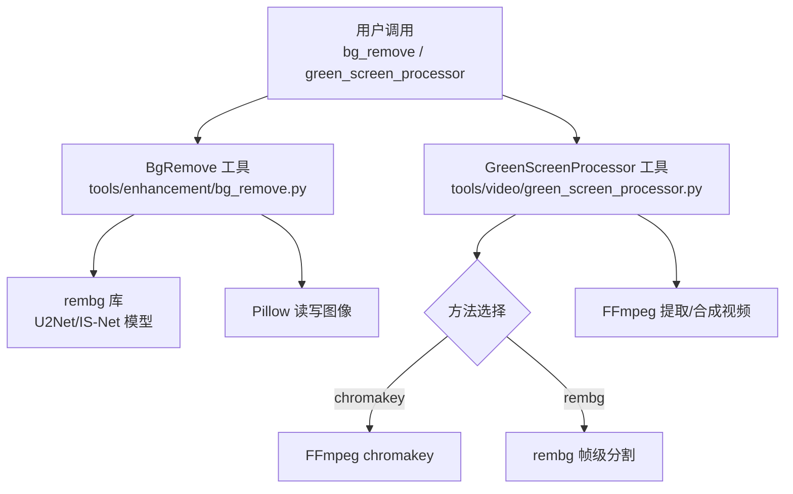
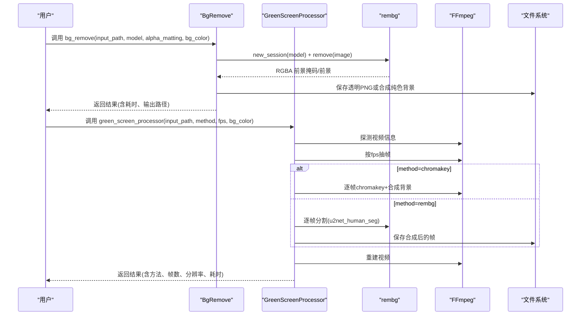
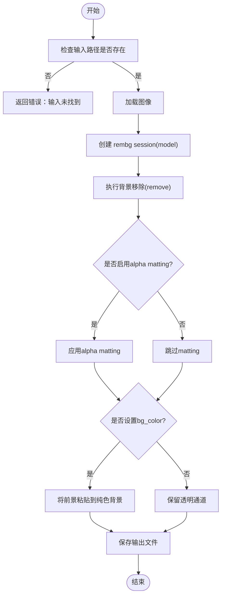
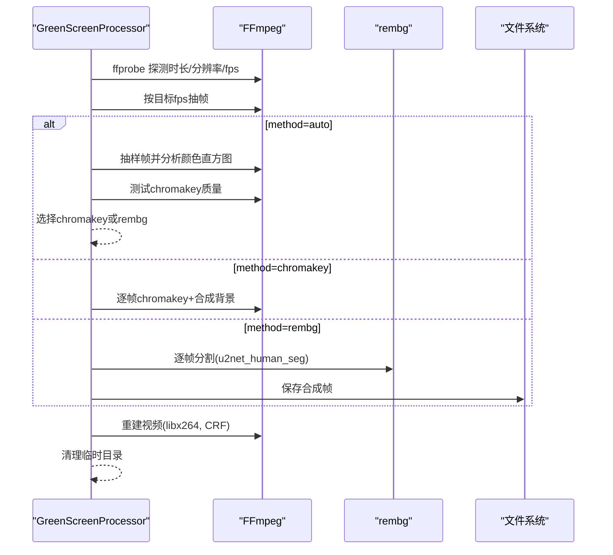

# 背景移除

<cite>
**本文引用的文件**
- [tools/enhancement/bg_remove.py](file://tools/enhancement/bg_remove.py)
- [skills/creative/bg-remove-usage.md](file://skills/creative/bg-remove-usage.md)
- [tools/video/green_screen_processor.py](file://tools/video/green_screen_processor.py)
- [tests/tools/test_bg_remove_api.py](file://tests/tools/test_bg_remove_api.py)
- [requirements.txt](file://requirements.txt)
- [config.yaml](file://config.yaml)
</cite>

## 目录
1. [简介](#简介)
2. [项目结构](#项目结构)
3. [核心组件](#核心组件)
4. [架构总览](#架构总览)
5. [详细组件分析](#详细组件分析)
6. [依赖关系分析](#依赖关系分析)
7. [性能与内存优化](#性能与内存优化)
8. [故障排除指南](#故障排除指南)
9. [结论](#结论)
10. [附录：API参考](#附录api参考)

## 简介
本技术文档聚焦 OpenMontage 的背景移除能力，覆盖算法实现、模型选择与优化策略、输入输出格式、质量控制、批量处理、内存占用与性能调优，以及视频制作中的实际应用场景。OpenMontage 通过封装 rembg 库（基于 U2Net/IS-Net 等深度学习分割模型）提供图像级背景移除；同时提供视频绿幕/背景移除工具，支持自动方法选择（chromakey vs rembg），便于在视频制作流程中高效抠图与合成。

## 项目结构
与背景移除相关的代码主要分布在增强工具与视频后处理模块中：
- 图像背景移除：tools/enhancement/bg_remove.py
- 视频绿幕/背景移除：tools/video/green_screen_processor.py
- 使用指南与最佳实践：skills/creative/bg-remove-usage.md
- 单元测试验证模型选择行为：tests/tools/test_bg_remove_api.py
- 依赖与环境配置：requirements.txt、config.yaml

图表来源
- [tools/enhancement/bg_remove.py:27-161](file://tools/enhancement/bg_remove.py#L27-L161)
- [tools/video/green_screen_processor.py:36-206](file://tools/video/green_screen_processor.py#L36-L206)

章节来源
- [tools/enhancement/bg_remove.py:1-161](file://tools/enhancement/bg_remove.py#L1-L161)
- [tools/video/green_screen_processor.py:1-635](file://tools/video/green_screen_processor.py#L1-L635)
- [skills/creative/bg-remove-usage.md:1-114](file://skills/creative/bg-remove-usage.md#L1-L114)

## 核心组件
- 图像背景移除工具（BgRemove）
  - 基于 rembg 的 U2Net/IS-Net 模型进行前景分割，支持 alpha matting 精细边缘、透明 PNG 或自定义纯色背景输出。
  - 资源需求声明为 CPU 2核、RAM 2048MB、磁盘 500MB。
- 视频绿幕/背景移除工具（GreenScreenProcessor）
  - 支持 auto/chromakey/rembg 三种模式：auto 会采样若干帧并分析颜色直方图，评估 chromakey 质量后选择最优方法。
  - 对 rembg 模式，逐帧使用 u2net_human_seg 模型进行分割，再合成到指定背景色。
  - 资源需求声明为 CPU 4核、RAM 4096MB、磁盘 8000MB。

章节来源
- [tools/enhancement/bg_remove.py:27-161](file://tools/enhancement/bg_remove.py#L27-L161)
- [tools/video/green_screen_processor.py:36-206](file://tools/video/green_screen_processor.py#L36-L206)

## 架构总览
背景移除在 OpenMontage 中作为“素材准备”阶段的关键步骤，通常位于 compose 之前。图像路径由 BgRemove 直接处理；视频路径由 GreenScreenProcessor 抽取帧后处理，再重建视频。

图表来源
- [tools/enhancement/bg_remove.py:99-161](file://tools/enhancement/bg_remove.py#L99-L161)
- [tools/video/green_screen_processor.py:114-206](file://tools/video/green_screen_processor.py#L114-L206)
- [tools/video/green_screen_processor.py:526-584](file://tools/video/green_screen_processor.py#L526-L584)

## 详细组件分析

### 图像背景移除（BgRemove）
- 功能要点
  - 支持模型：u2net（通用）、u2net_human_seg（人像）、isnet-general-use（复杂边缘）。
  - 支持 alpha matting 提升发丝/毛发/树叶等细边质量，但会增加约2倍处理时间。
  - 输出默认透明 PNG；可设置 bg_color 生成纯色背景替换。
  - 资源声明：CPU 2核、RAM 2048MB、磁盘 500MB。
- 关键流程
  - 读取输入图像 → 创建 rembg session → 执行 remove → 可选合成背景 → 写入输出。
- 错误处理
  - 输入不存在时返回失败；缺失依赖（rembg/Pillow）时给出安装提示。
- 测试验证
  - 单元测试验证通过传入 model 参数正确创建 rembg session，且不会传递多余的 model_name 参数。

图表来源
- [tools/enhancement/bg_remove.py:99-161](file://tools/enhancement/bg_remove.py#L99-L161)

章节来源
- [tools/enhancement/bg_remove.py:27-161](file://tools/enhancement/bg_remove.py#L27-L161)
- [tests/tools/test_bg_remove_api.py:7-28](file://tests/tools/test_bg_remove_api.py#L7-L28)
- [skills/creative/bg-remove-usage.md:27-46](file://skills/creative/bg-remove-usage.md#L27-L46)

### 视频绿幕/背景移除（GreenScreenProcessor）
- 功能要点
  - 方法选择：auto 会抽取若干样本帧，检测是否存在绿/蓝屏，并对 chromakey 质量进行评估，若质量不佳则回退到 rembg。
  - chromakey：使用 FFmpeg 滤镜快速去除标准绿幕/蓝幕，适合干净背景。
  - rembg：逐帧使用 u2net_human_seg 模型进行分割，适用于任意背景。
  - 资源声明：CPU 4核、RAM 4096MB、磁盘 8000MB。
- 关键流程
  - 探测视频信息 → 抽取帧 → 根据方法处理帧 → 重建视频。
- 错误处理
  - 无法探测视频、无帧提取、处理失败等情况均返回明确错误；最终清理临时目录。

图表来源
- [tools/video/green_screen_processor.py:114-206](file://tools/video/green_screen_processor.py#L114-L206)
- [tools/video/green_screen_processor.py:244-296](file://tools/video/green_screen_processor.py#L244-L296)
- [tools/video/green_screen_processor.py:526-584](file://tools/video/green_screen_processor.py#L526-L584)

章节来源
- [tools/video/green_screen_processor.py:36-206](file://tools/video/green_screen_processor.py#L36-L206)
- [tools/video/green_screen_processor.py:244-296](file://tools/video/green_screen_processor.py#L244-L296)
- [tools/video/green_screen_processor.py:526-584](file://tools/video/green_screen_processor.py#L526-L584)

## 依赖关系分析
- Python 依赖
  - Pillow：用于图像读写与合成。
  - rembg：提供 U2Net/IS-Net 模型的推理接口。
  - numpy：在视频 rembg 模式中用于数组转换。
- 外部工具
  - FFmpeg/ffprobe：用于视频探测、抽帧、滤镜处理与重建。
- 配置
  - config.yaml 定义输出默认格式、编码、分辨率、帧率、CRF 等全局参数，影响最终视频质量与体积。

章节来源
- [requirements.txt:1-17](file://requirements.txt#L1-L17)
- [config.yaml:20-34](file://config.yaml#L20-L34)

## 性能与内存优化
- 模型选择与速度
  - u2net：通用场景，速度快，默认推荐。
  - u2net_human_seg：人像/演讲者更准确，速度仍较快。
  - isnt-general-use：复杂边缘（发丝、毛发、树叶）质量更高，但较慢。
- Alpha matting
  - 开启后可显著提升细边质量，但处理时间约为关闭时的2倍。建议在需要高质量边缘的场景开启。
- GPU 加速
  - 使用 onnxruntime-gpu 与 CUDA 可显著降低单图处理时间（文档建议 <0.5s/图）。
- 批处理
  - 图像：可对多张图顺序调用 BgRemove；注意控制并发以避免内存峰值过高。
  - 视频：GreenScreenProcessor 已内置帧级循环与进度日志；对于长视频，建议使用 max_frames 限制测试，或分片段处理。
- 内存与磁盘
  - 图像：资源声明 RAM 2048MB，磁盘 500MB。
  - 视频：资源声明 RAM 4096MB，磁盘 8000MB；中间帧与临时目录需确保足够空间并及时清理。
- 质量与压缩
  - 视频重建使用 libx264 编码器与 CRF 控制质量；可通过 config.yaml 调整默认 CRF、分辨率与帧率以平衡质量与体积。

章节来源
- [skills/creative/bg-remove-usage.md:27-46](file://skills/creative/bg-remove-usage.md#L27-L46)
- [tools/enhancement/bg_remove.py:81-83](file://tools/enhancement/bg_remove.py#L81-L83)
- [tools/video/green_screen_processor.py:96-103](file://tools/video/green_screen_processor.py#L96-L103)
- [tools/video/green_screen_processor.py:586-606](file://tools/video/green_screen_processor.py#L586-L606)
- [config.yaml:20-27](file://config.yaml#L20-L27)

## 故障排除指南
- 依赖缺失
  - 报错提示缺少 rembg 或 Pillow：按安装说明安装对应依赖（CPU/GPU 模式）。
- 输入问题
  - 输入路径不存在：检查路径与权限；确保文件可读。
- 方法选择不当
  - 非标准绿幕背景使用 chromakey 效果差：切换到 rembg 或 auto 模式让系统自动判断。
- 输出异常
  - 输出视频为空或尺寸异常：检查 FFmpeg 版本与滤镜链；确认分辨率与帧率设置合理。
- 性能瓶颈
  - 处理速度慢：优先选择合适模型（人像用 u2net_human_seg），必要时启用 GPU；减少 alpha matting 使用；对长视频分段处理。
- 质量检查清单
  - 边缘是否干净、细节是否保留、透明度是否完整、主体是否被误删、合成后是否自然融合。

章节来源
- [tools/enhancement/bg_remove.py:99-125](file://tools/enhancement/bg_remove.py#L99-L125)
- [tools/video/green_screen_processor.py:114-206](file://tools/video/green_screen_processor.py#L114-L206)
- [skills/creative/bg-remove-usage.md:94-114](file://skills/creative/bg-remove-usage.md#L94-L114)

## 结论
OpenMontage 的背景移除能力通过 rembg 提供的深度学习模型实现了高质量的图像与视频前景分割。图像端提供灵活的模型选择与 alpha matting 选项；视频端支持自动方法选择与两种后端（chromakey 与 rembg），兼顾速度与质量。结合合理的模型选择、GPU 加速与批处理策略，可在视频制作流程中高效完成抠图与合成。

## 附录：API参考

### BgRemove（图像背景移除）
- 名称：bg_remove
- 能力：background_removal、alpha_matte、batch_processing、custom_background
- 输入参数
  - input_path（必填）：输入图像或视频帧路径
  - output_path（可选）：输出路径，默认 {stem}_nobg.png
  - model（可选）：u2net | u2net_human_seg | isnt-general-use，默认 u2net
  - bg_color（可选）：替换背景色的十六进制（如 #00FF00），不设置则输出透明 PNG
  - alpha_matting（可选）：是否启用 alpha matting，默认 False
- 输出
  - ToolResult 包含 success、data（input/output/model/alpha_matting/bg_color）、artifacts（输出路径）、duration_seconds
- 资源需求
  - CPU 2核、RAM 2048MB、磁盘 500MB

章节来源
- [tools/enhancement/bg_remove.py:27-161](file://tools/enhancement/bg_remove.py#L27-L161)

### GreenScreenProcessor（视频绿幕/背景移除）
- 名称：green_screen_processor
- 能力：green_screen_keying、chromakey、background_removal、rembg_segmentation
- 输入参数
  - input_path（必填）：原始绿幕视频路径
  - output_path（必填）：输出去背视频路径
  - method（可选）：auto | chromakey | rembg，默认 auto
  - fps（可选）：输出帧率，默认 15
  - bg_color（可选）：输出背景色，默认 #0E172A
  - max_frames（可选）：限制处理的帧数，0 表示全部
- 输出
  - ToolResult 包含 success、data（method_used/frame_count/duration/output_path/resolution/fps/bg_color）、artifacts、duration_seconds
- 资源需求
  - CPU 4核、RAM 4096MB、磁盘 8000MB

章节来源
- [tools/video/green_screen_processor.py:36-206](file://tools/video/green_screen_processor.py#L36-L206)