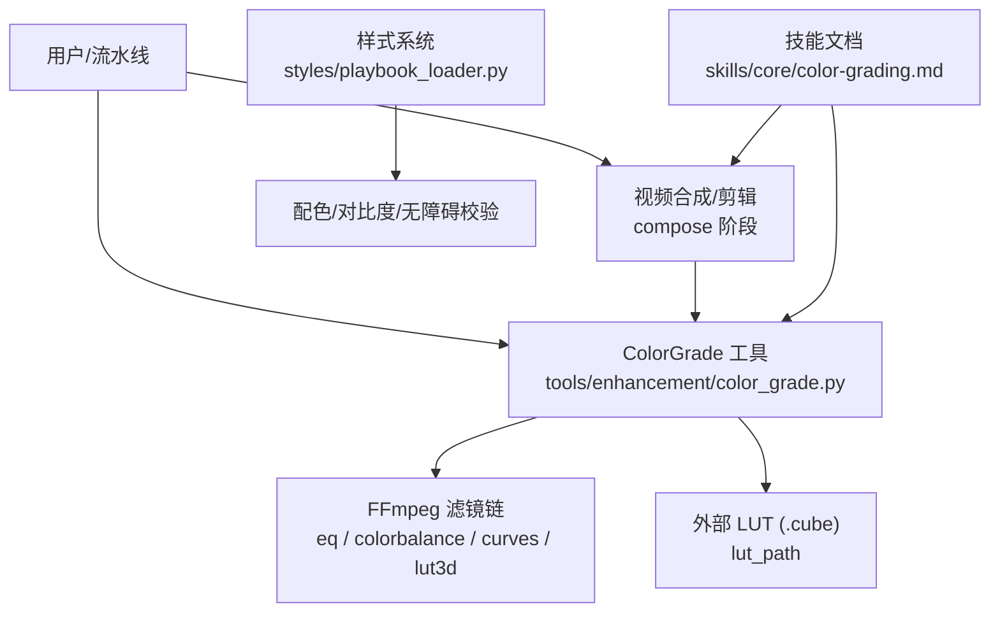
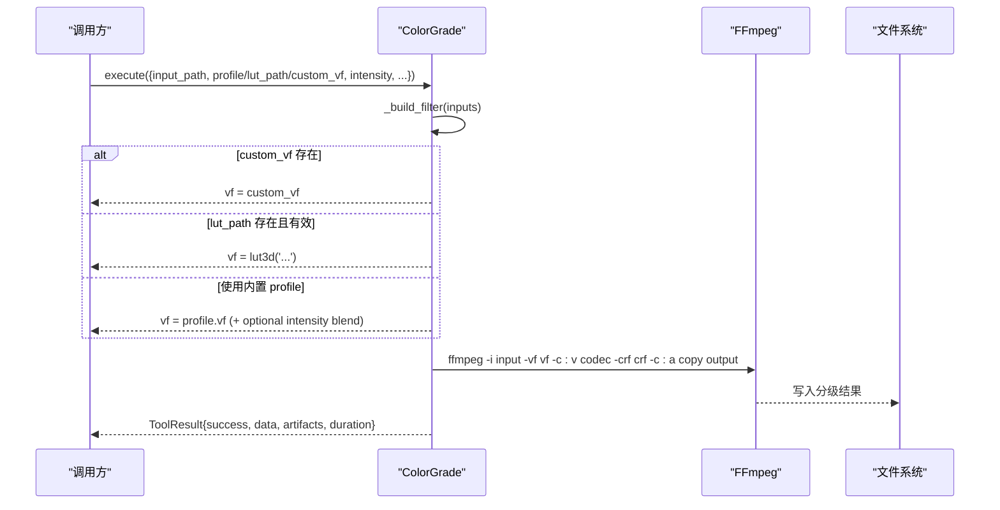
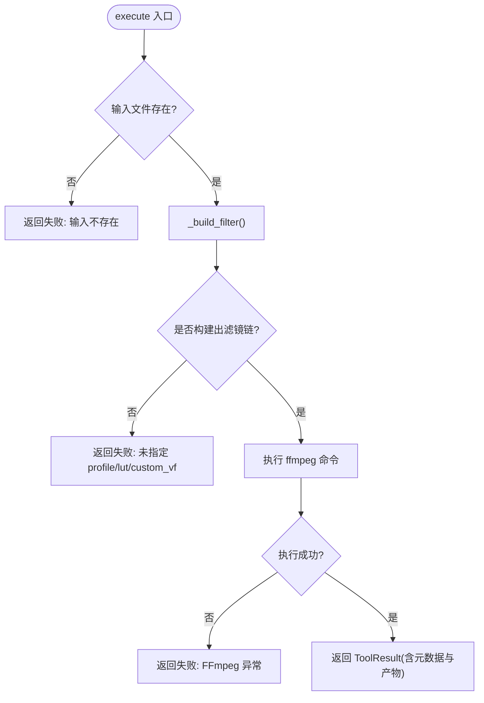
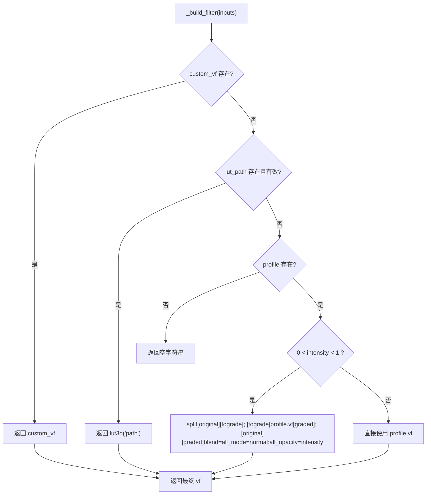
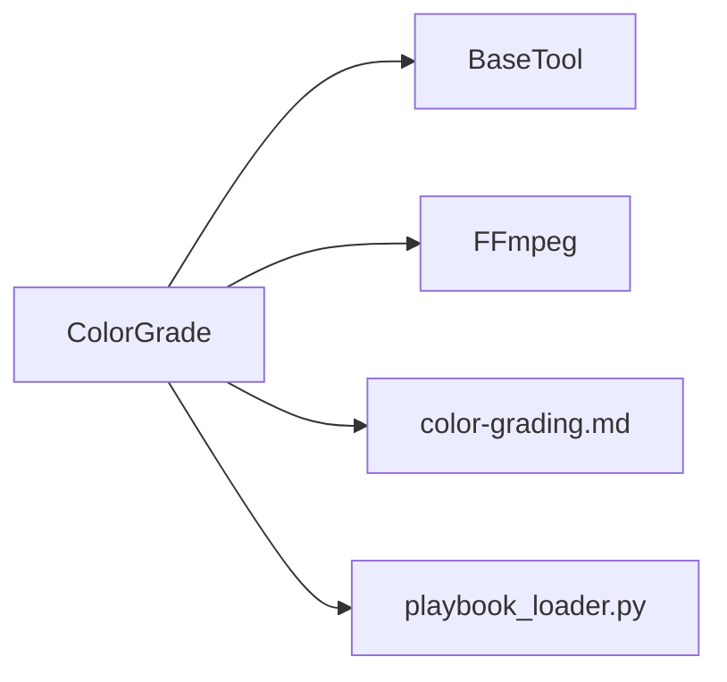

# 色彩分级

<cite>
**本文引用的文件**
- [tools/enhancement/color_grade.py](file://tools/enhancement/color_grade.py)
- [skills/core/color-grading.md](file://skills/core/color-grading.md)
- [styles/playbook_loader.py](file://styles/playbook_loader.py)
- [tests/contracts/test_phase2_comparison.py](file://tests/contracts/test_phase2_comparison.py)
- [skills/pipelines/documentary-montage/compose-director.md](file://skills/pipelines/documentary-montage/compose-director.md)
</cite>

## 目录
1. [简介](#简介)
2. [项目结构](#项目结构)
3. [核心组件](#核心组件)
4. [架构总览](#架构总览)
5. [详细组件分析](#详细组件分析)
6. [依赖关系分析](#依赖关系分析)
7. [性能考量](#性能考量)
8. [故障排查指南](#故障排查指南)
9. [结论](#结论)
10. [附录：API 参考与最佳实践](#附录api-参考与最佳实践)

## 简介
本技术文档聚焦 OpenMontage 的色彩分级能力，覆盖色彩校正、色调调整与视觉风格化的实现方式；说明支持的色彩空间建议、LUT 应用与自定义调色板（样式）机制；提供完整的 API 接口说明（参数、预设、批量处理）；解释与视频编辑流程的集成点与质量控制机制；并给出最佳实践与性能优化策略，辅以实际应用场景与效果对比思路。

## 项目结构
OpenMontage 的色彩分级由“工具层 + 技能文档 + 样式系统”三部分构成：
- 工具层：基于 FFmpeg 滤镜链封装 ColorGrade 工具，支持内置预设、外部 .cube LUT 与自定义滤镜链。
- 技能文档：提供 FFmpeg 滤镜参考、滤镜顺序、皮肤色保护、可访问性与内容类型选择建议。
- 样式系统：通过 YAML Playbook 管理配色、对比度与无障碍校验，辅助生成或统一视觉风格。

图表来源
- [tools/enhancement/color_grade.py:78-213](file://tools/enhancement/color_grade.py#L78-L213)
- [skills/core/color-grading.md:18-45](file://skills/core/color-grading.md#L18-L45)
- [styles/playbook_loader.py:37-84](file://styles/playbook_loader.py#L37-L84)

章节来源
- [tools/enhancement/color_grade.py:78-213](file://tools/enhancement/color_grade.py#L78-L213)
- [skills/core/color-grading.md:18-45](file://skills/core/color-grading.md#L18-L45)
- [styles/playbook_loader.py:37-84](file://styles/playbook_loader.py#L37-L84)

## 核心组件
- ColorGrade 工具
  - 能力：grade_preset（内置预设）、grade_lut（外部 .cube LUT）、grade_custom（自定义滤镜链）。
  - 输入：input_path（必填）、output_path、profile、lut_path、intensity、custom_vf、codec、crf。
  - 输出：ToolResult，包含 input/output/profile/lut/intensity/filter/artifacts/duration_seconds 等。
  - 资源：CPU 2 核、内存 1024MB、显存 0、磁盘约 2000MB。
  - 幂等键：input_path、profile、lut_path、intensity。
- 内置预设（示例）
  - cinematic_warm、cinematic_cool、moody_dark、bright_clean、vintage_film、high_contrast、neutral。
- 滤镜链构建逻辑
  - 优先级：custom_vf > lut_path > profile。
  - intensity 混合：当 0 < intensity < 1 时，使用 split + blend 将原始画面与分级画面按透明度叠加。
- 技能文档
  - 推荐滤镜顺序：normalize → colortemperature → colorbalance → curves → eq → lut3d。
  - 肤色保护、可访问性（WCAG）、颜色空间建议（BT.709/BT.2020）、位深建议（10-bit 分级、8-bit 交付）。
- 样式系统（Playbook）
  - 加载与验证 YAML 样式，提供配色、对比度、色盲安全检测等能力，用于统一视觉风格与质量门禁。

章节来源
- [tools/enhancement/color_grade.py:24-75](file://tools/enhancement/color_grade.py#L24-L75)
- [tools/enhancement/color_grade.py:78-132](file://tools/enhancement/color_grade.py#L78-L132)
- [tools/enhancement/color_grade.py:134-213](file://tools/enhancement/color_grade.py#L134-L213)
- [skills/core/color-grading.md:18-45](file://skills/core/color-grading.md#L18-L45)
- [styles/playbook_loader.py:37-84](file://styles/playbook_loader.py#L37-L84)

## 架构总览
色彩分级在整体视频生产管线中通常位于“增强/后期”阶段，既可作为独立工具调用，也可嵌入 compose 阶段进行统一风格化。

图表来源
- [tools/enhancement/color_grade.py:134-213](file://tools/enhancement/color_grade.py#L134-L213)

## 详细组件分析

### ColorGrade 工具类
- 职责
  - 解析输入参数，构建 FFmpeg 滤镜链。
  - 执行 FFmpeg 命令，返回标准化结果。
  - 支持幂等键与资源画像，便于调度与缓存。
- 关键方法
  - execute(inputs): 主入口，负责路径校验、滤镜构建、命令执行与结果封装。
  - _build_filter(inputs): 滤镜链组装，含 intensity 混合逻辑。
  - list_profiles(): 列出可用预设及描述。
- 错误处理
  - 输入不存在：返回失败与错误信息。
  - 未指定任何滤镜源：返回失败提示。
  - FFmpeg 异常：捕获并返回错误。

图表来源
- [tools/enhancement/color_grade.py:134-213](file://tools/enhancement/color_grade.py#L134-L213)

章节来源
- [tools/enhancement/color_grade.py:78-213](file://tools/enhancement/color_grade.py#L78-L213)

### 滤镜链与强度混合
- 滤镜链构建优先级
  - custom_vf 优先于 lut_path，再优先于内置 profile。
- 强度混合
  - 当 0 < intensity < 1 时，采用 split + blend 将原片与分级片按 all_opacity=intensity 混合，避免过度风格化。
- 典型滤镜
  - eq：亮度/对比度/饱和度微调。
  - colorbalance：阴影/中间调/高光 RGB 偏移。
  - curves：通道曲线塑造对比与色调。
  - lut3d：应用外部 .cube LUT。

图表来源
- [tools/enhancement/color_grade.py:181-207](file://tools/enhancement/color_grade.py#L181-L207)

章节来源
- [tools/enhancement/color_grade.py:181-207](file://tools/enhancement/color_grade.py#L181-L207)

### 与视频编辑流程的集成
- 在纪录片蒙太奇等管线中，建议在 compose 阶段对整条时间线应用统一 LUT，以抹平不同来源素材的注册差异，确保跨时代/跨设备素材的一致性。
- 推荐做法：读取 edit_decisions.metadata.grade_profile，映射到 LUT 文件，在 composition 级别一次性应用，而非逐 clip 应用。

章节来源
- [skills/pipelines/documentary-montage/compose-director.md:111-128](file://skills/pipelines/documentary-montage/compose-director.md#L111-L128)

### 样式系统与自定义调色板
- Playbook 加载与校验
  - 从 styles/*.yaml 与 styles/custom/*.yaml 加载，并进行 schema 校验。
  - 提供配色、对比度、色盲安全检测等能力，保障可视化一致性与可访问性。
- 与色彩分级的协同
  - 使用 Playbook 定义品牌/项目级配色与规则，作为视觉基线；
  - 在分级阶段结合 LUT/滤镜链达成统一观感，并通过样式系统的对比度/无障碍检查进行质量门禁。

章节来源
- [styles/playbook_loader.py:37-84](file://styles/playbook_loader.py#L37-L84)
- [styles/playbook_loader.py:210-396](file://styles/playbook_loader.py#L210-L396)

## 依赖关系分析
- 外部依赖
  - FFmpeg：必需命令行工具，用于滤镜链执行与编码。
- 内部依赖
  - BaseTool：统一工具抽象（执行模式、资源画像、幂等键、结果封装）。
  - 技能文档：指导滤镜顺序与参数范围，保证一致性。
  - 样式系统：提供配色与可访问性校验，辅助质量管控。

图表来源
- [tools/enhancement/color_grade.py:13-21](file://tools/enhancement/color_grade.py#L13-L21)
- [tools/enhancement/color_grade.py:78-90](file://tools/enhancement/color_grade.py#L78-L90)
- [skills/core/color-grading.md:18-45](file://skills/core/color-grading.md#L18-L45)
- [styles/playbook_loader.py:37-84](file://styles/playbook_loader.py#L37-L84)

章节来源
- [tools/enhancement/color_grade.py:13-21](file://tools/enhancement/color_grade.py#L13-L21)
- [tools/enhancement/color_grade.py:78-90](file://tools/enhancement/color_grade.py#L78-L90)

## 性能考量
- 滤镜复杂度
  - 复杂曲线与多段 colorbalance 会增加 CPU 负载；建议先在小片段上测试。
- 编码参数
  - CRF 控制画质与体积；默认 20 适用于多数场景，可根据平台需求调整。
- 强度混合
  - intensity < 1 会引入额外 split/blend 计算，适度使用。
- 批处理
  - 建议使用流水线或脚本循环调用 ColorGrade，复用同一 LUT/滤镜链，减少重复配置开销。
- 资源画像
  - 工具声明 CPU 2 核、内存 1GB、无显存要求，适合在通用节点运行。

章节来源
- [tools/enhancement/color_grade.py:126-127](file://tools/enhancement/color_grade.py#L126-L127)
- [tools/enhancement/color_grade.py:151-158](file://tools/enhancement/color_grade.py#L151-L158)

## 故障排查指南
- 常见错误
  - 输入文件不存在：检查 input_path 是否正确。
  - 未指定任何滤镜源：必须提供 profile、lut_path 或 custom_vf 之一。
  - FFmpeg 执行失败：检查 FFmpeg 安装与环境变量，确认滤镜语法正确。
- 调试建议
  - 先用单帧或小片段验证滤镜链与 LUT 效果。
  - 逐步降低 intensity，观察是否过饱和或肤色异常。
  - 使用技能文档中的滤镜顺序与参数范围进行回归。

章节来源
- [tools/enhancement/color_grade.py:134-163](file://tools/enhancement/color_grade.py#L134-L163)
- [skills/core/color-grading.md:18-45](file://skills/core/color-grading.md#L18-L45)

## 结论
OpenMontage 的色彩分级以轻量、可组合的方式提供专业级能力：内置预设快速起步、外部 LUT 统一风格、自定义滤镜链满足高阶需求；配合技能文档与样式系统，可在工程化流水线中实现一致的视觉质量与可访问性。推荐在 compose 阶段集中应用 LUT，并结合强度混合与肤色保护策略，获得稳定、可控的分级效果。

## 附录：API 参考与最佳实践

### ColorGrade API
- 名称：color_grade
- 能力：grade_preset、grade_lut、grade_custom
- 输入参数
  - input_path（必填）：输入视频路径
  - output_path（可选）：输出视频路径，默认在原文件名后加 _graded
  - profile（可选）：内置预设名，枚举值来自 PROFILES
  - lut_path（可选）：外部 .cube LUT 路径
  - intensity（可选）：0.0–1.0，默认 1.0，表示分级强度混合比例
  - custom_vf（可选）：自定义 FFmpeg 滤镜链字符串
  - codec（可选）：编码器，默认 libx264
  - crf（可选）：码率控制，默认 20
- 输出
  - success：布尔
  - data：包含 input、output、profile、lut、intensity、filter
  - artifacts：输出文件路径列表
  - duration_seconds：执行耗时
- 幂等键：input_path、profile、lut_path、intensity

章节来源
- [tools/enhancement/color_grade.py:78-132](file://tools/enhancement/color_grade.py#L78-L132)
- [tools/enhancement/color_grade.py:134-179](file://tools/enhancement/color_grade.py#L134-L179)

### 内置预设一览
- cinematic_warm：暖调电影感，提升阴影与高光橙调
- cinematic_cool：冷调电影感，青橙对比
- moody_dark：压暗黑场，降低中间调饱和度，营造氛围
- bright_clean：明亮干净，提升阴影与色彩鲜艳度
- vintage_film：褪色胶片感，暖偏色与轻微降饱和
- high_contrast：高对比动态风格
- neutral：最小化校正，仅归一化电平与轻对比

章节来源
- [tools/enhancement/color_grade.py:24-75](file://tools/enhancement/color_grade.py#L24-L75)

### 滤镜链与顺序建议
- 推荐顺序：normalize → colortemperature → colorbalance → curves → eq → lut3d
- 用途说明
  - normalize：自动拉伸直方图（适用于 LOG/平面素材）
  - colortemperature：白平衡校正
  - colorbalance：阴影/中间调/高光 RGB 偏移
  - curves：通道曲线塑造对比与色调
  - eq：最终对比/饱和度/亮度微调
  - lut3d：创意 LUT（最后应用）

章节来源
- [skills/core/color-grading.md:18-45](file://skills/core/color-grading.md#L18-L45)

### 色彩空间与位深建议
- 色彩空间
  - 网络交付：BT.709
  - HDR 交付：BT.2020
- 位深
  - 分级阶段尽量使用 10-bit，交付阶段通常为 8-bit

章节来源
- [skills/core/color-grading.md:7-16](file://skills/core/color-grading.md#L7-L16)

### 批量处理与工作流
- 在 compose 阶段对整条时间线应用统一 LUT，确保跨来源素材一致性
- 建议流程
  - 准备 LUT 或选择内置 profile
  - 设置 intensity（推荐 0.6–0.85 起步）
  - 在 pipeline 中循环调用 ColorGrade，或使用脚本批量处理
  - 输出后抽样检查肤色与对比度

章节来源
- [skills/pipelines/documentary-montage/compose-director.md:111-128](file://skills/pipelines/documentary-montage/compose-director.md#L111-L128)
- [tests/contracts/test_phase2_comparison.py:71-96](file://tests/contracts/test_phase2_comparison.py#L71-L96)

### 质量控制与可访问性
- 肤色保护
  - 使用向量示波器的“肤色线”（约 123°）进行校验，避免过饱和或色偏
- 可访问性
  - 遵循 WCAG 2.1 对比度要求（正文 4.5:1，大字 3:1）
  - 使用色盲安全配色方案（如 Wong 调色板）
- 样式系统校验
  - 通过 playbook 的对比度与色盲安全检查，确保 UI/字幕可读性

章节来源
- [skills/core/color-grading.md:108-148](file://skills/core/color-grading.md#L108-L148)
- [styles/playbook_loader.py:210-396](file://styles/playbook_loader.py#L210-L396)

### 实际应用场景与效果对比思路
- 企业宣传/教育类：bright_clean，强度 0.8，突出清晰专业
- 叙事/情感类：cinematic_warm，强度 0.85，建立情感连接
- 科技/深色主题：cinematic_cool，强度 0.7，契合暗色界面
- 剧情/严肃题材：moody_dark，强度 0.6–0.7，营造氛围不损细节
- 生活方式/社交媒体：high_contrast，强度 0.8，移动端抓眼球
- 复古/怀旧：vintage_film，强度 0.7，轻度褪色感

对比建议
- 同一段素材分别以 neutral 与所选 profile 渲染，对比肤色、对比度与整体观感
- 使用相同 LUT 在不同来源素材上验证一致性

章节来源
- [skills/core/color-grading.md:47-57](file://skills/core/color-grading.md#L47-L57)