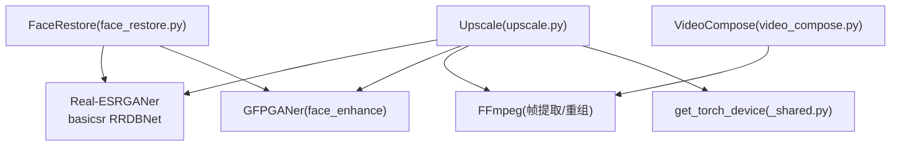
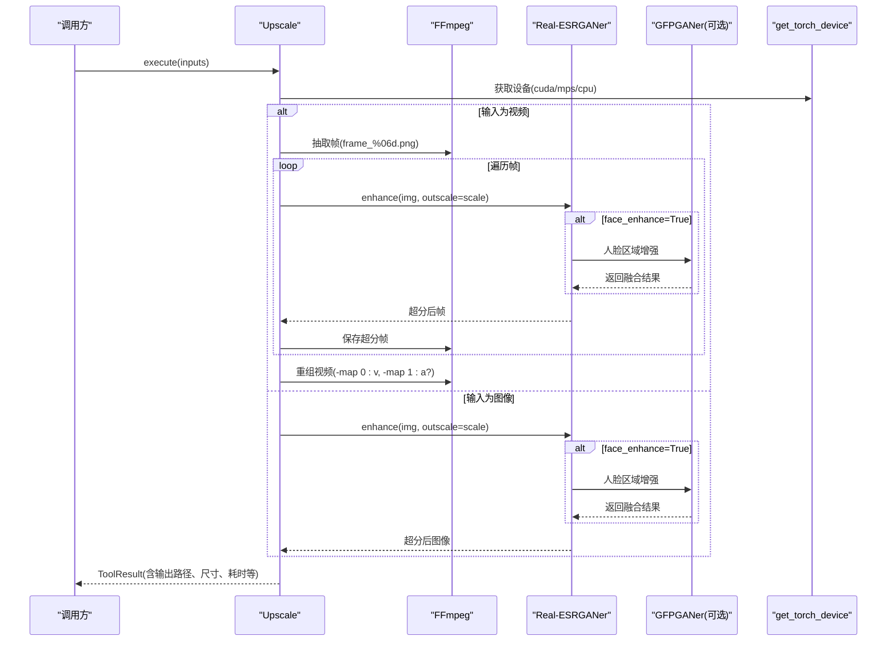
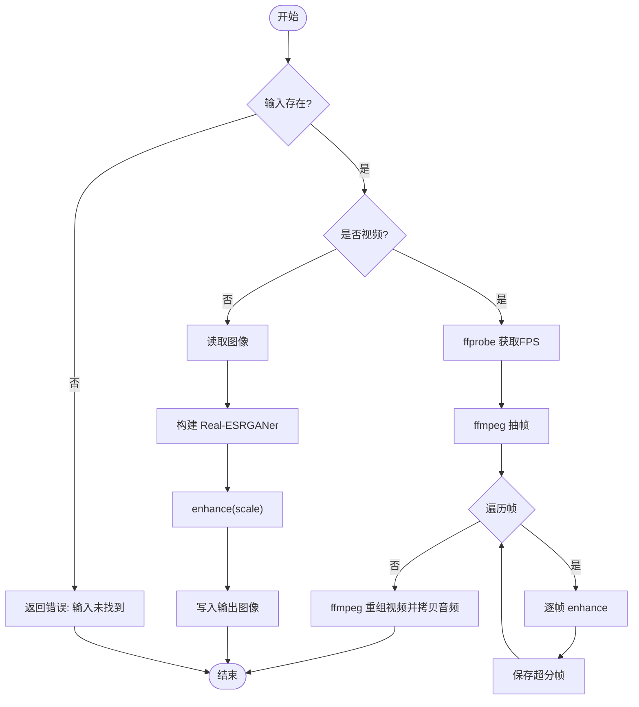
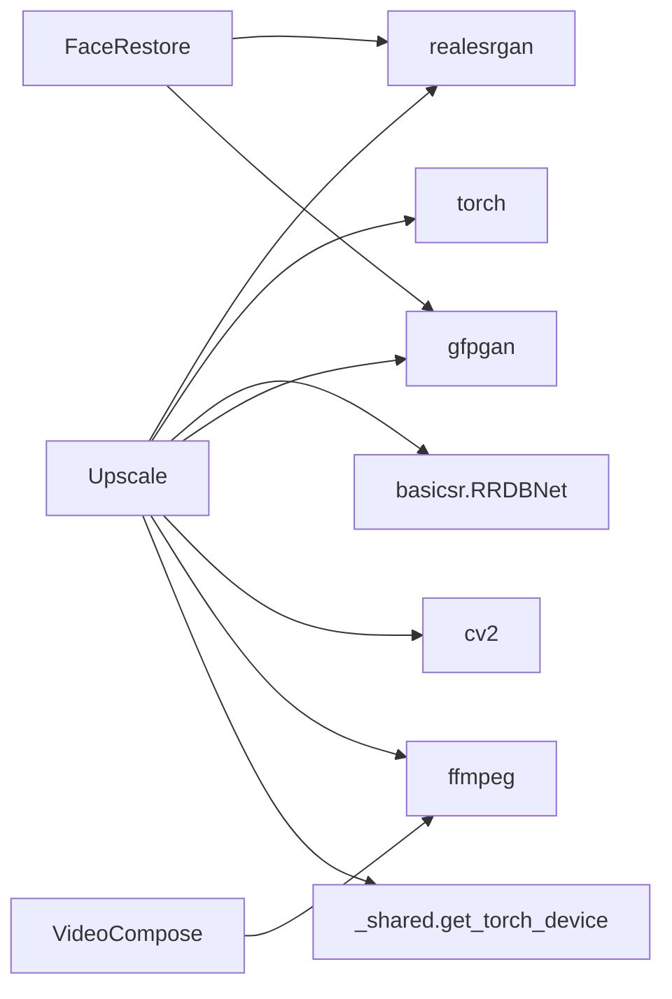

# 超分辨率增强

<cite>
**本文引用的文件**
- [upscale.py](file://tools/enhancement/upscale.py)
- [_shared.py](file://tools/video/_shared.py)
- [face_restore.py](file://tools/enhancement/face_restore.py)
- [video_compose.py](file://tools/video/video_compose.py)
- [test_mps_device.py](file://tests/tools/test_mps_device.py)
</cite>

## 目录
1. [简介](#简介)
2. [项目结构](#项目结构)
3. [核心组件](#核心组件)
4. [架构总览](#架构总览)
5. [详细组件分析](#详细组件分析)
6. [依赖关系分析](#依赖关系分析)
7. [性能考量](#性能考量)
8. [故障排查指南](#故障排查指南)
9. [结论](#结论)
10. [附录：API参考与使用示例](#附录api参考与使用示例)

## 简介
本技术文档聚焦于 OpenMontage 的超分辨率增强能力，围绕 Real-ESRGAN 算法在图像与视频上的实现进行系统化说明。内容涵盖：
- 支持的模型类型及其适用场景（RealESRGAN_x4plus、RealESRGAN_x4plus_anime_6B、RealESRNet_x4plus）
- 完整的 API 输入参数与输出格式
- 视频帧提取、单帧处理、音频重合成的完整工作流
- GPU/MPS/CPU 设备选择、内存管理与批处理优化策略
- 常见问题与排错建议

## 项目结构
OpenMontage 将超分辨率增强作为“增强工具”模块的一部分，核心逻辑位于 tools/enhancement 下，并通过统一的 BaseTool 接口暴露能力；设备选择与运行时环境由 tools/video/_shared.py 提供；视频合成与音频处理由 tools/video 下的工具协同完成。

图表来源
- [upscale.py:126-259](file://tools/enhancement/upscale.py#L126-L259)
- [_shared.py:249-279](file://tools/video/_shared.py#L249-L279)
- [video_compose.py:395-617](file://tools/video/video_compose.py#L395-L617)

章节来源
- [upscale.py:1-110](file://tools/enhancement/upscale.py#L1-L110)
- [_shared.py:249-279](file://tools/video/_shared.py#L249-L279)

## 核心组件
- Upscale（超分辨率增强）
  - 支持图像与视频的超分，内置三种模型配置，可选人脸增强与降噪强度
  - 视频路径通过 FFmpeg 抽帧、逐帧超分、再编码并保留原音频
  - 自动检测 CUDA/MPS/CPU 设备，按设备特性调整精度与分块推理
- FaceRestore（人脸修复）
  - 基于 CodeFormer/GFPGAN 的人脸恢复，可叠加背景 Real-ESRGAN 放大
- VideoCompose（视频合成）
  - 负责音视频封装、音轨拷贝或静音轨道注入等通用流程

章节来源
- [upscale.py:47-110](file://tools/enhancement/upscale.py#L47-L110)
- [face_restore.py:27-94](file://tools/enhancement/face_restore.py#L27-L94)
- [video_compose.py:362-617](file://tools/video/video_compose.py#L362-L617)

## 架构总览
下图展示了从输入到输出的端到端流程：输入文件被识别为图像或视频；图像直接走单图超分；视频则先抽帧，再对每帧执行超分，最后用 FFmpeg 重组并拷贝原音频。设备选择由共享函数统一决定，确保在不同硬件上获得最佳可用性与稳定性。

图表来源
- [upscale.py:126-259](file://tools/enhancement/upscale.py#L126-L259)
- [_shared.py:249-279](file://tools/video/_shared.py#L249-L279)

## 详细组件分析

### 组件A：Upscale（超分辨率增强）
- 功能要点
  - 模型选择：RealESRGAN_x4plus（通用）、RealESRGAN_x4plus_anime_6B（动漫/插画）、RealESRNet_x4plus（轻量快速）
  - 缩放比例：2x 或 4x
  - 人脸增强：启用后通过 GFPGAN 对人脸区域进行增强并回贴
  - 降噪强度：dni_weight 控制去噪程度
  - 设备适配：CUDA 使用半精度（half），MPS/CPU 使用全精度；非 CUDA 使用 tile 分块降低显存占用
- 关键流程
  - 图像：读取 -> 构建 upsampler -> enhance -> 写入
  - 视频：ffprobe 获取 FPS -> ffmpeg 抽帧 -> 逐帧 enhance -> ffmpeg 重组并拷贝音频
- 错误处理
  - 输入不存在、无法读取图像、命令执行失败均返回 ToolResult 错误信息
- 资源与稳定性
  - 声明 CPU/RAM/VRAM/Disk 资源需求，标记为实验性但确定性执行

图表来源
- [upscale.py:126-259](file://tools/enhancement/upscale.py#L126-L259)

章节来源
- [upscale.py:126-259](file://tools/enhancement/upscale.py#L126-L259)
- [upscale.py:265-337](file://tools/enhancement/upscale.py#L265-L337)
- [upscale.py:339-363](file://tools/enhancement/upscale.py#L339-L363)

### 组件B：FaceRestore（人脸修复）
- 功能要点
  - 支持 CodeFormer 与 GFPGAN 两种模型
  - 可选择是否同时放大背景（叠加 Real-ESRGAN 背景超分）
  - 设备选择与精度策略同 Upscale
- 典型用法
  - 低质量人脸恢复，保持身份一致性，可调节保真度与放大倍数

章节来源
- [face_restore.py:108-246](file://tools/enhancement/face_restore.py#L108-L246)

### 组件C：VideoCompose（视频合成）
- 功能要点
  - 检测源片段是否包含音轨，若无则注入静音立体声轨以保证拼接一致性
  - 统一封装输出，便于后续混音与导出

章节来源
- [video_compose.py:362-617](file://tools/video/video_compose.py#L362-L617)

## 依赖关系分析
- 外部库
  - realesrgan、torch、basicsr（RRDBNet）、gfpgan、opencv（cv2）、ffmpeg
- 内部依赖
  - get_torch_device 统一设备选择
  - BaseTool 抽象工具生命周期与结果封装
- 耦合与内聚
  - Upscale 高内聚地封装了模型加载、设备选择、帧处理与封装；对外仅暴露标准化输入/输出
  - FaceRestore 复用相同的设备与模型基础设施，形成良好复用

图表来源
- [upscale.py:16-26](file://tools/enhancement/upscale.py#L16-L26)
- [_shared.py:249-279](file://tools/video/_shared.py#L249-L279)

章节来源
- [upscale.py:16-26](file://tools/enhancement/upscale.py#L16-L26)
- [_shared.py:249-279](file://tools/video/_shared.py#L249-L279)

## 性能考量
- 设备选择与精度
  - CUDA：优先使用半精度（half）提升速度
  - MPS（Apple Silicon）：使用全精度，避免不稳定
  - CPU：全精度，必要时启用分块推理
- 分块推理（tile）
  - 非 CUDA 设备默认开启 tile=256，降低峰值显存/内存占用，避免进程崩溃
  - CUDA 设备关闭 tile，以单次推理换取更高吞吐
- 内存管理
  - 视频处理采用临时目录存放帧，处理完成后释放
  - 大分辨率视频建议合理设置 scale 与模型，避免显存溢出
- 批量处理
  - 当前实现为逐帧串行处理；可通过外部调度器并行多个独立任务以提升整体吞吐
  - 注意磁盘 I/O 与临时空间占用

章节来源
- [upscale.py:290-305](file://tools/enhancement/upscale.py#L290-L305)
- [upscale.py:222-259](file://tools/enhancement/upscale.py#L222-L259)
- [_shared.py:249-279](file://tools/video/_shared.py#L249-L279)

## 故障排查指南
- 常见错误
  - 输入路径不存在：检查 input_path 是否正确
  - 无法读取图像：确认图像格式与权限
  - FFmpeg 命令失败：检查系统是否安装 ffmpeg 且 PATH 正确
  - 模型下载失败：网络问题或权重不可达，需重试或更换网络
  - 显存不足：降低 scale、切换更轻量模型或启用分块推理
- 诊断步骤
  - 查看 ToolResult.error 字段定位具体异常
  - 在 MPS/CPU 上遇到崩溃时，优先尝试降低分辨率或关闭人脸增强
  - 使用 ffprobe 验证视频 FPS 与码率，确保重组参数一致

章节来源
- [upscale.py:126-173](file://tools/enhancement/upscale.py#L126-L173)
- [upscale.py:222-259](file://tools/enhancement/upscale.py#L222-L259)
- [upscale.py:339-363](file://tools/enhancement/upscale.py#L339-L363)

## 结论
OpenMontage 的超分辨率增强模块以 Real-ESRGAN 为核心，结合 GFPGAN 的人脸增强能力，提供了稳定、可扩展的图像与视频超分方案。通过统一的设备选择与分块推理策略，能够在不同硬件环境下取得良好的性能与稳定性。配合 FFmpeg 的视频处理链路，实现了端到端的视频超分与音频保留。

## 附录：API参考与使用示例

### API：Upscale
- 名称：upscale
- 能力：image_upscale、video_upscale、face_aware_upscale
- 运行环境：本地 GPU（CUDA/MPS）或 CPU 回退
- 依赖：python:realesrgan、python:torch、cmd:ffmpeg

输入参数
- input_path（必填）：输入图像或视频路径
- output_path（可选）：输出路径，默认在原文件名追加 _upscaled
- scale（可选）：2 或 4，默认 4
- model（可选）：
  - RealESRGAN_x4plus：通用照片/视频超分（默认）
  - RealESRGAN_x4plus_anime_6B：动漫/插画优化
  - RealESRNet_x4plus：轻量网络，更快但质量略低
- face_enhance（可选）：布尔值，默认 False，启用 GFPGAN 进行人脸增强
- denoise_strength（可选）：0.0~1.0，默认 0.5，控制去噪强度

输出数据
- input：输入路径
- output：输出路径
- scale：实际使用的缩放倍率
- model：使用的模型名
- face_enhance：是否启用人脸增强
- type：image 或 video
- 附加字段：
  - 图像：output_width、output_height
  - 视频：total_frames、fps
- artifacts：输出文件路径列表
- duration_seconds：处理耗时

使用示例
- 图像超分
  - 输入：{"input_path": "photo.jpg", "scale": 4, "model": "RealESRGAN_x4plus"}
  - 输出：ToolResult.success=True，data.type="image"，artifacts 包含输出图片
- 视频超分
  - 输入：{"input_path": "clip.mp4", "scale": 4, "model": "RealESRGAN_x4plus_anime_6B", "face_enhance": true}
  - 输出：ToolResult.success=True，data.type="video"，artifacts 包含输出视频，data.fps 与 data.total_frames 反映视频元信息

章节来源
- [upscale.py:72-110](file://tools/enhancement/upscale.py#L72-L110)
- [upscale.py:126-173](file://tools/enhancement/upscale.py#L126-L173)
- [upscale.py:179-200](file://tools/enhancement/upscale.py#L179-L200)
- [upscale.py:206-259](file://tools/enhancement/upscale.py#L206-L259)

### 设备选择与兼容性
- 设备优先级：CUDA > MPS（Apple Silicon，macOS >= 12.3）> CPU
- 精度策略：CUDA 使用 half；MPS/CPU 使用 full precision
- 分块推理：非 CUDA 设备启用 tile=256，减少内存峰值
- 兼容性保护：动态检测 RealESRGANer/GFPGANer 是否接受 device 参数，避免版本差异导致初始化失败

章节来源
- [_shared.py:249-279](file://tools/video/_shared.py#L249-L279)
- [upscale.py:290-309](file://tools/enhancement/upscale.py#L290-L309)
- [test_mps_device.py:209-279](file://tests/tools/test_mps_device.py#L209-L279)

### 视频处理工作流
- 帧提取：使用 FFmpeg 将视频拆分为 frame_%06d.png
- 单帧处理：逐帧调用 Real-ESRGANer.enhance，可选 GFPGAN 人脸增强
- 音频重合成：重组时使用 -map 0:v 与 -map 1:a? 拷贝原音频，若原视频无音频则可在上层合成器中注入静音轨
- 编码参数：libx264、CRF 18、yuv420p 像素格式

章节来源
- [upscale.py:222-259](file://tools/enhancement/upscale.py#L222-L259)
- [video_compose.py:395-617](file://tools/video/video_compose.py#L395-L617)