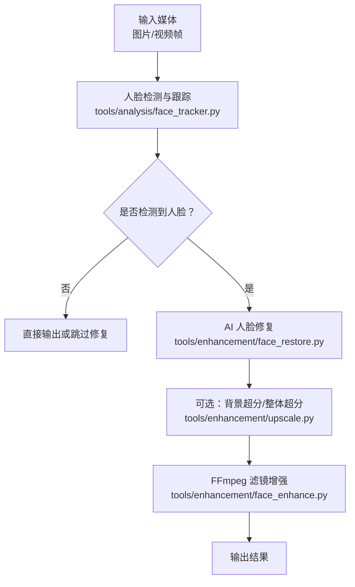
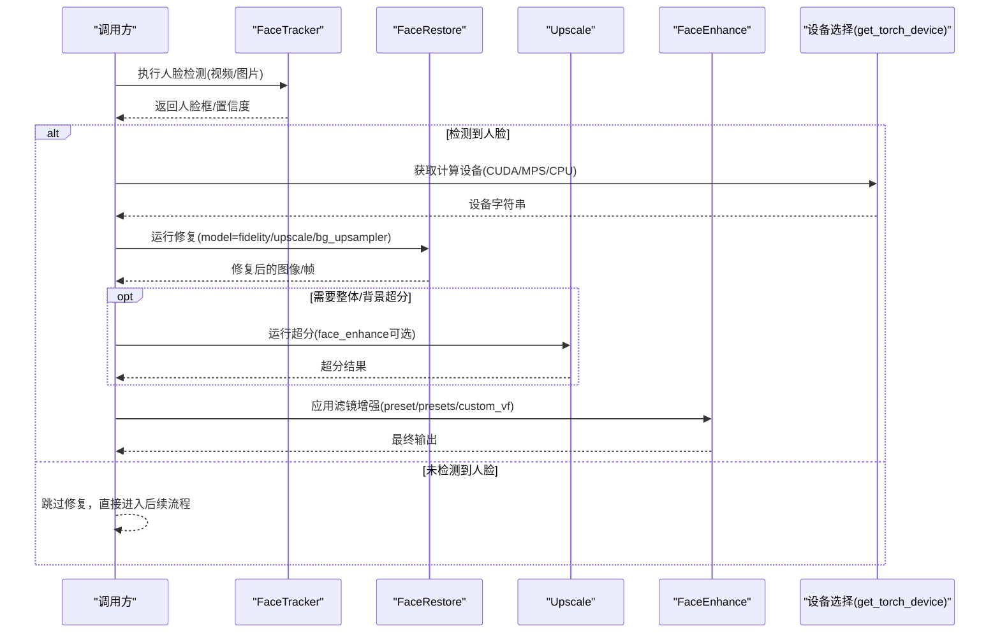
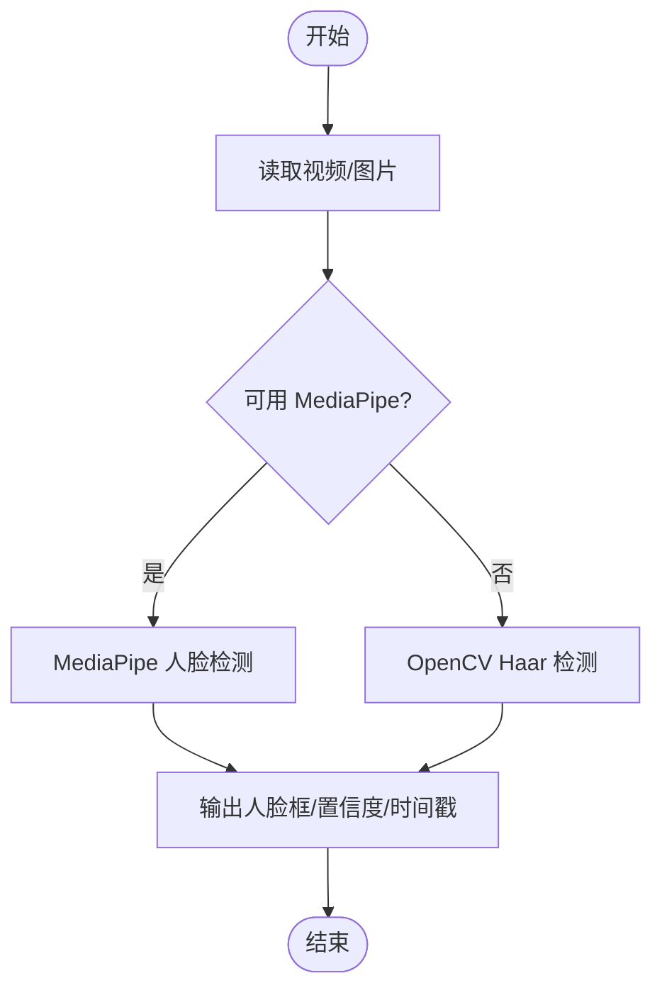
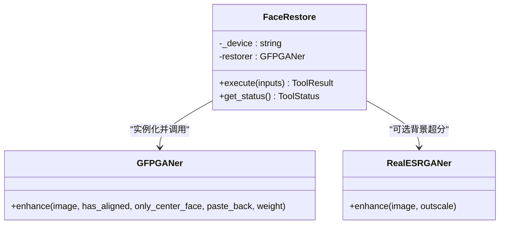
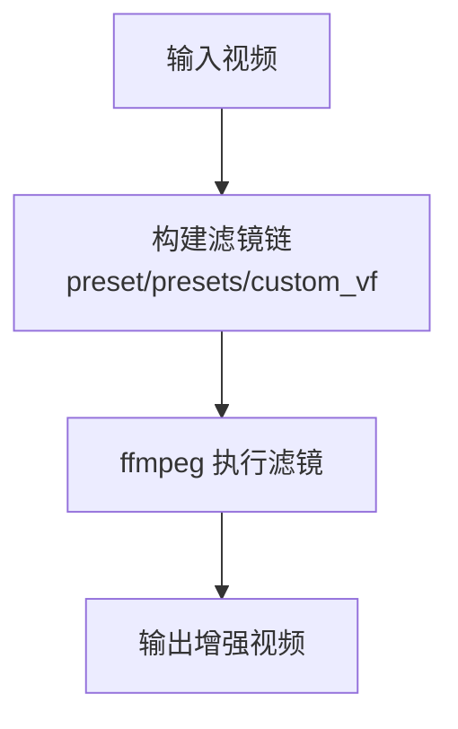
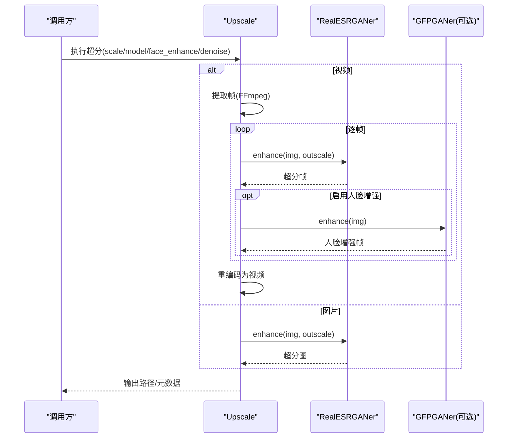
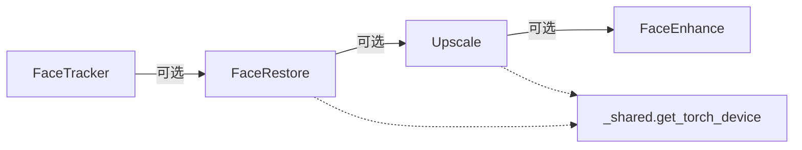

# 面部增强

<cite>
**本文引用的文件**
- [tools/enhancement/face_restore.py](file://tools/enhancement/face_restore.py)
- [tools/enhancement/face_enhance.py](file://tools/enhancement/face_enhance.py)
- [tools/enhancement/upscale.py](file://tools/enhancement/upscale.py)
- [tools/analysis/face_tracker.py](file://tools/analysis/face_tracker.py)
- [tools/video/_shared.py](file://tools/video/_shared.py)
- [skills/creative/face-restore-usage.md](file://skills/creative/face-restore-usage.md)
</cite>

## 目录
1. [简介](#简介)
2. [项目结构](#项目结构)
3. [核心组件](#核心组件)
4. [架构总览](#架构总览)
5. [详细组件分析](#详细组件分析)
6. [依赖关系分析](#依赖关系分析)
7. [性能与调优](#性能与调优)
8. [故障排查](#故障排查)
9. [结论](#结论)
10. [附录：API参考与使用示例](#附录api参考与使用示例)

## 简介
本技术文档聚焦 OpenMontage 的“面部增强”能力，涵盖从人脸检测、特征点定位到修复与增强的完整链路。系统提供两类互补工具：
- 基于 AI 模型的人脸修复（CodeFormer / GFPGAN），用于重建模糊、压缩失真或低分辨率的人脸细节；
- 基于 FFmpeg 滤镜链的人脸增强（皮肤平滑、锐化、色彩校正等），用于对质量尚可的视频进行后期润色。

此外，文档还说明如何与超分辨率（Real-ESRGAN）集成，以及如何在视频处理管线中组合这些能力，并给出 GPU/MPS/CPU 设备选择、内存优化与性能调优建议。

## 项目结构
与面部增强相关的代码主要分布在以下模块：
- tools/enhancement：人脸修复、人脸增强、图像/视频超分
- tools/analysis：人脸检测与跟踪（MediaPipe/OpenCV）
- tools/video/_shared：设备选择与通用工具函数
- skills/creative：面向使用者的技能指南与最佳实践

图表来源
- [tools/analysis/face_tracker.py:138-182](file://tools/analysis/face_tracker.py#L138-L182)
- [tools/enhancement/face_restore.py:108-245](file://tools/enhancement/face_restore.py#L108-L245)
- [tools/enhancement/upscale.py:126-173](file://tools/enhancement/upscale.py#L126-L173)
- [tools/enhancement/face_enhance.py:126-170](file://tools/enhancement/face_enhance.py#L126-L170)

章节来源
- [tools/enhancement/face_restore.py:1-246](file://tools/enhancement/face_restore.py#L1-L246)
- [tools/enhancement/face_enhance.py:1-194](file://tools/enhancement/face_enhance.py#L1-L194)
- [tools/enhancement/upscale.py:1-363](file://tools/enhancement/upscale.py#L1-L363)
- [tools/analysis/face_tracker.py:47-283](file://tools/analysis/face_tracker.py#L47-L283)
- [tools/video/_shared.py:249-279](file://tools/video/_shared.py#L249-L279)
- [skills/creative/face-restore-usage.md:1-97](file://skills/creative/face-restore-usage.md#L1-L97)

## 核心组件
- 人脸修复（FaceRestore）：封装 CodeFormer/GFPGAN，支持保真度控制、人脸放大、可选背景超分。
- 人脸增强（FaceEnhance）：基于 FFmpeg 滤镜链的皮肤平滑、锐化、亮度和对比度调整、降噪、预设组合。
- 超分辨率（Upscale）：基于 Real-ESRGAN 的图片/视频超分，可叠加 GFPGAN 人脸增强。
- 人脸检测与跟踪（FaceTracker）：优先 MediaPipe，回退 OpenCV Haar，输出每帧人脸框与置信度。
- 设备选择（get_torch_device）：自动选择 CUDA > MPS > CPU，供各工具统一使用。

章节来源
- [tools/enhancement/face_restore.py:27-99](file://tools/enhancement/face_restore.py#L27-L99)
- [tools/enhancement/face_enhance.py:70-124](file://tools/enhancement/face_enhance.py#L70-L124)
- [tools/enhancement/upscale.py:47-109](file://tools/enhancement/upscale.py#L47-L109)
- [tools/analysis/face_tracker.py:47-74](file://tools/analysis/face_tracker.py#L47-L74)
- [tools/video/_shared.py:249-279](file://tools/video/_shared.py#L249-L279)

## 架构总览
下图展示一次典型“人脸修复+增强+超分”的处理流程，包括设备选择、模型加载、推理与后处理。

图表来源
- [tools/analysis/face_tracker.py:138-182](file://tools/analysis/face_tracker.py#L138-L182)
- [tools/enhancement/face_restore.py:108-245](file://tools/enhancement/face_restore.py#L108-L245)
- [tools/enhancement/upscale.py:126-173](file://tools/enhancement/upscale.py#L126-L173)
- [tools/enhancement/face_enhance.py:126-170](file://tools/enhancement/face_enhance.py#L126-L170)
- [tools/video/_shared.py:249-279](file://tools/video/_shared.py#L249-L279)

## 详细组件分析

### 人脸检测与跟踪（FaceTracker）
- 算法与实现
  - 首选 MediaPipe FaceDetection，按采样帧率抽取帧，取最高置信度检测结果，输出归一化边界框与时间戳。
  - 无 MediaPipe 时回退至 OpenCV Haar Cascade，参数可调。
- 关键参数
  - sample_fps：采样频率，越低越快但精度下降。
  - min_detection_confidence：最低置信度阈值。
- 输出
  - JSON 包含视频宽高、FPS、时长、采样帧数、检测到的脸数量及每帧人脸信息。

图表来源
- [tools/analysis/face_tracker.py:184-251](file://tools/analysis/face_tracker.py#L184-L251)
- [tools/analysis/face_tracker.py:253-283](file://tools/analysis/face_tracker.py#L253-L283)

章节来源
- [tools/analysis/face_tracker.py:47-283](file://tools/analysis/face_tracker.py#L47-L283)

### 人脸修复（FaceRestore）
- 模型与能力
  - 支持 CodeFormer（默认，可调节 fidelity）与 GFPGAN。
  - 内置人脸检测与对齐（由底层库完成），支持仅中心脸/全脸、粘贴回原图。
  - 可选背景超分（Real-ESRGAN）。
- 关键参数
  - model：CodeFormer 或 GFPGAN。
  - fidelity：CodeFormer 保真度（0=最大增强，1=最小改动）。
  - upscale：人脸放大倍数。
  - bg_upsampler：是否启用背景超分。
- 设备与依赖
  - 通过 get_torch_device 选择 CUDA/MPS/CPU。
  - 依赖 gfpgan、torch、opencv-python；可选 basicsr/realesrgan。

图表来源
- [tools/enhancement/face_restore.py:101-245](file://tools/enhancement/face_restore.py#L101-L245)

章节来源
- [tools/enhancement/face_restore.py:27-245](file://tools/enhancement/face_restore.py#L27-L245)
- [tools/video/_shared.py:249-279](file://tools/video/_shared.py#L249-L279)

### 人脸增强（FaceEnhance）
- 能力与策略
  - 基于 FFmpeg 滤镜链：皮肤平滑、边缘锐化、亮度/对比度曲线、暖/冷色调、降噪等。
  - 支持单 preset、多 presets 串联、自定义 vf 字符串。
- 适用场景
  - 人脸已清晰但需“抛光”的视频片段（如说话人镜头）。
- 资源与稳定性
  - 纯 CPU 滤镜，无需 GPU；确定性执行。

图表来源
- [tools/enhancement/face_enhance.py:25-67](file://tools/enhancement/face_enhance.py#L25-L67)
- [tools/enhancement/face_enhance.py:126-170](file://tools/enhancement/face_enhance.py#L126-L170)

章节来源
- [tools/enhancement/face_enhance.py:1-194](file://tools/enhancement/face_enhance.py#L1-L194)

### 超分辨率（Upscale）
- 能力与策略
  - 基于 Real-ESRGAN 的图片/视频超分（2x/4x），支持动漫/通用模型。
  - 视频处理：逐帧提取→超分→重新合成（保留音频）。
  - 可选 face_enhance：在超分过程中叠加 GFPGAN 人脸增强。
- 内存与性能
  - CUDA 下使用整图推理；CPU/MPS 使用 tile 分块降低峰值内存。
  - 半精度 half 仅在 CUDA 开启。

图表来源
- [tools/enhancement/upscale.py:126-173](file://tools/enhancement/upscale.py#L126-L173)
- [tools/enhancement/upscale.py:206-259](file://tools/enhancement/upscale.py#L206-L259)
- [tools/enhancement/upscale.py:265-337](file://tools/enhancement/upscale.py#L265-L337)

章节来源
- [tools/enhancement/upscale.py:1-363](file://tools/enhancement/upscale.py#L1-L363)

### 设备选择与后端
- get_torch_device：自动选择 CUDA > MPS > CPU，确保不同硬件一致的设备行为。
- 各工具内部使用该函数决定 torch.device 与半精度策略。

章节来源
- [tools/video/_shared.py:249-279](file://tools/video/_shared.py#L249-L279)

## 依赖关系分析
- 外部依赖
  - 人脸修复：gfpgan、torch、opencv-python；可选 basicsr/realesrgan（背景超分）。
  - 人脸增强：ffmpeg（命令行工具）。
  - 超分辨率：realesrgan、torch、ffmpeg；可选 gfpgan（叠加人脸增强）。
  - 人脸检测：mediapipe（首选）、opencv-python（回退）。
- 内部耦合
  - 所有深度学习相关工具通过 _shared.get_torch_device 统一设备选择。
  - Upscale 可在增强阶段复用 GFPGANer，形成“超分+人脸修复”的组合。

图表来源
- [tools/enhancement/face_restore.py:108-245](file://tools/enhancement/face_restore.py#L108-L245)
- [tools/enhancement/upscale.py:126-173](file://tools/enhancement/upscale.py#L126-L173)
- [tools/video/_shared.py:249-279](file://tools/video/_shared.py#L249-L279)

章节来源
- [tools/enhancement/face_restore.py:1-246](file://tools/enhancement/face_restore.py#L1-L246)
- [tools/enhancement/upscale.py:1-363](file://tools/enhancement/upscale.py#L1-L363)
- [tools/enhancement/face_enhance.py:1-194](file://tools/enhancement/face_enhance.py#L1-L194)
- [tools/analysis/face_tracker.py:1-283](file://tools/analysis/face_tracker.py#L1-L283)
- [tools/video/_shared.py:1-796](file://tools/video/_shared.py#L1-L796)

## 性能与调优
- 设备选择
  - 优先 CUDA，其次 MPS（Apple Silicon），最后 CPU。
  - 在 CUDA 上可开启半精度（half=True）以加速 Real-ESRGAN/FaceRestore。
- 内存优化
  - 超分在 CPU/MPS 上使用 tile 分块（tile=256）避免 OOM；CUDA 走整图路径更快。
  - 视频超分先提取帧到临时目录，逐帧处理后再合并，降低常驻内存。
- 采样与速度
  - 人脸检测可通过降低 sample_fps 提升速度，代价是精度略降。
  - 人脸修复可先用关键帧测试 fidelity/upscale 参数，再批量处理。
- 管线顺序
  - 推荐顺序：先修复（重建细节）→ 再增强（滤镜抛光）→ 必要时超分。
  - 若同时需要背景与人脸提升，可使用 Upscale.face_enhance 或在 FaceRestore 中启用 bg_upsampler。

章节来源
- [tools/video/_shared.py:249-279](file://tools/video/_shared.py#L249-L279)
- [tools/enhancement/upscale.py:265-337](file://tools/enhancement/upscale.py#L265-L337)
- [tools/analysis/face_tracker.py:138-182](file://tools/analysis/face_tracker.py#L138-L182)
- [skills/creative/face-restore-usage.md:42-97](file://skills/creative/face-restore-usage.md#L42-L97)

## 故障排查
- 依赖缺失
  - 人脸修复：缺少 gfpgan/torch → 安装依赖后重试。
  - 人脸增强：缺少 ffmpeg → 安装 ffmpeg 并确保 PATH。
  - 超分辨率：缺少 realesrgan/torch/ffmpeg → 安装后重试。
  - 人脸检测：缺少 mediapipe → 降级为 OpenCV Haar；缺少 opencv-python → 安装。
- 设备问题
  - CUDA/MPS 不可用将回退 CPU，速度显著下降；确认驱动/环境正确。
- 常见错误
  - 输入不存在 → 检查路径。
  - 模型加载失败 → 检查网络下载或本地权重路径。
  - 恢复结果为空 → 检查输入图像可读性与模型配置。
  - 超分 OOM → 降低分辨率、减少 tile 外尺寸或切换 CPU/MPS 分块模式。

章节来源
- [tools/enhancement/face_restore.py:101-134](file://tools/enhancement/face_restore.py#L101-L134)
- [tools/enhancement/face_enhance.py:126-156](file://tools/enhancement/face_enhance.py#L126-L156)
- [tools/enhancement/upscale.py:115-156](file://tools/enhancement/upscale.py#L115-L156)
- [tools/analysis/face_tracker.py:131-162](file://tools/analysis/face_tracker.py#L131-L162)

## 结论
OpenMontage 的面部增强方案将“AI 修复”和“滤镜增强”有机结合：前者负责重建退化人脸的细节与身份一致性，后者负责视觉层面的抛光与风格化。配合超分辨率，可实现端到端的高质量人像产出。通过统一的设备选择与合理的管线顺序，可在多种硬件环境下获得稳定且高效的体验。

## 附录：API参考与使用示例

### API 参考

#### FaceRestore（人脸修复）
- 输入
  - input_path：图片或视频帧路径（必填）
  - output_path：输出路径（可选，默认同名加后缀）
  - model：CodeFormer 或 GFPGAN（默认 CodeFormer）
  - fidelity：CodeFormer 保真度（0~1，默认 0.5）
  - upscale：人脸放大倍数（默认 2）
  - bg_upsampler：是否启用背景超分（默认 False）
- 输出
  - success、error、data（含 faces_detected、model、upscale、fidelity、bg_upsampler 等）
  - artifacts：输出文件路径列表
  - duration_seconds：耗时
- 设备与依赖
  - 自动选择 CUDA/MPS/CPU；依赖 gfpgan、torch、opencv-python；可选 realesrgan/basicsr

章节来源
- [tools/enhancement/face_restore.py:53-99](file://tools/enhancement/face_restore.py#L53-L99)
- [tools/enhancement/face_restore.py:108-245](file://tools/enhancement/face_restore.py#L108-L245)

#### FaceEnhance（人脸增强）
- 输入
  - input_path：视频路径（必填）
  - output_path：输出路径（可选）
  - preset：预设名称（soft_skin/sharpen/brighten/contrast_boost/warm/cool/denoise/talking_head_standard 等）
  - presets：多个预设名数组（顺序执行）
  - custom_vf：自定义 FFmpeg 滤镜字符串（高级）
  - codec/crf：编码器与质量参数
- 输出
  - success、error、data（含 filter、preset）
  - artifacts：输出文件路径
  - duration_seconds：耗时
- 设备与依赖
  - 纯 CPU 滤镜；依赖 ffmpeg

章节来源
- [tools/enhancement/face_enhance.py:93-124](file://tools/enhancement/face_enhance.py#L93-L124)
- [tools/enhancement/face_enhance.py:126-170](file://tools/enhancement/face_enhance.py#L126-L170)

#### Upscale（超分辨率）
- 输入
  - input_path：图片/视频路径（必填）
  - output_path：输出路径（可选）
  - scale：2 或 4（默认 4）
  - model：RealESRGAN_x4plus / RealESRGAN_x4plus_anime_6B / RealESRNet_x4plus
  - face_enhance：是否在超分中叠加 GFPGAN 人脸增强（默认 False）
  - denoise_strength：去噪强度（0~1，默认 0.5）
- 输出
  - success、error、data（含 scale、model、type、fps、输出宽高等）
  - artifacts：输出文件路径
  - duration_seconds：耗时
- 设备与依赖
  - 自动选择 CUDA/MPS/CPU；依赖 realesrgan、torch、ffmpeg；可选 gfpgan

章节来源
- [tools/enhancement/upscale.py:72-109](file://tools/enhancement/upscale.py#L72-L109)
- [tools/enhancement/upscale.py:126-173](file://tools/enhancement/upscale.py#L126-L173)
- [tools/enhancement/upscale.py:265-337](file://tools/enhancement/upscale.py#L265-L337)

#### FaceTracker（人脸检测与跟踪）
- 输入
  - input_path：视频路径（必填）
  - output_path：JSON 输出路径（可选，默认同路径 .faces.json）
  - sample_fps：采样 FPS（默认 5）
  - min_detection_confidence：最低置信度（默认 0.5）
- 输出
  - success、error、data（含 video_width/height/fps/duration/frames_sampled/faces_detected/method）
  - artifacts：输出 JSON 路径
  - duration_seconds：耗时

章节来源
- [tools/analysis/face_tracker.py:54-74](file://tools/analysis/face_tracker.py#L54-L74)
- [tools/analysis/face_tracker.py:138-182](file://tools/analysis/face_tracker.py#L138-L182)

### 使用示例与工作流

- 旧素材修复
  - 流程：face_restore(fidelity≈0.3) → color_grade → compose
  - 适用：历史影像、严重压缩/模糊的人脸
- 摄像头清理
  - 流程：face_restore(fidelity≈0.7) → face_enhance(talking_head_standard) → compose
  - 适用：现代但低质量的摄像头素材
- 低分辨率人脸+背景整体提升
  - 流程：face_restore(bg_upsampler=true) → compose
  - 适用：人脸与背景均需改善的场景
- 静态人像转 Talking Head
  - 流程：face_restore → talking_head(SadTalker)
  - 适用：将高质量修复后的源图作为动画输入

章节来源
- [skills/creative/face-restore-usage.md:42-97](file://skills/creative/face-restore-usage.md#L42-L97)

### 效果评估与质量检查清单
- 修复前后对比：更清晰、干净，且人物身份保持一致
- 无幻觉特征：无多余眼睛、不自然的皮肤纹理或牙齿伪影
- 皮肤质感自然：不过度平滑
- 视频一致性：跨帧无闪烁或质量抖动

章节来源
- [skills/creative/face-restore-usage.md:76-97](file://skills/creative/face-restore-usage.md#L76-L97)