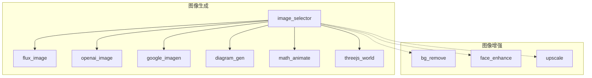
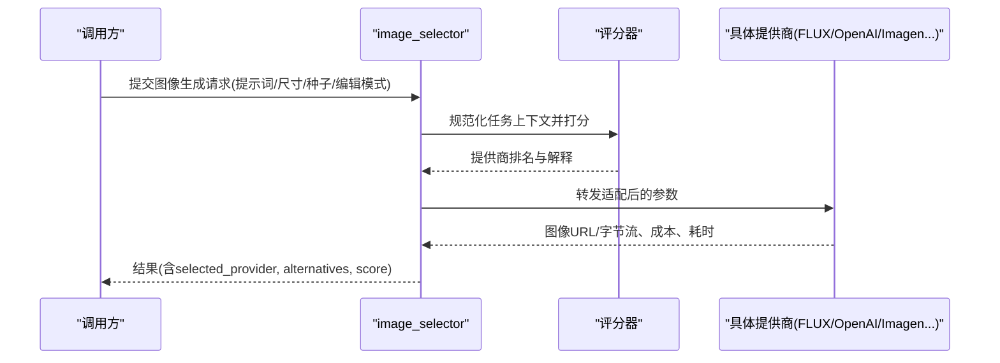
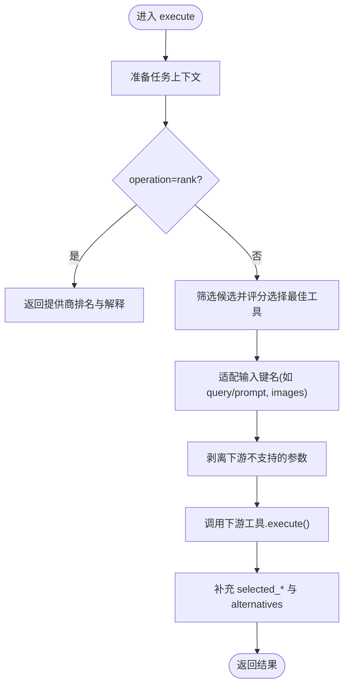
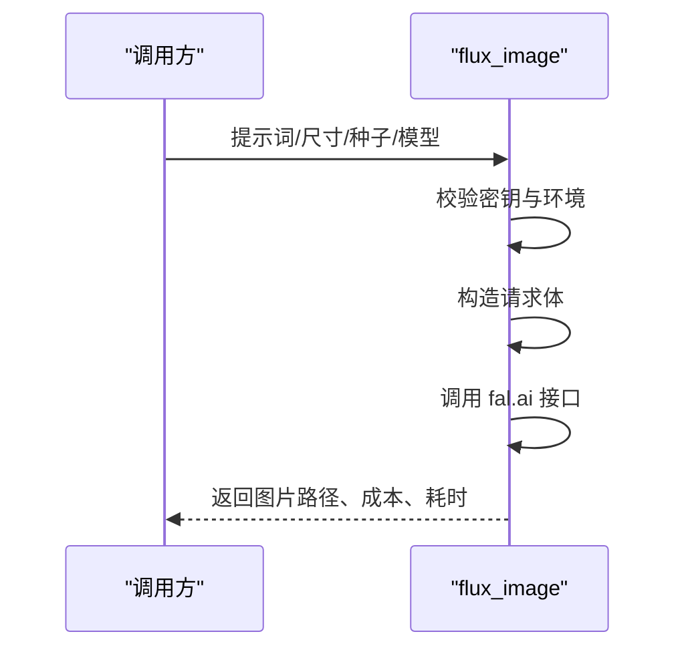
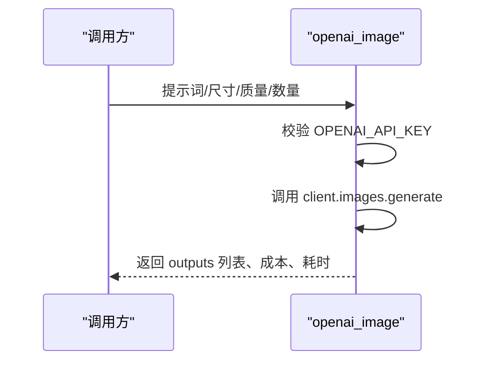
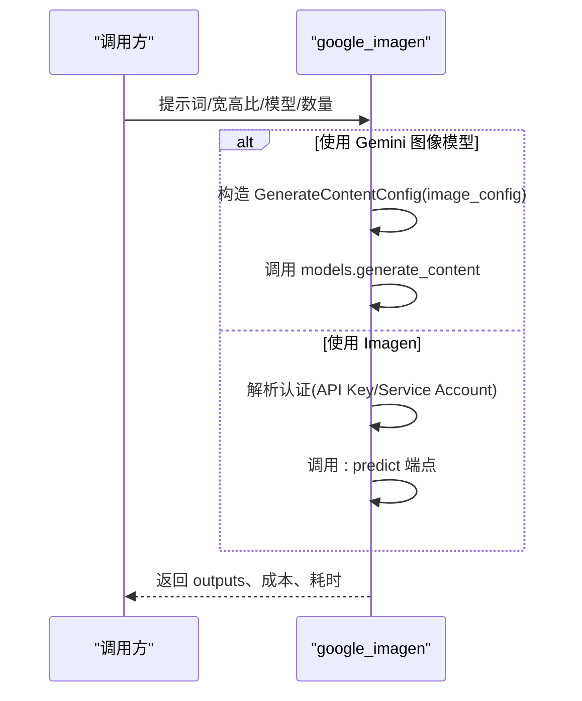
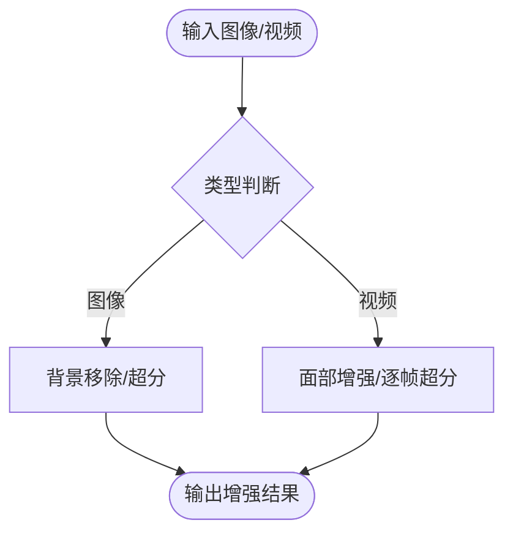
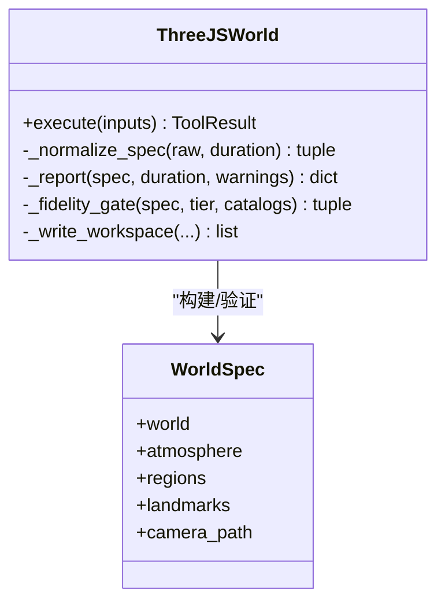
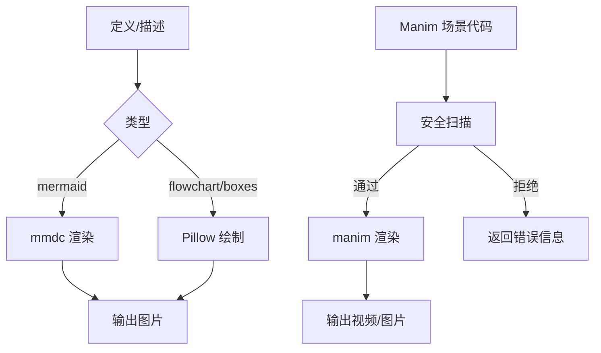
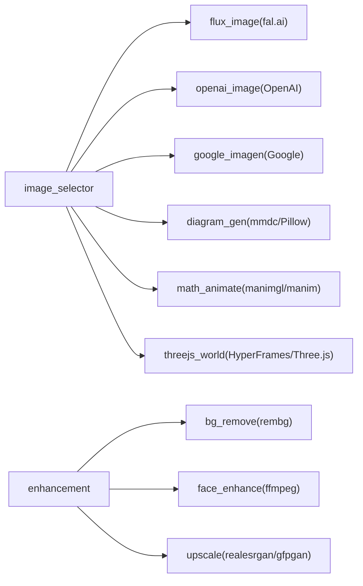

# 图像处理

<cite>
**本文引用的文件**
- [README.md](file://README.md)
- [PROVIDERS.md](file://docs/PROVIDERS.md)
- [image_selector.py](file://tools/graphics/image_selector.py)
- [flux_image.py](file://tools/graphics/flux_image.py)
- [openai_image.py](file://tools/graphics/openai_image.py)
- [google_imagen.py](file://tools/graphics/google_imagen.py)
- [bg_remove.py](file://tools/enhancement/bg_remove.py)
- [face_enhance.py](file://tools/enhancement/face_enhance.py)
- [upscale.py](file://tools/enhancement/upscale.py)
- [threejs_world.py](file://tools/graphics/threejs_world.py)
- [math_animate.py](file://tools/graphics/math_animate.py)
- [diagram_gen.py](file://tools/graphics/diagram_gen.py)
</cite>

## 目录
1. [简介](#简介)
2. [项目结构](#项目结构)
3. [核心组件](#核心组件)
4. [架构总览](#架构总览)
5. [详细组件分析](#详细组件分析)
6. [依赖关系分析](#依赖关系分析)
7. [性能与质量优化](#性能与质量优化)
8. [故障排查指南](#故障排查指南)
9. [结论](#结论)
10. [附录：API参考与使用示例](#附录api参考与使用示例)

## 简介
本技术文档聚焦 OpenMontage 的图像处理模块，覆盖以下目标：
- 15+ 图像生成提供商的统一接入与选择策略（FLUX、Google Imagen、GPT Image 2 等）
- 图像编辑能力：背景移除、面部增强、超分辨率等
- 3D 世界生成与 Three.js 工作区编排
- 图表生成与数学动画（ManimCE）
- 图像质量评估与优化技巧
- 完整 API 参考与从基础到高级的使用示例

OpenMontage 通过工具注册表自动发现能力，并以“评分器 + 路由”的方式在多种提供商之间智能选择，同时提供本地免费路径（如 Manim、Remotion/HyperFrames）与云端付费能力的统一入口。

**章节来源**
- [README.md:450-475](file://README.md#L450-L475)
- [PROVIDERS.md:282-340](file://docs/PROVIDERS.md#L282-L340)

## 项目结构
与图像处理相关的代码主要分布在 tools/graphics 与 tools/enhancement 两个目录：
- tools/graphics：图像生成、图表、数学动画、Three.js 世界构建
- tools/enhancement：背景移除、面部增强、超分辨率
- tools/graphics/image_selector.py：跨提供商的统一选择器与路由

**图示来源**
- [image_selector.py:15-467](file://tools/graphics/image_selector.py#L15-L467)
- [flux_image.py:24-165](file://tools/graphics/flux_image.py#L24-L165)
- [openai_image.py:25-184](file://tools/graphics/openai_image.py#L25-L184)
- [google_imagen.py:54-397](file://tools/graphics/google_imagen.py#L54-L397)
- [diagram_gen.py:28-352](file://tools/graphics/diagram_gen.py#L28-L352)
- [math_animate.py:84-495](file://tools/graphics/math_animate.py#L84-L495)
- [threejs_world.py:75-733](file://tools/graphics/threejs_world.py#L75-L733)
- [bg_remove.py:27-162](file://tools/enhancement/bg_remove.py#L27-L162)
- [face_enhance.py:70-194](file://tools/enhancement/face_enhance.py#L70-L194)
- [upscale.py:47-363](file://tools/enhancement/upscale.py#L47-L363)

**章节来源**
- [README.md:450-475](file://README.md#L450-L475)

## 核心组件
- 图像选择器 image_selector：自动发现并路由到最佳提供商；支持“生成/编辑”模式、多参考图、自定义工作流（ComfyUI）、模型白名单与偏好路由。
- 提供商实现：
  - FLUX via fal.ai：高质量通用图像生成
  - OpenAI GPT Image 2：复杂指令、文本渲染、多图输出
  - Google Imagen：Imagen 4 / Gemini 图像模型，多宽高比
- 图像增强：
  - bg_remove：基于 rembg 的背景移除与透明合成
  - face_enhance：FFmpeg 滤镜链进行皮肤平滑、锐化、调色
  - upscale：Real-ESRGAN/GFPGAN 图像/视频超分
- 专业图形：
  - diagram_gen：Mermaid/Pillow 图表生成
  - math_animate：ManimCE 数学动画
  - threejs_world：语义化 3D 世界构建与 HyperFrames 工作区

**章节来源**
- [image_selector.py:15-467](file://tools/graphics/image_selector.py#L15-L467)
- [flux_image.py:24-165](file://tools/graphics/flux_image.py#L24-L165)
- [openai_image.py:25-184](file://tools/graphics/openai_image.py#L25-L184)
- [google_imagen.py:54-397](file://tools/graphics/google_imagen.py#L54-L397)
- [bg_remove.py:27-162](file://tools/enhancement/bg_remove.py#L27-L162)
- [face_enhance.py:70-194](file://tools/enhancement/face_enhance.py#L70-L194)
- [upscale.py:47-363](file://tools/enhancement/upscale.py#L47-L363)
- [diagram_gen.py:28-352](file://tools/graphics/diagram_gen.py#L28-L352)
- [math_animate.py:84-495](file://tools/graphics/math_animate.py#L84-L495)
- [threejs_world.py:75-733](file://tools/graphics/threejs_world.py#L75-L733)

## 架构总览
OpenMontage 的图像管线采用“选择器 + 提供商”解耦设计：
- 调用方仅调用 image_selector，传入任务上下文与参数
- 选择器动态发现所有具备 image_generation 能力的工具
- 通过评分器对候选提供商打分，结合用户偏好与可用性选择最优工具
- 将标准化后的输入转发给具体提供商执行，返回结果与成本、耗时、备选信息等元数据

**图示来源**
- [image_selector.py:218-332](file://tools/graphics/image_selector.py#L218-L332)
- [flux_image.py:97-165](file://tools/graphics/flux_image.py#L97-L165)
- [openai_image.py:126-184](file://tools/graphics/openai_image.py#L126-L184)
- [google_imagen.py:281-397](file://tools/graphics/google_imagen.py#L281-L397)

**章节来源**
- [image_selector.py:185-332](file://tools/graphics/image_selector.py#L185-L332)

## 详细组件分析

### 图像选择器 image_selector
- 自动发现：扫描注册表中 capability="image_generation" 的工具
- 路由策略：
  - 支持 preferred_provider 与 allowed_providers 约束
  - 支持 generation_mode=edit 时过滤出支持图像编辑的提供商
  - 支持 workflow_json/workflow_path/output_node 走 ComfyUI 自定义工作流
- 输入归一化：
  - 将 selector 的 prompt/query、images/images_urls/image_paths 等字段映射到下游工具的 input_schema
  - 剥离下游不支持的 selector-only 字段
- 输出增强：
  - 记录 selected_tool、selected_provider、provider_score、alternatives_considered、agent_skills 等

**图示来源**
- [image_selector.py:218-332](file://tools/graphics/image_selector.py#L218-L332)
- [image_selector.py:334-467](file://tools/graphics/image_selector.py#L334-L467)

**章节来源**
- [image_selector.py:15-467](file://tools/graphics/image_selector.py#L15-L467)

### FLUX 图像生成（fal.ai）
- 能力：text_to_image、negative_prompt、seed、自定义尺寸
- 成本估算：按模型区分 pro/dev 定价
- 执行流程：构造 payload → POST fal.run/fal-ai/{model} → 下载图片 → 落盘

**图示来源**
- [flux_image.py:97-165](file://tools/graphics/flux_image.py#L97-L165)

**章节来源**
- [flux_image.py:24-165](file://tools/graphics/flux_image.py#L24-L165)

### OpenAI GPT Image 2
- 能力：复杂指令遵循、文本渲染、多图输出（n≤4）
- 成本估算：按 quality 档位计算单图成本
- 执行流程：初始化客户端 → images.generate → 解码 base64 → 写入多个输出文件

**图示来源**
- [openai_image.py:126-184](file://tools/graphics/openai_image.py#L126-L184)

**章节来源**
- [openai_image.py:25-184](file://tools/graphics/openai_image.py#L25-L184)

### Google Imagen（Imagen 4 / Gemini 图像）
- 能力：多宽高比、Imagen 4 或 Gemini 图像模型
- 认证：AI Studio API Key 或 Vertex AI 服务账号
- 执行流程：
  - Gemini 图像：通过 generate_content + image_config
  - Imagen：根据认证选择 AIP 或 Generative Language predict 端点

**图示来源**
- [google_imagen.py:209-397](file://tools/graphics/google_imagen.py#L209-L397)

**章节来源**
- [google_imagen.py:54-397](file://tools/graphics/google_imagen.py#L54-L397)

### 图像编辑与增强
- 背景移除（bg_remove）：rembg/U2Net，支持 alpha matting 与替换背景色
- 面部增强（face_enhance）：FFmpeg 滤镜链（smartblur/unsharp/colorbalance/hqdn3d），支持预设组合
- 超分辨率（upscale）：Real-ESRGAN/GFPGAN，支持图像与视频帧级放大，可选人脸增强与降噪

**图示来源**
- [bg_remove.py:99-162](file://tools/enhancement/bg_remove.py#L99-L162)
- [face_enhance.py:126-194](file://tools/enhancement/face_enhance.py#L126-L194)
- [upscale.py:126-363](file://tools/enhancement/upscale.py#L126-L363)

**章节来源**
- [bg_remove.py:27-162](file://tools/enhancement/bg_remove.py#L27-L162)
- [face_enhance.py:70-194](file://tools/enhancement/face_enhance.py#L70-L194)
- [upscale.py:47-363](file://tools/enhancement/upscale.py#L47-L363)

### 3D 世界生成与 Three.js 集成
- 功能：语义区域规划、程序化地形、地标放置、相机飞行路径、生产质量门禁
- 输出：可编辑的 HyperFrames/Three.js 工作区（index.html、world.json、asset-catalog-index.json 等）
- 质量门禁：blockout vs production，要求资产清单、材质层数、类别多样性等

**图示来源**
- [threejs_world.py:75-733](file://tools/graphics/threejs_world.py#L75-L733)

**章节来源**
- [threejs_world.py:75-733](file://tools/graphics/threejs_world.py#L75-L733)

### 图表生成与数学动画
- 图表生成（diagram_gen）：Mermaid CLI 渲染流程图/时序图等；Pillow 回退绘制框图
- 数学动画（math_animate）：ManimCE 渲染 Python 场景代码，内置安全扫描（阻止危险导入/反射/系统调用）

**图示来源**
- [diagram_gen.py:121-352](file://tools/graphics/diagram_gen.py#L121-L352)
- [math_animate.py:208-495](file://tools/graphics/math_animate.py#L208-L495)

**章节来源**
- [diagram_gen.py:28-352](file://tools/graphics/diagram_gen.py#L28-L352)
- [math_animate.py:84-495](file://tools/graphics/math_animate.py#L84-L495)

## 依赖关系分析
- 选择器与提供商：松耦合，新增提供商只需实现 BaseTool 并声明 capability="image_generation"
- 外部依赖：
  - fal.ai、OpenAI、Google Generative AI/Vertex AI
  - rembg、Pillow、FFmpeg、ManimCE、Real-ESRGAN/GFPGAN
- 运行时：
  - API 型：FLUX、OpenAI、Google Imagen
  - 本地型：Manim、Remotion/HyperFrames（渲染）、FFmpeg、Real-ESRGAN

**图示来源**
- [image_selector.py:185-332](file://tools/graphics/image_selector.py#L185-L332)
- [flux_image.py:35-80](file://tools/graphics/flux_image.py#L35-L80)
- [openai_image.py:36-91](file://tools/graphics/openai_image.py#L36-L91)
- [google_imagen.py:65-145](file://tools/graphics/google_imagen.py#L65-L145)
- [diagram_gen.py:38-46](file://tools/graphics/diagram_gen.py#L38-L46)
- [math_animate.py:95-105](file://tools/graphics/math_animate.py#L95-L105)
- [bg_remove.py:38-43](file://tools/enhancement/bg_remove.py#L38-L43)
- [face_enhance.py:80-82](file://tools/enhancement/face_enhance.py#L80-L82)
- [upscale.py:58-64](file://tools/enhancement/upscale.py#L58-L64)

**章节来源**
- [image_selector.py:185-332](file://tools/graphics/image_selector.py#L185-L332)

## 性能与质量优化
- 提供商选择优化
  - 使用 preferred_provider/allowed_providers 限制候选集，减少评分开销
  - 对批量任务设置 seed 提升可重复性（部分提供商支持）
- 图像质量
  - 复杂指令/文字渲染优先 OpenAI GPT Image 2
  - 高保真写实优先 FLUX Pro 或 Google Imagen Ultra/Fast
  - 多图输出利用 n 参数并行产出
- 增强处理
  - 背景移除开启 alpha_matting 提升边缘质量
  - 面部增强使用 talking_head_standard 预设平衡自然度与清晰度
  - 超分辨率按需选择 RealESRGAN_x4plus 或 anime 专用模型；视频先提取帧再重编码
- 3D 世界
  - blockout 快速预览，production 需满足资产清单与材质层数要求
  - 相机路径最小离地间隙检查避免穿模
- 数学动画
  - 使用 preview/low 快速迭代，最终用 high/4k 渲染
  - 谨慎使用 allow_unsafe_code，默认安全扫描会阻断危险操作

[本节为通用指导，不直接分析具体文件]

## 故障排查指南
- 缺少 API Key
  - FLUX：未设置 FAL_KEY → 返回不可用
  - OpenAI：未设置 OPENAI_API_KEY → 返回不可用
  - Google：未配置 API Key 或服务账号 → 返回不可用
- 依赖缺失
  - rembg/Pillow 未安装 → 背景移除失败
  - FFmpeg 未安装 → 面部增强/超分失败
  - Manim 未安装 → 数学动画失败
- 参数不兼容
  - image_selector 会剥离下游不支持的参数并告警
  - Google Imagen 不支持 negative_prompt/seed，需调整提示词策略
- 3D 世界构建失败
  - 生产质量门禁未满足（资产清单/材质/类别不足）→ 报错
  - 模板文件缺失 → 构建失败

**章节来源**
- [flux_image.py:86-103](file://tools/graphics/flux_image.py#L86-L103)
- [openai_image.py:113-131](file://tools/graphics/openai_image.py#L113-L131)
- [google_imagen.py:174-178](file://tools/graphics/google_imagen.py#L174-L178)
- [bg_remove.py:92-125](file://tools/enhancement/bg_remove.py#L92-L125)
- [face_enhance.py:126-156](file://tools/enhancement/face_enhance.py#L126-L156)
- [upscale.py:115-156](file://tools/enhancement/upscale.py#L115-L156)
- [threejs_world.py:183-220](file://tools/graphics/threejs_world.py#L183-L220)

## 结论
OpenMontage 的图像处理模块以“选择器 + 提供商”为核心，实现了 15+ 图像生成提供商的统一接入与智能路由，并提供背景移除、面部增强、超分辨率等实用编辑能力。3D 世界生成与 Three.js 集成提供了可编辑的工作区与生产质量门禁；图表与数学动画则覆盖了专业可视化需求。配合质量门禁、成本估算与自检机制，既适合初学者快速上手，也为高级用户提供深入定制空间。

[本节为总结，不直接分析具体文件]

## 附录：API参考与使用示例

### 图像选择器（image_selector）
- 关键输入字段
  - prompt/negative_prompt：提示词与负向提示
  - width/height/aspect_ratio/resolution：尺寸与比例
  - seed/n：随机种子与生成数量
  - generation_mode：generate/edit
  - image_url/image_path/image_urls/image_paths：编辑输入
  - preferred_provider/allowed_providers：提供商约束
  - operation：generate/rank
  - workflow_json/workflow_path/output_node：ComfyUI 自定义工作流
- 典型用法
  - 自动生成：传入 prompt 与尺寸，由选择器挑选最佳提供商
  - 指定提供商：preferred_provider="flux" 或 allowed_providers=["openai","google_imagen"]
  - 图像编辑：generation_mode="edit" 并附带 image_paths/image_urls
  - 自定义工作流：提供 workflow_json 与 output_node 走 ComfyUI

**章节来源**
- [image_selector.py:40-183](file://tools/graphics/image_selector.py#L40-L183)
- [image_selector.py:218-332](file://tools/graphics/image_selector.py#L218-L332)

### FLUX（flux_image）
- 输入：prompt、negative_prompt、width、height、model、seed、num_inference_steps、guidance_scale、output_path
- 输出：图片路径、成本、耗时、seed
- 示例要点
  - 使用 flux-pro/v1.1 获取更高画质
  - 设置 seed 保证可复现
  - 通过 negative_prompt 抑制不期望元素

**章节来源**
- [flux_image.py:55-80](file://tools/graphics/flux_image.py#L55-L80)
- [flux_image.py:97-165](file://tools/graphics/flux_image.py#L97-L165)

### OpenAI GPT Image 2（openai_image）
- 输入：prompt、model、size、quality、output_format、n、output_path
- 输出：outputs 列表、成本、耗时
- 示例要点
  - 需要文字/标签的场景优先此模型
  - 使用 n 批量生成不同变体
  - 控制 quality 平衡成本与质量

**章节来源**
- [openai_image.py:56-84](file://tools/graphics/openai_image.py#L56-L84)
- [openai_image.py:126-184](file://tools/graphics/openai_image.py#L126-L184)

### Google Imagen（google_imagen）
- 输入：prompt、aspect_ratio、width/height（自动映射）、model、number_of_images、output_path
- 输出：outputs、成本、耗时
- 示例要点
  - 无 Imagen 访问时可用 gemini-2.5-flash-image 替代
  - 支持多宽高比，自动映射到最近支持的比例
  - 支持 API Key 与服务账号两种认证

**章节来源**
- [google_imagen.py:94-137](file://tools/graphics/google_imagen.py#L94-L137)
- [google_imagen.py:209-397](file://tools/graphics/google_imagen.py#L209-L397)

### 图像增强
- 背景移除（bg_remove）
  - 输入：input_path、output_path、model(u2net/u2net_human_seg/isnet-general-use)、bg_color、alpha_matting
  - 输出：去背景 PNG 或带背景色的 RGB 图
- 面部增强（face_enhance）
  - 输入：input_path、preset/presets/custom_vf、codec、crf
  - 输出：增强后的视频
- 超分辨率（upscale）
  - 输入：input_path、scale(2/4)、model、face_enhance、denoise_strength
  - 输出：放大后的图像或视频

**章节来源**
- [bg_remove.py:52-86](file://tools/enhancement/bg_remove.py#L52-L86)
- [bg_remove.py:99-162](file://tools/enhancement/bg_remove.py#L99-L162)
- [face_enhance.py:93-116](file://tools/enhancement/face_enhance.py#L93-L116)
- [face_enhance.py:126-194](file://tools/enhancement/face_enhance.py#L126-L194)
- [upscale.py:72-101](file://tools/enhancement/upscale.py#L72-L101)
- [upscale.py:126-363](file://tools/enhancement/upscale.py#L126-L363)

### 3D 世界（threejs_world）
- 输入：operation(build/validate)、world_spec、duration_seconds、width、height、render_mode、quality_tier、asset_catalog_paths
- 输出：workspace、entry、world_spec、report、渲染模式与尺寸
- 示例要点
  - validate 用于预检 world_spec 合法性
  - build 生成可编辑的 HyperFrames/Three.js 工作区
  - production 质量门禁需满足资产清单与材质要求

**章节来源**
- [threejs_world.py:116-157](file://tools/graphics/threejs_world.py#L116-L157)
- [threejs_world.py:159-238](file://tools/graphics/threejs_world.py#L159-L238)
- [threejs_world.py:241-287](file://tools/graphics/threejs_world.py#L241-L287)

### 图表与数学动画
- 图表（diagram_gen）
  - 输入：diagram_type(mermaid/flowchart/boxes)、definition/boxes/connections、theme、width/height、output_path
  - 输出：PNG 图表
- 数学动画（math_animate）
  - 输入：scene_code、allow_unsafe_code、scene_name、quality、format、transparent、background_color、extra_args、output_path
  - 输出：MP4/GIF/WebM/PNG 动画
  - 注意：默认安全扫描会拒绝危险导入/反射/系统调用

**章节来源**
- [diagram_gen.py:53-97](file://tools/graphics/diagram_gen.py#L53-L97)
- [diagram_gen.py:121-352](file://tools/graphics/diagram_gen.py#L121-L352)
- [math_animate.py:113-169](file://tools/graphics/math_animate.py#L113-L169)
- [math_animate.py:208-495](file://tools/graphics/math_animate.py#L208-L495)