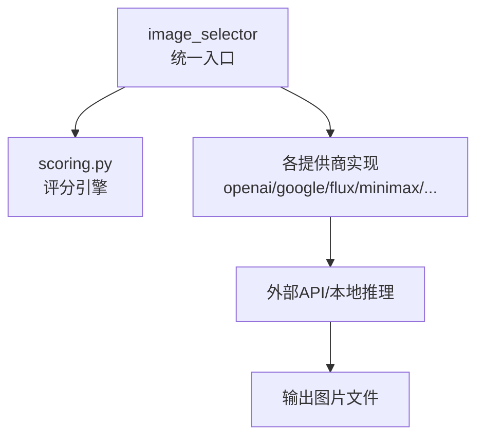
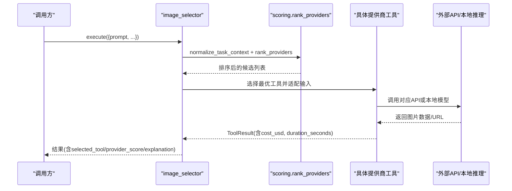
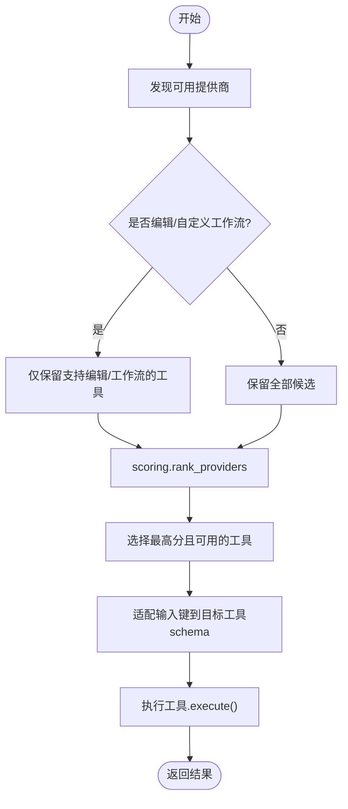
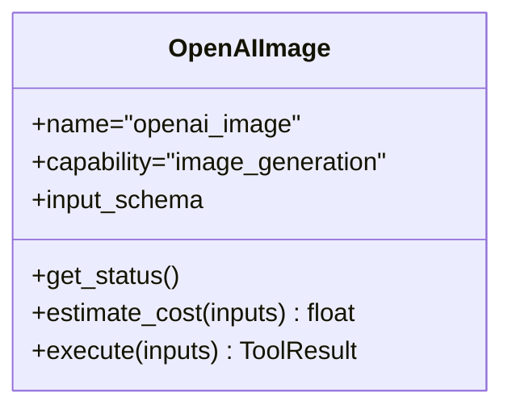
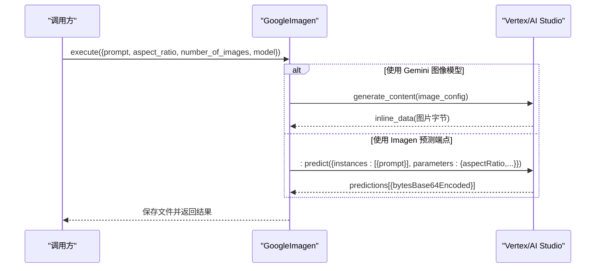
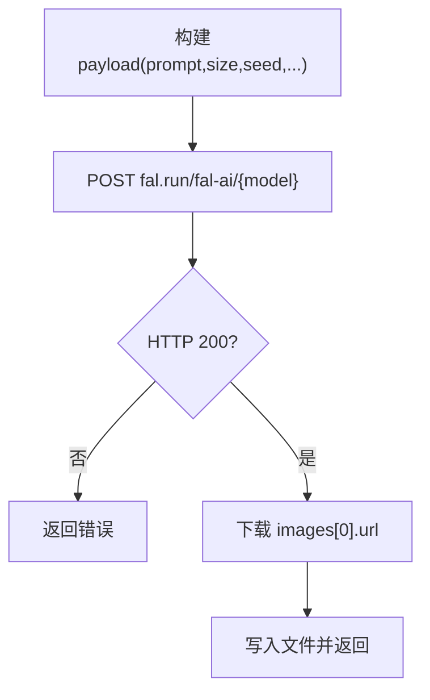
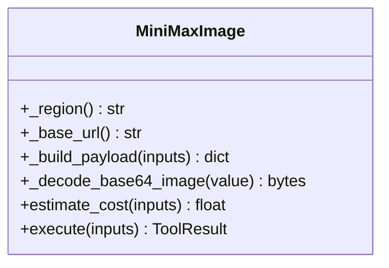
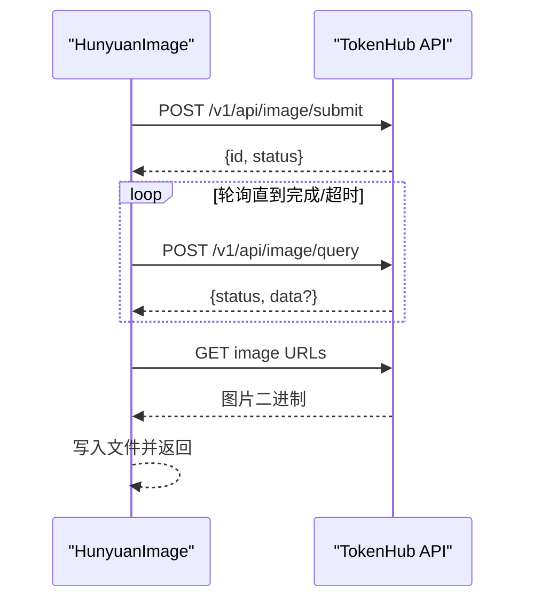
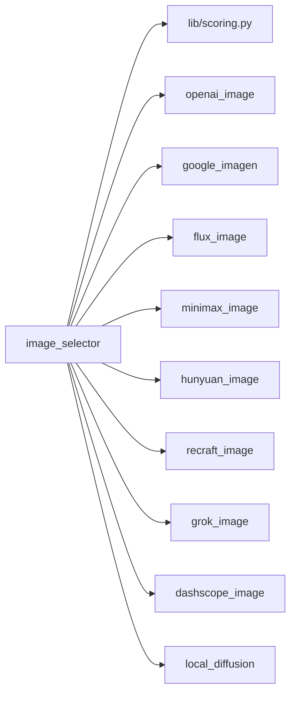

# 图像生成提供商

<cite>
**本文引用的文件**
- [tools/graphics/image_selector.py](file://tools/graphics/image_selector.py)
- [lib/scoring.py](file://lib/scoring.py)
- [tools/graphics/openai_image.py](file://tools/graphics/openai_image.py)
- [tools/graphics/google_imagen.py](file://tools/graphics/google_imagen.py)
- [tools/graphics/flux_image.py](file://tools/graphics/flux_image.py)
- [tools/graphics/minimax_image.py](file://tools/graphics/minimax_image.py)
- [tools/graphics/hunyuan_image.py](file://tools/graphics/hunyuan_image.py)
- [tools/graphics/recraft_image.py](file://tools/graphics/recraft_image.py)
- [tools/graphics/grok_image.py](file://tools/graphics/grok_image.py)
- [tools/graphics/dashscope_image.py](file://tools/graphics/dashscope_image.py)
- [tools/graphics/local_diffusion.py](file://tools/graphics/local_diffusion.py)
- [tools/graphics/image_gen.py](file://tools/graphics/image_gen.py)
</cite>

## 目录
1. [简介](#简介)
2. [项目结构](#项目结构)
3. [核心组件](#核心组件)
4. [架构总览](#架构总览)
5. [详细组件分析](#详细组件分析)
6. [依赖关系分析](#依赖关系分析)
7. [性能与成本](#性能与成本)
8. [故障排除指南](#故障排除指南)
9. [结论](#结论)
10. [附录：调用示例与最佳实践](#附录调用示例与最佳实践)

## 简介
本技术文档系统性梳理 OpenMontage 的图像生成提供商体系，覆盖 15+ 主流模型与服务的集成实现（OpenAI GPT Image 2、Google Imagen、FLUX、MiniMax、腾讯混元、Recraft、xAI Grok、阿里云 DashScope、本地 Stable Diffusion 等）。文档从系统架构、组件职责、数据流、评分与选择算法、API 接口与参数、成本估算、质量特性到性能对比、最佳实践与故障排除，提供由浅入深的完整说明。

## 项目结构
OpenMontage 将“图像生成”抽象为统一的工具能力，并通过“选择器 + 评分”机制自动路由到合适的提供商。关键目录与文件：
- tools/graphics：各提供商的具体实现（openai_image、google_imagen、flux_image、minimax_image、hunyuan_image、recraft_image、grok_image、dashscope_image、local_diffusion）
- tools/graphics/image_selector.py：统一入口，负责发现、筛选、评分与路由
- lib/scoring.py：多维评分引擎，基于任务上下文对候选提供商打分排序
- tools/graphics/image_gen.py：历史兼容入口（已弃用），仍保留多提供商调度逻辑

图表来源
- [tools/graphics/image_selector.py:15-210](file://tools/graphics/image_selector.py#L15-L210)
- [lib/scoring.py:373-542](file://lib/scoring.py#L373-L542)

章节来源
- [tools/graphics/image_selector.py:1-210](file://tools/graphics/image_selector.py#L1-L210)
- [lib/scoring.py:1-120](file://lib/scoring.py#L1-L120)

## 核心组件
- 统一选择器 image_selector：自动发现所有 capability="image_generation" 的工具，按任务上下文进行评分与选择；支持“rank”模式返回评分而不实际生成；支持编辑模式与自定义工作流路由。
- 评分引擎 scoring：以任务契合度、输出质量、可控性、可靠性、成本效率、延迟、连续性等多维指标加权计算，给出可解释的选择理由。
- 提供商实现：每个提供商遵循 BaseTool 契约，暴露 input_schema、capabilities、supports、best_for、estimate_cost、execute 等方法，保证一致的使用体验。

章节来源
- [tools/graphics/image_selector.py:15-210](file://tools/graphics/image_selector.py#L15-L210)
- [lib/scoring.py:21-70](file://lib/scoring.py#L21-L70)

## 架构总览

图表来源
- [tools/graphics/image_selector.py:218-332](file://tools/graphics/image_selector.py#L218-L332)
- [lib/scoring.py:297-359](file://lib/scoring.py#L297-L359)
- [lib/scoring.py:533-542](file://lib/scoring.py#L533-L542)

## 详细组件分析

### 选择器与评分机制
- 自动发现：通过 registry 获取所有具备 image_generation 能力的工具。
- 过滤与适配：根据是否编辑模式、是否指定 model、是否自定义工作流等条件过滤候选；将 selector 的统一输入键（如 prompt、n、model_name、images 等）映射到各工具的 input_schema。
- 评分与选择：调用 scoring.rank_providers，依据任务上下文（意图、风格关键词、预算、是否需要运动/编辑/参考图等）对各提供商打分，选择最高分且可用的工具。
- 结果增强：在返回中附加 selected_tool、selected_provider、provider_score、alternatives_considered 等元信息，便于审计与调试。

图表来源
- [tools/graphics/image_selector.py:185-210](file://tools/graphics/image_selector.py#L185-L210)
- [tools/graphics/image_selector.py:218-332](file://tools/graphics/image_selector.py#L218-L332)
- [lib/scoring.py:373-542](file://lib/scoring.py#L373-L542)

章节来源
- [tools/graphics/image_selector.py:185-467](file://tools/graphics/image_selector.py#L185-L467)
- [lib/scoring.py:205-232](file://lib/scoring.py#L205-L232)
- [lib/scoring.py:234-295](file://lib/scoring.py#L234-L295)
- [lib/scoring.py:297-359](file://lib/scoring.py#L297-L359)
- [lib/scoring.py:373-542](file://lib/scoring.py#L373-L542)

### OpenAI GPT Image 2
- 能力与定位：擅长复杂指令、文本渲染、高质量构图；支持多输出、多种尺寸与质量档位。
- 认证与运行：需要 OPENAI_API_KEY；同步执行；网络必需。
- 参数要点：model=gpt-image-2；size=1024x1024/1536x1024/1024x1536/auto；quality=low/medium/high/auto；output_format=png/jpeg/webp；n=1..4。
- 成本估算：按 quality 与 n 计费（例如 medium 约 $0.053/张，high 约 $0.211/张）。
- 错误处理：未设置密钥、无返回图像时返回失败结果。

图表来源
- [tools/graphics/openai_image.py:25-184](file://tools/graphics/openai_image.py#L25-L184)

章节来源
- [tools/graphics/openai_image.py:25-184](file://tools/graphics/openai_image.py#L25-L184)

### Google Imagen（Gemini/Vertex AI）
- 能力与定位：高质量写实图像；支持多种纵横比；可通过 Gemini 图像模型或 Imagen 预测端点。
- 认证与运行：支持 API Key（AI Studio）或服务账号（Vertex AI）；异步/同步取决于模型路径；网络必需。
- 参数要点：aspect_ratio=1:1/3:4/4:3/9:16/16:9；width/height 会被映射到最近支持的 ratio；number_of_images=1..4；model 可为 imagen-* 或 gemini-*。
- 成本估算：gemini 图像模型约 $0.039/张；ultra/fast/standard 不同档位价格不同。
- 错误处理：无凭据、无预测结果、非 JSON 响应等均有明确错误提示。

图表来源
- [tools/graphics/google_imagen.py:209-279](file://tools/graphics/google_imagen.py#L209-L279)
- [tools/graphics/google_imagen.py:281-397](file://tools/graphics/google_imagen.py#L281-L397)

章节来源
- [tools/graphics/google_imagen.py:54-151](file://tools/graphics/google_imagen.py#L54-L151)
- [tools/graphics/google_imagen.py:171-208](file://tools/graphics/google_imagen.py#L171-L208)
- [tools/graphics/google_imagen.py:209-397](file://tools/graphics/google_imagen.py#L209-L397)

### FLUX（fal.ai）
- 能力与定位：通用高质量图像生成；支持负向提示、种子、自定义尺寸；成本低廉。
- 认证与运行：需要 FAL_KEY；同步执行；网络必需。
- 参数要点：model=flux-pro/v1.1|dev|pro；width/height；seed；num_inference_steps；guidance_scale；negative_prompt。
- 成本估算：dev 约 $0.03/张，pro 约 $0.05/张。
- 错误处理：未设置密钥、请求失败、下载失败均返回错误。

图表来源
- [tools/graphics/flux_image.py:97-165](file://tools/graphics/flux_image.py#L97-L165)

章节来源
- [tools/graphics/flux_image.py:24-165](file://tools/graphics/flux_image.py#L24-L165)

### MiniMax（首方 API）
- 能力与定位：原生 MiniMax 图像生成；支持种子、多输出、比例/尺寸控制、主体参考、URL/Base64 响应。
- 认证与运行：需要 MINIMAX_API_KEY；可选 MINIMAX_REGION/global/cn；同步执行；网络必需。
- 参数要点：model=image-01|image-01-live；aspect_ratio；width/height（需成对且为8的倍数）；response_format=url|base64；n=1..9；prompt_optimizer。
- 成本估算：固定单价约 $0.0035/张。
- 错误处理：校验 prompt 长度/宽高配对；解析 base_resp 状态码；安全脱敏错误消息。

图表来源
- [tools/graphics/minimax_image.py:140-218](file://tools/graphics/minimax_image.py#L140-L218)
- [tools/graphics/minimax_image.py:219-299](file://tools/graphics/minimax_image.py#L219-L299)

章节来源
- [tools/graphics/minimax_image.py:24-139](file://tools/graphics/minimax_image.py#L24-L139)
- [tools/graphics/minimax_image.py:140-299](file://tools/graphics/minimax_image.py#L140-L299)

### 腾讯混元（TokenHub）
- 能力与定位：通过 TokenHub 提交异步任务，轮询查询结果；支持中文提示词理解；支持参考图与分辨率控制。
- 认证与运行：需要 TENCENT_TOKENHUB_API_KEY；异步执行（submit + poll）；网络必需。
- 参数要点：resolution=W:H；seed；revise（自动改写提示词）；logo_add/logo_param；images（URL/data URI/本地路径转 data URI）。
- 成本估算：约 $0.08/张（按 credits 换算）。
- 错误处理：强制要求 output_path；严格校验引用图大小与格式；超时与未知状态抛出异常。

图表来源
- [tools/graphics/hunyuan_image.py:278-330](file://tools/graphics/hunyuan_image.py#L278-L330)
- [tools/graphics/hunyuan_image.py:432-523](file://tools/graphics/hunyuan_image.py#L432-L523)

章节来源
- [tools/graphics/hunyuan_image.py:42-249](file://tools/graphics/hunyuan_image.py#L42-L249)
- [tools/graphics/hunyuan_image.py:254-330](file://tools/graphics/hunyuan_image.py#L254-L330)
- [tools/graphics/hunyuan_image.py:336-418](file://tools/graphics/hunyuan_image.py#L336-L418)
- [tools/graphics/hunyuan_image.py:424-581](file://tools/graphics/hunyuan_image.py#L424-L581)

### Recraft（fal.ai）
- 能力与定位：品牌资产、Logo、矢量 SVG、精确文字渲染；适合专业图形设计。
- 认证与运行：需要 FAL_KEY；同步执行；网络必需。
- 参数要点：model=v4|v4-pro；image_size=square/square_hd/landscape/portrait；style（当前 fal.ai 可能拒绝 style 字段，建议写入 prompt）；colors（十六进制调色板）。
- 成本估算：v4 约 $0.04/张，v4-pro 约 $0.25/张。
- 错误处理：未设置密钥、请求失败、下载失败均返回错误。

章节来源
- [tools/graphics/recraft_image.py:27-197](file://tools/graphics/recraft_image.py#L27-L197)

### xAI Grok（图像生成与编辑）
- 能力与定位：单图编辑、风格迁移、多图合成；支持纵横比与分辨率档位。
- 认证与运行：需要 XAI_API_KEY；同步执行；网络必需。
- 参数要点：generation_mode=generate|edit；model=grok-imagine-image；aspect_ratio；resolution=1k|2k；n=1..10；image_url/image_path 或 image_urls/image_paths。
- 成本估算：每张生成图 $0.02，每输入图 $0.002。
- 错误处理：编辑模式必须提供输入图；缺失 url/b64_json 时报错。

章节来源
- [tools/graphics/grok_image.py:46-297](file://tools/graphics/grok_image.py#L46-L297)

### 阿里云 DashScope（Qwen-Image）
- 能力与定位：高质量图像生成；中文提示词理解；支持负向提示、种子、多输出。
- 认证与运行：需要 DASHSCOPE_API_KEY；同步执行；网络必需。
- 参数要点：model=qwen-image-2.0-pro|qwen-image-max|wan2.7-image|z-image-turbo；size=W*H；n=1..6；negative_prompt；prompt_extend；watermark；seed。
- 成本估算：保守估计约 $0.02/张（按 n 计费）。
- 错误处理：无 URL 返回、非 JSON 响应、下载失败等均有错误处理。

章节来源
- [tools/graphics/dashscope_image.py:29-274](file://tools/graphics/dashscope_image.py#L29-L274)

### 本地 Stable Diffusion（diffusers）
- 能力与定位：离线/内网环境生成；免费但速度受硬件影响；适合隐私敏感场景。
- 认证与运行：无需网络；需要安装 diffusers/transformers/accelerate/torch；CPU/GPU 均可。
- 参数要点：negative_prompt；width/height；model（默认 SD 2.1 base）；seed；num_inference_steps；guidance_scale。
- 成本估算：$0.0。
- 错误处理：未安装依赖、设备不可用、推理失败等返回错误。

章节来源
- [tools/graphics/local_diffusion.py:23-160](file://tools/graphics/local_diffusion.py#L23-L160)

### 历史兼容入口 image_gen
- 作用：旧版多提供商聚合入口，已弃用；内部仍支持 openai/flux/local 三种路径。
- 注意：新项目应优先使用 image_selector 或直接调用具体提供商工具。

章节来源
- [tools/graphics/image_gen.py:1-280](file://tools/graphics/image_gen.py#L1-L280)

## 依赖关系分析
- 选择器依赖评分引擎：image_selector 在 execute 中调用 lib.scoring.rank_providers 进行候选排序。
- 提供商实现相互独立：每个提供商工具只依赖自身所需的 SDK/库（如 openai、requests、torch/diffusers）。
- 统一契约：所有提供商继承 BaseTool，暴露一致的 get_status、estimate_cost、execute、input_schema、capabilities、supports、best_for 等属性与方法，便于选择器统一调度。

图表来源
- [tools/graphics/image_selector.py:185-210](file://tools/graphics/image_selector.py#L185-L210)
- [lib/scoring.py:373-542](file://lib/scoring.py#L373-L542)

章节来源
- [tools/graphics/image_selector.py:185-210](file://tools/graphics/image_selector.py#L185-L210)
- [lib/scoring.py:373-542](file://lib/scoring.py#L373-L542)

## 性能与成本
- 成本估算（每张图近似值，实际以官方定价为准）：
  - OpenAI GPT Image 2：low≈$0.006，medium≈$0.053，high≈$0.211
  - Google Imagen：gemini 图像模型≈$0.039；ultra≈$0.06；fast≈$0.02；标准≈$0.04
  - FLUX：dev≈$0.03，pro≈$0.05
  - MiniMax：≈$0.0035
  - 腾讯混元：≈$0.08
  - Recraft：v4≈$0.04，v4-pro≈$0.25
  - xAI Grok：生成$0.02/张 + 输入图$0.002/张
  - DashScope：≈$0.02/张
  - 本地 SD：$0.0
- 性能特征（概略）：
  - 同步 API（OpenAI、FLUX、Recraft、Grok、DashScope、MiniMax）：通常数秒至数十秒
  - 异步 API（腾讯混元）：提交后轮询，典型上限约 120s
  - 本地 SD：依赖 GPU/CPU，常见约 30s（GPU）或更慢（CPU）
- 选择器会结合 latency、reliability、cost_efficiency 等维度综合评分，避免单一“最快/最便宜”导致的整体质量下降。

章节来源
- [tools/graphics/openai_image.py:118-124](file://tools/graphics/openai_image.py#L118-L124)
- [tools/graphics/google_imagen.py:180-190](file://tools/graphics/google_imagen.py#L180-L190)
- [tools/graphics/flux_image.py:91-95](file://tools/graphics/flux_image.py#L91-L95)
- [tools/graphics/minimax_image.py:216-218](file://tools/graphics/minimax_image.py#L216-L218)
- [tools/graphics/hunyuan_image.py:230-248](file://tools/graphics/hunyuan_image.py#L230-L248)
- [tools/graphics/recraft_image.py:117-121](file://tools/graphics/recraft_image.py#L117-L121)
- [tools/graphics/grok_image.py:152-157](file://tools/graphics/grok_image.py#L152-L157)
- [tools/graphics/dashscope_image.py:137-141](file://tools/graphics/dashscope_image.py#L137-L141)
- [tools/graphics/local_diffusion.py:92-96](file://tools/graphics/local_diffusion.py#L92-L96)
- [lib/scoring.py:424-446](file://lib/scoring.py#L424-L446)

## 故障排除指南
- 认证失败：
  - OpenAI：检查 OPENAI_API_KEY
  - Google：检查 GOOGLE_API_KEY/GEMINI_API_KEY 或服务账号配置（GOOGLE_APPLICATION_CREDENTIALS、GOOGLE_CLOUD_PROJECT）
  - FLUX/Recraft：检查 FAL_KEY/FAL_AI_API_KEY
  - MiniMax：检查 MINIMAX_API_KEY（可选 MINIMAX_REGION）
  - 腾讯混元：检查 TENCENT_TOKENHUB_API_KEY
  - xAI：检查 XAI_API_KEY
  - DashScope：检查 DASHSCOPE_API_KEY
- 参数不合法：
  - MiniMax：prompt 长度限制、宽高必须成对且为 8 的倍数
  - DashScope：size 使用 W*H 格式
  - Google：width/height 将被映射到最近支持的纵横比
- 无输出：
  - OpenAI/Grok/DashScope：确保返回包含 b64_json 或 url；否则检查请求参数与配额
  - 腾讯混元：必须提供 output_path；轮询超时或未知状态会抛异常
- 本地环境：
  - Local Diffusion：确认已安装 diffusers/transformers/accelerate/torch；GPU 可用时建议使用 CUDA

章节来源
- [tools/graphics/openai_image.py:126-131](file://tools/graphics/openai_image.py#L126-L131)
- [tools/graphics/google_imagen.py:171-178](file://tools/graphics/google_imagen.py#L171-L178)
- [tools/graphics/flux_image.py:97-103](file://tools/graphics/flux_image.py#L97-L103)
- [tools/graphics/minimax_image.py:173-205](file://tools/graphics/minimax_image.py#L173-L205)
- [tools/graphics/hunyuan_image.py:254-290](file://tools/graphics/hunyuan_image.py#L254-L290)
- [tools/graphics/grok_image.py:225-231](file://tools/graphics/grok_image.py#L225-L231)
- [tools/graphics/dashscope_image.py:143-149](file://tools/graphics/dashscope_image.py#L143-L149)
- [tools/graphics/local_diffusion.py:85-103](file://tools/graphics/local_diffusion.py#L85-L103)

## 结论
OpenMontage 通过“选择器 + 评分”的架构，将多家图像生成提供商统一到一致的接口之下，既满足初学者快速上手（直接调用 image_selector），又为高级用户提供深度定制（直接调用具体提供商工具、传入 task_context 精细控制评分权重）。各提供商在质量、成本、可控性与延迟上各有优势，选择器会根据任务上下文给出可解释的最优解。建议在生产环境中结合业务需求（风格、预算、时效、合规）选择合适的提供商组合，并持续收集质量与延迟指标以优化评分策略。

## 附录：调用示例与最佳实践

- 使用选择器自动路由（推荐）
  - 调用 image_selector.execute({prompt, preferred_provider="auto", allowed_providers=[...], operation="generate"})
  - 如需查看评分而不实际生成，设置 operation="rank"
  - 如需指定编辑模式，设置 generation_mode="edit" 并提供 image_url/image_path 或 image_urls/image_paths

- 直接调用具体提供商
  - OpenAI：openai_image.execute({prompt, model="gpt-image-2", size="1024x1024", quality="high", n=1, output_path="out.png"})
  - Google：google_imagen.execute({prompt, aspect_ratio="1:1", number_of_images=1, model="imagen-4.0-generate-001", output_path="out.png"})
  - FLUX：flux_image.execute({prompt, width=1024, height=1024, seed=42, model="flux-pro/v1.1", output_path="out.png"})
  - MiniMax：minimax_image.execute({prompt, model="image-01", aspect_ratio="1:1", width=1024, height=1024, response_format="url", n=1, output_path="out.png"})
  - 腾讯混元：hunyuan_image.execute({prompt, resolution="1024:1024", seed=42, revise=1, logo_add=1, output_path="out.png"})
  - Recraft：recraft_image.execute({prompt, model="v4", image_size="square_hd", colors=["#FF5733","#2E86C1"], output_path="out.png"})
  - xAI Grok：grok_image.execute({prompt, generation_mode="generate", aspect_ratio="16:9", resolution="2k", n=1, output_path="out.png"})
  - DashScope：dashscope_image.execute({prompt, model="qwen-image-2.0-pro", size="1024*1024", n=1, negative_prompt="", watermark=False, seed=42, output_path="out.png"})
  - 本地 SD：local_diffusion.execute({prompt, negative_prompt="", width=512, height=512, model="stabilityai/stable-diffusion-2-1-base", seed=42, num_inference_steps=30, guidance_scale=7.5, output_path="out.png"})

- 最佳实践
  - 明确任务上下文：在 task_context 中提供 intent、style_keywords、budget_remaining_usd、locked_providers 等，以获得更准确的评分与选择
  - 合理设置 n：批量出图时注意成本与时间权衡
  - 利用 supports 能力：如需编辑/风格迁移/参考图，优先选择支持 image_edit/style_transfer/reference_image 的提供商
  - 监控与回退：记录 selected_tool、provider_score、duration_seconds、cost_usd；当首选不可用时，选择器会自动回退到其他可用提供商

章节来源
- [tools/graphics/image_selector.py:218-332](file://tools/graphics/image_selector.py#L218-L332)
- [lib/scoring.py:297-359](file://lib/scoring.py#L297-L359)
- [lib/scoring.py:373-542](file://lib/scoring.py#L373-L542)