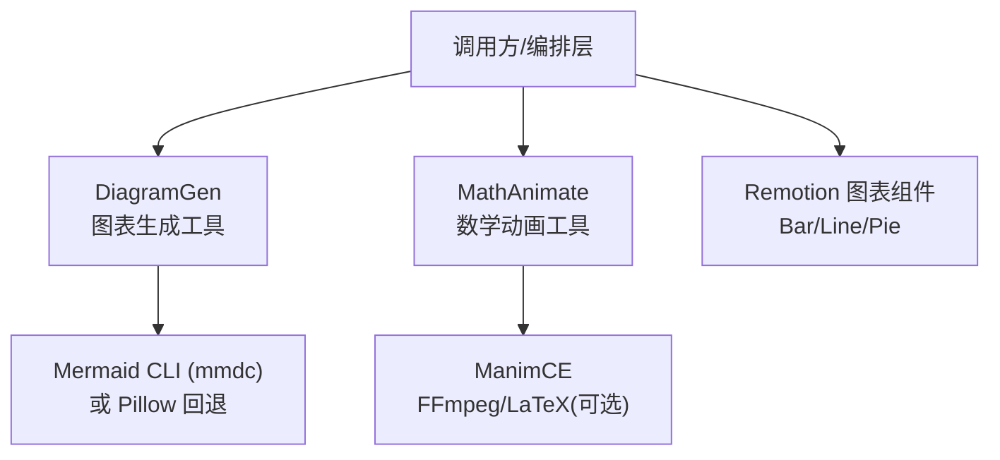
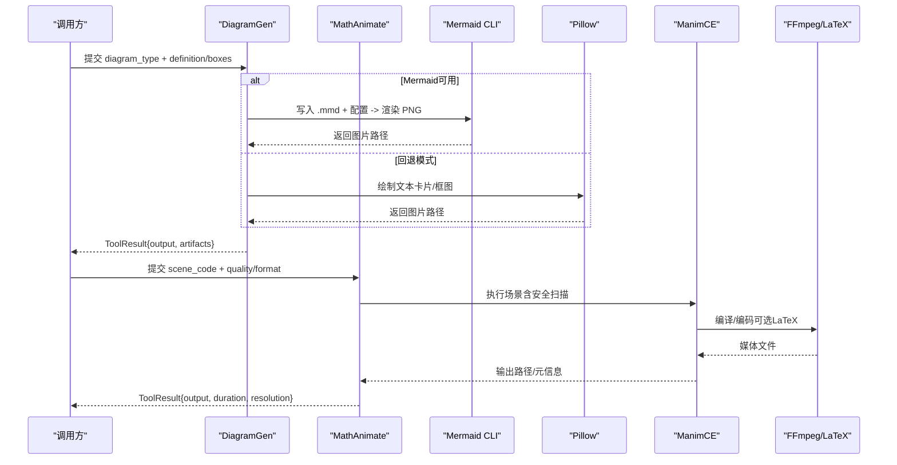
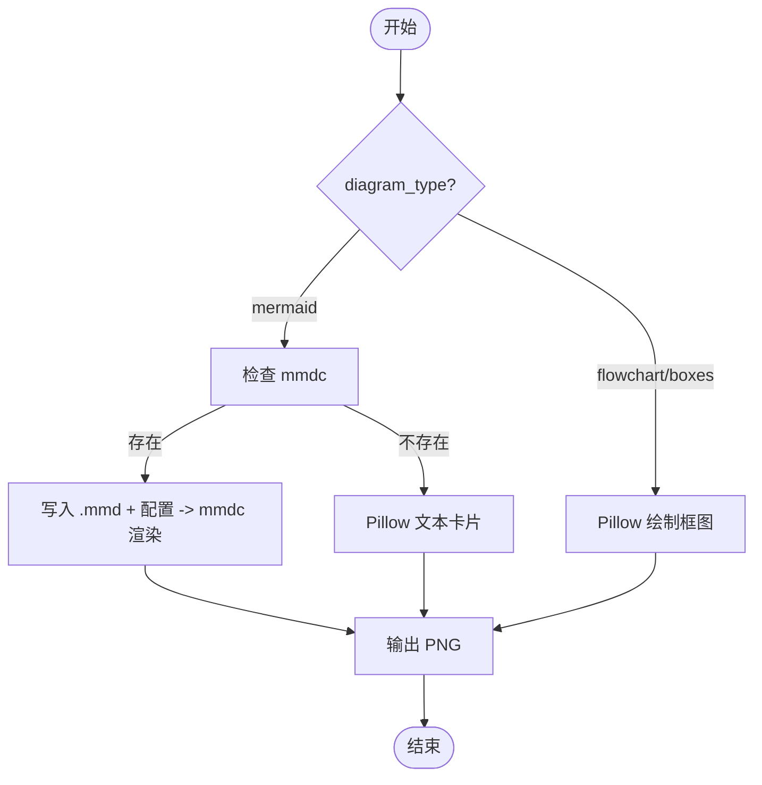
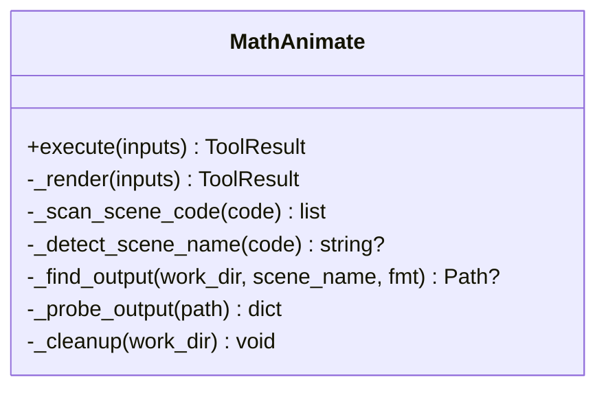
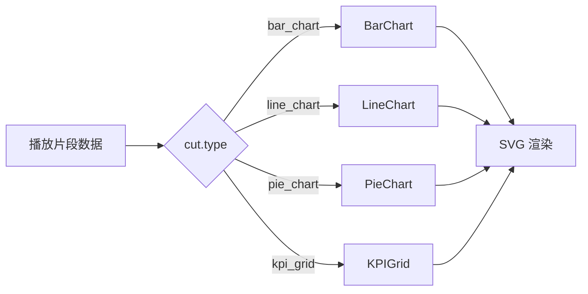
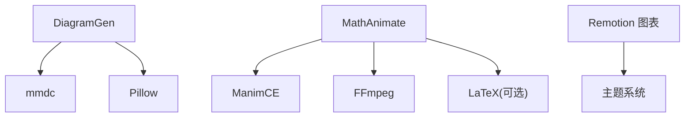

# 图表与数学可视化

<cite>
**本文引用的文件**
- [tools/graphics/diagram_gen.py](file://tools/graphics/diagram_gen.py)
- [tools/graphics/math_animate.py](file://tools/graphics/math_animate.py)
- [skills/creative/diagram-gen-usage.md](file://skills/creative/diagram-gen-usage.md)
- [.agents/skills/beautiful-mermaid/references/mermaid-syntax.md](file://.agents/skills/beautiful-mermaid/references/mermaid-syntax.md)
- [.agents/skills/manim-composer/references/visual-techniques.md](file://.agents/skills/manim-composer/references/visual-techniques.md)
- [.agents/skills/manimce-best-practices/rules/latex.md](file://.agents/skills/manimce-best-practices/rules/latex.md)
- [remotion-composer/src/Explainer.tsx](file://remotion-composer/src/Explainer.tsx)
- [remotion-composer/src/components/charts/BarChart.tsx](file://remotion-composer/src/components/charts/BarChart.tsx)
- [tools/base_tool.py](file://tools/base_tool.py)
</cite>

## 目录
1. [简介](#简介)
2. [项目结构](#项目结构)
3. [核心组件](#核心组件)
4. [架构总览](#架构总览)
5. [详细组件分析](#详细组件分析)
6. [依赖关系分析](#依赖关系分析)
7. [性能考虑](#性能考虑)
8. [故障排查指南](#故障排查指南)
9. [结论](#结论)
10. [附录：API参考与使用示例](#附录api参考与使用示例)

## 简介
本技术文档聚焦 OpenMontage 的“图表生成”和“数学可视化”能力，覆盖以下方面：
- 图表生成器架构设计、支持的数据类型、样式与交互方式
- 数学动画引擎实现原理（基于 ManimCE），包括 LaTeX 渲染、动态图形生成与时间轴控制
- 完整 API 参考（配置项、数据格式、自定义样式）
- 使用示例（信息图、科学可视化、教育内容）
- 性能优化策略与大容量数据处理方案
- 与其他工具的集成方法与最佳实践

## 项目结构
OpenMontage 将图表与数学可视化能力拆分为两个工具类：
- 图表生成：diagram_gen（Mermaid/Pillow 渲染）
- 数学动画：math_animate（ManimCE 场景渲染）

此外，Remotion 前端提供交互式图表组件（柱状图、折线图、饼图等），用于视频内嵌展示。

**图示来源**
- [tools/graphics/diagram_gen.py:28-101](file://tools/graphics/diagram_gen.py#L28-L101)
- [tools/graphics/math_animate.py:84-186](file://tools/graphics/math_animate.py#L84-L186)
- [remotion-composer/src/Explainer.tsx:658-690](file://remotion-composer/src/Explainer.tsx#L658-L690)

**章节来源**
- [tools/graphics/diagram_gen.py:28-101](file://tools/graphics/diagram_gen.py#L28-L101)
- [tools/graphics/math_animate.py:84-186](file://tools/graphics/math_animate.py#L84-L186)
- [remotion-composer/src/Explainer.tsx:658-690](file://remotion-composer/src/Explainer.tsx#L658-L690)

## 核心组件
- DiagramGen：统一入口，支持 Mermaid 流程图/时序图/状态图等，以及基于 Pillow 的简易框图；具备主题、尺寸、输出路径等配置。
- MathAnimate：封装 ManimCE 渲染流程，包含安全扫描、质量预设、透明背景、额外参数透传、输出探测与清理。
- Remotion 图表组件：在视频合成阶段以 React/SVG 形式渲染交互式图表，支持多种动画风格与主题色。

**章节来源**
- [tools/graphics/diagram_gen.py:28-101](file://tools/graphics/diagram_gen.py#L28-L101)
- [tools/graphics/math_animate.py:84-186](file://tools/graphics/math_animate.py#L84-L186)
- [remotion-composer/src/Explainer.tsx:658-690](file://remotion-composer/src/Explainer.tsx#L658-L690)

## 架构总览
下图展示了从输入到输出的端到端流程：用户通过工具接口传入定义或场景代码，系统选择合适后端进行渲染，最终产出图像或视频。

**图示来源**
- [tools/graphics/diagram_gen.py:121-181](file://tools/graphics/diagram_gen.py#L121-L181)
- [tools/graphics/diagram_gen.py:183-308](file://tools/graphics/diagram_gen.py#L183-L308)
- [tools/graphics/math_animate.py:208-416](file://tools/graphics/math_animate.py#L208-L416)

## 详细组件分析

### 图表生成器（DiagramGen）
- 能力与输入
  - diagram_type：mermaid / flowchart / boxes
  - 通用配置：theme、width、height、output_path
  - Mermaid：definition（Mermaid 语法）
  - Box：boxes（节点列表）、connections（连线）
- 渲染策略
  - 优先使用 Mermaid CLI（mmdc）生成高质量 PNG，支持主题与透明背景
  - 无 mmdc 时回退为 Pillow 文本卡片或框图绘制
- 资源与稳定性
  - 低资源占用（CPU/内存/磁盘），确定性执行
  - 幂等键基于 diagram_type、definition、boxes

**图示来源**
- [tools/graphics/diagram_gen.py:121-181](file://tools/graphics/diagram_gen.py#L121-L181)
- [tools/graphics/diagram_gen.py:183-308](file://tools/graphics/diagram_gen.py#L183-L308)
- [tools/graphics/diagram_gen.py:310-352](file://tools/graphics/diagram_gen.py#L310-L352)

**章节来源**
- [tools/graphics/diagram_gen.py:28-101](file://tools/graphics/diagram_gen.py#L28-L101)
- [tools/graphics/diagram_gen.py:121-181](file://tools/graphics/diagram_gen.py#L121-L181)
- [tools/graphics/diagram_gen.py:183-308](file://tools/graphics/diagram_gen.py#L183-L308)
- [tools/graphics/diagram_gen.py:310-352](file://tools/graphics/diagram_gen.py#L310-L352)

### 数学动画引擎（MathAnimate）
- 能力与输入
  - scene_code：Python 场景代码（继承自 Scene，含 construct）
  - 质量预设：low/medium/high/4k/preview（分辨率与帧率映射）
  - 格式：mp4/gif/png/webm；支持透明背景、背景色、额外 CLI 参数
  - 安全：默认静态扫描禁止危险导入/名称/反射访问；可显式允许不安全代码
- 渲染流程
  - 自动注入 import；检测 Scene 类名；构建命令行；执行 ManimCE；探测输出；清理临时目录
- 资源与稳定性
  - 本地运行，免费；预估运行时随质量变化；超时保护

**图示来源**
- [tools/graphics/math_animate.py:84-186](file://tools/graphics/math_animate.py#L84-L186)
- [tools/graphics/math_animate.py:208-416](file://tools/graphics/math_animate.py#L208-L416)
- [tools/graphics/math_animate.py:418-495](file://tools/graphics/math_animate.py#L418-L495)

**章节来源**
- [tools/graphics/math_animate.py:84-186](file://tools/graphics/math_animate.py#L84-L186)
- [tools/graphics/math_animate.py:208-416](file://tools/graphics/math_animate.py#L208-L416)
- [tools/graphics/math_animate.py:418-495](file://tools/graphics/math_animate.py#L418-L495)

### Remotion 图表组件（视频内嵌）
- 支持的图表类型：bar_chart、line_chart、pie_chart、kpi_grid 等
- 数据与样式：title、colors、animationStyle、showGrid/showValues/showMarkers/showLegend、backgroundColor/textColor
- 与主题联动：默认使用 theme.chartColors 作为调色板

**图示来源**
- [remotion-composer/src/Explainer.tsx:658-690](file://remotion-composer/src/Explainer.tsx#L658-L690)
- [remotion-composer/src/components/charts/BarChart.tsx:258-284](file://remotion-composer/src/components/charts/BarChart.tsx#L258-L284)

**章节来源**
- [remotion-composer/src/Explainer.tsx:658-690](file://remotion-composer/src/Explainer.tsx#L658-L690)
- [remotion-composer/src/components/charts/BarChart.tsx:258-284](file://remotion-composer/src/components/charts/BarChart.tsx#L258-L284)

## 依赖关系分析
- DiagramGen
  - 外部命令：mmdc（Mermaid CLI）
  - Python 库：Pillow（回退渲染）
  - 资源：低 CPU/内存/磁盘，无需网络
- MathAnimate
  - 外部命令：manim、ffprobe（可选，用于探测媒体信息）
  - 依赖：ManimCE、FFmpeg；LaTeX 可选（用于公式渲染）
- Remotion 图表
  - 前端渲染：React + SVG；与主题系统耦合

**图示来源**
- [tools/graphics/diagram_gen.py:38-45](file://tools/graphics/diagram_gen.py#L38-L45)
- [tools/graphics/math_animate.py:95-104](file://tools/graphics/math_animate.py#L95-L104)
- [tools/graphics/math_animate.py:453-487](file://tools/graphics/math_animate.py#L453-L487)

**章节来源**
- [tools/graphics/diagram_gen.py:38-45](file://tools/graphics/diagram_gen.py#L38-L45)
- [tools/graphics/math_animate.py:95-104](file://tools/graphics/math_animate.py#L95-L104)
- [tools/graphics/math_animate.py:453-487](file://tools/graphics/math_animate.py#L453-L487)

## 性能考虑
- 图表复杂度控制
  - 视频场景下建议限制节点数与边数，避免信息过载；高分辨率下适当降低字体大小
  - 推荐分帧渐进构建，配合交叉淡入淡出提升观感
- 渲染质量与速度权衡
  - 使用质量预设快速预览（low/preview），再切换高质量（high/4k）
  - 对复杂场景启用禁用缓存以减少重复计算
- 大对象与大数据
  - 图表数据尽量精简，仅保留必要字段；数值格式化减少冗余
  - 批量渲染时合理设置并发与超时，避免阻塞
- 资源估算
  - 依据质量预设预估渲染时长；必要时拆分场景或降低分辨率

[本节为通用指导，不直接分析具体文件]

## 故障排查指南
- DiagramGen
  - 未安装 mmdc：回退至 Pillow 文本卡片或框图；若仍失败，检查 Pillow 安装
  - 输出为空：确认 width/height 与 boxes/connections 索引有效
- MathAnimate
  - 安全扫描拦截：移除被禁用的导入/名称/反射访问，或显式允许不安全代码（谨慎）
  - 渲染超时：降低质量或使用 preview；检查场景复杂度
  - 输出缺失：确认 media 目录结构与文件名匹配；检查 ffprobe 可用性
- Remotion 图表
  - 颜色/动画不生效：确认传入 colors、animationStyle 与主题一致；检查数据字段是否齐全

**章节来源**
- [tools/graphics/diagram_gen.py:106-119](file://tools/graphics/diagram_gen.py#L106-L119)
- [tools/graphics/diagram_gen.py:183-189](file://tools/graphics/diagram_gen.py#L183-L189)
- [tools/graphics/math_animate.py:225-265](file://tools/graphics/math_animate.py#L225-L265)
- [tools/graphics/math_animate.py:349-377](file://tools/graphics/math_animate.py#L349-L377)
- [tools/graphics/math_animate.py:453-487](file://tools/graphics/math_animate.py#L453-L487)

## 结论
OpenMontage 提供了从静态图表到动态数学可视化的完整链路：
- DiagramGen 以 Mermaid 为主、Pillow 为辅，满足快速信息图生成
- MathAnimate 基于 ManimCE，支持 LaTeX 公式与丰富的动画表达
- Remotion 图表组件无缝嵌入视频，提供一致的视觉风格与交互体验
结合合理的复杂度控制与质量预设，可在保证性能的同时产出高质量可视化内容。

[本节为总结性内容，不直接分析具体文件]

## 附录：API参考与使用示例

### DiagramGen API
- 必需字段
  - diagram_type：mermaid | flowchart | boxes
- 可选字段
  - mermaid：definition（Mermaid 语法）
  - boxes：数组，元素含 label、color
  - connections：数组，元素含 from、to、label
  - theme：dark | light | neutral
  - width、height、output_path
- 行为说明
  - 优先使用 mmdc 渲染；不可用时回退为 Pillow 文本卡片或框图
  - 幂等键基于 diagram_type、definition、boxes

**章节来源**
- [tools/graphics/diagram_gen.py:53-101](file://tools/graphics/diagram_gen.py#L53-L101)
- [tools/graphics/diagram_gen.py:121-181](file://tools/graphics/diagram_gen.py#L121-L181)
- [tools/graphics/diagram_gen.py:183-308](file://tools/graphics/diagram_gen.py#L183-L308)

### MathAnimate API
- 必需字段
  - scene_code：Python 场景代码（需包含 Scene 子类与 construct）
- 可选字段
  - allow_unsafe_code：布尔，默认关闭（安全扫描）
  - scene_name：字符串，自动检测
  - quality：low | medium | high | 4k | preview
  - format：mp4 | gif | png | webm
  - output_path、transparent、background_color、extra_args
- 行为说明
  - 自动注入 import；构建命令行并执行 ManimCE；探测输出并清理临时目录
  - 支持透明背景与自定义背景色；可附加额外 CLI 参数

**章节来源**
- [tools/graphics/math_animate.py:113-186](file://tools/graphics/math_animate.py#L113-L186)
- [tools/graphics/math_animate.py:208-416](file://tools/graphics/math_animate.py#L208-L416)

### 数据格式与样式
- Mermaid 语法参考
  - 流程图方向、节点形状、边样式、子图、序列图箭头与激活
- 视频可读性建议
  - 节点与边数量限制、最小字号、主题选择、渐进构建与高亮
- ManimCE 可视化技巧
  - 渐进揭示、变换而非替换、颜色编码、空间布局
  - 方程着色、步骤推导、几何直观、3D 技巧
  - LaTeX 使用：隔离子串、索引标签、多部分方程、混合文本与数学、自定义包

**章节来源**
- [.agents/skills/beautiful-mermaid/references/mermaid-syntax.md:1-81](file://.agents/skills/beautiful-mermaid/references/mermaid-syntax.md#L1-L81)
- [skills/creative/diagram-gen-usage.md:1-112](file://skills/creative/diagram-gen-usage.md#L1-L112)
- [.agents/skills/manim-composer/references/visual-techniques.md:1-196](file://.agents/skills/manim-composer/references/visual-techniques.md#L1-L196)
- [.agents/skills/manimce-best-practices/rules/latex.md:74-148](file://.agents/skills/manimce-best-practices/rules/latex.md#L74-L148)

### 使用示例（路径指引）
- 信息图（流程图/时序图/状态图）
  - 使用 Mermaid 语法描述结构，选择 dark/light/neutral 主题，设置宽度与输出路径
  - 参考：[Mermaid 语法参考:1-81](file://.agents/skills/beautiful-mermaid/references/mermaid-syntax.md#L1-L81)
- 科学可视化（函数曲线、积分面积、向量场）
  - 编写 ManimCE 场景，使用 Axes、get_graph、get_area、TracedPath 等
  - 参考：[可视化技巧:86-119](file://.agents/skills/manim-composer/references/visual-techniques.md#L86-L119)
- 教育内容（逐步推导、公式着色）
  - 使用 MathTex/Tex，按步骤呈现，利用 set_color_by_tex 与 TransformMatchingTex
  - 参考：[LaTeX 最佳实践:74-148](file://.agents/skills/manimce-best-practices/rules/latex.md#L74-L148)

### 与 Remotion 集成
- 在视频片段中插入图表（bar/line/pie/kpi_grid），通过 title、colors、animationStyle、showGrid/showValues/showMarkers/showLegend 等配置样式
- 与主题系统联动，统一配色与字体

**章节来源**
- [remotion-composer/src/Explainer.tsx:658-690](file://remotion-composer/src/Explainer.tsx#L658-L690)
- [remotion-composer/src/components/charts/BarChart.tsx:258-284](file://remotion-composer/src/components/charts/BarChart.tsx#L258-L284)

### 基础工具契约（BaseTool）
- 所有工具继承 BaseTool，统一能力发现、执行、成本估计与健康报告
- 关键枚举：ToolTier、ToolStability、ToolStatus、ExecutionMode、Determinism
- 资源与重试：ResourceProfile、RetryPolicy；结果：ToolResult

**章节来源**
- [tools/base_tool.py:63-139](file://tools/base_tool.py#L63-L139)