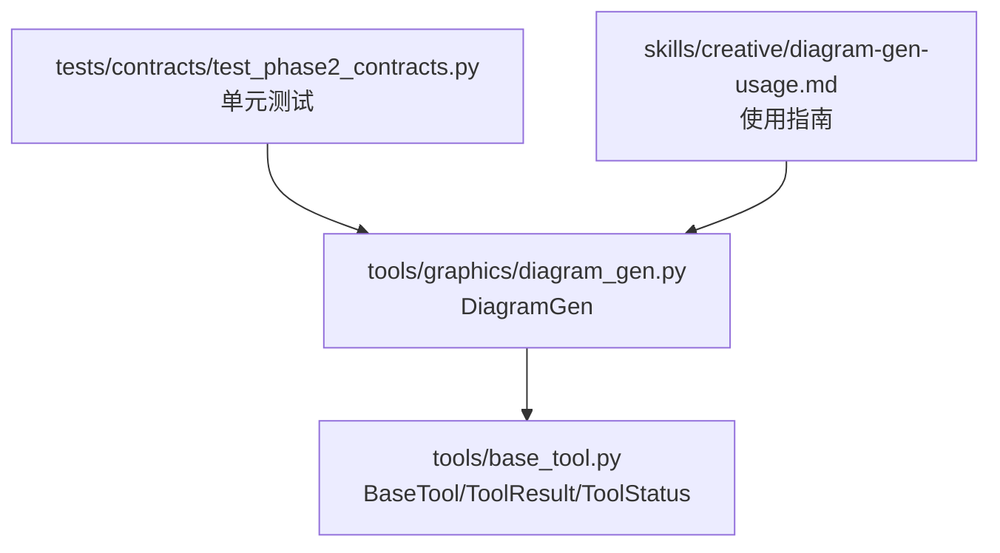
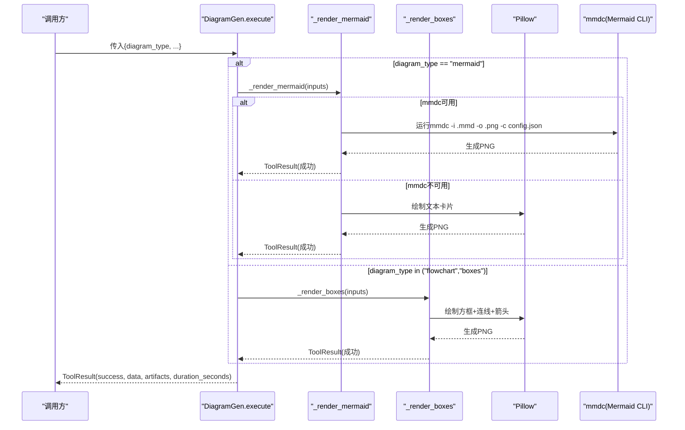
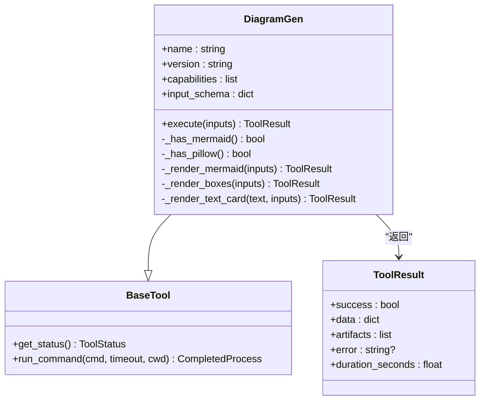
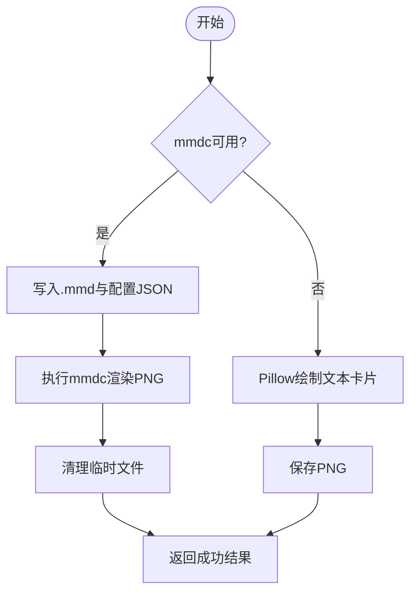
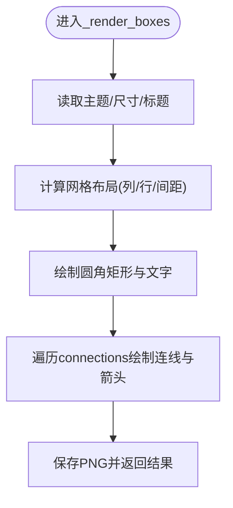
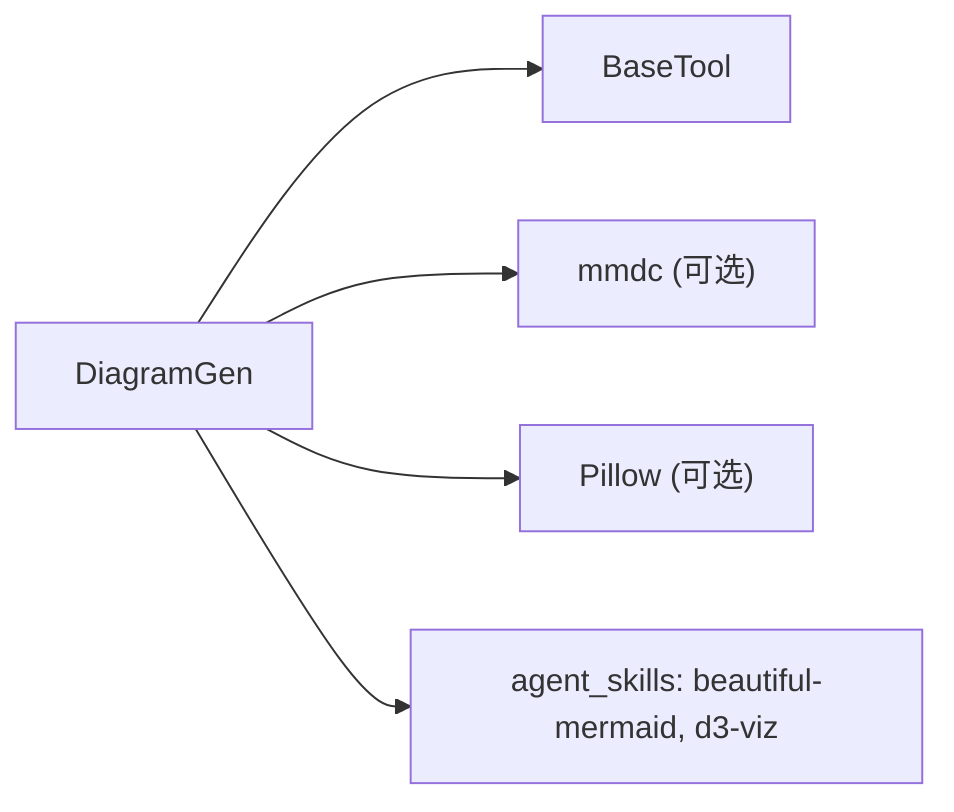

# 图表生成器

<cite>
**本文引用的文件**
- [tools/graphics/diagram_gen.py](file://tools/graphics/diagram_gen.py)
- [tools/base_tool.py](file://tools/base_tool.py)
- [tests/contracts/test_phase2_contracts.py](file://tests/contracts/test_phase2_contracts.py)
- [skills/creative/diagram-gen-usage.md](file://skills/creative/diagram-gen-usage.md)
</cite>

## 目录
1. [简介](#简介)
2. [项目结构](#项目结构)
3. [核心组件](#核心组件)
4. [架构总览](#架构总览)
5. [详细组件分析](#详细组件分析)
6. [依赖关系分析](#依赖关系分析)
7. [性能考虑](#性能考虑)
8. [故障排除指南](#故障排除指南)
9. [结论](#结论)
10. [附录：API参考与使用示例](#附录api参考与使用示例)

## 简介
本技术文档聚焦于OpenMontage中的图表生成能力，围绕DiagramGen类展开，系统阐述其架构设计、渲染引擎工作原理（Mermaid CLI集成、Pillow回退机制）、主题系统与布局算法、输出格式处理，并提供完整的API参考、使用示例、环境配置与性能优化建议。该工具支持三类图表类型：mermaid、flowchart、boxes，并具备健壮的错误处理与可观测性。

## 项目结构
- DiagramGen位于图形工具模块中，继承自BaseTool，遵循统一的工具契约（输入/输出、状态、资源描述等）。
- 测试用例验证了boxes与mermaid的渲染路径及可用性检测。
- 技能文档提供了视频场景下的图表复杂度、主题与排版最佳实践。

**图示来源**
- [tools/graphics/diagram_gen.py:28-101](file://tools/graphics/diagram_gen.py#L28-L101)
- [tools/base_tool.py:63-139](file://tools/base_tool.py#L63-L139)
- [tests/contracts/test_phase2_contracts.py:234-271](file://tests/contracts/test_phase2_contracts.py#L234-L271)
- [skills/creative/diagram-gen-usage.md:1-112](file://skills/creative/diagram-gen-usage.md#L1-L112)

**章节来源**
- [tools/graphics/diagram_gen.py:28-101](file://tools/graphics/diagram_gen.py#L28-L101)
- [tools/base_tool.py:63-139](file://tools/base_tool.py#L63-L139)
- [tests/contracts/test_phase2_contracts.py:234-271](file://tests/contracts/test_phase2_contracts.py#L234-L271)
- [skills/creative/diagram-gen-usage.md:1-112](file://skills/creative/diagram-gen-usage.md#L1-L112)

## 核心组件
- DiagramGen：图表生成工具的核心实现，负责调度不同渲染后端（Mermaid CLI或Pillow），统一返回ToolResult。
- BaseTool：提供命令执行封装、状态检查、结果模型、资源描述等基础设施。
- 测试套件：覆盖可用性检测、boxes渲染、mermaid回退等关键路径。
- 使用指南：提供视频友好的图表复杂度、主题选择、渐进构建与可读性建议。

**章节来源**
- [tools/graphics/diagram_gen.py:28-101](file://tools/graphics/diagram_gen.py#L28-L101)
- [tools/base_tool.py:110-139](file://tools/base_tool.py#L110-L139)
- [tests/contracts/test_phase2_contracts.py:234-271](file://tests/contracts/test_phase2_contracts.py#L234-L271)
- [skills/creative/diagram-gen-usage.md:1-112](file://skills/creative/diagram-gen-usage.md#L1-L112)

## 架构总览
DiagramGen通过execute分发到具体渲染方法：
- mermaid：优先调用外部mmdc（Mermaid CLI）进行高质量渲染；若不可用则回退为文本卡片。
- flowchart/boxes：基于Pillow绘制网格布局的方框图与连线箭头。

**图示来源**
- [tools/graphics/diagram_gen.py:121-181](file://tools/graphics/diagram_gen.py#L121-L181)
- [tools/graphics/diagram_gen.py:183-308](file://tools/graphics/diagram_gen.py#L183-L308)
- [tools/base_tool.py:411-453](file://tools/base_tool.py#L411-L453)

## 详细组件分析

### DiagramGen类与渲染流程
- 能力声明与输入模式：
  - 支持diagram_type枚举：mermaid、flowchart、boxes。
  - 通用参数：definition、boxes、connections、title、theme、width、height、output_path。
- 状态检测：
  - 通过检测mmdc二进制或Pillow导入来判断可用性。
- 执行流程：
  - mermaid：写入临时.mmd与配置文件，调用mmdc渲染PNG，清理临时文件；失败时回退文本卡片。
  - flowchart/boxes：使用Pillow按主题色绘制网格布局的圆角矩形、文字、连线与箭头，保存PNG。
- 返回值：
  - ToolResult包含success、data（含method、output、统计信息）、artifacts（输出文件列表）、duration_seconds。

**图示来源**
- [tools/graphics/diagram_gen.py:28-101](file://tools/graphics/diagram_gen.py#L28-L101)
- [tools/base_tool.py:110-139](file://tools/base_tool.py#L110-L139)
- [tools/base_tool.py:411-453](file://tools/base_tool.py#L411-L453)

**章节来源**
- [tools/graphics/diagram_gen.py:121-181](file://tools/graphics/diagram_gen.py#L121-L181)
- [tools/graphics/diagram_gen.py:183-308](file://tools/graphics/diagram_gen.py#L183-L308)
- [tools/graphics/diagram_gen.py:310-351](file://tools/graphics/diagram_gen.py#L310-L351)

### Mermaid CLI集成与回退机制
- 集成方式：
  - 将definition写入临时.mmd文件，生成JSON配置（含theme），调用mmdc以透明背景与指定宽度渲染PNG。
  - 超时控制：通过BaseTool.run_command设置timeout=30秒。
  - 清理：无论成功与否均删除临时.mmd与配置文件。
- 回退机制：
  - 当mmdc不可用时，自动降级为“文本卡片”渲染：在深色背景上逐行打印Mermaid定义文本，保证始终有输出。
- 主题系统：
  - 通过JSON配置传递theme给mmdc；回退路径使用固定配色方案。

**图示来源**
- [tools/graphics/diagram_gen.py:138-181](file://tools/graphics/diagram_gen.py#L138-L181)
- [tools/base_tool.py:411-453](file://tools/base_tool.py#L411-L453)

**章节来源**
- [tools/graphics/diagram_gen.py:138-181](file://tools/graphics/diagram_gen.py#L138-L181)
- [tools/base_tool.py:411-453](file://tools/base_tool.py#L411-L453)

### Pillow回退与Boxes布局算法
- 主题系统：
  - dark/light/neutral三种主题，分别定义背景、文字、默认方块填充与连线颜色。
- 布局算法：
  - 网格布局：根据boxes数量计算列数（最多4列）与行数，动态计算box宽高与间距，确保自适应画布尺寸。
  - 标题居中：根据字体测量计算标题位置。
  - 连线与箭头：从源框底部中心到目标框顶部中心绘制直线，并在终点添加三角形箭头；可选连线标签置于中点附近。
- 输出：
  - 保存PNG至output_path，返回包含box_count与connection_count的元数据。

**图示来源**
- [tools/graphics/diagram_gen.py:183-308](file://tools/graphics/diagram_gen.py#L183-L308)

**章节来源**
- [tools/graphics/diagram_gen.py:183-308](file://tools/graphics/diagram_gen.py#L183-L308)

### 错误处理与健壮性
- 输入校验：
  - mermaid路径要求definition非空，否则直接返回失败。
  - boxes路径要求Pillow可用，否则提示安装。
- 异常捕获：
  - execute包裹try/except，统一返回ToolResult(success=False, error=...)。
  - run_command对子进程错误包装为ToolCommandError，便于上层诊断。
- 幂等性与副作用：
  - idempotency_key_fields用于缓存键（diagram_type, definition, boxes）。
  - side_effects记录写盘行为。

**章节来源**
- [tools/graphics/diagram_gen.py:121-136](file://tools/graphics/diagram_gen.py#L121-L136)
- [tools/base_tool.py:411-453](file://tools/base_tool.py#L411-L453)

## 依赖关系分析
- 运行时依赖：
  - Mermaid CLI（mmdc）：可选，用于高质量渲染。
  - Pillow：可选，用于回退与boxes渲染。
- 内部依赖：
  - BaseTool：提供命令执行、状态与结果模型。
- 外部技能引用：
  - agent_skills指向beautiful-mermaid与d3-viz，用于更丰富的Mermaid样式与可视化技巧。

**图示来源**
- [tools/graphics/diagram_gen.py:28-45](file://tools/graphics/diagram_gen.py#L28-L45)
- [tools/base_tool.py:411-453](file://tools/base_tool.py#L411-L453)

**章节来源**
- [tools/graphics/diagram_gen.py:28-45](file://tools/graphics/diagram_gen.py#L28-L45)
- [tools/base_tool.py:411-453](file://tools/base_tool.py#L411-L453)

## 性能考虑
- 渲染分辨率与复杂度：
  - 视频友好建议：1080p下节点15-20个、边20-25条；4K下节点25-35个、边35-45条；竖屏1080x1920下节点10-12个、边12-15条。
  - 最小字体：1080p至少16px，4K至少14px；推荐渲染宽度不低于1200px，必要时使用更高视口（如3840x2160）导出清晰PNG。
- 主题与可读性：
  - 暗色背景推荐tokyo-night或dracula；浅色背景推荐github-light或catppuccin-latte。
- 渐进构建：
  - 多阶段渲染（逐步增加节点）配合FFmpeg交叉淡入，提升观看体验。
- 资源占用：
  - DiagramGen声明CPU 1核、内存256MB、显存0MB、磁盘50MB，适合轻量级任务。

**章节来源**
- [skills/creative/diagram-gen-usage.md:1-112](file://skills/creative/diagram-gen-usage.md#L1-L112)
- [tools/graphics/diagram_gen.py:99-101](file://tools/graphics/diagram_gen.py#L99-L101)

## 故障排除指南
- 常见问题与定位：
  - mmdc未安装：mermaid路径会回退为文本卡片；如需高质量渲染，请全局安装@mermaid-js/mermaid-cli。
  - Pillow缺失：boxes与回退路径需要Pillow；请安装Pillow。
  - 子进程错误：run_command抛出ToolCommandError，包含返回码、命令与stderr/stdout摘要，便于排查。
  - 超时：mmdc渲染默认超时30秒，复杂图可适当调整或拆分。
- 诊断步骤：
  - 检查get_status是否为available。
  - 确认输出目录存在且可写。
  - 查看ToolResult.error与duration_seconds定位瓶颈。
  - 对于mermaid，检查.mmd语法与主题配置是否正确。

**章节来源**
- [tools/graphics/diagram_gen.py:106-119](file://tools/graphics/diagram_gen.py#L106-L119)
- [tools/base_tool.py:411-453](file://tools/base_tool.py#L411-L453)
- [tests/contracts/test_phase2_contracts.py:234-271](file://tests/contracts/test_phase2_contracts.py#L234-L271)

## 结论
DiagramGen以统一接口封装了Mermaid CLI与Pillow两种渲染路径，提供稳定的状态检测、错误处理与资源描述。结合视频友好的复杂度与主题建议，可在多种场景下快速生成流程图、架构图与信息图。通过合理的依赖管理与性能调优，可在生产环境中稳定运行。

## 附录：API参考与使用示例

### API参考
- 入口：DiagramGen.execute(inputs) -> ToolResult
- 输入参数（部分关键字段）：
  - diagram_type: "mermaid" | "flowchart" | "boxes"
  - definition: 字符串，Mermaid语法或描述（mermaid必需）
  - boxes: 数组，元素含label与color（boxes/flowchart）
  - connections: 数组，元素含from、to、label（boxes/flowchart）
  - title: 字符串，图表标题
  - theme: "dark" | "light" | "neutral"
  - width: 整数，渲染宽度（像素）
  - height: 整数，渲染高度（像素）
  - output_path: 字符串，输出图片路径
- 返回值：
  - success: 布尔
  - data: 字典，包含method、output、统计信息（如box_count、connection_count）
  - artifacts: 字符串数组，输出文件路径
  - error: 字符串（失败时）
  - duration_seconds: 浮点数，执行耗时

**章节来源**
- [tools/graphics/diagram_gen.py:53-101](file://tools/graphics/diagram_gen.py#L53-L101)
- [tools/base_tool.py:128-139](file://tools/base_tool.py#L128-L139)

### 使用示例
- 创建流程图（boxes/flowchart）：
  - 设置diagram_type为"boxes"或"flowchart"，提供boxes与connections，指定title、theme、width、height与output_path。
  - 参考测试用例中的构造方式，验证输出文件存在与统计数据正确。
- 创建架构图（mermaid）：
  - 设置diagram_type为"mermaid"，提供definition（Mermaid语法），指定theme与width。
  - 若mmdc可用，将生成高质量PNG；否则回退为文本卡片。
- 信息图（mermaid）：
  - 使用Mermaid的mindmap或graph类型，结合主题与高对比度配色，适配视频播放。

**章节来源**
- [tests/contracts/test_phase2_contracts.py:241-271](file://tests/contracts/test_phase2_contracts.py#L241-L271)
- [skills/creative/diagram-gen-usage.md:19-112](file://skills/creative/diagram-gen-usage.md#L19-L112)

### 环境与依赖安装
- Mermaid CLI（可选但推荐）：
  - 全局安装@mermaid-js/mermaid-cli以获得高质量渲染。
- Pillow（可选但推荐）：
  - 安装Pillow以启用boxes与回退路径。
- 环境变量：
  - BaseTool会在导入时加载.env文件，确保API密钥等环境变量可用（当前图表工具不依赖外部API密钥）。

**章节来源**
- [tools/graphics/diagram_gen.py:39-44](file://tools/graphics/diagram_gen.py#L39-L44)
- [tools/base_tool.py:25-60](file://tools/base_tool.py#L25-L60)