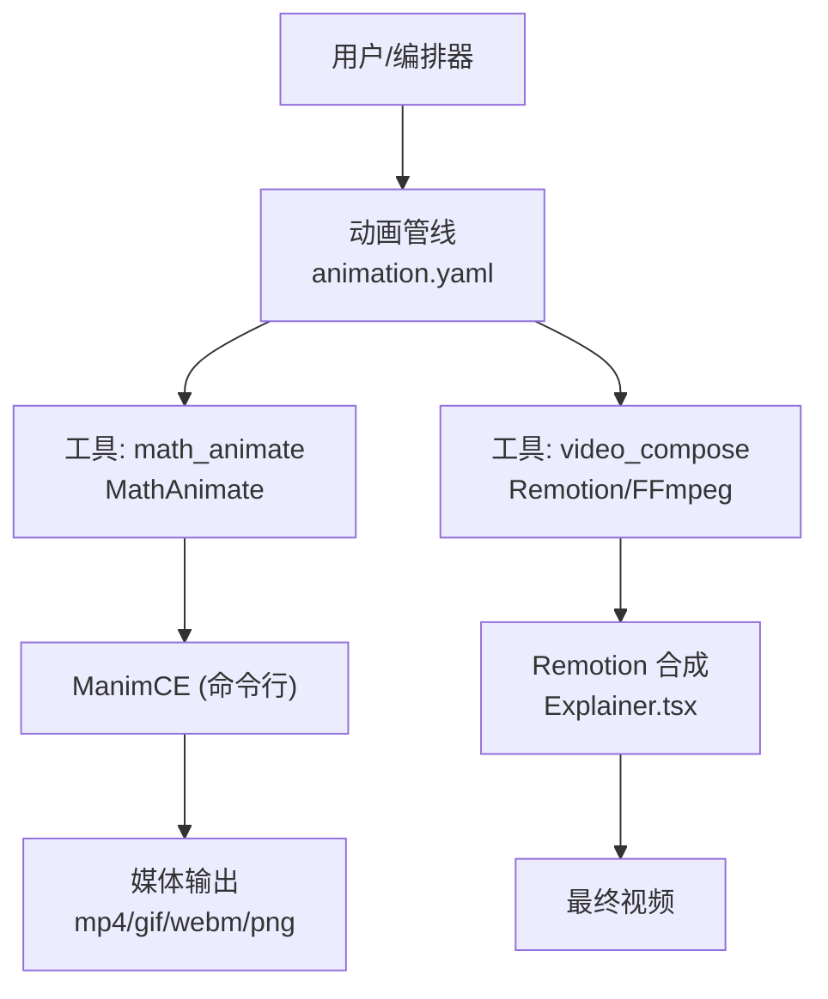
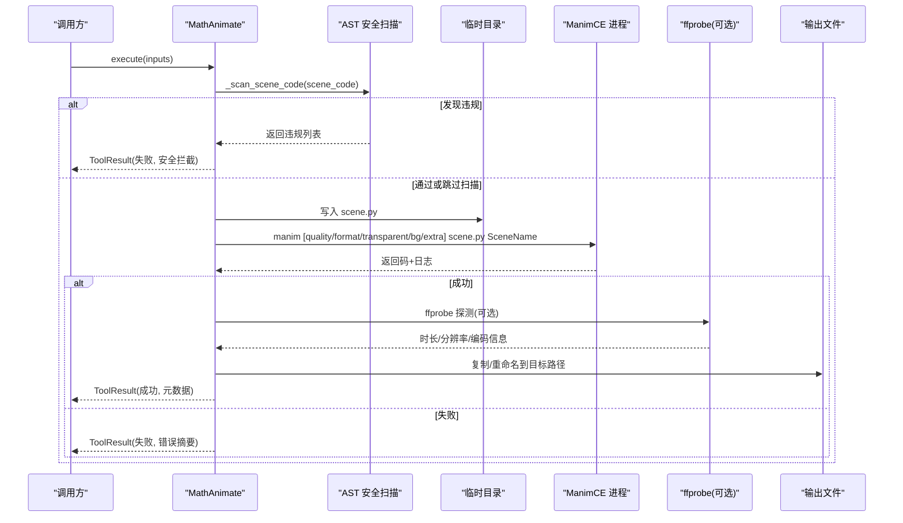
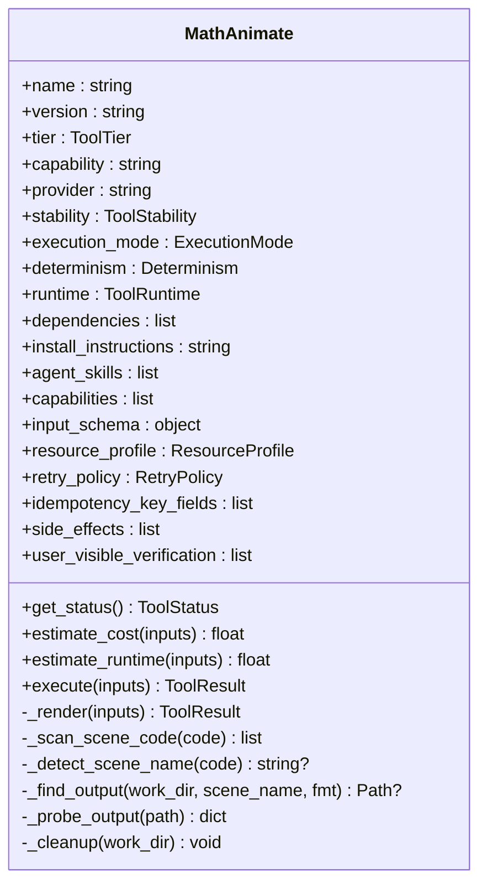
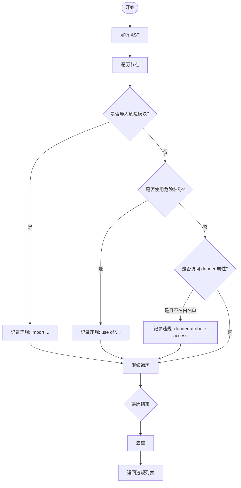
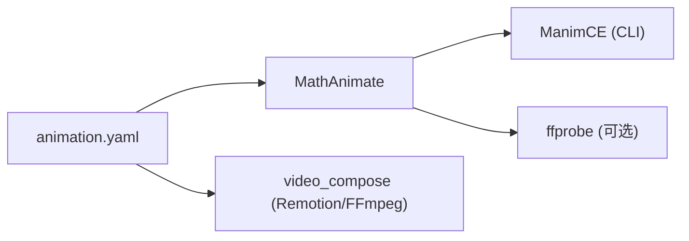

# 数学动画引擎

<cite>
**本文引用的文件**
- [math_animate.py](file://tools/graphics/math_animate.py)
- [test_math_animate_safety.py](file://tests/tools/test_math_animate_safety.py)
- [math_visualization.py](file://agents/skills/manimce-best-practices/examples/math_visualization.py)
- [latex.md](file://agents/skills/manimce-best-practices/rules/latex.md)
- [animation.yaml](file://pipeline_defs/animation.yaml)
- [Explainer.tsx](file://remotion-composer/src/Explainer.tsx)
- [video_compose.py](file://tools/video/video_compose.py)
</cite>

## 目录
1. [简介](#简介)
2. [项目结构](#项目结构)
3. [核心组件](#核心组件)
4. [架构总览](#架构总览)
5. [详细组件分析](#详细组件分析)
6. [依赖关系分析](#依赖关系分析)
7. [性能考量](#性能考量)
8. [故障排查指南](#故障排查指南)
9. [结论](#结论)
10. [附录：API参考与示例](#附录api参考与示例)

## 简介
本技术文档聚焦 OpenMontage 中的数学动画能力，围绕 MathAnimate 类展开，说明其如何基于 Manim Community Edition（ManimCE）将 Python 场景代码渲染为数学动画视频。文档覆盖 LaTeX 公式渲染、动态图形生成、时间轴控制机制、安全扫描策略、渲染管道流程、与 Remotion 等视频工具的集成方式，以及性能调优与大数据量处理建议。同时提供 API 参考与使用示例，帮助快速创建教学视频、科学演示和教育内容。

## 项目结构
OpenMontage 将“数学动画”作为可插拔工具集成到动画管线中。MathAnimate 位于 graphics 工具集，负责调用本地 Manim 执行器；Remotion 用于 React 驱动的动效合成；视频合成工具负责最终封装与输出。

图表来源
- [animation.yaml:1-300](file://pipeline_defs/animation.yaml#L1-L300)
- [math_animate.py:84-186](file://tools/graphics/math_animate.py#L84-L186)
- [Explainer.tsx:1-120](file://remotion-composer/src/Explainer.tsx#L1-L120)
- [video_compose.py:209-230](file://tools/video/video_compose.py#L209-L230)

章节来源
- [animation.yaml:1-300](file://pipeline_defs/animation.yaml#L1-L300)
- [math_animate.py:84-186](file://tools/graphics/math_animate.py#L84-L186)
- [Explainer.tsx:1-120](file://remotion-composer/src/Explainer.tsx#L1-L120)
- [video_compose.py:209-230](file://tools/video/video_compose.py#L209-L230)

## 核心组件
- MathAnimate：封装 ManimCE 渲染的本地工具，支持质量预设、格式选择、透明背景、背景色、额外 CLI 参数注入、安全扫描与临时工作目录管理。
- 安全扫描：通过 AST 静态分析阻止危险导入、危险名称与反射型 dunder 属性访问，默认拒绝不安全代码，除非显式允许。
- 管线集成：在动画管线中作为可选工具参与资产生成阶段，配合其他工具完成素材生产与合成。

章节来源
- [math_animate.py:84-186](file://tools/graphics/math_animate.py#L84-L186)
- [test_math_animate_safety.py:1-191](file://tests/tools/test_math_animate_safety.py#L1-L191)
- [animation.yaml:169-223](file://pipeline_defs/animation.yaml#L169-L223)

## 架构总览
从输入到输出的完整渲染管道如下：

图表来源
- [math_animate.py:208-416](file://tools/graphics/math_animate.py#L208-L416)
- [math_animate.py:453-487](file://tools/graphics/math_animate.py#L453-L487)

章节来源
- [math_animate.py:208-416](file://tools/graphics/math_animate.py#L208-L416)
- [math_animate.py:453-487](file://tools/graphics/math_animate.py#L453-L487)

## 详细组件分析

### MathAnimate 类
- 职责：接收场景代码与渲染配置，执行安全扫描，构造并运行 Manim 命令，定位输出文件，回传结果与元数据。
- 关键能力：
  - 质量预设：low/medium/high/4k/preview，映射到分辨率与帧率。
  - 格式：mp4/gif/webm/png（保存最后一帧）。
  - 透明背景与背景色：支持 PNG/WebM 透明通道与自定义背景色。
  - 额外参数：透传 extra_args 给 Manim。
  - 自动检测场景类名：若未指定，尝试从代码中提取继承自 Scene 的类名。
  - 资源与重试：声明 CPU/RAM/Disk 需求与超时重试策略。
  - 幂等键：scene_code、scene_name、quality。

图表来源
- [math_animate.py:84-186](file://tools/graphics/math_animate.py#L84-L186)
- [math_animate.py:208-416](file://tools/graphics/math_animate.py#L208-L416)
- [math_animate.py:418-495](file://tools/graphics/math_animate.py#L418-L495)

章节来源
- [math_animate.py:84-186](file://tools/graphics/math_animate.py#L84-L186)
- [math_animate.py:208-416](file://tools/graphics/math_animate.py#L208-L416)
- [math_animate.py:418-495](file://tools/graphics/math_animate.py#L418-L495)

### 安全扫描机制
- 扫描范围：
  - 禁止导入模块集合（如 os、sys、subprocess、socket、requests 等）。
  - 禁止危险标识符（eval、exec、open、__builtins__、getattr 等）。
  - 禁止除 __init__、__name__ 外的所有 dunder 属性访问，阻断反射逃逸。
- 行为：
  - 默认拒绝包含违规的代码，除非传入 allow_unsafe_code=true。
  - 语法错误不视为安全违规，交由 Manim 报告。
- 测试覆盖：涵盖危险导入、危险调用、反射绕过、dunder 逃逸、super().__init__ 放行等用例。

图表来源
- [math_animate.py:225-265](file://tools/graphics/math_animate.py#L225-L265)
- [test_math_animate_safety.py:1-191](file://tests/tools/test_math_animate_safety.py#L1-L191)

章节来源
- [math_animate.py:225-265](file://tools/graphics/math_animate.py#L225-L265)
- [test_math_animate_safety.py:1-191](file://tests/tools/test_math_animate_safety.py#L1-L191)

### LaTeX 公式与数学可视化
- 渲染基础：通过 Manim 的 MathTex/Tex 进行 LaTeX 排版，需安装 LaTeX（可选但推荐）。
- 常见用法：
  - 向量、矩阵、积分、求和、极限、导数链式法则等。
  - 分步推导、高亮、颜色标注、变换与过渡动画。
  - 坐标轴与函数图像、面积填充等可视化。
- 最佳实践：
  - 使用原始字符串 r"..." 编写 LaTeX。
  - 拆分表达式以便独立动画控制。
  - 合理使用字体大小与缩放。

章节来源
- [math_visualization.py:1-316](file://agents/skills/manimce-best-practices/examples/math_visualization.py#L1-L316)
- [latex.md:150-203](file://agents/skills/manimce-best-practices/rules/latex.md#L150-L203)

### 时间轴控制与动画效果
- 时间轴由 Manim 场景脚本驱动：在 construct 方法中组织动画序列、等待与过渡。
- 典型效果：
  - Write/FadeIn/GrowArrow/LaggedStart/TransformFromCopy/TransformMatchingTex 等。
  - 坐标轴与函数曲线绘制、区域填充、箭头指示。
  - 多行对齐方程、逐步推导与答案框选。
- 与管线协作：在资产生成阶段产出数学动画片段，后续由视频合成工具拼接与叠加字幕/音频。

章节来源
- [math_visualization.py:1-316](file://agents/skills/manimce-best-practices/examples/math_visualization.py#L1-L316)

### 与 Remotion 及其他视频工具的集成
- 集成点：
  - 动画管线在“资产”阶段可使用 math_animate 生成数学动画片段。
  - “合成”阶段通过 video_compose 调用 Remotion（React 组件）或 FFmpeg 进行最终合成。
  - Explainer.tsx 提供丰富的 UI 组件与转场，适合图文/图表/卡片类内容；数学动画可作为素材嵌入。
- 渲染运行时选择：
  - Remotion：适合 React 场景栈、复杂转场与文本/图表动效。
  - HyperFrames：HTML/GSAP 动效。
  - FFmpeg：简单拼接与裁剪。

章节来源
- [animation.yaml:169-223](file://pipeline_defs/animation.yaml#L169-L223)
- [video_compose.py:209-230](file://tools/video/video_compose.py#L209-L230)
- [Explainer.tsx:1-120](file://remotion-composer/src/Explainer.tsx#L1-L120)

## 依赖关系分析
- 外部依赖：
  - ManimCE：必须安装并可执行（manim checkhealth）。
  - FFmpeg/ffprobe：用于视频信息与格式处理。
  - LaTeX（可选）：用于高质量数学公式渲染。
- 内部依赖：
  - BaseTool：统一工具接口与元数据。
  - 动画管线：在 pipeline_defs/animation.yaml 中声明可用工具与阶段。

图表来源
- [math_animate.py:95-105](file://tools/graphics/math_animate.py#L95-L105)
- [animation.yaml:169-223](file://pipeline_defs/animation.yaml#L169-L223)
- [video_compose.py:209-230](file://tools/video/video_compose.py#L209-L230)

章节来源
- [math_animate.py:95-105](file://tools/graphics/math_animate.py#L95-L105)
- [animation.yaml:169-223](file://pipeline_defs/animation.yaml#L169-L223)
- [video_compose.py:209-230](file://tools/video/video_compose.py#L209-L230)

## 性能考量
- 质量与分辨率：
  - low/medium/high/4k/preview 对应不同分辨率与帧率，预览模式最快。
  - 估算运行时间随质量提升显著增长。
- 渲染优化：
  - 使用 --disable_caching 避免缓存干扰（headless 渲染）。
  - 合理设置 quality 与 format，gif/webm 体积较小但画质受限。
  - 透明背景仅在需要时使用（PNG 序列或 WebM）。
- 大数据量处理：
  - 批量渲染时复用相同质量预设与模板场景，减少重复编译。
  - 对长场景切分为多个短片段，分别渲染后拼接，降低单次渲染压力。
  - 利用管线复用策略（motif/template/transition family）减少重复计算。
- 资源与超时：
  - 默认超时 300s，必要时调整 quality 或启用 preview。
  - 监控磁盘空间与临时目录清理，避免残留占用。

章节来源
- [math_animate.py:74-81](file://tools/graphics/math_animate.py#L74-L81)
- [math_animate.py:196-206](file://tools/graphics/math_animate.py#L196-L206)
- [math_animate.py:312-362](file://tools/graphics/math_animate.py#L312-L362)

## 故障排查指南
- 常见问题：
  - Manim 未安装或未加入 PATH：检查 which manim 并安装依赖。
  - 安全扫描拦截：查看违规项（危险导入/名称/dunder），修正场景代码或显式允许。
  - 渲染超时：降低 quality 或使用 preview。
  - 输出文件缺失：确认 media 目录结构与场景类名匹配。
  - 公式渲染异常：确保已安装 LaTeX，并使用 MathTex/Tex 正确写法。
- 诊断步骤：
  - 启用 extra_args 传递调试参数。
  - 捕获 stderr/stdout 以定位具体错误。
  - 使用 ffprobe 验证输出文件元数据。

章节来源
- [math_animate.py:188-223](file://tools/graphics/math_animate.py#L188-L223)
- [math_animate.py:281-377](file://tools/graphics/math_animate.py#L281-L377)
- [math_animate.py:432-487](file://tools/graphics/math_animate.py#L432-L487)

## 结论
MathAnimate 提供了稳定、可控且安全的数学动画渲染能力，依托 ManimCE 实现高质量的 LaTeX 公式与动态图形生成。结合 OpenMontage 的动画管线与 Remotion 合成工具，可高效构建教学视频、科学演示与教育内容。通过质量预设、安全扫描与性能优化策略，能够在保证安全性的前提下获得良好的渲染效率与输出质量。

## 附录：API参考与示例

### MathAnimate 输入参数
- scene_code（必填）：定义 Manim 场景的 Python 代码，需包含继承自 Scene 的类与 construct 方法。
- allow_unsafe_code（可选，默认 false）：跳过安全扫描，仅对完全信任的代码启用。
- scene_name（可选）：要渲染的场景类名，未提供时自动检测。
- quality（可选，默认 medium）：low/medium/high/4k/preview。
- format（可选，默认 mp4）：mp4/gif/webm/png。
- output_path（可选）：输出文件路径。
- transparent（可选，默认 false）：透明背景（PNG 序列或 WebM）。
- background_color（可选）：十六进制背景色。
- extra_args（可选）：附加 Manim CLI 参数。

章节来源
- [math_animate.py:113-169](file://tools/graphics/math_animate.py#L113-L169)

### 渲染流程要点
- 自动添加 from manim import *（若缺失）。
- 安全扫描（默认开启）。
- 写入临时 scene.py 并构建 manim 命令。
- 执行渲染并查找输出文件。
- 可选 ffprobe 探测元数据。
- 复制到目标路径并清理临时目录。

章节来源
- [math_animate.py:267-416](file://tools/graphics/math_animate.py#L267-L416)

### 使用示例（概念性）
- 创建数学教学视频：
  - 编写包含 MathTex 与动画序列的场景代码。
  - 选择 medium 质量与 mp4 格式，设置输出路径。
  - 提交至 MathAnimate.execute 获取视频文件。
- 科学演示：
  - 使用坐标轴与函数图像展示变化趋势。
  - 通过 Transform 与 LaggedStart 组织步骤化呈现。
- 教育内容：
  - 结合管线中的其他工具（图表、文本卡片、音频）进行合成。
  - 使用 Remotion 组件叠加字幕与标题。

章节来源
- [math_visualization.py:1-316](file://agents/skills/manimce-best-practices/examples/math_visualization.py#L1-L316)
- [animation.yaml:169-223](file://pipeline_defs/animation.yaml#L169-L223)
- [Explainer.tsx:1-120](file://remotion-composer/src/Explainer.tsx#L1-L120)