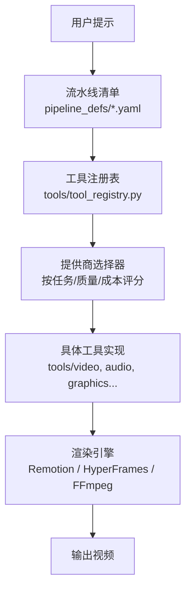
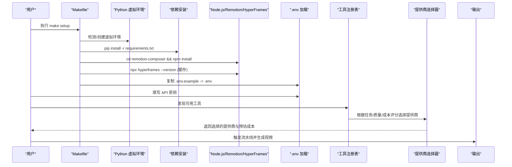
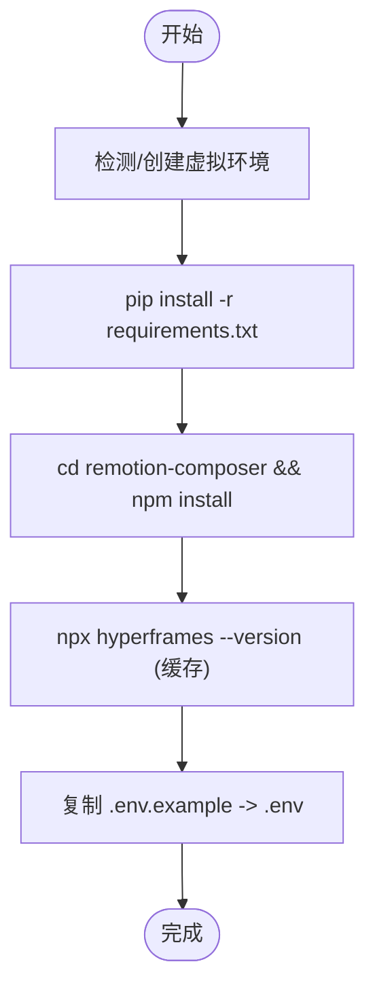
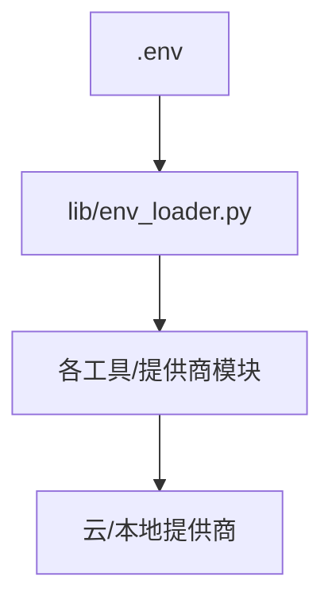
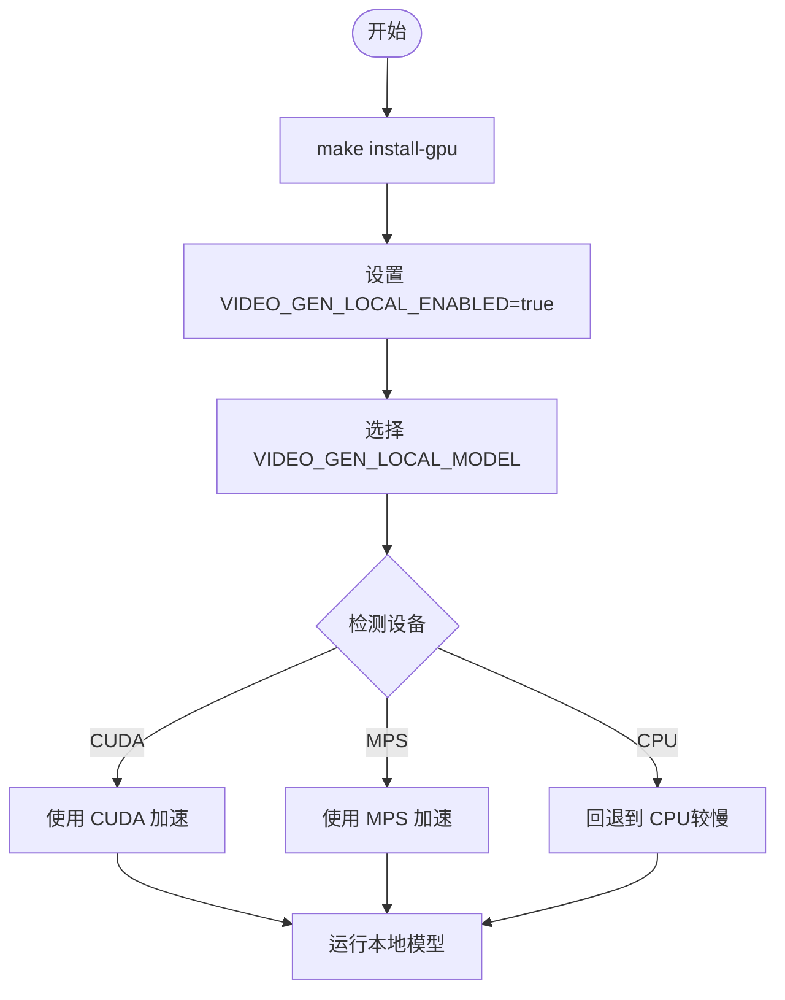
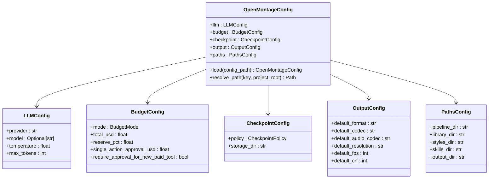
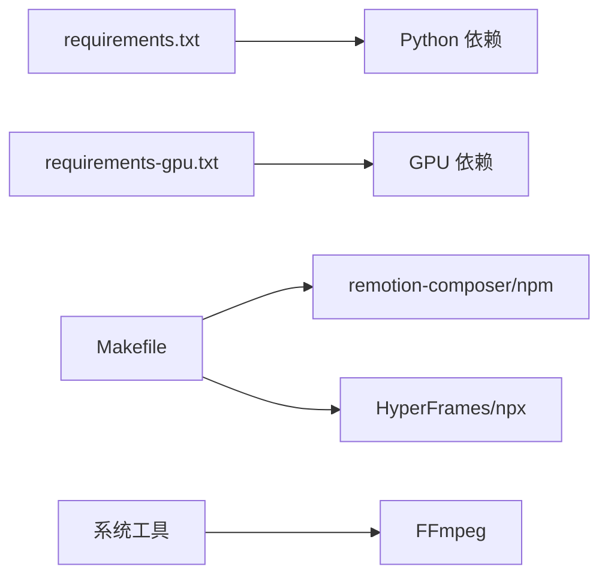

# 安装与配置

<cite>
**本文引用的文件**
- [README.md](file://README.md)
- [Makefile](file://Makefile)
- [requirements.txt](file://requirements.txt)
- [requirements-gpu.txt](file://requirements-gpu.txt)
- [config.yaml](file://config.yaml)
- [setup.py](file://setup.py)
- [docs/PROVIDERS.md](file://docs/PROVIDERS.md)
- [docs/apple-silicon-mps.md](file://docs/apple-silicon-mps.md)
- [lib/env_loader.py](file://lib/env_loader.py)
- [lib/config_model.py](file://lib/config_model.py)
</cite>

## 目录
1. [简介](#简介)
2. [项目结构](#项目结构)
3. [核心组件](#核心组件)
4. [架构总览](#架构总览)
5. [详细组件分析](#详细组件分析)
6. [依赖关系分析](#依赖关系分析)
7. [性能考虑](#性能考虑)
8. [故障排除指南](#故障排除指南)
9. [结论](#结论)
10. [附录](#附录)

## 简介
本指南面向从零开始的用户，提供 OpenMontage 的完整安装与配置说明。内容涵盖环境要求、一键安装与手动安装流程、不同平台（Windows/macOS/Linux）注意事项、API 密钥配置（Kling、Runway、Google Veo、OpenAI 等）、GPU 本地模型安装与 CUDA/MPS 配置，以及常见问题的排查方法。目标是让不同技术水平的用户都能顺利完成部署并运行视频生产流水线。

## 项目结构
OpenMontage 采用“工具 + 流水线 + 技能”的分层组织方式：
- tools：注册的生产工具集（视频生成、图像生成、TTS、音频、增强、分析等）
- pipeline_defs：YAML 流水线清单（编排步骤、工具选择、质量门禁）
- skills：Markdown 技能文件（指导 AI 如何正确使用工具）
- lib：运行时配置加载、环境变量管理、路径解析等基础设施
- remotion-composer：基于 React/Remotion 的视频合成引擎
- docs：提供商文档、架构说明、Apple Silicon 支持说明等

图表来源
- [Makefile:54-76](file://Makefile#L54-L76)
- [README.md:450-475](file://README.md#L450-L475)

章节来源
- [README.md:450-475](file://README.md#L450-L475)
- [Makefile:54-76](file://Makefile#L54-L76)

## 核心组件
- 环境与依赖管理
  - Python 3.10+、FFmpeg、Node.js 18+
  - 通过 Makefile 自动创建虚拟环境、安装 Python 依赖、初始化 Remotion Composer、缓存 HyperFrames CLI、复制 .env.example 为 .env
- 配置系统
  - config.yaml：全局配置（LLM、预算、检查点策略、输出参数、路径）
  - lib/config_model.py：Pydantic 模型校验与路径解析
  - lib/env_loader.py：加载 .env 并提供 get_env/require_env 访问
- 提供商集成
  - docs/PROVIDERS.md：所有云/本地提供商的环境变量、设置步骤、定价与能力说明
  - README.md：快速入门、API 密钥示例、GPU 本地模型开关

章节来源
- [Makefile:54-76](file://Makefile#L54-L76)
- [config.yaml:1-34](file://config.yaml#L1-L34)
- [lib/config_model.py:1-93](file://lib/config_model.py#L1-L93)
- [lib/env_loader.py:1-35](file://lib/env_loader.py#L1-L35)
- [docs/PROVIDERS.md:29-81](file://docs/PROVIDERS.md#L29-L81)
- [README.md:180-278](file://README.md#L180-L278)

## 架构总览
下图展示了从环境准备到最终输出的关键阶段，包括 make setup 的工作流、环境变量加载、提供商选择与渲染。

图表来源
- [Makefile:54-76](file://Makefile#L54-L76)
- [lib/env_loader.py:15-26](file://lib/env_loader.py#L15-L26)
- [docs/PROVIDERS.md:29-81](file://docs/PROVIDERS.md#L29-L81)

## 详细组件分析

### 环境要求与前置条件
- Python 3.10+：用于运行 Python 工具链与依赖
- FFmpeg：用于编码、字幕烧录、音频混音、颜色校正
- Node.js 18+：用于 Remotion 与 HyperFrames 渲染
- AI 编程助手：Claude Code、Cursor、Copilot、Windsurf、Codex 等（可选但推荐）

章节来源
- [README.md:180-188](file://README.md#L180-L188)

### 一键安装（make setup）
- 自动创建或复用虚拟环境
- 安装 Python 依赖（requirements.txt）
- 安装 Remotion Composer（npm install）
- 安装 Piper TTS（离线免费语音）
- 预热 HyperFrames CLI（npx 缓存）
- 复制 .env.example 为 .env，便于后续添加 API 密钥

图表来源
- [Makefile:54-76](file://Makefile#L54-L76)

章节来源
- [Makefile:54-76](file://Makefile#L54-L76)

### 手动安装（无 make）
- 创建并激活虚拟环境
- 安装 Python 依赖
- 进入 remotion-composer 安装 Node 依赖
- 安装 piper-tts
- 复制 .env.example 为 .env
- Windows 注意：若 npm install 报错 ERR_INVALID_ARG_TYPE，使用 npx --yes npm install

章节来源
- [README.md:211-216](file://README.md#L211-L216)

### 平台特殊配置
- macOS：brew install ffmpeg；Apple Silicon 可通过 MPS 加速本地模型
- Linux：sudo apt install ffmpeg；确保系统库满足 PyTorch/CUDA 需求
- Windows：PowerShell 激活虚拟环境；npm 安装失败时使用 npx --yes npm install

章节来源
- [README.md:180-188](file://README.md#L180-L188)
- [README.md:211-216](file://README.md#L211-L216)
- [docs/apple-silicon-mps.md:1-64](file://docs/apple-silicon-mps.md#L1-L64)

### API 密钥配置
- 在 .env 中添加所需提供商的密钥（每个密钥都是可选的，按需添加）
- 常用密钥示例：
  - FAL_KEY（FLUX 图像 + Google Veo/Kling/MiniMax 视频 + Recraft 图像）
  - ATLASCLOUD_API_KEY（Atlas Cloud 统一网关）
  - KLING_API_KEY、KLING_API_BASE_URL（Kling 官方直连）
  - PEXELS_API_KEY、PIXABAY_API_KEY、UNSPLASH_ACCESS_KEY（免费素材）
  - SUNO_API_KEY（音乐）
  - ELEVENLABS_API_KEY（TTS、音乐、音效）
  - OPENAI_API_KEY（OpenAI TTS、GPT Image 2）
  - XAI_API_KEY（xAI Grok 图像/视频）
  - GOOGLE_API_KEY（Google Imagen、TTS、Lyria、Gemini Omni/Veo）
  - ARK_API_KEY（火山引擎 Ark Seedance 2.0/2.5）
  - HEYGEN_API_KEY、RUNWAY_API_KEY（多模型视频网关）

- 环境变量加载机制：
  - lib/env_loader.py 负责加载 .env 并提供 get_env/require_env
  - 工具与提供商通过环境变量获取密钥

图表来源
- [lib/env_loader.py:15-35](file://lib/env_loader.py#L15-L35)
- [docs/PROVIDERS.md:29-81](file://docs/PROVIDERS.md#L29-L81)
- [README.md:234-265](file://README.md#L234-L265)

章节来源
- [docs/PROVIDERS.md:29-81](file://docs/PROVIDERS.md#L29-L81)
- [README.md:234-265](file://README.md#L234-L265)
- [lib/env_loader.py:15-35](file://lib/env_loader.py#L15-L35)

### GPU 本地模型安装与配置
- 启用 GPU 依赖：make install-gpu（安装 torch/torchaudio/torchvision 及 diffusers/transformers/accelerate）
- 本地视频生成开关：
  - VIDEO_GEN_LOCAL_ENABLED=true
  - VIDEO_GEN_LOCAL_MODEL=wan2.2-ti2v-5b | wan2.1-1.3b | wan2.1-14b | hunyuan-1.5 | ltx2-local | cogvideo-5b
- Apple Silicon（MPS）：
  - 自动检测并使用 MPS（Metal Performance Shaders）
  - 无需额外 CUDA 构建；torch 默认包含 MPS 支持
  - 限制：VRAM 受限、不支持 bfloat16、CPU offload 仅 CUDA 有效、Real-ESRGAN 在非 CUDA 设备使用 fp32

图表来源
- [Makefile:86-88](file://Makefile#L86-L88)
- [README.md:268-278](file://README.md#L268-L278)
- [docs/apple-silicon-mps.md:1-64](file://docs/apple-silicon-mps.md#L1-L64)

章节来源
- [Makefile:86-88](file://Makefile#L86-L88)
- [README.md:268-278](file://README.md#L268-L278)
- [docs/apple-silicon-mps.md:1-64](file://docs/apple-silicon-mps.md#L1-L64)

### 配置系统详解
- config.yaml：定义 LLM 提供商、预算模式、检查点策略、输出格式与分辨率、路径
- lib/config_model.py：使用 Pydantic 模型校验配置项，并提供路径解析
- 路径解析：resolve_path 将相对路径解析为项目根下的绝对路径

图表来源
- [lib/config_model.py:1-93](file://lib/config_model.py#L1-L93)
- [config.yaml:1-34](file://config.yaml#L1-L34)

章节来源
- [lib/config_model.py:1-93](file://lib/config_model.py#L1-L93)
- [config.yaml:1-34](file://config.yaml#L1-L34)

## 依赖关系分析
- Python 依赖：pyyaml、pydantic、jsonschema、python-dotenv、Pillow、numpy、requests、google-auth、google-genai、openai
- GPU 依赖：torch、torchaudio、torchvision（需配合 CUDA/MPS）
- Node.js 依赖：Remotion Composer（npm install）、HyperFrames（npx 缓存）
- 外部工具：FFmpeg（系统级安装）

图表来源
- [requirements.txt:1-17](file://requirements.txt#L1-L17)
- [requirements-gpu.txt:1-6](file://requirements-gpu.txt#L1-L6)
- [Makefile:54-76](file://Makefile#L54-L76)

章节来源
- [requirements.txt:1-17](file://requirements.txt#L1-L17)
- [requirements-gpu.txt:1-6](file://requirements-gpu.txt#L1-L6)
- [Makefile:54-76](file://Makefile#L54-L76)

## 性能考虑
- 优先使用 GPU（CUDA 或 MPS）以加速本地模型推理
- 合理选择本地模型大小（如 wan2.1-1.3b vs 14b），平衡质量与显存占用
- 使用 HyperFrames 缓存减少首次渲染冷启动时间
- 控制输出分辨率与帧率以降低渲染负载
- 利用提供商评分选择器在质量、延迟与成本之间取得平衡

[本节为通用性能建议，不直接分析具体文件]

## 故障排除指南
- Python 版本不匹配
  - 现象：make setup 报错 Python 版本过低
  - 解决：安装 Python 3.10+，或使用 uv 创建兼容环境
- FFmpeg 未安装或不可用
  - 现象：渲染失败、无法烧录字幕或混音
  - 解决：按平台安装 FFmpeg 并确保 PATH 正确
- Node.js 依赖安装失败
  - 现象：npm install 报错 ERR_INVALID_ARG_TYPE
  - 解决：Windows 下使用 npx --yes npm install
- GPU 依赖冲突或驱动问题
  - 现象：torch/torchaudio 导入失败或 CUDA 不可用
  - 解决：确认 CUDA 驱动与 PyTorch 版本匹配；macOS 使用 MPS 替代
- Apple Silicon MPS 异常
  - 现象：bfloat16 不支持、fp16 产生 NaN
  - 解决：MPS 使用 fp16/fp32 自动切换；避免超大型模型导致内存不足
- 环境变量未生效
  - 现象：工具找不到 API 密钥
  - 解决：确认 .env 已复制到项目根目录；使用 require_env 验证必填键

章节来源
- [Makefile:13-48](file://Makefile#L13-L48)
- [README.md:180-216](file://README.md#L180-L216)
- [docs/apple-silicon-mps.md:42-64](file://docs/apple-silicon-mps.md#L42-L64)
- [lib/env_loader.py:24-35](file://lib/env_loader.py#L24-L35)

## 结论
通过本指南，您可以从零开始完成 OpenMontage 的安装与配置，理解其环境要求、安装流程、API 密钥设置、GPU 本地模型配置以及跨平台注意事项。结合提供商文档与配置系统，您可以根据自身需求灵活选择云与本地资源，获得高质量、可审计、可治理的视频生产体验。

[本节为总结性内容，不直接分析具体文件]

## 附录
- 快速参考
  - 一键安装：make setup
  - GPU 安装：make install-gpu
  - 演示渲染：make demo
  - 提供商文档：docs/PROVIDERS.md
  - Apple Silicon 支持：docs/apple-silicon-mps.md

[本节为补充信息，不直接分析具体文件]