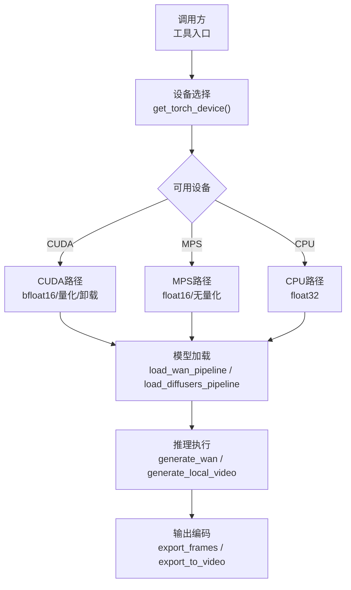
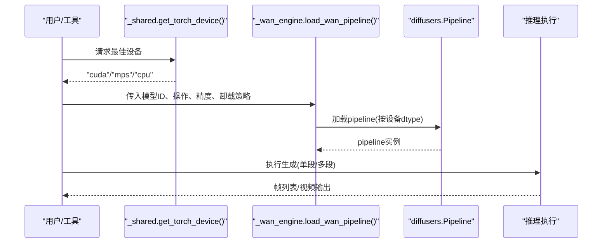
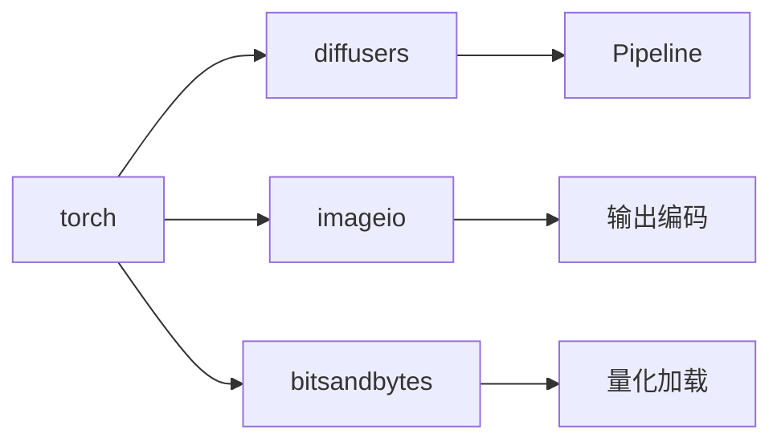

# GPU相关问题

<cite>
**本文引用的文件**
- [Apple Silicon (MPS) 支持文档](file://docs/apple-silicon-mps.md)
- [GPU依赖清单](file://requirements-gpu.txt)
- [视频工具共享模块](file://tools/video/_shared.py)
- [Wan本地生成引擎](file://tools/video/_wan_engine.py)
- [MPS设备检测测试](file://tests/tools/test_mps_device.py)
- [Wan视频合约测试](file://tests/contracts/test_wan_video.py)
</cite>

## 目录
1. [简介](#简介)
2. [项目结构](#项目结构)
3. [核心组件](#核心组件)
4. [架构总览](#架构总览)
5. [详细组件分析](#详细组件分析)
6. [依赖关系分析](#依赖关系分析)
7. [性能注意事项](#性能注意事项)
8. [故障排除指南](#故障排除指南)
9. [结论](#结论)
10. [附录](#附录)

## 简介
本指南聚焦OpenMontage在GPU环境下的配置与故障排除，覆盖Apple Silicon MPS、NVIDIA CUDA以及通用GPU内存管理与性能优化。内容基于仓库中的实现与文档，提供设备检测、状态监控、常见错误诊断与调优建议，帮助在不同GPU供应商（Apple、NVIDIA、AMD）上稳定运行本地视频生成与增强任务。

## 项目结构
本项目将GPU相关能力集中在视频工具层：
- 设备选择与精度策略：通过统一的设备检测函数自动选择CUDA/MPS/CPU，并据此设置数据类型与推理路径。
- 模型加载与显存管理：针对Wan系列模型提供量化、分块解码、CPU卸载等策略，适配不同显存容量。
- 错误诊断：对CUDA驱动不匹配导致的NVML失败与OOM进行专门识别与建议。

图表来源
- [视频工具共享模块:249-279](file://tools/video/_shared.py#L249-L279)
- [Wan本地生成引擎:179-272](file://tools/video/_wan_engine.py#L179-L272)

章节来源
- [视频工具共享模块:249-372](file://tools/video/_shared.py#L249-L372)
- [Wan本地生成引擎:179-272](file://tools/video/_wan_engine.py#L179-L272)

## 核心组件
- 设备检测与类型选择：优先CUDA，其次MPS，最后CPU；根据设备选择dtype（CUDA bfloat16/float16，MPS float16，CPU float32）。
- 模型加载与显存优化：支持int4/int8量化、VAE分块/切片、CPU卸载（model或sequential），降低峰值显存占用。
- 长片段生成：按时间尺度对齐帧数，分段生成并拼接，控制漂移与一致性。
- 错误诊断：识别NVML驱动不匹配与OOM，给出可操作建议。

章节来源
- [视频工具共享模块:249-372](file://tools/video/_shared.py#L249-L372)
- [Wan本地生成引擎:112-177](file://tools/video/_wan_engine.py#L112-L177)
- [Wan本地生成引擎:477-671](file://tools/video/_wan_engine.py#L477-L671)

## 架构总览
下图展示从设备检测到模型加载、推理与输出的完整流程，体现不同GPU后端的分支与统一接口。

图表来源
- [视频工具共享模块:249-279](file://tools/video/_shared.py#L249-L279)
- [Wan本地生成引擎:179-272](file://tools/video/_wan_engine.py#L179-L272)
- [Wan本地生成引擎:477-671](file://tools/video/_wan_engine.py#L477-L671)

## 详细组件分析

### Apple Silicon MPS环境与配置
- 自动启用：macOS 12.3+的Apple Silicon Mac默认包含MPS后端，无需额外构建。
- 设备优先级：当CUDA不可用时，若MPS已构建且可用，则选择MPS。
- 数据类型：MPS使用float16；bfloat16仅在CUDA可靠。
- 已知限制：
  - VRAM为统一内存，大模型可能受限于16GB机型。
  - enable_model_cpu_offload仅CUDA有效，MPS直接放置到设备。
  - Real-ESRGAN在MPS上使用fp16可能出现NaN，非CUDA设备回退fp32。
- 验证方法：通过设备检测函数确认返回“mps”。

章节来源
- [Apple Silicon (MPS) 支持文档:1-64](file://docs/apple-silicon-mps.md#L1-L64)
- [视频工具共享模块:249-279](file://tools/video/_shared.py#L249-L279)
- [视频工具共享模块:330-372](file://tools/video/_shared.py#L330-L372)

### NVIDIA CUDA环境配置与兼容性
- 依赖：安装torch>=2.0及音频/视觉库以启用CUDA。
- 设备检测：优先CUDA，若可用则选择CUDA路径。
- 精度与量化：
  - bf16需要足够显存；否则自动降级至int8/int4。
  - int4/int8量化仅CUDA可用，MPS/CPU不使用量化。
- 卸载模式：
  - model：整模块驻留显存，速度快但显存占用高。
  - sequential：逐子模块流式处理，释放更多显存用于激活。
- 驱动不匹配：
  - NVML初始化失败会伪装成OOM；需重启系统以加载匹配的kernel module。
  - 临时规避：保持bf16精度，降低分辨率或片段长度，避免进入OOM路径。

章节来源
- [GPU依赖清单:1-6](file://requirements-gpu.txt#L1-L6)
- [Wan本地生成引擎:101-177](file://tools/video/_wan_engine.py#L101-L177)
- [Wan本地生成引擎:891-948](file://tools/video/_wan_engine.py#L891-L948)
- [Wan视频合约测试:338-396](file://tests/contracts/test_wan_video.py#L338-L396)

### AMD GPU支持说明
- 当前代码未提供AMD ROCm专用路径；设备检测仅考虑CUDA与MPS。
- 若系统存在ROCm环境，需确保PyTorch能识别设备；否则将回退至CPU。
- 建议：在AMD平台上优先使用CPU路径或迁移至CUDA/MPS平台以获得更好性能。

章节来源
- [视频工具共享模块:249-279](file://tools/video/_shared.py#L249-L279)

### 设备检测与状态监控
- 设备检测：get_torch_device()返回最优设备字符串，便于上层统一路由。
- 状态检查：local_generation_status()可判断本地生成是否可用（依赖diffusers/torch）。
- 显存探测：_vram_gb()读取CUDA显存总量，用于自动精度与卸载策略决策。

章节来源
- [视频工具共享模块:249-295](file://tools/video/_shared.py#L249-L295)
- [Wan本地生成引擎:101-110](file://tools/video/_wan_engine.py#L101-L110)

### 内存管理与性能优化
- 量化：int4/int8显著降低权重显存占用，适用于显存受限场景。
- VAE分块/切片：降低长视频解码峰值显存。
- CPU卸载：
  - model：适合显存充足、追求速度。
  - sequential：适合显存紧张、接受PCIe带宽开销。
- 帧数与尺寸对齐：按VAE时间/空间压缩因子对齐，避免无效计算与报错。
- 分段生成：长时长视频通过链式分段生成，控制漂移并维持一致性。

章节来源
- [Wan本地生成引擎:112-177](file://tools/video/_wan_engine.py#L112-L177)
- [Wan本地生成引擎:259-272](file://tools/video/_wan_engine.py#L259-L272)
- [Wan本地生成引擎:61-94](file://tools/video/_wan_engine.py#L61-L94)
- [Wan本地生成引擎:477-671](file://tools/video/_wan_engine.py#L477-L671)

## 依赖关系分析
- torch/torchaudio/torchvision：GPU加速基础依赖。
- diffusers：提供Pipeline加载与推理接口。
- imageio/PIL：帧读写与编码。
- bitsandbytes：量化支持（CUDA）。
- huggingface_hub：模型元信息检查（可选）。

图表来源
- [GPU依赖清单:1-6](file://requirements-gpu.txt#L1-L6)
- [Wan本地生成引擎:152-163](file://tools/video/_wan_engine.py#L152-L163)

章节来源
- [GPU依赖清单:1-6](file://requirements-gpu.txt#L1-L6)
- [Wan本地生成引擎:152-163](file://tools/video/_wan_engine.py#L152-L163)

## 性能注意事项
- 精度选择：
  - CUDA：优先bf16；显存不足时降级int8/int4。
  - MPS：使用float16；避免bfloat16。
  - CPU：使用float32。
- 卸载策略：
  - 显存充足：model模式更快。
  - 显存紧张：sequential模式更稳。
- 分辨率与片段长度：
  - 降低分辨率与segment_frames可有效缓解OOM。
  - 合理对齐VAE时空压缩因子，避免无效计算。
- 长视频生成：
  - 分段生成并校正颜色漂移，保证整体一致性。
- 量化与VAE优化：
  - 量化减少权重显存；VAE分块/切片降低解码峰值。

章节来源
- [视频工具共享模块:330-372](file://tools/video/_shared.py#L330-L372)
- [Wan本地生成引擎:112-177](file://tools/video/_wan_engine.py#L112-L177)
- [Wan本地生成引擎:259-272](file://tools/video/_wan_engine.py#L259-L272)
- [Wan本地生成引擎:477-671](file://tools/video/_wan_engine.py#L477-L671)

## 故障排除指南

### Apple Silicon MPS常见问题
- 症状：设备检测返回“cpu”而非“mps”。
- 排查步骤：
  - 确认macOS版本≥12.3。
  - 确认已安装torch（默认wheel含MPS）。
  - 确认运行原生ARM Python（非Rosetta x86）。
- 已知限制：
  - 统一内存限制：>16GB模型可能无法装入16GB机型。
  - bfloat16不支持：MPS使用float16。
  - CPU卸载不可用：MPS直接放置到设备。
  - Real-ESRGAN fp16异常：非CUDA设备回退fp32。

章节来源
- [Apple Silicon (MPS) 支持文档:1-64](file://docs/apple-silicon-mps.md#L1-L64)
- [视频工具共享模块:249-279](file://tools/video/_shared.py#L249-L279)

### NVIDIA CUDA常见问题
- 症状：出现“nvmlInit”内部断言，掩盖真实OOM。
- 原因：内核模块与用户态库版本不一致。
- 解决步骤：
  - 重启系统以加载匹配的kernel module。
  - 对比“cat /proc/driver/nvidia/version”与“nvidia-smi”版本。
  - 临时规避：保持bf16精度，降低分辨率或片段长度，避免进入OOM路径。
- 症状：CUDA OOM。
- 解决步骤：
  - 切换offload_mode为“sequential”。
  - 降低精度（bf16→int8→int4）。
  - 降低分辨率与segment_frames。
  - 启用VAE分块/切片。

章节来源
- [Wan本地生成引擎:891-948](file://tools/video/_wan_engine.py#L891-L948)
- [Wan视频合约测试:338-396](file://tests/contracts/test_wan_video.py#L338-L396)

### 设备检测与验证
- 验证MPS：调用设备检测函数，期望返回“mps”。
- 验证CUDA：确保torch.cuda.is_available()为真。
- 状态检查：local_generation_status()返回可用/不可用。

章节来源
- [视频工具共享模块:249-295](file://tools/video/_shared.py#L249-L295)
- [MPS设备检测测试:32-49](file://tests/tools/test_mps_device.py#L32-L49)

### 性能分析与监控
- 显存探测：_vram_gb()获取CUDA显存总量，辅助自动精度与卸载策略。
- 运行时估算：分段数量影响总耗时，长视频需考虑链式成本。
- 日志与诊断：生成结果包含precision、offload_mode、segments等信息，便于回溯。

章节来源
- [Wan本地生成引擎:101-110](file://tools/video/_wan_engine.py#L101-L110)
- [Wan本地生成引擎:636-671](file://tools/video/_wan_engine.py#L636-L671)
- [Wan视频合约测试:388-396](file://tests/contracts/test_wan_video.py#L388-L396)

## 结论
OpenMontage通过统一的设备检测与灵活的精度/卸载策略，适配Apple Silicon MPS与NVIDIA CUDA环境，并提供针对长视频生成的分段与一致性控制。对于NVIDIA驱动不匹配与OOM问题，提供了明确的诊断与建议。建议在显存受限场景优先使用量化与sequential卸载，并结合VAE分块/切片优化峰值显存。

## 附录

### 快速配置参考
- Apple Silicon MPS：
  - 启用本地生成环境变量。
  - 安装torch（默认含MPS）。
  - 验证设备检测返回“mps”。
- NVIDIA CUDA：
  - 安装requirements-gpu依赖。
  - 确保CUDA可用。
  - 根据显存选择精度与卸载模式。

章节来源
- [Apple Silicon (MPS) 支持文档:14-28](file://docs/apple-silicon-mps.md#L14-L28)
- [GPU依赖清单:1-6](file://requirements-gpu.txt#L1-L6)
- [视频工具共享模块:282-309](file://tools/video/_shared.py#L282-L309)