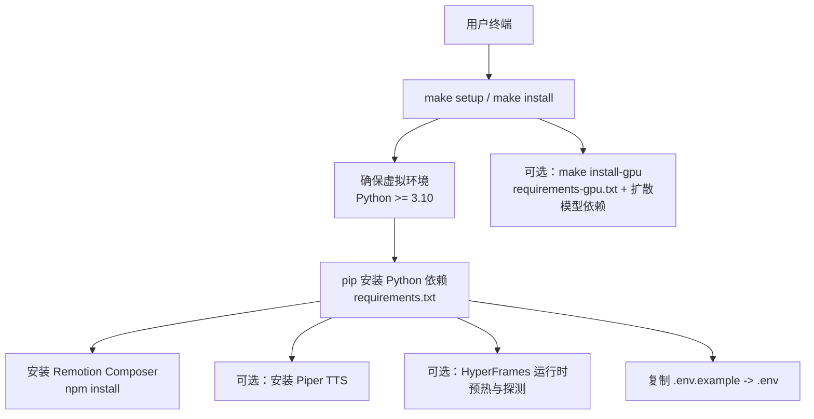
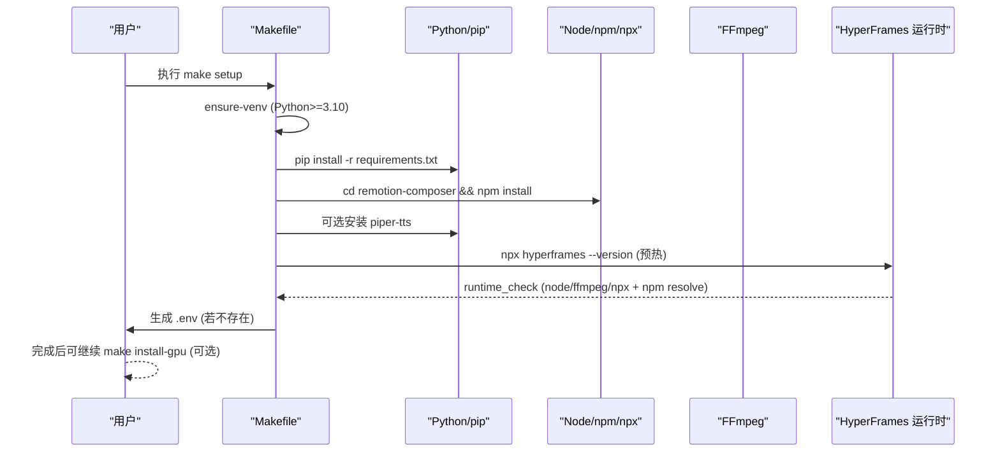
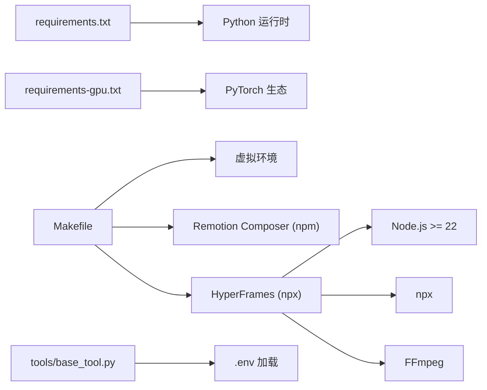

# 安装问题

<cite>
**本文引用的文件**
- [README.md](file://README.md)
- [Makefile](file://Makefile)
- [requirements.txt](file://requirements.txt)
- [requirements-gpu.txt](file://requirements-gpu.txt)
- [setup.py](file://setup.py)
- [config.yaml](file://config.yaml)
- [tools/base_tool.py](file://tools/base_tool.py)
- [tools/video/hyperframes_compose.py](file://tools/video/hyperframes_compose.py)
- [tests/tools/test_base_tool_dependencies.py](file://tests/tools/test_base_tool_dependencies.py)
- [tests/tools/test_hyperframes_compose.py](file://tests/tools/test_hyperframes_compose.py)
- [docs/PROVIDERS.md](file://docs/PROVIDERS.md)
</cite>

## 目录
1. [简介](#简介)
2. [项目结构](#项目结构)
3. [核心组件](#核心组件)
4. [架构总览](#架构总览)
5. [详细组件分析](#详细组件分析)
6. [依赖关系分析](#依赖关系分析)
7. [性能与兼容性注意事项](#性能与兼容性注意事项)
8. [故障排除指南](#故障排除指南)
9. [结论](#结论)
10. [附录](#附录)

## 简介
本指南聚焦 OpenMontage 的安装与启动阶段常见问题，覆盖 Python 版本、虚拟环境、pip 安装失败、C++/系统库缺失、Node.js/FFmpeg/npx 环境、GPU 依赖、环境变量与路径配置等。文档同时提供跨平台（Windows、macOS、Linux）的排错步骤、错误日志分析方法以及社区支持入口。

## 项目结构
OpenMontage 通过 Makefile 统一封装了虚拟环境创建、Python 依赖安装、Remotion Composer 安装、Piper TTS 安装、HyperFrames 运行时预热与环境探测等流程；Python 依赖集中在 requirements*.txt 中；Node/FFmpeg 等外部二进制由 HyperFrames 运行时检查；GPU 相关依赖在 requirements-gpu.txt 中。

**图表来源**
- [Makefile:13-76](file://Makefile#L13-L76)
- [Makefile:80-88](file://Makefile#L80-L88)
- [requirements.txt:1-17](file://requirements.txt#L1-L17)
- [requirements-gpu.txt:1-6](file://requirements-gpu.txt#L1-L6)

**章节来源**
- [Makefile:13-76](file://Makefile#L13-L76)
- [Makefile:80-88](file://Makefile#L80-L88)
- [requirements.txt:1-17](file://requirements.txt#L1-L17)
- [requirements-gpu.txt:1-6](file://requirements-gpu.txt#L1-L6)

## 核心组件
- 虚拟环境与 Python 版本校验：Makefile 自动检测或创建 venv，强制要求 Python 3.10+，并提示激活命令。
- Python 依赖：requirements.txt 定义核心包；setup.py 声明 python_requires 与部分安装依赖。
- Node/FFmpeg/npx：HyperFrames 运行时检查 Node 主版本、npx、ffmpeg 是否可用，并通过 npm 解析验证 hyperframes 包可获取。
- GPU 依赖：requirements-gpu.txt 引入 torch/torchaudio/torchvision，并额外安装 diffusers/transformers/accelerate。
- 环境变量：工具层在导入时加载 .env，使 API Key 对后续工具可用。

**章节来源**
- [Makefile:13-45](file://Makefile#L13-L45)
- [Makefile:54-76](file://Makefile#L54-L76)
- [requirements.txt:1-17](file://requirements.txt#L1-L17)
- [setup.py:1-20](file://setup.py#L1-L20)
- [tools/base_tool.py:25-60](file://tools/base_tool.py#L25-L60)
- [tools/video/hyperframes_compose.py:252-387](file://tools/video/hyperframes_compose.py#L252-L387)
- [requirements-gpu.txt:1-6](file://requirements-gpu.txt#L1-L6)

## 架构总览
下图展示从“运行 make setup”到“环境就绪”的关键调用链与依赖关系。

**图表来源**
- [Makefile:13-76](file://Makefile#L13-L76)
- [tools/video/hyperframes_compose.py:252-387](file://tools/video/hyperframes_compose.py#L252-L387)

## 详细组件分析

### 虚拟环境与 Python 版本
- 行为：自动查找或创建 .venv；若未找到且无 uv，则使用系统 Python 创建 venv；随后校验当前解释器版本是否满足 3.10+；最后确保 pip 可用。
- 常见错误与定位：
  - “找不到 Python 3.10+”：安装或切换到 3.10+ 的解释器，或安装 uv 以加速创建。
  - “无法创建 .venv”：权限不足或路径不可写；尝试管理员/提升权限或使用可写目录。
  - “pip 不可用”：ensurepip 升级失败；手动安装 pip 或修复 Python 安装。

**章节来源**
- [Makefile:13-45](file://Makefile#L13-L45)

### pip 安装失败（Python 依赖）
- 现象：安装 requirements.txt 时报网络超时、SSL 错误、编译失败（如 numpy/scipy 等需要 C/C++ 构建）。
- 诊断要点：
  - 确认已激活正确的虚拟环境。
  - 查看完整 pip 日志，定位具体失败的包与错误类型。
  - Windows 上缺少 Visual C++ Build Tools 会导致 C 扩展编译失败。
  - Linux/macOS 上缺少系统头文件或编译器（如 gcc/g++、python3-dev、build-essential）。
- 建议处理：
  - 更换镜像源以提升下载成功率。
  - 预装必要的系统开发工具与头文件。
  - 若仍失败，优先安装 wheel 或降级/升级对应包版本。

**章节来源**
- [requirements.txt:1-17](file://requirements.txt#L1-L17)
- [setup.py:1-20](file://setup.py#L1-L20)

### Node.js、FFmpeg、npx 与 HyperFrames 运行时
- 行为：HyperFrames 运行时检查 node 主版本、npx、ffmpeg 是否存在 PATH，并通过 npm view 验证 hyperframes 包可解析；若任一条件不满足，runtime_available 为 False，并给出原因。
- 常见错误与定位：
  - “node not found on PATH”：安装 Node.js 并确保全局可访问。
  - “node major version < 22”：升级 Node.js 至 22+。
  - “npx not found on PATH”：安装 Node.js（自带 npx）或修复 PATH。
  - “ffmpeg not found on PATH”：安装 FFmpeg 并加入 PATH。
  - “npm package `hyperframes` not found (404)”：网络不可达或包名变更；先刷新缓存或重试。
- 诊断命令：
  - 使用 make hyperframes-doctor 输出详细诊断信息。
  - 使用 make hyperframes-warm 刷新 npx 缓存。

**章节来源**
- [tools/video/hyperframes_compose.py:252-387](file://tools/video/hyperframes_compose.py#L252-L387)
- [Makefile:103-110](file://Makefile#L103-L110)
- [tests/tools/test_hyperframes_compose.py:217-309](file://tests/tools/test_hyperframes_compose.py#L217-L309)

### GPU 依赖与本地视频生成
- 行为：make install-gpu 会安装 requirements-gpu.txt 中的 torch/torchaudio/torchvision，并额外安装 diffusers/transformers/accelerate。
- 常见错误与定位：
  - CUDA/cuDNN 版本不匹配导致 PyTorch 无法加载。
  - 驱动过旧或缺少 NVIDIA 驱动。
  - conda 与 pip 混用引发 ABI 冲突。
- 建议处理：
  - 按官方指引安装与驱动匹配的 CUDA 工具链。
  - 在干净的虚拟环境中仅使用 pip 安装 GPU 依赖。
  - 若仅需 CPU 推理，避免安装 GPU 依赖。

**章节来源**
- [Makefile:86-88](file://Makefile#L86-L88)
- [requirements-gpu.txt:1-6](file://requirements-gpu.txt#L1-L6)

### 环境变量与 API Key
- 行为：工具层在导入时加载 .env，将键值注入进程环境，供后续工具读取。
- 常见错误与定位：
  - 忘记复制 .env.example 为 .env。
  - 键名大小写错误或值包含注释未正确截断。
  - 某些工具需要特定环境变量（详见提供者文档）。
- 建议处理：
  - 首次运行会自动复制 .env.example 到 .env；如需新增密钥，请编辑 .env。
  - 参考 docs/PROVIDERS.md 中各提供者的环境变量说明。

**章节来源**
- [tools/base_tool.py:25-60](file://tools/base_tool.py#L25-L60)
- [Makefile:70-76](file://Makefile#L70-L76)
- [docs/PROVIDERS.md:29-81](file://docs/PROVIDERS.md#L29-L81)

### 路径设置与输出目录
- 行为：config.yaml 定义了默认输出格式、编码、分辨率、帧率、CRF 及 pipeline/library/styles/skills/output 等路径。
- 常见错误与定位：
  - 输出目录权限不足导致写入失败。
  - 自定义路径指向不存在或不可写的目录。
- 建议处理：
  - 确保 output_dir 存在且可写。
  - 按需调整 config.yaml 中的 paths 与 output 字段。

**章节来源**
- [config.yaml:20-34](file://config.yaml#L20-L34)

## 依赖关系分析

**图表来源**
- [requirements.txt:1-17](file://requirements.txt#L1-L17)
- [requirements-gpu.txt:1-6](file://requirements-gpu.txt#L1-L6)
- [Makefile:13-76](file://Makefile#L13-L76)
- [tools/video/hyperframes_compose.py:252-387](file://tools/video/hyperframes_compose.py#L252-L387)
- [tools/base_tool.py:25-60](file://tools/base_tool.py#L25-L60)

**章节来源**
- [requirements.txt:1-17](file://requirements.txt#L1-L17)
- [requirements-gpu.txt:1-6](file://requirements-gpu.txt#L1-L6)
- [Makefile:13-76](file://Makefile#L13-L76)
- [tools/video/hyperframes_compose.py:252-387](file://tools/video/hyperframes_compose.py#L252-L387)
- [tools/base_tool.py:25-60](file://tools/base_tool.py#L25-L60)

## 性能与兼容性注意事项
- Python 版本：必须 3.10+；过低版本会导致依赖编译失败或运行期异常。
- Node.js：HyperFrames 要求主版本 22+；低于该版本将无法渲染。
- FFmpeg：必须存在于 PATH；否则视频合成/转码失败。
- GPU：仅在需要本地视频生成时安装 GPU 依赖；CPU 环境无需安装。
- 网络：npm/PyPI 拉取失败时，优先切换镜像源或检查代理/防火墙。

[本节为通用指导，不直接分析具体文件]

## 故障排除指南

### 快速自检清单
- 已激活正确的虚拟环境？
- Python 版本是否 3.10+？
- Node.js 是否安装且主版本 ≥ 22？
- npx 与 ffmpeg 是否在 PATH？
- 是否已复制 .env.example 为 .env 并填写必要密钥？
- 是否需要 GPU？若不需要，移除 GPU 依赖以避免冲突。

**章节来源**
- [Makefile:13-45](file://Makefile#L13-L45)
- [tools/video/hyperframes_compose.py:252-387](file://tools/video/hyperframes_compose.py#L252-L387)
- [tools/base_tool.py:25-60](file://tools/base_tool.py#L25-L60)

### 场景一：pip 安装失败
- 症状：安装 requirements.txt 时报错（网络/SSL/编译）。
- 诊断：
  - 查看完整 pip 日志，定位失败包。
  - 确认虚拟环境已激活。
  - Windows 检查是否安装 Visual C++ Build Tools；Linux/macOS 检查编译器与头文件。
- 解决：
  - 切换镜像源重试。
  - 安装系统开发工具（如 build-essential、python3-dev、libffi-dev 等）。
  - 必要时降级/升级对应包版本。

**章节来源**
- [requirements.txt:1-17](file://requirements.txt#L1-L17)

### 场景二：C++ 编译错误（构建扩展失败）
- 症状：numpy/scipy 等包编译失败，报缺少头文件或链接器错误。
- 诊断：
  - 确认已安装合适的编译器与 SDK。
  - 确认 Python 与编译器位数一致（x64 对 x64）。
- 解决：
  - Windows：安装 Visual C++ Build Tools。
  - macOS：安装 Xcode Command Line Tools。
  - Linux：安装 gcc/g++、python3-dev、build-essential 等。

[本节为通用指导，不直接分析具体文件]

### 场景三：系统库缺失（FFmpeg/Node/npx）
- 症状：HyperFrames 运行时检查失败，提示 node/ffmpeg/npx 缺失或版本过低。
- 诊断：
  - 运行 make hyperframes-doctor 查看详细诊断。
  - 检查 PATH 中是否包含 node、npx、ffmpeg。
- 解决：
  - 安装 Node.js 22+ 与 FFmpeg，并确保 PATH 正确。
  - 使用 make hyperframes-warm 刷新 npx 缓存。

**章节来源**
- [tools/video/hyperframes_compose.py:252-387](file://tools/video/hyperframes_compose.py#L252-L387)
- [Makefile:103-110](file://Makefile#L103-L110)

### 场景四：权限不足
- 症状：创建 .venv 失败、写入 output_dir 失败、安装系统级依赖失败。
- 诊断：
  - 确认当前用户对目标目录有读写权限。
  - 在 Linux/macOS 上使用 sudo 安装系统包（谨慎）。
- 解决：
  - 使用可写目录创建虚拟环境。
  - 修正目录权限或改用用户级安装。

**章节来源**
- [Makefile:13-45](file://Makefile#L13-L45)
- [config.yaml:20-34](file://config.yaml#L20-L34)

### 场景五：环境变量与 API Key 问题
- 症状：工具报错缺少环境变量或认证失败。
- 诊断：
  - 确认 .env 已存在且键名正确。
  - 使用工具注册表或提供者文档核对所需环境变量。
- 解决：
  - 复制 .env.example 为 .env 并填入密钥。
  - 参考 docs/PROVIDERS.md 中各提供者的环境变量说明。

**章节来源**
- [tools/base_tool.py:25-60](file://tools/base_tool.py#L25-L60)
- [docs/PROVIDERS.md:29-81](file://docs/PROVIDERS.md#L29-L81)

### 场景六：GPU 依赖冲突
- 症状：torch/torchaudio/torchvision 安装失败或运行时报 CUDA 错误。
- 诊断：
  - 检查 NVIDIA 驱动与 CUDA/cuDNN 版本匹配。
  - 确认未混用 conda 与 pip 安装的相同包。
- 解决：
  - 在干净虚拟环境中仅使用 pip 安装 requirements-gpu.txt。
  - 若无需 GPU，卸载 GPU 依赖并使用 CPU 模式。

**章节来源**
- [Makefile:86-88](file://Makefile#L86-L88)
- [requirements-gpu.txt:1-6](file://requirements-gpu.txt#L1-L6)

### 场景七：不同操作系统特有问题
- Windows：
  - npm install 报错 ERR_INVALID_ARG_TYPE：使用 npx --yes npm install 替代。
  - 缺少 Visual C++ Build Tools 导致 C 扩展编译失败。
- macOS：
  - 使用 brew 安装 ffmpeg/node 后需确保 PATH 生效。
  - Apple Silicon 下注意 Rosetta/原生架构一致性。
- Linux：
  - 使用 apt/yum/dnf 安装 ffmpeg、gcc、python3-dev、build-essential。
  - 容器内需保留必要的头文件与编译器。

**章节来源**
- [README.md:180-216](file://README.md#L180-L216)

### 错误日志分析方法
- 收集信息：
  - 完整 pip 日志（含 -vvv 参数）。
  - make 输出与 make hyperframes-doctor 结果。
  - 系统信息：Python/Node/FFmpeg 版本、PATH、GPU 驱动与 CUDA 版本。
- 定位思路：
  - 根据错误关键词（如 “No module named”、“command not found”、“CUDA error”）缩小范围。
  - 对照依赖清单（requirements*.txt）与运行时检查（HyperFrames）逐项验证。
- 复现与隔离：
  - 新建干净虚拟环境，逐步安装依赖，定位首个失败点。
  - 临时禁用 GPU 依赖，确认是否为 CUDA 相关问题。

[本节为通用指导，不直接分析具体文件]

### 社区支持与资源
- GitHub Discussions：提问与反馈
- README 中的快速开始与提供者文档：安装与密钥配置
- 提供者文档：docs/PROVIDERS.md

**章节来源**
- [README.md:726-743](file://README.md#L726-L743)
- [docs/PROVIDERS.md:1-81](file://docs/PROVIDERS.md#L1-L81)

## 结论
OpenMontage 的安装与启动依赖清晰的层次：Python 虚拟环境、Python 包、Node/FFmpeg/npx、可选 GPU 依赖与环境变量。通过 Makefile 的统一入口与 HyperFrames 运行时检查，大多数环境问题都能被快速定位与修复。遇到复杂问题时，建议按“环境→依赖→运行时→GPU→环境变量”的顺序逐项排查，并结合日志与社区资源寻求支持。

[本节为总结性内容，不直接分析具体文件]

## 附录

### 常用命令速查
- 一键安装：make setup
- 仅安装 Python 依赖：make install
- 安装开发依赖：make install-dev
- 安装 GPU 依赖：make install-gpu
- 运行测试：make test / make test-contracts
- 诊断 HyperFrames：make hyperframes-doctor
- 刷新 npx 缓存：make hyperframes-warm

**章节来源**
- [Makefile:54-110](file://Makefile#L54-L110)

### 关键依赖清单
- Python：pyyaml、pydantic、jsonschema、python-dotenv、Pillow、numpy、requests、google-auth、google-genai、openai、fastapi、uvicorn、watchfiles
- GPU：torch、torchaudio、torchvision、diffusers、transformers、accelerate
- 运行时：Node.js ≥ 22、npx、FFmpeg

**章节来源**
- [requirements.txt:1-17](file://requirements.txt#L1-L17)
- [requirements-gpu.txt:1-6](file://requirements-gpu.txt#L1-L6)