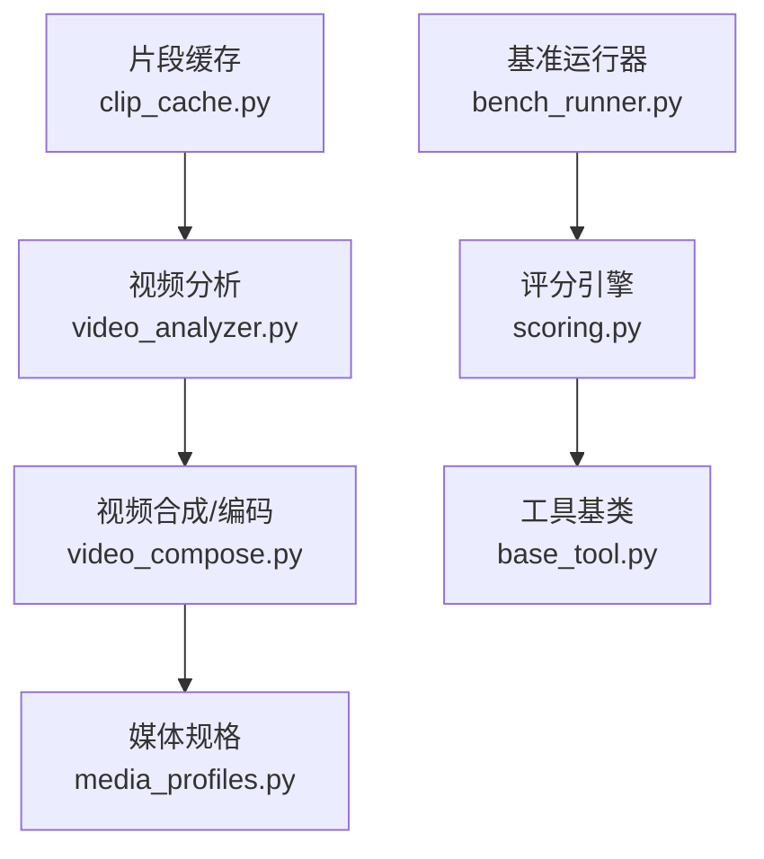
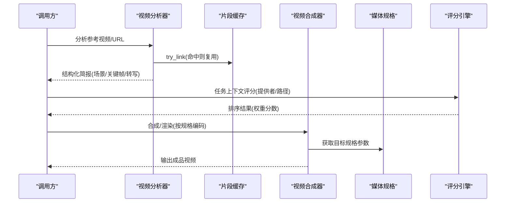
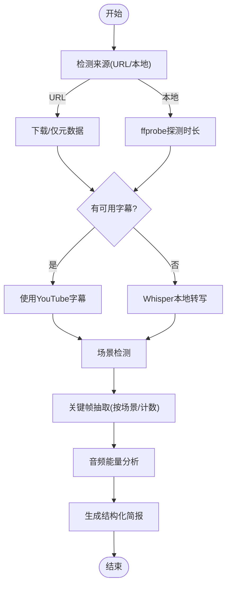
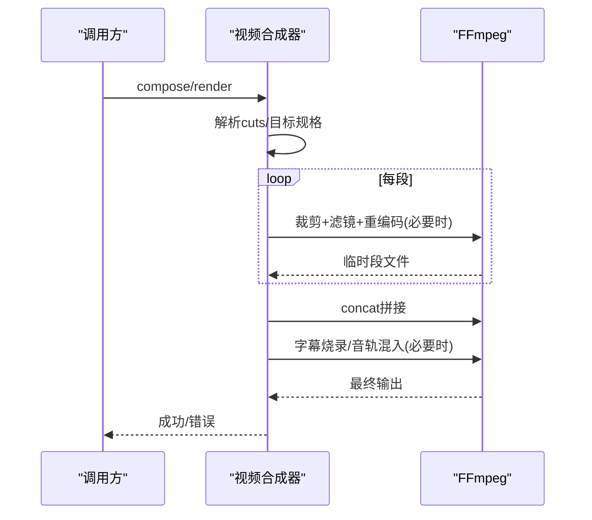
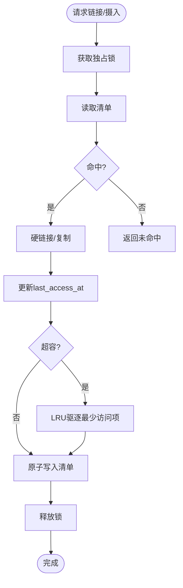
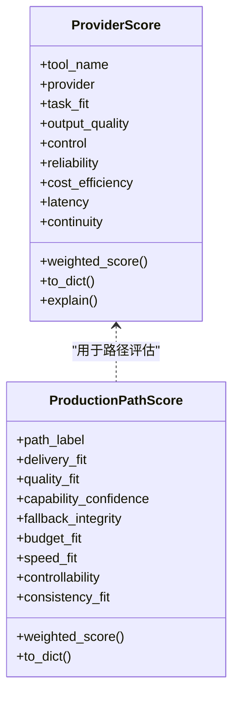
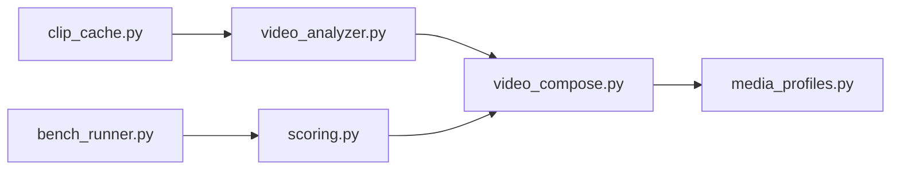

# CPU和内存优化

<cite>
**本文引用的文件**
- [README.md](file://README.md)
- [scoring.py](file://lib/scoring.py)
- [video_compose.py](file://tools/video/video_compose.py)
- [video_analyzer.py](file://tools/analysis/video_analyzer.py)
- [clip_cache.py](file://tools/video/clip_cache.py)
- [media_profiles.py](file://lib/media_profiles.py)
- [base_tool.py](file://tools/base_tool.py)
- [bench_runner.py](file://tests/eval/bench_runner.py)
</cite>

## 目录
1. [简介](#简介)
2. [项目结构](#项目结构)
3. [核心组件](#核心组件)
4. [架构总览](#架构总览)
5. [详细组件分析](#详细组件分析)
6. [依赖关系分析](#依赖关系分析)
7. [性能考量](#性能考量)
8. [故障排查指南](#故障排查指南)
9. [结论](#结论)
10. [附录](#附录)

## 简介
本指南聚焦OpenMontage在CPU与内存方面的优化实践，覆盖：
- CPU使用异常识别与定位（cProfile、line_profiler等）
- 视频处理管道的内存管理最佳实践（流式处理、对象池化、临时文件清理）
- 评分引擎的性能优化（缓存策略、并行计算、算法复杂度控制）
- 结合仓库内现有实现，给出可落地的优化建议与基准测试方法

## 项目结构
OpenMontage采用“工具+管道+技能”的分层组织。与CPU/内存优化密切相关的模块包括：
- 视频合成与编码：tools/video/video_compose.py
- 视频分析与采样：tools/analysis/video_analyzer.py
- 共享片段缓存：tools/video/clip_cache.py
- 媒体输出规格：lib/media_profiles.py
- 评分与选择器：lib/scoring.py
- 工具基类与资源声明：tools/base_tool.py
- 质量与交付承诺基准：tests/eval/bench_runner.py

图表来源
- [video_analyzer.py:1-120](file://tools/analysis/video_analyzer.py#L1-L120)
- [video_compose.py:1-120](file://tools/video/video_compose.py#L1-L120)
- [media_profiles.py:1-166](file://lib/media_profiles.py#L1-L166)
- [scoring.py:1-120](file://lib/scoring.py#L1-L120)
- [base_tool.py:1-200](file://tools/base_tool.py#L1-L200)
- [bench_runner.py:1-120](file://tests/eval/bench_runner.py#L1-L120)

章节来源
- [README.md:450-475](file://README.md#L450-L475)

## 核心组件
- 视频分析器：负责下载/探测、转写、场景检测、关键帧抽取、音频能量分析，为后续编辑决策提供结构化数据。
- 视频合成器：统一编排FFmpeg/Remotion/HyperFrames，执行裁剪、拼接、字幕烧录、编码与音轨混音。
- 评分引擎：基于多维度加权对候选提供者进行排序，影响生成路径与渲染选择。
- 片段缓存：进程安全、LRU淘汰的本地缓存，减少重复下载与磁盘拷贝。
- 媒体规格：平台化输出参数集合，驱动编码器参数与分辨率/帧率。
- 工具基类：统一的资源声明、重试策略、结果封装与事件埋点。

章节来源
- [video_analyzer.py:32-120](file://tools/analysis/video_analyzer.py#L32-L120)
- [video_compose.py:58-230](file://tools/video/video_compose.py#L58-L230)
- [scoring.py:21-108](file://lib/scoring.py#L21-L108)
- [clip_cache.py:177-210](file://tools/video/clip_cache.py#L177-L210)
- [media_profiles.py:22-166](file://lib/media_profiles.py#L22-L166)
- [base_tool.py:110-139](file://tools/base_tool.py#L110-L139)

## 架构总览
下图展示从输入到输出的关键路径，以及CPU/内存热点所在环节。

图表来源
- [video_analyzer.py:149-586](file://tools/analysis/video_analyzer.py#L149-L586)
- [clip_cache.py:318-443](file://tools/video/clip_cache.py#L318-L443)
- [scoring.py:373-542](file://lib/scoring.py#L373-L542)
- [video_compose.py:438-714](file://tools/video/video_compose.py#L438-L714)
- [media_profiles.py:142-166](file://lib/media_profiles.py#L142-L166)

## 详细组件分析

### 视频分析器（CPU热点与内存占用）
- 主要CPU热点
  - 光学流运动分类：Farneback光流计算，逐场景采样并降采样至360p高度以降低开销。
  - 转写：优先YouTube字幕API，失败时回退到Whisper本地转写。
  - 场景检测与关键帧抽取：依赖FFmpeg与OpenCV。
- 内存管理要点
  - 使用VideoCapture读取帧后及时释放；避免全量加载大视频。
  - 关键帧输出到独立目录，便于外部清理。
  - 分析深度可选（transcript_only/standard/deep），默认标准模式平衡CPU与内存。
- 优化建议
  - 限制max_keyframes与analysis_depth，降低深分析时的CPU与IO压力。
  - 对长视频优先使用transcript_only或standard，再按需deep。
  - 合理设置输出目录并在完成后批量清理。

图表来源
- [video_analyzer.py:149-586](file://tools/analysis/video_analyzer.py#L149-L586)
- [video_analyzer.py:689-782](file://tools/analysis/video_analyzer.py#L689-L782)

章节来源
- [video_analyzer.py:149-586](file://tools/analysis/video_analyzer.py#L149-L586)
- [video_analyzer.py:689-782](file://tools/analysis/video_analyzer.py#L689-L782)

### 视频合成器（编码与临时文件）
- 主要CPU热点
  - FFmpeg重编码：为保证精确裁剪，对每段进行重编码（libx264/AAC）。
  - 字幕烧录与滤镜链：当需要缩放/填充/字幕时触发重编码。
- 内存与磁盘管理
  - 临时分段写入临时目录，最终合并后删除。
  - 无音频流的素材自动注入静音轨道，保证拼接一致性。
  - 通过profile或compose_target控制分辨率与fit模式，减少不必要的缩放。
- 优化建议
  - 尽量复用同分辨率/同编解码的素材，减少重编码次数。
  - 使用两遍编码仅在质量敏感场景启用。
  - 合理设置CRF与preset，平衡质量与CPU占用。

图表来源
- [video_compose.py:438-714](file://tools/video/video_compose.py#L438-L714)
- [media_profiles.py:155-166](file://lib/media_profiles.py#L155-L166)

章节来源
- [video_compose.py:438-714](file://tools/video/video_compose.py#L438-L714)
- [media_profiles.py:155-166](file://lib/media_profiles.py#L155-L166)

### 片段缓存（LRU与硬链接）
- 设计要点
  - 进程安全：文件锁保护清单读写。
  - LRU淘汰：超过容量阈值时按最近访问时间驱逐。
  - 硬链接优先：同盘硬链接零拷贝，跨盘回退copy2。
- 内存与磁盘
  - 清单JSONL原子替换，崩溃不破坏旧清单。
  - 统计信息包含命中率、驱逐数、字节数，便于监控。
- 优化建议
  - 根据磁盘空间调整OPENMONTAGE_CACHE_MAX_GB。
  - 多进程并发时确保锁可用，避免长时间阻塞。

图表来源
- [clip_cache.py:214-312](file://tools/video/clip_cache.py#L214-L312)
- [clip_cache.py:318-443](file://tools/video/clip_cache.py#L318-L443)
- [clip_cache.py:478-516](file://tools/video/clip_cache.py#L478-L516)

章节来源
- [clip_cache.py:177-210](file://tools/video/clip_cache.py#L177-L210)
- [clip_cache.py:318-443](file://tools/video/clip_cache.py#L318-L443)
- [clip_cache.py:478-516](file://tools/video/clip_cache.py#L478-L516)

### 评分引擎（缓存与复杂度）
- 当前实现
  - 归一化任务上下文，计算任务契合度、可控性、可靠性、成本效率、延迟、连续性、输出质量等维度加权得分。
  - 支持语义同义词扩展与关键词重叠系数，提升匹配鲁棒性。
- 性能优化方向
  - 将常用工具描述与能力索引构建为只读字典/缓存，避免重复解析。
  - 对大规模工具集排序时，先过滤不可用/不满足硬性约束的候选，再进行打分。
  - 对高频任务上下文做轻量级缓存（如intent+style_keywords→top-N列表）。
- 复杂度
  - 打分函数时间复杂度近似O(N)（N为候选工具数），可通过预过滤降低常数因子。

图表来源
- [scoring.py:21-108](file://lib/scoring.py#L21-L108)

章节来源
- [scoring.py:297-542](file://lib/scoring.py#L297-L542)

### 工具基类（资源与耗时）
- 资源轮廓：每个工具声明CPU核数、内存、显存、磁盘与网络需求，便于调度与限流。
- 执行包装：instrument_execute记录开始/结束/错误事件，便于追踪耗时与问题定位。
- 优化建议
  - 在高并发场景下，依据ResourceProfile限制并行度，避免CPU/内存峰值过高。
  - 利用duration_seconds与cost_usd进行成本-性能权衡。

章节来源
- [base_tool.py:110-139](file://tools/base_tool.py#L110-L139)
- [base_tool.py:148-200](file://tools/base_tool.py#L148-L200)

## 依赖关系分析
- video_compose依赖media_profiles决定输出参数，依赖FFmpeg/Remotion/HyperFrames。
- video_analyzer依赖FFmpeg/OpenCV/Whisper等，产出结构化数据供上层决策。
- clip_cache被上游下载/检索流程复用，减少重复IO。
- scoring为提供者选择提供可解释的排序结果，影响渲染路径与工具选择。
- bench_runner通过合成场景验证质量门禁，间接反映性能与稳定性。

图表来源
- [video_analyzer.py:149-586](file://tools/analysis/video_analyzer.py#L149-L586)
- [video_compose.py:438-714](file://tools/video/video_compose.py#L438-L714)
- [media_profiles.py:142-166](file://lib/media_profiles.py#L142-L166)
- [clip_cache.py:318-443](file://tools/video/clip_cache.py#L318-L443)
- [scoring.py:373-542](file://lib/scoring.py#L373-L542)
- [bench_runner.py:359-436](file://tests/eval/bench_runner.py#L359-L436)

章节来源
- [bench_runner.py:359-436](file://tests/eval/bench_runner.py#L359-L436)

## 性能考量
- CPU优化
  - 视频分析：限制分析深度与关键帧数量；使用降采样光流；优先使用在线字幕API。
  - 视频合成：尽量使用无损拼接（-c copy）减少重编码；仅在必要时启用滤镜链；合理设置CRF/preset。
  - 评分引擎：预过滤不可用/不满足硬性约束的工具；对高频上下文做轻量缓存。
- 内存优化
  - 视频分析：及时释放VideoCapture；控制关键帧输出规模；避免全量加载。
  - 视频合成：严格清理临时分段与concat列表；避免同时持有过多大对象引用。
  - 片段缓存：配置合适的最大容量；监控命中率与驱逐情况；避免锁竞争过长。
- 并行与I/O
  - 依据ResourceProfile限制并发；将I/O密集与CPU密集任务解耦。
  - 使用流式处理（分片处理）替代一次性加载。
- 基准测试
  - 使用tests/eval/bench_runner.py构造场景矩阵，验证质量门禁与回归。
  - 结合工具返回的duration_seconds与cost_usd建立性能-成本曲线。

[本节为通用指导，不直接分析具体文件]

## 故障排查指南
- CPU使用异常
  - 使用cProfile对video_analyzer.execute与video_compose.execute进行热点定位，关注光流计算与FFmpeg子进程调用。
  - 使用line_profiler对关键函数（如_classify_scene_motion、_compose）进行行级剖析，定位瓶颈。
- 内存泄漏/高占用
  - 检查是否遗漏释放VideoCapture或未及时删除临时文件。
  - 监控clip_cache的stats，确认未出现异常增长或锁超时。
- 编码失败/卡顿
  - 检查媒体规格是否与实际素材匹配；必要时调整profile或fit模式。
  - 确认FFmpeg/Remotion/HyperFrames环境可用性与版本兼容性。

章节来源
- [video_analyzer.py:689-782](file://tools/analysis/video_analyzer.py#L689-L782)
- [video_compose.py:438-714](file://tools/video/video_compose.py#L438-L714)
- [clip_cache.py:445-472](file://tools/video/clip_cache.py#L445-L472)

## 结论
OpenMontage在视频分析、合成与评分等环节提供了良好的可扩展性与可观测性。通过合理的分析深度控制、编码策略、缓存策略与资源约束，可在保证质量的前提下显著降低CPU与内存占用。建议在生产环境中结合cProfile/line_profiler与内置统计指标持续监控，并按需调优。

[本节为总结性内容，不直接分析具体文件]

## 附录
- 快速上手与架构概览参见README中的“Architecture”与“Pipelines”部分。
- 媒体规格与平台输出参数请参考media_profiles。
- 评分引擎的可解释性与权重配置请参考scoring。

章节来源
- [README.md:450-475](file://README.md#L450-L475)
- [media_profiles.py:22-166](file://lib/media_profiles.py#L22-L166)
- [scoring.py:21-108](file://lib/scoring.py#L21-L108)