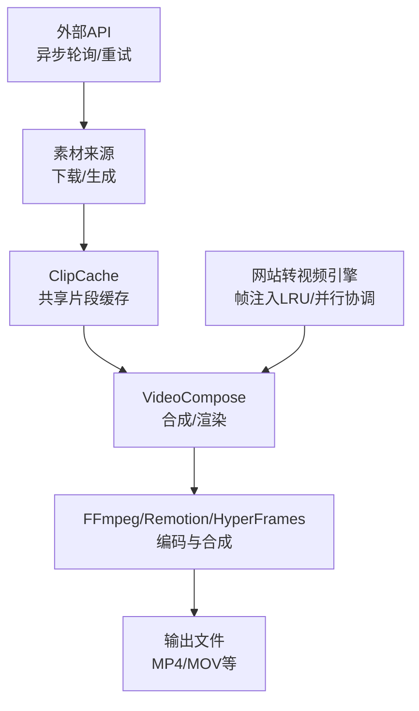
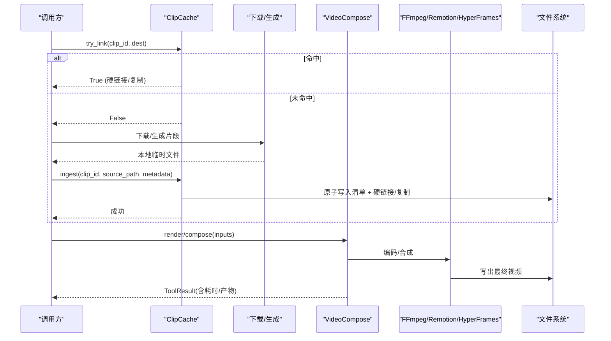
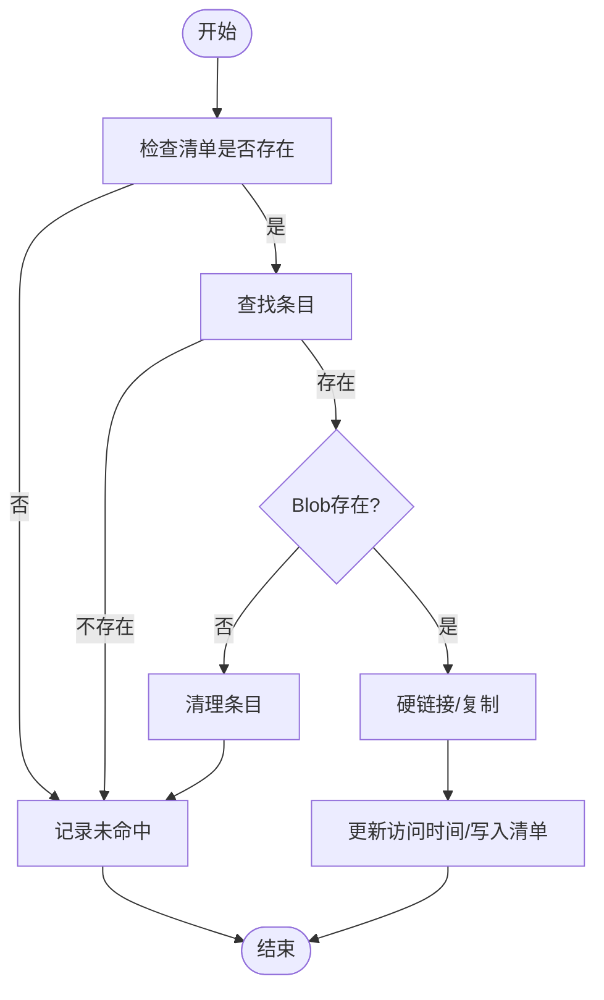
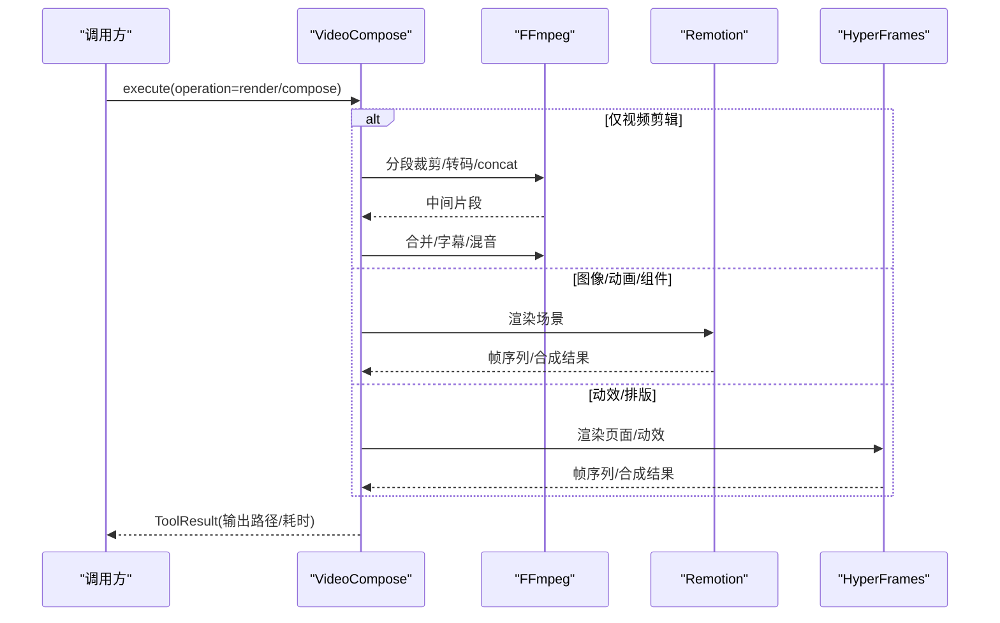
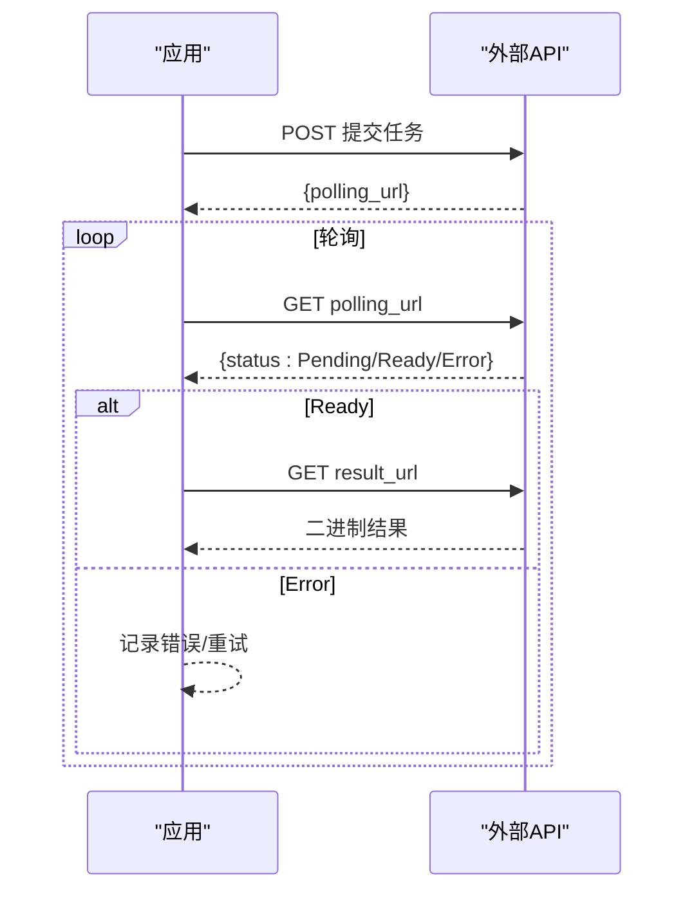
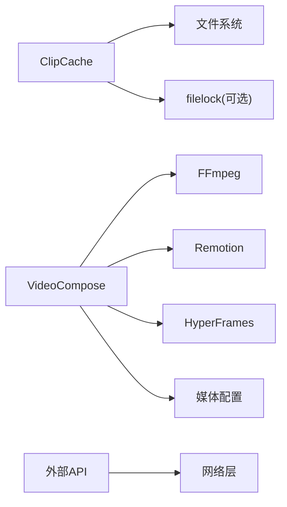

# I/O优化

<cite>
**本文引用的文件**
- [tools/video/clip_cache.py](file://tools/video/clip_cache.py)
- [tools/video/video_compose.py](file://tools/video/video_compose.py)
- [.agents/skills/bfl-api/references/polling-patterns.md](file://.agents/skills/bfl-api/references/polling-patterns.md)
- [.agents/skills/bfl-api/references/rate-limiting.md](file://.agents/skills/bfl-api/references/rate-limiting.md)
- [.agents/skills/website-to-video/references/capabilities.md](file://.agents/skills/website-to-video/references/capabilities.md)
- [tests/eval/bench_runner.py](file://tests/eval/bench_runner.py)
</cite>

## 目录
1. [简介](#简介)
2. [项目结构](#项目结构)
3. [核心组件](#核心组件)
4. [架构总览](#架构总览)
5. [详细组件分析](#详细组件分析)
6. [依赖关系分析](#依赖关系分析)
7. [性能考量](#性能考量)
8. [故障排查指南](#故障排查指南)
9. [结论](#结论)
10. [附录](#附录)

## 简介
本指南聚焦OpenMontage在I/O层面的系统级优化，覆盖磁盘I/O、网络I/O与视频处理I/O三大方向，并结合项目现有实现给出可落地的策略、配置与监控方法。重点包括：
- 磁盘I/O：文件读写缓冲、原子写入、硬链接复用、LRU缓存与并发锁
- 网络I/O：异步轮询、指数退避与抖动、速率限制重试、批量请求
- 视频I/O：流式编码、分段拼接、部分渲染与增量更新
- 缓存策略：文件系统缓存、内存缓存、分布式缓存的使用场景与配置建议
- 监控指标与性能测试：定义关键指标、基准方法与对比评估

## 项目结构
本项目围绕“素材获取—缓存—合成/渲染—输出”的流水线组织。与I/O优化直接相关的核心位置：
- 共享片段字节缓存（进程安全、LRU淘汰、原子清单）
- 视频合成工具（多运行时路由：Remotion/HyperFrames/FFmpeg）
- 网站转视频能力（帧注入LRU缓存、并行协调器、流式编码器）
- 外部API异步轮询与限流重试参考实践
- 基准运行器（用于质量与流程验证，可作为性能回归基线）

图示来源
- [tools/video/clip_cache.py:1-59](file://tools/video/clip_cache.py#L1-L59)
- [tools/video/video_compose.py:1-29](file://tools/video/video_compose.py#L1-L29)
- [.agents/skills/website-to-video/references/capabilities.md:518-543](file://.agents/skills/website-to-video/references/capabilities.md#L518-L543)

章节来源
- [tools/video/clip_cache.py:1-59](file://tools/video/clip_cache.py#L1-L59)
- [tools/video/video_compose.py:1-29](file://tools/video/video_compose.py#L1-L29)
- [.agents/skills/website-to-video/references/capabilities.md:518-543](file://.agents/skills/website-to-video/references/capabilities.md#L518-L543)

## 核心组件
- ClipCache：进程安全的共享片段字节缓存，提供硬链接/复制、LRU淘汰、原子清单写入与跨平台文件锁
- VideoCompose：统一入口，根据编辑决策选择Remotion/HyperFrames/FFmpeg进行合成与编码
- 网站转视频能力：帧注入LRU缓存、并行协调器、流式编码器与浏览器池
- 外部API交互：异步轮询、指数退避与抖动、速率限制重试
- 基准运行器：场景化执行与结果汇总，可用于回归与性能对比

章节来源
- [tools/video/clip_cache.py:177-472](file://tools/video/clip_cache.py#L177-L472)
- [tools/video/video_compose.py:337-360](file://tools/video/video_compose.py#L337-L360)
- [.agents/skills/website-to-video/references/capabilities.md:518-543](file://.agents/skills/website-to-video/references/capabilities.md#L518-L543)
- [.agents/skills/bfl-api/references/polling-patterns.md:1-241](file://.agents/skills/bfl-api/references/polling-patterns.md#L1-L241)
- [tests/eval/bench_runner.py:359-436](file://tests/eval/bench_runner.py#L359-L436)

## 架构总览
下图展示从素材到输出的I/O路径，以及缓存与网络I/O的关键节点。

图示来源
- [tools/video/clip_cache.py:318-443](file://tools/video/clip_cache.py#L318-L443)
- [tools/video/video_compose.py:337-360](file://tools/video/video_compose.py#L337-L360)

## 详细组件分析

### 磁盘I/O优化：ClipCache
- 设计要点
  - 原子清单：JSONL清单通过临时文件+os.replace原子替换，避免并发写破坏
  - 并发控制：优先使用filelock；不可用时回退O_EXCL文件锁并带超时
  - 数据复用：同盘硬链接，跨盘自动回退copy2，零额外空间或最小拷贝
  - LRU淘汰：按last_access_at排序，超出容量时删除最少访问条目
  - 统计口径：会话内命中/未命中/淘汰计数，便于观测命中率与压力
- 关键接口
  - try_link：尝试将缓存片段链接到目标路径，命中则更新访问时间
  - ingest：将新片段纳入缓存，必要时触发淘汰
  - stats：返回缓存状态与计数器快照
- 复杂度与性能
  - 读取清单为顺序扫描，规模受限于缓存条目数；淘汰排序为O(n log n)，但仅在超限时触发
  - 硬链接O(1)，copy2随文件大小线性增长；尽量保持同盘以利用硬链接
- 错误与边界
  - 清单行解析失败跳过，不污染整体
  - 文件缺失漂移时清理条目并报告未命中
  - 删除失败（如Windows占用）跳过该条目继续

图示来源
- [tools/video/clip_cache.py:261-365](file://tools/video/clip_cache.py#L261-L365)
- [tools/video/clip_cache.py:478-516](file://tools/video/clip_cache.py#L478-L516)

章节来源
- [tools/video/clip_cache.py:177-472](file://tools/video/clip_cache.py#L177-L472)

### 视频I/O优化：VideoCompose与多运行时
- 运行时路由
  - Remotion：图像/动画/组件场景的高质量合成
  - HyperFrames：HTML/CSS/GSAP驱动的动效与排版
  - FFmpeg：纯视频裁剪/拼接/转码的高效路径
- 合成与编码
  - 分段标准化：统一分辨率、像素格式、帧率，确保concat-copy安全
  - 音频处理：检测音轨缺失并注入静音轨道，保证段间一致性
  - 字幕烧录与音频混音：按需重编码或流拷贝，减少不必要转码
  - 资源与稳定性：声明CPU/内存/显存/磁盘需求，支持重试与恢复
- 性能提示
  - 对长视频采用分段处理与concat-copy，降低中间态开销
  - 合理设置CRF与preset平衡质量与速度
  - 通过profile控制输出分辨率与帧率，避免多余缩放

图示来源
- [tools/video/video_compose.py:337-360](file://tools/video/video_compose.py#L337-L360)
- [tools/video/video_compose.py:438-714](file://tools/video/video_compose.py#L438-L714)

章节来源
- [tools/video/video_compose.py:1-29](file://tools/video/video_compose.py#L1-L29)
- [tools/video/video_compose.py:337-360](file://tools/video/video_compose.py#L337-L360)
- [tools/video/video_compose.py:438-714](file://tools/video/video_compose.py#L438-L714)

### 网站转视频I/O优化：帧注入与并行协调
- 帧注入LRU缓存：按路径+字节预算缓存预提取的视频帧，减少重复IO
- 并行协调器：workers、coresPerWorker、minParallelFrames、largeRenderThreshold等参数控制并发度与阈值
- 流式编码器：支持长渲染的流式编码，降低峰值内存与磁盘压力
- 浏览器池：可选配置，配合超时管理提升吞吐

章节来源
- [.agents/skills/website-to-video/references/capabilities.md:518-543](file://.agents/skills/website-to-video/references/capabilities.md#L518-L543)

### 网络I/O优化：异步轮询、批处理与重试
- 异步轮询模式
  - 提交任务后获取polling_url，循环查询直到Ready/Error
  - 推荐指数退避+抖动，避免雪崩与拥塞
  - 结果URL短期有效，需立即下载
- 速率限制与重试
  - 遇到429时依据Retry-After头与指数退避等待
  - 对服务端错误进行有限次重试
- 批处理
  - 并发提交多个请求，聚合等待完成，提高吞吐

图示来源
- [.agents/skills/bfl-api/references/polling-patterns.md:1-241](file://.agents/skills/bfl-api/references/polling-patterns.md#L1-L241)
- [.agents/skills/bfl-api/references/rate-limiting.md:67-88](file://.agents/skills/bfl-api/references/rate-limiting.md#L67-L88)

章节来源
- [.agents/skills/bfl-api/references/polling-patterns.md:1-241](file://.agents/skills/bfl-api/references/polling-patterns.md#L1-L241)
- [.agents/skills/bfl-api/references/rate-limiting.md:67-88](file://.agents/skills/bfl-api/references/rate-limiting.md#L67-L88)

### 缓存策略：文件系统、内存与分布式
- 文件系统缓存（已实现）
  - 适用：跨项目复用下载的片段，减少重复网络IO
  - 配置：OPENMONTAGE_CACHE_DIR、OPENMONTAGE_CACHE_MAX_GB
  - 机制：硬链接优先、原子清单、LRU淘汰、文件锁
- 内存缓存（建议）
  - 适用：小对象高频访问（如元数据、短文本、索引片段）
  - 注意：进程重启丢失，适合热路径加速
- 分布式缓存（扩展）
  - 适用：多机协作、跨进程/容器共享
  - 方案：对象存储（S3/OSS）+ 版本/ETag；或Redis缓存热点键
  - 注意：一致性、过期策略与带宽成本

章节来源
- [tools/video/clip_cache.py:92-119](file://tools/video/clip_cache.py#L92-L119)
- [tools/video/clip_cache.py:177-472](file://tools/video/clip_cache.py#L177-L472)

## 依赖关系分析
- ClipCache依赖
  - filelock（可选）：跨平台文件锁
  - 文件系统：原子写入、硬链接/复制、LRU淘汰
- VideoCompose依赖
  - FFmpeg/Remotion/HyperFrames：运行时可用性检测与路由
  - 媒体配置文件：输出分辨率/帧率/码率等
- 外部API
  - 轮询与重试：遵循最佳实践，避免雪崩与超限

图示来源
- [tools/video/clip_cache.py:72-76](file://tools/video/clip_cache.py#L72-L76)
- [tools/video/video_compose.py:234-265](file://tools/video/video_compose.py#L234-L265)

章节来源
- [tools/video/clip_cache.py:72-76](file://tools/video/clip_cache.py#L72-L76)
- [tools/video/video_compose.py:234-265](file://tools/video/video_compose.py#L234-L265)

## 性能考量
- 磁盘I/O
  - 优先硬链接，减少重复IO与磁盘占用
  - 原子写入避免崩溃导致清单损坏
  - 合理设置缓存上限，避免频繁淘汰造成抖动
- 网络I/O
  - 指数退避+抖动降低拥塞风险
  - 批量提交+并发轮询提升吞吐
  - 严格超时与重试上限，防止长时间阻塞
- 视频I/O
  - 分段标准化与concat-copy减少重编码
  - 按需转码（字幕/滤镜/分辨率变化才重编码）
  - 流式编码与并行协调器提升长渲染效率
- 监控指标（建议）
  - 缓存命中率、未命中率、淘汰次数、淘汰字节
  - 单次合成/渲染耗时、分段数量、转码比例
  - 网络请求成功率、平均延迟、429/5xx比例、重试次数
  - 磁盘使用量、缓存占用百分比

章节来源
- [tools/video/clip_cache.py:445-472](file://tools/video/clip_cache.py#L445-L472)
- [tools/video/video_compose.py:337-360](file://tools/video/video_compose.py#L337-L360)
- [.agents/skills/bfl-api/references/polling-patterns.md:232-241](file://.agents/skills/bfl-api/references/polling-patterns.md#L232-L241)

## 故障排查指南
- 缓存相关
  - 清单损坏：单行解析失败会被跳过，不影响整体；若频繁失败，检查并发写与磁盘权限
  - 锁定超时：filelock不可用时回退O_EXCL锁，确认无僵尸锁文件
  - 删除失败：Windows下文件被占用会跳过该条目，稍后重试或手动释放
- 视频合成
  - 缺少音轨：自动注入静音轨道，确保concat一致
  - 运行时不可用：提前检测FFmpeg/Remotion/HyperFrames可用性，避免静默降级
  - 输出异常：检查profile与滤镜是否触发重编码，核对分辨率/帧率
- 网络请求
  - 轮询超时：设置合理超时与最大尝试次数
  - 429限流：遵循Retry-After与指数退避
  - URL过期：结果URL有效期短，需立即下载

章节来源
- [tools/video/clip_cache.py:214-255](file://tools/video/clip_cache.py#L214-L255)
- [tools/video/clip_cache.py:261-312](file://tools/video/clip_cache.py#L261-L312)
- [tools/video/video_compose.py:234-265](file://tools/video/video_compose.py#L234-L265)
- [.agents/skills/bfl-api/references/polling-patterns.md:232-241](file://.agents/skills/bfl-api/references/polling-patterns.md#L232-L241)

## 结论
OpenMontage在I/O层面已形成较为完善的优化体系：通过ClipCache实现跨项目片段复用与LRU管理，VideoCompose提供多运行时高效合成与编码，网站转视频能力引入帧注入缓存与并行协调，外部API交互遵循异步轮询与限流重试的最佳实践。结合合理的监控指标与基准测试，可在不同负载下持续优化吞吐与时延，保障大规模视频生产的稳定性与经济性。

## 附录
- 配置与环境变量
  - OPENMONTAGE_CACHE_DIR：缓存目录
  - OPENMONTAGE_CACHE_MAX_GB：缓存大小上限（GB）
- 常用操作
  - 查看缓存统计：调用stats()获取命中率、淘汰情况与占用
  - 重置默认缓存：测试中可通过reset_default_cache()清空单例
- 基准与回归
  - 使用bench_runner执行场景矩阵，验证质量与流程稳定性，作为性能回归基线

章节来源
- [tools/video/clip_cache.py:92-119](file://tools/video/clip_cache.py#L92-L119)
- [tools/video/clip_cache.py:554-572](file://tools/video/clip_cache.py#L554-L572)
- [tests/eval/bench_runner.py:359-436](file://tests/eval/bench_runner.py#L359-L436)