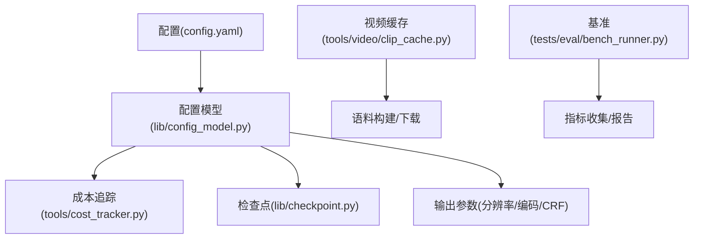
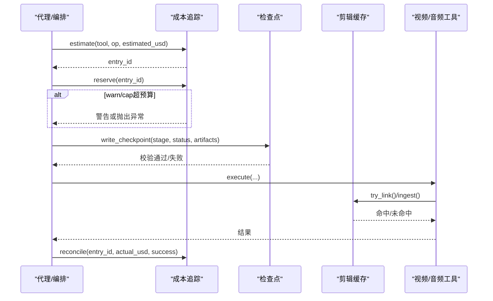
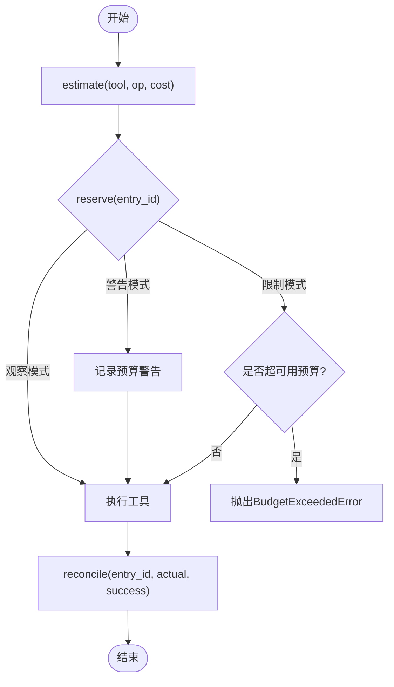
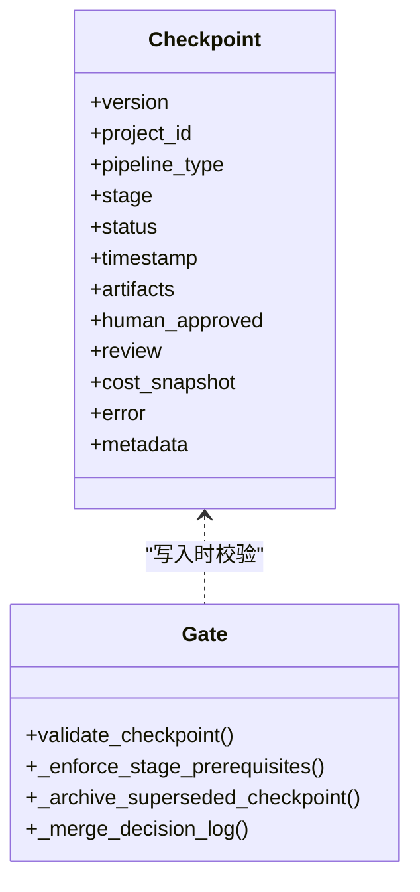
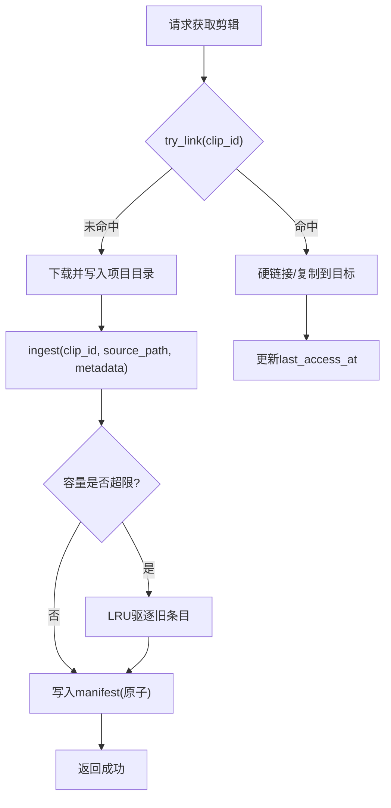
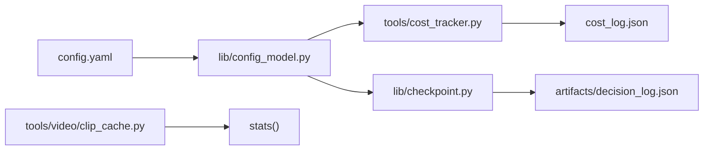

# 性能优化

<cite>
**本文引用的文件**
- [README.md](file://README.md)
- [config.yaml](file://config.yaml)
- [lib/config_model.py](file://lib/config_model.py)
- [tools/cost_tracker.py](file://tools/cost_tracker.py)
- [lib/checkpoint.py](file://lib/checkpoint.py)
- [tools/video/clip_cache.py](file://tools/video/clip_cache.py)
- [tests/contracts/test_phase0_contracts.py](file://tests/contracts/test_phase0_contracts.py)
- [tests/tools/test_cost_tracker_governance.py](file://tests/tools/test_cost_tracker_governance.py)
- [tests/eval/bench_runner.py](file://tests/eval/bench_runner.py)
</cite>

## 目录
1. [简介](#简介)
2. [项目结构](#项目结构)
3. [核心组件](#核心组件)
4. [架构总览](#架构总览)
5. [详细组件分析](#详细组件分析)
6. [依赖关系分析](#依赖关系分析)
7. [性能考量与调优](#性能考量与调优)
8. [故障排查指南](#故障排查指南)
9. [结论](#结论)
10. [附录](#附录)

## 简介
本指南面向OpenMontage在大规模视频生产中的性能优化，聚焦以下目标：
- CPU与内存使用异常的排查步骤（资源泄漏检测、性能分析工具、内存profiling）
- 视频处理管道的性能调优（并行处理、批处理、缓存策略）
- 成本追踪与预算控制的实现原理与优化建议
- 大规模数据处理最佳实践（数据分片、增量处理、结果缓存）
- 性能基准测试与监控指标的定义方法

OpenMontage以“代理驱动”的流水线为核心，通过工具注册、阶段检查点、质量门禁与成本治理，将创意编排与工程化执行解耦。其内置的成本追踪、检查点持久化与共享剪辑缓存为性能优化提供了坚实基础。

## 项目结构
- 工具层：video/audio/graphics/analysis等子模块提供100+生产工具
- 配置与治理：config.yaml + lib/config_model.py 定义运行时参数；cost_tracker.py负责成本估算、预留、对账与持久化；checkpoint.py负责阶段状态持久化与门禁校验
- 缓存与IO：clip_cache.py提供进程安全、LRU淘汰的剪辑字节缓存，支持硬链接与原子写入
- 评估与基准：tests/eval/bench_runner.py用于场景化基准运行与结果输出

图表来源
- [config.yaml:1-34](file://config.yaml#L1-L34)
- [lib/config_model.py:1-93](file://lib/config_model.py#L1-L93)
- [tools/cost_tracker.py:1-524](file://tools/cost_tracker.py#L1-L524)
- [lib/checkpoint.py:1-634](file://lib/checkpoint.py#L1-L634)
- [tools/video/clip_cache.py:1-573](file://tools/video/clip_cache.py#L1-L573)
- [tests/eval/bench_runner.py:478-491](file://tests/eval/bench_runner.py#L478-L491)

章节来源
- [README.md:450-475](file://README.md#L450-L475)
- [config.yaml:1-34](file://config.yaml#L1-L34)
- [lib/config_model.py:1-93](file://lib/config_model.py#L1-L93)

## 核心组件
- 成本追踪器(CostTracker)：提供estimate/reserve/reconcile/refund流程，支持observe/warn/cap模式、单动作审批阈值、新付费工具审批、预算保留比例与持久化日志
- 检查点系统(Checkpoint)：阶段状态持久化、前置条件校验、人类审批门禁、决策日志合并与归档
- 剪辑缓存(ClipCache)：进程安全的LRU缓存，硬链接优先、原子写入、锁保护、统计指标上报
- 配置模型(ConfigModel)：集中管理预算、检查点策略、输出参数、路径等运行时配置

章节来源
- [tools/cost_tracker.py:1-524](file://tools/cost_tracker.py#L1-L524)
- [lib/checkpoint.py:1-634](file://lib/checkpoint.py#L1-L634)
- [tools/video/clip_cache.py:1-573](file://tools/video/clip_cache.py#L1-L573)
- [lib/config_model.py:1-93](file://lib/config_model.py#L1-L93)

## 架构总览
OpenMontage的性能优化围绕“可观测、可控制、可复用”展开：
- 可观测：成本追踪、检查点、缓存统计、基准测试
- 可控制：预算模式、审批阈值、检查点门禁、输出参数
- 可复用：剪辑缓存、阶段产物复用、批量与并行调度

图表来源
- [tools/cost_tracker.py:101-179](file://tools/cost_tracker.py#L101-L179)
- [lib/checkpoint.py:422-564](file://lib/checkpoint.py#L422-L564)
- [tools/video/clip_cache.py:318-443](file://tools/video/clip_cache.py#L318-L443)

## 详细组件分析

### 成本追踪与预算控制
- 估算-预留-对账闭环：每个付费操作先estimate，再reserve，最后reconcile实际花费；支持refund取消预留
- 预算模式：
  - observe：仅记录不阻断
  - warn：超预算标记警告并继续
  - cap：超预算直接阻断
- 审批机制：单动作阈值与新付费工具首次使用需人工批准
- 持久化：cost_log.json记录条目、预算快照、已批准工具列表

图表来源
- [tools/cost_tracker.py:101-179](file://tools/cost_tracker.py#L101-L179)
- [lib/config_model.py:16-40](file://lib/config_model.py#L16-L40)

章节来源
- [tools/cost_tracker.py:1-524](file://tools/cost_tracker.py#L1-L524)
- [tests/contracts/test_phase0_contracts.py:475-506](file://tests/contracts/test_phase0_contracts.py#L475-L506)
- [tests/tools/test_cost_tracker_governance.py:1-60](file://tests/tools/test_cost_tracker_governance.py#L1-L60)

### 检查点与阶段门禁
- 阶段顺序与前置条件：write_checkpoint会校验前序阶段完成且已通过必要审批
- 人类审批门禁：manifest中声明的阶段若要求human_approval，则completed必须附带human_approved=True
- 决策日志合并：每阶段可产出decision_log，统一合并到项目级决策日志，便于审计与回放
- 历史归档：覆盖前的已完成/等待人类审批的检查点会被归档至history目录

图表来源
- [lib/checkpoint.py:160-191](file://lib/checkpoint.py#L160-L191)
- [lib/checkpoint.py:284-346](file://lib/checkpoint.py#L284-L346)
- [lib/checkpoint.py:349-419](file://lib/checkpoint.py#L349-L419)
- [lib/checkpoint.py:422-564](file://lib/checkpoint.py#L422-L564)

章节来源
- [lib/checkpoint.py:1-634](file://lib/checkpoint.py#L1-L634)

### 视频处理管道与缓存策略
- 共享剪辑缓存ClipCache：
  - 进程安全：基于filelock或O_EXCL回退的互斥锁
  - LRU淘汰：按last_access_at排序，超过容量上限时驱逐最少访问项
  - 硬链接优先：同盘硬链接零拷贝跨盘复制，提升I/O效率
  - 原子写入：manifest采用JSONL，重写临时文件后os.replace保证一致性
  - 统计指标：hits/misses/evictions/bytes_evicted等会话级计数器
- 与语料构建集成：corpus_builder调用cache.try_link/ingest，透明地减少重复下载与磁盘占用

图表来源
- [tools/video/clip_cache.py:318-443](file://tools/video/clip_cache.py#L318-L443)
- [tools/video/clip_cache.py:478-516](file://tools/video/clip_cache.py#L478-L516)

章节来源
- [tools/video/clip_cache.py:1-573](file://tools/video/clip_cache.py#L1-L573)

### 基准测试与监控指标
- 基准运行器bench_runner：加载场景、执行run_bench、打印结果、失败退出码
- 指标维度建议：
  - 吞吐：每秒处理片段数/渲染帧率
  - 延迟：端到端耗时、各阶段耗时分布
  - 资源：CPU利用率、内存峰值、磁盘IOPS、网络带宽
  - 成本：单次任务成本、单位时长成本、预算命中率
  - 质量：自检通过率、重渲染率、失败重试次数
- 结合成本追踪与检查点：将cost_snapshot与阶段耗时写入checkpoint，便于回溯与对比

章节来源
- [tests/eval/bench_runner.py:478-491](file://tests/eval/bench_runner.py#L478-L491)
- [lib/checkpoint.py:504-564](file://lib/checkpoint.py#L504-L564)
- [tools/cost_tracker.py:92-97](file://tools/cost_tracker.py#L92-L97)

## 依赖关系分析
- 配置驱动：config.yaml与lib/config_model.py决定预算模式、检查点策略、输出参数
- 成本追踪依赖配置：CostTracker读取BudgetMode、阈值、保留比例
- 检查点依赖配置：Checkpoint根据pipeline manifest与配置决定是否要求人类审批
- 缓存独立但可观测：ClipCache提供stats供上层聚合，不影响主流程

图表来源
- [config.yaml:1-34](file://config.yaml#L1-L34)
- [lib/config_model.py:1-93](file://lib/config_model.py#L1-L93)
- [tools/cost_tracker.py:487-507](file://tools/cost_tracker.py#L487-L507)
- [lib/checkpoint.py:388-419](file://lib/checkpoint.py#L388-L419)
- [tools/video/clip_cache.py:445-472](file://tools/video/clip_cache.py#L445-L472)

章节来源
- [lib/config_model.py:1-93](file://lib/config_model.py#L1-L93)
- [tools/cost_tracker.py:1-524](file://tools/cost_tracker.py#L1-L524)
- [lib/checkpoint.py:1-634](file://lib/checkpoint.py#L1-L634)
- [tools/video/clip_cache.py:1-573](file://tools/video/clip_cache.py#L1-L573)

## 性能考量与调优

### CPU与内存异常排查
- 定位热点：
  - 使用Python性能分析工具（如cProfile、py-spy、memory_profiler）对关键函数进行采样
  - 关注视频编解码、图像增强、TTS/ASR、LLM调用等CPU/GPU密集环节
- 资源泄漏检测：
  - 检查外部进程（FFmpeg、Remotion/HyperFrames）是否正确释放句柄与临时文件
  - 验证缓存写入/删除路径是否异常残留（如manifest与blob不一致）
- 内存Profiling：
  - 针对大对象（视频帧、嵌入向量、模型权重）进行分配跟踪
  - 避免长生命周期全局对象持有大引用；及时释放中间结果

### 视频处理管道调优
- 并行处理：
  - 无依赖任务并发执行（如多路转码、多段裁剪），注意线程/进程池大小与I/O瓶颈
  - 对外部API调用采用队列限流与重试，避免触发速率限制
- 批处理：
  - 将小片段合并为批次进行编码/混音，降低启动开销
  - 批量生成图片/音频时，利用Provider的批量接口（如有）
- 缓存策略：
  - 启用ClipCache减少重复下载与磁盘拷贝
  - 对稳定输入（提示词、风格、参数）做结果缓存，避免重复计算
  - 合理设置LRU容量与环境变量OPENMONTAGE_CACHE_MAX_GB

### 成本追踪与预算控制优化
- 估算准确性：
  - 基于参考视频的结构与节奏估算场景数、运动比例、TTS字数与视频片段数
  - 引入重试缓冲与置信度区间，提高预估鲁棒性
- 预算模式选择：
  - 开发阶段用observe快速迭代；预发布用warn监控；生产用cap严格控费
- 审批阈值：
  - 调整single_action_approval_usd与require_approval_for_new_paid_tool，平衡效率与安全
- 对账与复盘：
  - 定期导出cost_log.json，分析超支原因与高成本工具

章节来源
- [tools/cost_tracker.py:183-398](file://tools/cost_tracker.py#L183-L398)
- [tools/video/clip_cache.py:79-119](file://tools/video/clip_cache.py#L79-L119)
- [lib/config_model.py:35-40](file://lib/config_model.py#L35-L40)

### 大规模数据处理最佳实践
- 数据分片：
  - 将长视频切分为固定时长片段，分别处理后再拼接
  - 对语料库按主题/来源分片，提升检索与去重效率
- 增量处理：
  - 基于检查点恢复中断任务，避免全量重跑
  - 对新增素材只计算嵌入与索引，复用已有缓存
- 结果缓存：
  - 对稳定输入的结果（如转写、字幕、色彩校正）建立键值缓存
  - 结合ClipCache与自定义缓存，减少重复计算与I/O

## 故障排查指南
- 成本超支：
  - 检查mode是否为cap；确认usable_budget_usd与reserve_pct设置
  - 查看cost_log.json中budget_warning与actual_usd差异
- 检查点门禁失败：
  - 确认前序阶段是否completed且human_approved；检查manifest中human_approval_default
  - 查看decision_log中相关决策与错误信息
- 缓存失效：
  - 检查manifest与blob文件一致性；清理损坏条目
  - 调整OPENMONTAGE_CACHE_MAX_GB与OPENMONTAGE_CACHE_DIR

章节来源
- [tools/cost_tracker.py:117-179](file://tools/cost_tracker.py#L117-L179)
- [lib/checkpoint.py:284-346](file://lib/checkpoint.py#L284-L346)
- [tools/video/clip_cache.py:318-365](file://tools/video/clip_cache.py#L318-L365)

## 结论
OpenMontage通过成本追踪、检查点门禁与共享缓存，构建了可观测、可控、可复用的视频生产平台。性能优化的关键在于：
- 以基准测试量化瓶颈，结合profiling定位热点
- 以并行与批处理提升吞吐，以缓存降低重复成本
- 以预算控制保障成本可控，以检查点确保过程可追溯
- 以分片与增量处理支撑大规模数据

## 附录
- 配置项速查：
  - budget.mode：observe/warn/cap
  - budget.total_usd：总预算
  - budget.reserve_pct：保留比例
  - budget.single_action_approval_usd：单动作审批阈值
  - output.default_resolution/fps/crf：输出参数
- 环境变量：
  - OPENMONTAGE_CACHE_DIR：缓存目录
  - OPENMONTAGE_CACHE_MAX_GB：缓存容量（GB）

章节来源
- [config.yaml:1-34](file://config.yaml#L1-L34)
- [tools/video/clip_cache.py:92-119](file://tools/video/clip_cache.py#L92-L119)