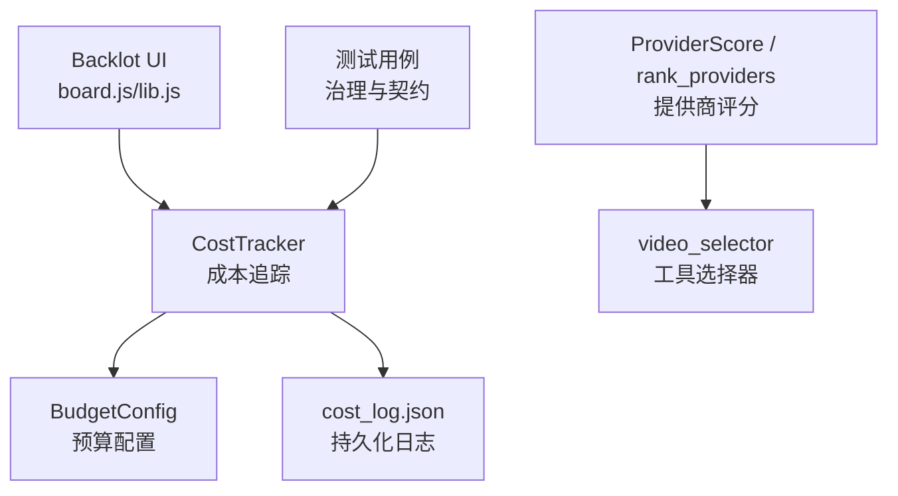
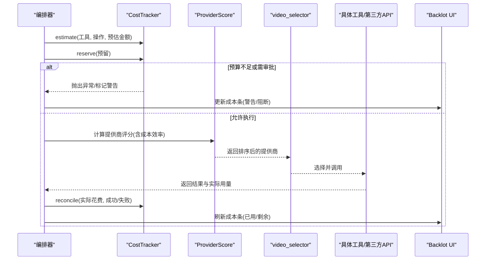
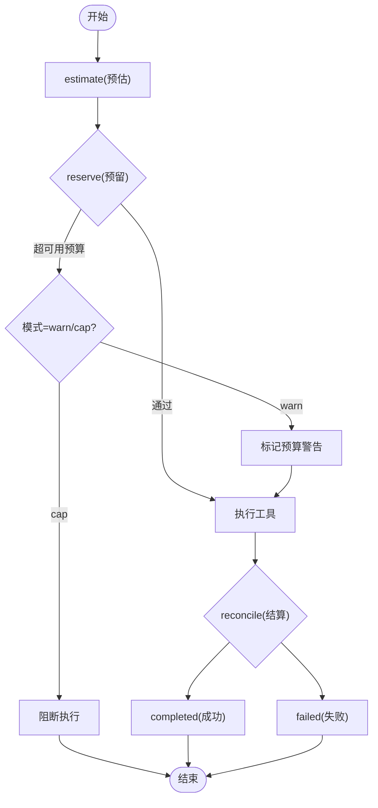
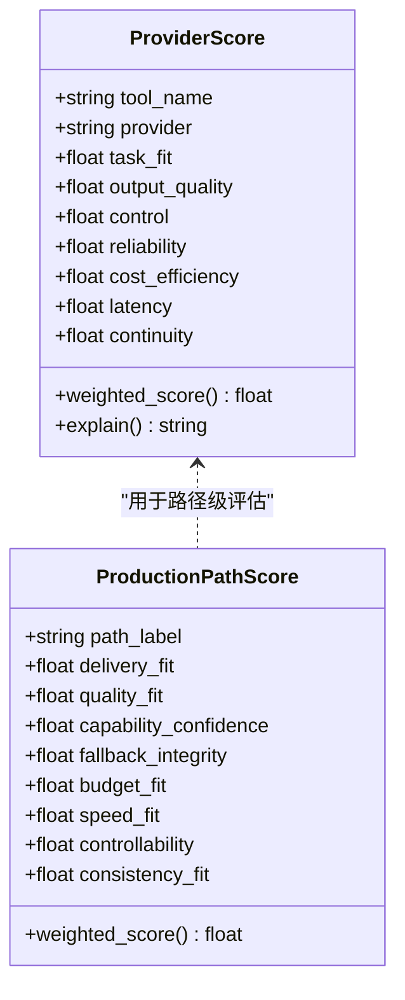
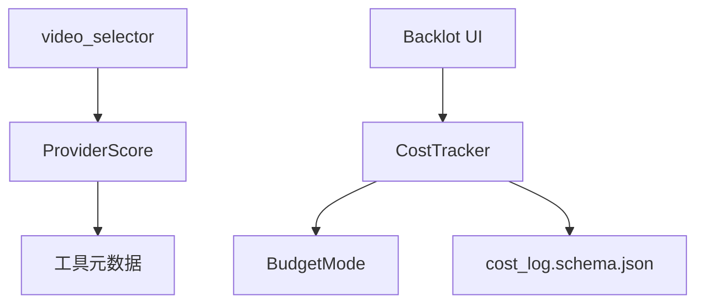

# 成本和预算优化

<cite>
**本文引用的文件**
- [tools/cost_tracker.py](file://tools/cost_tracker.py)
- [lib/config_model.py](file://lib/config_model.py)
- [lib/scoring.py](file://lib/scoring.py)
- [tools/video/video_selector.py](file://tools/video/video_selector.py)
- [schemas/artifacts/cost_log.schema.json](file://schemas/artifacts/cost_log.schema.json)
- [backlot/ui/board.js](file://backlot/ui/board.js)
- [backlot/ui/lib.js](file://backlot/ui/lib.js)
- [tests/contracts/test_phase0_contracts.py](file://tests/contracts/test_phase0_contracts.py)
- [tests/tools/test_cost_tracker_governance.py](file://tests/tools/test_cost_tracker_governance.py)
</cite>

## 目录
1. [简介](#简介)
2. [项目结构](#项目结构)
3. [核心组件](#核心组件)
4. [架构总览](#架构总览)
5. [详细组件分析](#详细组件分析)
6. [依赖关系分析](#依赖关系分析)
7. [性能与成本特性](#性能与成本特性)
8. [故障排查指南](#故障排查指南)
9. [结论](#结论)
10. [附录](#附录)

## 简介
本指南面向OpenMontage的成本与预算优化，覆盖以下目标：
- 解释成本追踪系统的实现原理：API调用计费、本地计算资源消耗、第三方服务费用统计。
- 说明预算控制机制：动态预算分配、成本预警、自动降级策略。
- 提供提供商选择优化算法：多维权重评分、成本效益分析、质量成本平衡。
- 指导如何优化AI模型调用成本：模型选择策略、参数调优、批量处理优化。
- 说明成本监控仪表板的配置和使用方法。
- 总结成本控制最佳实践与实际案例。

## 项目结构
OpenMontage在成本与预算方面由“成本追踪”“预算配置”“提供商评分与选择”“前端仪表板”等模块协作完成：
- 成本追踪：记录预估、预留、实际花费，支持持久化与审计。
- 预算配置：集中管理预算模式（观察/警告/封顶）、阈值与保留比例。
- 提供商评分：基于多维指标对候选提供商进行加权打分，结合剩余预算做成本效率评估。
- 前端仪表板：实时展示已用/剩余预算与进度条，辅助人工决策。

图表来源
- [tools/cost_tracker.py:40-171](file://tools/cost_tracker.py#L40-L171)
- [lib/config_model.py:16-41](file://lib/config_model.py#L16-L41)
- [lib/scoring.py:21-107](file://lib/scoring.py#L21-L107)
- [tools/video/video_selector.py:413-440](file://tools/video/video_selector.py#L413-L440)
- [backlot/ui/board.js:76-103](file://backlot/ui/board.js#L76-L103)
- [backlot/ui/lib.js:32-36](file://backlot/ui/lib.js#L32-L36)

章节来源
- [tools/cost_tracker.py:40-171](file://tools/cost_tracker.py#L40-L171)
- [lib/config_model.py:16-41](file://lib/config_model.py#L16-L41)
- [lib/scoring.py:21-107](file://lib/scoring.py#L21-L107)
- [tools/video/video_selector.py:413-440](file://tools/video/video_selector.py#L413-L440)
- [backlot/ui/board.js:76-103](file://backlot/ui/board.js#L76-L103)
- [backlot/ui/lib.js:32-36](file://backlot/ui/lib.js#L32-L36)

## 核心组件
- CostTracker：负责估算、预留、结算、退款、参考估算、持久化；提供可用预算、已用预算、预留预算等视图。
- BudgetConfig：定义预算模式（observe/warn/cap）、总额、保留比例、单次操作审批阈值、新付费工具审批开关。
- ProviderScore/ProductionPathScore：对提供商或生产路径进行多维度加权评分，内置成本效率因子。
- video_selector：将评分结果映射到具体工具，支持“首选提供商+分数差距”的容错选择。
- Backlot UI：通过SSE拉取状态并渲染成本条，直观显示已用/剩余预算。

章节来源
- [tools/cost_tracker.py:40-171](file://tools/cost_tracker.py#L40-L171)
- [lib/config_model.py:16-41](file://lib/config_model.py#L16-L41)
- [lib/scoring.py:21-107](file://lib/scoring.py#L21-L107)
- [tools/video/video_selector.py:413-440](file://tools/video/video_selector.py#L413-L440)
- [backlot/ui/board.js:76-103](file://backlot/ui/board.js#L76-L103)

## 架构总览
成本与预算的整体流程如下：
- 任务开始前：根据视频分析与工具计划生成成本估算（含图像、视频、TTS、音乐等分项），得到预估金额与置信度。
- 执行前：为每个付费操作创建“预估”条目，并在执行前“预留”预算；若超过可用预算或触发审批阈值，按模式阻断或标记警告。
- 执行后：以实际花费“结算”，释放预留额度；失败也计入已花费。
- 可视化：Backlot UI读取成本快照，渲染进度条与金额，便于人工干预。

图表来源
- [tools/cost_tracker.py:101-171](file://tools/cost_tracker.py#L101-L171)
- [lib/scoring.py:373-542](file://lib/scoring.py#L373-L542)
- [tools/video/video_selector.py:413-440](file://tools/video/video_selector.py#L413-L440)
- [backlot/ui/board.js:76-103](file://backlot/ui/board.js#L76-L103)

## 详细组件分析

### 成本追踪系统（CostTracker）
- 生命周期：estimate → reserve → reconcile/refund，状态机包含estimated/reserved/completed/failed/refunded。
- 预算控制：
  - 可用预算 = 总预算 − 已花费 − 预留；同时考虑保留比例（holdback）。
  - 单操作审批阈值：超过阈值时要求人工批准（可配置）。
  - 新付费工具首次使用需批准（可配置）。
  - 三种模式：observe（仅观察）、warn（标记警告）、cap（直接阻断）。
- 参考估算：基于视频分析简报和目标时长，估算场景数、运动比例、图像/视频/TTS/音乐数量，给出分项明细、总成本区间、样本成本与置信度。
- 持久化：写入cost_log.json，支持重启恢复。

图表来源
- [tools/cost_tracker.py:101-171](file://tools/cost_tracker.py#L101-L171)
- [lib/config_model.py:16-41](file://lib/config_model.py#L16-L41)

章节来源
- [tools/cost_tracker.py:40-171](file://tools/cost_tracker.py#L40-L171)
- [tools/cost_tracker.py:183-398](file://tools/cost_tracker.py#L183-L398)
- [schemas/artifacts/cost_log.schema.json:1-35](file://schemas/artifacts/cost_log.schema.json#L1-L35)

### 预算控制机制
- 动态预算分配：通过usable_budget_usd与reserve_pct实现预留缓冲，避免突发开销导致超支。
- 成本预警：warn模式下，预留超可用预算会记录budget_warning与message，供UI展示。
- 自动降级策略：
  - 当预算紧张时，scoring中的cost_efficiency会降低候选得分，从而倾向更经济的提供商。
  - video_selector支持“首选提供商+分数差距”策略，在预算紧张时可放宽首选限制，选择次优但更经济的路径。
- 审批流：单操作阈值与新付费工具首次使用可强制审批，防止意外大额支出。

章节来源
- [tools/cost_tracker.py:117-171](file://tools/cost_tracker.py#L117-L171)
- [lib/scoring.py:259-282](file://lib/scoring.py#L259-L282)
- [tools/video/video_selector.py:413-440](file://tools/video/video_selector.py#L413-L440)

### 提供商选择优化算法
- 多维评分：task_fit、output_quality、control、reliability、cost_efficiency、latency、continuity，按权重加权得出weighted_score。
- 成本效率：基于estimated_cost与剩余预算计算，预算紧张时显著降低性价比不高的选项。
- 语义匹配：通过关键词重叠与同义词簇提升意图与能力的匹配精度。
- 连续性：优先复用已锁定提供商，减少风格漂移风险。
- 选择策略：rank_providers排序后，video_selector在满足“首选提供商差距”的前提下回退到最高分工具。

图表来源
- [lib/scoring.py:21-107](file://lib/scoring.py#L21-L107)

章节来源
- [lib/scoring.py:205-542](file://lib/scoring.py#L205-L542)
- [tools/video/video_selector.py:413-440](file://tools/video/video_selector.py#L413-L440)

### AI模型调用成本优化
- 模型选择策略：
  - 依据任务上下文（意图、风格、平台）与能力标签（best_for）进行语义匹配。
  - 对需要运动的视频任务，优先具备reference_to_video、multi_shot、native_audio等高级特性的提供商。
  - 在预算紧张时，cost_efficiency权重促使选择更经济的模型或分辨率。
- 参数调优：
  - 调整分辨率、时长、采样率等直接影响token/时长计费的参数。
  - 利用estimate_from_reference估算不同目标时长下的成本区间，选择合适规格。
- 批量处理优化：
  - 合并相似请求以减少往返与冷启动开销。
  - 合理设置clip_duration_seconds，使视频片段数量与目标时长匹配，避免过度生成。
  - 引入重试缓冲（如1.3倍）与高/低区间估计，提高成功率并控制浪费。

章节来源
- [lib/scoring.py:373-542](file://lib/scoring.py#L373-L542)
- [tools/cost_tracker.py:183-398](file://tools/cost_tracker.py#L183-L398)

### 成本监控仪表板（Backlot UI）
- 数据来源：从后端获取cost快照（total_spent_usd、budget_remaining_usd）。
- 展示方式：顶部显示已用金额与预算上限，附带进度条；超过阈值时切换颜色（warn/crit）。
- 交互：支持主题切换、阶段状态查看、成本信息实时更新。

图表来源
- [backlot/ui/board.js:76-103](file://backlot/ui/board.js#L76-L103)
- [backlot/ui/lib.js:32-36](file://backlot/ui/lib.js#L32-L36)

章节来源
- [backlot/ui/board.js:76-103](file://backlot/ui/board.js#L76-L103)
- [backlot/ui/lib.js:32-36](file://backlot/ui/lib.js#L32-L36)

## 依赖关系分析
- CostTracker依赖BudgetMode枚举与持久化schema，确保预算模式与日志结构一致。
- ProviderScore依赖工具元数据（best_for、supports、stability、tier）与运行时状态，影响可靠性与质量评分。
- video_selector依赖ProviderScore排序结果，并结合preferred_provider_gap进行容错选择。
- Backlot UI依赖后端提供的cost快照，渲染成本条与状态。

图表来源
- [tools/cost_tracker.py:19-20](file://tools/cost_tracker.py#L19-L20)
- [lib/config_model.py:16-41](file://lib/config_model.py#L16-L41)
- [lib/scoring.py:373-542](file://lib/scoring.py#L373-L542)
- [tools/video/video_selector.py:413-440](file://tools/video/video_selector.py#L413-L440)
- [schemas/artifacts/cost_log.schema.json:1-35](file://schemas/artifacts/cost_log.schema.json#L1-L35)
- [backlot/ui/board.js:76-103](file://backlot/ui/board.js#L76-L103)

章节来源
- [tools/cost_tracker.py:19-20](file://tools/cost_tracker.py#L19-L20)
- [lib/config_model.py:16-41](file://lib/config_model.py#L16-L41)
- [lib/scoring.py:373-542](file://lib/scoring.py#L373-L542)
- [tools/video/video_selector.py:413-440](file://tools/video/video_selector.py#L413-L440)
- [schemas/artifacts/cost_log.schema.json:1-35](file://schemas/artifacts/cost_log.schema.json#L1-L35)
- [backlot/ui/board.js:76-103](file://backlot/ui/board.js#L76-L103)

## 性能与成本特性
- 估算准确性：estimate_from_reference综合场景密度、运动比例、TTS语速、重试缓冲，输出成本区间与置信度，有助于事前规划。
- 预算弹性：reserve_pct预留缓冲，避免瞬时峰值导致超支；warn模式提供早期预警，cap模式严格阻断。
- 选择效率：ProviderScore将成本效率纳入评分，预算紧张时自动倾向更经济方案；video_selector支持首选提供商容差，兼顾体验与成本。
- 可视化反馈：Backlot UI实时呈现成本进度，帮助快速定位超支风险点。

[本节为通用指导，无需特定文件引用]

## 故障排查指南
- 预算阻断：
  - 现象：reserve抛出BudgetExceededError。
  - 排查：检查预算总额、已花费、预留、保留比例；确认是否处于cap模式。
  - 参考：[tests/contracts/test_phase0_contracts.py:487-496](file://tests/contracts/test_phase0_contracts.py#L487-L496)
- 审批缺失：
  - 现象：reserve抛出ApprovalRequiredError。
  - 排查：检查单操作阈值、新付费工具审批开关；必要时调用approve_tool放行。
  - 参考：[tools/cost_tracker.py:127-140](file://tools/cost_tracker.py#L127-L140)
- 警告未生效：
  - 现象：warn模式下未看到预算警告。
  - 排查：确认mode为warn且预留超可用预算；检查cost_log中budget_warning字段。
  - 参考：[tests/tools/test_cost_tracker_governance.py:16-41](file://tests/tools/test_cost_tracker_governance.py#L16-L41)
- UI不显示成本：
  - 现象：Backlot无成本条或金额为空。
  - 排查：确认后端返回的cost快照包含total_spent_usd与budget_remaining_usd；检查fmtMoney格式化逻辑。
  - 参考：[backlot/ui/board.js:76-103](file://backlot/ui/board.js#L76-L103)
  - 参考：[backlot/ui/lib.js:32-36](file://backlot/ui/lib.js#L32-L36)

章节来源
- [tests/contracts/test_phase0_contracts.py:475-506](file://tests/contracts/test_phase0_contracts.py#L475-L506)
- [tests/tools/test_cost_tracker_governance.py:16-41](file://tests/tools/test_cost_tracker_governance.py#L16-L41)
- [tools/cost_tracker.py:117-171](file://tools/cost_tracker.py#L117-L171)
- [backlot/ui/board.js:76-103](file://backlot/ui/board.js#L76-L103)
- [backlot/ui/lib.js:32-36](file://backlot/ui/lib.js#L32-L36)

## 结论
OpenMontage通过CostTracker、BudgetConfig、ProviderScore与Backlot UI形成闭环的成本与预算管理体系：
- 事前：基于视频分析与工具计划的参考估算，明确成本区间与置信度。
- 事中：预留与审批机制保障预算安全，评分与选择策略在质量与成本间取得平衡。
- 事后：结算与持久化提供审计与复盘依据，UI实时反馈辅助快速决策。
建议在生产环境中启用warn或cap模式，配合合理的保留比例与审批阈值，持续优化提供商选择与参数配置，实现稳定可控的成本支出。

[本节为总结性内容，无需特定文件引用]

## 附录
- 配置项建议：
  - budget.mode：开发阶段observe，预发warn，生产cap。
  - budget.total_usd：按项目规模设定，结合历史数据校准。
  - budget.reserve_pct：建议0.10左右，应对突发重试与波动。
  - budget.single_action_approval_usd：根据业务敏感度设置，避免大额误用。
  - budget.require_approval_for_new_paid_tool：开启以控制未知工具首次调用。
- 最佳实践：
  - 使用estimate_from_reference进行事前规划，关注low/high区间与置信度。
  - 在预算紧张时放宽preferred_provider_gap，接受次优但更经济的提供商。
  - 定期审查cost_log，识别高频高耗操作，优化参数或替换提供商。
  - 结合Backlot UI进行实时监控，及时干预异常超支。

[本节为通用指导，无需特定文件引用]