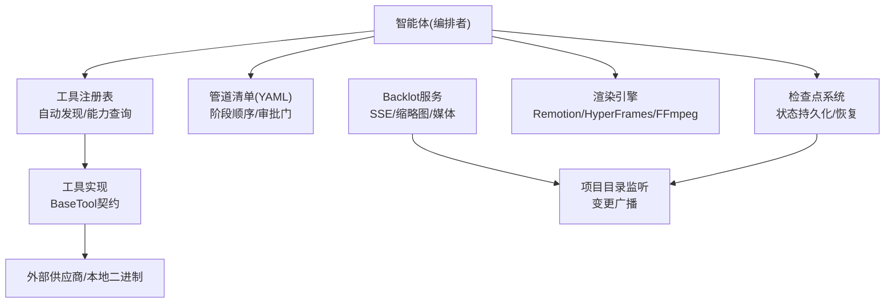
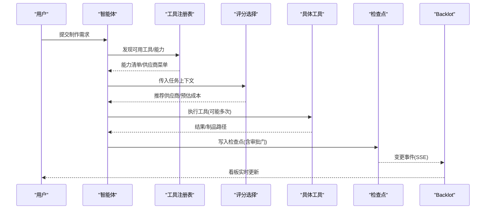
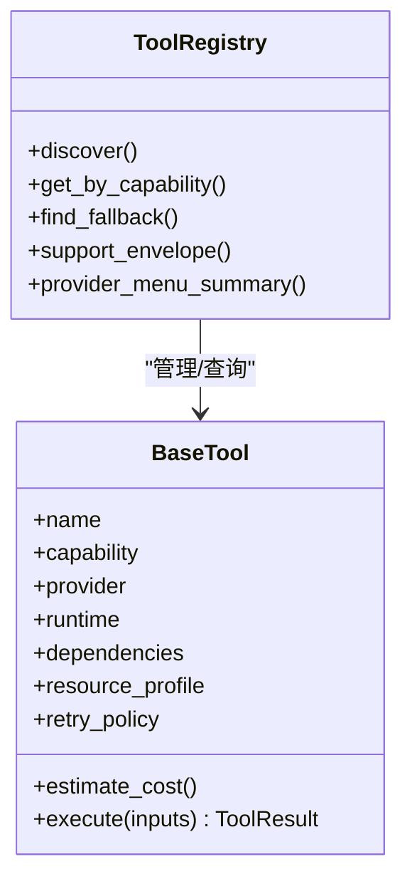
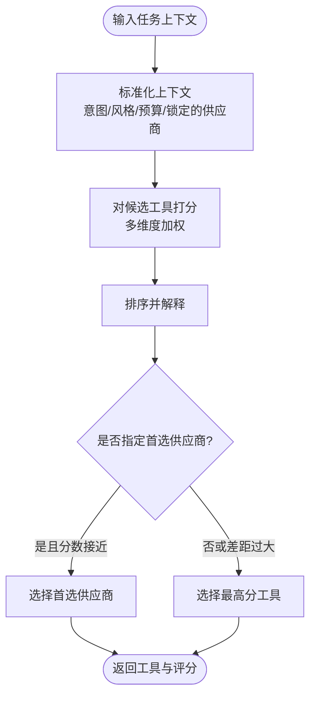
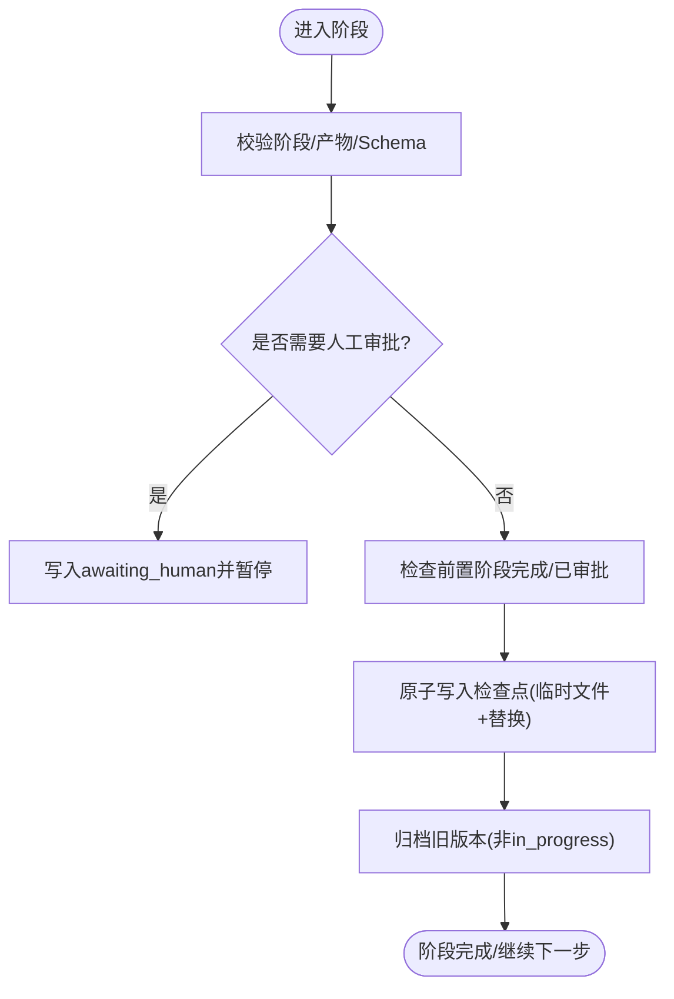
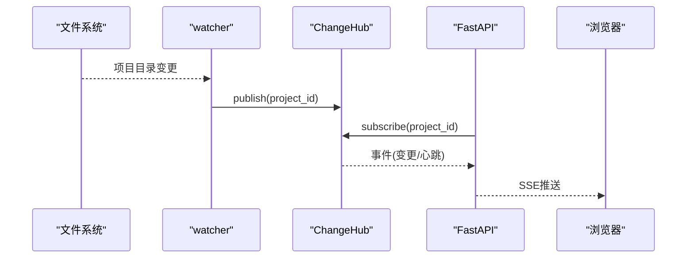
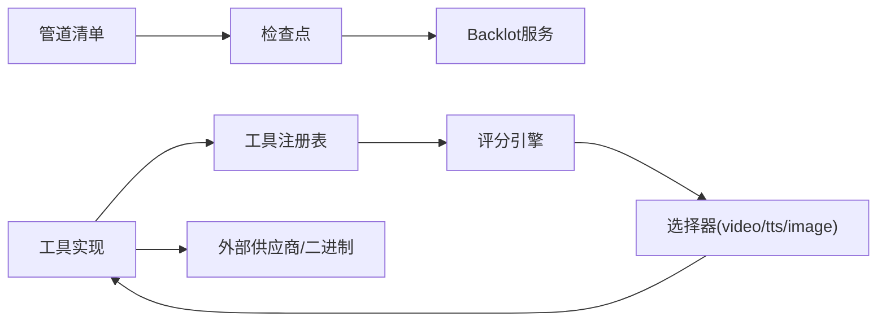

# 扩展性策略

<cite>
**本文引用的文件**
- [README.md](file://README.md)
- [ARCHITECTURE.md](file://docs/ARCHITECTURE.md)
- [config.yaml](file://config.yaml)
- [base_tool.py](file://tools/base_tool.py)
- [tool_registry.py](file://tools/tool_registry.py)
- [checkpoint.py](file://lib/checkpoint.py)
- [scoring.py](file://lib/scoring.py)
- [video_selector.py](file://tools/video/video_selector.py)
- [server.py](file://backlot/server.py)
</cite>

## 目录
1. [引言](#引言)
2. [项目结构](#项目结构)
3. [核心组件](#核心组件)
4. [架构总览](#架构总览)
5. [详细组件分析](#详细组件分析)
6. [依赖关系分析](#依赖关系分析)
7. [性能与扩展性考量](#性能与扩展性考量)
8. [故障排查指南](#故障排查指南)
9. [结论](#结论)
10. [附录](#附录)

## 引言
本指南面向OpenMontage的扩展性设计，围绕水平扩展、垂直优化、大规模数据处理、弹性伸缩、分布式系统优化、测试基准与最佳实践展开。OpenMontage采用“智能体编排 + 工具注册 + 管道清单”的架构：没有传统意义上的运行时编排器，LLM智能体读取YAML清单与技能说明，调用Python工具完成生产流程；工具通过统一契约与评分选择机制进行多供应商路由；状态以检查点持久化，支持可恢复执行与质量门禁。这些特性为横向拆分、容器化部署、负载均衡、缓存与CDN、分片与增量处理、自动扩缩容、消息与事件驱动等扩展策略提供了坚实基础。

## 项目结构
OpenMontage将能力解耦为工具层（tools）、管道定义（pipeline_defs）、技能与知识（skills/.agents/skills）、配置与校验（schemas/config.yaml）、渲染引擎（remotion-composer）以及观测面板（backlot）。这种分层使扩展点清晰：新增工具即插即用，新增管道只需声明阶段与技能引用，渲染引擎可按需切换。

图表来源
- [ARCHITECTURE.md:31-76](file://docs/ARCHITECTURE.md#L31-L76)
- [server.py:1-369](file://backlot/server.py#L1-L369)

章节来源
- [ARCHITECTURE.md:31-76](file://docs/ARCHITECTURE.md#L31-L76)
- [README.md:450-475](file://README.md#L450-L475)

## 核心组件
- 工具契约与注册：所有工具继承统一基类，声明能力、依赖、资源需求、重试策略、成本估算、回退链；注册表自动发现并按能力/供应商分组，提供可用性报告与菜单汇总。
- 评分与选择：基于任务契合度、输出质量、可控性、可靠性、成本效率、延迟、连续性等多维加权评分，动态选择最优供应商或本地替代。
- 管道与检查点：YAML清单定义阶段顺序与审批门；检查点写入前进行前置校验与归档，保证可恢复与审计追踪。
- 渲染引擎：按提案锁定Remotion/HyperFrames/FFmpeg，禁止静默切换，确保一致性。
- Backlot观测：FastAPI服务通过文件系统监听与SSE推送项目变更，提供缩略图与媒体访问。

章节来源
- [base_tool.py:227-481](file://tools/base_tool.py#L227-L481)
- [tool_registry.py:55-493](file://tools/tool_registry.py#L55-L493)
- [scoring.py:21-557](file://lib/scoring.py#L21-L557)
- [checkpoint.py:19-634](file://lib/checkpoint.py#L19-L634)
- [ARCHITECTURE.md:448-475](file://docs/ARCHITECTURE.md#L448-L475)
- [server.py:1-369](file://backlot/server.py#L1-L369)

## 架构总览
OpenMontage的扩展性由“工具化能力 + 评分选择 + 检查点治理 + 多渲染引擎 + 实时观测”构成。该架构天然支持：
- 水平扩展：工具无状态或可水平扩展（如视频生成、TTS），可通过容器化与负载均衡横向扩容。
- 垂直优化：通过本地GPU工具、缓存与CDN降低延迟与带宽。
- 弹性伸缩：基于监控指标触发扩缩容，结合队列与重试提升韧性。
- 异步与事件驱动：SSE与检查点事件流驱动UI与下游消费。

图表来源
- [tool_registry.py:118-134](file://tools/tool_registry.py#L118-L134)
- [scoring.py:533-542](file://lib/scoring.py#L533-L542)
- [video_selector.py:308-440](file://tools/video/video_selector.py#L308-L440)
- [checkpoint.py:422-562](file://lib/checkpoint.py#L422-L562)
- [server.py:165-240](file://backlot/server.py#L165-L240)

## 详细组件分析

### 工具契约与注册（水平扩展的基础）
- BaseTool定义统一的身份、能力、依赖、资源轮廓、重试策略、成本估算、幂等键、执行模式与结果结构。每个execute被自动包装为事件埋点，便于观测。
- ToolRegistry自动扫描工具模块，按能力/供应商/稳定性分类，提供可用性、回退链、支持包络与菜单摘要，是横向扩展时的“能力总线”。

图表来源
- [base_tool.py:227-481](file://tools/base_tool.py#L227-L481)
- [tool_registry.py:55-493](file://tools/tool_registry.py#L55-L493)

章节来源
- [base_tool.py:227-481](file://tools/base_tool.py#L227-L481)
- [tool_registry.py:55-493](file://tools/tool_registry.py#L55-L493)

### 评分与选择（供应商弹性与降级）
- 评分维度包括任务契合度、输出质量、可控性、可靠性、成本效率、延迟、连续性；支持语义同义词扩展与偏好约束（如首选供应商在分数差距内生效）。
- 选择器封装了候选过滤与最佳工具选择，支持估计成本与运行时间，便于预算治理与容量规划。

图表来源
- [scoring.py:297-557](file://lib/scoring.py#L297-L557)
- [video_selector.py:294-440](file://tools/video/video_selector.py#L294-L440)

章节来源
- [scoring.py:297-557](file://lib/scoring.py#L297-L557)
- [video_selector.py:294-440](file://tools/video/video_selector.py#L294-L440)

### 管道与检查点（可恢复与质量门禁）
- 检查点写入前验证阶段合法性、必需产物、JSON Schema与前置阶段完成/审批状态；支持归档历史版本，避免覆盖丢失。
- 审批门强制在关键创意阶段暂停等待人工确认，保障质量与合规。

图表来源
- [checkpoint.py:124-191](file://lib/checkpoint.py#L124-L191)
- [checkpoint.py:284-346](file://lib/checkpoint.py#L284-L346)
- [checkpoint.py:349-562](file://lib/checkpoint.py#L349-L562)

章节来源
- [checkpoint.py:124-191](file://lib/checkpoint.py#L124-L191)
- [checkpoint.py:284-346](file://lib/checkpoint.py#L284-L346)
- [checkpoint.py:349-562](file://lib/checkpoint.py#L349-L562)

### Backlot观测与事件流（实时性与可扩展UI）
- 使用watchfiles监听项目目录变更，按项目过滤并推送到SSE订阅者；提供健康检查、项目列表、状态查询、事件流、缩略图与媒体访问。
- 缩略图缓存与去重减少重复计算；SSE心跳保活连接。

图表来源
- [server.py:43-82](file://backlot/server.py#L43-L82)
- [server.py:132-149](file://backlot/server.py#L132-L149)
- [server.py:165-240](file://backlot/server.py#L165-L240)
- [server.py:325-365](file://backlot/server.py#L325-L365)

章节来源
- [server.py:1-369](file://backlot/server.py#L1-L369)

## 依赖关系分析
- 工具层依赖外部供应商API或本地二进制（FFmpeg、Node.js等），通过依赖声明与环境变量注入实现解耦。
- 注册表依赖工具模块的自动发现；评分引擎依赖工具的能力描述与资源轮廓；检查点依赖管道清单的阶段顺序与审批门；Backlot依赖文件系统与SSE。
- 潜在循环依赖：通过分层与接口隔离避免（工具不直接依赖注册表，注册表仅反射工具元数据）。

图表来源
- [tool_registry.py:118-134](file://tools/tool_registry.py#L118-L134)
- [scoring.py:533-542](file://lib/scoring.py#L533-L542)
- [checkpoint.py:51-75](file://lib/checkpoint.py#L51-L75)
- [server.py:165-240](file://backlot/server.py#L165-L240)

章节来源
- [tool_registry.py:118-134](file://tools/tool_registry.py#L118-L134)
- [scoring.py:533-542](file://lib/scoring.py#L533-L542)
- [checkpoint.py:51-75](file://lib/checkpoint.py#L51-L75)
- [server.py:165-240](file://backlot/server.py#L165-L240)

## 性能与扩展性考量

### 水平扩展架构设计
- 微服务拆分建议：
  - 工具服务：将高并发、无状态的工具调用（如TTS、图像/视频生成、转码）拆分为独立服务，暴露REST/gRPC接口，配合注册表与服务发现。
  - 编排服务：保留轻量编排逻辑（读取清单、调用工具、写检查点），可水平扩展实例。
  - 渲染服务：Remotion/HyperFrames/FFmpeg作为专用渲染节点池，按负载弹性伸缩。
  - 观测服务：Backlot作为独立服务，提供SSE与媒体访问。
- 容器化部署：
  - 每个服务打包为镜像，环境变量注入密钥与配置；使用Kubernetes Deployment/StatefulSet管理副本数与资源限制。
  - 共享存储挂载项目目录（NFS/EFS），保证检查点与制品一致性。
- 负载均衡配置：
  - Ingress/网关层按能力路由（如/tools/video、/tools/audio），结合权重与熔断策略。
  - 针对长耗时任务采用异步队列（如Celery/RabbitMQ/Kafka），前端轮询或SSE回调。

### 垂直扩展优化方法
- 数据库优化：若引入元数据存储（项目索引、成本日志、决策日志），建议使用读写分离、连接池、索引优化与只读副本。
- 缓存层设计：
  - 工具级缓存：基于幂等键（idempotency_key）缓存结果，减少重复计算与API调用。
  - 缩略图/媒体缓存：参考Backlot的缩略图缓存策略，按内容哈希与尺寸缓存到对象存储或磁盘缓存。
- CDN集成：
  - 静态资源与最终视频制品通过CDN分发，设置合理的Cache-Control与ETag，利用Range请求加速播放。

### 大规模数据处理策略
- 数据分片：
  - 按项目ID或场景ID分片存储制品与检查点，避免单目录过大；结合对象存储的分桶策略。
- 增量处理：
  - 检查点记录已完成阶段，失败恢复时跳过已完成步骤；工具层支持from_checkpoint恢复。
- 结果缓存：
  - 评分与选择结果可短期缓存；供应商响应与本地模型推理结果按幂等键缓存。

### 弹性伸缩机制
- 自动扩缩容：
  - 基于CPU/内存/GPU利用率、队列长度、错误率等指标触发HPA；渲染节点池按并发渲染任务数伸缩。
- 资源监控：
  - 工具执行埋点（开始/结束/错误/成本/时长）汇聚至监控系统；Backlot事件流用于可视化。
- 故障转移：
  - 工具回退链（fallback_tools）与评分降级；网络/供应商不可用时自动切换到本地或备选供应商。

### 分布式系统性能优化
- 消息队列：
  - 将长耗时任务（视频生成、转码、分析）放入队列，消费者按能力标签消费；支持重试与死信队列。
- 事件驱动架构：
  - 检查点变更、工具完成事件通过SSE或消息总线广播，下游订阅消费（如通知、统计、归档）。
- 异步处理：
  - 工具执行支持异步模式；渲染任务后台执行，前端通过SSE获取进度。

### 扩展性测试方法与性能基准建立
- 合同测试：验证工具契约、Schema与注册表行为。
- 集成测试：调用真实工具与二进制，验证端到端流程。
- 评估框架：回放黄金场景，容忍随机输出差异。
- 基准测试：
  - 工具级：测量延迟、吞吐、成功率、成本。
  - 系统级：模拟多项目并发，观察Backlot事件流与渲染队列压力。

章节来源
- [base_tool.py:376-407](file://tools/base_tool.py#L376-L407)
- [tool_registry.py:198-230](file://tools/tool_registry.py#L198-L230)
- [checkpoint.py:567-634](file://lib/checkpoint.py#L567-L634)
- [server.py:165-240](file://backlot/server.py#L165-L240)
- [ARCHITECTURE.md:478-495](file://docs/ARCHITECTURE.md#L478-L495)

## 故障排查指南
- 工具依赖缺失：检查dependencies声明与环境变量；使用get_status判断可用性。
- 供应商不可用：查看评分与选择日志，确认回退链是否生效；必要时调整任务上下文或预算。
- 检查点写入失败：确认前置阶段完成与审批状态；查看归档历史定位问题阶段。
- Backlot无更新：确认watchfiles可用与项目目录权限；检查SSE连接与心跳。

章节来源
- [base_tool.py:296-328](file://tools/base_tool.py#L296-L328)
- [scoring.py:373-530](file://lib/scoring.py#L373-L530)
- [checkpoint.py:284-346](file://lib/checkpoint.py#L284-L346)
- [server.py:132-149](file://backlot/server.py#L132-L149)

## 结论
OpenMontage通过工具化、评分选择、检查点治理与多渲染引擎，构建了高度可扩展的视频生产平台。其架构天然适配水平拆分、容器化与负载均衡；通过缓存、CDN与分片/增量处理支撑大规模数据；借助监控、队列与事件驱动实现弹性伸缩与高性能。结合合同测试与基准测试，可在演进中持续验证扩展性效果。

## 附录
- 配置要点：全局配置包含LLM、预算、检查点策略、输出参数与路径；环境变量注入供应商密钥。
- 渲染引擎选择：在提案阶段锁定，禁止静默切换，确保一致性。
- 最佳实践：
  - 为新工具补充资源轮廓与重试策略，提升可观测与韧性。
  - 为关键阶段启用审批门，保障质量。
  - 使用幂等键与检查点实现可恢复与去重。
  - 通过Backlot事件流与缩略图缓存优化用户体验。

章节来源
- [config.yaml:1-34](file://config.yaml#L1-L34)
- [ARCHITECTURE.md:448-475](file://docs/ARCHITECTURE.md#L448-L475)
- [README.md:652-686](file://README.md#L652-L686)