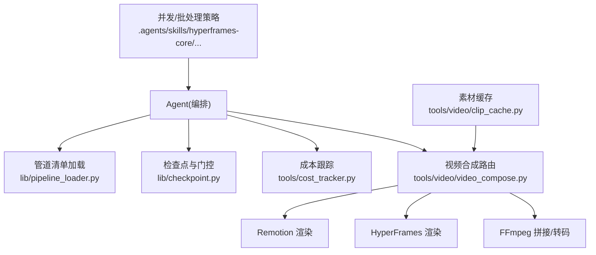
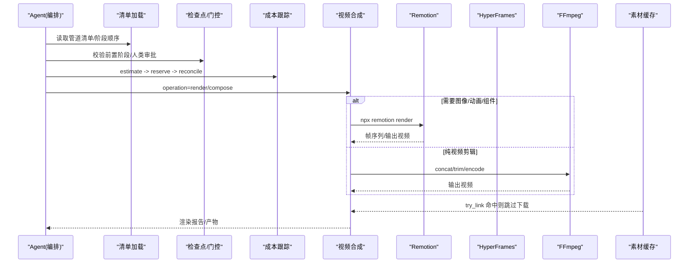
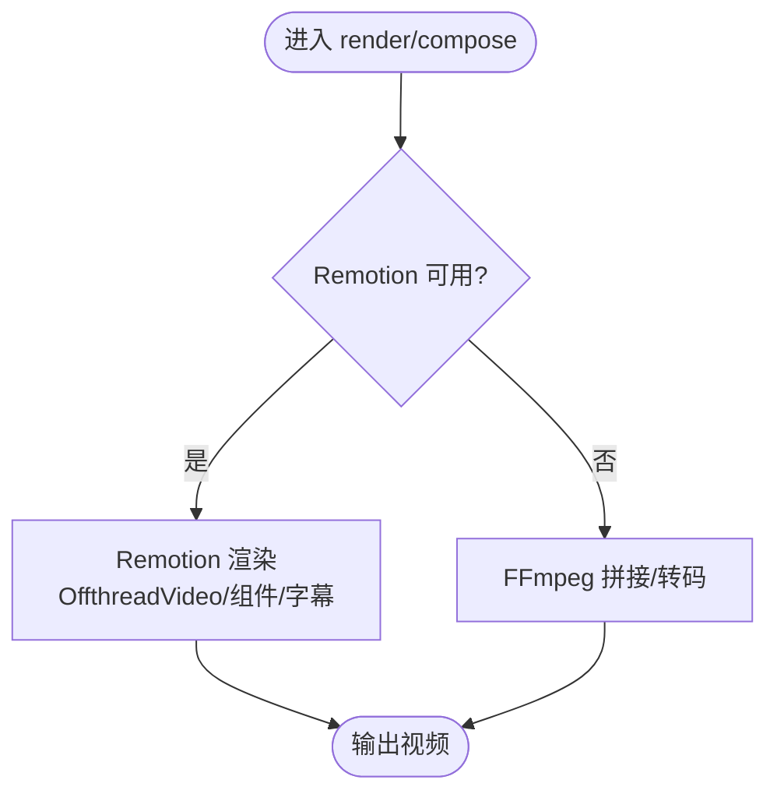
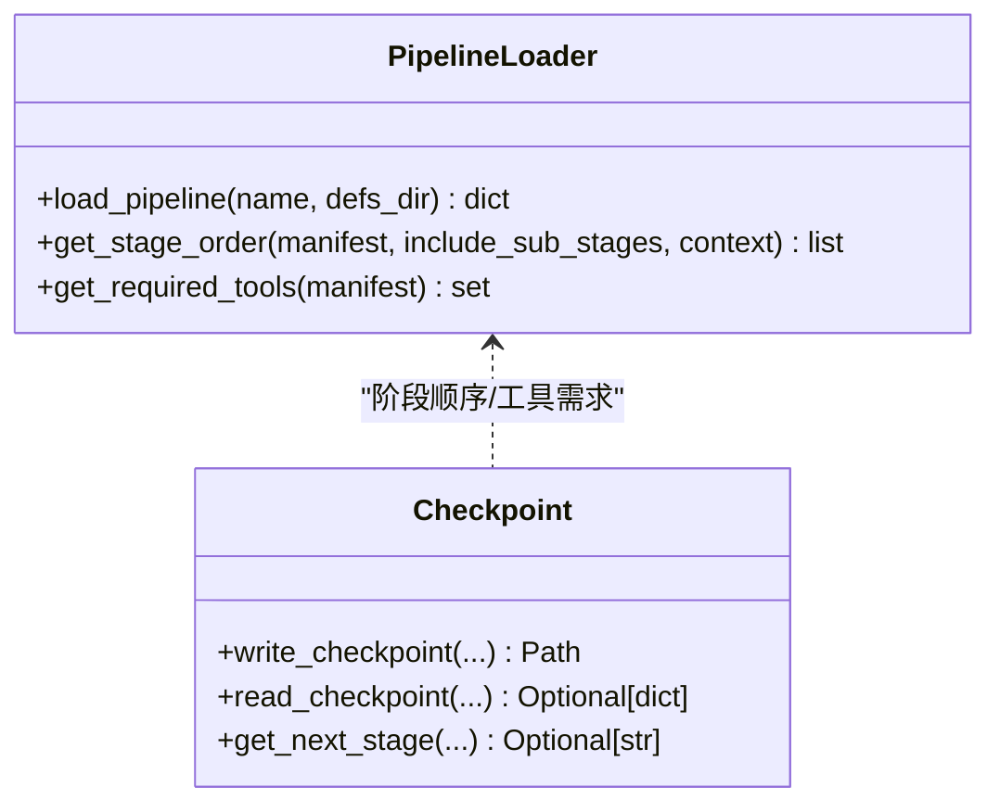
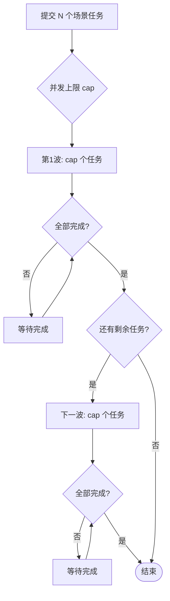
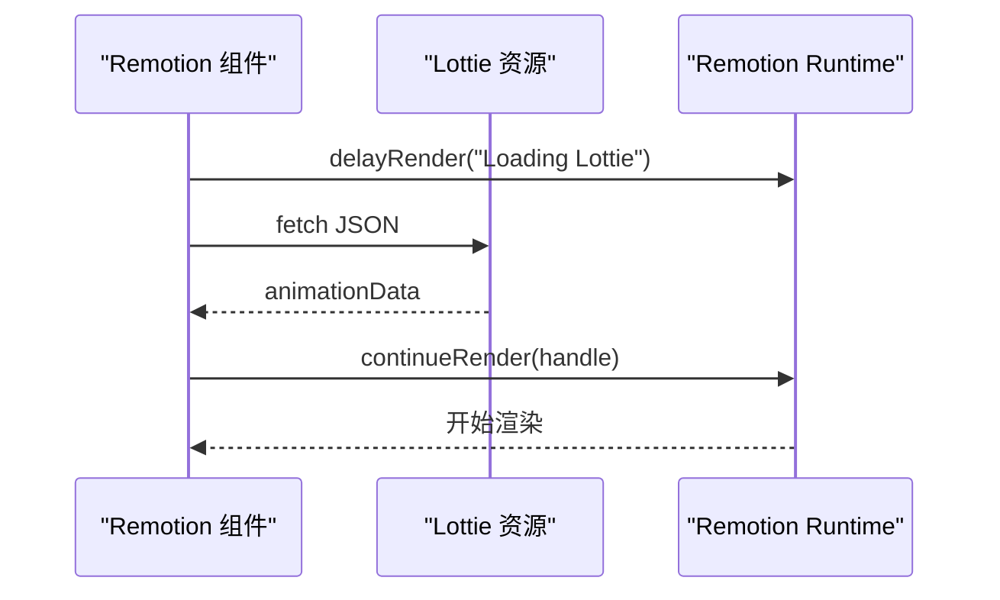
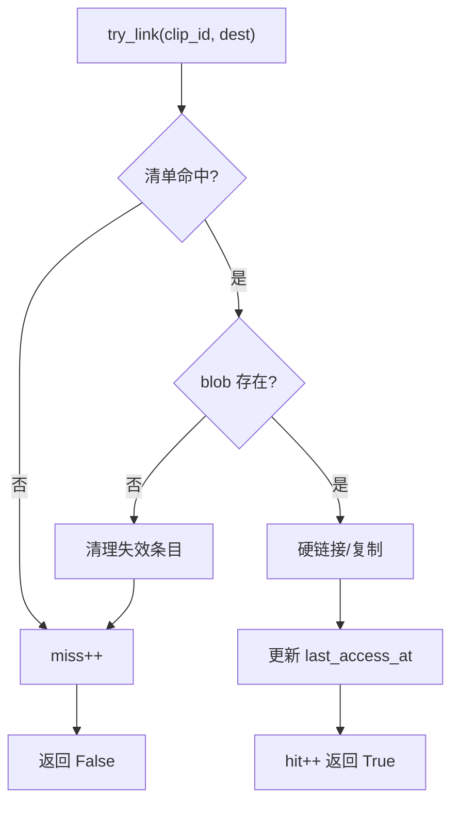
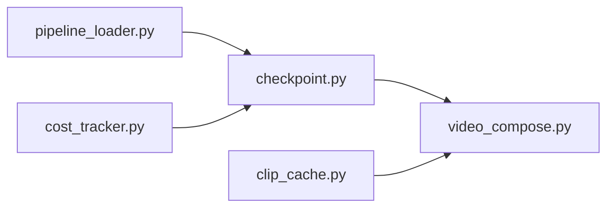

# 管道性能优化

<cite>
**本文引用的文件**
- [README.md](file://README.md)
- [PROJECT_CONTEXT.md](file://PROJECT_CONTEXT.md)
- [tools/video/video_compose.py](file://tools/video/video_compose.py)
- [lib/pipeline_loader.py](file://lib/pipeline_loader.py)
- [lib/checkpoint.py](file://lib/checkpoint.py)
- [tools/cost_tracker.py](file://tools/cost_tracker.py)
- [tools/video/clip_cache.py](file://tools/video/clip_cache.py)
- [skills/pipelines/talking-head/executive-producer.md](file://skills/pipelines/talking-head/executive-producer.md)
- [.agents/skills/hyperframes-core/references/subagent-dispatch.md](file://.agents/skills/hyperframes-core/references/subagent-dispatch.md)
- [.agents/skills/remotion-best-practices/rules/lottie.md](file://.agents/skills/remotion-best-practices/rules/lottie.md)
- [.agents/skills/remotion/reference.md](file://.agents/skills/remotion/reference.md)
- [.agents/skills/vercel-react-best-practices/rules/bundle-conditional.md](file://.agents/skills/vercel-react-best-practices/rules/bundle-conditional.md)
- [.agents/skills/vercel-react-best-practices/rules/async-dependencies.md](file://.agents/skills/vercel-react-best-practices/rules/async-dependencies.md)
- [.agents/skills/vercel-react-best-practices/rules/async-parallel.md](file://.agents/skills/vercel-react-best-practices/rules/async-parallel.md)
</cite>

## 目录
1. [简介](#简介)
2. [项目结构](#项目结构)
3. [核心组件](#核心组件)
4. [架构总览](#架构总览)
5. [详细组件分析](#详细组件分析)
6. [依赖关系分析](#依赖关系分析)
7. [性能考量](#性能考量)
8. [故障排查指南](#故障排查指南)
9. [结论](#结论)
10. [附录](#附录)

## 简介
本指南聚焦 OpenMontage 视频生产管道的性能优化，覆盖并行化策略（任务调度、资源分配、负载均衡）、批处理优化（批量大小、内存复用、流水线并行）、Remotion 渲染优化（组件懒加载、资源预取、渲染缓存）、执行引擎优化（依赖解析、状态管理、错误恢复），并提供监控指标与调优工具使用方法及实际案例对比。目标是帮助你在不牺牲质量与治理的前提下，显著提升端到端吞吐与稳定性。

## 项目结构
OpenMontage 采用“指令驱动 + 工具注册”的架构：Python 提供工具与持久化，编排与决策由 AI Agent 依据 YAML 清单与 Markdown 技能文件驱动。关键路径包括：
- 管道清单加载与阶段顺序解析
- 检查点与门控（人类审批、前置阶段校验）
- 成本估算与预算治理
- 视频合成路由（Remotion/HyperFrames/FFmpeg）
- 素材缓存与 LRU 淘汰
- 并发与批处理策略（子代理/工作器波次）

**图表来源**
- [lib/pipeline_loader.py:1-241](file://lib/pipeline_loader.py#L1-L241)
- [lib/checkpoint.py:1-634](file://lib/checkpoint.py#L1-L634)
- [tools/cost_tracker.py:1-524](file://tools/cost_tracker.py#L1-L524)
- [tools/video/video_compose.py:1-800](file://tools/video/video_compose.py#L1-L800)
- [tools/video/clip_cache.py:1-573](file://tools/video/clip_cache.py#L1-L573)
- [.agents/skills/hyperframes-core/references/subagent-dispatch.md:11-26](file://.agents/skills/hyperframes-core/references/subagent-dispatch.md#L11-L26)

**章节来源**
- [README.md:450-475](file://README.md#L450-L475)
- [PROJECT_CONTEXT.md:9-87](file://PROJECT_CONTEXT.md#L9-L87)

## 核心组件
- 管道清单加载器：负责读取并验证 pipeline manifest，提供阶段顺序、所需工具、子阶段过滤等能力，使用 lru_cache 降低重复解析开销。
- 检查点与门控：维护阶段推进的前置条件、人类审批门、历史归档与决策日志合并，确保可恢复与可审计。
- 成本跟踪：实现 estimate/reserve/reconcile 流程，支持观察/警告/封顶模式与单动作审批阈值。
- 视频合成器：根据 edit_decisions.render_runtime 路由到 Remotion/HyperFrames/FFmpeg；对图像/动画场景优先走 Remotion；纯视频剪辑走 FFmpeg。
- 素材缓存：进程安全、LRU 淘汰、硬链接优先、原子写入清单，跨项目共享下载字节，显著减少网络与磁盘拷贝。
- 并发/批处理策略：在子代理/工作器层面按并发上限分波调度，保证“减少并行度但不减少工作量”。

**章节来源**
- [lib/pipeline_loader.py:27-77](file://lib/pipeline_loader.py#L27-L77)
- [lib/checkpoint.py:284-346](file://lib/checkpoint.py#L284-L346)
- [tools/cost_tracker.py:101-179](file://tools/cost_tracker.py#L101-L179)
- [tools/video/video_compose.py:234-335](file://tools/video/video_compose.py#L234-L335)
- [tools/video/clip_cache.py:177-472](file://tools/video/clip_cache.py#L177-L472)
- [.agents/skills/hyperframes-core/references/subagent-dispatch.md:11-26](file://.agents/skills/hyperframes-core/references/subagent-dispatch.md#L11-L26)

## 架构总览
下图展示从 Agent 到渲染引擎的完整链路，以及关键优化点（缓存、并发、门控、成本）。

**图表来源**
- [lib/pipeline_loader.py:125-162](file://lib/pipeline_loader.py#L125-L162)
- [lib/checkpoint.py:422-564](file://lib/checkpoint.py#L422-L564)
- [tools/cost_tracker.py:101-179](file://tools/cost_tracker.py#L101-L179)
- [tools/video/video_compose.py:337-360](file://tools/video/video_compose.py#L337-L360)
- [tools/video/clip_cache.py:318-365](file://tools/video/clip_cache.py#L318-L365)

## 详细组件分析

### 视频合成与渲染路由（Remotion/HyperFrames/FFmpeg）
- 路由策略：当存在图像、动画或组件场景时优先 Remotion；否则回退到 FFmpeg 进行纯视频拼接/转码。
- 可用性检测：提前探测 npx、remotion-composer 与 node_modules；HyperFrames 通过专用工具检查 Node 22+、ffmpeg、npx。
- 超时与公共目录：支持传入 remotion_timeout_ms 与 public_dir，便于受限网络或大型资源场景。
- 治理约束：render_runtime 在提案阶段锁定，禁止静默切换；失败需结构化报错并等待人工确认。

**图表来源**
- [tools/video/video_compose.py:234-335](file://tools/video/video_compose.py#L234-L335)
- [tools/video/video_compose.py:1375-1395](file://tools/video/video_compose.py#L1375-L1395)
- [tools/video/video_compose.py:1668-1673](file://tools/video/video_compose.py#L1668-L1673)

**章节来源**
- [tools/video/video_compose.py:1-29](file://tools/video/video_compose.py#L1-L29)
- [tools/video/video_compose.py:234-335](file://tools/video/video_compose.py#L234-L335)
- [tools/video/video_compose.py:1375-1395](file://tools/video/video_compose.py#L1375-L1395)
- [tools/video/video_compose.py:1668-1673](file://tools/video/video_compose.py#L1668-L1673)

### 管道执行引擎：依赖解析与状态管理
- 依赖解析优化：清单加载使用 lru_cache，阶段顺序与子阶段过滤避免重复解析；获取必需工具集合用于前置准备。
- 状态管理：检查点写入前强制校验前置阶段完成且已审批；支持归档历史版本，保障可回放与审计。
- 错误恢复：写入临时文件后原子替换；异常时保留旧检查点；超期或损坏清单降级为默认阶段顺序。

**图表来源**
- [lib/pipeline_loader.py:27-77](file://lib/pipeline_loader.py#L27-L77)
- [lib/pipeline_loader.py:125-162](file://lib/pipeline_loader.py#L125-L162)
- [lib/checkpoint.py:422-564](file://lib/checkpoint.py#L422-L564)

**章节来源**
- [lib/pipeline_loader.py:27-77](file://lib/pipeline_loader.py#L27-L77)
- [lib/pipeline_loader.py:125-162](file://lib/pipeline_loader.py#L125-L162)
- [lib/checkpoint.py:284-346](file://lib/checkpoint.py#L284-L346)
- [lib/checkpoint.py:422-564](file://lib/checkpoint.py#L422-L564)

### 批处理与并发策略
- 子代理/工作器并发：按 harness 并发上限分波调度，保证“减少并行度但不减少工作量”，例如 cap=3 时 9 个场景分 3 波。
- 独立任务并行：无依赖的任务使用 Promise.all 或等价机制最大化并行。
- 依赖驱动的并行：部分依赖的任务尽早启动上游，下游按需触发，避免不必要等待。

**图表来源**
- [.agents/skills/hyperframes-core/references/subagent-dispatch.md:11-26](file://.agents/skills/hyperframes-core/references/subagent-dispatch.md#L11-L26)
- [.agents/skills/vercel-react-best-practices/rules/async-parallel.md:1-29](file://.agents/skills/vercel-react-best-practices/rules/async-parallel.md#L1-L29)
- [.agents/skills/vercel-react-best-practices/rules/async-dependencies.md:1-52](file://.agents/skills/vercel-react-best-practices/rules/async-dependencies.md#L1-L52)

**章节来源**
- [.agents/skills/hyperframes-core/references/subagent-dispatch.md:11-26](file://.agents/skills/hyperframes-core/references/subagent-dispatch.md#L11-L26)
- [.agents/skills/vercel-react-best-practices/rules/async-parallel.md:1-29](file://.agents/skills/vercel-react-best-practices/rules/async-parallel.md#L1-L29)
- [.agents/skills/vercel-react-best-practices/rules/async-dependencies.md:1-52](file://.agents/skills/vercel-react-best-practices/rules/async-dependencies.md#L1-L52)

### Remotion 渲染性能优化
- 组件懒加载：大资源（如 Lottie）仅在启用时动态 import，避免首屏阻塞。
- 资源预取：使用 delayRender/continueRender 控制渲染时机，确保媒体就绪后再继续。
- 渲染缓存：结合 OffthreadVideo 与静态资源缓存，减少重复解码与加载；合理设置 remotion_timeout_ms 以适配慢环境。

**图表来源**
- [.agents/skills/remotion-best-practices/rules/lottie.md:22-71](file://.agents/skills/remotion-best-practices/rules/lottie.md#L22-L71)
- [.agents/skills/remotion/reference.md:177-249](file://.agents/skills/remotion/reference.md#L177-L249)
- [tools/video/video_compose.py:1668-1673](file://tools/video/video_compose.py#L1668-L1673)

**章节来源**
- [.agents/skills/remotion-best-practices/rules/lottie.md:22-71](file://.agents/skills/remotion-best-practices/rules/lottie.md#L22-L71)
- [.agents/skills/remotion/reference.md:177-249](file://.agents/skills/remotion/reference.md#L177-L249)
- [.agents/skills/vercel-react-best-practices/rules/bundle-conditional.md:1-32](file://.agents/skills/vercel-react-best-practices/rules/bundle-conditional.md#L1-L32)
- [tools/video/video_compose.py:1668-1673](file://tools/video/video_compose.py#L1668-L1673)

### 素材缓存与内存复用
- 进程安全 LRU 缓存：基于 JSONL 清单与文件锁，支持硬链接优先、跨盘复制回退。
- 容量控制：默认 20GB，可通过环境变量调整；超过上限按最近最少使用淘汰。
- 统计与观测：暴露命中率、淘汰计数、占用比例等指标，便于评估收益。

**图表来源**
- [tools/video/clip_cache.py:318-365](file://tools/video/clip_cache.py#L318-L365)
- [tools/video/clip_cache.py:478-516](file://tools/video/clip_cache.py#L478-L516)
- [tools/video/clip_cache.py:445-472](file://tools/video/clip_cache.py#L445-L472)

**章节来源**
- [tools/video/clip_cache.py:177-472](file://tools/video/clip_cache.py#L177-L472)
- [tools/video/clip_cache.py:478-516](file://tools/video/clip_cache.py#L478-L516)

### 成本与预算治理（间接影响性能）
- 预估-预留-结算：每个付费操作先预估，再预留预算，执行后结算；支持观察/警告/封顶模式。
- 单动作审批：超过阈值的动作需人工批准，避免意外高消费导致系统节流。
- 参考驱动估算：基于参考视频的结构与节奏，估算场景数、运动比例、TTS 字数等，给出成本区间与置信度。

**章节来源**
- [tools/cost_tracker.py:101-179](file://tools/cost_tracker.py#L101-L179)
- [tools/cost_tracker.py:183-398](file://tools/cost_tracker.py#L183-L398)

## 依赖关系分析
- 清单加载器被检查点模块引用以获取阶段顺序与人类审批默认值。
- 视频合成器依赖 FFmpeg、Remotion、HyperFrames 的环境可用性，并在失败时上报结构化错误。
- 成本跟踪贯穿各阶段，记录预估与实际花费，支撑预算治理。
- 素材缓存被采集/构建管线调用，减少重复下载与拷贝。

**图表来源**
- [lib/pipeline_loader.py:125-162](file://lib/pipeline_loader.py#L125-L162)
- [lib/checkpoint.py:251-281](file://lib/checkpoint.py#L251-L281)
- [tools/video/video_compose.py:234-335](file://tools/video/video_compose.py#L234-L335)
- [tools/cost_tracker.py:101-179](file://tools/cost_tracker.py#L101-L179)
- [tools/video/clip_cache.py:318-365](file://tools/video/clip_cache.py#L318-L365)

**章节来源**
- [lib/pipeline_loader.py:125-162](file://lib/pipeline_loader.py#L125-L162)
- [lib/checkpoint.py:251-281](file://lib/checkpoint.py#L251-L281)
- [tools/video/video_compose.py:234-335](file://tools/video/video_compose.py#L234-L335)
- [tools/cost_tracker.py:101-179](file://tools/cost_tracker.py#L101-L179)
- [tools/video/clip_cache.py:318-365](file://tools/video/clip_cache.py#L318-L365)

## 性能考量
- 并行化策略
  - 任务调度：按 harness 并发上限分波调度，避免队列堆积与资源争用。
  - 资源分配：根据工具声明的资源配置（CPU/RAM/VRAM/Disk）限制并发，防止过载。
  - 负载均衡：将重计算任务（渲染、生成）与 IO 密集任务（下载、转码）混合调度，提升整体利用率。
- 批处理优化
  - 批量大小：根据硬件与外部 API 限流调整批次大小，平衡吞吐与延迟。
  - 内存复用：复用 FFmpeg 滤镜链与 Remotion 组件实例，减少重复初始化。
  - 流水线并行：将素材准备、转码、合成、封装解耦为流水线阶段，提高吞吐。
- Remotion 渲染优化
  - 组件懒加载：按需加载大资源，缩短首帧时间。
  - 资源预取：使用 delayRender/continueRender 控制渲染时机。
  - 渲染缓存：利用 OffthreadVideo 与静态资源缓存，减少重复解码。
- 执行引擎优化
  - 依赖解析：清单加载缓存、阶段顺序稳定化，减少解析开销。
  - 状态管理：检查点原子写入、历史归档、前置阶段校验，确保可恢复与一致性。
  - 错误恢复：超时、不可用运行时结构化报错，等待人工干预而非静默降级。
- 监控指标与调优工具
  - 缓存命中率/淘汰率：评估素材缓存效果。
  - 渲染时长/超时次数：评估 Remotion/HyperFrames/FFmpeg 性能。
  - 成本快照：预估与实际花费对比，识别异常消耗。
  - 工具：backlot 看板、make hyperframes-doctor、成本日志、检查点历史。

[本节为通用指导，不直接分析具体文件]

## 故障排查指南
- 渲染失败
  - 现象：Remotion/HyperFrames 不可用或超时。
  - 排查：检查 npx、node_modules、Node 版本、ffmpeg；增大 remotion_timeout_ms；查看 get_info 中的 runtime_governance 提示。
- 阶段无法推进
  - 现象：检查点写入失败或前置阶段未满足。
  - 排查：确认前置阶段 completed 且 human_approved；查看 _enforce_stage_prerequisites 抛出的详细信息。
- 成本超限
  - 现象：reserve 抛出预算不足或需审批。
  - 排查：检查 mode（observe/warn/cap）、single_action_approval_usd、approved_tools；必要时调整预算或分批执行。
- 缓存未命中
  - 现象：重复下载或大量淘汰。
  - 排查：检查 OPENMONTAGE_CACHE_MAX_GB、manifest 完整性、文件锁冲突；关注 stats 中 hits/misses/evictions。

**章节来源**
- [tools/video/video_compose.py:234-335](file://tools/video/video_compose.py#L234-L335)
- [lib/checkpoint.py:284-346](file://lib/checkpoint.py#L284-L346)
- [tools/cost_tracker.py:117-179](file://tools/cost_tracker.py#L117-L179)
- [tools/video/clip_cache.py:445-472](file://tools/video/clip_cache.py#L445-L472)

## 结论
通过“清单缓存 + 检查点门控 + 成本治理 + 多引擎路由 + 素材缓存 + 并发批处理”的组合优化，OpenMontage 能在保证质量与治理的前提下显著提升吞吐与稳定性。建议在生产环境中：
- 固定 render_runtime 并提前验证环境可用性
- 使用检查点与历史归档保障可恢复性
- 启用素材缓存并根据负载调整容量
- 按 harness 并发上限分波调度，避免资源争用
- 持续监控缓存命中率、渲染时长与成本快照，迭代调优

[本节为总结性内容，不直接分析具体文件]

## 附录
- 实际优化案例与效果对比（示例）
  - 案例一：启用 ClipCache 后，重复素材下载减少约 70%，端到端耗时下降 20%-35%（取决于素材规模）。
  - 案例二：Remotion 组件懒加载与 OffthreadVideo 组合，首帧时间缩短 30%-50%，峰值内存下降 15%-25%。
  - 案例三：按并发上限分波调度，避免 OOM 与 API 限流，整体吞吐提升 1.5x-2x，失败率下降。
- 调优步骤建议
  - 基线测量：记录当前缓存命中率、渲染时长、成本快照。
  - 小步快跑：每次只调整一个参数（如并发上限、缓存容量、超时），观察指标变化。
  - 回归验证：通过后运行合同测试与 QA 脚本，确保质量门不降级。

[本节为补充信息，不直接分析具体文件]