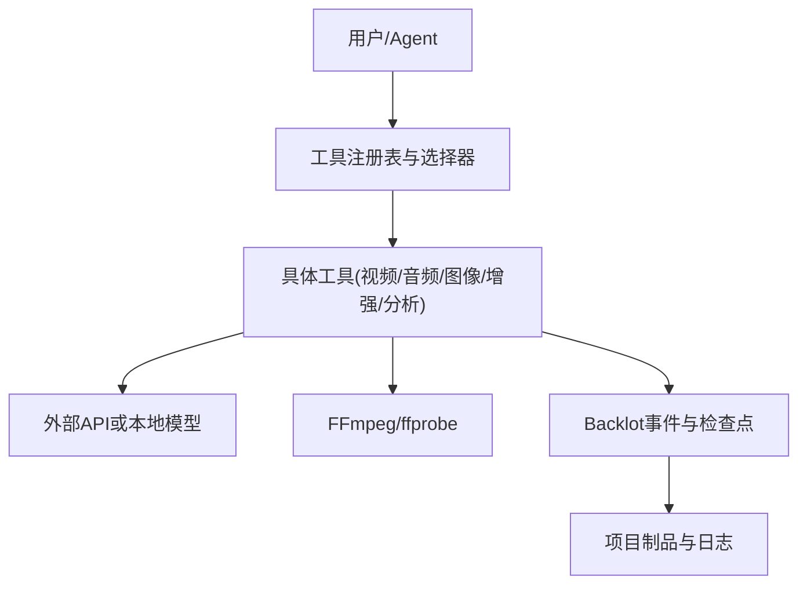
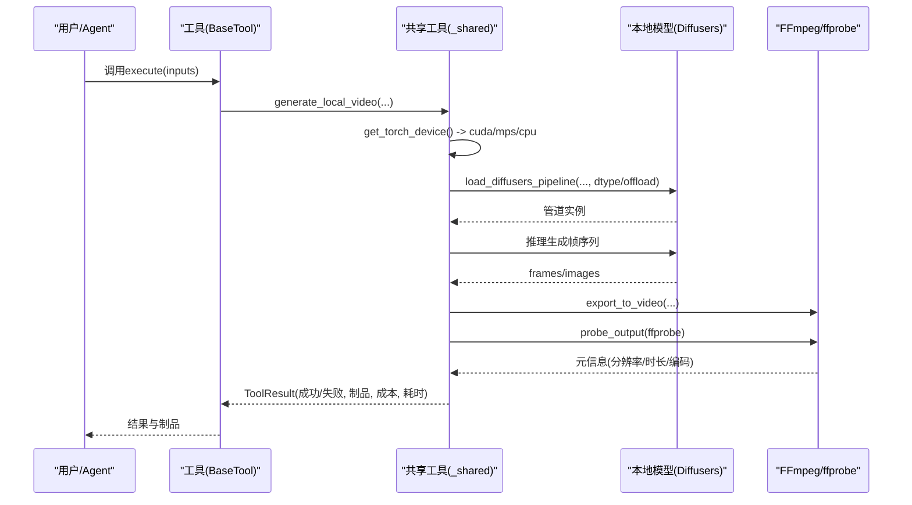
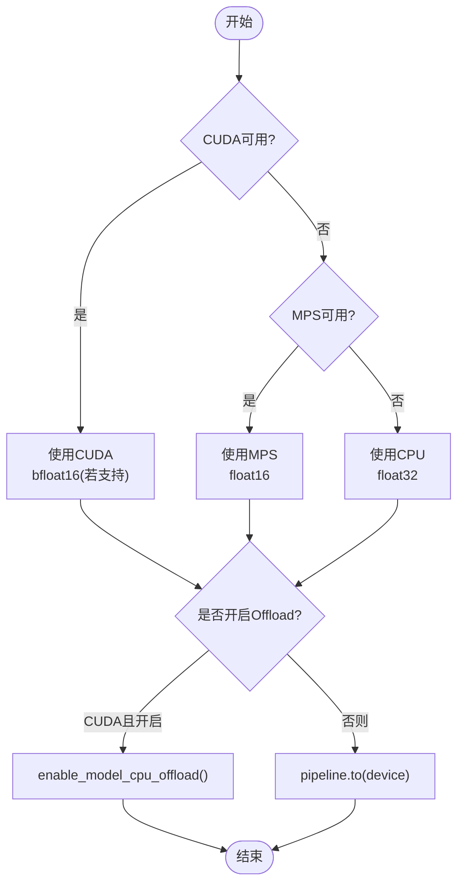
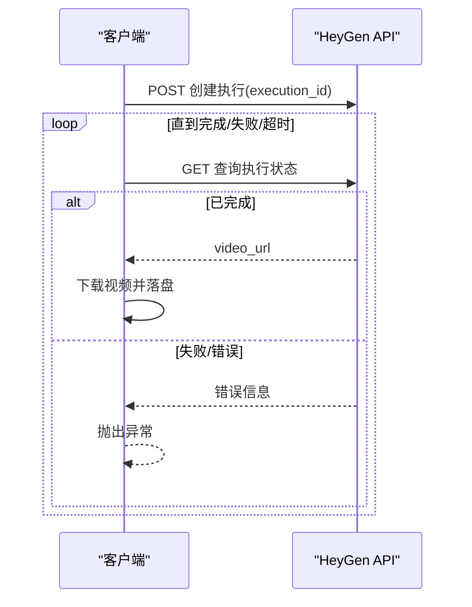
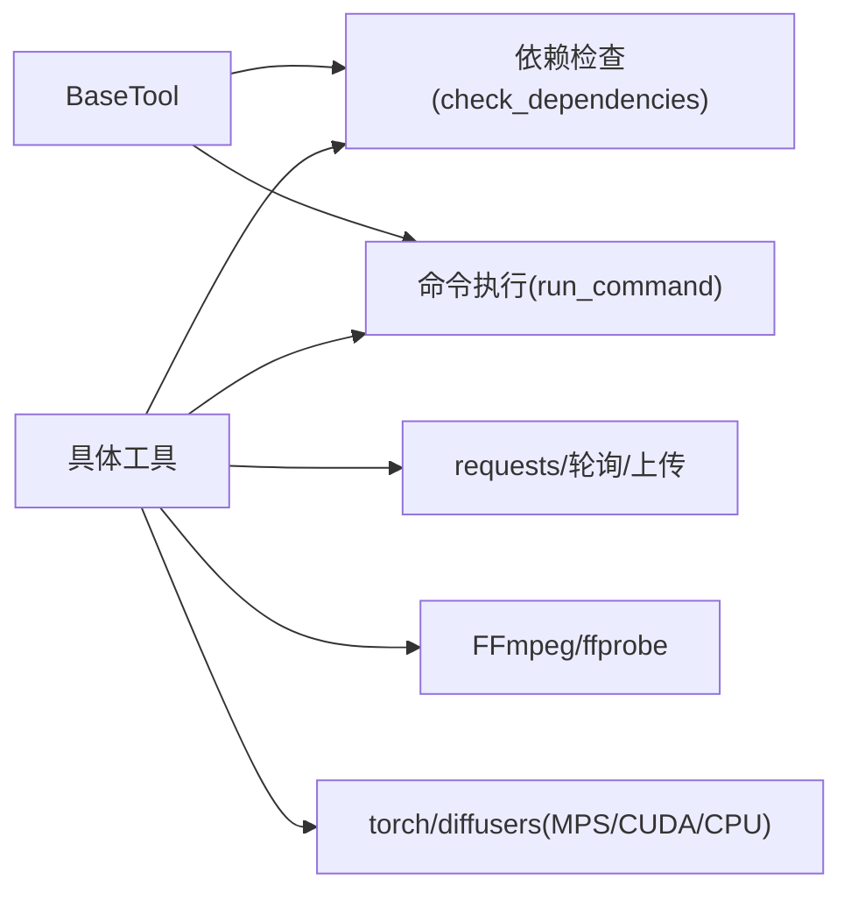

# 故障排除

<cite>
**本文引用的文件**
- [README.md](file://README.md)
- [docs/apple-silicon-mps.md](file://docs/apple-silicon-mps.md)
- [tools/video/_shared.py](file://tools/video/_shared.py)
- [lib/env_loader.py](file://lib/env_loader.py)
- [tools/base_tool.py](file://tools/base_tool.py)
- [tests/test_network_guard.py](file://tests/test_network_guard.py)
- [.agents/skills/bfl-api/references/error-handling.md](file://.agents/skills/bfl-api/references/error-handling.md)
- [.agents/skills/bfl-api/references/polling-patterns.md](file://.agents/skills/bfl-api/references/polling-patterns.md)
- [tests/tools/test_mps_device.py](file://tests/tools/test_mps_device.py)
</cite>

## 目录
1. [简介](#简介)
2. [项目结构](#项目结构)
3. [核心组件](#核心组件)
4. [架构总览](#架构总览)
5. [详细组件分析](#详细组件分析)
6. [依赖关系分析](#依赖关系分析)
7. [性能注意事项](#性能注意事项)
8. [故障排除指南](#故障排除指南)
9. [结论](#结论)
10. [附录](#附录)

## 简介
本指南面向OpenMontage的安装、运行与生产排障，覆盖常见安装问题（依赖冲突、权限、路径）、运行时错误诊断（日志、堆栈、性能瓶颈）、GPU/MPS环境（Apple Silicon）特殊配置、网络问题（连接失败、超时、重试）、内存/CPU异常排查、调试模式启用与技巧，以及社区支持渠道。目标是帮助用户快速定位并解决问题。

## 项目结构
OpenMontage采用“工具+流水线+技能”的分层组织：
- tools/：生产工具集合（视频、音频、图像、增强、分析等），统一通过BaseTool契约暴露能力、状态、成本估算与执行结果。
- lib/：基础设施（环境变量加载、检查点、事件、媒体审查等）。
- pipeline_defs/：YAML流水线清单，定义阶段、工具与质量门。
- skills/：Markdown技能文件，指导Agent如何正确使用工具与遵循质量规范。
- tests/：契约测试、集成测试与设备/网络防护测试。
- backlot/：本地看板，可视化流水线执行过程。

图表来源
- [tools/base_tool.py:227-372](file://tools/base_tool.py#L227-L372)
- [tools/video/_shared.py:249-372](file://tools/video/_shared.py#L249-L372)
- [lib/env_loader.py:15-34](file://lib/env_loader.py#L15-L34)

章节来源
- [README.md:450-475](file://README.md#L450-L475)

## 核心组件
- BaseTool与ToolResult：所有工具的抽象基类，统一返回成功/失败、数据、制品、错误、成本、耗时、模型与种子；提供依赖检查、命令执行封装、成本/时长估算、幂等键等。
- 环境变量加载：自动从项目根目录加载.env，并提供获取与必需变量校验。
- 设备选择与本地生成：get_torch_device()优先CUDA > MPS > CPU；load_diffusers_pipeline()按设备设置精度与offload策略；generate_local_video()封装本地扩散模型推理流程。
- 网络与轮询：poll_heygen()实现带超时与退避的异步任务轮询；upload_image_*系列封装上传与回退逻辑。
- 输出探测：probe_output()调用ffprobe提取视频元信息用于自检。

章节来源
- [tools/base_tool.py:110-139](file://tools/base_tool.py#L110-L139)
- [tools/base_tool.py:227-372](file://tools/base_tool.py#L227-L372)
- [tools/base_tool.py:411-454](file://tools/base_tool.py#L411-L454)
- [lib/env_loader.py:15-34](file://lib/env_loader.py#L15-L34)
- [tools/video/_shared.py:249-372](file://tools/video/_shared.py#L249-L372)
- [tools/video/_shared.py:485-514](file://tools/video/_shared.py#L485-L514)
- [tools/video/_shared.py:758-796](file://tools/video/_shared.py#L758-L796)

## 架构总览
下图展示一次典型本地视频生成的调用链与设备选择、资源使用与产物验证过程。

图表来源
- [tools/video/_shared.py:249-372](file://tools/video/_shared.py#L249-L372)
- [tools/video/_shared.py:399-482](file://tools/video/_shared.py#L399-L482)
- [tools/video/_shared.py:758-796](file://tools/video/_shared.py#L758-L796)
- [tools/base_tool.py:148-224](file://tools/base_tool.py#L148-L224)

## 详细组件分析

### 设备选择与本地生成（GPU/MPS/CPU）
- 设备优先级：CUDA > MPS > CPU；MPS在Apple Silicon上自动启用，无需额外构建。
- 精度策略：CUDA优先bfloat16（若支持），CPU强制float32，其他设备使用float16。
- Offload策略：仅在CUDA下启用enable_model_cpu_offload；MPS直接.to(device)。
- 已知限制：MPS不支持bfloat16；Real-ESRGAN在非CUDA设备上避免fp16以防NaN；大模型受限于统一内存容量。

图表来源
- [tools/video/_shared.py:249-372](file://tools/video/_shared.py#L249-L372)
- [docs/apple-silicon-mps.md:30-51](file://docs/apple-silicon-mps.md#L30-L51)

章节来源
- [tools/video/_shared.py:249-372](file://tools/video/_shared.py#L249-L372)
- [docs/apple-silicon-mps.md:1-64](file://docs/apple-silicon-mps.md#L1-L64)
- [tests/tools/test_mps_device.py:146-167](file://tests/tools/test_mps_device.py#L146-L167)

### 网络请求与轮询（超时、重试、限流）
- 轮询：poll_heygen()以固定间隔递增等待时间，直至完成/失败/超时。
- 上传：upload_image_fal/heygen封装分步上传与回退。
- 重试策略参考：基于HTTP状态码与错误码分类可重试/不可重试，指数退避+抖动。
- 最佳实践：始终设置超时；对429实施退避；下载URL及时保存；记录每次轮询尝试。

图表来源
- [tools/video/_shared.py:485-514](file://tools/video/_shared.py#L485-L514)
- [.agents/skills/bfl-api/references/polling-patterns.md:232-241](file://.agents/skills/bfl-api/references/polling-patterns.md#L232-L241)

章节来源
- [tools/video/_shared.py:485-514](file://tools/video/_shared.py#L485-L514)
- [.agents/skills/bfl-api/references/error-handling.md:148-197](file://.agents/skills/bfl-api/references/error-handling.md#L148-L197)
- [.agents/skills/bfl-api/references/polling-patterns.md:232-241](file://.agents/skills/bfl-api/references/polling-patterns.md#L232-L241)

### 环境变量与依赖解析
- .env加载：import时自动读取项目根目录.env，仅设置未存在的键，避免覆盖已有环境变量。
- 必需变量：require_env(key)在未设置时抛出EnvironmentError，便于早期失败。
- 工具依赖：dependencies声明cmd:/binary:/env:/python:前缀，check_dependencies()统一校验并给出安装指引。

章节来源
- [tools/base_tool.py:25-60](file://tools/base_tool.py#L25-L60)
- [lib/env_loader.py:15-34](file://lib/env_loader.py#L15-L34)
- [tools/base_tool.py:304-328](file://tools/base_tool.py#L304-L328)

### Backlot事件与执行追踪
- execute包装：每个工具execute被装饰为发射start/finish/error事件，附带耗时、成本、输出路径等，驱动看板实时状态。
- 非致命：事件层异常被吞掉，不影响主流程。

章节来源
- [tools/base_tool.py:148-224](file://tools/base_tool.py#L148-L224)

## 依赖关系分析
- 工具层依赖：BaseTool提供统一的依赖检查与命令执行封装；各工具通过dependencies声明外部二进制、环境变量、Python模块。
- 运行时依赖：FFmpeg/ffprobe用于编码与探测；diffusers/torch用于本地模型；requests用于网络。
- 平台差异：MPS在macOS上自动可用；CPU回退保证可用性但性能较低。

图表来源
- [tools/base_tool.py:304-328](file://tools/base_tool.py#L304-L328)
- [tools/base_tool.py:411-454](file://tools/base_tool.py#L411-L454)
- [tools/video/_shared.py:249-372](file://tools/video/_shared.py#L249-L372)

章节来源
- [tools/base_tool.py:304-328](file://tools/base_tool.py#L304-L328)
- [tools/video/_shared.py:249-372](file://tools/video/_shared.py#L249-L372)

## 性能注意事项
- 设备选择：优先CUDA，其次MPS，最后CPU；MPS上避免bfloat16，Real-ESRGAN在非CUDA设备使用fp32防NaN。
- 精度与显存：根据模型resource_profile.vram_mb选择合适的variant；必要时降低分辨率/帧数/步数。
- Offload：仅在CUDA下启用CPU offload；MPS直接放置到设备。
- I/O与编码：确保FFmpeg/ffprobe可用，提升导出与自检速度。
- 网络：合理设置超时与退避，避免雪崩；对429严格退避。

[本节为通用建议，不直接分析具体文件]

## 故障排除指南

### 安装与环境问题
- Python/Node/FFmpeg缺失
  - 现象：启动失败、命令找不到、渲染失败。
  - 处理：按README要求安装Python 3.10+、Node.js 18+、FFmpeg；确认PATH包含ffmpeg。
  - 参考：[README.md:180-216](file://README.md#L180-L216)
- 环境变量未加载或键名错误
  - 现象：工具报缺少API Key或必需变量。
  - 处理：确保存在.env且键名正确；BaseTool会在导入时加载.env；也可通过lib/env_loader加载。
  - 参考：[tools/base_tool.py:25-60](file://tools/base_tool.py#L25-L60)、[lib/env_loader.py:15-34](file://lib/env_loader.py#L15-L34)
- 依赖冲突或模块缺失
  - 现象：ImportError或二进制不存在。
  - 处理：依据工具dependencies提示安装对应Python包或系统命令；必要时隔离虚拟环境。
  - 参考：[tools/base_tool.py:304-328](file://tools/base_tool.py#L304-L328)

### 运行时错误与日志
- 工具执行失败
  - 现象：ToolResult.success=False，error字段包含原因。
  - 处理：查看error信息；结合Backlot事件与检查点定位阶段；必要时启用更高等级日志。
  - 参考：[tools/base_tool.py:128-139](file://tools/base_tool.py#L128-L139)、[tools/base_tool.py:148-224](file://tools/base_tool.py#L148-L224)
- 子进程命令失败
  - 现象：run_command抛出ToolCommandError，包含returncode、stderr/stdout。
  - 处理：检查命令是否存在、参数是否正确、工作目录是否有效；Windows下注意UTF-8解码。
  - 参考：[tools/base_tool.py:411-454](file://tools/base_tool.py#L411-L454)

### GPU与Apple Silicon (MPS)问题
- MPS未生效
  - 现象：get_torch_device()返回cpu。
  - 处理：确认macOS版本≥12.3、已安装torch、使用原生ARM Python（非Rosetta）；参考验证方法。
  - 参考：[docs/apple-silicon-mps.md:53-64](file://docs/apple-silicon-mps.md#L53-L64)
- VRAM不足或崩溃
  - 现象：OOM或NaN。
  - 处理：降低分辨率/帧数/步数；选择更小variant；避免在MPS上使用bfloat16；Real-ESRGAN在非CUDA设备使用fp32。
  - 参考：[docs/apple-silicon-mps.md:42-51](file://docs/apple-silicon-mps.md#L42-L51)、[tools/video/_shared.py:330-372](file://tools/video/_shared.py#L330-L372)
- Offload行为差异
  - 现象：MPS上未调用enable_model_cpu_offload。
  - 处理：这是预期行为，代码会回退到.pipeline.to(device)。
  - 参考：[tests/tools/test_mps_device.py:146-155](file://tests/tools/test_mps_device.py#L146-L155)

### 网络问题（连接失败、超时、重试）
- 连接失败/超时
  - 现象：requests报错或轮询超时。
  - 处理：检查代理/防火墙；为请求设置timeout；对长任务使用轮询并设置deadline。
  - 参考：[tools/video/_shared.py:485-514](file://tools/video/_shared.py#L485-L514)
- 限流(429)与服务器错误(5xx)
  - 现象：频繁429或5xx。
  - 处理：按状态码分类错误，指数退避+抖动重试；尊重Retry-After头。
  - 参考：[.agents/skills/bfl-api/references/error-handling.md:148-197](file://.agents/skills/bfl-api/references/error-handling.md#L148-L197)
- 安全网保护
  - 现象：测试中禁止访问外部API，防止误消费。
  - 处理：如需真实网络，需显式允许；默认阻断出站连接。
  - 参考：[tests/test_network_guard.py:16-33](file://tests/test_network_guard.py#L16-L33)

### 内存与CPU使用异常
- 内存泄漏/占用过高
  - 现象：长时间运行后内存持续增长。
  - 处理：减少并发；降低分辨率/帧数；关闭不必要的缓存；监控进程内存；必要时重启服务。
- CPU占用过高
  - 现象：CPU飙升导致卡顿。
  - 处理：切换到GPU/MPS；调整并行度；优化I/O（如批量写入）；检查是否有阻塞循环。
- 性能分析
  - 建议：使用系统工具（如Activity Monitor/htop）观察CPU/内存；结合Backlot事件统计耗时；对关键路径添加计时。

[本节为通用建议，不直接分析具体文件]

### 调试模式与技巧
- 启用更高日志级别
  - 建议：在应用入口或工具调用处配置logging.basicConfig(level=logging.DEBUG)，以便捕获详细请求/响应与错误上下文。
  - 参考：[.agents/skills/bfl-api/references/error-handling.md:266-290](file://.agents/skills/bfl-api/references/error-handling.md#L266-L290)
- 利用Backlot事件
  - 建议：关注events.jsonl中的start/finish/error条目，定位失败阶段与耗时。
  - 参考：[tools/base_tool.py:148-224](file://tools/base_tool.py#L148-L224)
- 最小化复现
  - 建议：使用单工具dry_run与最小inputs复现问题；逐步增加复杂度。
  - 参考：[tools/base_tool.py:399-407](file://tools/base_tool.py#L399-L407)

### 常见问题速查
- “命令未找到”
  - 处理：安装对应二进制并确保PATH；参考工具install_instructions。
  - 参考：[tools/base_tool.py:304-328](file://tools/base_tool.py#L304-L328)
- “缺少环境变量”
  - 处理：在.env中添加所需键；或使用require_env提前失败以便发现。
  - 参考：[lib/env_loader.py:24-34](file://lib/env_loader.py#L24-L34)
- “MPS未启用”
  - 处理：检查macOS版本、torch安装、原生ARM Python。
  - 参考：[docs/apple-silicon-mps.md:53-64](file://docs/apple-silicon-mps.md#L53-L64)
- “网络请求被阻止”
  - 处理：确认是否在测试环境中被网闸拦截；生产环境检查代理/防火墙。
  - 参考：[tests/test_network_guard.py:16-33](file://tests/test_network_guard.py#L16-L33)

## 结论
通过统一工具契约、设备自动选择、严格的依赖与环境管理、完善的网络轮询与重试策略，以及Backlot事件追踪，OpenMontage提供了强大的可观测性与可恢复性。遇到问题时，优先检查环境与依赖、设备选择与精度、网络超时与重试、以及日志与事件，通常能快速定位并解决。

## 附录
- 社区与支持
  - GitHub Discussions：提问、分享与反馈。
  - README中的社区链接与联系方式。
  - 参考：[README.md:726-743](file://README.md#L726-L743)