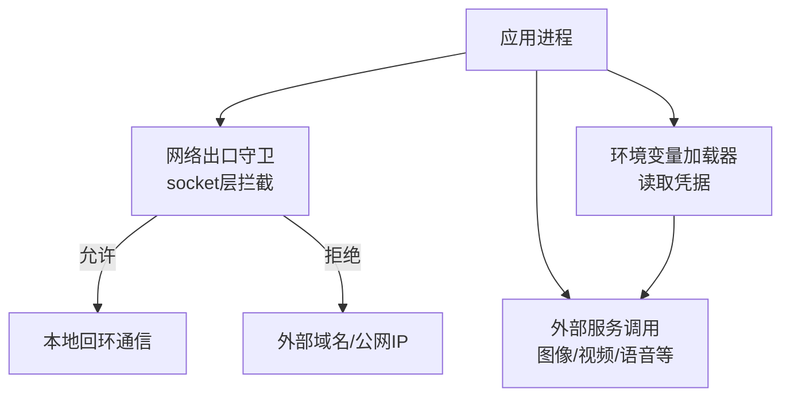
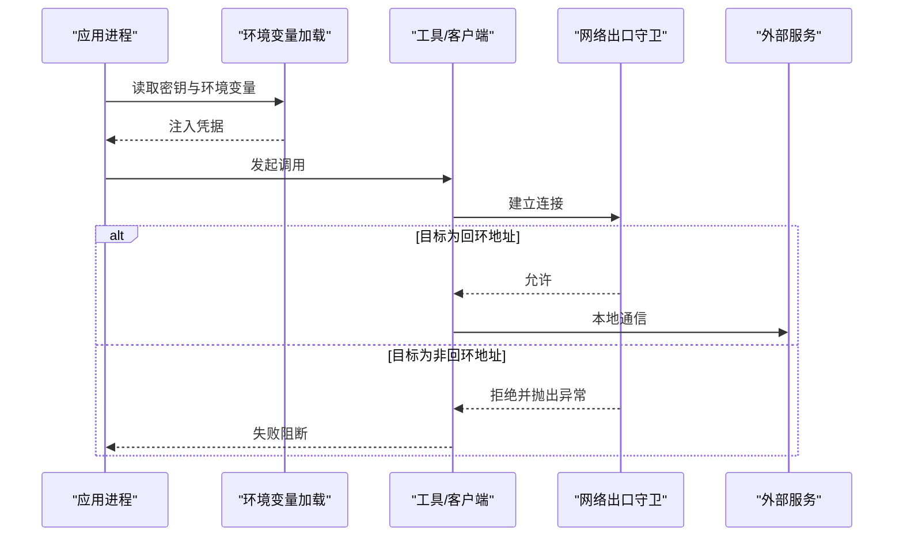
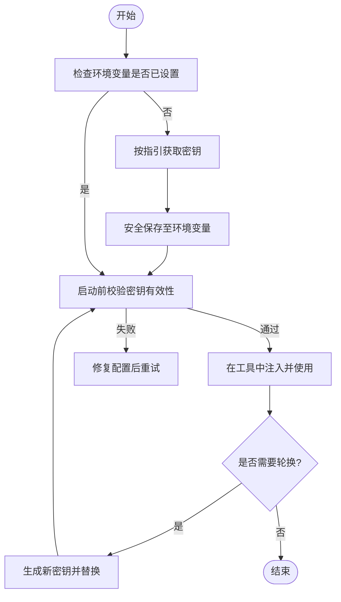
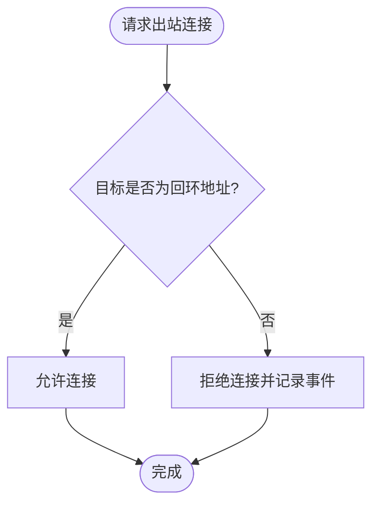
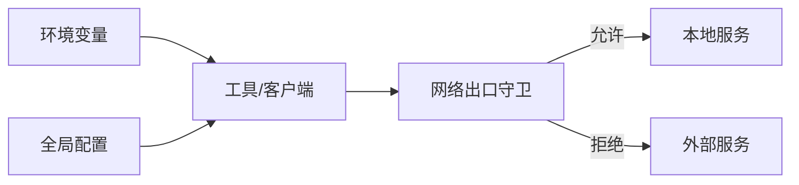

# 安全配置

<cite>
**本文引用的文件**
- [config.yaml](file://config.yaml)
- [tests/conftest.py](file://tests/conftest.py)
- [tests/test_network_guard.py](file://tests/test_network_guard.py)
- [tests/contracts/test_env_example.py](file://tests/contracts/test_env_example.py)
- [.agents/skills/bfl-api/references/api-key-setup.md](file://.agents/skills/bfl-api/references/api-key-setup.md)
- [.agents/skills/speech-to-text/references/installation.md](file://.agents/skills/speech-to-text/references/installation.md)
- [.agents/skills/agents/references/agent-configuration.md](file://.agents/skills/agents/references/agent-configuration.md)
- [tools/graphics/math_animate.py](file://tools/graphics/math_animate.py)
</cite>

## 目录
1. [简介](#简介)
2. [项目结构](#项目结构)
3. [核心组件](#核心组件)
4. [架构总览](#架构总览)
5. [详细组件分析](#详细组件分析)
6. [依赖关系分析](#依赖关系分析)
7. [性能与安全权衡](#性能与安全权衡)
8. [故障排查指南](#故障排查指南)
9. [结论](#结论)
10. [附录](#附录)

## 简介
本文件聚焦于OpenMontage的安全配置与最佳实践，覆盖API密钥管理、安全存储、环境变量注入、访问控制、出站网络限制、SSL/TLS与证书管理、OAuth与企业SSO集成思路，以及常见威胁的防护策略。文档基于仓库中现有实现与约定进行说明，并提供可操作的流程与检查清单，帮助在开发与生产环境中落地安全基线。

## 项目结构
从安全视角看，本项目将“密钥与凭据”“网络出口控制”“配置与示例模板”三类能力分散在不同位置：
- 配置与示例：全局配置与示例环境文件用于声明所需变量与默认值。
- 网络出口控制：测试会话层对非回环地址的网络连接进行拦截，防止误用真实付费接口。
- 密钥与认证：各技能/工具通过环境变量读取第三方服务凭据；提供获取与校验指引。
- 代码级安全提示：部分模块包含安全边界说明（如沙箱限制）。

图表来源
- [tests/conftest.py:81-111](file://tests/conftest.py#L81-L111)
- [tests/test_network_guard.py:16-32](file://tests/test_network_guard.py#L16-L32)

章节来源
- [config.yaml:1-34](file://config.yaml#L1-L34)
- [tests/conftest.py:1-132](file://tests/conftest.py#L1-L132)
- [tests/test_network_guard.py:1-32](file://tests/test_network_guard.py#L1-L32)

## 核心组件
- 环境变量与密钥管理
  - 通过环境变量注入第三方服务密钥（如BFL、ElevenLabs、Google/Gemini、DashScope等），避免硬编码。
  - 提供获取密钥的步骤与快速校验方法，确保密钥有效后再发起调用。
- 网络出口守卫
  - 在测试会话中拦截所有非回环的网络连接，防止测试意外产生费用或泄露数据。
  - 支持通过环境变量显式开启“真实网络”模式，仅用于受控场景。
- 配置与示例
  - 全局配置文件集中管理非敏感参数；示例环境文件用于引导开发者配置必要变量。
- 安全边界提示
  - 代码中包含对“非沙箱”行为的明确提示，提醒使用者注意执行边界。

章节来源
- [.agents/skills/bfl-api/references/api-key-setup.md:1-56](file://.agents/skills/bfl-api/references/api-key-setup.md#L1-L56)
- [.agents/skills/speech-to-text/references/installation.md:79-93](file://.agents/skills/speech-to-text/references/installation.md#L79-L93)
- [tests/conftest.py:1-132](file://tests/conftest.py#L1-L132)
- [tests/test_network_guard.py:1-32](file://tests/test_network_guard.py#L1-L32)
- [config.yaml:1-34](file://config.yaml#L1-L34)
- [tools/graphics/math_animate.py:38-38](file://tools/graphics/math_animate.py#L38-L38)

## 架构总览
下图展示了运行时关键安全路径：应用进程通过环境变量加载凭据，经由工具层调用外部服务；测试会话在网络层拦截非回环连接，保障测试安全。

图表来源
- [tests/conftest.py:81-111](file://tests/conftest.py#L81-L111)
- [tests/test_network_guard.py:16-32](file://tests/test_network_guard.py#L16-L32)

## 详细组件分析

### API密钥管理与安全存储
- 环境变量注入
  - 各工具与服务通过环境变量读取密钥，例如BFL、ElevenLabs、Google/Gemini、DashScope等。
  - 建议在部署时由平台或编排系统注入，避免写入版本库。
- 密钥获取与校验
  - 提供获取密钥的官方入口与步骤。
  - 启动前进行快速校验，确保密钥存在且格式正确，减少无效调用。
- 示例与模板
  - 使用示例环境文件作为变量清单，保持未设置状态，避免误提交凭证。
- 轮换策略建议
  - 定期轮换密钥；采用短期令牌+长期主密钥的分层设计。
  - 在CI/CD中自动刷新短期令牌，保留最小权限范围。
- 访问权限控制
  - 按服务最小权限原则分配密钥；不同环境（开发/预发/生产）隔离密钥。
  - 结合组织级权限模型，限制密钥可见性与使用范围。

图表来源
- [.agents/skills/bfl-api/references/api-key-setup.md:10-56](file://.agents/skills/bfl-api/references/api-key-setup.md#L10-L56)
- [.agents/skills/speech-to-text/references/installation.md:79-93](file://.agents/skills/speech-to-text/references/installation.md#L79-L93)
- [tests/contracts/test_env_example.py:9-19](file://tests/contracts/test_env_example.py#L9-L19)

章节来源
- [.agents/skills/bfl-api/references/api-key-setup.md:1-56](file://.agents/skills/bfl-api/references/api-key-setup.md#L1-L56)
- [.agents/skills/speech-to-text/references/installation.md:79-93](file://.agents/skills/speech-to-text/references/installation.md#L79-L93)
- [tests/contracts/test_env_example.py:1-19](file://tests/contracts/test_env_example.py#L1-L19)

### 出站网络限制与端口白名单
- 测试会话级网络守卫
  - 在pytest会话中拦截socket.connect/connect_ex/create_connection，阻止非回环地址连接。
  - 允许回环地址（localhost、127.x、::1等）以支持本地服务与工具链。
  - 可通过环境变量显式启用“真实网络”模式，仅用于受控测试。
- 生产环境出站限制建议
  - 在主机/容器/云防火墙层面限制出站到特定域名与端口，遵循最小暴露原则。
  - 使用DNS白名单与代理网关，统一出口流量并审计日志。
  - 对供应商域名进行分组管理，按功能域划分出站策略。

图表来源
- [tests/conftest.py:49-68](file://tests/conftest.py#L49-L68)
- [tests/conftest.py:81-111](file://tests/conftest.py#L81-L111)
- [tests/test_network_guard.py:16-32](file://tests/test_network_guard.py#L16-L32)

章节来源
- [tests/conftest.py:1-132](file://tests/conftest.py#L1-L132)
- [tests/test_network_guard.py:1-32](file://tests/test_network_guard.py#L1-L32)

### SSL/TLS配置与证书管理
- 传输加密
  - 对外部服务调用强制使用HTTPS，禁用不安全的TLS版本与弱密码套件。
  - 在企业环境中，配置企业CA根证书以验证内部服务证书。
- 证书安装与验证
  - 将企业CA证书安装到系统信任库或容器镜像中，确保应用进程能正确验证证书链。
  - 在CI中增加证书链校验用例，防止过期或错误证书被引入。
- 自签名证书
  - 仅在隔离环境使用，并通过内网DNS与证书固定（pinning）降低风险。
- 监控与告警
  - 对证书到期时间进行监控，提前告警以便轮换。
  - 记录TLS握手失败与证书验证失败的指标。

[本节为通用安全实践说明，不直接分析具体文件]

### OAuth认证与企业SSO集成
- 工作区环境变量与动态解析
  - 支持在工作区配置中使用占位符引用系统环境变量，便于多部署环境复用同一配置。
  - 在工具头或认证连接中通过键名解析对应密钥或OAuth连接，实现运行时注入。
- 企业SSO集成建议
  - 使用企业身份提供商（如SAML/OIDC）作为统一认证源，应用侧仅持有最小权限令牌。
  - 在网关/代理层集中处理登录、授权与单点登出，后端服务无状态化。
  - 对回调URL、重定向域名与JWT签发者进行严格校验。

章节来源
- [.agents/skills/agents/references/agent-configuration.md:170-193](file://.agents/skills/agents/references/agent-configuration.md#L170-L193)

### 网络安全最佳实践与威胁防护
- 输入校验与输出编码
  - 对所有外部输入进行严格校验，防止注入与越权。
  - 对外部响应进行清洗与白名单过滤。
- 最小权限与零信任
  - 按服务粒度分配密钥与访问权限，遵循最小权限原则。
  - 服务间通信使用mTLS与短生命周期令牌。
- 审计与可观测性
  - 记录密钥使用、网络访问与认证失败的审计日志。
  - 对异常行为进行实时告警与自动化阻断。
- 常见威胁防护
  - 防重放攻击：使用一次性令牌与时间戳。
  - 防暴力破解：限流与账户锁定策略。
  - 防信息泄露：屏蔽敏感信息输出与堆栈细节。

[本节为通用安全实践说明，不直接分析具体文件]

## 依赖关系分析
- 环境变量依赖
  - 工具与服务依赖环境变量注入密钥；若缺失则无法调用。
- 网络守卫依赖
  - 测试会话依赖socket层拦截，确保不会误连外部服务。
- 配置依赖
  - 全局配置集中非敏感参数；示例环境文件提供变量清单。

图表来源
- [tests/conftest.py:81-111](file://tests/conftest.py#L81-L111)
- [config.yaml:1-34](file://config.yaml#L1-L34)

章节来源
- [tests/conftest.py:1-132](file://tests/conftest.py#L1-L132)
- [config.yaml:1-34](file://config.yaml#L1-L34)

## 性能与安全权衡
- 网络守卫开销
  - socket层拦截带来极小开销，但显著提升测试安全性与成本可控性。
- 密钥校验
  - 启动前校验会增加冷启动时间，但能有效避免无效调用与资源浪费。
- TLS握手
  - 启用强加密与证书验证会带来额外延迟，但保障传输安全；建议使用连接池与缓存会话。

[本节为通用性能讨论，不直接分析具体文件]

## 故障排查指南
- 测试阶段网络被阻断
  - 现象：测试中尝试连接外部域名时报错。
  - 原因：会话级网络守卫阻止非回环连接。
  - 解决：确认是否误连外部服务；如需真实网络，设置环境变量显式开启并标记测试用例。
- 环境变量未设置导致调用失败
  - 现象：工具初始化时报缺少密钥。
  - 原因：环境变量未注入或未生效。
  - 解决：按指引获取并设置密钥；在启动前进行校验。
- 示例环境文件误含凭证
  - 现象：示例文件中出现注释形式的“伪凭证”。
  - 原因：示例文件被修改导致注释内容被当作值。
  - 解决：恢复示例文件为干净状态，确保未设置任何键值。

章节来源
- [tests/conftest.py:49-78](file://tests/conftest.py#L49-L78)
- [tests/test_network_guard.py:16-32](file://tests/test_network_guard.py#L16-L32)
- [.agents/skills/bfl-api/references/api-key-setup.md:10-56](file://.agents/skills/bfl-api/references/api-key-setup.md#L10-L56)
- [tests/contracts/test_env_example.py:9-19](file://tests/contracts/test_env_example.py#L9-L19)

## 结论
OpenMontage在安全方面提供了清晰的环境变量注入机制、严格的测试期网络出口守卫以及完善的密钥获取与校验指引。结合企业级的TLS与证书管理、OAuth/SSO集成策略，可在开发与生产环境中构建稳健的安全基线。建议在生产部署中进一步强化出站白名单、密钥轮换与审计告警，持续演进安全能力。

## 附录
- 常用环境变量参考
  - 第三方服务密钥：按服务命名规范注入（如BFL_API_KEY、ELEVENLABS_API_KEY等）。
  - 网络开关：OPENMONTAGE_ALLOW_NETWORK用于测试阶段显式允许真实网络。
- 配置清单
  - 全局配置：非敏感参数集中管理。
  - 示例环境文件：变量清单与说明，保持未设置状态。

章节来源
- [.agents/skills/bfl-api/references/api-key-setup.md:1-56](file://.agents/skills/bfl-api/references/api-key-setup.md#L1-L56)
- [.agents/skills/speech-to-text/references/installation.md:79-93](file://.agents/skills/speech-to-text/references/installation.md#L79-L93)
- [tests/conftest.py:36-38](file://tests/conftest.py#L36-L38)
- [config.yaml:1-34](file://config.yaml#L1-L34)