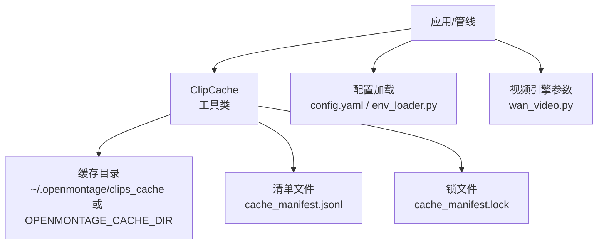
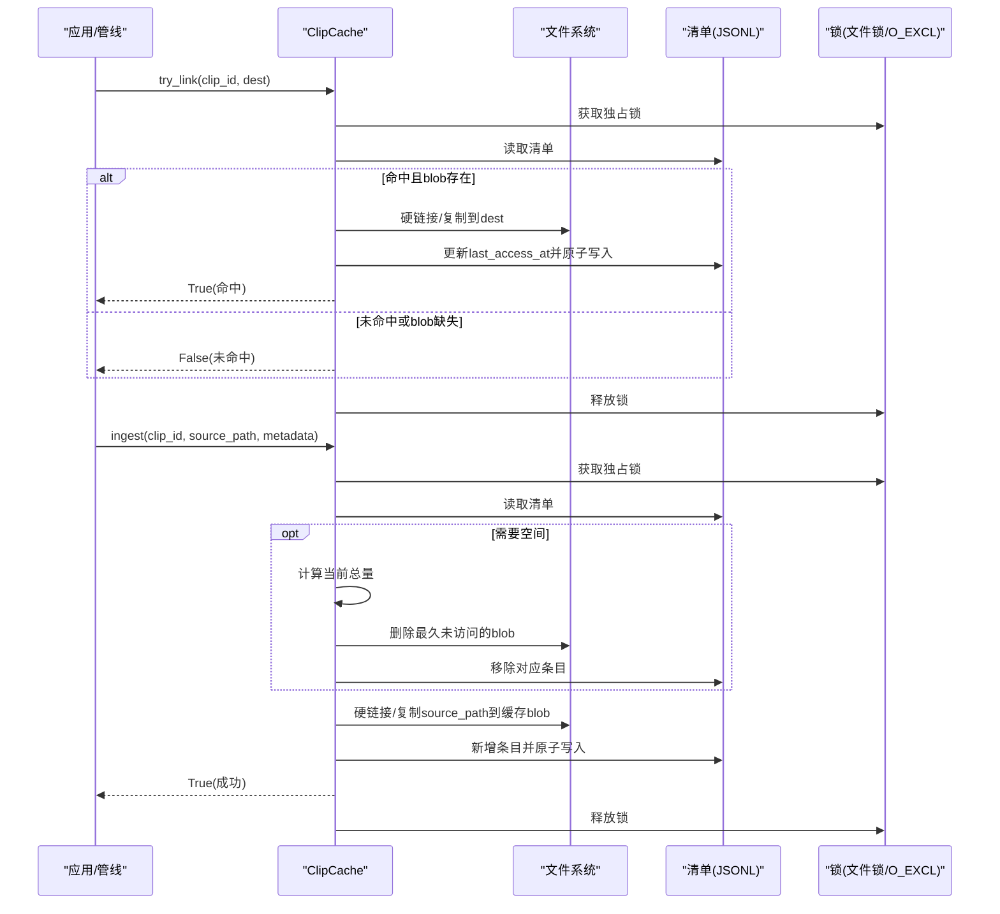
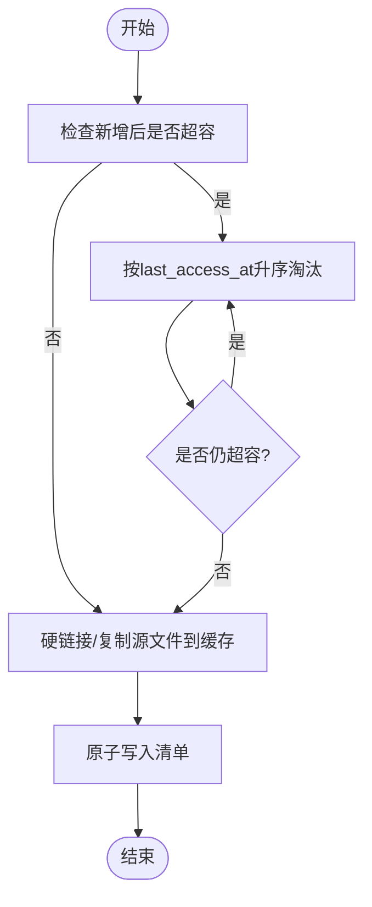
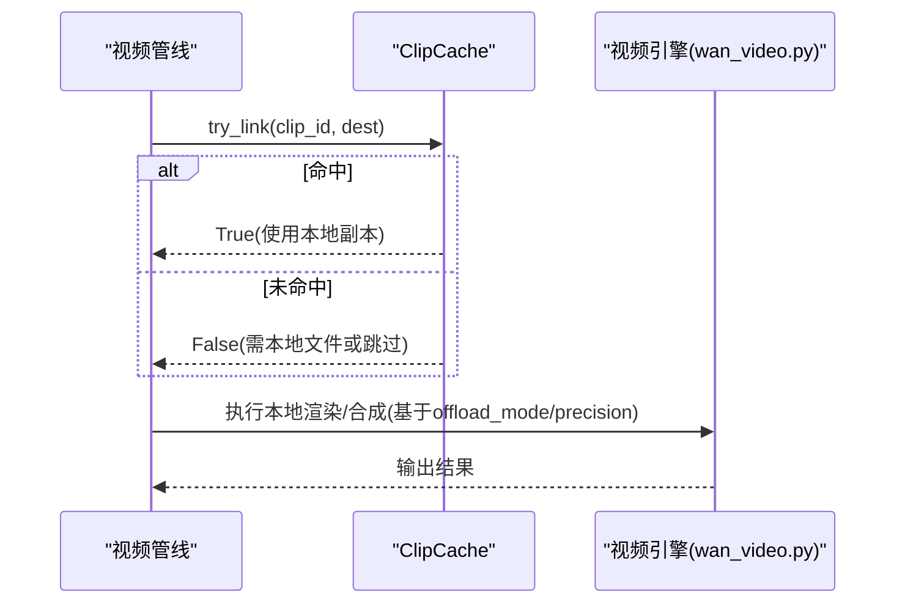
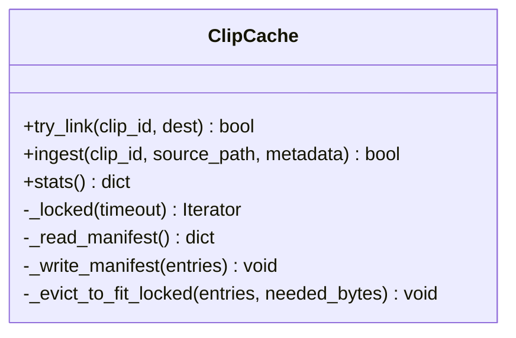
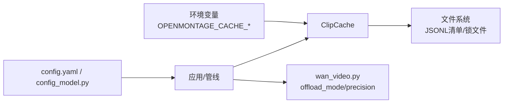

# 离线模式与缓存

<cite>
**本文引用的文件**
- [tools/video/clip_cache.py](file://tools/video/clip_cache.py)
- [tests/tools/test_clip_cache.py](file://tests/tools/test_clip_cache.py)
- [lib/env_loader.py](file://lib/env_loader.py)
- [config.yaml](file://config.yaml)
- [lib/config_model.py](file://lib/config_model.py)
- [tools/video/wan_video.py](file://tools/video/wan_video.py)
</cite>

## 目录
1. [简介](#简介)
2. [项目结构](#项目结构)
3. [核心组件](#核心组件)
4. [架构总览](#架构总览)
5. [详细组件分析](#详细组件分析)
6. [依赖关系分析](#依赖关系分析)
7. [性能考量](#性能考量)
8. [故障排查指南](#故障排查指南)
9. [结论](#结论)
10. [附录](#附录)

## 简介
本文件聚焦于 OpenMontage 的“离线模式与缓存”能力，重点说明：
- 如何配置和使用离线模式（本地资源管理、缓存策略、数据同步）
- 视频片段缓存系统的工作原理（缓存目录结构、过期策略、存储空间管理）
- 断网环境下的工作流程配置（网络不可用时仍可进行本地视频处理）
- 缓存数据的清理与维护（手动清理、自动清理策略、存储空间监控）
- 离线模式的限制与注意事项

该能力通过进程安全的 LRU 缓存实现，将已下载的媒体片段以硬链接或复制方式保存在本地，避免重复下载与冗余拷贝；在容量超限时按最近最少使用策略自动淘汰。

## 项目结构
与离线模式和缓存相关的代码主要位于以下位置：
- 缓存核心实现：tools/video/clip_cache.py
- 环境变量加载：lib/env_loader.py
- 全局配置模型与默认值：config.yaml、lib/config_model.py
- 视频生成管线中的参数解析（含设备卸载与精度选择）：tools/video/wan_video.py
- 缓存行为测试与环境变量覆盖验证：tests/tools/test_clip_cache.py

图表来源
- [tools/video/clip_cache.py:92-119](file://tools/video/clip_cache.py#L92-L119)
- [lib/env_loader.py:15-26](file://lib/env_loader.py#L15-L26)
- [config.yaml:1-34](file://config.yaml#L1-L34)
- [tools/video/wan_video.py:196-215](file://tools/video/wan_video.py#L196-L215)

章节来源
- [tools/video/clip_cache.py:1-59](file://tools/video/clip_cache.py#L1-L59)
- [lib/env_loader.py:1-35](file://lib/env_loader.py#L1-L35)
- [config.yaml:1-34](file://config.yaml#L1-L34)
- [lib/config_model.py:1-93](file://lib/config_model.py#L1-L93)
- [tools/video/wan_video.py:196-215](file://tools/video/wan_video.py#L196-L215)

## 核心组件
- ClipCache：进程安全、LRU 淘汰的视频片段字节缓存，提供 try_link（命中时链接到目标路径）、ingest（将新下载的文件纳入缓存）、stats（统计信息）等接口。
- 配置与环境：通过环境变量 OPENMONTAGE_CACHE_DIR 和 OPENMONTAGE_CACHE_MAX_GB 控制缓存目录与最大容量；默认目录为 ~/.openmontage/clips_cache，默认上限为 20 GB。
- 清单与锁：清单采用 JSONL 格式，原子写入；所有写操作通过文件锁保护，支持 filelock 或回退方案。
- 存储策略：优先硬链接同盘文件，跨盘/跨文件系统回退到复制；最小可入库文件大小阈值用于过滤空/损坏文件。
- 淘汰策略：当新增条目导致总量超过上限时，按 last_access_at 升序淘汰最久未访问条目，直到满足容量要求。

章节来源
- [tools/video/clip_cache.py:127-170](file://tools/video/clip_cache.py#L127-L170)
- [tools/video/clip_cache.py:177-209](file://tools/video/clip_cache.py#L177-L209)
- [tools/video/clip_cache.py:214-256](file://tools/video/clip_cache.py#L214-L256)
- [tools/video/clip_cache.py:261-312](file://tools/video/clip_cache.py#L261-L312)
- [tools/video/clip_cache.py:318-443](file://tools/video/clip_cache.py#L318-L443)
- [tools/video/clip_cache.py:478-516](file://tools/video/clip_cache.py#L478-L516)
- [tools/video/clip_cache.py:523-544](file://tools/video/clip_cache.py#L523-L544)

## 架构总览
下图展示了从管线调用到缓存落盘的完整流程，包括命中/未命中、入缓存、容量超限时的淘汰以及统计上报。

图表来源
- [tools/video/clip_cache.py:318-443](file://tools/video/clip_cache.py#L318-L443)
- [tools/video/clip_cache.py:478-516](file://tools/video/clip_cache.py#L478-L516)
- [tools/video/clip_cache.py:261-312](file://tools/video/clip_cache.py#L261-L312)
- [tools/video/clip_cache.py:214-256](file://tools/video/clip_cache.py#L214-L256)

## 详细组件分析

### 缓存目录结构与清单
- 缓存目录：默认 ~/.openmontage/clips_cache，可通过 OPENMONTAGE_CACHE_DIR 覆盖。
- 清单文件：cache_manifest.jsonl，每行一个条目，包含 clip_id、file_name、size_bytes、added_at、last_access_at 及来源元数据（source/source_id/source_url/license/creator/source_tags）。
- 锁文件：cache_manifest.lock，用于并发安全。

章节来源
- [tools/video/clip_cache.py:92-119](file://tools/video/clip_cache.py#L92-L119)
- [tools/video/clip_cache.py:127-170](file://tools/video/clip_cache.py#L127-L170)
- [tools/video/clip_cache.py:184-200](file://tools/video/clip_cache.py#L184-L200)

### 缓存策略与过期机制
- 命中策略：try_link 若命中则硬链接/复制至目标路径，并更新 last_access_at。
- 入缓存：ingest 将新下载文件纳入缓存，若 clip_id 已存在则仅更新时间戳。
- 容量管理：当新增条目会导致总量超过 max_total_bytes 时，按 last_access_at 升序淘汰最久未访问条目，直至满足容量。
- 最小可用大小：小于阈值的文件不会入缓存，避免无效占用。

图表来源
- [tools/video/clip_cache.py:367-443](file://tools/video/clip_cache.py#L367-L443)
- [tools/video/clip_cache.py:478-516](file://tools/video/clip_cache.py#L478-L516)

章节来源
- [tools/video/clip_cache.py:318-443](file://tools/video/clip_cache.py#L318-L443)
- [tools/video/clip_cache.py:478-516](file://tools/video/clip_cache.py#L478-L516)

### 并发与一致性
- 锁机制：优先使用 filelock.FileLock，不可用时回退到 O_EXCL 创建文件的轮询锁，超时时间默认 60 秒。
- 原子写入：清单写入先写到临时文件，再 os.replace 原子替换，确保崩溃不破坏清单。
- 漂移处理：若清单条目存在但 blob 丢失，视为未命中并清理条目。

章节来源
- [tools/video/clip_cache.py:214-256](file://tools/video/clip_cache.py#L214-L256)
- [tools/video/clip_cache.py:261-312](file://tools/video/clip_cache.py#L261-L312)
- [tools/video/clip_cache.py:318-365](file://tools/video/clip_cache.py#L318-L365)

### 配置与环境变量
- 缓存目录：OPENMONTAGE_CACHE_DIR 指定自定义路径；未设置时默认 ~/.openmontage/clips_cache。
- 容量上限：OPENMONTAGE_CACHE_MAX_GB 指定 GB 数；非法值会回退到默认 20 GB。
- 环境变量加载：通过 lib/env_loader.py 统一加载 .env 文件并提供 get_env/require_env 方法。
- 全局配置：config.yaml 定义输出、路径等；lib/config_model.py 提供类型化加载与路径解析。

章节来源
- [tools/video/clip_cache.py:92-119](file://tools/video/clip_cache.py#L92-L119)
- [tests/tools/test_clip_cache.py:58-76](file://tests/tools/test_clip_cache.py#L58-L76)
- [lib/env_loader.py:15-35](file://lib/env_loader.py#L15-L35)
- [config.yaml:1-34](file://config.yaml#L1-L34)
- [lib/config_model.py:74-93](file://lib/config_model.py#L74-L93)

### 断网环境下的工作流配置
- 本地优先：在无法联网时，管线应优先尝试从缓存中链接已有片段（try_link），若命中则直接复用，无需网络请求。
- 本地素材：将本地已有的视频片段通过 ingest 加入缓存，后续步骤可直接复用。
- 设备与精度：在 wan_video.py 中根据输入与模型元数据解析 offload_mode 与 precision，可在无网络环境下基于本地资源进行推理与渲染。

图表来源
- [tools/video/clip_cache.py:318-365](file://tools/video/clip_cache.py#L318-L365)
- [tools/video/wan_video.py:196-215](file://tools/video/wan_video.py#L196-L215)

章节来源
- [tools/video/clip_cache.py:318-365](file://tools/video/clip_cache.py#L318-L365)
- [tools/video/wan_video.py:196-215](file://tools/video/wan_video.py#L196-L215)

### 缓存清理与维护
- 自动清理：ingest 触发容量检查，必要时按 LRU 淘汰最久未访问条目。
- 手动清理：可直接删除缓存目录或清单文件；下次使用时会自动重建。
- 监控指标：stats() 返回 entry_count、total_bytes、usage_fraction、hits_this_session、misses_this_session、evictions_this_session、bytes_evicted_this_session 等，便于评估使用情况。

图表来源
- [tools/video/clip_cache.py:177-209](file://tools/video/clip_cache.py#L177-L209)
- [tools/video/clip_cache.py:318-443](file://tools/video/clip_cache.py#L318-L443)
- [tools/video/clip_cache.py:478-516](file://tools/video/clip_cache.py#L478-L516)

章节来源
- [tools/video/clip_cache.py:445-472](file://tools/video/clip_cache.py#L445-L472)
- [tools/video/clip_cache.py:478-516](file://tools/video/clip_cache.py#L478-L516)

## 依赖关系分析
- 外部库：filelock（可选，用于更健壮的跨平台文件锁），不可用时回退到 O_EXCL 轮询锁。
- 标准库：json、os、shutil、tempfile、time、pathlib 等。
- 配置层：config.yaml 与 lib/config_model.py 提供运行时配置；lib/env_loader.py 提供 .env 加载与环境变量访问。
- 视频引擎：wan_video.py 在管线中解析 offload_mode 与 precision，配合缓存实现离线渲染。

图表来源
- [tools/video/clip_cache.py:92-119](file://tools/video/clip_cache.py#L92-L119)
- [lib/config_model.py:74-93](file://lib/config_model.py#L74-L93)
- [tools/video/wan_video.py:196-215](file://tools/video/wan_video.py#L196-L215)

章节来源
- [tools/video/clip_cache.py:72-84](file://tools/video/clip_cache.py#L72-L84)
- [lib/config_model.py:1-93](file://lib/config_model.py#L1-L93)
- [tools/video/wan_video.py:196-215](file://tools/video/wan_video.py#L196-L215)

## 性能考量
- 硬链接优先：同盘硬链接零额外磁盘开销且瞬时完成；跨盘自动回退复制。
- 原子写入：清单写入采用临时文件+原子替换，降低并发竞争与崩溃风险。
- LRU 淘汰：按 last_access_at 排序淘汰，减少热点数据被误删的概率。
- 最小可用大小：过滤过小文件，避免无效占用与频繁失败。
- 锁超时：默认 60 秒，避免长时间阻塞；可根据场景调整。

[本节为通用指导，不直接分析具体文件]

## 故障排查指南
- 缓存未命中：检查 clip_id 是否正确；确认 try_link 前是否已 ingest；查看 stats 的 misses_this_session。
- 容量不足：增大 OPENMONTAGE_CACHE_MAX_GB 或定期清理；关注 usage_fraction 与 evictions_this_session。
- 锁冲突：若出现 TimeoutError，检查是否有其他进程持有锁；必要时终止异常进程或等待超时。
- 清单损坏：清单解析错误会被忽略，建议备份并重建清单；可删除清单让系统重新生成。
- 文件权限：确保缓存目录可读写；Windows 下可能因文件占用导致 unlink 失败，稍后重试或重启进程。

章节来源
- [tools/video/clip_cache.py:214-256](file://tools/video/clip_cache.py#L214-L256)
- [tools/video/clip_cache.py:261-312](file://tools/video/clip_cache.py#L261-L312)
- [tools/video/clip_cache.py:445-472](file://tools/video/clip_cache.py#L445-L472)

## 结论
OpenMontage 的离线模式与缓存通过 ClipCache 实现了进程安全、LRU 淘汰、原子写入与并发保护的本地片段缓存。结合环境变量与全局配置，用户可灵活定制缓存目录与容量上限；在断网环境下，通过 try_link 与本地素材 ingesting，可保证视频处理流程继续运行。建议在生产环境中启用 stats 监控、合理设置容量上限，并定期维护清单与缓存目录，以获得稳定高效的离线处理能力。

[本节为总结性内容，不直接分析具体文件]

## 附录
- 常用环境变量
  - OPENMONTAGE_CACHE_DIR：缓存目录路径
  - OPENMONTAGE_CACHE_MAX_GB：缓存最大容量（GB）
- 关键路径
  - 缓存目录：~/.openmontage/clips_cache（默认）
  - 清单文件：cache_manifest.jsonl
  - 锁文件：cache_manifest.lock
- 参考实现
  - 缓存核心：tools/video/clip_cache.py
  - 配置加载：lib/env_loader.py、config.yaml、lib/config_model.py
  - 视频引擎参数：tools/video/wan_video.py
  - 行为测试：tests/tools/test_clip_cache.py

章节来源
- [tools/video/clip_cache.py:92-119](file://tools/video/clip_cache.py#L92-L119)
- [lib/env_loader.py:15-35](file://lib/env_loader.py#L15-L35)
- [config.yaml:1-34](file://config.yaml#L1-L34)
- [lib/config_model.py:74-93](file://lib/config_model.py#L74-L93)
- [tools/video/wan_video.py:196-215](file://tools/video/wan_video.py#L196-L215)
- [tests/tools/test_clip_cache.py:58-76](file://tests/tools/test_clip_cache.py#L58-L76)