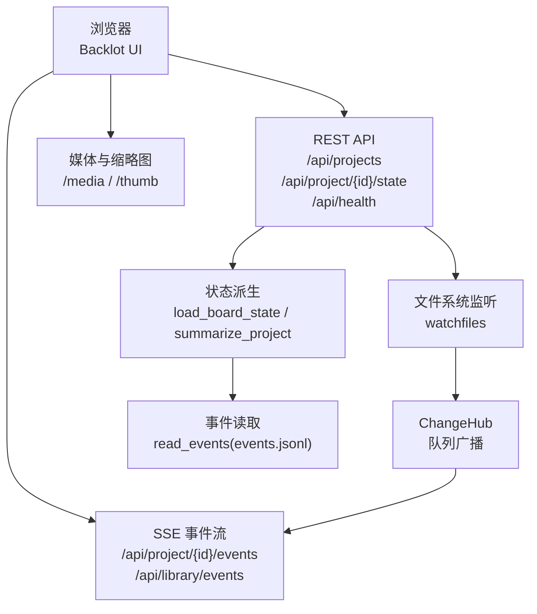
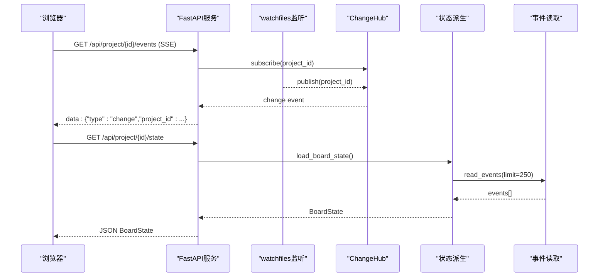
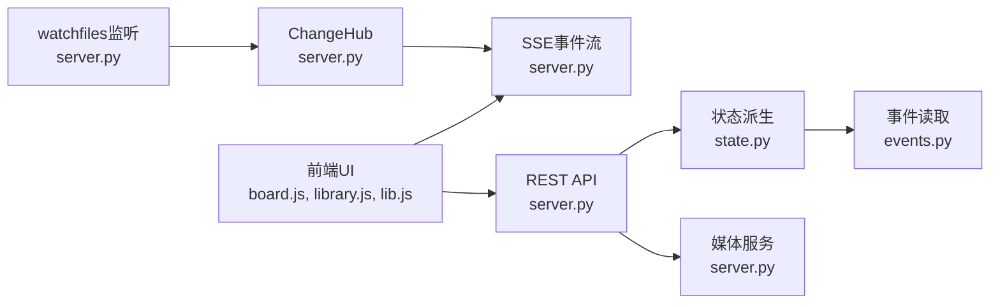

# 网络监控与分析

<cite>
**本文引用的文件**
- [server.py](file://backlot/server.py)
- [state.py](file://backlot/state.py)
- [events.py](file://lib/events.py)
- [board.js](file://backlot/ui/board.js)
- [library.js](file://backlot/ui/library.js)
- [lib.js](file://backlot/ui/lib.js)
- [__init__.py](file://backlot/__init__.py)
- [README.md](file://backlot/README.md)
- [test_network_guard.py](file://tests/test_network_guard.py)
</cite>

## 目录
1. [简介](#简介)
2. [项目结构](#项目结构)
3. [核心组件](#核心组件)
4. [架构总览](#架构总览)
5. [详细组件分析](#详细组件分析)
6. [依赖关系分析](#依赖关系分析)
7. [性能考量](#性能考量)
8. [故障排查指南](#故障排查指南)
9. [结论](#结论)
10. [附录](#附录)

## 简介
本文件面向OpenMontage的“网络监控与分析”主题，聚焦于Backlot本地看板与事件流如何实现对生产管线运行状态的实时观测。内容涵盖：
- 如何启用和配置网络请求监控（SSE事件流、健康检查、资源访问）
- 请求跟踪、响应时间统计、错误率等指标的收集方式与扩展点
- Backlot界面中的网络状态显示与实时监控使用方法
- 网络性能分析工具与技术（带宽、延迟、吞吐优化建议）
- 告警与通知机制的设置思路（基于SSE心跳、停滞检测、错误标记）
- 日志分析与故障定位的最佳实践

## 项目结构
Backlot由后端FastAPI服务、前端UI与事件系统组成：
- 后端提供REST API、SSE事件流、静态资源与媒体访问
- 前端通过SSE订阅变更并拉取最新看板状态
- 事件系统以追加式JSONL记录工具调用活动，供看板展示“生成中/完成/失败”等状态

图表来源
- [server.py:165-242](file://backlot/server.py#L165-L242)
- [state.py:588-658](file://backlot/state.py#L588-L658)
- [events.py:77-118](file://lib/events.py#L77-L118)

章节来源
- [server.py:1-369](file://backlot/server.py#L1-L369)
- [state.py:1-716](file://backlot/state.py#L1-L716)
- [events.py:1-119](file://lib/events.py#L1-L119)
- [README.md:1-43](file://backlot/README.md#L1-L43)

## 核心组件
- 健康检查接口：用于存活探测与基础可用性验证
- SSE事件流：按项目或全库范围推送变更与心跳，支持超时保活
- 状态派生：从磁盘读取checkpoint、artifacts、events等，构建可渲染的BoardState
- 事件写入与读取：追加式events.jsonl，线程安全写入，容错读取
- 前端订阅与渲染：连接SSE、处理hello/heartbeat/change消息，刷新看板

章节来源
- [server.py:170-242](file://backlot/server.py#L170-L242)
- [state.py:588-658](file://backlot/state.py#L588-L658)
- [events.py:77-118](file://lib/events.py#L77-L118)
- [board.js:1-200](file://backlot/ui/board.js#L1-L200)
- [library.js:1-41](file://backlot/ui/library.js#L1-L41)
- [lib.js:1-45](file://backlot/ui/lib.js#L1-L45)

## 架构总览
Backlot采用“只读观察”的设计：服务端不修改项目目录，仅监听变化并通过SSE通知前端；前端在收到change后拉取最新状态。事件系统为追加式日志，保证高并发下的稳定性与可回放性。

图表来源
- [server.py:183-242](file://backlot/server.py#L183-L242)
- [state.py:588-658](file://backlot/state.py#L588-L658)
- [events.py:98-118](file://lib/events.py#L98-L118)

## 详细组件分析

### 后端API与SSE事件流
- 健康检查：返回应用标识与可用性
- 项目列表：聚合每个项目的摘要信息（缓存+失效策略）
- 项目状态：加载完整BoardState，包含阶段轨、故事板、媒体、成本等
- SSE事件流：
  - 项目级：/api/project/{id}/events，发送hello、heartbeat、change
  - 全库级：/api/library/events，广播所有项目变更
  - 心跳间隔：固定秒数，避免长连接空闲被代理丢弃
  - 去抖合并：队列满时丢弃多余通知，确保关键变更可达
- 媒体与缩略图：路径校验、范围请求、视频帧提取与缓存

章节来源
- [server.py:170-242](file://backlot/server.py#L170-L242)
- [server.py:244-277](file://backlot/server.py#L244-L277)
- [server.py:321-365](file://backlot/server.py#L321-L365)

### 状态派生与停滞检测
- 阶段轨：从manifest与checkpoint推导，支持未声明阶段的回退排序
- 故事板：scene_plan × script × asset_manifest + events，计算“生成中”场景
- 媒体扫描：renders、snapshots、music等自动发现
- 停滞检测：当某阶段in_progress且超过阈值无活动，标记stalled并提示
- 成本汇总：优先checkpoint cost_snapshot，否则回退到manifest总计

章节来源
- [state.py:118-224](file://backlot/state.py#L118-L224)
- [state.py:403-495](file://backlot/state.py#L403-L495)
- [state.py:502-562](file://backlot/state.py#L502-L562)
- [state.py:565-658](file://backlot/state.py#L565-L658)

### 事件系统与活动追踪
- 写入：append-only JSONL，线程锁保护单进程并发，容忍跨进程竞争
- 读取：逐行解析，跳过损坏行，限制最近N条
- 项目归属：根据输入参数推断项目根目录，避免误写
- 用途：驱动“生成中/完成/失败”状态、活动指示器、回放功能

章节来源
- [events.py:1-119](file://lib/events.py#L1-L119)

### 前端订阅与实时监控
- SSE订阅：连接成功后接收hello，周期性heartbeat保持连接，change触发刷新
- 状态刷新：收到change后调用getJSON获取最新BoardState并渲染
- 状态显示：头部显示LIVE/IDLE/AWAITING YOU/STALLED?，阶段轨颜色与提示
- 媒体播放：缩略图与媒体URL拼接，懒加载与缓存控制

章节来源
- [lib.js:1-45](file://backlot/ui/lib.js#L1-L45)
- [board.js:1-200](file://backlot/ui/board.js#L1-L200)
- [library.js:1-41](file://backlot/ui/library.js#L1-L41)

### 网络请求监控与指标收集
- 请求跟踪：
  - 使用SSE hello/heartbeat/change作为连接生命周期信号
  - 通过GET /api/project/{id}/state的响应时间与大小估算数据量
- 响应时间统计：
  - 前端可在fetch前后打点，计算TTFB与下载耗时
  - 服务端可通过中间件记录请求耗时（可扩展）
- 错误率监控：
  - 捕获HTTP非200响应，统计重试与失败比例
  - 结合SSE断连重连逻辑，统计连接成功率
- 带宽使用监控：
  - 统计每次拉取的响应体大小，累计带宽消耗
  - 缩略图与媒体Range请求可降低重复传输

章节来源
- [lib.js:1-45](file://backlot/ui/lib.js#L1-L45)
- [server.py:170-242](file://backlot/server.py#L170-L242)
- [server.py:244-277](file://backlot/server.py#L244-L277)

### Backlot界面中的网络状态显示与实时监控
- 头部状态：
  - LIVE：当前有活动或进行中
  - IDLE：最近无活动，显示最后活动时间
  - AWAITING YOU：等待人工审批
  - STALLED?：长时间无活动，可能卡住
- 阶段轨：
  - 不同状态对应不同图标与颜色
  - 悬停提示显示详细信息（如部分进度、错误摘要）
- 成本与预算：
  - 显示已花费与剩余预算，进度条警示

章节来源
- [board.js:50-104](file://backlot/ui/board.js#L50-L104)
- [board.js:110-153](file://backlot/ui/board.js#L110-L153)
- [state.py:630-658](file://backlot/state.py#L630-L658)

### 网络性能分析工具与技术
- 延迟分析：
  - 前端测量SSE首包时间、状态接口TTFB
  - 服务端可记录各端点耗时（可扩展）
- 吞吐量优化：
  - 使用缩略图与Range请求减少带宽
  - SSE合并批量变更，降低频繁刷新
- 缓存策略：
  - UI资源no-cache强制条件请求，媒体正常缓存
  - 缩略图磁盘缓存，避免重复转码

章节来源
- [server.py:299-305](file://backlot/server.py#L299-L305)
- [server.py:325-365](file://backlot/server.py#L325-L365)
- [state.py:502-562](file://backlot/state.py#L502-L562)

### 告警与通知机制
- 基于SSE心跳：
  - 若连续多个心跳无响应，视为连接异常
  - 前端可提示“连接中断，正在重连”
- 停滞告警：
  - 服务端标记stalled阶段，前端显示警告
  - 可结合外部通知（邮件/IM）实现升级告警
- 错误率告警：
  - 统计接口失败率，超过阈值触发告警
  - 结合日志分析定位根因

章节来源
- [server.py:183-242](file://backlot/server.py#L183-L242)
- [state.py:630-658](file://backlot/state.py#L630-L658)
- [board.js:50-104](file://backlot/ui/board.js#L50-L104)

### 日志分析与故障定位最佳实践
- 事件日志：
  - 查看events.jsonl了解工具调用序列与时间戳
  - 过滤error事件定位失败环节
- 状态快照：
  - 检查checkpoint_*.json确认阶段状态与错误信息
- 网络诊断：
  - 使用浏览器开发者工具观察SSE连接与请求
  - 检查服务器日志（可扩展）与错误响应

章节来源
- [events.py:77-118](file://lib/events.py#L77-L118)
- [state.py:118-224](file://backlot/state.py#L118-L224)
- [server.py:170-242](file://backlot/server.py#L170-L242)

## 依赖关系分析
Backlot各模块之间的依赖关系如下：

图表来源
- [server.py:165-242](file://backlot/server.py#L165-L242)
- [state.py:588-658](file://backlot/state.py#L588-L658)
- [events.py:77-118](file://lib/events.py#L77-L118)
- [board.js:1-200](file://backlot/ui/board.js#L1-L200)
- [library.js:1-41](file://backlot/ui/library.js#L1-L41)
- [lib.js:1-45](file://backlot/ui/lib.js#L1-L45)

章节来源
- [server.py:1-369](file://backlot/server.py#L1-L369)
- [state.py:1-716](file://backlot/state.py#L1-L716)
- [events.py:1-119](file://lib/events.py#L1-L119)

## 性能考量
- 文件系统监听：
  - 使用watchfiles递归监听，忽略噪声目录
  - 变更去抖与队列限流，避免风暴
- 状态派生：
  - 摘要缓存与失效策略，减少重复计算
  - 事件读取限制最近N条，控制内存占用
- 媒体处理：
  - 缩略图缓存与异步生成，避免阻塞
  - Range请求支持大文件分段传输
- 前端优化：
  - 懒加载与条件渲染，减少DOM操作
  - SSE合并变更，降低刷新频率

章节来源
- [server.py:111-149](file://backlot/server.py#L111-L149)
- [server.py:76-108](file://backlot/server.py#L76-L108)
- [state.py:502-562](file://backlot/state.py#L502-L562)
- [board.js:1-200](file://backlot/ui/board.js#L1-L200)

## 故障排查指南
- SSE连接问题：
  - 检查浏览器控制台SSE连接状态
  - 确认心跳间隔与代理配置
- 状态不更新：
  - 验证events.jsonl是否写入成功
  - 检查checkpoint文件是否存在且有效
- 媒体无法加载：
  - 确认路径权限与相对路径解析
  - 检查缩略图生成是否成功
- 网络阻断测试：
  - 使用测试用例验证出站连接是否被阻止
  - 确保本地回环地址通信正常

章节来源
- [server.py:183-242](file://backlot/server.py#L183-L242)
- [events.py:77-118](file://lib/events.py#L77-L118)
- [server.py:244-277](file://backlot/server.py#L244-L277)
- [test_network_guard.py:16-77](file://tests/test_network_guard.py#L16-L77)

## 结论
Backlot通过SSE事件流与追加式事件日志，实现了轻量、可靠的生产管线实时监控。其设计遵循“只读观察”原则，确保高可用性与可维护性。结合停滞检测、成本展示与媒体优化，提供了完整的网络监控与分析能力。未来可扩展服务端指标采集、外部告警集成与更精细的前端性能埋点。

## 附录
- 启动命令：
  - python -m backlot open <project-id>
  - python -m backlot serve --port 4750
- 默认端口：4750

章节来源
- [README.md:8-12](file://backlot/README.md#L8-L12)
- [__init__.py:14-16](file://backlot/__init__.py#L14-L16)