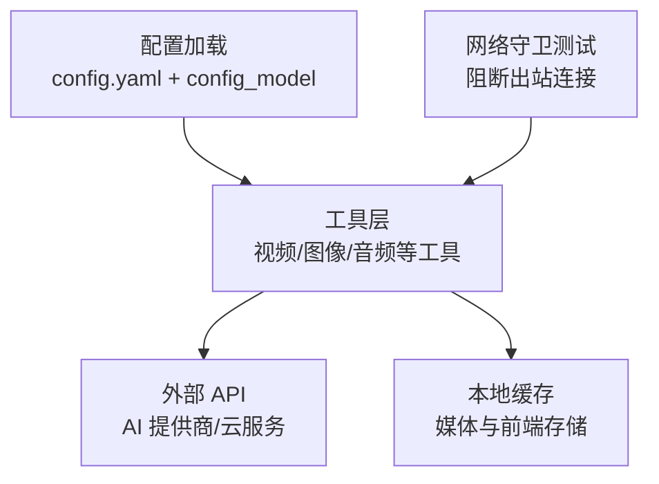
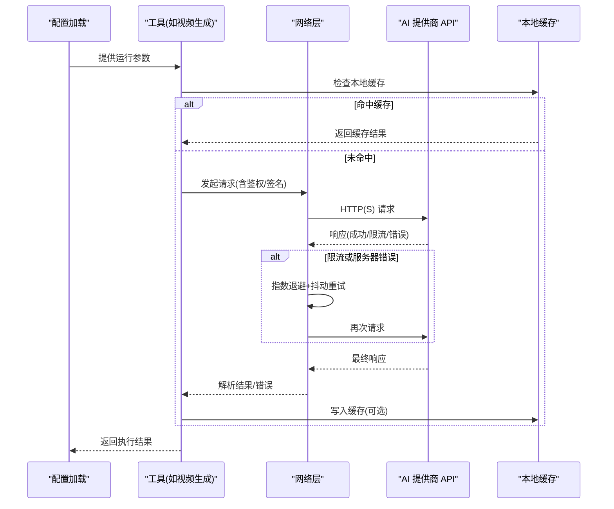
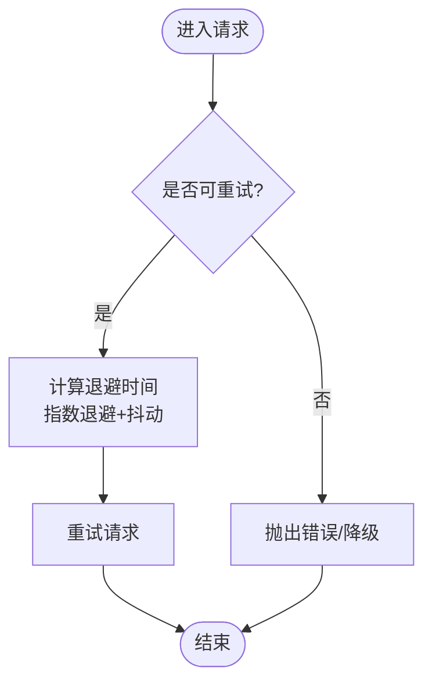
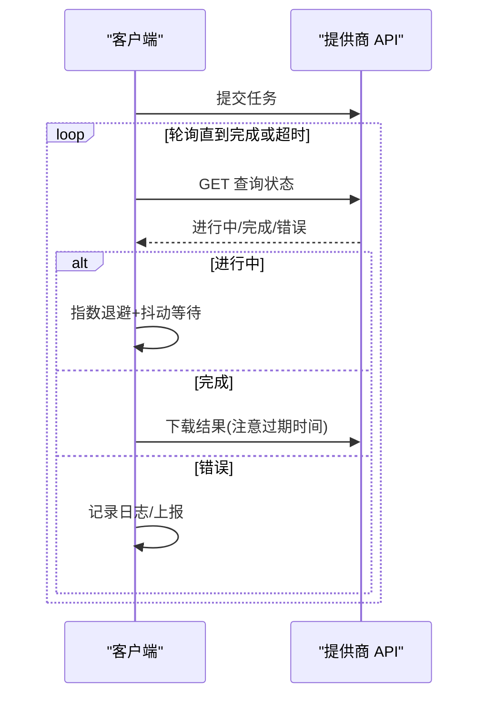
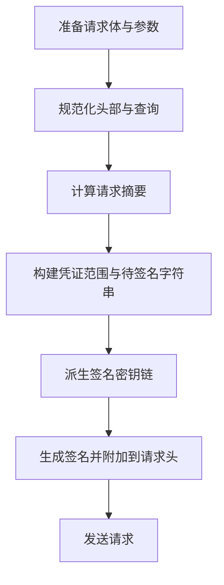
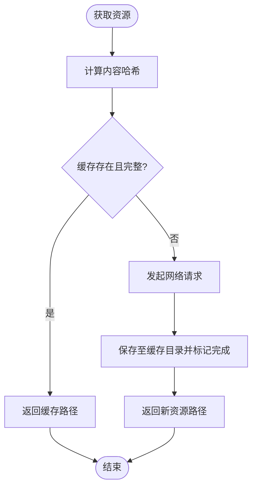
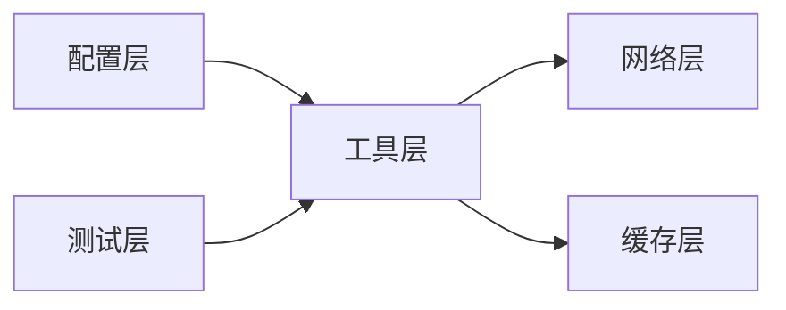

# 网络问题

<cite>
**本文引用的文件**
- [config.yaml](file://config.yaml)
- [lib/config_model.py](file://lib/config_model.py)
- [tests/test_network_guard.py](file://tests/test_network_guard.py)
- [tools/_kling/errors.py](file://tools/_kling/errors.py)
- [tools/video/jimeng_video.py](file://tools/video/jimeng_video.py)
- [.agents/skills/bfl-api/references/polling-patterns.md](file://.agents/skills/bfl-api/references/polling-patterns.md)
- [.agents/skills/bfl-api/references/rate-limiting.md](file://.agents/skills/bfl-api/references/rate-limiting.md)
- [.agents/skills/bfl-api/references/code-examples/python-client.py](file://.agents/skills/bfl-api/references/code-examples/python-client.py)
- [.agents/skills/media-use/scripts/lib/cache.mjs](file://.agents/skills/media-use/scripts/lib/cache.mjs)
- [.agents/skills/vercel-react-best-practices/rules/js-cache-storage.md](file://.agents/skills/vercel-react-best-practices/rules/js-cache-storage.md)
- [.agents/skills/speech-to-text/references/installation.md](file://.agents/skills/speech-to-text/references/installation.md)
- [.agents/skills/agents/references/agent-configuration.md](file://.agents/skills/agents/references/agent-configuration.md)
</cite>

## 目录
1. [简介](#简介)
2. [项目结构](#项目结构)
3. [核心组件](#核心组件)
4. [架构总览](#架构总览)
5. [详细组件分析](#详细组件分析)
6. [依赖关系分析](#依赖关系分析)
7. [性能考量](#性能考量)
8. [故障排查指南](#故障排查指南)
9. [结论](#结论)
10. [附录](#附录)

## 简介
本文件聚焦于 OpenMontage 在网络通信方面的诊断与解决方案，覆盖 API 连接失败、超时处理、重试机制、代理与防火墙、SSL 证书配置、请求监控与延迟分析、带宽优化、不同 AI 提供商的网络与安全要求（API 密钥、访问控制、错误码）、以及离线模式与本地缓存策略。内容基于仓库中的实际代码与参考文档进行归纳与可视化说明，便于快速定位问题并落地改进。

## 项目结构
OpenMontage 将运行时配置集中管理，并通过工具层调用各类 AI 提供商的 API。网络相关的关键位置包括：
- 全局配置加载与模型定义：用于统一读取配置与环境变量
- 网络守卫测试：确保在测试环境中阻断对外部付费 API 的访问，避免误消费
- 各工具对第三方 API 的签名、鉴权、重试与错误处理实现
- 轮询与限流最佳实践参考文档
- 媒体与前端缓存策略，降低重复网络 I/O

**图表来源**
- [lib/config_model.py:65-85](file://lib/config_model.py#L65-L85)
- [tests/test_network_guard.py:16-44](file://tests/test_network_guard.py#L16-L44)
- [.agents/skills/media-use/scripts/lib/cache.mjs:56-73](file://.agents/skills/media-use/scripts/lib/cache.mjs#L56-L73)

**章节来源**
- [config.yaml:1-34](file://config.yaml#L1-L34)
- [lib/config_model.py:65-85](file://lib/config_model.py#L65-L85)
- [tests/test_network_guard.py:16-44](file://tests/test_network_guard.py#L16-L44)

## 核心组件
- 配置模型与加载：提供统一的配置入口，支持从 YAML 与环境变量合并，供上层工具使用
- 网络守卫：在测试中强制阻断对外部网络的出站连接，防止误用真实凭据产生费用
- 错误与重试：针对特定提供商的错误分类与可重试判定，结合指数退避与抖动策略
- 轮询与超时：异步任务提交后轮询结果，严格设置超时与下载时效
- 缓存策略：媒体资源与前端存储的内存/磁盘缓存，减少重复网络请求

**章节来源**
- [lib/config_model.py:65-85](file://lib/config_model.py#L65-L85)
- [tests/test_network_guard.py:16-44](file://tests/test_network_guard.py#L16-L44)
- [tools/_kling/errors.py:9-47](file://tools/_kling/errors.py#L9-L47)
- [.agents/skills/bfl-api/references/polling-patterns.md:232-241](file://.agents/skills/bfl-api/references/polling-patterns.md#L232-L241)
- [.agents/skills/media-use/scripts/lib/cache.mjs:56-73](file://.agents/skills/media-use/scripts/lib/cache.mjs#L56-L73)

## 架构总览
下图展示了从配置加载到工具调用外部 API 的整体流程，包含错误分类、重试、轮询与缓存路径。

**图表来源**
- [lib/config_model.py:65-85](file://lib/config_model.py#L65-L85)
- [tools/_kling/errors.py:30-47](file://tools/_kling/errors.py#L30-L47)
- [.agents/skills/bfl-api/references/polling-patterns.md:232-241](file://.agents/skills/bfl-api/references/polling-patterns.md#L232-L241)
- [.agents/skills/media-use/scripts/lib/cache.mjs:56-73](file://.agents/skills/media-use/scripts/lib/cache.mjs#L56-L73)

## 详细组件分析

### 配置与网络环境
- 配置加载：通过配置模型从 YAML 与环境变量合并，提供类型安全的访问接口
- 预算与审批：可配置观察/警告/封顶模式，限制单次操作审批阈值，降低意外开销
- 路径与输出：统一管理 pipeline、library、styles、output 等目录，便于缓存与产物管理

建议：
- 将敏感信息（如 API Key）放入环境变量，不在代码中硬编码
- 使用配置模型集中读取，避免分散的环境变量访问

**章节来源**
- [lib/config_model.py:65-85](file://lib/config_model.py#L65-L85)
- [config.yaml:1-34](file://config.yaml#L1-L34)

### 网络守卫与离线模式
- 网络守卫测试验证：在测试环境下阻断对外部域名的出站连接，确保不会误触发付费调用
- 本地回环允许：仅允许 127.0.0.1 的本地服务通信，保证测试与本地调试不受影响
- 离线模式建议：在生产中可通过网关/代理策略限制出站域名，或在应用层根据开关禁用外部请求

**章节来源**
- [tests/test_network_guard.py:16-44](file://tests/test_network_guard.py#L16-L44)

### 错误分类与重试机制
- 错误类型：为特定提供商定义结构化错误，包含消息、错误码、请求 ID、HTTP 状态码
- 可重试判定：依据错误码与 HTTP 状态码判断是否可重试
- 指数退避与抖动：在限流或服务器错误时采用指数退避，加入随机抖动避免雪崩

**图表来源**
- [tools/_kling/errors.py:30-47](file://tools/_kling/errors.py#L30-L47)
- [.agents/skills/bfl-api/references/rate-limiting.md:67-88](file://.agents/skills/bfl-api/references/rate-limiting.md#L67-L88)

**章节来源**
- [tools/_kling/errors.py:9-47](file://tools/_kling/errors.py#L9-L47)
- [.agents/skills/bfl-api/references/rate-limiting.md:67-88](file://.agents/skills/bfl-api/references/rate-limiting.md#L67-L88)

### 轮询与超时处理
- 轮询最佳实践：始终设置超时；使用指数退避与抖动；处理所有状态值；及时下载临时 URL；记录轮询尝试；尊重速率限制
- 客户端示例：提交任务后轮询结果，遇到限流按 Retry-After 等待，超时则抛出异常

**图表来源**
- [.agents/skills/bfl-api/references/polling-patterns.md:232-241](file://.agents/skills/bfl-api/references/polling-patterns.md#L232-L241)
- [.agents/skills/bfl-api/references/code-examples/python-client.py:328-349](file://.agents/skills/bfl-api/references/code-examples/python-client.py#L328-L349)

**章节来源**
- [.agents/skills/bfl-api/references/polling-patterns.md:232-241](file://.agents/skills/bfl-api/references/polling-patterns.md#L232-L241)
- [.agents/skills/bfl-api/references/code-examples/python-client.py:328-349](file://.agents/skills/bfl-api/references/code-examples/python-client.py#L328-L349)

### 鉴权与签名
- 签名流程：构造规范请求头与查询参数，计算摘要，生成签名串与签名密钥链，附加至请求头
- 安全要点：Host、日期、Content-Type、Body 摘要等关键头参与签名；签名顺序与大小写需严格一致

**图表来源**
- [tools/video/jimeng_video.py:333-367](file://tools/video/jimeng_video.py#L333-L367)

**章节来源**
- [tools/video/jimeng_video.py:333-367](file://tools/video/jimeng_video.py#L333-L367)

### 缓存策略与离线模式
- 媒体缓存：以内容哈希为键，持久化到全局媒体目录，标记完成并记录缓存路径，后续可直接复用
- 前端缓存：对 localStorage/sessionStorage/cookie 的频繁读写进行内存级缓存，并在外部变更时失效
- 离线模式：当网络不可用时，优先返回本地缓存；若无缓存则提示用户或降级到本地能力

**图表来源**
- [.agents/skills/media-use/scripts/lib/cache.mjs:56-73](file://.agents/skills/media-use/scripts/lib/cache.mjs#L56-L73)
- [.agents/skills/vercel-react-best-practices/rules/js-cache-storage.md:1-71](file://.agents/skills/vercel-react-best-practices/rules/js-cache-storage.md#L1-L71)

**章节来源**
- [.agents/skills/media-use/scripts/lib/cache.mjs:56-73](file://.agents/skills/media-use/scripts/lib/cache.mjs#L56-L73)
- [.agents/skills/vercel-react-best-practices/rules/js-cache-storage.md:1-71](file://.agents/skills/vercel-react-best-practices/rules/js-cache-storage.md#L1-L71)

### 不同 AI 提供商的网络要求与安全配置
- API 密钥管理：通过环境变量注入密钥，避免在代码中暴露；部分提供商支持单例令牌或短期令牌
- 访问控制：后端生成一次性令牌，前端不直接持有密钥；使用认证中间件保护令牌端点
- 错误码处理：针对不同提供商的错误码进行分类，区分可重试与不可重试场景

**章节来源**
- [.agents/skills/speech-to-text/references/installation.md:79-93](file://.agents/skills/speech-to-text/references/installation.md#L79-L93)
- [.agents/skills/agents/references/agent-configuration.md:170-193](file://.agents/skills/agents/references/agent-configuration.md#L170-L193)
- [tools/_kling/errors.py:9-47](file://tools/_kling/errors.py#L9-L47)

## 依赖关系分析
- 配置层依赖 YAML 与环境变量，为工具层提供统一参数
- 工具层依赖网络库与提供商 SDK，封装鉴权、重试、轮询与错误处理
- 缓存层依赖文件系统与内存结构，减少重复网络 I/O
- 测试层依赖网络守卫，确保在无网络或受限网络下行为正确

**图表来源**
- [lib/config_model.py:65-85](file://lib/config_model.py#L65-L85)
- [tests/test_network_guard.py:16-44](file://tests/test_network_guard.py#L16-L44)
- [.agents/skills/media-use/scripts/lib/cache.mjs:56-73](file://.agents/skills/media-use/scripts/lib/cache.mjs#L56-L73)

**章节来源**
- [lib/config_model.py:65-85](file://lib/config_model.py#L65-L85)
- [tests/test_network_guard.py:16-44](file://tests/test_network_guard.py#L16-L44)
- [.agents/skills/media-use/scripts/lib/cache.mjs:56-73](file://.agents/skills/media-use/scripts/lib/cache.mjs#L56-L73)

## 性能考量
- 超时与重试：为所有外部请求设置合理超时；对可重试错误采用指数退避与抖动，避免雪崩
- 轮询效率：限制最大轮询次数与间隔；及时下载临时 URL，避免过期浪费
- 缓存命中：优先使用本地缓存；对高频读写的存储进行内存缓存，降低 I/O 成本
- 带宽优化：压缩传输数据；批量请求合并；按需拉取大资源

[本节为通用指导，无需具体文件引用]

## 故障排查指南
- 连接失败
  - 检查 DNS 与代理设置；确认防火墙规则放行目标域名与端口
  - 验证 SSL 证书链与系统信任根；必要时配置自定义 CA
- 超时处理
  - 调整客户端与服务端超时；增加重试上限与退避策略
  - 对长耗时任务采用异步提交+轮询模式
- 重试机制
  - 识别可重试错误码与 HTTP 状态；对限流 429 遵循 Retry-After
  - 添加抖动避免多实例同时重试造成拥塞
- 代理与防火墙
  - 配置 HTTP/HTTPS 代理环境变量；在企业网络中放行必要域名
  - 使用白名单策略限制出站连接，配合网络守卫测试验证
- SSL 证书
  - 更新系统证书库；在应用中指定 CA 包路径
  - 对自签名证书进行受信配置（仅限内网）
- 监控与诊断
  - 记录请求耗时、状态码、重试次数与错误信息
  - 使用链路追踪与指标采集，定位瓶颈与异常

**章节来源**
- [.agents/skills/bfl-api/references/rate-limiting.md:67-88](file://.agents/skills/bfl-api/references/rate-limiting.md#L67-L88)
- [.agents/skills/bfl-api/references/polling-patterns.md:232-241](file://.agents/skills/bfl-api/references/polling-patterns.md#L232-L241)
- [tests/test_network_guard.py:16-44](file://tests/test_network_guard.py#L16-L44)

## 结论
OpenMontage 在网络通信方面提供了完善的配置、错误分类、重试与轮询机制，并通过网络守卫与缓存策略保障稳定性与成本可控。建议在生产环境中结合代理与防火墙策略、SSL 证书管理与监控指标，持续优化网络性能与可靠性。

[本节为总结性内容，无需具体文件引用]

## 附录
- 配置项速查：预算模式、输出格式、路径等
- 环境变量清单：各提供商 API Key 与令牌管理
- 错误码对照：可重试与不可重试的分类标准
- 缓存策略：媒体与前端缓存的最佳实践

**章节来源**
- [config.yaml:1-34](file://config.yaml#L1-L34)
- [.agents/skills/speech-to-text/references/installation.md:79-93](file://.agents/skills/speech-to-text/references/installation.md#L79-L93)
- [tools/_kling/errors.py:30-47](file://tools/_kling/errors.py#L30-L47)
- [.agents/skills/media-use/scripts/lib/cache.mjs:56-73](file://.agents/skills/media-use/scripts/lib/cache.mjs#L56-L73)
- [.agents/skills/vercel-react-best-practices/rules/js-cache-storage.md:1-71](file://.agents/skills/vercel-react-best-practices/rules/js-cache-storage.md#L1-L71)