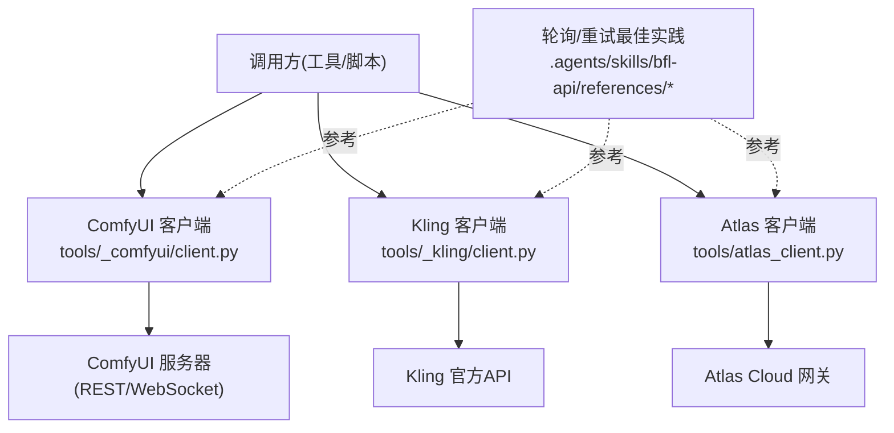
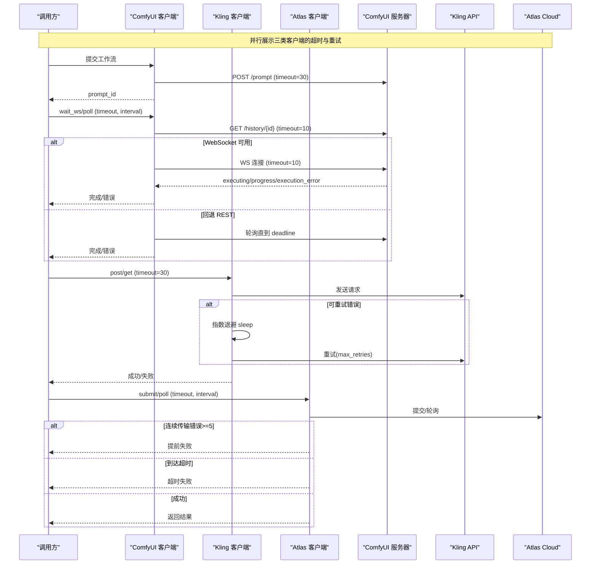
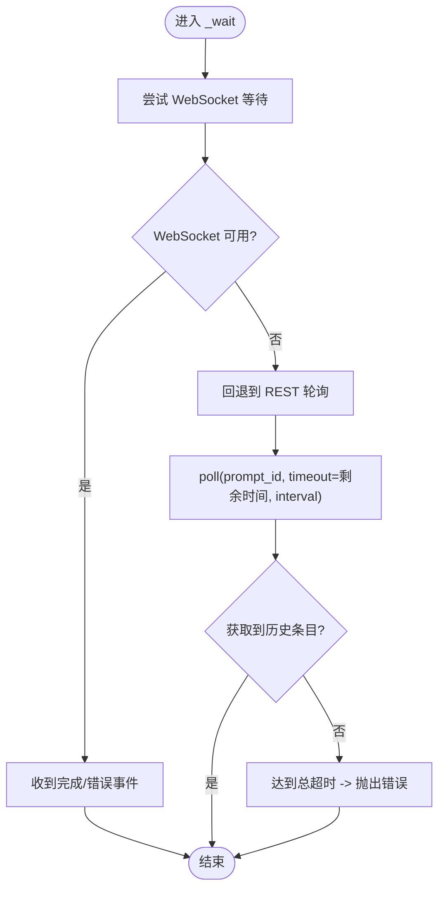
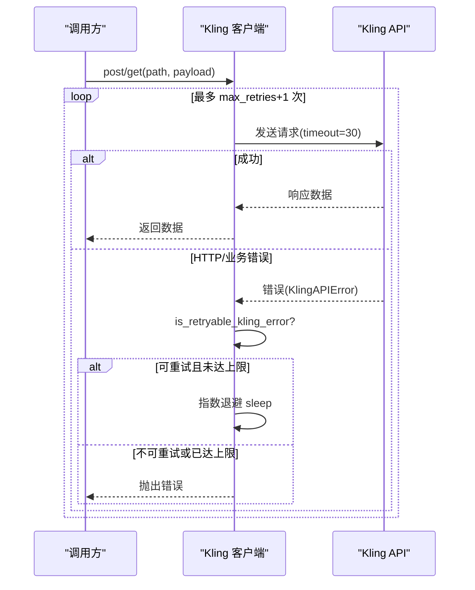
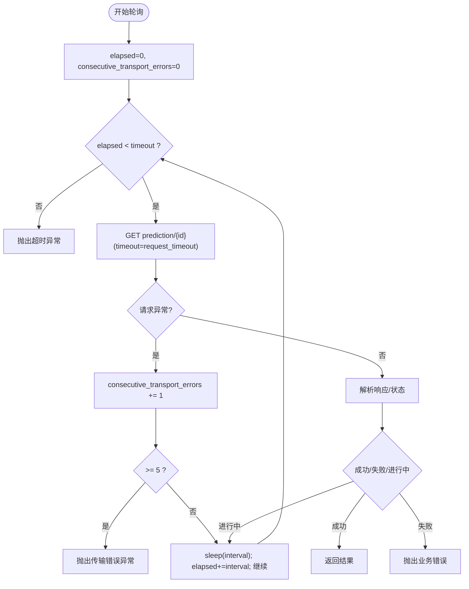
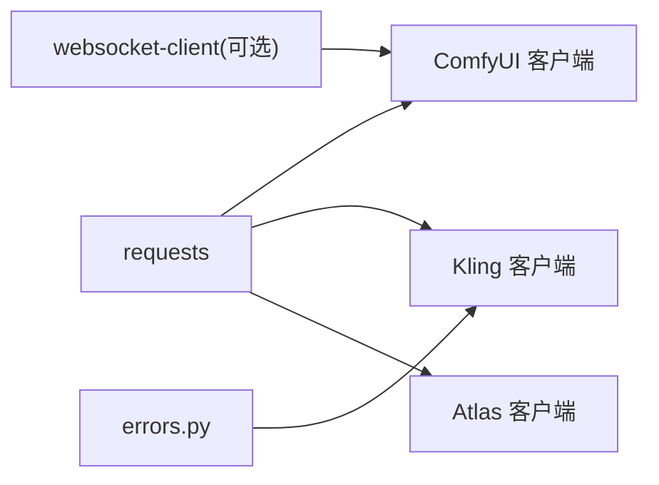

# 超时与重试处理

<cite>
**本文引用的文件**
- [tools/_comfyui/client.py](file://tools/_comfyui/client.py)
- [tools/_kling/client.py](file://tools/_kling/client.py)
- [tools/_kling/errors.py](file://tools/_kling/errors.py)
- [tools/atlas_client.py](file://tools/atlas_client.py)
- [tools/video/hunyuan_cloud_video.py](file://tools/video/hunyuan_cloud_video.py)
- [.agents/skills/bfl-api/references/polling-patterns.md](file://.agents/skills/bfl-api/references/polling-patterns.md)
- [.agents/skills/bfl-api/references/rate-limiting.md](file://.agents/skills/bfl-api/references/rate-limiting.md)
- [.agents/skills/bfl-api/references/error-handling.md](file://.agents/skills/bfl-api/references/error-handling.md)
</cite>

## 目录
1. [简介](#简介)
2. [项目结构](#项目结构)
3. [核心组件](#核心组件)
4. [架构总览](#架构总览)
5. [详细组件分析](#详细组件分析)
6. [依赖关系分析](#依赖关系分析)
7. [性能考量](#性能考量)
8. [故障排查指南](#故障排查指南)
9. [结论](#结论)
10. [附录](#附录)

## 简介
本文件聚焦于 OpenMontage 中的“超时处理与自动重试”机制，覆盖以下方面：
- 各类超时的配置与使用（连接/读取/写入、轮询总超时、单次请求超时）
- 自动重试的工作原理（最大重试次数、退避策略、错误类型过滤）
- 不同网络环境的调优建议（高延迟、不稳定连接）
- 监控与诊断方法（日志记录、指标收集、排障步骤）

## 项目结构
本项目中涉及超时与重试的关键代码主要分布在三个客户端模块与若干参考文档中：
- ComfyUI 本地服务客户端：负责提交任务、轮询完成、下载产物，内置 WebSocket 优先的等待策略与 REST 回退
- Kling 官方 API 客户端：封装 HTTP 请求、业务错误分类、有限重试与指数退避
- Atlas Cloud 通用网关：统一的生成/轮询/上传/下载流程，包含轮询超时与连续传输错误保护
- 视频工具参数定义：对外暴露 poll_interval_seconds 与 timeout_seconds 等可调参数
- 技能参考文档：提供通用的轮询模式、限流重试、错误分类与断路器模式的最佳实践

图表来源
- [tools/_comfyui/client.py:178-235](file://tools/_comfyui/client.py#L178-L235)
- [tools/_kling/client.py:137-157](file://tools/_kling/client.py#L137-L157)
- [tools/atlas_client.py:105-184](file://tools/atlas_client.py#L105-L184)
- [.agents/skills/bfl-api/references/polling-patterns.md:57-115](file://.agents/skills/bfl-api/references/polling-patterns.md#L57-L115)

章节来源
- [tools/_comfyui/client.py:178-235](file://tools/_comfyui/client.py#L178-L235)
- [tools/_kling/client.py:137-157](file://tools/_kling/client.py#L137-L157)
- [tools/atlas_client.py:105-184](file://tools/atlas_client.py#L105-L184)
- [.agents/skills/bfl-api/references/polling-patterns.md:57-115](file://.agents/skills/bfl-api/references/polling-patterns.md#L57-L115)

## 核心组件
- ComfyUI 客户端
  - 提交任务、轮询历史、WebSocket 实时进度、下载产物
  - 关键超时：提交/查询/下载均设置 requests.timeout；轮询总超时通过 deadline 控制；WebSocket 接收设置 interval 超时并回退到 REST 轮询
- Kling 客户端
  - 统一 _request 封装，支持 max_retries 与指数退避
  - 错误分类：HTTP 错误与业务错误统一为 KlingAPIError，并通过 is_retryable_kling_error 判断是否可重试
- Atlas 客户端
  - submit/poll/upload/download 四个基础能力
  - 轮询实现：固定间隔轮询，累计 elapsed 时间，超过 timeout 抛出异常；连续传输错误达到阈值提前失败
- 视频工具参数
  - 对外暴露 poll_interval_seconds 与 timeout_seconds，便于上层按场景调整

章节来源
- [tools/_comfyui/client.py:178-235](file://tools/_comfyui/client.py#L178-L235)
- [tools/_kling/client.py:28-57](file://tools/_kling/client.py#L28-L57)
- [tools/_kling/client.py:137-157](file://tools/_kling/client.py#L137-L157)
- [tools/_kling/errors.py:30-47](file://tools/_kling/errors.py#L30-L47)
- [tools/atlas_client.py:105-184](file://tools/atlas_client.py#L105-L184)
- [tools/video/hunyuan_cloud_video.py:146-159](file://tools/video/hunyuan_cloud_video.py#L146-L159)

## 架构总览
下图展示了三种典型调用路径的超时与重试协作方式：
- ComfyUI：优先 WebSocket 快速感知完成/错误，失败或不可用时回退到 REST 轮询，两者共享剩余超时预算
- Kling：每次请求带固定超时，遇到可重试错误时按指数退避重试
- Atlas：固定间隔轮询，累计超时；对连续传输错误进行熔断式提前失败

图表来源
- [tools/_comfyui/client.py:178-235](file://tools/_comfyui/client.py#L178-L235)
- [tools/_comfyui/client.py:246-341](file://tools/_comfyui/client.py#L246-L341)
- [tools/_kling/client.py:137-157](file://tools/_kling/client.py#L137-L157)
- [tools/atlas_client.py:105-184](file://tools/atlas_client.py#L105-L184)

## 详细组件分析

### ComfyUI 客户端：超时与等待策略
- 提交与查询
  - 提交工作流：requests.post(..., timeout=30)
  - 查询历史：requests.get(..., timeout=10)
- 等待策略
  - wait_ws：优先 WebSocket 接收事件，设置 conn.settimeout(interval)，并在超时后回查历史；整体以 deadline 控制总超时
  - poll：基于 REST 轮询，deadline = time.time() + timeout，interval 控制轮询频率
  - _wait：封装优先尝试 WebSocket，失败则用剩余超时回退到 poll，避免重复消耗超时预算
- 下载与上传
  - download：requests.get(..., timeout=120)
  - upload_image：requests.post(..., timeout=30)

图表来源
- [tools/_comfyui/client.py:246-341](file://tools/_comfyui/client.py#L246-L341)
- [tools/_comfyui/client.py:199-235](file://tools/_comfyui/client.py#L199-L235)

章节来源
- [tools/_comfyui/client.py:178-235](file://tools/_comfyui/client.py#L178-L235)
- [tools/_comfyui/client.py:246-341](file://tools/_comfyui/client.py#L246-L341)

### Kling 客户端：自动重试与退避
- 统一请求封装 _request
  - 每次请求设置 timeout=30
  - 捕获 KlingAPIError 与 requests.RequestException
  - 若错误可重试且未达 max_retries，执行指数退避 sleep(min(2.0*(attempt+1), 8.0))
- 错误分类
  - is_retryable_kling_error：根据 code 与 http_status 判断是否可重试
  - 常见可重试：500/503/504 及特定业务码

图表来源
- [tools/_kling/client.py:137-157](file://tools/_kling/client.py#L137-L157)
- [tools/_kling/errors.py:30-47](file://tools/_kling/errors.py#L30-L47)

章节来源
- [tools/_kling/client.py:28-57](file://tools/_kling/client.py#L28-L57)
- [tools/_kling/client.py:137-157](file://tools/_kling/client.py#L137-L157)
- [tools/_kling/errors.py:30-47](file://tools/_kling/errors.py#L30-L47)

### Atlas 客户端：轮询超时与传输错误保护
- 提交与轮询
  - submit：requests.post(..., timeout=timeout)
  - poll：固定间隔轮询，累计 elapsed，超过 timeout 抛出异常；连续传输错误计数，达到阈值提前失败
- 上传与下载
  - upload_media：requests.post(..., timeout=timeout)
  - download：requests.get(..., timeout=timeout)

图表来源
- [tools/atlas_client.py:127-184](file://tools/atlas_client.py#L127-L184)

章节来源
- [tools/atlas_client.py:105-184](file://tools/atlas_client.py#L105-L184)

### 视频工具参数：可配置的轮询间隔与总超时
- 暴露 poll_interval_seconds 与 timeout_seconds，用于控制轮询频率与最长等待时间
- 适用于需要长时任务的视频生成管线

章节来源
- [tools/video/hunyuan_cloud_video.py:146-159](file://tools/video/hunyuan_cloud_video.py#L146-L159)

## 依赖关系分析
- ComfyUI 客户端依赖 requests 与可选 websocket-client；在 WebSocket 不可用时回退到 REST 轮询，保证鲁棒性
- Kling 客户端依赖 requests.Session，集中管理 headers 与重试逻辑；错误分类由 errors.py 提供
- Atlas 客户端将请求与错误处理解耦，便于复用；轮询逻辑内聚在 poll 函数中
- 三者均遵循“短超时 + 合理重试 + 明确退出条件”的原则，避免无限等待

图表来源
- [tools/_comfyui/client.py:178-235](file://tools/_comfyui/client.py#L178-L235)
- [tools/_kling/client.py:137-157](file://tools/_kling/client.py#L137-L157)
- [tools/_kling/errors.py:30-47](file://tools/_kling/errors.py#L30-L47)
- [tools/atlas_client.py:105-184](file://tools/atlas_client.py#L105-L184)

章节来源
- [tools/_comfyui/client.py:178-235](file://tools/_comfyui/client.py#L178-L235)
- [tools/_kling/client.py:137-157](file://tools/_kling/client.py#L137-L157)
- [tools/_kling/errors.py:30-47](file://tools/_kling/errors.py#L30-L47)
- [tools/atlas_client.py:105-184](file://tools/atlas_client.py#L105-L184)

## 性能考量
- 轮询间隔与总超时
  - 短间隔提高响应速度但增加负载；长间隔降低负载但延迟更高。建议根据服务端 SLA 与网络状况选择
  - 总超时应大于最坏情况下的端到端耗时，并为突发延迟预留余量
- 退避策略
  - 指数退避可有效缓解拥塞；结合抖动避免“惊群效应”
  - 限制最大退避时间，防止长时间阻塞
- 连接与读写超时
  - 连接超时：控制握手阶段失败快速失败
  - 读取/写入超时：针对大文件或慢网络适当增大
- 资源占用
  - WebSocket 优先可减少轮询开销；不可用时回退 REST，确保可用性
  - 会话复用（如 requests.Session）减少 TCP 握手成本

[本节为通用指导，不直接分析具体文件]

## 故障排查指南
- 定位超时来源
  - 检查各层超时：提交/查询/下载/轮询的 timeout 与 interval
  - 确认 WebSocket 是否可用；若不可用，观察是否及时回退到 REST
- 识别可重试错误
  - Kling：依据 is_retryable_kling_error 判断；关注 5xx 与特定业务码
  - Atlas：关注连续传输错误计数，达到阈值即提前失败
- 日志与指标
  - 记录每次请求的开始/结束时间、状态码、错误信息、重试次数与退避时长
  - 统计超时率、重试成功率、平均轮询次数与耗时分布
- 常见问题
  - 轮询过快导致服务端限流：增大 interval 或采用指数退避
  - 总超时过短导致误判：根据任务复杂度调整 timeout_seconds
  - WebSocket 频繁断开：增强重连与回退逻辑，记录断连原因

章节来源
- [tools/_kling/client.py:137-157](file://tools/_kling/client.py#L137-L157)
- [tools/_kling/errors.py:30-47](file://tools/_kling/errors.py#L30-L47)
- [tools/atlas_client.py:127-184](file://tools/atlas_client.py#L127-L184)
- [.agents/skills/bfl-api/references/polling-patterns.md:232-241](file://.agents/skills/bfl-api/references/polling-patterns.md#L232-L241)

## 结论
OpenMontage 在不同客户端中实现了稳健的超时与重试机制：
- ComfyUI 通过 WebSocket 优先与 REST 回退，兼顾实时性与可靠性
- Kling 通过统一错误分类与指数退避，提升在网络波动与服务瞬态故障下的成功率
- Atlas 通过轮询超时与连续传输错误保护，避免长时间阻塞与雪崩
结合合理的参数调优与完善的监控日志，可在复杂网络环境下获得稳定高效的生成体验。

[本节为总结性内容，不直接分析具体文件]

## 附录

### 超时类型与配置要点
- 连接超时
  - 目标：快速发现无法建立连接的远端，避免长时间挂起
  - 建议值：默认 5–10 秒；内网可更短，跨公网可适当延长
- 读取超时
  - 目标：防止服务端无响应导致线程/进程长期阻塞
  - 建议值：小响应 5–10 秒；大文件下载 60–120 秒
- 写入超时
  - 目标：防止上传大对象时被卡住
  - 建议值：与读取超时相近，视网络与对象大小调整
- 轮询总超时
  - 目标：限制长任务的最长等待时间，避免无限等待
  - 建议值：根据任务复杂度设定，如 600 秒；必要时分层设置
- 轮询间隔
  - 目标：平衡响应速度与服务器压力
  - 建议值：2–5 秒；在高并发或限流场景下增大

章节来源
- [tools/_comfyui/client.py:178-235](file://tools/_comfyui/client.py#L178-L235)
- [tools/atlas_client.py:127-184](file://tools/atlas_client.py#L127-L184)
- [tools/video/hunyuan_cloud_video.py:146-159](file://tools/video/hunyuan_cloud_video.py#L146-L159)

### 自动重试机制要点
- 最大重试次数
  - 建议 2–5 次；过多可能导致级联放大
- 退避策略
  - 指数退避 + 抖动；限制最大退避时间
  - 尊重服务端 Retry-After 头（参考最佳实践）
- 错误类型过滤
  - 仅对可重试错误（如 5xx、限流 429、特定业务码）重试
  - 对客户端错误（如参数错误、鉴权失败）立即失败

章节来源
- [tools/_kling/client.py:137-157](file://tools/_kling/client.py#L137-L157)
- [tools/_kling/errors.py:30-47](file://tools/_kling/errors.py#L30-L47)
- [.agents/skills/bfl-api/references/rate-limiting.md:67-88](file://.agents/skills/bfl-api/references/rate-limiting.md#L67-L88)
- [.agents/skills/bfl-api/references/error-handling.md:148-197](file://.agents/skills/bfl-api/references/error-handling.md#L148-L197)

### 不同网络环境的调优建议
- 高延迟网络
  - 增大连接/读取/写入超时；适度增大轮询间隔
  - 启用指数退避与抖动，避免拥塞加剧
- 不稳定连接
  - 启用重试与回退（如 WebSocket 不可用回退 REST）
  - 对连续传输错误设置阈值，提前失败以减少资源浪费
- 高并发/限流环境
  - 严格遵循 Retry-After；控制并发度与退避上限
  - 监控限流比例，动态调整间隔与重试次数

章节来源
- [.agents/skills/bfl-api/references/polling-patterns.md:57-115](file://.agents/skills/bfl-api/references/polling-patterns.md#L57-L115)
- [.agents/skills/bfl-api/references/rate-limiting.md:67-88](file://.agents/skills/bfl-api/references/rate-limiting.md#L67-L88)

### 监控与诊断清单
- 日志记录
  - 记录每次请求的 URL、方法、超时、状态码、错误信息、重试次数与退避时长
  - 记录 WebSocket 连接/断开事件与回退决策
- 指标收集
  - 超时率、重试成功率、平均轮询次数、端到端耗时分布
  - 传输错误计数与熔断触发次数
- 故障排除步骤
  - 复现问题并抓取首尾请求与中间轮询日志
  - 核对超时与间隔配置是否符合预期
  - 检查服务端限流与错误码，确认是否属于可重试范围

章节来源
- [tools/_comfyui/client.py:246-341](file://tools/_comfyui/client.py#L246-L341)
- [tools/_kling/client.py:137-157](file://tools/_kling/client.py#L137-L157)
- [tools/atlas_client.py:127-184](file://tools/atlas_client.py#L127-L184)
- [.agents/skills/bfl-api/references/polling-patterns.md:232-241](file://.agents/skills/bfl-api/references/polling-patterns.md#L232-L241)