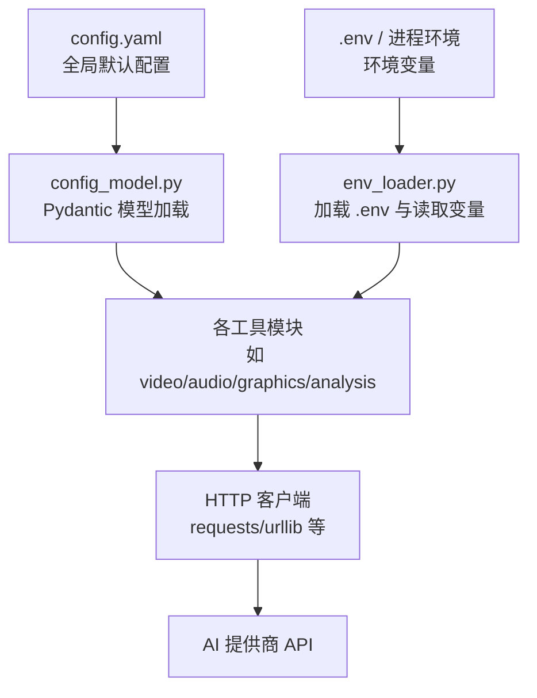
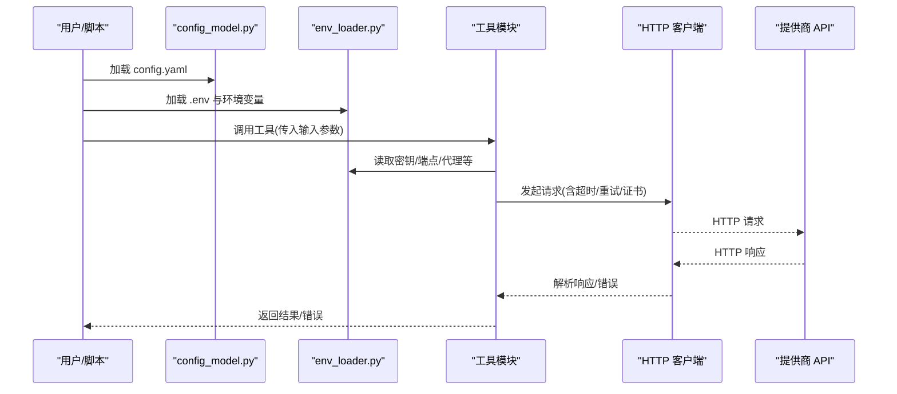
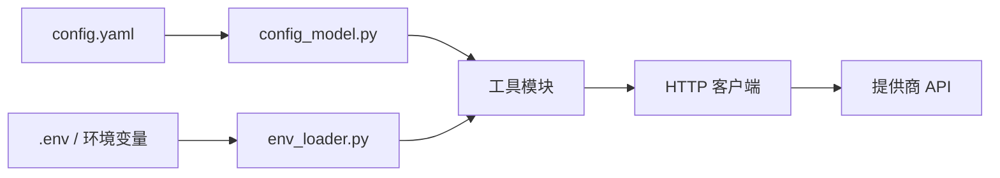
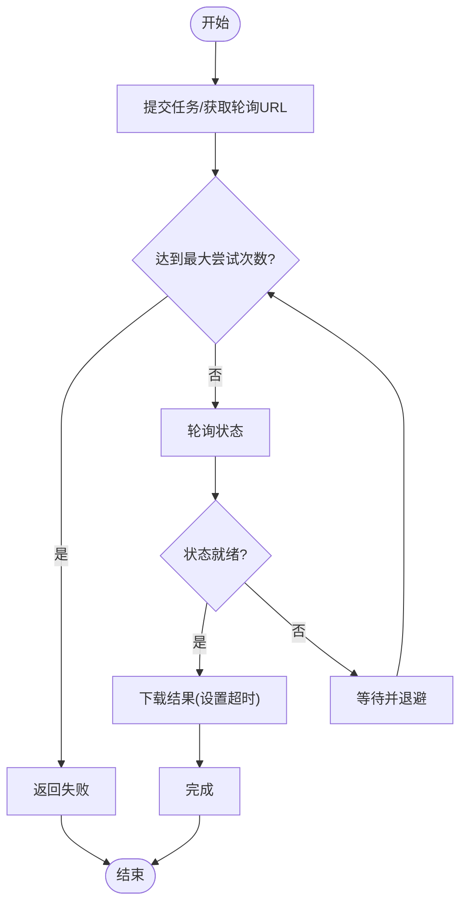

# 连接配置

<cite>
**本文引用的文件**
- [config.yaml](file://config.yaml)
- [lib/config_model.py](file://lib/config_model.py)
- [lib/env_loader.py](file://lib/env_loader.py)
- [tools/video/kling_official_video.py](file://tools/video/kling_official_video.py)
- [tests/tools/test_minimax_video.py](file://tests/tools/test_minimax_video.py)
- [tools/graphics/openai_image.py](file://tools/graphics/openai_image.py)
- [tools/audio/openai_tts.py](file://tools/audio/openai_tts.py)
- [tools/analysis/dashscope_asr.py](file://tools/analysis/dashscope_asr.py)
- [tools/audio/google_tts.py](file://tools/audio/google_tts.py)
- [tools/graphics/google_imagen.py](file://tools/graphics/google_imagen.py)
- [tools/video/gemini_omni_fal.py](file://tools/video/gemini_omni_fal.py)
- [tools/video/hunyuan_cloud_video.py](file://tools/video/hunyuan_cloud_video.py)
- [tools/video/minimax_video.py](file://tools/video/minimax_video.py)
- [tools/video/sora_video.py](file://tools/video/sora_video.py)
- [tools/video/runway_video.py](file://tools/video/runway_video.py)
- [tools/video/comfyui_video.py](file://tools/video/comfyui_video.py)
- [tools/video/veo_video.py](file://tools/video/veo_video.py)
- [tools/video/wan_video.py](file://tools/video/wan_video.py)
- [tools/video/cogvideo_video.py](file://tools/video/cogvideo_video.py)
- [tools/video/ltx_video_modal.py](file://tools/video/ltx_video_modal.py)
- [tools/video/ltx_video_local.py](file://tools/video/ltx_video_local.py)
- [tools/video/jimeng_video.py](file://tools/video/jimeng_video.py)
- [tools/video/seedance_video.py](file://tools/video/seedance_video.py)
- [tools/video/seedance_replicate.py](file://tools/video/seedance_replicate.py)
- [tools/video/atlas_video.py](file://tools/video/atlas_video.py)
- [tools/video/hyperframes_compose.py](file://tools/video/hyperframes_compose.py)
- [tools/video/video_trimmer.py](file://tools/video/video_trimmer.py)
- [tools/video/stock_sources/pexels.py](file://tools/video/stock_sources/pexels.py)
- [tools/video/stock_sources/archive_org.py](file://tools/video/stock_sources/archive_org.py)
- [tools/_kling/client.py](file://tools/_kling/client.py)
- [tools/_kling/account.py](file://tools/_kling/account.py)
- [tools/_comfyui/client.py](file://tools/_comfyui/client.py)
- [tools/atlas_client.py](file://tools/atlas_client.py)
- [tools/google_credentials.py](file://tools/google_credentials.py)
- [scripts/kling_official_animated_explainer_e2e.py](file://scripts/kling_official_animated_explainer_e2e.py)
</cite>

## 目录
1. [简介](#简介)
2. [项目结构](#项目结构)
3. [核心组件](#核心组件)
4. [架构总览](#架构总览)
5. [详细组件分析](#详细组件分析)
6. [依赖关系分析](#依赖关系分析)
7. [性能与网络调优](#性能与网络调优)
8. [故障排查指南](#故障排查指南)
9. [结论](#结论)
10. [附录](#附录)

## 简介
本章节面向需要为 OpenMontage 配置 AI 提供商 API 连接的读者，系统说明如何设置 API 密钥、端点 URL、超时参数、代理服务器、SSL/CA 证书以及高级网络参数（连接池、重试、并发限制）。文档同时覆盖不同提供商的连接要求与安全选项，并提供可操作的排错建议。

## 项目结构
OpenMontage 将“运行时配置”和“环境变量加载”解耦：
- 全局配置通过 YAML 提供默认值与可选的 LLM 选择；
- 环境变量通过 .env 与环境注入机制加载；
- 各工具模块按功能域组织（视频、图像、音频、分析等），每个工具负责自身提供商的连接细节（密钥、端点、超时、代理、证书等）。

图表来源
- [config.yaml:1-34](file://config.yaml#L1-L34)
- [lib/config_model.py:74-85](file://lib/config_model.py#L74-L85)
- [lib/env_loader.py:15-34](file://lib/env_loader.py#L15-L34)

章节来源
- [config.yaml:1-34](file://config.yaml#L1-L34)
- [lib/config_model.py:1-93](file://lib/config_model.py#L1-L93)
- [lib/env_loader.py:1-35](file://lib/env_loader.py#L1-L35)

## 核心组件
- 全局配置模型：以 Pydantic 模型定义默认值与类型校验，便于扩展与迁移。
- 环境变量加载：统一从 .env 加载并暴露 get/require 方法，确保必需变量存在。
- 工具层：每个工具封装具体提供商的连接逻辑，包括鉴权头、基础 URL、超时、重试、代理、证书等。

章节来源
- [lib/config_model.py:28-72](file://lib/config_model.py#L28-L72)
- [lib/env_loader.py:15-34](file://lib/env_loader.py#L15-L34)

## 架构总览
下图展示了从配置到请求的端到端流程：YAML 提供默认，环境变量覆盖，工具模块组装请求并调用 HTTP 客户端访问提供商 API。

图表来源
- [lib/config_model.py:74-85](file://lib/config_model.py#L74-L85)
- [lib/env_loader.py:15-34](file://lib/env_loader.py#L15-L34)

## 详细组件分析

### 通用连接要点（适用于所有提供商）
- API 密钥
  - 多数工具通过环境变量注入密钥（例如 ELEVENLABS_API_KEY、BFL_API_KEY、GOOGLE_API_KEY/GEMINI_API_KEY、MINIMAX_BASE_URL 等）。
  - 使用 env_loader 的 require_env 可在缺失时快速失败，避免静默错误。
- 端点 URL
  - 部分提供商支持自定义基础 URL（如 MINIMAX_BASE_URL），用于代理或私有部署。
  - 某些工具允许在调用参数中指定 endpoint/model，但基础域名通常由工具内部决定或通过环境变量控制。
- 超时
  - 长耗时任务（视频生成、轮询下载）需显式设置超时，避免无限等待。
  - 建议在工具层对“提交任务”和“轮询/下载”分别设置合理超时。
- 代理
  - 标准 HTTP(S)/SOCKS 代理可通过 requests 的 proxies 参数或环境变量（如 http_proxy/https_proxy/all_proxy）生效。
  - 部分工具在测试或示例中演示了通过环境变量覆盖基础 URL 的方式实现“伪代理”。
- SSL/CA 证书
  - 若使用自签或私有 CA，可通过 requests 的 verify 参数指向 CA 包路径，或在系统信任库中安装 CA。
  - 本地 ComfyUI 等 HTTPS 服务常见于自签证书场景，需正确配置 verify。

章节来源
- [lib/env_loader.py:15-34](file://lib/env_loader.py#L15-L34)
- [tests/tools/test_minimax_video.py:107-108](file://tests/tools/test_minimax_video.py#L107-L108)

### 提供商连接与安全配置速查

#### OpenAI（图像/TTS）
- 密钥：通过环境变量注入（如 OPENAI_API_KEY）。
- 端点：默认官方端点；如需代理或兼容网关，可通过环境变量或工具参数调整（依具体工具实现）。
- 超时：TTS/图像生成建议设置合理超时，避免阻塞。
- 安全：建议使用受信任 CA；必要时指定自定义 CA 路径。

章节来源
- [tools/graphics/openai_image.py](file://tools/graphics/openai_image.py)
- [tools/audio/openai_tts.py](file://tools/audio/openai_tts.py)

#### Google（Gemini/Imagen/TTS）
- 密钥：共享 GOOGLE_API_KEY 或 GEMINI_API_KEY。
- 端点：原生 Gemini 直连；也可通过 fal.ai/Runway/ComfyUI Partner Node 等网关间接使用。
- 超时：视频生成与轮询需设置超时；下载临时链接应尽快完成。
- 安全：遵循 Google 官方安全建议；必要时配置自定义 CA。

章节来源
- [tools/graphics/google_imagen.py](file://tools/graphics/google_imagen.py)
- [tools/audio/google_tts.py](file://tools/audio/google_tts.py)
- [tools/video/gemini_omni_fal.py:205-229](file://tools/video/gemini_omni_fal.py#L205-L229)

#### Minimax
- 密钥：通过环境变量注入（如 MINIMAX_API_KEY）。
- 端点：支持通过 MINIMAX_BASE_URL 覆盖基础 URL，便于代理或私有部署。
- 超时：建议为生成与下载设置超时。
- 安全：结合企业防火墙策略与 CA 管理。

章节来源
- [tests/tools/test_minimax_video.py:107-108](file://tests/tools/test_minimax_video.py#L107-L108)
- [tools/video/minimax_video.py](file://tools/video/minimax_video.py)

#### Kling Official
- 密钥：KLING_API_KEY。
- 端点：支持 KLING_API_BASE_URL 覆盖基础 URL。
- 超时：长任务需超时保护。
- 安全：企业内网可配合代理与 CA 管理。

章节来源
- [scripts/kling_official_animated_explainer_e2e.py:45](file://scripts/kling_official_animated_explainer_e2e.py#L45)
- [tools/video/kling_official_video.py](file://tools/video/kling_official_video.py)
- [tools/_kling/client.py](file://tools/_kling/client.py)
- [tools/_kling/account.py](file://tools/_kling/account.py)

#### DashScope（语音识别）
- 密钥：通过环境变量注入（如 DASHSCOPE_API_KEY）。
- 端点：默认官方端点；可按需切换。
- 超时：ASR 流式/批量任务需设置超时。
- 安全：遵循阿里云安全最佳实践。

章节来源
- [tools/analysis/dashscope_asr.py](file://tools/analysis/dashscope_asr.py)

#### Runway / ComfyUI / VEO / Wan / CogVideo / LTX / Jimeng / Seedance / Sora / Atlas / HyperFrames
- 密钥：各自通过环境变量注入（如 RUNWAY_API_KEY、COMFYUI_*、VEO_*、WAN_*、COGVIDEO_*、LTX_*、JIMENG_*、SEEDANCE_*、SORA_*、ATLAS_*、HYPERFRAMES_* 等）。
- 端点：部分支持自定义基础 URL 或 endpoint；ComfyUI 常为本地/私有服务，注意 HTTPS 与自签证书。
- 超时：视频生成与轮询务必设置超时。
- 安全：企业环境建议统一代理与 CA 管理。

章节来源
- [tools/video/runway_video.py](file://tools/video/runway_video.py)
- [tools/video/comfyui_video.py](file://tools/video/comfyui_video.py)
- [tools/video/veo_video.py](file://tools/video/veo_video.py)
- [tools/video/wan_video.py](file://tools/video/wan_video.py)
- [tools/video/cogvideo_video.py](file://tools/video/cogvideo_video.py)
- [tools/video/ltx_video_modal.py](file://tools/video/ltx_video_modal.py)
- [tools/video/ltx_video_local.py](file://tools/video/ltx_video_local.py)
- [tools/video/jimeng_video.py](file://tools/video/jimeng_video.py)
- [tools/video/seedance_video.py](file://tools/video/seedance_video.py)
- [tools/video/seedance_replicate.py](file://tools/video/seedance_replicate.py)
- [tools/video/sora_video.py](file://tools/video/sora_video.py)
- [tools/video/atlas_video.py](file://tools/video/atlas_video.py)
- [tools/video/hyperframes_compose.py](file://tools/video/hyperframes_compose.py)

### 代理服务器配置（HTTP/HTTPS/SOCKS）
- 环境变量方式（推荐）
  - 设置 http_proxy、https_proxy、all_proxy（小写或大写均可，取决于底层库）。
  - 对于 SOCKS 代理，设置 all_proxy 为 socks5://... 或 socks5h://...。
- 代码级方式
  - 在 requests 调用中传入 proxies={"http": "...", "https": "..."}。
  - 针对特定工具，优先检查其是否暴露代理相关参数或环境变量。
- 注意事项
  - 某些工具通过覆盖基础 URL 实现“伪代理”，并非真正的代理转发，请区分。
  - 企业网络可能要求认证代理，需在代理地址中包含用户名密码或使用系统凭据管理器。

章节来源
- [tools/video/stock_sources/pexels.py](file://tools/video/stock_sources/pexels.py)
- [tools/video/stock_sources/archive_org.py](file://tools/video/stock_sources/archive_org.py)
- [tools/video/video_trimmer.py](file://tools/video/video_trimmer.py)

### SSL 证书与自定义 CA
- 使用系统信任库
  - 将企业 CA 安装到操作系统信任库，使 requests/urllib 自动信任。
- 指定 CA 包
  - 在 requests 调用中使用 verify="/path/to/ca-bundle.crt" 指向 CA 包。
- 禁用验证（不推荐）
  - 仅在调试时使用 verify=False，生产环境严禁关闭证书校验。
- 本地服务
  - 本地 ComfyUI 或其他自签 HTTPS 服务，建议导出服务端证书并作为 CA 包使用。

章节来源
- [tools/video/comfyui_video.py](file://tools/video/comfyui_video.py)
- [tools/_comfyui/client.py](file://tools/_comfyui/client.py)

### 连接池、重试策略、并发限制
- 连接池
  - requests 默认复用连接；在高并发场景下，可通过会话对象与适配器调整连接池大小与保持时间。
- 重试策略
  - 对幂等请求（GET/HEAD/OPTIONS）建议启用指数退避重试；非幂等请求谨慎重试。
  - 遇到 429/5xx 时，结合速率限制与退避策略。
- 并发限制
  - 使用线程池/进程池限制并发度，避免压垮下游 API。
  - 对长耗时任务（视频生成）采用队列+限速模式。
- 超时
  - 为连接、读、写分别设置超时；长轮询任务设置整体超时。

章节来源
- [tools/video/gemini_omni_fal.py:205-229](file://tools/video/gemini_omni_fal.py#L205-L229)

## 依赖关系分析
- 配置层依赖
  - config.yaml 提供默认值；config_model.py 将其映射为强类型模型；env_loader.py 提供 .env 加载与变量读取。
- 工具层依赖
  - 各工具模块依赖 env_loader 获取密钥/端点/代理等；依赖 HTTP 客户端访问提供商 API。
- 外部依赖
  - 第三方 SDK 或 requests/urllib；Google 凭据管理（google_credentials.py）。

图表来源
- [config.yaml:1-34](file://config.yaml#L1-L34)
- [lib/config_model.py:74-85](file://lib/config_model.py#L74-L85)
- [lib/env_loader.py:15-34](file://lib/env_loader.py#L15-L34)

章节来源
- [lib/config_model.py:1-93](file://lib/config_model.py#L1-L93)
- [lib/env_loader.py:1-35](file://lib/env_loader.py#L1-L35)

## 性能与网络调优
- 超时
  - 短请求（图像/TTS）：连接/读超时建议 10-30s。
  - 长任务（视频生成/轮询）：整体超时建议 60-300s，分阶段设置轮询间隔与最大尝试次数。
- 重试
  - 指数退避 + 抖动；对 429/5xx 重试；对 4xx（除 429）不重试。
- 连接池
  - 高并发场景增大连接池上限；复用会话减少握手开销。
- 并发
  - 根据提供商速率限制设置并发上限；使用令牌桶或漏桶控制。
- 缓存
  - 对重复查询结果进行短期缓存，降低重复请求。
- 日志与监控
  - 记录关键指标：QPS、延迟分布、错误率、重试次数。

[本节为通用指导，无需列出具体文件来源]

## 故障排查指南
- 常见问题
  - 缺少必需环境变量：使用 require_env 快速定位缺失项。
  - 端点不可达：检查代理、DNS、防火墙与证书链。
  - 超时频繁：调整超时与重试策略；确认下游服务状态。
  - 429 限流：降低并发、增加退避时间。
  - 证书错误：安装企业 CA 或指定 CA 包；避免在生产关闭证书校验。
- 诊断步骤
  - 打印实际请求 URL、头部与负载（脱敏后）。
  - 使用 curl 复现问题，隔离 Python 环境问题。
  - 逐步缩小范围：先最小化请求，再添加参数。

章节来源
- [lib/env_loader.py:29-34](file://lib/env_loader.py#L29-L34)

## 结论
OpenMontage 通过“YAML 默认 + 环境变量覆盖 + 工具层封装”的模式，提供了灵活且安全的 AI 提供商连接能力。建议在生产环境中：
- 严格管理密钥与端点；
- 合理设置超时、重试与并发；
- 使用企业代理与 CA 管理；
- 建立完善的日志与监控体系。

[本节为总结性内容，无需列出具体文件来源]

## 附录

### 常用环境变量清单（节选）
- ELEVENLABS_API_KEY：ElevenLabs 语音服务密钥
- BFL_API_KEY：BFL 平台密钥
- GOOGLE_API_KEY / GEMINI_API_KEY：Google 系列服务密钥
- MINIMAX_BASE_URL：Minimax 基础 URL（可用于代理或私有部署）
- KLING_API_KEY / KLING_API_BASE_URL：Kling 官方密钥与基础 URL
- DASHSCOPE_API_KEY：DashScope 密钥
- 其他工具对应密钥与端点变量（见各工具模块）

章节来源
- [lib/env_loader.py:15-34](file://lib/env_loader.py#L15-L34)
- [tests/tools/test_minimax_video.py:107-108](file://tests/tools/test_minimax_video.py#L107-L108)
- [scripts/kling_official_animated_explainer_e2e.py:45](file://scripts/kling_official_animated_explainer_e2e.py#L45)

### 典型流程图：带重试与超时的轮询下载

图表来源
- [tools/video/gemini_omni_fal.py:205-229](file://tools/video/gemini_omni_fal.py#L205-L229)