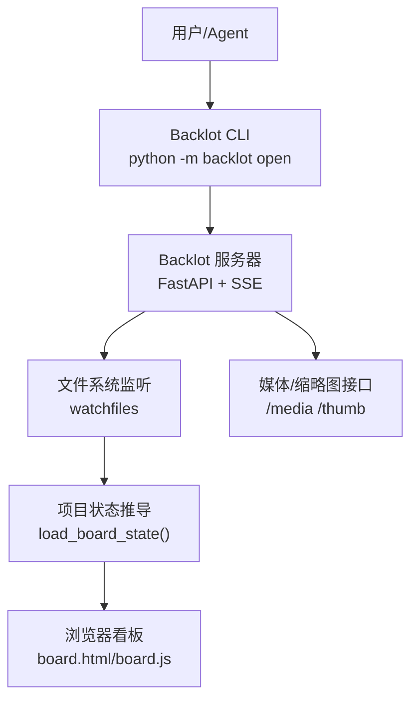
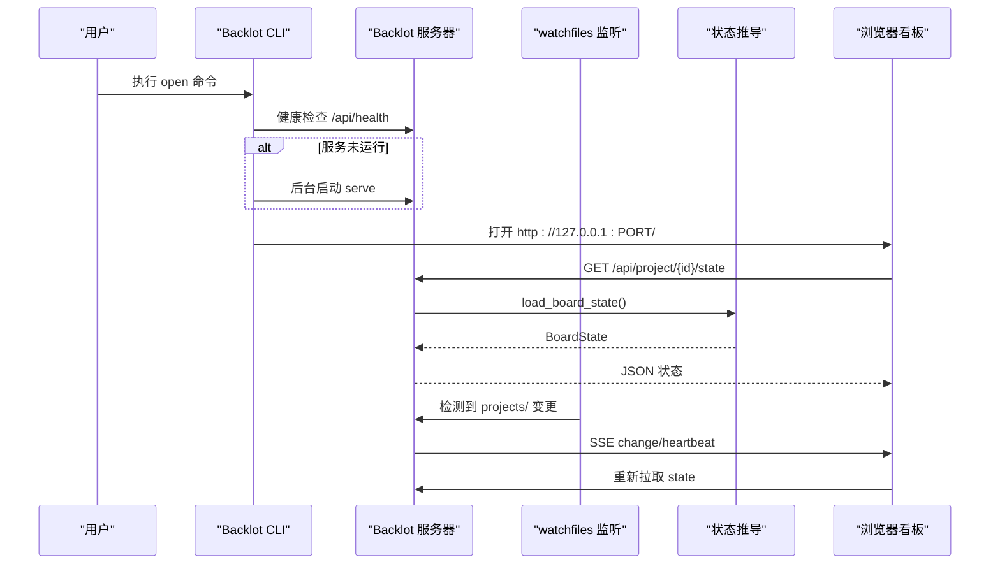
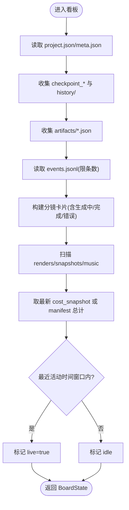
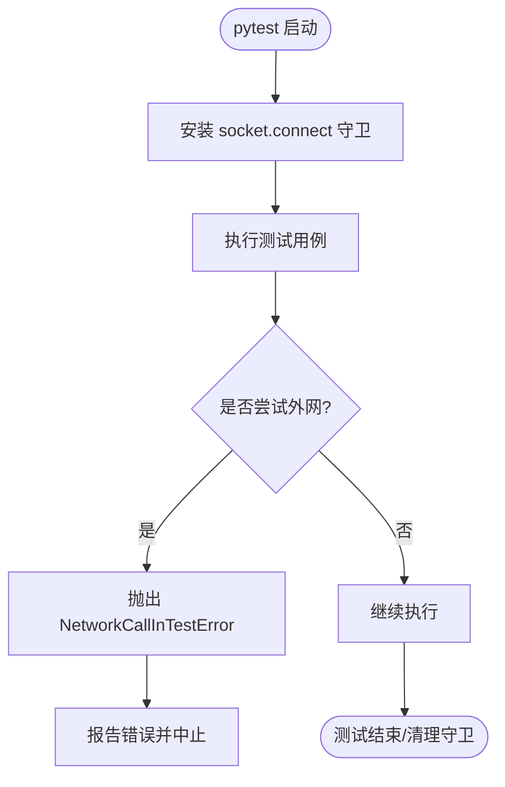
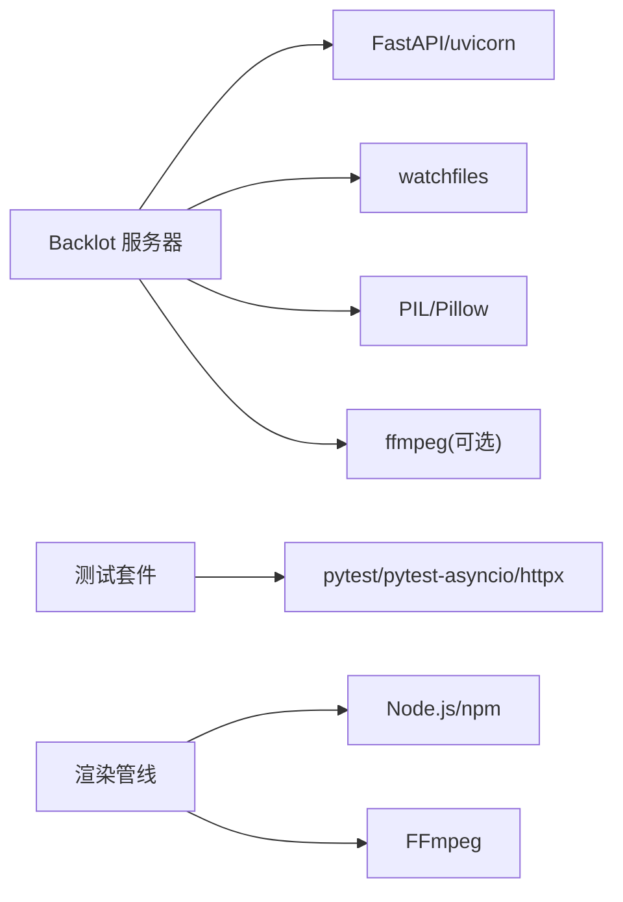

# 调试工具和技巧

<cite>
**本文引用的文件**
- [README.md](file://README.md)
- [backlot/README.md](file://backlot/README.md)
- [backlot/__main__.py](file://backlot/__main__.py)
- [backlot/server.py](file://backlot/server.py)
- [backlot/state.py](file://backlot/state.py)
- [lib/env_loader.py](file://lib/env_loader.py)
- [tests/conftest.py](file://tests/conftest.py)
- [Makefile](file://Makefile)
- [requirements-dev.txt](file://requirements-dev.txt)
- [tests/tools/test_atlas_video.py](file://tests/tools/test_atlas_video.py)
</cite>

## 目录
1. [简介](#简介)
2. [项目结构](#项目结构)
3. [核心组件](#核心组件)
4. [架构总览](#架构总览)
5. [详细组件分析](#详细组件分析)
6. [依赖关系分析](#依赖关系分析)
7. [性能考虑](#性能考虑)
8. [故障排查指南](#故障排查指南)
9. [结论](#结论)
10. [附录](#附录)

## 简介
本指南聚焦于在 OpenMontage 中进行高效调试与排障，覆盖以下主题：
- 如何启用调试模式与详细日志输出
- 如何使用 Backlot 界面进行生产过程的实时监控与回放
- 单元测试与集成测试的调试方法（mock 数据、测试环境、断点调试）
- 使用 Python 调试器（pdb、IDE 调试器）进行代码级调试
- 异步代码、多线程与分布式场景的调试策略
- 常用调试命令与脚本示例

## 项目结构
OpenMontage 的调试相关能力主要分布在以下位置：
- Backlot 本地看板服务：提供实时状态、事件流、媒体缩略图与回放能力
- 环境变量加载：集中管理 .env 配置
- 测试基础设施：网络隔离、标记与运行入口
- 构建与测试命令：统一的 Makefile 入口

图表来源
- [backlot/__main__.py:55-86](file://backlot/__main__.py#L55-L86)
- [backlot/server.py:165-307](file://backlot/server.py#L165-L307)
- [backlot/state.py:588-658](file://backlot/state.py#L588-L658)

章节来源
- [README.md:150-176](file://README.md#L150-L176)
- [backlot/README.md:1-43](file://backlot/README.md#L1-L43)

## 核心组件
- Backlot 命令行与服务器：负责启动后台服务、健康检查、SSE 事件推送、静态 UI 与媒体访问。
- 项目状态推导：从 checkpoint、artifacts、events、renders 等磁盘文件推导看板状态，支持“无阻塞、不崩溃”的降级。
- 环境变量加载：统一读取 .env，并提供 get/require 工具函数。
- 测试安全网：默认阻断非回环网络访问，避免测试误调付费 API；支持 live_api 标记与开关。

章节来源
- [backlot/__main__.py:1-110](file://backlot/__main__.py#L1-L110)
- [backlot/server.py:1-369](file://backlot/server.py#L1-L369)
- [backlot/state.py:1-716](file://backlot/state.py#L1-L716)
- [lib/env_loader.py:1-35](file://lib/env_loader.py#L1-L35)
- [tests/conftest.py:1-132](file://tests/conftest.py#L1-L132)

## 架构总览
下图展示了 Backlot 在看板监控中的关键交互：CLI 启动或连接服务，服务端通过 watchfiles 监听项目目录变更，经状态推导后以 SSE 推送给前端刷新。

图表来源
- [backlot/__main__.py:55-86](file://backlot/__main__.py#L55-L86)
- [backlot/server.py:132-212](file://backlot/server.py#L132-L212)
- [backlot/state.py:588-658](file://backlot/state.py#L588-L658)

## 详细组件分析

### Backlot 看板与实时调试
- 启动方式
  - 库视图：python -m backlot open
  - 指定项目：python -m backlot open <project-id>
  - 前台服务：python -m backlot serve --port 4750
- 实时机制
  - watchfiles 监听 projects/ 目录变化，去重后发布到 ChangeHub
  - SSE 端点按项目过滤订阅，心跳保活，批量合并突发通知
- 状态来源
  - 阶段状态、门禁、版本来自 checkpoint_* 与 history/
  - 剧本、分镜、资产清单来自 artifacts/*.json
  - 活动与生成闪烁来自 events.jsonl
  - 成本快照来自 checkpoint 的 cost_snapshot
  - 渲染产物来自 renders/*.mp4 及根目录 mp4 启发式
- 回放能力
  - 已完成的生产可从时间戳回放，端到端可拖拽

图表来源
- [backlot/state.py:588-658](file://backlot/state.py#L588-L658)
- [backlot/server.py:165-307](file://backlot/server.py#L165-L307)

章节来源
- [backlot/README.md:1-43](file://backlot/README.md#L1-L43)
- [backlot/__main__.py:1-110](file://backlot/__main__.py#L1-L110)
- [backlot/server.py:1-369](file://backlot/server.py#L1-L369)
- [backlot/state.py:1-716](file://backlot/state.py#L1-L716)

### 环境变量与调试开关
- .env 加载
  - 自动在项目根目录查找并加载 .env
  - 提供 get_env 与 require_env 两种获取方式
- 常见调试开关建议
  - BACKLOT_PORT：自定义 Backlot 端口
  - OPENMONTAGE_ALLOW_NETWORK：允许测试访问真实网络（谨慎使用）
  - 各 Provider 的 API Key：按需配置以解锁对应工具

章节来源
- [lib/env_loader.py:1-35](file://lib/env_loader.py#L1-L35)
- [README.md:234-278](file://README.md#L234-L278)

### 测试环境与断点调试
- 网络保护
  - 默认拦截所有非回环网络调用，防止测试误触付费 API
  - 仅允许 localhost/127.x/::1/0.0.0.0 等回环地址
  - 可通过 OPENMONTAGE_ALLOW_NETWORK=1 显式放行
- 标记测试
  - @pytest.mark.live_api：仅在设置环境变量时运行
- 断点调试
  - 在任意测试用例中使用 breakpoint() 或在 IDE 打断点
  - 结合 pytest -s 查看 stdout/stderr
- Mock 数据准备
  - 使用 monkeypatch 替换模块/函数（如 requests、websocket、subprocess）
  - 构造 FakeResponse/队列，验证提交-轮询-下载流程与错误路径

图表来源
- [tests/conftest.py:31-132](file://tests/conftest.py#L31-L132)

章节来源
- [tests/conftest.py:1-132](file://tests/conftest.py#L1-L132)
- [tests/tools/test_atlas_video.py:1-45](file://tests/tools/test_atlas_video.py#L1-L45)

### 异步与并发调试
- Backlot 服务器基于 FastAPI + asyncio
  - SSE 心跳与超时处理
  - 变更队列 fan-out 与去抖
- 调试要点
  - 使用 uvicorn 前台运行便于打印日志
  - 关注队列满时的丢弃策略与心跳间隔
  - 对长连接断开做优雅处理

章节来源
- [backlot/server.py:132-212](file://backlot/server.py#L132-L212)

### 多线程/多进程调试
- Backlot CLI 以子进程方式后台启动服务
  - Windows 使用新进程组与分离标志
  - Unix 使用 start_new_session 分离会话
- 调试要点
  - 若服务未拉起，CLI 会降级继续（幂等设计）
  - 通过健康检查判断服务就绪

章节来源
- [backlot/__main__.py:38-79](file://backlot/__main__.py#L38-L79)

## 依赖关系分析
- 运行时依赖
  - FastAPI、uvicorn：Web 框架与服务
  - watchfiles：文件系统监听
  - PIL/Pillow：图片缩略图
  - ffmpeg：视频封面帧提取
- 开发依赖
  - pytest、pytest-asyncio、httpx：测试与 HTTP 客户端
- 外部工具
  - Node.js/npm：Remotion/HyperFrames 渲染
  - FFmpeg：编码与媒体处理

图表来源
- [backlot/server.py:165-369](file://backlot/server.py#L165-L369)
- [requirements-dev.txt:1-5](file://requirements-dev.txt#L1-L5)
- [Makefile:52-76](file://Makefile#L52-L76)

章节来源
- [requirements-dev.txt:1-5](file://requirements-dev.txt#L1-L5)
- [Makefile:90-126](file://Makefile#L90-L126)

## 性能考虑
- Backlot 状态推导
  - 对大目录采用限制扫描与缓存（摘要缓存、LRU 元信息）
  - 将耗时操作放入线程池执行，避免阻塞事件循环
- 缩略图与媒体
  - 缩略图按尺寸缓存至磁盘，减少重复计算
  - 视频封面帧通过 ffmpeg 抽取，失败时优雅降级
- 测试性能
  - 网络拦截避免远程 IO 导致的慢速与不稳定
  - 使用 mock 替代真实 I/O，提升可重复性与速度

章节来源
- [backlot/server.py:76-108](file://backlot/server.py#L76-L108)
- [backlot/server.py:325-365](file://backlot/server.py#L325-L365)
- [tests/conftest.py:31-132](file://tests/conftest.py#L31-L132)

## 故障排查指南
- Backlot 无法打开或页面空白
  - 确认服务已启动且健康检查通过
  - 检查端口冲突与环境变量 BACKLOT_PORT
  - 查看 CLI 输出与浏览器控制台
- 看板不更新
  - 确认 watchfiles 可用（缺失则退化为手动刷新）
  - 检查 projects/ 目录权限与内容
  - 观察 SSE 心跳是否正常
- 测试被阻止网络
  - 如需真实网络，设置 OPENMONTAGE_ALLOW_NETWORK=1 并仅运行带 live_api 标记的用例
- 渲染失败或产物不可见
  - 检查 renders/ 与 artifacts/ 是否存在
  - 使用 Backlot 回放功能定位失败阶段
  - 借助事件流 events.jsonl 追踪工具调用链

章节来源
- [backlot/__main__.py:55-86](file://backlot/__main__.py#L55-L86)
- [backlot/server.py:132-212](file://backlot/server.py#L132-L212)
- [backlot/state.py:588-658](file://backlot/state.py#L588-L658)
- [tests/conftest.py:31-132](file://tests/conftest.py#L31-L132)

## 结论
OpenMontage 提供了完善的调试与可视化能力：通过 Backlot 看板可以实时观察生产进度、资产生成与成本消耗；通过测试安全网与丰富的 mock 手段，可在本地快速验证工具与流程；结合 Python 调试器与 IDE 断点，能够深入定位问题。遵循本文的命令与技巧，可显著提升开发与排障效率。

## 附录

### 常用调试命令与脚本
- 启动看板
  - python -m backlot open
  - python -m backlot open <project-id>
  - python -m backlot serve --port 4750
- 模拟运行（无需真实生产）
  - python scripts/backlot_simulate_run.py
  - python -m backlot open backlot-demo-run
- 运行测试
  - make test
  - make test-contracts
  - OPENMONTAGE_ALLOW_NETWORK=1 pytest -m live_api
- 环境准备
  - make setup
  - make install-dev
  - make hyperframes-doctor

章节来源
- [README.md:150-176](file://README.md#L150-L176)
- [backlot/README.md:8-40](file://backlot/README.md#L8-L40)
- [Makefile:90-126](file://Makefile#L90-L126)