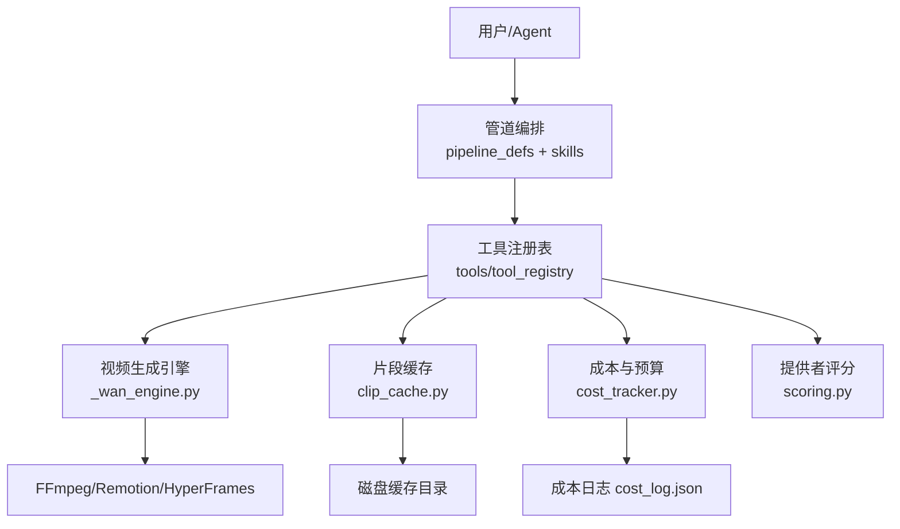
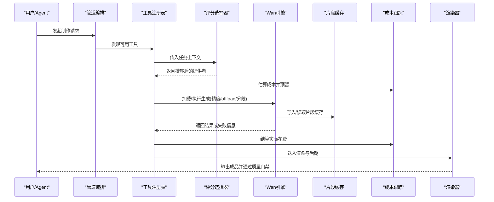
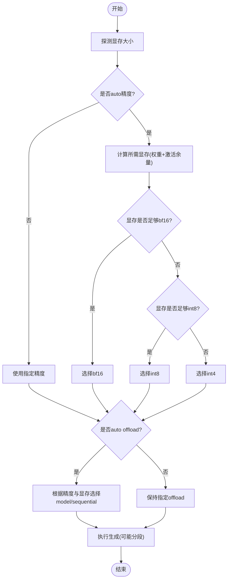
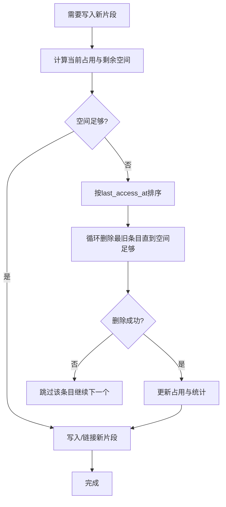
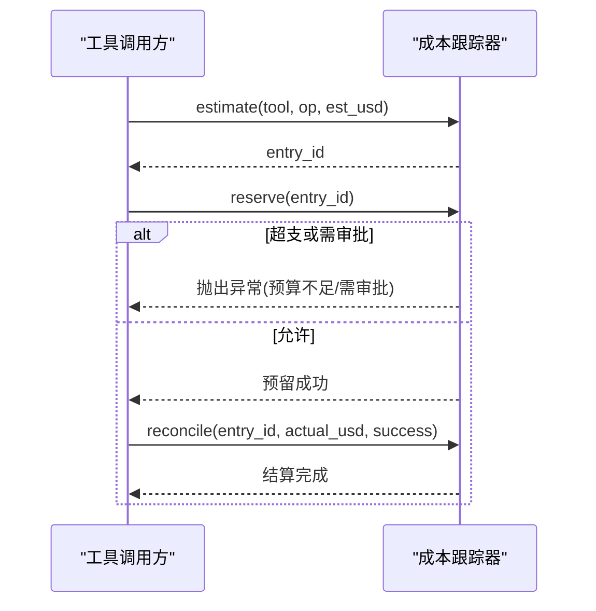
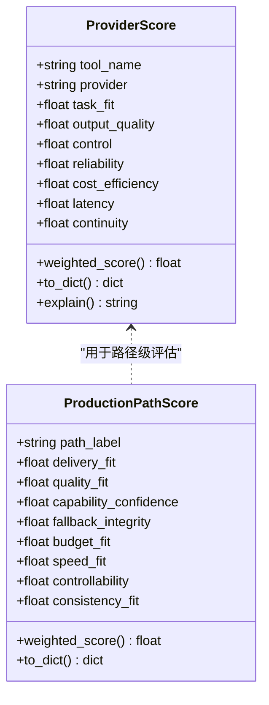
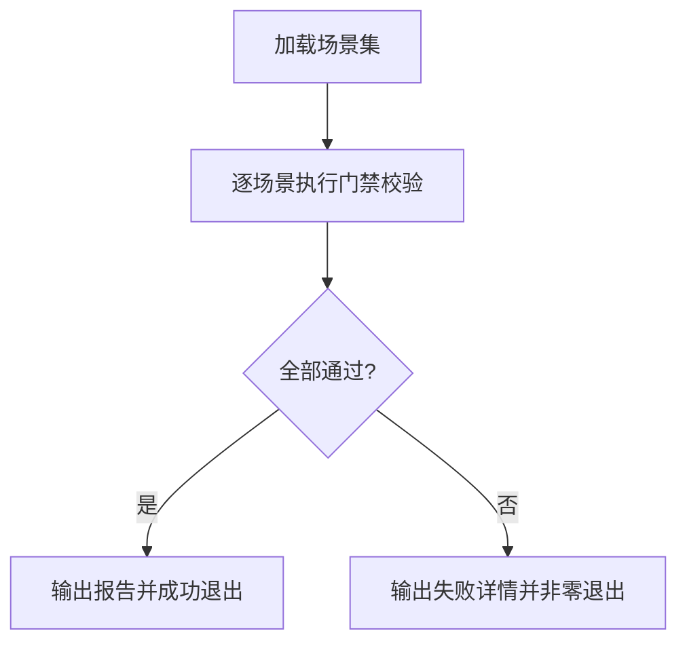
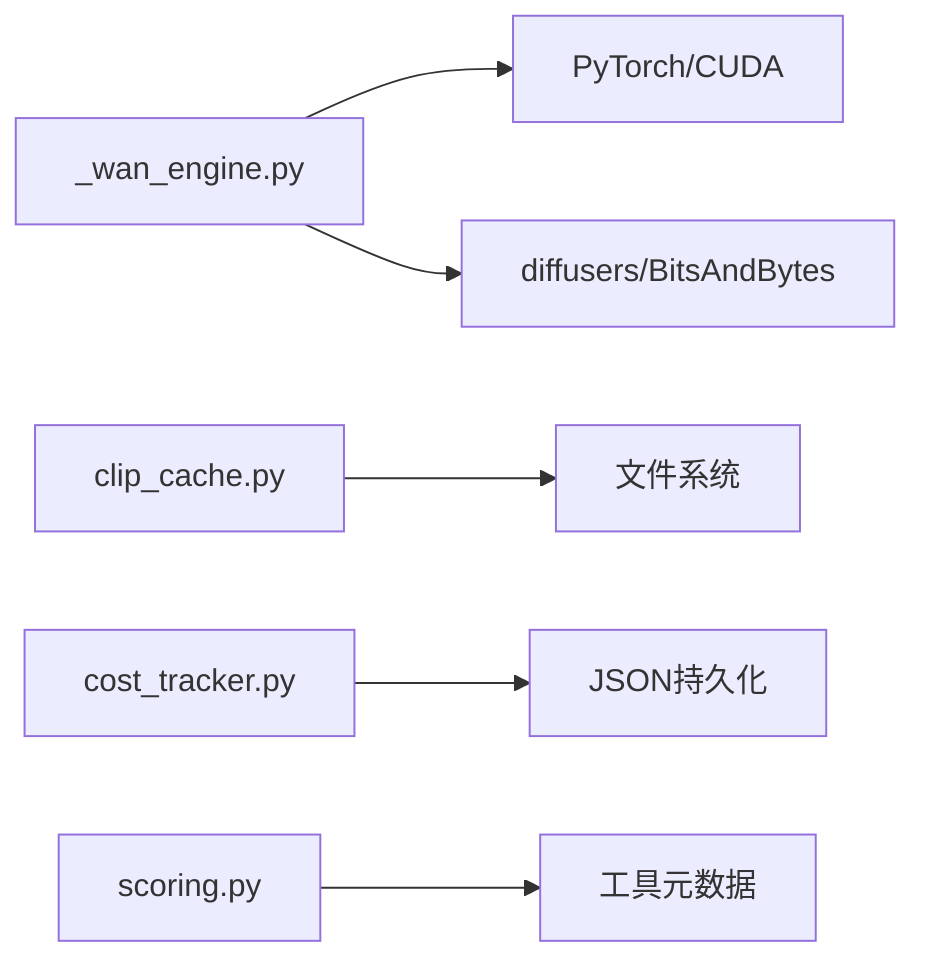

# 性能问题

<cite>
**本文引用的文件**
- [README.md](file://README.md)
- [config.yaml](file://config.yaml)
- [_wan_engine.py](file://tools/video/_wan_engine.py)
- [clip_cache.py](file://tools/video/clip_cache.py)
- [cost_tracker.py](file://tools/cost_tracker.py)
- [scoring.py](file://lib/scoring.py)
- [bench_runner.py](file://tests/eval/bench_runner.py)
</cite>

## 目录
1. [简介](#简介)
2. [项目结构](#项目结构)
3. [核心组件](#核心组件)
4. [架构总览](#架构总览)
5. [详细组件分析](#详细组件分析)
6. [依赖关系分析](#依赖关系分析)
7. [性能注意事项](#性能注意事项)
8. [故障排查指南](#故障排查指南)
9. [结论](#结论)
10. [附录](#附录)

## 简介
本指南面向OpenMontage在视频生成与后期处理中的性能问题诊断与优化，覆盖内存泄漏检测、CPU瓶颈定位、GPU显存管理、数据库与缓存策略、异步模式、基准测试与生产监控等主题。内容基于仓库中实际实现（如本地Wan引擎的显存自适应、片段缓存LRU、成本预算治理、评分选择器、基准运行器等），提供可操作的步骤、流程图与架构图，帮助你在开发与生产环境中稳定地提升吞吐、降低延迟并控制成本。

## 项目结构
OpenMontage采用“工具+管道+技能”的分层组织：工具层提供音视频生成、编辑与分析能力；管道定义编排流程；技能指导Agent如何正确调用工具与质量门禁。性能相关的关键位置包括：
- 本地视频生成引擎：tools/video/_wan_engine.py（显存自适应、量化、offload、错误诊断）
- 片段缓存：tools/video/clip_cache.py（LRU淘汰、磁盘落盘、并发安全）
- 成本与预算治理：tools/cost_tracker.py（估算、预留、审批、超支拦截）
- 提供者评分与选择：lib/scoring.py（多维打分、权重、连续性）
- 基准运行器：tests/eval/bench_runner.py（场景矩阵、质量门禁验证）
- 全局配置：config.yaml（输出参数、预算模式、检查点策略）

**图表来源**
- [README.md:450-475](file://README.md#L450-L475)
- [_wan_engine.py:1-20](file://tools/video/_wan_engine.py#L1-L20)
- [clip_cache.py:474-516](file://tools/video/clip_cache.py#L474-L516)
- [cost_tracker.py:1-10](file://tools/cost_tracker.py#L1-L10)
- [scoring.py:1-8](file://lib/scoring.py#L1-L8)

**章节来源**
- [README.md:450-475](file://README.md#L450-L475)
- [config.yaml:1-34](file://config.yaml#L1-L34)

## 核心组件
- 本地Wan视频生成引擎：自动精度选择、显存探测、分段拼接、offload模式、OOM诊断与降级建议。
- 片段缓存：基于LRU的磁盘级缓存，按最近访问时间淘汰，支持硬链接与回退复制，统计淘汰计数与字节数。
- 成本与预算治理：估算-预留-结算闭环，单动作阈值审批、新付费工具首次使用审批、超支告警或阻断。
- 提供者评分：七维加权评分（任务契合、质量、可控性、可靠性、成本效率、延迟、连续性），支持语义同义词扩展与上下文归一化。
- 基准运行器：构造多类合成场景，驱动质量门禁（幻灯片风险、多样性、交付承诺）进行回归验证。

**章节来源**
- [_wan_engine.py:101-177](file://tools/video/_wan_engine.py#L101-L177)
- [clip_cache.py:474-516](file://tools/video/clip_cache.py#L474-L516)
- [cost_tracker.py:40-179](file://tools/cost_tracker.py#L40-L179)
- [scoring.py:21-107](file://lib/scoring.py#L21-L107)
- [bench_runner.py:1-11](file://tests/eval/bench_runner.py#L1-L11)

## 架构总览
下图展示一次典型视频生成的关键路径：Agent读取管道与技能后，通过工具注册表选择具体提供者；若为本地模型则进入Wan引擎，执行显存自适应与分段生成；中间产物经片段缓存复用；成本系统对每次调用进行估算、预留与结算；最终由渲染器输出成品并通过质量门禁。

**图表来源**
- [scoring.py:373-542](file://lib/scoring.py#L373-L542)
- [_wan_engine.py:179-200](file://tools/video/_wan_engine.py#L179-L200)
- [clip_cache.py:474-516](file://tools/video/clip_cache.py#L474-L516)
- [cost_tracker.py:101-179](file://tools/cost_tracker.py#L101-L179)

## 详细组件分析

### 本地Wan引擎：显存自适应与OOM诊断
- 显存探测与精度选择：根据可见GPU显存与模型参数量自动选择bf16/int8/int4，避免过大权重导致OOM。
- Offload模式选择：在“完整驻留”和“顺序流式”之间权衡，前者更快但占用更多显存，后者释放显存但增加PCIe带宽压力。
- 分段生成：当目标时长超过单次生成长度时，将上一段的最后一帧作为下一段参考，逐步拼接至目标帧数。
- OOM诊断：识别NVML驱动不匹配导致的假性OOM，给出分辨率、片段长度、精度与offload模式的调整建议。

**图表来源**
- [_wan_engine.py:101-177](file://tools/video/_wan_engine.py#L101-L177)
- [_wan_engine.py:862-947](file://tools/video/_wan_engine.py#L862-L947)

**章节来源**
- [_wan_engine.py:101-177](file://tools/video/_wan_engine.py#L101-L177)
- [_wan_engine.py:862-947](file://tools/video/_wan_engine.py#L862-L947)

### 片段缓存：LRU淘汰与磁盘IO优化
- LRU淘汰：按最近访问时间排序，逐个删除最久未使用的条目直到满足新增空间需求；忽略已丢失的blob文件以非阻塞方式继续。
- 存储策略：优先硬链接，失败时回退到复制；记录淘汰次数与字节数以评估命中率与容量压力。
- 并发与锁：调用方持有锁保证一致性，避免竞态。

**图表来源**
- [clip_cache.py:474-516](file://tools/video/clip_cache.py#L474-L516)

**章节来源**
- [clip_cache.py:474-516](file://tools/video/clip_cache.py#L474-L516)

### 成本与预算治理：估算-预留-结算闭环
- 估算：记录工具与操作、预估费用，生成唯一ID。
- 预留：检查单动作阈值与新付费工具首次使用审批；在cap模式下超支直接拒绝，warn模式仅标记警告。
- 结算：执行完成后回填实际花费，释放预留额度；失败也计入支出。
- 持久化：成本日志JSON包含版本、预算、条目与已批准工具列表。

**图表来源**
- [cost_tracker.py:101-179](file://tools/cost_tracker.py#L101-L179)
- [cost_tracker.py:487-505](file://tools/cost_tracker.py#L487-L505)

**章节来源**
- [cost_tracker.py:40-179](file://tools/cost_tracker.py#L40-L179)
- [cost_tracker.py:487-505](file://tools/cost_tracker.py#L487-L505)

### 提供者评分与选择：多维加权与上下文归一化
- 维度：任务契合、输出质量、可控性、可靠性、成本效率、延迟、连续性，分别赋予不同权重形成综合得分。
- 上下文归一化：从意图、风格关键词、平台、能力描述中提取语义特征，增强匹配度。
- 同义词扩展：将cinematic/film/movie等词聚类，提高召回。
- 排名与呈现：对候选提供者排序并输出可读解释。

**图表来源**
- [scoring.py:21-107](file://lib/scoring.py#L21-L107)

**章节来源**
- [scoring.py:21-107](file://lib/scoring.py#L21-L107)
- [scoring.py:373-542](file://lib/scoring.py#L373-L542)

### 基准运行器：质量门禁与回归检测
- 场景矩阵：构造“好/坏”两类场景，覆盖镜头语言、文本卡片过载、伪电影感等。
- 门禁校验：驱动幻灯片风险、多样性、交付承诺等验证器，断言预期结果。
- 执行与报告：支持标签过滤与详细输出，失败时退出码非零便于CI集成。

**图表来源**
- [bench_runner.py:1-11](file://tests/eval/bench_runner.py#L1-L11)
- [bench_runner.py:478-491](file://tests/eval/bench_runner.py#L478-L491)

**章节来源**
- [bench_runner.py:1-11](file://tests/eval/bench_runner.py#L1-L11)
- [bench_runner.py:478-491](file://tests/eval/bench_runner.py#L478-L491)

## 依赖关系分析
- 低耦合高内聚：各模块职责清晰，Wan引擎专注推理与显存管理，缓存专注I/O与淘汰策略，成本跟踪专注财务治理，评分器专注决策依据。
- 外部依赖：PyTorch/CUDA用于显存探测与模型加载；diffusers/BitsAndBytes用于量化；FFmpeg/Remotion/HyperFrames用于渲染与后期。
- 潜在环依赖：通过工具注册表解耦调用方与被调工具，减少直接导入带来的耦合。

**图表来源**
- [_wan_engine.py:152-177](file://tools/video/_wan_engine.py#L152-L177)
- [clip_cache.py:523-524](file://tools/video/clip_cache.py#L523-L524)
- [cost_tracker.py:487-505](file://tools/cost_tracker.py#L487-L505)
- [scoring.py:373-542](file://lib/scoring.py#L373-L542)

**章节来源**
- [_wan_engine.py:152-177](file://tools/video/_wan_engine.py#L152-L177)
- [clip_cache.py:523-524](file://tools/video/clip_cache.py#L523-L524)
- [cost_tracker.py:487-505](file://tools/cost_tracker.py#L487-L505)
- [scoring.py:373-542](file://lib/scoring.py#L373-L542)

## 性能注意事项
- 内存与显存
  - 使用显存自适应精度与offload模式，避免大模型一次性驻留导致OOM。
  - 合理设置segment_frames与分辨率，必要时切换sequential offload释放显存。
  - 定期清理缓存与管线引用，触发垃圾回收与CUDA缓存清空。
- CPU与线程
  - 批量处理与流水线并行可减少启动开销；注意I/O与解码阶段的CPU热点。
  - 避免串行等待造成的瀑布效应，尽量并行独立任务。
- GPU资源管理
  - 监控显存峰值与利用率，结合NVML状态判断驱动匹配问题。
  - 对长时任务分片执行，及时释放中间张量与管线对象。
- 数据库与缓存
  - 对重复查询与媒体元数据建立LRU缓存，限制最大条目与TTL。
  - 使用硬链接减少复制开销，记录命中率与淘汰指标。
- 异步与批处理
  - 将生成、转码、上传等阶段解耦为队列任务，提升吞吐。
  - 对网络调用进行去重与合并，减少重复请求。
- 基准与回归
  - 构建场景矩阵，持续运行质量门禁，防止功能退化影响性能。
  - 将基准纳入CI，失败即阻断合并。

[本节为通用指导，不直接分析具体文件]

## 故障排查指南
- 显存不足与驱动不匹配
  - 现象：出现内部断言或“out of memory”，且提示nvmlInit失败。
  - 处理：重启以加载匹配的驱动内核；临时降低分辨率、片段长度或切换到更低的精度；启用sequential offload。
  - 参考路径：[_wan_engine.py:891-947](file://tools/video/_wan_engine.py#L891-L947)
- 缓存失效与磁盘占用过高
  - 现象：频繁淘汰、命中率下降、磁盘增长过快。
  - 处理：增大max_total_bytes、优化访问模式、清理孤立blob；观察evictions_count与bytes_evicted指标。
  - 参考路径：[clip_cache.py:474-516](file://tools/video/clip_cache.py#L474-L516)
- 成本超支与审批阻塞
  - 现象：预留阶段抛出预算不足或需审批异常。
  - 处理：调整预算上限、降低单次动作阈值、先批准新付费工具；查看成本日志确认实际花费。
  - 参考路径：[cost_tracker.py:117-179](file://tools/cost_tracker.py#L117-L179)
- 提供者选择不佳导致延迟或质量下降
  - 现象：选择的提供者成本高、延迟长或稳定性差。
  - 处理：检查任务上下文归一化是否正确；补充style_keywords与budget_remaining_usd；查看评分解释。
  - 参考路径：[scoring.py:297-359](file://lib/scoring.py#L297-L359)
- 基准失败定位
  - 现象：某场景的质量门禁未通过。
  - 处理：使用--verbose输出详细检查项；缩小到特定tag复现；修正场景设计或调整门禁阈值。
  - 参考路径：[bench_runner.py:478-491](file://tests/eval/bench_runner.py#L478-L491)

**章节来源**
- [_wan_engine.py:891-947](file://tools/video/_wan_engine.py#L891-L947)
- [clip_cache.py:474-516](file://tools/video/clip_cache.py#L474-L516)
- [cost_tracker.py:117-179](file://tools/cost_tracker.py#L117-L179)
- [scoring.py:297-359](file://lib/scoring.py#L297-L359)
- [bench_runner.py:478-491](file://tests/eval/bench_runner.py#L478-L491)

## 结论
OpenMontage在性能方面提供了完善的工程化支撑：本地Wan引擎的显存自适应与分段生成有效缓解GPU压力；片段缓存通过LRU与磁盘优化提升吞吐；成本治理确保预算可控；评分器保障提供者选择的可解释性与鲁棒性；基准运行器为质量与性能回归提供自动化保障。建议在开发中持续采集指标、完善场景矩阵，并在生产环境引入APM与告警，形成闭环的性能治理体系。

[本节为总结性内容，不直接分析具体文件]

## 附录
- 全局配置要点
  - 输出参数：默认格式、编码、分辨率、帧率、CRF等，影响渲染速度与质量。
  - 预算模式：observe/warn/cap三种模式，控制超支行为。
  - 检查点策略：guided/manual_all/auto_noncreative，影响恢复粒度与性能。
  - 参考路径：[config.yaml:1-34](file://config.yaml#L1-L34)

**章节来源**
- [config.yaml:1-34](file://config.yaml#L1-L34)